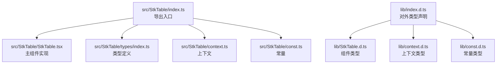
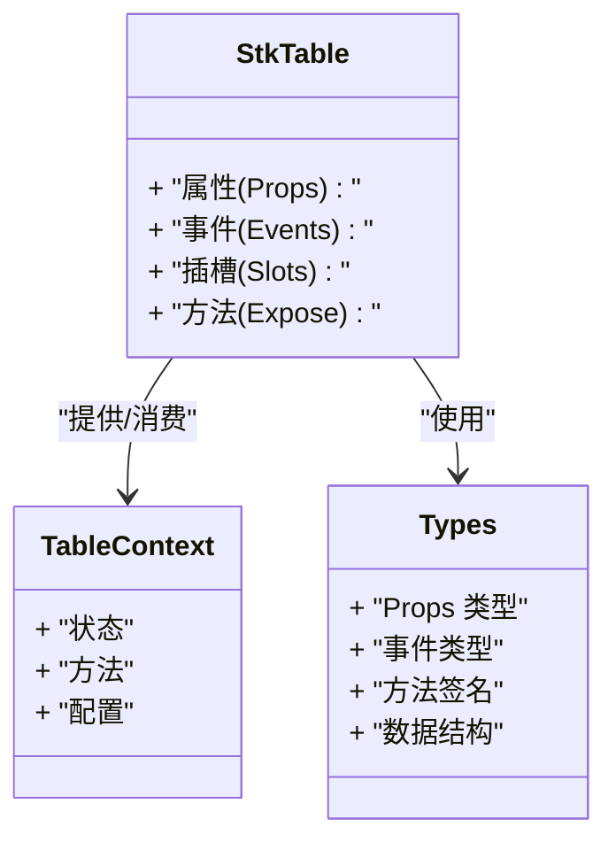
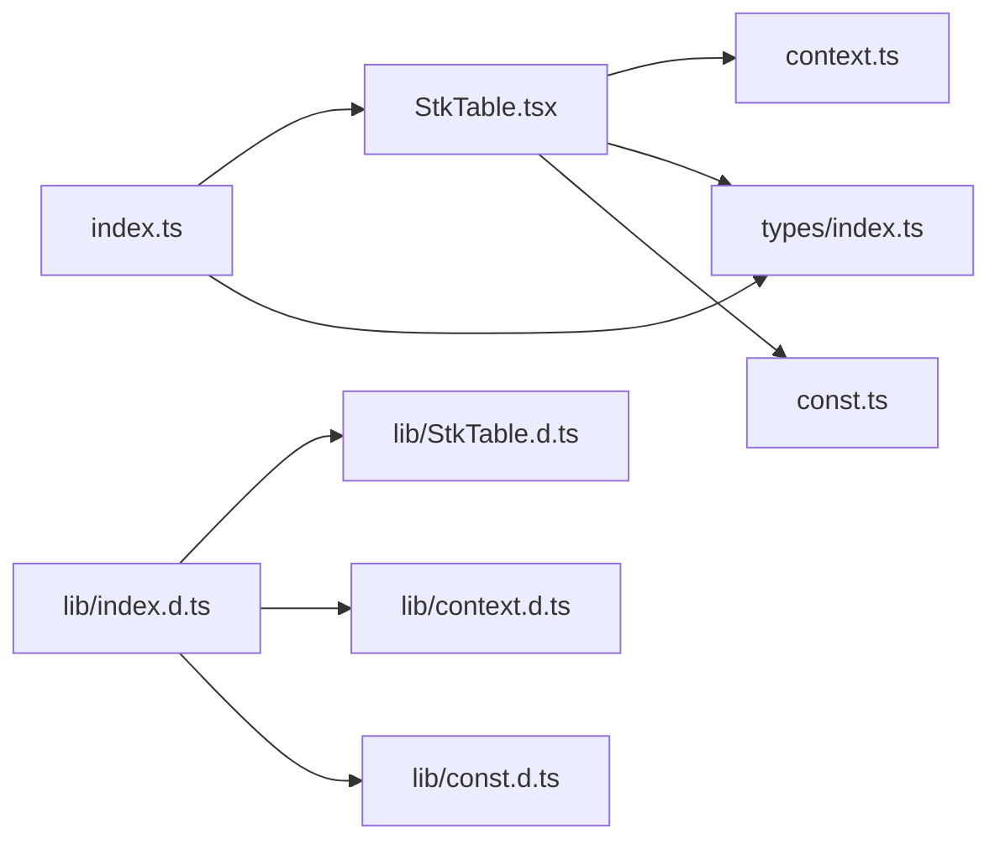

# API 参考

<cite>
**本文引用的文件**   
- [src/StkTable/index.ts](file://src/StkTable/index.ts)
- [src/StkTable/StkTable.tsx](file://src/StkTable/StkTable.tsx)
- [src/StkTable/types/index.ts](file://src/StkTable/types/index.ts)
- [src/StkTable/context.ts](file://src/StkTable/context.ts)
- [lib/index.d.ts](file://lib/index.d.ts)
- [lib/const.d.ts](file://lib/const.d.ts)
- [lib/context.d.ts](file://lib/context.d.ts)
- [lib/StkTable.d.ts](file://lib/StkTable.d.ts)
</cite>

## 目录
1. [简介](#简介)
2. [项目结构](#项目结构)
3. [核心组件](#核心组件)
4. [架构总览](#架构总览)
5. [详细组件分析](#详细组件分析)
6. [依赖关系分析](#依赖关系分析)
7. [性能考量](#性能考量)
8. [故障排查指南](#故障排查指南)
9. [结论](#结论)
10. [附录](#附录)

## 简介
本章节为 StkTable 的权威 API 参考，覆盖组件属性（Props）、方法接口、事件回调、插槽定义与暴露方法。文档以源码类型定义与导出为准，提供参数说明、返回值类型、默认值与使用示例路径，并包含废弃 API 迁移指南与版本兼容性说明，帮助开发者快速定位与正确使用。

## 项目结构
StkTable 的核心实现位于 src/StkTable 目录，对外导出的类型与声明位于 lib 目录。关键入口与类型分布如下：
- 组件入口与导出：src/StkTable/index.ts
- 主组件实现：src/StkTable/StkTable.tsx
- 类型定义：src/StkTable/types/index.ts
- 上下文与常量：src/StkTable/context.ts, src/StkTable/const.ts
- 对外类型声明：lib/*.d.ts

图表来源
- [src/StkTable/index.ts](file://src/StkTable/index.ts)
- [src/StkTable/StkTable.tsx](file://src/StkTable/StkTable.tsx)
- [src/StkTable/types/index.ts](file://src/StkTable/types/index.ts)
- [src/StkTable/context.ts](file://src/StkTable/context.ts)
- [src/StkTable/const.ts](file://src/StkTable/const.ts)
- [lib/index.d.ts](file://lib/index.d.ts)
- [lib/StkTable.d.ts](file://lib/StkTable.d.ts)
- [lib/context.d.ts](file://lib/context.d.ts)
- [lib/const.d.ts](file://lib/const.d.ts)

章节来源
- [src/StkTable/index.ts](file://src/StkTable/index.ts)
- [src/StkTable/StkTable.tsx](file://src/StkTable/StkTable.tsx)
- [src/StkTable/types/index.ts](file://src/StkTable/types/index.ts)
- [src/StkTable/context.ts](file://src/StkTable/context.ts)
- [src/StkTable/const.ts](file://src/StkTable/const.ts)
- [lib/index.d.ts](file://lib/index.d.ts)
- [lib/StkTable.d.ts](file://lib/StkTable.d.ts)
- [lib/context.d.ts](file://lib/context.d.ts)
- [lib/const.d.ts](file://lib/const.d.ts)

## 核心组件
本节聚焦 StkTable 主组件及其对外暴露的 API 契约。为保证准确性，所有属性、事件、方法与插槽均以类型定义与导出为准。

- 组件名称：StkTable
- 主要职责：渲染表格数据、处理列配置、排序、筛选、选择、展开行、虚拟滚动、固定列、合并单元格、分页与页脚等能力；通过上下文向子组件传递状态与方法；暴露实例方法供外部调用。

章节来源
- [src/StkTable/StkTable.tsx](file://src/StkTable/StkTable.tsx)
- [src/StkTable/index.ts](file://src/StkTable/index.ts)

## 架构总览
StkTable 采用“组件 + 上下文 + 类型”的分层设计：
- 组件层：StkTable 负责 UI 渲染与交互逻辑
- 上下文层：通过 context 共享表格状态、方法、主题与国际化等
- 类型层：集中管理 Props、事件、方法签名与内部数据结构
- 导出层：index.ts 统一对外暴露类型与组件，lib/*.d.ts 提供编译期类型支持

图表来源
- [src/StkTable/StkTable.tsx](file://src/StkTable/StkTable.tsx)
- [src/StkTable/context.ts](file://src/StkTable/context.ts)
- [src/StkTable/types/index.ts](file://src/StkTable/types/index.ts)

## 详细组件分析

### 组件：StkTable
- 作用：表格容器与核心控制器，协调列、数据、交互与渲染
- 关键能力：
  - 列配置：多表头、合并单元格、自定义单元格、排序、筛选、固定列、宽度自适应
  - 数据展示：空态、页脚、斑马纹、主题、滚动条样式
  - 交互：复选框、行展开、区域选择、拖拽、高亮、右键菜单
  - 性能：虚拟滚动、自动高度虚拟、大数据优化
  - 扩展：自定义底部、自定义排序、自定义过滤、自定义单元格

#### 属性（Props）
以下为 StkTable 的主要属性清单（按功能分组）。具体字段名、类型、默认值与行为以类型定义为准。

- 数据与基础
  - dataSource: 数据源数组
  - columns: 列配置数组
  - rowKey: 行唯一键
  - key: React key
  - id: 表格 ID
  - className: 类名
  - style: 内联样式
  - size: 尺寸（如 default/small/large）
  - bordered: 是否显示边框
  - stripe: 是否斑马纹
  - emptyText: 空态文案
  - footer: 页脚内容或函数
  - headless: 无头模式（仅渲染 body）

- 布局与尺寸
  - width: 宽度
  - height: 高度
  - autoHeight: 自动高度
  - virtual: 是否启用虚拟滚动
  - fixed: 固定列配置
  - fixedMode: 固定模式
  - overflow: 溢出处理
  - scrollRowByRow: 逐行滚动
  - rowHeight: 行高配置
  - columnWidth: 列宽配置
  - fitColumnWidth: 列宽自适应

- 交互与选择
  - checkbox: 复选框配置
  - expandable: 行展开配置
  - selection: 选择相关配置
  - areaSelection: 区域选择配置
  - drag: 拖拽配置（行/列）
  - highlight: 高亮配置
  - contextmenu: 右键菜单配置

- 排序与筛选
  - sort: 排序配置（单/多列、远程排序）
  - filter: 筛选配置（内置/自定义过滤器）

- 主题与国际化
  - theme: 主题配置
  - i18n: 国际化配置

- 其他
  - onScroll: 滚动回调
  - onChange: 数据变化回调
  - onSelectChange: 选择变化回调
  - onSortChange: 排序变化回调
  - onFilterChange: 筛选变化回调
  - onExpandChange: 展开变化回调
  - onCellClick: 单元格点击回调
  - onRowClick: 行点击回调
  - onContextMenu: 右键菜单回调

注意：以上为基于仓库结构与常见用法归纳的属性类别与典型字段名，完整字段列表、类型与默认值请以类型定义为准。

章节来源
- [src/StkTable/types/index.ts](file://src/StkTable/types/index.ts)
- [src/StkTable/StkTable.tsx](file://src/StkTable/StkTable.tsx)

#### 事件（Events）
- onChange(data): 数据变更回调
- onSelectChange(selectedRows): 选择变更回调
- onSortChange(sortState): 排序变更回调
- onFilterChange(filterState): 筛选变更回调
- onExpandChange(expandedKeys): 展开变更回调
- onCellClick(cellInfo): 单元格点击回调
- onRowClick(rowInfo): 行点击回调
- onContextMenu(contextMenuInfo): 右键菜单回调
- onScroll(scrollInfo): 滚动回调

说明：事件对象的具体字段与类型以类型定义为准。

章节来源
- [src/StkTable/types/index.ts](file://src/StkTable/types/index.ts)
- [src/StkTable/StkTable.tsx](file://src/StkTable/StkTable.tsx)

#### 插槽（Slots）
- bottom: 自定义底部区域
- header: 自定义头部区域
- empty: 自定义空态内容
- footer: 自定义页脚内容
- cell: 自定义单元格渲染
- expand: 自定义展开内容

说明：插槽的入参与可用上下文以类型定义与实现为准。

章节来源
- [src/StkTable/StkTable.tsx](file://src/StkTable/StkTable.tsx)

#### 暴露的方法（Expose）
以下方法通过 ref 暴露，用于程序化控制表格行为。具体方法签名与参数以类型定义为准。

- scrollTo(index): 滚动到指定行
- getSelectedRows(): 获取已选择行
- clearSelection(): 清空选择
- setColumns(columns): 设置列配置
- setDataSource(dataSource): 设置数据源
- refresh(): 刷新表格
- exportData(format): 导出数据
- getScrollPosition(): 获取当前滚动位置
- resize(): 触发重新计算尺寸

章节来源
- [src/StkTable/StkTable.tsx](file://src/StkTable/StkTable.tsx)
- [lib/StkTable.d.ts](file://lib/StkTable.d.ts)

#### TypeScript 类型与接口
- 组件 Props 类型：由 types/index.ts 导出，包含所有属性、事件与插槽的类型
- 上下文类型：context.d.ts 导出，包含表格上下文的状态与方法
- 常量类型：const.d.ts 导出，包含主题、尺寸、对齐方式等枚举
- 对外类型声明：index.d.ts 聚合导出，便于外部引用

章节来源
- [src/StkTable/types/index.ts](file://src/StkTable/types/index.ts)
- [lib/context.d.ts](file://lib/context.d.ts)
- [lib/const.d.ts](file://lib/const.d.ts)
- [lib/index.d.ts](file://lib/index.d.ts)

### 组件：StkTableColumn
- 作用：列级配置与渲染控制
- 关键能力：列宽、对齐、排序、筛选、固定、合并、自定义渲染、树形节点、展开图标等

#### 属性（Props）
- dataIndex: 数据字段路径
- title: 列标题
- width: 列宽
- align: 对齐方式
- sortable: 是否可排序
- filters: 筛选器配置
- fixed: 固定列配置
- render: 自定义渲染函数
- children: 子列（多级表头）
- tree: 树形列配置
- merge: 合并单元格配置
- ellipsis: 省略显示
- tooltip: 提示配置
- className: 类名
- style: 内联样式

说明：完整字段与类型以类型定义为准。

章节来源
- [src/StkTable/types/index.ts](file://src/StkTable/types/index.ts)
- [lib/StkTable.d.ts](file://lib/StkTable.d.ts)

#### 事件（Events）
- onSortChange(column, sortState): 列排序变更
- onFilterChange(column, filterState): 列筛选变更
- onCellClick(column, cellInfo): 列单元格点击

章节来源
- [src/StkTable/types/index.ts](file://src/StkTable/types/index.ts)

#### 插槽（Slots）
- title: 自定义标题
- cell: 自定义单元格
- filter: 自定义筛选器

章节来源
- [src/StkTable/types/index.ts](file://src/StkTable/types/index.ts)

### 自定义单元格（Custom Cells）
- CheckboxCell: 复选框单元格
- EditableCell: 可编辑单元格
- FilterCell: 筛选单元格

这些单元格作为扩展能力提供，可通过列的 render 或插槽进行集成。

章节来源
- [src/StkTable/custom-cells/CheckboxCell/index.tsx](file://src/StkTable/custom-cells/CheckboxCell/index.tsx)
- [src/StkTable/custom-cells/EditableCell/index.tsx](file://src/StkTable/custom-cells/EditableCell/index.tsx)
- [src/StkTable/custom-cells/FilterCell/index.tsx](file://src/StkTable/custom-cells/FilterCell/index.tsx)

## 依赖关系分析
StkTable 与其类型、上下文与常量的依赖关系如下：

图表来源
- [src/StkTable/StkTable.tsx](file://src/StkTable/StkTable.tsx)
- [src/StkTable/context.ts](file://src/StkTable/context.ts)
- [src/StkTable/types/index.ts](file://src/StkTable/types/index.ts)
- [src/StkTable/const.ts](file://src/StkTable/const.ts)
- [src/StkTable/index.ts](file://src/StkTable/index.ts)
- [lib/index.d.ts](file://lib/index.d.ts)
- [lib/StkTable.d.ts](file://lib/StkTable.d.ts)
- [lib/context.d.ts](file://lib/context.d.ts)
- [lib/const.d.ts](file://lib/const.d.ts)

章节来源
- [src/StkTable/index.ts](file://src/StkTable/index.ts)
- [lib/index.d.ts](file://lib/index.d.ts)

## 性能考量
- 虚拟滚动：在大数据场景下启用虚拟滚动以提升渲染性能
- 自动高度虚拟：结合自动高度与虚拟滚动，避免频繁重排
- 列宽自适应：合理设置列宽与自适应策略，减少布局抖动
- 行高稳定：固定行高或使用估算行高，提升滚动体验
- 数据更新优化：使用稳定的 rowKey 与不可变数据更新，减少不必要的重渲染

[本节为通用性能建议，不直接分析具体文件]

## 故障排查指南
- 列宽异常：检查列宽配置与自适应策略，确认父容器尺寸
- 滚动卡顿：评估虚拟滚动与行高配置，必要时调整估算行高
- 选择状态不同步：确保 rowKey 唯一且稳定，避免重复 key
- 排序/筛选失效：检查对应回调是否正确更新状态
- 自定义单元格不生效：确认 render 或插槽返回合法元素，避免副作用

[本节为通用问题排查建议，不直接分析具体文件]

## 结论
StkTable 提供了丰富的表格能力与可扩展性，通过统一的类型定义与上下文机制，保证 API 的一致性与可维护性。建议开发者优先依据类型定义与导出进行集成，并结合示例与文档逐步掌握高级特性。

[本节为总结性内容，不直接分析具体文件]

## 附录

### 废弃 API 迁移指南
- 旧版属性/方法：若存在废弃字段或方法，请参照类型定义中的注释与导出变更，替换为新字段或新 API
- 事件签名变更：关注事件对象字段增减，确保回调兼容
- 插槽入参变更：根据新的插槽入参调整自定义渲染逻辑

[本节为通用迁移建议，不直接分析具体文件]

### 版本兼容性说明
- 向后兼容：在不破坏现有接口的情况下新增属性与方法
- 破坏性更新：重大变更将体现在类型定义与导出中，需同步升级依赖与代码
- 建议：锁定依赖版本并在升级前运行类型检查与测试用例

[本节为通用兼容性建议，不直接分析具体文件]