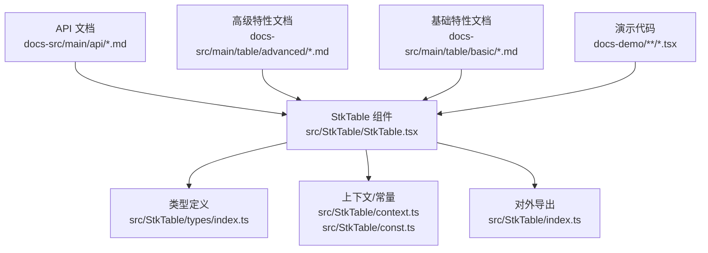
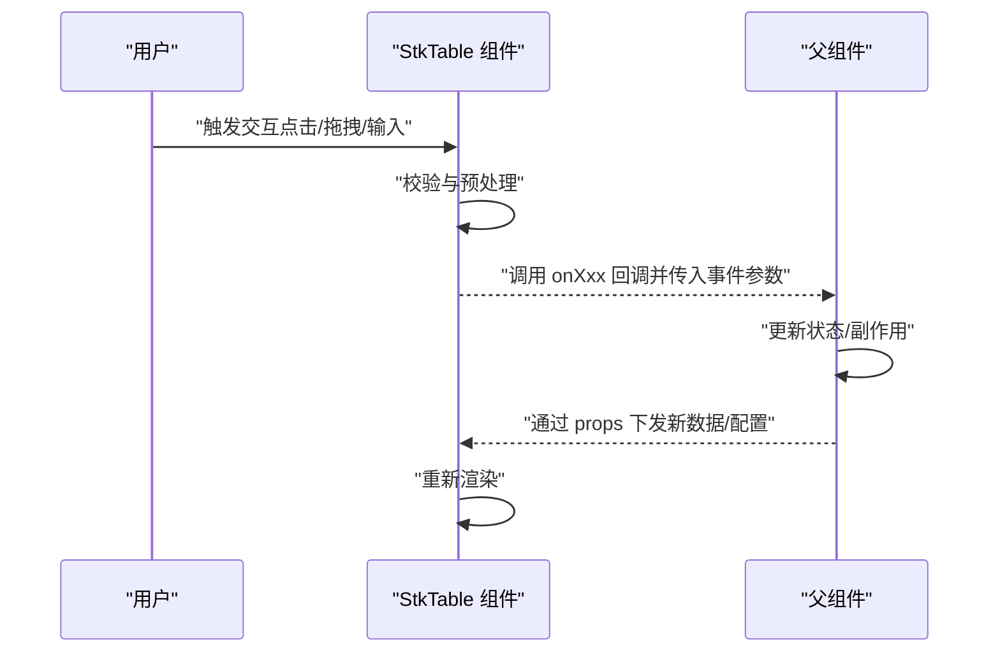
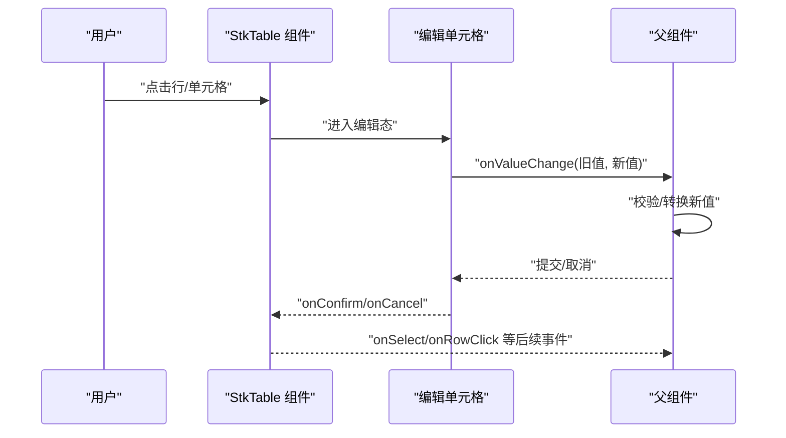
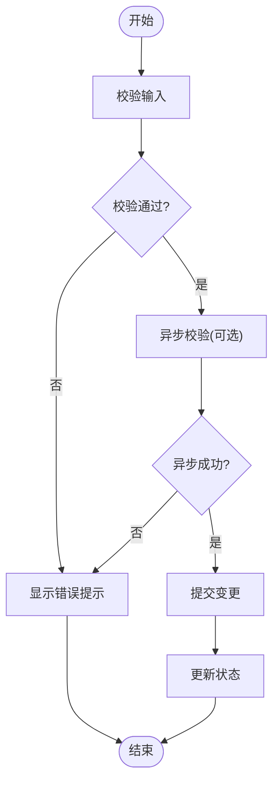
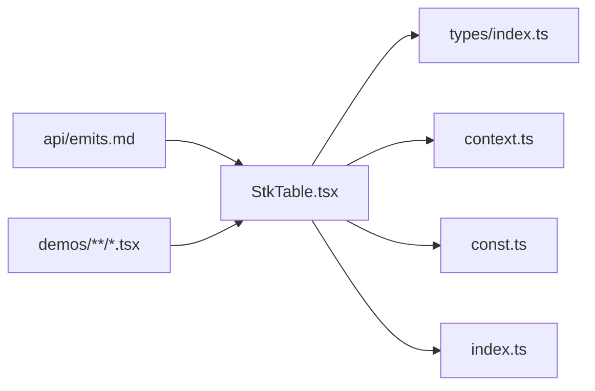

# 事件系统 (Events)

<cite>
**本文引用的文件**   
- [StkTable.tsx](file://src/StkTable/StkTable.tsx)
- [index.ts](file://src/StkTable/index.ts)
- [types/index.ts](file://src/StkTable/types/index.ts)
- [context.ts](file://src/StkTable/context.ts)
- [const.ts](file://src/StkTable/const.ts)
- [emits.md](file://docs-src/main/api/emits.md)
- [table-props.md](file://docs-src/main/api/table-props.md)
- [stk-table-column.md](file://docs-src/main/api/stk-table-column.md)
- [row-cell-mouse-event.md](file://docs-src/main/table/basic/row-cell-mouse-event.md)
- [area-selection.md](file://docs-src/main/table/advanced/area-selection.md)
- [row-drag.md](file://docs-src/main/table/advanced/row-drag.md)
- [header-drag.md](file://docs-src/main/table/advanced/header-drag.md)
- [custom-cells/editable-cell.md](file://docs-src/main/table/advanced/custom-cells/editable-cell.md)
- [cell-edit/index.tsx](file://docs-demo/demos/CellEdit/index.tsx)
- [cell-edit/EditCell.tsx](file://docs-demo/demos/CellEdit/EditCell.tsx)
- [huge-data/event.ts](file://docs-demo/demos/HugeData/event.ts)
- [AreaSelection.tsx](file://docs-demo/advanced/area-selection/AreaSelection.tsx)
- [RowDrag.tsx](file://docs-demo/advanced/row-drag/RowDrag.tsx)
- [HeaderDrag.tsx](file://docs-demo/advanced/header-drag/HeaderDrag.tsx)
</cite>

## 目录
1. [简介](#简介)
2. [项目结构](#项目结构)
3. [核心组件](#核心组件)
4. [架构总览](#架构总览)
5. [详细组件分析](#详细组件分析)
6. [依赖分析](#依赖分析)
7. [性能考虑](#性能考虑)
8. [故障排查指南](#故障排查指南)
9. [结论](#结论)
10. [附录](#附录)

## 简介
本章节面向 StkTable 的事件系统，提供一份完整的 API 文档与最佳实践。内容覆盖：
- 用户交互事件：行操作、列操作、选择、编辑、拖拽等
- 生命周期事件：初始化、数据变更、渲染完成等
- 事件机制：冒泡、委托、自定义事件
- 处理建议：参数说明、返回值类型、示例路径、错误处理与性能优化

## 项目结构
StkTable 的事件相关能力由以下部分构成：
- 组件入口与对外导出：负责暴露事件回调属性与类型定义
- 内部上下文与常量：用于在组件树中传递事件总线或状态
- 文档与演示：通过文档与示例展示各事件的触发时机与用法

图表来源
- [StkTable.tsx](file://src/StkTable/StkTable.tsx)
- [index.ts](file://src/StkTable/index.ts)
- [types/index.ts](file://src/StkTable/types/index.ts)
- [context.ts](file://src/StkTable/context.ts)
- [const.ts](file://src/StkTable/const.ts)
- [emits.md](file://docs-src/main/api/emits.md)
- [table-props.md](file://docs-src/main/api/table-props.md)
- [stk-table-column.md](file://docs-src/main/api/stk-table-column.md)
- [row-cell-mouse-event.md](file://docs-src/main/table/basic/row-cell-mouse-event.md)
- [area-selection.md](file://docs-src/main/table/advanced/area-selection.md)
- [row-drag.md](file://docs-src/main/table/advanced/row-drag.md)
- [header-drag.md](file://docs-src/main/table/advanced/header-drag.md)
- [custom-cells/editable-cell.md](file://docs-src/main/table/advanced/custom-cells/editable-cell.md)
- [cell-edit/index.tsx](file://docs-demo/demos/CellEdit/index.tsx)
- [cell-edit/EditCell.tsx](file://docs-demo/demos/CellEdit/EditCell.tsx)
- [huge-data/event.ts](file://docs-demo/demos/HugeData/event.ts)
- [AreaSelection.tsx](file://docs-demo/advanced/area-selection/AreaSelection.tsx)
- [RowDrag.tsx](file://docs-demo/advanced/row-drag/RowDrag.tsx)
- [HeaderDrag.tsx](file://docs-demo/advanced/header-drag/HeaderDrag.tsx)

章节来源
- [StkTable.tsx](file://src/StkTable/StkTable.tsx)
- [index.ts](file://src/StkTable/index.ts)
- [types/index.ts](file://src/StkTable/types/index.ts)
- [context.ts](file://src/StkTable/context.ts)
- [const.ts](file://src/StkTable/const.ts)
- [emits.md](file://docs-src/main/api/emits.md)
- [table-props.md](file://docs-src/main/api/table-props.md)
- [stk-table-column.md](file://docs-src/main/api/stk-table-column.md)
- [row-cell-mouse-event.md](file://docs-src/main/table/basic/row-cell-mouse-event.md)
- [area-selection.md](file://docs-src/main/table/advanced/area-selection.md)
- [row-drag.md](file://docs-src/main/table/advanced/row-drag.md)
- [header-drag.md](file://docs-src/main/table/advanced/header-drag.md)
- [custom-cells/editable-cell.md](file://docs-src/main/table/advanced/custom-cells/editable-cell.md)
- [cell-edit/index.tsx](file://docs-demo/demos/CellEdit/index.tsx)
- [cell-edit/EditCell.tsx](file://docs-demo/demos/CellEdit/EditCell.tsx)
- [huge-data/event.ts](file://docs-demo/demos/HugeData/event.ts)
- [AreaSelection.tsx](file://docs-demo/advanced/area-selection/AreaSelection.tsx)
- [RowDrag.tsx](file://docs-demo/advanced/row-drag/RowDrag.tsx)
- [HeaderDrag.tsx](file://docs-demo/advanced/header-drag/HeaderDrag.tsx)

## 核心组件
- StkTable 组件：作为事件系统的宿主，提供一系列以 onXxx 形式的事件回调属性，并在内部触发对应事件。
- 类型定义：集中声明事件参数与返回值的类型，确保调用方获得准确的类型提示。
- 上下文与常量：为事件相关的状态、标识符与默认值提供支撑。

章节来源
- [StkTable.tsx](file://src/StkTable/StkTable.tsx)
- [types/index.ts](file://src/StkTable/types/index.ts)
- [context.ts](file://src/StkTable/context.ts)
- [const.ts](file://src/StkTable/const.ts)

## 架构总览
StkTable 的事件流遵循“组件内派发 -> 父级回调”的单向数据流模式。典型流程如下：

图表来源
- [StkTable.tsx](file://src/StkTable/StkTable.tsx)
- [emits.md](file://docs-src/main/api/emits.md)
- [table-props.md](file://docs-src/main/api/table-props.md)

## 详细组件分析

### 行操作事件
- 常见事件
  - 行点击：包含行索引、行数据、列信息等
  - 行双击：用于快速编辑或展开详情
  - 行右键菜单：结合上下文菜单使用
  - 行选中/取消选中：与多选联动
- 触发时机
  - 鼠标按下/抬起、键盘导航、程序化选中
- 参数说明
  - 行唯一键、行数据对象、列信息、事件对象
- 返回值类型
  - 通常无返回值；如需阻止默认行为，参考具体事件文档
- 示例路径
  - [行/单元格鼠标事件文档](file://docs-src/main/table/basic/row-cell-mouse-event.md)
  - [行拖拽演示](file://docs-demo/advanced/row-drag/RowDrag.tsx)

章节来源
- [row-cell-mouse-event.md](file://docs-src/main/table/basic/row-cell-mouse-event.md)
- [row-drag.md](file://docs-src/main/table/advanced/row-drag.md)
- [RowDrag.tsx](file://docs-demo/advanced/row-drag/RowDrag.tsx)

### 列操作事件
- 常见事件
  - 列头点击排序：支持单列/多列排序
  - 列宽调整：拖拽改变列宽
  - 列头拖拽：移动列顺序
- 触发时机
  - 点击列头、拖拽列宽手柄、拖拽列头
- 参数说明
  - 列 key、排序方向、列宽变化量、拖拽源/目标列信息
- 返回值类型
  - 通常无返回值；可通过 props 控制是否允许排序/调整宽度
- 示例路径
  - [列头拖拽文档](file://docs-src/main/table/advanced/header-drag.md)
  - [列宽调整演示](file://docs-demo/advanced/column-resize/ColResizable.tsx)

章节来源
- [header-drag.md](file://docs-src/main/table/advanced/header-drag.md)
- [stk-table-column.md](file://docs-src/main/api/stk-table-column.md)

### 选择事件
- 常见事件
  - 单选/多选切换
  - 全选/全不选
  - 区域选择（配合高级特性）
- 触发时机
  - 点击复选框、Shift/Ctrl 组合选择、拖拽区域选择
- 参数说明
  - 选中行 keys、当前选中项、事件对象
- 返回值类型
  - 通常无返回值；受控模式下由父组件维护选中状态
- 示例路径
  - [区域选择文档](file://docs-src/main/table/advanced/area-selection.md)
  - [区域选择演示](file://docs-demo/advanced/area-selection/AreaSelection.tsx)

章节来源
- [area-selection.md](file://docs-src/main/table/advanced/area-selection.md)
- [AreaSelection.tsx](file://docs-demo/advanced/area-selection/AreaSelection.tsx)

### 编辑事件
- 常见事件
  - 开始编辑、确认编辑、取消编辑、编辑值变更
- 触发时机
  - 进入编辑态、提交表单、失焦、回车/ESC
- 参数说明
  - 行 key、列 key、旧值、新值、编辑上下文
- 返回值类型
  - 可返回 Promise 以异步校验；返回 false 可阻止提交
- 示例路径
  - [可编辑单元格文档](file://docs-src/main/table/advanced/custom-cells/editable-cell.md)
  - [单元格编辑演示](file://docs-demo/demos/CellEdit/index.tsx)
  - [编辑单元格实现](file://docs-demo/demos/CellEdit/EditCell.tsx)

章节来源
- [custom-cells/editable-cell.md](file://docs-src/main/table/advanced/custom-cells/editable-cell.md)
- [cell-edit/index.tsx](file://docs-demo/demos/CellEdit/index.tsx)
- [cell-edit/EditCell.tsx](file://docs-demo/demos/CellEdit/EditCell.tsx)

### 拖拽事件
- 常见事件
  - 行拖拽：拖拽开始、拖拽结束、放置目标
  - 列头拖拽：移动列顺序
- 触发时机
  - 鼠标/触摸拖拽交互
- 参数说明
  - 源行/列、目标行/列、拖拽位置、事件对象
- 返回值类型
  - 通常无返回值；通过更新数据源实现重排
- 示例路径
  - [行拖拽文档](file://docs-src/main/table/advanced/row-drag.md)
  - [列头拖拽文档](file://docs-src/main/table/advanced/header-drag.md)
  - [行拖拽演示](file://docs-demo/advanced/row-drag/RowDrag.tsx)
  - [列头拖拽演示](file://docs-demo/advanced/header-drag/HeaderDrag.tsx)

章节来源
- [row-drag.md](file://docs-src/main/table/advanced/row-drag.md)
- [header-drag.md](file://docs-src/main/table/advanced/header-drag.md)
- [RowDrag.tsx](file://docs-demo/advanced/row-drag/RowDrag.tsx)
- [HeaderDrag.tsx](file://docs-demo/advanced/header-drag/HeaderDrag.tsx)

### 选择与编辑的组合流程（序列图）

图表来源
- [cell-edit/index.tsx](file://docs-demo/demos/CellEdit/index.tsx)
- [cell-edit/EditCell.tsx](file://docs-demo/demos/CellEdit/EditCell.tsx)
- [StkTable.tsx](file://src/StkTable/StkTable.tsx)

### 复杂逻辑流程图（编辑校验）

图表来源
- [cell-edit/EditCell.tsx](file://docs-demo/demos/CellEdit/EditCell.tsx)
- [cell-edit/index.tsx](file://docs-demo/demos/CellEdit/index.tsx)

## 依赖分析
- 组件与类型
  - StkTable 组件依赖类型定义与上下文，保证事件参数与返回值的类型安全
- 文档与演示
  - 文档与演示代码共同验证事件的行为与边界条件

图表来源
- [StkTable.tsx](file://src/StkTable/StkTable.tsx)
- [types/index.ts](file://src/StkTable/types/index.ts)
- [context.ts](file://src/StkTable/context.ts)
- [const.ts](file://src/StkTable/const.ts)
- [index.ts](file://src/StkTable/index.ts)
- [emits.md](file://docs-src/main/api/emits.md)

章节来源
- [StkTable.tsx](file://src/StkTable/StkTable.tsx)
- [types/index.ts](file://src/StkTable/types/index.ts)
- [context.ts](file://src/StkTable/context.ts)
- [const.ts](file://src/StkTable/const.ts)
- [index.ts](file://src/StkTable/index.ts)
- [emits.md](file://docs-src/main/api/emits.md)

## 性能考虑
- 事件节流与防抖
  - 对高频事件（如滚动、拖拽、输入）进行节流/防抖，减少回调频率
- 事件委托
  - 在容器层统一监听并分发到子元素，降低事件监听器数量
- 计算与副作用分离
  - 将昂贵计算放入 useMemo/useCallback，避免每次渲染重复执行
- 大数据场景
  - 结合虚拟列表与分页，减少 DOM 节点数量，降低事件处理开销
- 示例参考
  - [大数据事件处理示例](file://docs-demo/demos/HugeData/event.ts)

章节来源
- [huge-data/event.ts](file://docs-demo/demos/HugeData/event.ts)

## 故障排查指南
- 常见问题
  - 事件未触发：检查事件名拼写、是否被其他组件拦截、是否在受控模式下正确更新状态
  - 参数为空：确认行/列 key 是否存在、数据源是否已加载
  - 循环更新：避免在事件回调中直接修改导致无限渲染的状态
- 调试建议
  - 打印事件参数与堆栈
  - 使用浏览器开发者工具断点调试
  - 逐步缩小范围，定位是哪个回调导致异常
- 错误处理策略
  - 在回调中使用 try/catch 包裹关键逻辑
  - 对异步校验失败给出明确的用户反馈
  - 记录错误日志便于追踪

[本节为通用指导，不直接分析具体文件]

## 结论
StkTable 的事件系统以清晰的回调接口为核心，结合类型定义与上下文管理，提供了丰富的交互能力。通过合理的事件委托、节流防抖与错误处理策略，可以在保证功能完整性的同时获得良好的性能表现。

[本节为总结性内容，不直接分析具体文件]

## 附录

### 事件分类速查表
- 行操作：行点击、行双击、行右键、行选中/取消
- 列操作：列头排序、列宽调整、列头拖拽
- 选择：单选/多选、全选、区域选择
- 编辑：开始/确认/取消编辑、值变更
- 拖拽：行拖拽、列头拖拽
- 生命周期：初始化、数据变更、渲染完成（详见 emits 文档）

章节来源
- [emits.md](file://docs-src/main/api/emits.md)
- [table-props.md](file://docs-src/main/api/table-props.md)
- [stk-table-column.md](file://docs-src/main/api/stk-table-column.md)
- [row-cell-mouse-event.md](file://docs-src/main/table/basic/row-cell-mouse-event.md)
- [area-selection.md](file://docs-src/main/table/advanced/area-selection.md)
- [row-drag.md](file://docs-src/main/table/advanced/row-drag.md)
- [header-drag.md](file://docs-src/main/table/advanced/header-drag.md)
- [custom-cells/editable-cell.md](file://docs-src/main/table/advanced/custom-cells/editable-cell.md)