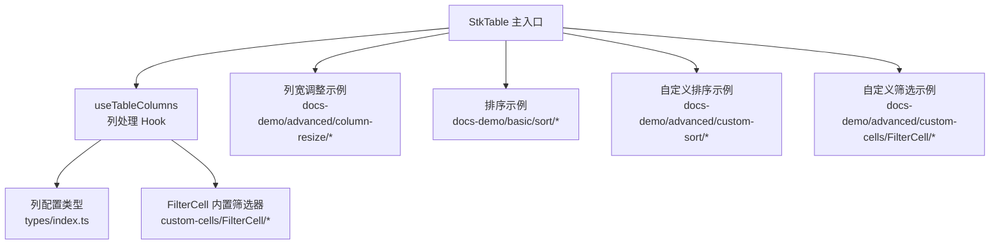
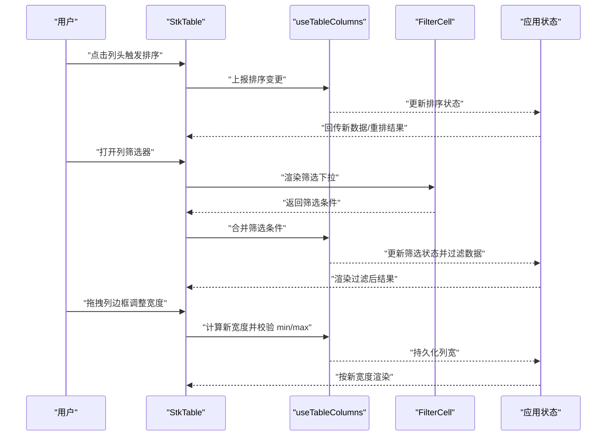
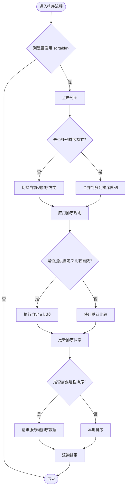
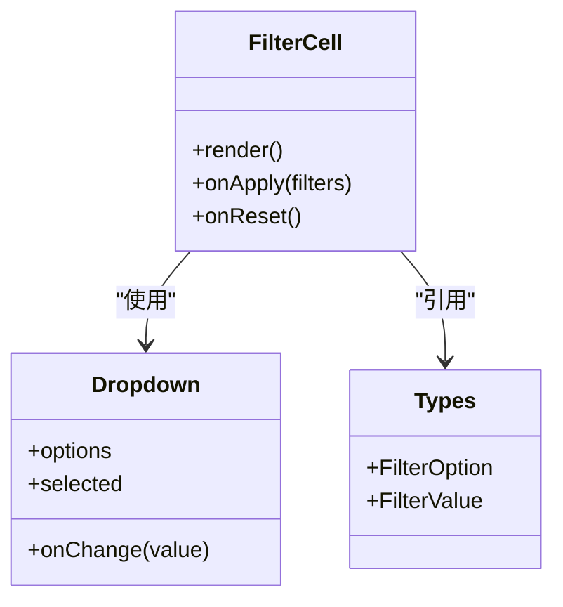
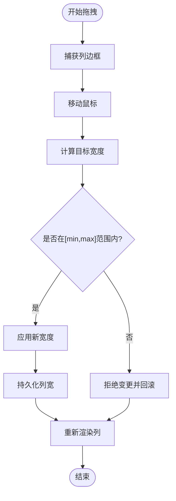
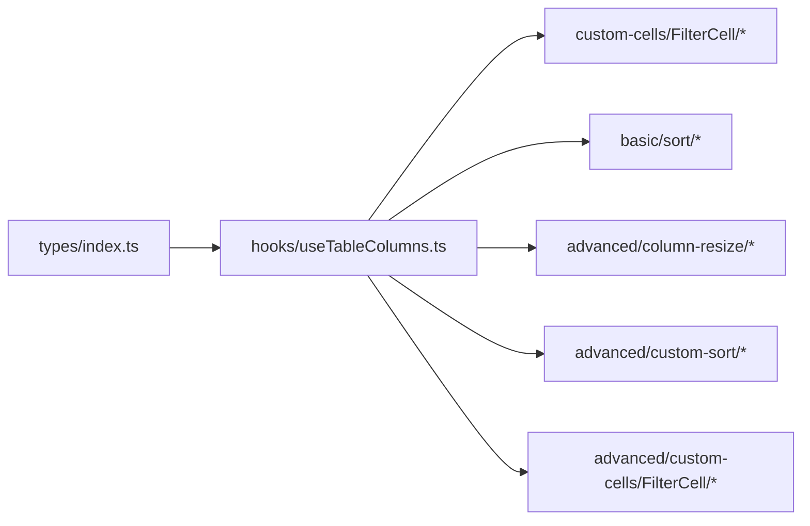

# 列交互配置

<cite>
**本文引用的文件**   
- [src/StkTable/types/index.ts](file://src/StkTable/types/index.ts)
- [src/StkTable/hooks/useTableColumns.ts](file://src/StkTable/hooks/useTableColumns.ts)
- [src/StkTable/custom-cells/FilterCell/index.tsx](file://src/StkTable/custom-cells/FilterCell/index.tsx)
- [src/StkTable/custom-cells/FilterCell/Dropdown.tsx](file://src/StkTable/custom-cells/FilterCell/Dropdown.tsx)
- [src/StkTable/custom-cells/FilterCell/types.ts](file://src/StkTable/custom-cells/FilterCell/types.ts)
- [docs-demo/advanced/column-resize/ColResizable.tsx](file://docs-demo/advanced/column-resize/ColResizable.tsx)
- [docs-demo/basic/sort/DefaultSort.tsx](file://docs-demo/basic/sort/DefaultSort.tsx)
- [docs-demo/basic/sort/MultiSort.tsx](file://docs-demo/basic/sort/MultiSort.tsx)
- [docs-demo/basic/sort/CustomSort.tsx](file://docs-demo/basic/sort/CustomSort.tsx)
- [docs-demo/advanced/custom-sort/CustomSort/index.tsx](file://docs-demo/advanced/custom-sort/CustomSort/index.tsx)
- [docs-demo/advanced/custom-cells/FilterCell/index.tsx](file://docs-demo/advanced/custom-cells/FilterCell/index.tsx)
- [docs-demo/advanced/custom-cells/FilterCell/CustomFilter.tsx](file://docs-demo/advanced/custom-cells/FilterCell/CustomFilter.tsx)
- [docs-src/main/api/stk-table-column.md](file://docs-src/main/api/stk-table-column.md)
- [docs-src/main/table/basic/sort.md](file://docs-src/main/table/basic/sort.md)
- [docs-src/main/table/advanced/column-resize.md](file://docs-src/main/table/advanced/column-resize.md)
</cite>

## 目录
1. [简介](#简介)
2. [项目结构](#项目结构)
3. [核心组件](#核心组件)
4. [架构总览](#架构总览)
5. [详细组件分析](#详细组件分析)
6. [依赖分析](#依赖分析)
7. [性能考虑](#性能考虑)
8. [故障排查指南](#故障排查指南)
9. [结论](#结论)
10. [附录](#附录)

## 简介
本章节聚焦 StkTable 的“列交互配置”，围绕以下能力进行系统化说明：
- 排序（sortable）：单列/多列排序、排序方向、自定义排序函数与远程排序。
- 筛选（filterable）：内置筛选器与自定义筛选器的接入方式。
- 可调整宽度（resizable）：最小/最大宽度、拖拽行为与边界约束。
并通过示例路径展示组合用法，帮助读者快速落地到实际业务场景。

## 项目结构
与列交互相关的代码主要分布在如下位置：
- 类型定义与列配置接口：src/StkTable/types/index.ts
- 列处理 Hook：src/StkTable/hooks/useTableColumns.ts
- 内置筛选单元格：src/StkTable/custom-cells/FilterCell/*
- 文档示例：docs-demo 下的排序、筛选、列宽调整示例
- API 文档：docs-src/main/api 与 docs-src/main/table 相关页面

图表来源
- [src/StkTable/hooks/useTableColumns.ts](file://src/StkTable/hooks/useTableColumns.ts)
- [src/StkTable/types/index.ts](file://src/StkTable/types/index.ts)
- [src/StkTable/custom-cells/FilterCell/index.tsx](file://src/StkTable/custom-cells/FilterCell/index.tsx)
- [docs-demo/advanced/column-resize/ColResizable.tsx](file://docs-demo/advanced/column-resize/ColResizable.tsx)
- [docs-demo/basic/sort/DefaultSort.tsx](file://docs-demo/basic/sort/DefaultSort.tsx)
- [docs-demo/advanced/custom-sort/CustomSort/index.tsx](file://docs-demo/advanced/custom-sort/CustomSort/index.tsx)
- [docs-demo/advanced/custom-cells/FilterCell/index.tsx](file://docs-demo/advanced/custom-cells/FilterCell/index.tsx)

章节来源
- [src/StkTable/types/index.ts](file://src/StkTable/types/index.ts)
- [src/StkTable/hooks/useTableColumns.ts](file://src/StkTable/hooks/useTableColumns.ts)
- [src/StkTable/custom-cells/FilterCell/index.tsx](file://src/StkTable/custom-cells/FilterCell/index.tsx)
- [docs-demo/advanced/column-resize/ColResizable.tsx](file://docs-demo/advanced/column-resize/ColResizable.tsx)
- [docs-demo/basic/sort/DefaultSort.tsx](file://docs-demo/basic/sort/DefaultSort.tsx)
- [docs-demo/advanced/custom-sort/CustomSort/index.tsx](file://docs-demo/advanced/custom-sort/CustomSort/index.tsx)
- [docs-demo/advanced/custom-cells/FilterCell/index.tsx](file://docs-demo/advanced/custom-cells/FilterCell/index.tsx)

## 核心组件
- 列配置类型与属性
  - sortable：启用列排序开关
  - filterable：启用列筛选开关
  - resizable：启用列宽拖拽调整
  - 其他常见列属性（如 width、minWidth、maxWidth、align、title 等）用于配合交互使用
- 内置筛选器 FilterCell
  - 提供下拉式筛选 UI，支持多选、搜索过滤等扩展点
  - 通过 column.filterCell 或 table 级配置注入
- 排序与多列排序
  - 默认比较逻辑基于字段值；可通过自定义比较函数覆盖
  - 支持多列排序状态管理
- 列宽调整
  - 支持最小/最大宽度限制与拖拽边界控制

章节来源
- [src/StkTable/types/index.ts](file://src/StkTable/types/index.ts)
- [src/StkTable/custom-cells/FilterCell/index.tsx](file://src/StkTable/custom-cells/FilterCell/index.tsx)
- [src/StkTable/custom-cells/FilterCell/Dropdown.tsx](file://src/StkTable/custom-cells/FilterCell/Dropdown.tsx)
- [src/StkTable/custom-cells/FilterCell/types.ts](file://src/StkTable/custom-cells/FilterCell/types.ts)

## 架构总览
下图展示了列交互在表格中的调用链路与数据流向：用户操作触发列事件（排序/筛选/拖拽），由 useTableColumns 协调状态，FilterCell 负责筛选 UI 与回调，最终更新表格渲染。

图表来源
- [src/StkTable/hooks/useTableColumns.ts](file://src/StkTable/hooks/useTableColumns.ts)
- [src/StkTable/custom-cells/FilterCell/index.tsx](file://src/StkTable/custom-cells/FilterCell/index.tsx)
- [src/StkTable/custom-cells/FilterCell/Dropdown.tsx](file://src/StkTable/custom-cells/FilterCell/Dropdown.tsx)

## 详细组件分析

### 排序（sortable）
- 基本能力
  - 单列排序：在列配置中开启 sortable，点击列头切换升序/降序/无排序。
  - 多列排序：同时维护多个列的排序键与方向，优先级从左到右。
- 高级特性
  - 自定义排序函数：当默认排序不满足需求时，可在列配置中提供比较函数以覆盖默认行为。
  - 空值处理：对 null/undefined 的排序策略可按需定制。
  - 远程排序：将排序状态同步至服务端，由后端完成排序并返回数据。
- 典型示例路径
  - 基础排序：[docs-demo/basic/sort/DefaultSort.tsx](file://docs-demo/basic/sort/DefaultSort.tsx)
  - 多列排序：[docs-demo/basic/sort/MultiSort.tsx](file://docs-demo/basic/sort/MultiSort.tsx)
  - 自定义排序：[docs-demo/basic/sort/CustomSort.tsx](file://docs-demo/basic/sort/CustomSort.tsx)、[docs-demo/advanced/custom-sort/CustomSort/index.tsx](file://docs-demo/advanced/custom-sort/CustomSort/index.tsx)
  - 远程排序：参考排序文档页

图表来源
- [src/StkTable/hooks/useTableColumns.ts](file://src/StkTable/hooks/useTableColumns.ts)
- [docs-demo/basic/sort/DefaultSort.tsx](file://docs-demo/basic/sort/DefaultSort.tsx)
- [docs-demo/basic/sort/MultiSort.tsx](file://docs-demo/basic/sort/MultiSort.tsx)
- [docs-demo/basic/sort/CustomSort.tsx](file://docs-demo/basic/sort/CustomSort.tsx)
- [docs-demo/advanced/custom-sort/CustomSort/index.tsx](file://docs-demo/advanced/custom-sort/CustomSort/index.tsx)

章节来源
- [docs-demo/basic/sort/DefaultSort.tsx](file://docs-demo/basic/sort/DefaultSort.tsx)
- [docs-demo/basic/sort/MultiSort.tsx](file://docs-demo/basic/sort/MultiSort.tsx)
- [docs-demo/basic/sort/CustomSort.tsx](file://docs-demo/basic/sort/CustomSort.tsx)
- [docs-demo/advanced/custom-sort/CustomSort/index.tsx](file://docs-demo/advanced/custom-sort/CustomSort/index.tsx)
- [docs-src/main/table/basic/sort.md](file://docs-src/main/table/basic/sort.md)

### 筛选（filterable）
- 启用方式
  - 在列配置中设置 filterable 为 true，即可启用该列的筛选入口。
- 内置筛选器
  - 使用 FilterCell 提供的下拉筛选 UI，支持多选、搜索等扩展能力。
  - 通过 column.filterCell 或全局配置注入筛选器实例。
- 自定义筛选器
  - 提供自定义筛选组件，实现更复杂的筛选逻辑（如范围选择、正则匹配等）。
  - 自定义筛选器需要遵循统一的回调约定，向表格上报筛选条件。
- 典型示例路径
  - 内置筛选器：[src/StkTable/custom-cells/FilterCell/index.tsx](file://src/StkTable/custom-cells/FilterCell/index.tsx)、[src/StkTable/custom-cells/FilterCell/Dropdown.tsx](file://src/StkTable/custom-cells/FilterCell/Dropdown.tsx)
  - 自定义筛选器示例：[docs-demo/advanced/custom-cells/FilterCell/index.tsx](file://docs-demo/advanced/custom-cells/FilterCell/index.tsx)、[docs-demo/advanced/custom-cells/FilterCell/CustomFilter.tsx](file://docs-demo/advanced/custom-cells/FilterCell/CustomFilter.tsx)

图表来源
- [src/StkTable/custom-cells/FilterCell/index.tsx](file://src/StkTable/custom-cells/FilterCell/index.tsx)
- [src/StkTable/custom-cells/FilterCell/Dropdown.tsx](file://src/StkTable/custom-cells/FilterCell/Dropdown.tsx)
- [src/StkTable/custom-cells/FilterCell/types.ts](file://src/StkTable/custom-cells/FilterCell/types.ts)

章节来源
- [src/StkTable/custom-cells/FilterCell/index.tsx](file://src/StkTable/custom-cells/FilterCell/index.tsx)
- [src/StkTable/custom-cells/FilterCell/Dropdown.tsx](file://src/StkTable/custom-cells/FilterCell/Dropdown.tsx)
- [src/StkTable/custom-cells/FilterCell/types.ts](file://src/StkTable/custom-cells/FilterCell/types.ts)
- [docs-demo/advanced/custom-cells/FilterCell/index.tsx](file://docs-demo/advanced/custom-cells/FilterCell/index.tsx)
- [docs-demo/advanced/custom-cells/FilterCell/CustomFilter.tsx](file://docs-demo/advanced/custom-cells/FilterCell/CustomFilter.tsx)

### 可调整宽度（resizable）
- 启用方式
  - 在列配置中设置 resizable 为 true，即可启用该列的拖拽调整宽度。
- 宽度约束
  - minWidth：拖拽的最小宽度，防止列过窄影响可读性。
  - maxWidth：拖拽的最大宽度，避免列过宽破坏布局。
- 拖拽行为
  - 支持鼠标拖拽列边框调整宽度，实时预览并落盘。
  - 可与固定列、虚拟滚动等特性协同工作。
- 典型示例路径
  - 列宽调整示例：[docs-demo/advanced/column-resize/ColResizable.tsx](file://docs-demo/advanced/column-resize/ColResizable.tsx)
  - 列宽调整文档：[docs-src/main/table/advanced/column-resize.md](file://docs-src/main/table/advanced/column-resize.md)

图表来源
- [docs-demo/advanced/column-resize/ColResizable.tsx](file://docs-demo/advanced/column-resize/ColResizable.tsx)
- [docs-src/main/table/advanced/column-resize.md](file://docs-src/main/table/advanced/column-resize.md)

章节来源
- [docs-demo/advanced/column-resize/ColResizable.tsx](file://docs-demo/advanced/column-resize/ColResizable.tsx)
- [docs-src/main/table/advanced/column-resize.md](file://docs-src/main/table/advanced/column-resize.md)

### 组合示例与最佳实践
- 排序 + 筛选
  - 在同一张表中同时启用 sortable 与 filterable，先筛选再排序，保证用户体验一致。
- 排序 + 列宽调整
  - 对关键指标列启用 resizable，便于用户按需查看长文本或数值。
- 自定义排序 + 自定义筛选
  - 针对复杂数据类型（如日期区间、枚举映射）提供自定义排序与筛选组件，提升准确性与易用性。
- 示例路径参考
  - 排序：[docs-demo/basic/sort/DefaultSort.tsx](file://docs-demo/basic/sort/DefaultSort.tsx)、[docs-demo/basic/sort/MultiSort.tsx](file://docs-demo/basic/sort/MultiSort.tsx)
  - 自定义排序：[docs-demo/advanced/custom-sort/CustomSort/index.tsx](file://docs-demo/advanced/custom-sort/CustomSort/index.tsx)
  - 筛选：[docs-demo/advanced/custom-cells/FilterCell/index.tsx](file://docs-demo/advanced/custom-cells/FilterCell/index.tsx)
  - 列宽调整：[docs-demo/advanced/column-resize/ColResizable.tsx](file://docs-demo/advanced/column-resize/ColResizable.tsx)

## 依赖分析
- 内部依赖
  - 列配置类型集中在 types/index.ts，供各功能模块复用。
  - useTableColumns 作为列处理中枢，串联排序、筛选、列宽等状态。
  - FilterCell 及其子组件提供筛选 UI 与交互契约。
- 外部依赖
  - 示例与文档位于 docs-demo 与 docs-src，便于对照理解与复制使用。

图表来源
- [src/StkTable/types/index.ts](file://src/StkTable/types/index.ts)
- [src/StkTable/hooks/useTableColumns.ts](file://src/StkTable/hooks/useTableColumns.ts)
- [src/StkTable/custom-cells/FilterCell/index.tsx](file://src/StkTable/custom-cells/FilterCell/index.tsx)
- [docs-demo/basic/sort/DefaultSort.tsx](file://docs-demo/basic/sort/DefaultSort.tsx)
- [docs-demo/advanced/column-resize/ColResizable.tsx](file://docs-demo/advanced/column-resize/ColResizable.tsx)
- [docs-demo/advanced/custom-sort/CustomSort/index.tsx](file://docs-demo/advanced/custom-sort/CustomSort/index.tsx)
- [docs-demo/advanced/custom-cells/FilterCell/index.tsx](file://docs-demo/advanced/custom-cells/FilterCell/index.tsx)

章节来源
- [src/StkTable/types/index.ts](file://src/StkTable/types/index.ts)
- [src/StkTable/hooks/useTableColumns.ts](file://src/StkTable/hooks/useTableColumns.ts)
- [src/StkTable/custom-cells/FilterCell/index.tsx](file://src/StkTable/custom-cells/FilterCell/index.tsx)

## 性能考虑
- 大数据量场景
  - 优先使用服务端排序与分页，减少前端计算压力。
  - 对筛选条件进行缓存与去抖，避免频繁重算。
- 列宽调整
  - 合理设置 minWidth/maxWidth，降低重排成本。
  - 在虚拟滚动下，注意列宽变化触发的增量更新。
- 自定义排序/筛选
  - 避免在比较函数中进行昂贵计算，必要时预计算或索引化。

## 故障排查指南
- 排序无效
  - 检查列是否开启 sortable，确认自定义比较函数返回值是否符合预期。
  - 多列排序时，确认排序队列顺序与方向是否正确。
- 筛选不生效
  - 确认 filterable 已开启且 filterCell 正确注册。
  - 检查自定义筛选器上报的条件格式是否与表格期望一致。
- 列宽无法调整
  - 检查 resizable 是否开启，以及 minWidth/maxWidth 是否限制了拖拽范围。
  - 若与其他特性（如固定列）冲突，参考对应文档的兼容性说明。

章节来源
- [docs-src/main/api/stk-table-column.md](file://docs-src/main/api/stk-table-column.md)
- [docs-src/main/table/basic/sort.md](file://docs-src/main/table/basic/sort.md)
- [docs-src/main/table/advanced/column-resize.md](file://docs-src/main/table/advanced/column-resize.md)

## 结论
通过 sortable、filterable、resizable 三大交互能力的组合，StkTable 能够灵活适配多种业务场景。建议在实际项目中：
- 明确数据规模与交互复杂度，选择合适的本地/远程策略。
- 充分利用自定义排序与筛选，提升数据表达力与可用性。
- 结合列宽调整与约束，优化信息密度与阅读体验。

## 附录
- 相关 API 与文档
  - 列配置 API：[docs-src/main/api/stk-table-column.md](file://docs-src/main/api/stk-table-column.md)
  - 排序文档：[docs-src/main/table/basic/sort.md](file://docs-src/main/table/basic/sort.md)
  - 列宽调整文档：[docs-src/main/table/advanced/column-resize.md](file://docs-src/main/table/advanced/column-resize.md)