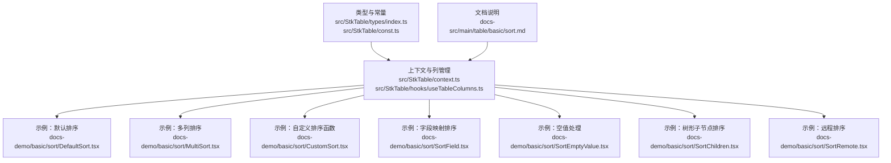
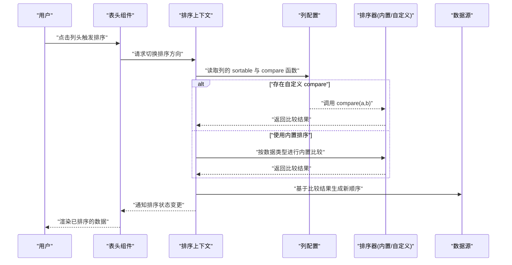
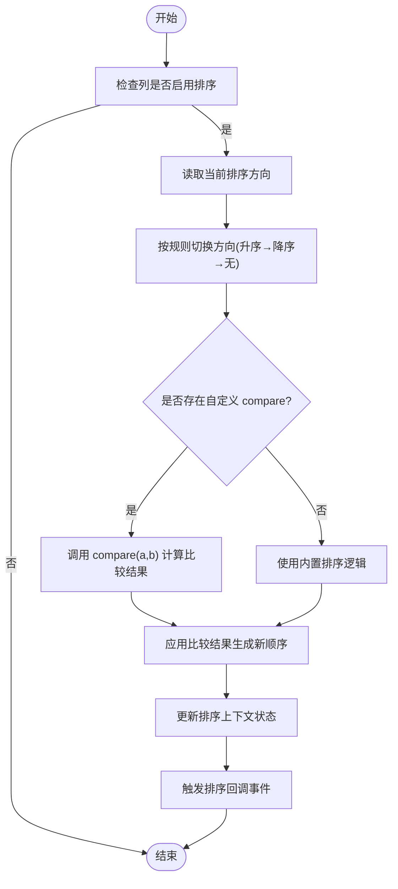
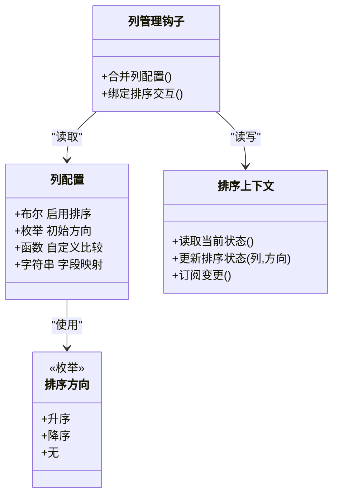

# 排序配置

<cite>
**本文引用的文件**   
- [src/StkTable/types/index.ts](file://src/StkTable/types/index.ts)
- [src/StkTable/const.ts](file://src/StkTable/const.ts)
- [src/StkTable/context.ts](file://src/StkTable/context.ts)
- [src/StkTable/hooks/useTableColumns.ts](file://src/StkTable/hooks/useTableColumns.ts)
- [docs-demo/basic/sort/DefaultSort.tsx](file://docs-demo/basic/sort/DefaultSort.tsx)
- [docs-demo/basic/sort/MultiSort.tsx](file://docs-demo/basic/sort/MultiSort.tsx)
- [docs-demo/basic/sort/CustomSort.tsx](file://docs-demo/basic/sort/CustomSort.tsx)
- [docs-demo/basic/sort/SortField.tsx](file://docs-demo/basic/sort/SortField.tsx)
- [docs-demo/basic/sort/SortEmptyValue.tsx](file://docs-demo/basic/sort/SortEmptyValue.tsx)
- [docs-demo/basic/sort/SortChildren.tsx](file://docs-demo/basic/sort/SortChildren.tsx)
- [docs-demo/basic/sort/SortRemote.tsx](file://docs-demo/basic/sort/SortRemote.tsx)
- [docs-src/main/table/basic/sort.md](file://docs-src/main/table/basic/sort.md)
</cite>

## 目录
1. [简介](#简介)
2. [项目结构](#项目结构)
3. [核心组件](#核心组件)
4. [架构总览](#架构总览)
5. [详细组件分析](#详细组件分析)
6. [依赖分析](#依赖分析)
7. [性能考虑](#性能考虑)
8. [故障排查指南](#故障排查指南)
9. [结论](#结论)
10. [附录](#附录)

## 简介
本章节聚焦 StkTable 的列排序能力，围绕 sortable 属性展开，覆盖以下主题：
- 单列排序与多列排序的配置方式
- 排序方向（升序、降序、无）的设置与切换逻辑
- 内置排序与自定义排序函数的实现要点
- 排序状态管理与回调事件处理
- 常见场景示例：数字、字符串、日期等类型排序
- 内置排序与自定义排序的使用场景对比

## 项目结构
与排序相关的源码与示例分布如下：
- 类型定义与常量：types/index.ts、const.ts
- 上下文与列钩子：context.ts、hooks/useTableColumns.ts
- 基础示例：docs-demo/basic/sort/*
- 文档说明：docs-src/main/table/basic/sort.md

图表来源
- [src/StkTable/types/index.ts](file://src/StkTable/types/index.ts)
- [src/StkTable/const.ts](file://src/StkTable/const.ts)
- [src/StkTable/context.ts](file://src/StkTable/context.ts)
- [src/StkTable/hooks/useTableColumns.ts](file://src/StkTable/hooks/useTableColumns.ts)
- [docs-demo/basic/sort/DefaultSort.tsx](file://docs-demo/basic/sort/DefaultSort.tsx)
- [docs-demo/basic/sort/MultiSort.tsx](file://docs-demo/basic/sort/MultiSort.tsx)
- [docs-demo/basic/sort/CustomSort.tsx](file://docs-demo/basic/sort/CustomSort.tsx)
- [docs-demo/basic/sort/SortField.tsx](file://docs-demo/basic/sort/SortField.tsx)
- [docs-demo/basic/sort/SortEmptyValue.tsx](file://docs-demo/basic/sort/SortEmptyValue.tsx)
- [docs-demo/basic/sort/SortChildren.tsx](file://docs-demo/basic/sort/SortChildren.tsx)
- [docs-demo/basic/sort/SortRemote.tsx](file://docs-demo/basic/sort/SortRemote.tsx)
- [docs-src/main/table/basic/sort.md](file://docs-src/main/table/basic/sort.md)

章节来源
- [src/StkTable/types/index.ts](file://src/StkTable/types/index.ts)
- [src/StkTable/const.ts](file://src/StkTable/const.ts)
- [src/StkTable/context.ts](file://src/StkTable/context.ts)
- [src/StkTable/hooks/useTableColumns.ts](file://src/StkTable/hooks/useTableColumns.ts)
- [docs-demo/basic/sort/DefaultSort.tsx](file://docs-demo/basic/sort/DefaultSort.tsx)
- [docs-demo/basic/sort/MultiSort.tsx](file://docs-demo/basic/sort/MultiSort.tsx)
- [docs-demo/basic/sort/CustomSort.tsx](file://docs-demo/basic/sort/CustomSort.tsx)
- [docs-demo/basic/sort/SortField.tsx](file://docs-demo/basic/sort/SortField.tsx)
- [docs-demo/basic/sort/SortEmptyValue.tsx](file://docs-demo/basic/sort/SortEmptyValue.tsx)
- [docs-demo/basic/sort/SortChildren.tsx](file://docs-demo/basic/sort/SortChildren.tsx)
- [docs-demo/basic/sort/SortRemote.tsx](file://docs-demo/basic/sort/SortRemote.tsx)
- [docs-src/main/table/basic/sort.md](file://docs-src/main/table/basic/sort.md)

## 核心组件
- 列配置对象：包含 sortable 属性，用于启用列排序；可指定排序方向与比较函数。
- 排序方向枚举：支持升序、降序、无三种状态，用于表示当前列的排序状态。
- 排序上下文：维护全局排序状态（含多列排序），并提供更新接口。
- 列管理钩子：将列配置与排序上下文结合，驱动渲染与交互。

章节来源
- [src/StkTable/types/index.ts](file://src/StkTable/types/index.ts)
- [src/StkTable/const.ts](file://src/StkTable/const.ts)
- [src/StkTable/context.ts](file://src/StkTable/context.ts)
- [src/StkTable/hooks/useTableColumns.ts](file://src/StkTable/hooks/useTableColumns.ts)

## 架构总览
下图展示了从用户点击表头到数据重排的关键流程，以及内置排序与自定义排序的分流路径。

图表来源
- [src/StkTable/context.ts](file://src/StkTable/context.ts)
- [src/StkTable/hooks/useTableColumns.ts](file://src/StkTable/hooks/useTableColumns.ts)
- [src/StkTable/types/index.ts](file://src/StkTable/types/index.ts)
- [src/StkTable/const.ts](file://src/StkTable/const.ts)

## 详细组件分析

### 列配置与 sortable 属性
- 启用排序：在列配置中设置 sortable 为 true，即可启用该列的点击排序。
- 指定初始方向：可通过列配置的排序方向字段设置初始排序方向。
- 自定义比较函数：提供 compare 函数以覆盖内置排序逻辑，适用于复杂业务规则或跨字段组合排序。
- 字段映射：当数据字段名与列标识不一致时，通过字段映射确保正确取值参与排序。

章节来源
- [src/StkTable/types/index.ts](file://src/StkTable/types/index.ts)
- [docs-demo/basic/sort/DefaultSort.tsx](file://docs-demo/basic/sort/DefaultSort.tsx)
- [docs-demo/basic/sort/SortField.tsx](file://docs-demo/basic/sort/SortField.tsx)

### 排序方向与状态管理
- 方向枚举：支持升序、降序、无三种状态，点击表头时按固定循环切换。
- 单列排序：仅一个列处于非“无”状态，其他列自动清空。
- 多列排序：允许多个列同时处于排序状态，形成多级排序键。
- 状态来源：排序状态由上下文统一管理，组件通过上下文获取并响应变化。

章节来源
- [src/StkTable/const.ts](file://src/StkTable/const.ts)
- [src/StkTable/context.ts](file://src/StkTable/context.ts)
- [docs-demo/basic/sort/MultiSort.tsx](file://docs-demo/basic/sort/MultiSort.tsx)

### 内置排序与自定义排序
- 内置排序：对常见类型（如数字、字符串）提供开箱即用的比较逻辑。
- 自定义排序：通过 compare 函数实现任意比较策略，例如：
  - 数值大小比较
  - 字符串本地化比较
  - 日期时间比较
  - 空值优先/置后策略
  - 组合多字段排序
- 选择建议：
  - 简单类型且无需特殊规则：优先使用内置排序
  - 需要国际化、空值控制、复合键或外部库参与：使用自定义排序

章节来源
- [src/StkTable/types/index.ts](file://src/StkTable/types/index.ts)
- [docs-demo/basic/sort/CustomSort.tsx](file://docs-demo/basic/sort/CustomSort.tsx)
- [docs-demo/basic/sort/SortEmptyValue.tsx](file://docs-demo/basic/sort/SortEmptyValue.tsx)

### 排序回调与事件
- 排序回调：当排序状态发生变化时，会触发回调事件，便于上层同步 UI 或发起远程排序。
- 远程排序：在回调中携带当前排序信息（列、方向、多列键），向服务端发起请求并回填数据。
- 本地排序：在回调中直接计算新的数据顺序并更新状态。

章节来源
- [docs-demo/basic/sort/SortRemote.tsx](file://docs-demo/basic/sort/SortRemote.tsx)
- [docs-src/main/table/basic/sort.md](file://docs-src/main/table/basic/sort.md)

### 典型场景与示例
- 数字排序：按数值大小升/降序排列。
- 字符串排序：按字典序或本地化规则排序。
- 日期排序：按时间戳或格式化后的日期进行比较。
- 空值处理：将空值统一前置或后置，保证排序稳定性。
- 树形子节点排序：在树结构中，对子节点集合应用相同排序策略。

章节来源
- [docs-demo/basic/sort/DefaultSort.tsx](file://docs-demo/basic/sort/DefaultSort.tsx)
- [docs-demo/basic/sort/CustomSort.tsx](file://docs-demo/basic/sort/CustomSort.tsx)
- [docs-demo/basic/sort/SortEmptyValue.tsx](file://docs-demo/basic/sort/SortEmptyValue.tsx)
- [docs-demo/basic/sort/SortChildren.tsx](file://docs-demo/basic/sort/SortChildren.tsx)

### 流程图：排序决策与执行

图表来源
- [src/StkTable/types/index.ts](file://src/StkTable/types/index.ts)
- [src/StkTable/const.ts](file://src/StkTable/const.ts)
- [src/StkTable/context.ts](file://src/StkTable/context.ts)

## 依赖分析
- 类型与常量：为列配置与排序方向提供类型约束与枚举值。
- 上下文：集中管理排序状态，暴露更新方法，供表头与列组件消费。
- 列管理钩子：将列配置与上下文绑定，驱动渲染与交互。
- 示例：演示不同排序模式与回调用法，验证上述模块协作。

图表来源
- [src/StkTable/types/index.ts](file://src/StkTable/types/index.ts)
- [src/StkTable/const.ts](file://src/StkTable/const.ts)
- [src/StkTable/context.ts](file://src/StkTable/context.ts)
- [src/StkTable/hooks/useTableColumns.ts](file://src/StkTable/hooks/useTableColumns.ts)

章节来源
- [src/StkTable/types/index.ts](file://src/StkTable/types/index.ts)
- [src/StkTable/const.ts](file://src/StkTable/const.ts)
- [src/StkTable/context.ts](file://src/StkTable/context.ts)
- [src/StkTable/hooks/useTableColumns.ts](file://src/StkTable/hooks/useTableColumns.ts)

## 性能考虑
- 大数据量：优先使用远程排序，避免前端全量重排带来的卡顿。
- 比较函数优化：自定义 compare 应避免重复计算，必要时缓存中间结果。
- 稳定排序：保持相等元素的相对顺序，有助于提升用户体验。
- 多列排序：减少不必要的列参与排序，降低比较开销。

[本节为通用指导，不直接分析具体文件]

## 故障排查指南
- 点击无效：确认列配置启用了排序开关，且未与其他交互冲突。
- 方向异常：检查方向枚举值是否正确传入，以及切换逻辑是否符合预期。
- 自定义排序不生效：确认 compare 返回值符合约定，且字段映射指向正确的数据路径。
- 空值导致错乱：在 compare 中显式处理空值，统一前置或后置。
- 远程排序未刷新：确保在回调中正确更新数据源，并触发必要的状态更新。

章节来源
- [docs-demo/basic/sort/CustomSort.tsx](file://docs-demo/basic/sort/CustomSort.tsx)
- [docs-demo/basic/sort/SortEmptyValue.tsx](file://docs-demo/basic/sort/SortEmptyValue.tsx)
- [docs-demo/basic/sort/SortRemote.tsx](file://docs-demo/basic/sort/SortRemote.tsx)
- [docs-src/main/table/basic/sort.md](file://docs-src/main/table/basic/sort.md)

## 结论
StkTable 的排序能力通过 sortable 属性与排序上下文协同工作，既满足常见的内置排序需求，也提供了灵活的自定义排序扩展点。通过合理选择内置与自定义排序、妥善处理空值与多列排序，并结合回调事件实现本地或远程排序，可以在不同业务场景中取得良好的性能与体验。

[本节为总结性内容，不直接分析具体文件]

## 附录
- 快速上手：参考默认排序示例，快速启用列排序。
- 进阶用法：参考多列排序、自定义排序、空值处理与远程排序示例，逐步掌握高级特性。
- 文档索引：查看排序文档页面，了解完整 API 与最佳实践。

章节来源
- [docs-demo/basic/sort/DefaultSort.tsx](file://docs-demo/basic/sort/DefaultSort.tsx)
- [docs-demo/basic/sort/MultiSort.tsx](file://docs-demo/basic/sort/MultiSort.tsx)
- [docs-demo/basic/sort/CustomSort.tsx](file://docs-demo/basic/sort/CustomSort.tsx)
- [docs-demo/basic/sort/SortEmptyValue.tsx](file://docs-demo/basic/sort/SortEmptyValue.tsx)
- [docs-demo/basic/sort/SortRemote.tsx](file://docs-demo/basic/sort/SortRemote.tsx)
- [docs-src/main/table/basic/sort.md](file://docs-src/main/table/basic/sort.md)