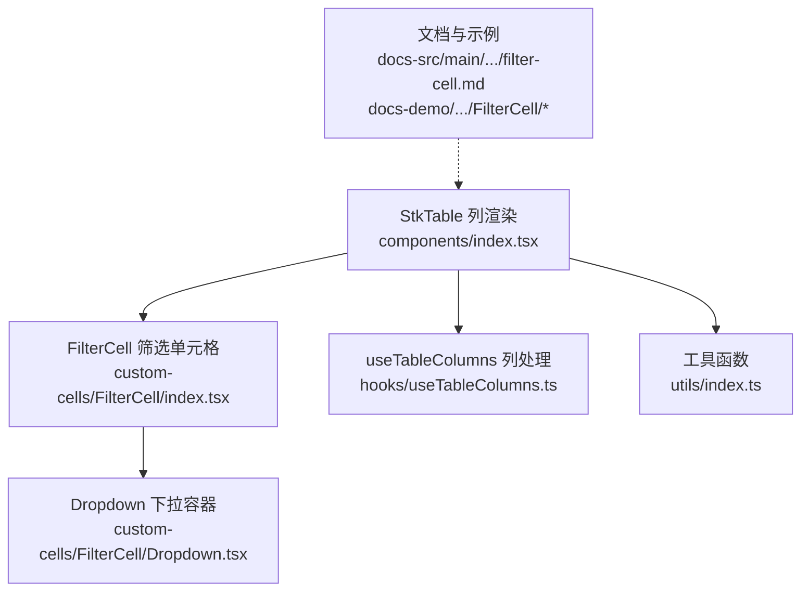
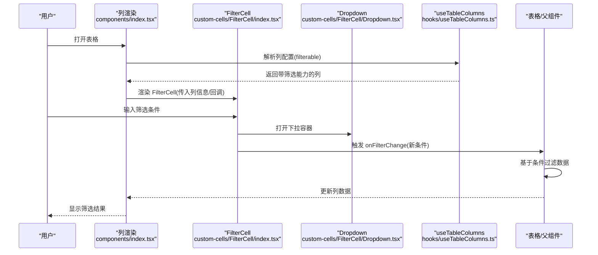
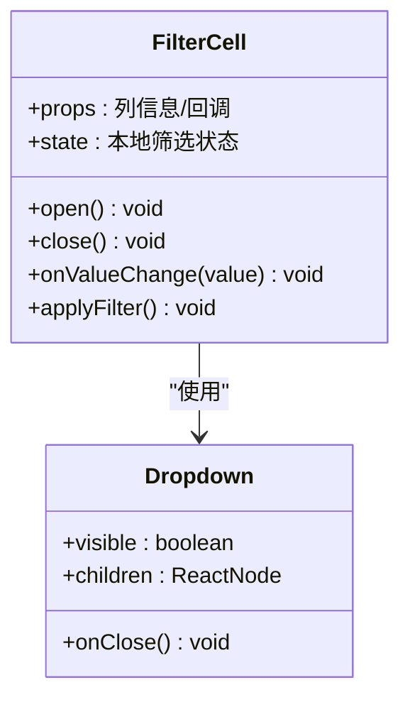
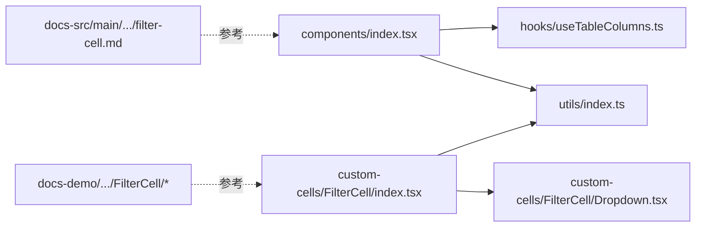
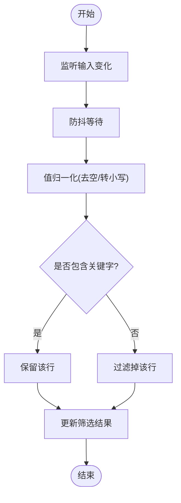
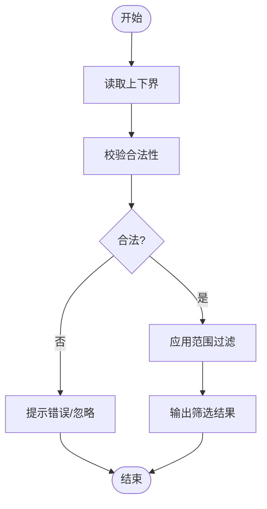
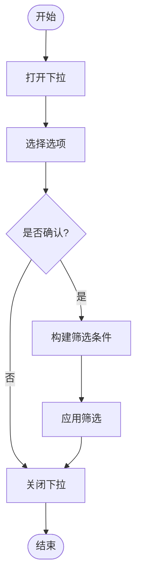

# 筛选配置

<cite>
**本文引用的文件**   
- [src/StkTable/components/index.tsx](file://src/StkTable/components/index.tsx)
- [src/StkTable/custom-cells/FilterCell/index.tsx](file://src/StkTable/custom-cells/FilterCell/index.tsx)
- [src/StkTable/custom-cells/FilterCell/Dropdown.tsx](file://src/StkTable/custom-cells/FilterCell/Dropdown.tsx)
- [src/StkTable/custom-cells/FilterCell/types.ts](file://src/StkTable/custom-cells/FilterCell/types.ts)
- [src/StkTable/hooks/useTableColumns.ts](file://src/StkTable/hooks/useTableColumns.ts)
- [src/StkTable/utils/index.ts](file://src/StkTable/utils/index.ts)
- [docs-src/main/table/advanced/custom-cells/filter-cell.md](file://docs-src/main/table/advanced/custom-cells/filter-cell.md)
- [docs-demo/advanced/custom-cells/FilterCell/index.tsx](file://docs-demo/advanced/custom-cells/FilterCell/index.tsx)
- [docs-demo/advanced/custom-cells/FilterCell/CustomFilter.tsx](file://docs-demo/advanced/custom-cells/FilterCell/CustomFilter.tsx)
</cite>

## 目录
1. [简介](#简介)
2. [项目结构](#项目结构)
3. [核心组件与能力](#核心组件与能力)
4. [架构总览](#架构总览)
5. [详细组件分析](#详细组件分析)
6. [依赖关系分析](#依赖关系分析)
7. [性能考虑](#性能考虑)
8. [故障排查指南](#故障排查指南)
9. [结论](#结论)
10. [附录：筛选场景实现方案](#附录筛选场景实现方案)

## 简介
本章节聚焦 StkTable 的列筛选配置，围绕 filterable 属性展开，说明内置筛选器与自定义筛选器的使用方法、数据格式要求、筛选逻辑实现、状态同步与结果更新机制，并提供文本筛选、数值范围筛选、下拉选择等常见场景的实现思路与优化建议。

## 项目结构
与筛选相关的代码主要分布在以下位置：
- 表格列渲染入口：components/index.tsx
- 筛选单元格（FilterCell）及其下拉容器：custom-cells/FilterCell/*
- 列钩子与列处理：hooks/useTableColumns.ts
- 工具函数：utils/index.ts
- 文档与示例：docs-src/main/table/.../filter-cell.md 与 docs-demo/advanced/custom-cells/FilterCell/*

图表来源
- [src/StkTable/components/index.tsx](file://src/StkTable/components/index.tsx)
- [src/StkTable/custom-cells/FilterCell/index.tsx](file://src/StkTable/custom-cells/FilterCell/index.tsx)
- [src/StkTable/custom-cells/FilterCell/Dropdown.tsx](file://src/StkTable/custom-cells/FilterCell/Dropdown.tsx)
- [src/StkTable/hooks/useTableColumns.ts](file://src/StkTable/hooks/useTableColumns.ts)
- [src/StkTable/utils/index.ts](file://src/StkTable/utils/index.ts)
- [docs-src/main/table/advanced/custom-cells/filter-cell.md](file://docs-src/main/table/advanced/custom-cells/filter-cell.md)
- [docs-demo/advanced/custom-cells/FilterCell/index.tsx](file://docs-demo/advanced/custom-cells/FilterCell/index.tsx)

章节来源
- [src/StkTable/components/index.tsx](file://src/StkTable/components/index.tsx)
- [src/StkTable/custom-cells/FilterCell/index.tsx](file://src/StkTable/custom-cells/FilterCell/index.tsx)
- [src/StkTable/custom-cells/FilterCell/Dropdown.tsx](file://src/StkTable/custom-cells/FilterCell/Dropdown.tsx)
- [src/StkTable/hooks/useTableColumns.ts](file://src/StkTable/hooks/useTableColumns.ts)
- [src/StkTable/utils/index.ts](file://src/StkTable/utils/index.ts)
- [docs-src/main/table/advanced/custom-cells/filter-cell.md](file://docs-src/main/table/advanced/custom-cells/filter-cell.md)
- [docs-demo/advanced/custom-cells/FilterCell/index.tsx](file://docs-demo/advanced/custom-cells/FilterCell/index.tsx)

## 核心组件与能力
- 列级 filterable 开关：用于启用某列的筛选能力。
- FilterCell 筛选单元格：负责渲染筛选 UI、管理本地筛选状态、触发筛选回调。
- Dropdown 下拉容器：为筛选器提供弹出层容器与定位能力。
- useTableColumns：在列维度上处理筛选相关逻辑（如将 filterable 转换为可交互的筛选入口）。
- utils：提供筛选相关的通用工具方法（例如值归一化、比较器等）。

章节来源
- [src/StkTable/custom-cells/FilterCell/index.tsx](file://src/StkTable/custom-cells/FilterCell/index.tsx)
- [src/StkTable/custom-cells/FilterCell/Dropdown.tsx](file://src/StkTable/custom-cells/FilterCell/Dropdown.tsx)
- [src/StkTable/hooks/useTableColumns.ts](file://src/StkTable/hooks/useTableColumns.ts)
- [src/StkTable/utils/index.ts](file://src/StkTable/utils/index.ts)

## 架构总览
下图展示了从列定义到筛选执行的关键路径：列渲染时根据 filterable 决定是否挂载 FilterCell；FilterCell 维护本地筛选状态并通过回调通知上层；上层根据筛选条件对数据进行过滤并更新展示。

图表来源
- [src/StkTable/components/index.tsx](file://src/StkTable/components/index.tsx)
- [src/StkTable/custom-cells/FilterCell/index.tsx](file://src/StkTable/custom-cells/FilterCell/index.tsx)
- [src/StkTable/custom-cells/FilterCell/Dropdown.tsx](file://src/StkTable/custom-cells/FilterCell/Dropdown.tsx)
- [src/StkTable/hooks/useTableColumns.ts](file://src/StkTable/hooks/useTableColumns.ts)

## 详细组件分析

### FilterCell 筛选单元格
- 职责
  - 接收列信息与筛选回调
  - 维护本地筛选状态（如文本、范围、多选等）
  - 控制下拉容器的显隐
  - 调用回调以触发筛选更新
- 关键流程
  - 初始化：读取列配置中的 filterable 与默认筛选值
  - 交互：用户在输入框/选择器中修改条件
  - 提交：将当前条件通过回调传递给上层
  - 清理：关闭下拉或重置状态
- 与 Dropdown 的关系
  - 使用 Dropdown 作为弹出层容器，避免与表格滚动/固定列产生层级问题

图表来源
- [src/StkTable/custom-cells/FilterCell/index.tsx](file://src/StkTable/custom-cells/FilterCell/index.tsx)
- [src/StkTable/custom-cells/FilterCell/Dropdown.tsx](file://src/StkTable/custom-cells/FilterCell/Dropdown.tsx)

章节来源
- [src/StkTable/custom-cells/FilterCell/index.tsx](file://src/StkTable/custom-cells/FilterCell/index.tsx)
- [src/StkTable/custom-cells/FilterCell/Dropdown.tsx](file://src/StkTable/custom-cells/FilterCell/Dropdown.tsx)

### 列处理 useTableColumns
- 作用
  - 在列维度上识别 filterable 标记
  - 将筛选入口注入到列头或单元格
  - 协调筛选状态与表格数据的联动
- 关键点
  - 保持列配置的不可变性
  - 合并默认筛选行为与自定义扩展点

章节来源
- [src/StkTable/hooks/useTableColumns.ts](file://src/StkTable/hooks/useTableColumns.ts)

### 工具函数 utils
- 作用
  - 提供筛选过程中的通用能力，如值归一化、类型判断、比较策略等
- 关键点
  - 保证不同数据类型下的筛选一致性
  - 为自定义筛选器提供稳定的基础能力

章节来源
- [src/StkTable/utils/index.ts](file://src/StkTable/utils/index.ts)

### 文档与示例
- 官方文档页：介绍筛选单元格的使用方式与最佳实践
- 示例工程：演示如何替换默认筛选器、实现复杂筛选逻辑

章节来源
- [docs-src/main/table/advanced/custom-cells/filter-cell.md](file://docs-src/main/table/advanced/custom-cells/filter-cell.md)
- [docs-demo/advanced/custom-cells/FilterCell/index.tsx](file://docs-demo/advanced/custom-cells/FilterCell/index.tsx)
- [docs-demo/advanced/custom-cells/FilterCell/CustomFilter.tsx](file://docs-demo/advanced/custom-cells/FilterCell/CustomFilter.tsx)

## 依赖关系分析
- 组件耦合
  - components/index.tsx 依赖 useTableColumns 生成带筛选能力的列
  - FilterCell 依赖 Dropdown 进行弹出层渲染
  - FilterCell 依赖 utils 提供的工具方法
- 外部集成
  - 示例与文档位于 docs-demo 与 docs-src，便于快速上手与参考

图表来源
- [src/StkTable/components/index.tsx](file://src/StkTable/components/index.tsx)
- [src/StkTable/hooks/useTableColumns.ts](file://src/StkTable/hooks/useTableColumns.ts)
- [src/StkTable/utils/index.ts](file://src/StkTable/utils/index.ts)
- [src/StkTable/custom-cells/FilterCell/index.tsx](file://src/StkTable/custom-cells/FilterCell/index.tsx)
- [src/StkTable/custom-cells/FilterCell/Dropdown.tsx](file://src/StkTable/custom-cells/FilterCell/Dropdown.tsx)
- [docs-src/main/table/advanced/custom-cells/filter-cell.md](file://docs-src/main/table/advanced/custom-cells/filter-cell.md)
- [docs-demo/advanced/custom-cells/FilterCell/index.tsx](file://docs-demo/advanced/custom-cells/FilterCell/index.tsx)

## 性能考虑
- 延迟计算：仅在用户完成输入或确认后再执行筛选，避免频繁重排
- 防抖/节流：对高频输入（如文本搜索）做防抖，降低计算压力
- 局部过滤：优先在内存中对可见行进行过滤，必要时结合虚拟滚动
- 条件缓存：对相同条件的结果进行缓存，避免重复计算
- 轻量组件：自定义筛选器尽量保持无副作用与最小渲染面

## 故障排查指南
- 现象：筛选不生效
  - 检查列是否设置 filterable
  - 确认回调是否正确传递并更新了数据源
- 现象：筛选后数据闪烁或错位
  - 检查 key 与行标识是否稳定
  - 确认筛选前后数据结构一致
- 现象：下拉遮挡或无法点击
  - 检查 Dropdown 层级与 z-index
  - 确认是否在固定列/滚动容器中导致定位异常
- 现象：性能抖动
  - 增加防抖/节流
  - 减少不必要的重渲染（如拆分组件、使用 memo）

## 结论
通过 filterable 与 FilterCell 的组合，StkTable 提供了开箱即用的列筛选能力，同时支持通过自定义筛选器满足复杂业务需求。配合合理的状态管理与性能优化策略，可在大数据量场景下获得流畅的筛选体验。

## 附录：筛选场景实现方案

### 文本筛选
- 目标：按关键字匹配文本字段
- 要点
  - 统一大小写与空白处理
  - 支持多词匹配与模糊匹配
  - 使用防抖提升输入体验
- 推荐流程

### 数值范围筛选
- 目标：筛选区间内的数值
- 要点
  - 边界包含/不包含需明确
  - 空值与非法值的处理策略
  - 双端输入时的联动校验
- 推荐流程

### 下拉选择筛选
- 目标：从预置选项中选择一项或多项
- 要点
  - 单选/多选模式
  - 全选/反选/清空
  - 动态选项加载与分页
- 推荐流程

### 自定义筛选器
- 适用场景：日期范围、标签多选、复合条件等
- 步骤
  - 在列配置中启用 filterable
  - 替换默认 FilterCell 或使用插槽注入自定义组件
  - 在自定义组件中维护本地状态，并在变更时触发筛选回调
  - 在上层根据条件过滤数据并更新视图
- 参考示例
  - 文档页：[docs-src/main/table/advanced/custom-cells/filter-cell.md](file://docs-src/main/table/advanced/custom-cells/filter-cell.md)
  - 示例组件：[docs-demo/advanced/custom-cells/FilterCell/CustomFilter.tsx](file://docs-demo/advanced/custom-cells/FilterCell/CustomFilter.tsx)