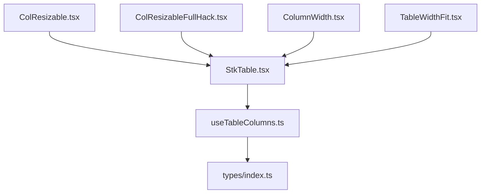
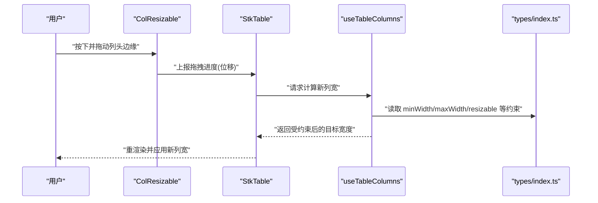
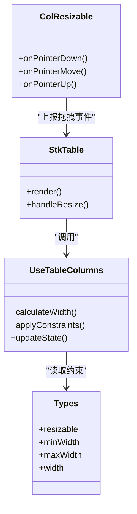
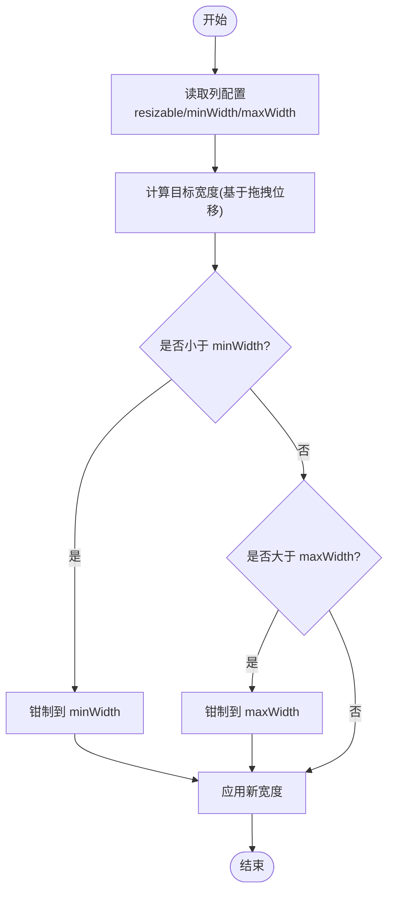
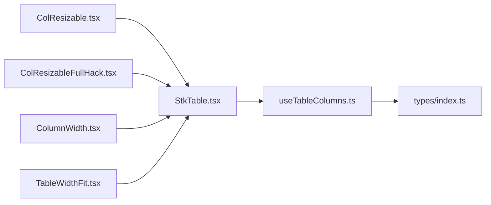

# 调整宽度配置

<cite>
**本文引用的文件**   
- [docs-demo/advanced/column-resize/ColResizable.tsx](file://docs-demo/advanced/column-resize/ColResizable.tsx)
- [docs-demo/advanced/column-resize/ColResizableFullHack.tsx](file://docs-demo/advanced/column-resize/ColResizableFullHack.tsx)
- [docs-demo/basic/column-width/ColumnWidth.tsx](file://docs-demo/basic/column-width/ColumnWidth.tsx)
- [docs-demo/basic/column-width/TableWidthFit.tsx](file://docs-demo/basic/column-width/TableWidthFit.tsx)
- [src/StkTable/types/index.ts](file://src/StkTable/types/index.ts)
- [src/StkTable/hooks/useTableColumns.ts](file://src/StkTable/hooks/useTableColumns.ts)
- [src/StkTable/StkTable.tsx](file://src/StkTable/StkTable.tsx)
- [docs-src/main/table/advanced/column-resize.md](file://docs-src/main/table/advanced/column-resize.md)
- [docs-src/main/table/basic/column-width.md](file://docs-src/main/table/basic/column-width.md)
</cite>

## 目录
1. [简介](#简介)
2. [项目结构](#项目结构)
3. [核心组件](#核心组件)
4. [架构总览](#架构总览)
5. [详细组件分析](#详细组件分析)
6. [依赖关系分析](#依赖关系分析)
7. [性能考量](#性能考量)
8. [故障排查指南](#故障排查指南)
9. [结论](#结论)
10. [附录](#附录)

## 简介
本章节聚焦 StkTable 的列宽调整能力，围绕 resizable 属性展开，涵盖最小/最大宽度约束、拖拽行为控制与边界限制、列宽变化事件处理与状态同步机制，以及自适应与固定宽度的使用场景。文档同时提供多种示例路径，帮助快速上手并掌握高级特性（如拖拽样式定制、宽度约束设置、响应式适配等）。

## 项目结构
与“列宽调整”相关的代码主要分布在以下位置：
- 演示示例：docs-demo/advanced/column-resize 与 docs-demo/basic/column-width
- 类型定义与列管理钩子：src/StkTable/types/index.ts、src/StkTable/hooks/useTableColumns.ts
- 主表实现：src/StkTable/StkTable.tsx
- 官方文档说明：docs-src/main/table/advanced/column-resize.md、docs-src/main/table/basic/column-width.md

图表来源
- [src/StkTable/StkTable.tsx](file://src/StkTable/StkTable.tsx)
- [src/StkTable/hooks/useTableColumns.ts](file://src/StkTable/hooks/useTableColumns.ts)
- [src/StkTable/types/index.ts](file://src/StkTable/types/index.ts)
- [docs-demo/advanced/column-resize/ColResizable.tsx](file://docs-demo/advanced/column-resize/ColResizable.tsx)
- [docs-demo/advanced/column-resize/ColResizableFullHack.tsx](file://docs-demo/advanced/column-resize/ColResizableFullHack.tsx)
- [docs-demo/basic/column-width/ColumnWidth.tsx](file://docs-demo/basic/column-width/ColumnWidth.tsx)
- [docs-demo/basic/column-width/TableWidthFit.tsx](file://docs-demo/basic/column-width/TableWidthFit.tsx)

章节来源
- [docs-demo/advanced/column-resize/ColResizable.tsx](file://docs-demo/advanced/column-resize/ColResizable.tsx)
- [docs-demo/advanced/column-resize/ColResizableFullHack.tsx](file://docs-demo/advanced/column-resize/ColResizableFullHack.tsx)
- [docs-demo/basic/column-width/ColumnWidth.tsx](file://docs-demo/basic/column-width/ColumnWidth.tsx)
- [docs-demo/basic/column-width/TableWidthFit.tsx](file://docs-demo/basic/column-width/TableWidthFit.tsx)
- [src/StkTable/types/index.ts](file://src/StkTable/types/index.ts)
- [src/StkTable/hooks/useTableColumns.ts](file://src/StkTable/hooks/useTableColumns.ts)
- [src/StkTable/StkTable.tsx](file://src/StkTable/StkTable.tsx)

## 核心组件
- StkTable：表格主体，负责渲染列头、列体、滚动与虚拟化等，集成列宽调整能力。
- useTableColumns：列相关状态与逻辑封装，包含列宽计算、约束校验与更新策略。
- types/index.ts：列与表格的类型定义，包括 resizable、minWidth、maxWidth、width 等字段。
- ColResizable / ColResizableFullHack：列宽拖拽交互的实现或增强方案，用于监听鼠标/触摸事件并驱动列宽变更。
- ColumnWidth / TableWidthFit：基础列宽与表格宽度自适应的示例，展示不同布局模式下的表现。

章节来源
- [src/StkTable/StkTable.tsx](file://src/StkTable/StkTable.tsx)
- [src/StkTable/hooks/useTableColumns.ts](file://src/StkTable/hooks/useTableColumns.ts)
- [src/StkTable/types/index.ts](file://src/StkTable/types/index.ts)
- [docs-demo/advanced/column-resize/ColResizable.tsx](file://docs-demo/advanced/column-resize/ColResizable.tsx)
- [docs-demo/advanced/column-resize/ColResizableFullHack.tsx](file://docs-demo/advanced/column-resize/ColResizableFullHack.tsx)
- [docs-demo/basic/column-width/ColumnWidth.tsx](file://docs-demo/basic/column-width/ColumnWidth.tsx)
- [docs-demo/basic/column-width/TableWidthFit.tsx](file://docs-demo/basic/column-width/TableWidthFit.tsx)

## 架构总览
列宽调整的整体流程如下：用户在列头边缘触发拖拽，拖拽组件捕获指针事件，计算位移并生成目标宽度；随后通过列管理钩子进行约束校验（最小/最大宽度），更新列宽状态，最终由表格重新渲染以反映新的列布局。

图表来源
- [docs-demo/advanced/column-resize/ColResizable.tsx](file://docs-demo/advanced/column-resize/ColResizable.tsx)
- [src/StkTable/StkTable.tsx](file://src/StkTable/StkTable.tsx)
- [src/StkTable/hooks/useTableColumns.ts](file://src/StkTable/hooks/useTableColumns.ts)
- [src/StkTable/types/index.ts](file://src/StkTable/types/index.ts)

## 详细组件分析

### resizable 属性与列宽约束
- 启用方式：在列定义中设置 resizable 为 true，表示该列允许被拖拽调整宽度。
- 最小/最大宽度：通过 minWidth 与 maxWidth 对拖拽范围进行限制，确保内容可读性与布局稳定性。
- 默认行为：未显式设置时，列宽可能基于内容或父容器自适应；当启用 resizable 后，建议显式设置合理的最小/最大宽度以获得一致体验。

章节来源
- [src/StkTable/types/index.ts](file://src/StkTable/types/index.ts)
- [docs-src/main/table/advanced/column-resize.md](file://docs-src/main/table/advanced/column-resize.md)
- [docs-src/main/table/basic/column-width.md](file://docs-src/main/table/basic/column-width.md)

### 拖拽行为控制与边界限制
- 拖拽起始：在列头右侧边缘区域识别拖拽手柄，支持鼠标与触摸事件。
- 实时反馈：拖拽过程中即时计算目标宽度，并在视觉上呈现预览效果。
- 边界限制：根据列的 minWidth 与 maxWidth 限制最终宽度，避免过窄导致内容溢出或过宽破坏布局。
- 多列联动：某些场景下可考虑相邻列联动调整，以保持整体宽度稳定（需结合业务需求实现）。

章节来源
- [docs-demo/advanced/column-resize/ColResizable.tsx](file://docs-demo/advanced/column-resize/ColResizable.tsx)
- [docs-demo/advanced/column-resize/ColResizableFullHack.tsx](file://docs-demo/advanced/column-resize/ColResizableFullHack.tsx)
- [src/StkTable/hooks/useTableColumns.ts](file://src/StkTable/hooks/useTableColumns.ts)

### 列宽变化的事件处理与状态同步
- 事件触发：拖拽结束或持续过程中，触发列宽变化事件，供上层业务监听与记录。
- 状态同步：列宽变更后，表格内部状态更新，并触发必要的重渲染与布局计算。
- 外部同步：可通过事件回调将最新列宽同步到外部状态（如本地存储、服务端配置），以便跨会话保持一致性。

章节来源
- [src/StkTable/StkTable.tsx](file://src/StkTable/StkTable.tsx)
- [src/StkTable/hooks/useTableColumns.ts](file://src/StkTable/hooks/useTableColumns.ts)
- [docs-src/main/table/advanced/column-resize.md](file://docs-src/main/table/advanced/column-resize.md)

### 列宽自适应与固定宽度场景
- 自适应：适合内容长度波动较大、需要充分利用可用空间的场景；配合合理的 minWidth/maxWidth 可获得良好体验。
- 固定宽度：适合数据项格式统一、强调对齐与一致性的场景；可减少重排与重绘开销。
- 混合策略：部分列固定宽度，其余列自适应，兼顾可读性与空间利用率。

章节来源
- [docs-demo/basic/column-width/ColumnWidth.tsx](file://docs-demo/basic/column-width/ColumnWidth.tsx)
- [docs-demo/basic/column-width/TableWidthFit.tsx](file://docs-demo/basic/column-width/TableWidthFit.tsx)
- [docs-src/main/table/basic/column-width.md](file://docs-src/main/table/basic/column-width.md)

### 实际示例与高级特性
- 基础列宽：参考 ColumnWidth 示例，了解如何设置列宽与基本行为。
- 表格宽度自适应：参考 TableWidthFit 示例，了解表格在不同容器宽度下的表现。
- 高级拖拽：参考 ColResizable 与 ColResizableFullHack 示例，掌握拖拽样式定制、宽度约束设置与响应式适配等高级用法。

章节来源
- [docs-demo/basic/column-width/ColumnWidth.tsx](file://docs-demo/basic/column-width/ColumnWidth.tsx)
- [docs-demo/basic/column-width/TableWidthFit.tsx](file://docs-demo/basic/column-width/TableWidthFit.tsx)
- [docs-demo/advanced/column-resize/ColResizable.tsx](file://docs-demo/advanced/column-resize/ColResizable.tsx)
- [docs-demo/advanced/column-resize/ColResizableFullHack.tsx](file://docs-demo/advanced/column-resize/ColResizableFullHack.tsx)

#### 类图（概念映射）

图表来源
- [src/StkTable/StkTable.tsx](file://src/StkTable/StkTable.tsx)
- [src/StkTable/hooks/useTableColumns.ts](file://src/StkTable/hooks/useTableColumns.ts)
- [src/StkTable/types/index.ts](file://src/StkTable/types/index.ts)
- [docs-demo/advanced/column-resize/ColResizable.tsx](file://docs-demo/advanced/column-resize/ColResizable.tsx)

#### 流程图（约束校验）

图表来源
- [src/StkTable/hooks/useTableColumns.ts](file://src/StkTable/hooks/useTableColumns.ts)
- [src/StkTable/types/index.ts](file://src/StkTable/types/index.ts)

## 依赖关系分析
- StkTable 依赖 useTableColumns 进行列宽计算与状态更新。
- useTableColumns 依赖 types/index.ts 中的类型定义，确保配置字段的一致性。
- ColResizable/ColResizableFullHack 作为交互层，向 StkTable 上报拖拽事件，驱动列宽变更。
- 示例组件（ColumnWidth、TableWidthFit）展示了不同宽度策略的使用方式。

图表来源
- [src/StkTable/StkTable.tsx](file://src/StkTable/StkTable.tsx)
- [src/StkTable/hooks/useTableColumns.ts](file://src/StkTable/hooks/useTableColumns.ts)
- [src/StkTable/types/index.ts](file://src/StkTable/types/index.ts)
- [docs-demo/advanced/column-resize/ColResizable.tsx](file://docs-demo/advanced/column-resize/ColResizable.tsx)
- [docs-demo/advanced/column-resize/ColResizableFullHack.tsx](file://docs-demo/advanced/column-resize/ColResizableFullHack.tsx)
- [docs-demo/basic/column-width/ColumnWidth.tsx](file://docs-demo/basic/column-width/ColumnWidth.tsx)
- [docs-demo/basic/column-width/TableWidthFit.tsx](file://docs-demo/basic/column-width/TableWidthFit.tsx)

章节来源
- [src/StkTable/StkTable.tsx](file://src/StkTable/StkTable.tsx)
- [src/StkTable/hooks/useTableColumns.ts](file://src/StkTable/hooks/useTableColumns.ts)
- [src/StkTable/types/index.ts](file://src/StkTable/types/index.ts)
- [docs-demo/advanced/column-resize/ColResizable.tsx](file://docs-demo/advanced/column-resize/ColResizable.tsx)
- [docs-demo/advanced/column-resize/ColResizableFullHack.tsx](file://docs-demo/advanced/column-resize/ColResizableFullHack.tsx)
- [docs-demo/basic/column-width/ColumnWidth.tsx](file://docs-demo/basic/column-width/ColumnWidth.tsx)
- [docs-demo/basic/column-width/TableWidthFit.tsx](file://docs-demo/basic/column-width/TableWidthFit.tsx)

## 性能考量
- 避免频繁重排：在拖拽过程中尽量使用增量更新与防抖，减少不必要的重渲染。
- 合理设置最小/最大宽度：防止极端宽度导致的布局抖动与内容溢出。
- 虚拟化与列宽：在大数据量场景下，结合虚拟化技术提升滚动性能。
- 固定列与自适应列混合：固定列减少计算复杂度，自适应列提升空间利用率。

[本节为通用指导，不直接分析具体文件]

## 故障排查指南
- 拖拽无效：确认列已设置 resizable=true，且未被其他交互拦截。
- 宽度异常：检查 minWidth/maxWidth 是否设置合理，是否存在冲突或过小值。
- 事件未触发：确认拖拽组件是否正确绑定指针事件，以及事件冒泡是否被阻止。
- 状态不同步：检查列宽更新逻辑是否触发了必要的重渲染与外部状态同步。

章节来源
- [docs-demo/advanced/column-resize/ColResizable.tsx](file://docs-demo/advanced/column-resize/ColResizable.tsx)
- [docs-demo/advanced/column-resize/ColResizableFullHack.tsx](file://docs-demo/advanced/column-resize/ColResizableFullHack.tsx)
- [src/StkTable/hooks/useTableColumns.ts](file://src/StkTable/hooks/useTableColumns.ts)

## 结论
通过合理使用 resizable 属性与 minWidth/maxWidth 约束，可以在保证可读性与布局稳定的前提下，为用户提供灵活的列宽调整体验。结合事件处理与状态同步机制，可实现更丰富的业务场景。示例组件提供了从基础到高级的完整实践路径，便于快速落地与扩展。

[本节为总结性内容，不直接分析具体文件]

## 附录
- 参考文档：
  - [docs-src/main/table/advanced/column-resize.md](file://docs-src/main/table/advanced/column-resize.md)
  - [docs-src/main/table/basic/column-width.md](file://docs-src/main/table/basic/column-width.md)
- 示例路径：
  - [docs-demo/advanced/column-resize/ColResizable.tsx](file://docs-demo/advanced/column-resize/ColResizable.tsx)
  - [docs-demo/advanced/column-resize/ColResizableFullHack.tsx](file://docs-demo/advanced/column-resize/ColResizableFullHack.tsx)
  - [docs-demo/basic/column-width/ColumnWidth.tsx](file://docs-demo/basic/column-width/ColumnWidth.tsx)
  - [docs-demo/basic/column-width/TableWidthFit.tsx](file://docs-demo/basic/column-width/TableWidthFit.tsx)