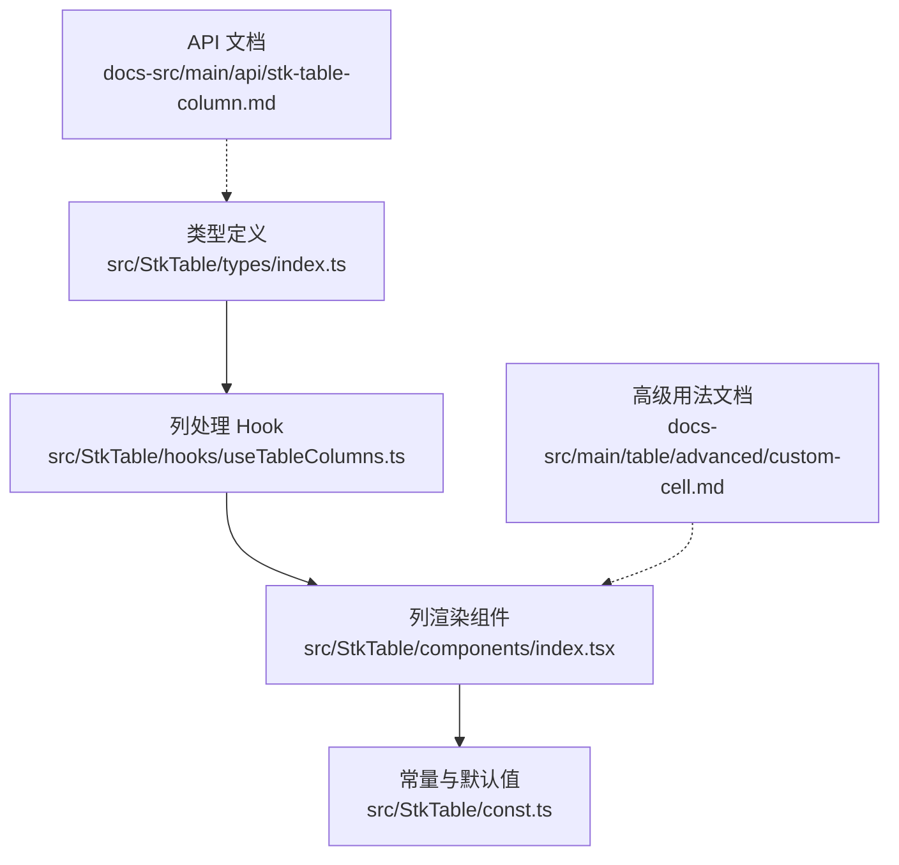
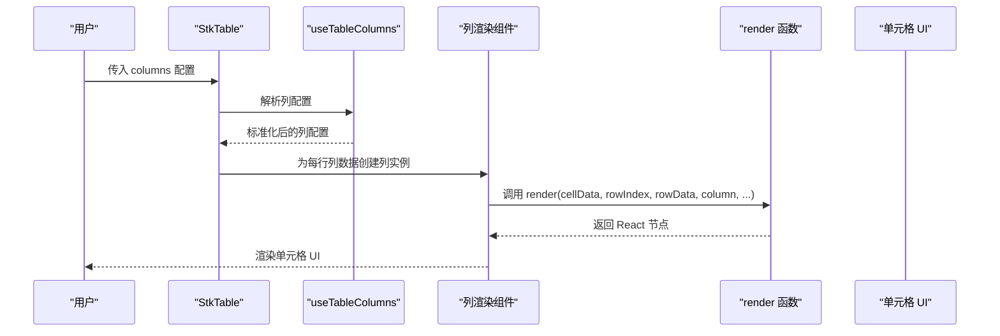
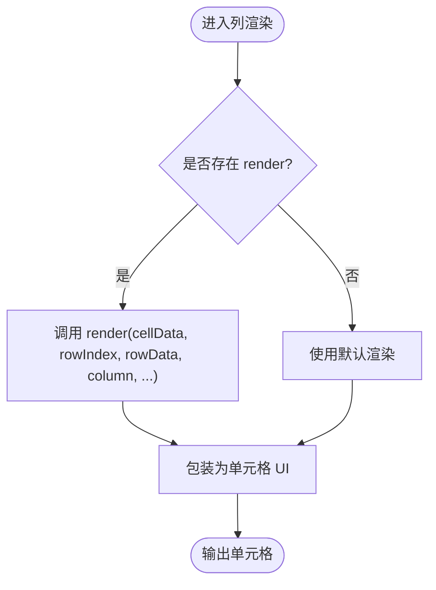
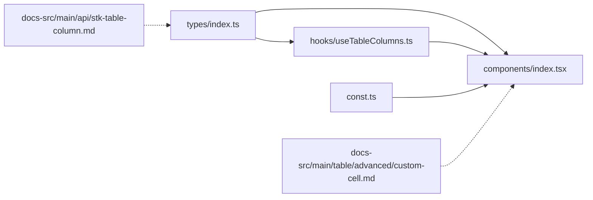

# 列渲染配置

<cite>
**本文引用的文件**   
- [src/StkTable/types/index.ts](file://src/StkTable/types/index.ts)
- [src/StkTable/hooks/useTableColumns.ts](file://src/StkTable/hooks/useTableColumns.ts)
- [src/StkTable/components/index.tsx](file://src/StkTable/components/index.tsx)
- [src/StkTable/const.ts](file://src/StkTable/const.ts)
- [docs-src/main/api/stk-table-column.md](file://docs-src/main/api/stk-table-column.md)
- [docs-src/main/table/advanced/custom-cell.md](file://docs-src/main/table/advanced/custom-cell.md)
- [docs-demo/advanced/custom-cell/CustomCell/index.tsx](file://docs-demo/advanced/custom-cell/CustomCell/index.tsx)
- [docs-demo/advanced/custom-cells/CheckboxCell/index.tsx](file://docs-demo/advanced/custom-cells/CheckboxCell/index.tsx)
- [docs-demo/advanced/custom-cells/EditableCell/index.tsx](file://docs-demo/advanced/custom-cells/EditableCell/index.tsx)
- [docs-demo/advanced/custom-cells/FilterCell/index.tsx](file://docs-demo/advanced/custom-cells/FilterCell/index.tsx)
</cite>

## 目录
1. [简介](#简介)
2. [项目结构](#项目结构)
3. [核心组件](#核心组件)
4. [架构总览](#架构总览)
5. [详细组件分析](#详细组件分析)
6. [依赖分析](#依赖分析)
7. [性能考虑](#性能考虑)
8. [故障排查指南](#故障排查指南)
9. [结论](#结论)
10. [附录](#附录)

## 简介
本章节聚焦 StkTable 的“列渲染配置”，围绕 render 函数的使用方法与参数结构展开，说明如何通过 render 实现自定义单元格渲染（包括 JSX 渲染、条件渲染、复杂组件集成），并给出常见场景的实现思路与最佳实践。文档同时提供代码级图示与示例路径，帮助读者快速定位到仓库中的参考实现。

## 项目结构
与“列渲染配置”直接相关的源码与文档分布如下：
- 类型定义与列配置接口：位于 src/StkTable/types/index.ts
- 列处理 Hook：位于 src/StkTable/hooks/useTableColumns.ts
- 列渲染入口组件：位于 src/StkTable/components/index.tsx
- 常量与默认值：位于 src/StkTable/const.ts
- API 文档：docs-src/main/api/stk-table-column.md
- 高级用法文档：docs-src/main/table/advanced/custom-cell.md
- 演示与示例：docs-demo/advanced/custom-cell 与 docs-demo/advanced/custom-cells 等

图表来源
- [src/StkTable/types/index.ts](file://src/StkTable/types/index.ts)
- [src/StkTable/hooks/useTableColumns.ts](file://src/StkTable/hooks/useTableColumns.ts)
- [src/StkTable/components/index.tsx](file://src/StkTable/components/index.tsx)
- [src/StkTable/const.ts](file://src/StkTable/const.ts)
- [docs-src/main/api/stk-table-column.md](file://docs-src/main/api/stk-table-column.md)
- [docs-src/main/table/advanced/custom-cell.md](file://docs-src/main/table/advanced/custom-cell.md)

章节来源
- [src/StkTable/types/index.ts](file://src/StkTable/types/index.ts)
- [src/StkTable/hooks/useTableColumns.ts](file://src/StkTable/hooks/useTableColumns.ts)
- [src/StkTable/components/index.tsx](file://src/StkTable/components/index.tsx)
- [src/StkTable/const.ts](file://src/StkTable/const.ts)
- [docs-src/main/api/stk-table-column.md](file://docs-src/main/api/stk-table-column.md)
- [docs-src/main/table/advanced/custom-cell.md](file://docs-src/main/table/advanced/custom-cell.md)

## 核心组件
本节从“列渲染配置”的角度，梳理 render 函数在列配置中的作用、参数结构与使用方式。

- render 函数位置与职责
  - 列配置项中通过 render 字段指定单元格渲染逻辑。
  - 该函数由列处理流程调用，返回用于渲染单元格的 React 节点或字符串。
  - 典型调用点位于列渲染组件内部，结合行数据与列上下文进行渲染。

- render 函数参数结构
  - cellData：当前单元格的原始数据值，通常对应 rowData[columnKey]。
  - rowIndex：当前行的索引，可用于序号、分页或虚拟滚动时的定位。
  - rowData：当前整行数据对象，便于跨字段组合渲染。
  - column：当前列的配置对象，包含列键、标题、排序、过滤等元信息。
  - tableContext：表格上下文（如主题、国际化、事件回调等），视版本而定。
  - 其他扩展参数：根据具体实现可能包含 rowSpan、colSpan、isEditing、isSelected 等。

- 返回值约定
  - 返回 React 元素、字符串或数字；若返回 null/undefined，则单元格为空。
  - 建议保持纯函数特性，避免副作用，确保可预测性与可缓存性。

- 使用场景
  - 简单文本格式化：日期、金额、百分比等。
  - 条件渲染：基于状态字段显示不同样式或内容。
  - 复杂组件集成：嵌入按钮、下拉、开关、富文本等交互组件。
  - 跨字段组合：结合 rowData 与其他列数据进行展示。

章节来源
- [src/StkTable/types/index.ts](file://src/StkTable/types/index.ts)
- [src/StkTable/hooks/useTableColumns.ts](file://src/StkTable/hooks/useTableColumns.ts)
- [src/StkTable/components/index.tsx](file://src/StkTable/components/index.tsx)
- [docs-src/main/api/stk-table-column.md](file://docs-src/main/api/stk-table-column.md)

## 架构总览
下图展示了列渲染配置在整体架构中的位置与数据流向：列配置经 Hook 处理后，交由列渲染组件执行 render 函数，最终产出单元格 UI。

图表来源
- [src/StkTable/hooks/useTableColumns.ts](file://src/StkTable/hooks/useTableColumns.ts)
- [src/StkTable/components/index.tsx](file://src/StkTable/components/index.tsx)

## 详细组件分析

### 列配置与 render 函数类型
- 列配置接口
  - key：列唯一标识，用于绑定数据字段。
  - title：列标题。
  - dataIndex/columnKey：数据字段名。
  - render：自定义渲染函数，接收单元格上下文参数，返回渲染结果。
  - 其他：width、align、fixed、sortable、filterable 等。

- render 函数签名要点
  - 参数顺序与命名以类型定义为准，常见为 (cellData, rowIndex, rowData, column, ...context)。
  - 返回值类型为 ReactNode | string | number | null。

- 示例路径
  - 基础列配置与 render 使用：[docs-src/main/api/stk-table-column.md](file://docs-src/main/api/stk-table-column.md)
  - 自定义单元格高级用法：[docs-src/main/table/advanced/custom-cell.md](file://docs-src/main/table/advanced/custom-cell.md)

章节来源
- [src/StkTable/types/index.ts](file://src/StkTable/types/index.ts)
- [docs-src/main/api/stk-table-column.md](file://docs-src/main/api/stk-table-column.md)

### 列渲染组件与调用链
- 列渲染组件职责
  - 接收列配置与行数据，计算单元格属性（对齐、宽度、固定等）。
  - 判断是否启用自定义 render，若启用则调用 render 函数。
  - 将 render 返回值包裹在统一的单元格容器内，应用样式与事件。

- 调用链关键点
  - useTableColumns 负责列配置的标准化与合并。
  - 列渲染组件在遍历行时，针对每个单元格执行 render。
  - 常量与默认值影响渲染行为（如空值占位、默认对齐等）。

图表来源
- [src/StkTable/components/index.tsx](file://src/StkTable/components/index.tsx)
- [src/StkTable/hooks/useTableColumns.ts](file://src/StkTable/hooks/useTableColumns.ts)
- [src/StkTable/const.ts](file://src/StkTable/const.ts)

章节来源
- [src/StkTable/components/index.tsx](file://src/StkTable/components/index.tsx)
- [src/StkTable/hooks/useTableColumns.ts](file://src/StkTable/hooks/useTableColumns.ts)
- [src/StkTable/const.ts](file://src/StkTable/const.ts)

### 自定义单元格示例与场景
以下示例路径展示了不同渲染场景的实现方案，可作为参考：
- 链接渲染：在 render 中返回锚点或导航组件，结合 rowData 生成链接地址。
  - 参考：[docs-demo/advanced/custom-cell/CustomCell/index.tsx](file://docs-demo/advanced/custom-cell/CustomCell/index.tsx)
- 图片渲染：在 render 中返回图片组件，支持懒加载与错误占位。
  - 参考：[docs-demo/advanced/custom-cell/CustomCell/index.tsx](file://docs-demo/advanced/custom-cell/CustomCell/index.tsx)
- 状态标签渲染：根据 cellData 或 rowData 的状态字段，渲染不同颜色与文案的标签。
  - 参考：[docs-demo/advanced/custom-cells/CheckboxCell/index.tsx](file://docs-demo/advanced/custom-cells/CheckboxCell/index.tsx)
- 可编辑单元格：在 render 中返回输入控件，结合 onChange 更新数据源。
  - 参考：[docs-demo/advanced/custom-cells/EditableCell/index.tsx](file://docs-demo/advanced/custom-cells/EditableCell/index.tsx)
- 筛选单元格：在 render 中返回筛选器组件，联动表格过滤逻辑。
  - 参考：[docs-demo/advanced/custom-cells/FilterCell/index.tsx](file://docs-demo/advanced/custom-cells/FilterCell/index.tsx)

注意：以上示例仅作为实现思路与路径指引，不直接粘贴代码内容。

章节来源
- [docs-demo/advanced/custom-cell/CustomCell/index.tsx](file://docs-demo/advanced/custom-cell/CustomCell/index.tsx)
- [docs-demo/advanced/custom-cells/CheckboxCell/index.tsx](file://docs-demo/advanced/custom-cells/CheckboxCell/index.tsx)
- [docs-demo/advanced/custom-cells/EditableCell/index.tsx](file://docs-demo/advanced/custom-cells/EditableCell/index.tsx)
- [docs-demo/advanced/custom-cells/FilterCell/index.tsx](file://docs-demo/advanced/custom-cells/FilterCell/index.tsx)

### 条件渲染与复杂组件集成
- 条件渲染
  - 依据 cellData 或 rowData 的布尔/枚举字段，返回不同的 UI 分支。
  - 建议使用 memo 或 React.memo 包裹子组件，减少不必要的重渲染。

- 复杂组件集成
  - 在 render 中引入第三方组件（如图表、富文本、时间选择器等）。
  - 注意事件冒泡与表格交互冲突，必要时阻止默认行为。
  - 对于大型组件，考虑按需加载与延迟初始化。

章节来源
- [docs-src/main/table/advanced/custom-cell.md](file://docs-src/main/table/advanced/custom-cell.md)

## 依赖分析
列渲染配置涉及的模块耦合关系如下：
- types/index.ts 提供列配置与 render 函数类型定义，被 hooks 与 components 引用。
- hooks/useTableColumns.ts 负责列配置标准化，供 components 使用。
- components/index.tsx 在渲染阶段调用 render 函数，依赖 const.ts 的默认值。
- 文档与示例独立于源码，但映射到相同接口与行为。

图表来源
- [src/StkTable/types/index.ts](file://src/StkTable/types/index.ts)
- [src/StkTable/hooks/useTableColumns.ts](file://src/StkTable/hooks/useTableColumns.ts)
- [src/StkTable/components/index.tsx](file://src/StkTable/components/index.tsx)
- [src/StkTable/const.ts](file://src/StkTable/const.ts)
- [docs-src/main/api/stk-table-column.md](file://docs-src/main/api/stk-table-column.md)
- [docs-src/main/table/advanced/custom-cell.md](file://docs-src/main/table/advanced/custom-cell.md)

章节来源
- [src/StkTable/types/index.ts](file://src/StkTable/types/index.ts)
- [src/StkTable/hooks/useTableColumns.ts](file://src/StkTable/hooks/useTableColumns.ts)
- [src/StkTable/components/index.tsx](file://src/StkTable/components/index.tsx)
- [src/StkTable/const.ts](file://src/StkTable/const.ts)
- [docs-src/main/api/stk-table-column.md](file://docs-src/main/api/stk-table-column.md)
- [docs-src/main/table/advanced/custom-cell.md](file://docs-src/main/table/advanced/custom-cell.md)

## 性能考虑
- 避免在 render 中创建闭包或新对象
  - 将 render 函数提升到组件外部或使用 useMemo 稳定引用，防止频繁重建导致重渲染。
- 合理使用 React.memo
  - 对 render 返回的子组件进行 memo 化，减少无关变更引起的重渲染。
- 控制渲染粒度
  - 仅在必要字段变化时触发单元格更新，避免整行或整表重渲染。
- 大数据量优化
  - 结合虚拟滚动与行高预估，降低 DOM 节点数量。
  - 对图片等资源采用懒加载与占位图，提升首屏性能。
- 事件与交互
  - 谨慎在单元格内添加复杂事件，避免事件冒泡与表格交互冲突。
  - 对高频操作（如搜索、筛选）进行节流或防抖。

[本节为通用性能指导，无需特定文件来源]

## 故障排查指南
- render 未生效
  - 检查列配置是否正确设置 render 字段。
  - 确认列 key 与数据字段一致，cellData 取值正确。
- 单元格内容为空
  - 检查 render 返回值是否为 null/undefined。
  - 确认 rowData 中对应字段存在且非空。
- 性能问题
  - 观察是否有大量闭包或对象创建。
  - 评估是否需要对子组件进行 memo 化。
- 交互异常
  - 检查事件冒泡是否与表格交互冲突。
  - 验证第三方组件的事件处理是否正确。

章节来源
- [src/StkTable/components/index.tsx](file://src/StkTable/components/index.tsx)
- [src/StkTable/hooks/useTableColumns.ts](file://src/StkTable/hooks/useTableColumns.ts)

## 结论
通过 render 函数，StkTable 提供了高度灵活的列渲染能力。掌握其参数结构与返回值约定，结合条件渲染与复杂组件集成，可满足多样化的业务需求。在实际项目中，应重视性能优化与事件处理，确保用户体验与系统稳定性。

[本节为总结性内容，无需特定文件来源]

## 附录
- 相关文档与示例路径
  - API 文档：[docs-src/main/api/stk-table-column.md](file://docs-src/main/api/stk-table-column.md)
  - 高级用法：[docs-src/main/table/advanced/custom-cell.md](file://docs-src/main/table/advanced/custom-cell.md)
  - 自定义单元格示例：
    - [docs-demo/advanced/custom-cell/CustomCell/index.tsx](file://docs-demo/advanced/custom-cell/CustomCell/index.tsx)
    - [docs-demo/advanced/custom-cells/CheckboxCell/index.tsx](file://docs-demo/advanced/custom-cells/CheckboxCell/index.tsx)
    - [docs-demo/advanced/custom-cells/EditableCell/index.tsx](file://docs-demo/advanced/custom-cells/EditableCell/index.tsx)
    - [docs-demo/advanced/custom-cells/FilterCell/index.tsx](file://docs-demo/advanced/custom-cells/FilterCell/index.tsx)

[本节为资源汇总，无需特定文件来源]