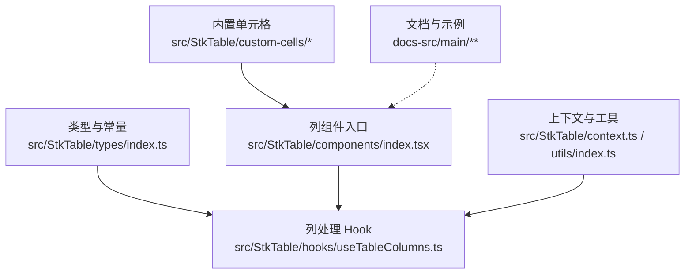
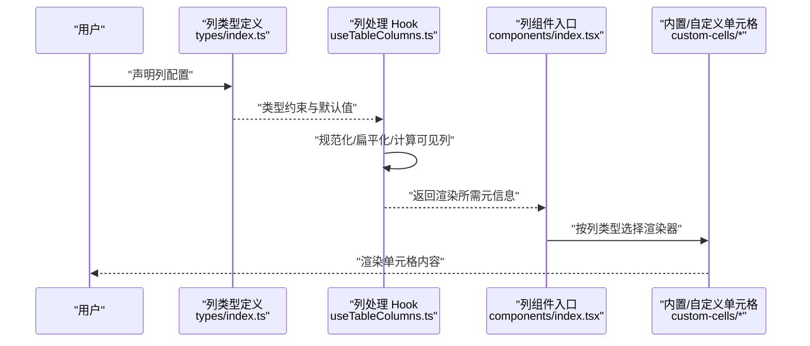
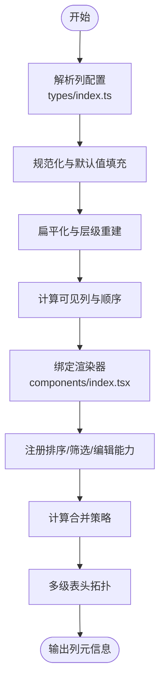
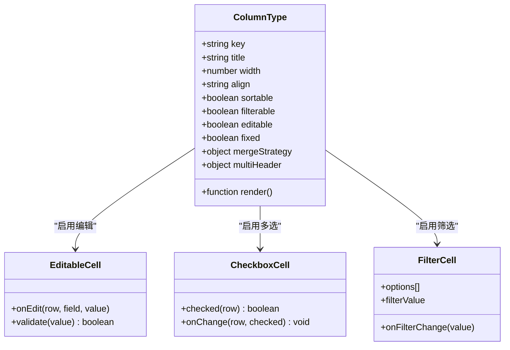
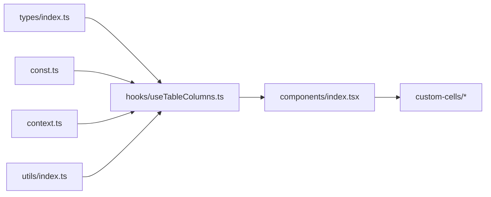

# 列配置 (Column)

<cite>
**本文引用的文件**   
- [src/StkTable/types/index.ts](file://src/StkTable/types/index.ts)
- [src/StkTable/hooks/useTableColumns.ts](file://src/StkTable/hooks/useTableColumns.ts)
- [src/StkTable/components/index.tsx](file://src/StkTable/components/index.tsx)
- [src/StkTable/const.ts](file://src/StkTable/const.ts)
- [src/StkTable/context.ts](file://src/StkTable/context.ts)
- [src/StkTable/utils/index.ts](file://src/StkTable/utils/index.ts)
- [src/StkTable/custom-cells/EditableCell/index.tsx](file://src/StkTable/custom-cells/EditableCell/index.tsx)
- [src/StkTable/custom-cells/CheckboxCell/index.tsx](file://src/StkTable/custom-cells/CheckboxCell/index.tsx)
- [src/StkTable/custom-cells/FilterCell/index.tsx](file://src/StkTable/custom-cells/FilterCell/index.tsx)
- [docs-src/main/api/stk-table-column.md](file://docs-src/main/api/stk-table-column.md)
- [docs-src/main/table/basic/fixed.md](file://docs-src/main/table/basic/fixed.md)
- [docs-src/main/table/basic/sort.md](file://docs-src/main/table/basic/sort.md)
- [docs-src/main/table/basic/merge-cells.md](file://docs-src/main/table/basic/merge-cells.md)
- [docs-src/main/table/basic/multi-header.md](file://docs-src/main/table/basic/multi-header.md)
- [docs-src/main/table/advanced/custom-cell.md](file://docs-src/main/table/advanced/custom-cell.md)
- [docs-src/main/table/advanced/custom-cells/editable-cell.md](file://docs-src/main/table/advanced/custom-cells/editable-cell.md)
- [docs-src/main/table/advanced/custom-cells/checkbox-cell.md](file://docs-src/main/table/advanced/custom-cells/checkbox-cell.md)
- [docs-src/main/table/advanced/custom-cells/filter-cell.md](file://docs-src/main/table/advanced/custom-cells/filter-cell.md)
</cite>

## 目录
1. [简介](#简介)
2. [项目结构](#项目结构)
3. [核心组件](#核心组件)
4. [架构总览](#架构总览)
5. [详细组件分析](#详细组件分析)
6. [依赖分析](#依赖分析)
7. [性能考虑](#性能考虑)
8. [故障排查指南](#故障排查指南)
9. [结论](#结论)
10. [附录](#附录)

## 简介
本章节面向 StkTable 的列配置（StkTableColumn），系统化梳理列定义的所有属性与方法，覆盖基础配置、渲染方式、排序与筛选、编辑能力、固定列、合并单元格、多级表头、条件渲染与动态配置等高级场景。文档同时提供 TypeScript 类型说明、使用示例路径与最佳实践建议，帮助读者快速上手并构建高质量表格体验。

## 项目结构
围绕列配置的核心代码主要分布在以下位置：
- 类型定义与常量：types、const
- 列处理 Hook：hooks/useTableColumns.ts
- 列组件入口：components/index.tsx
- 内置自定义单元格：custom-cells/*
- 文档与示例：docs-src/main/**

图表来源
- [src/StkTable/types/index.ts](file://src/StkTable/types/index.ts)
- [src/StkTable/hooks/useTableColumns.ts](file://src/StkTable/hooks/useTableColumns.ts)
- [src/StkTable/components/index.tsx](file://src/StkTable/components/index.tsx)
- [src/StkTable/custom-cells/EditableCell/index.tsx](file://src/StkTable/custom-cells/EditableCell/index.tsx)
- [src/StkTable/custom-cells/CheckboxCell/index.tsx](file://src/StkTable/custom-cells/CheckboxCell/index.tsx)
- [src/StkTable/custom-cells/FilterCell/index.tsx](file://src/StkTable/custom-cells/FilterCell/index.tsx)
- [src/StkTable/context.ts](file://src/StkTable/context.ts)
- [src/StkTable/utils/index.ts](file://src/StkTable/utils/index.ts)
- [docs-src/main/api/stk-table-column.md](file://docs-src/main/api/stk-table-column.md)

章节来源
- [src/StkTable/types/index.ts](file://src/StkTable/types/index.ts)
- [src/StkTable/hooks/useTableColumns.ts](file://src/StkTable/hooks/useTableColumns.ts)
- [src/StkTable/components/index.tsx](file://src/StkTable/components/index.tsx)
- [docs-src/main/api/stk-table-column.md](file://docs-src/main/api/stk-table-column.md)

## 核心组件
- 列类型与字段：在类型文件中集中定义列的所有属性，包括基本展示、对齐、宽度、排序、筛选、编辑、固定、合并、多级表头等。
- 列处理 Hook：负责将用户传入的列配置规范化、扁平化、计算可见列、生成渲染器、合并策略、排序与筛选集成点等。
- 列组件入口：解析列节点，根据类型选择内置或自定义单元格，注入行数据、上下文与事件回调。
- 内置单元格：提供可编辑、复选框、筛选器等常用单元格实现，便于快速启用列的高级能力。

章节来源
- [src/StkTable/types/index.ts](file://src/StkTable/types/index.ts)
- [src/StkTable/hooks/useTableColumns.ts](file://src/StkTable/hooks/useTableColumns.ts)
- [src/StkTable/components/index.tsx](file://src/StkTable/components/index.tsx)
- [src/StkTable/custom-cells/EditableCell/index.tsx](file://src/StkTable/custom-cells/EditableCell/index.tsx)
- [src/StkTable/custom-cells/CheckboxCell/index.tsx](file://src/StkTable/custom-cells/CheckboxCell/index.tsx)
- [src/StkTable/custom-cells/FilterCell/index.tsx](file://src/StkTable/custom-cells/FilterCell/index.tsx)

## 架构总览
下图展示了列配置从声明到渲染的关键流程：用户声明列 -> 列处理 Hook 规范化与计算 -> 列组件选择渲染器 -> 内置/自定义单元格渲染。

图表来源
- [src/StkTable/types/index.ts](file://src/StkTable/types/index.ts)
- [src/StkTable/hooks/useTableColumns.ts](file://src/StkTable/hooks/useTableColumns.ts)
- [src/StkTable/components/index.tsx](file://src/StkTable/components/index.tsx)
- [src/StkTable/custom-cells/EditableCell/index.tsx](file://src/StkTable/custom-cells/EditableCell/index.tsx)
- [src/StkTable/custom-cells/CheckboxCell/index.tsx](file://src/StkTable/custom-cells/CheckboxCell/index.tsx)
- [src/StkTable/custom-cells/FilterCell/index.tsx](file://src/StkTable/custom-cells/FilterCell/index.tsx)

## 详细组件分析

### 列类型与属性总览
- 基本展示
  - 标题、键名、宽度、最小/最大宽度、对齐、换行、省略、溢出行为、样式类名等。
  - 参考路径：[src/StkTable/types/index.ts](file://src/StkTable/types/index.ts)
- 渲染方式
  - 支持函数渲染、插槽、内置单元格类型；可通过列级渲染器覆盖默认显示。
  - 参考路径：[src/StkTable/components/index.tsx](file://src/StkTable/components/index.tsx)、[docs-src/main/table/advanced/custom-cell.md](file://docs-src/main/table/advanced/custom-cell.md)
- 排序与筛选
  - 开启排序、多列排序、自定义比较器、远程排序开关；筛选器通过 FilterCell 或自定义筛选组件接入。
  - 参考路径：[src/StkTable/types/index.ts](file://src/StkTable/types/index.ts)、[src/StkTable/custom-cells/FilterCell/index.tsx](file://src/StkTable/custom-cells/FilterCell/index.tsx)、[docs-src/main/table/basic/sort.md](file://docs-src/main/table/basic/sort.md)
- 编辑功能
  - 通过 EditableCell 或自定义编辑器启用行内编辑，支持校验、提交回调、批量更新。
  - 参考路径：[src/StkTable/custom-cells/EditableCell/index.tsx](file://src/StkTable/custom-cells/EditableCell/index.tsx)、[docs-src/main/table/advanced/custom-cells/editable-cell.md](file://docs-src/main/table/advanced/custom-cells/editable-cell.md)
- 固定列
  - 支持左/右固定、固定模式、虚拟滚动下的固定列表现。
  - 参考路径：[src/StkTable/types/index.ts](file://src/StkTable/types/index.ts)、[docs-src/main/table/basic/fixed.md](file://docs-src/main/table/basic/fixed.md)
- 合并单元格
  - 行列合并策略、跨页/虚拟滚动注意事项。
  - 参考路径：[src/StkTable/types/index.ts](file://src/StkTable/types/index.ts)、[docs-src/main/table/basic/merge-cells.md](file://docs-src/main/table/basic/merge-cells.md)
- 多级表头
  - 支持父子列嵌套、叶子列固定、虚拟横向滚动组合。
  - 参考路径：[src/StkTable/types/index.ts](file://src/StkTable/types/index.ts)、[docs-src/main/table/basic/multi-header.md](file://docs-src/main/table/basic/multi-header.md)
- 其他特性
  - 复选框列、序号列、树形展开列、空态占位、斑马纹、主题变量等。
  - 参考路径：[src/StkTable/custom-cells/CheckboxCell/index.tsx](file://src/StkTable/custom-cells/CheckboxCell/index.tsx)、[docs-src/main/table/basic/checkbox.md](file://docs-src/main/table/basic/checkbox.md)

章节来源
- [src/StkTable/types/index.ts](file://src/StkTable/types/index.ts)
- [src/StkTable/components/index.tsx](file://src/StkTable/components/index.tsx)
- [src/StkTable/custom-cells/EditableCell/index.tsx](file://src/StkTable/custom-cells/EditableCell/index.tsx)
- [src/StkTable/custom-cells/CheckboxCell/index.tsx](file://src/StkTable/custom-cells/CheckboxCell/index.tsx)
- [src/StkTable/custom-cells/FilterCell/index.tsx](file://src/StkTable/custom-cells/FilterCell/index.tsx)
- [docs-src/main/table/advanced/custom-cell.md](file://docs-src/main/table/advanced/custom-cell.md)
- [docs-src/main/table/advanced/custom-cells/editable-cell.md](file://docs-src/main/table/advanced/custom-cells/editable-cell.md)
- [docs-src/main/table/advanced/custom-cells/checkbox-cell.md](file://docs-src/main/table/advanced/custom-cells/checkbox-cell.md)
- [docs-src/main/table/advanced/custom-cells/filter-cell.md](file://docs-src/main/table/advanced/custom-cells/filter-cell.md)
- [docs-src/main/table/basic/fixed.md](file://docs-src/main/table/basic/fixed.md)
- [docs-src/main/table/basic/sort.md](file://docs-src/main/table/basic/sort.md)
- [docs-src/main/table/basic/merge-cells.md](file://docs-src/main/table/basic/merge-cells.md)
- [docs-src/main/table/basic/multi-header.md](file://docs-src/main/table/basic/multi-header.md)

### 列处理 Hook 工作流
该 Hook 负责将原始列配置转换为运行时可用的列元信息，包括：
- 列扁平化与层级关系重建
- 可见列过滤与顺序计算
- 渲染器绑定（内置/自定义）
- 排序/筛选/编辑能力的注册与钩子挂载
- 合并策略与多级表头的拓扑计算

图表来源
- [src/StkTable/types/index.ts](file://src/StkTable/types/index.ts)
- [src/StkTable/hooks/useTableColumns.ts](file://src/StkTable/hooks/useTableColumns.ts)
- [src/StkTable/components/index.tsx](file://src/StkTable/components/index.tsx)

章节来源
- [src/StkTable/hooks/useTableColumns.ts](file://src/StkTable/hooks/useTableColumns.ts)
- [src/StkTable/types/index.ts](file://src/StkTable/types/index.ts)
- [src/StkTable/components/index.tsx](file://src/StkTable/components/index.tsx)

### 内置单元格与列能力映射
- 可编辑单元格：用于启用列的编辑能力，支持校验与提交回调。
- 复选框单元格：用于多选列，常与表格级选择联动。
- 筛选单元格：提供下拉筛选 UI，可与表格筛选状态同步。

图表来源
- [src/StkTable/types/index.ts](file://src/StkTable/types/index.ts)
- [src/StkTable/custom-cells/EditableCell/index.tsx](file://src/StkTable/custom-cells/EditableCell/index.tsx)
- [src/StkTable/custom-cells/CheckboxCell/index.tsx](file://src/StkTable/custom-cells/CheckboxCell/index.tsx)
- [src/StkTable/custom-cells/FilterCell/index.tsx](file://src/StkTable/custom-cells/FilterCell/index.tsx)

章节来源
- [src/StkTable/custom-cells/EditableCell/index.tsx](file://src/StkTable/custom-cells/EditableCell/index.tsx)
- [src/StkTable/custom-cells/CheckboxCell/index.tsx](file://src/StkTable/custom-cells/CheckboxCell/index.tsx)
- [src/StkTable/custom-cells/FilterCell/index.tsx](file://src/StkTable/custom-cells/FilterCell/index.tsx)
- [src/StkTable/types/index.ts](file://src/StkTable/types/index.ts)

### 复杂场景方案

#### 列的嵌套结构与多级表头
- 通过父列包含子列数组实现多级表头；叶子列决定数据绑定与渲染。
- 固定列与多级表头组合时，需确保叶子列的固定方向一致以避免布局错乱。
- 参考路径：[docs-src/main/table/basic/multi-header.md](file://docs-src/main/table/basic/multi-header.md)

章节来源
- [docs-src/main/table/basic/multi-header.md](file://docs-src/main/table/basic/multi-header.md)
- [src/StkTable/types/index.ts](file://src/StkTable/types/index.ts)

#### 条件渲染与动态配置
- 基于行数据或全局状态动态切换列的可见性、只读/可编辑、排序/筛选开关。
- 使用列级 render 函数或插槽进行差异化展示。
- 参考路径：[src/StkTable/components/index.tsx](file://src/StkTable/components/index.tsx)、[docs-src/main/table/advanced/custom-cell.md](file://docs-src/main/table/advanced/custom-cell.md)

章节来源
- [src/StkTable/components/index.tsx](file://src/StkTable/components/index.tsx)
- [docs-src/main/table/advanced/custom-cell.md](file://docs-src/main/table/advanced/custom-cell.md)

#### 合并单元格
- 通过列级合并策略指定合并范围与规则；注意虚拟滚动与分页时的边界处理。
- 参考路径：[docs-src/main/table/basic/merge-cells.md](file://docs-src/main/table/basic/merge-cells.md)

章节来源
- [docs-src/main/table/basic/merge-cells.md](file://docs-src/main/table/basic/merge-cells.md)
- [src/StkTable/types/index.ts](file://src/StkTable/types/index.ts)

#### 排序与筛选
- 本地排序：设置 sortable 并提供比较器；支持多列排序。
- 远程排序：开启远程模式，由上层管理排序参数与数据刷新。
- 筛选：使用 FilterCell 或自定义筛选组件，维护筛选状态并与数据源联动。
- 参考路径：[docs-src/main/table/basic/sort.md](file://docs-src/main/table/basic/sort.md)、[src/StkTable/custom-cells/FilterCell/index.tsx](file://src/StkTable/custom-cells/FilterCell/index.tsx)

章节来源
- [docs-src/main/table/basic/sort.md](file://docs-src/main/table/basic/sort.md)
- [src/StkTable/custom-cells/FilterCell/index.tsx](file://src/StkTable/custom-cells/FilterCell/index.tsx)

#### 编辑功能
- 启用列的 editable 或使用 EditableCell；实现 onEdit 回调以持久化变更。
- 结合表单校验与错误提示，提升用户体验。
- 参考路径：[docs-src/main/table/advanced/custom-cells/editable-cell.md](file://docs-src/main/table/advanced/custom-cells/editable-cell.md)

章节来源
- [docs-src/main/table/advanced/custom-cells/editable-cell.md](file://docs-src/main/table/advanced/custom-cells/editable-cell.md)
- [src/StkTable/custom-cells/EditableCell/index.tsx](file://src/StkTable/custom-cells/EditableCell/index.tsx)

#### 固定列
- 设置 fixed 为 left/right 实现左右固定；配合固定模式与虚拟滚动优化性能。
- 参考路径：[docs-src/main/table/basic/fixed.md](file://docs-src/main/table/basic/fixed.md)

章节来源
- [docs-src/main/table/basic/fixed.md](file://docs-src/main/table/basic/fixed.md)
- [src/StkTable/types/index.ts](file://src/StkTable/types/index.ts)

## 依赖分析
- 类型与常量：types/index.ts 与 const.ts 提供列属性的类型约束与默认值。
- Hook 与组件：useTableColumns.ts 与 components/index.tsx 构成列处理与渲染的核心链路。
- 内置单元格：custom-cells/* 提供可复用能力，降低列配置复杂度。
- 上下文与工具：context.ts 与 utils/index.ts 提供共享状态与通用方法。

图表来源
- [src/StkTable/types/index.ts](file://src/StkTable/types/index.ts)
- [src/StkTable/const.ts](file://src/StkTable/const.ts)
- [src/StkTable/hooks/useTableColumns.ts](file://src/StkTable/hooks/useTableColumns.ts)
- [src/StkTable/components/index.tsx](file://src/StkTable/components/index.tsx)
- [src/StkTable/custom-cells/EditableCell/index.tsx](file://src/StkTable/custom-cells/EditableCell/index.tsx)
- [src/StkTable/custom-cells/CheckboxCell/index.tsx](file://src/StkTable/custom-cells/CheckboxCell/index.tsx)
- [src/StkTable/custom-cells/FilterCell/index.tsx](file://src/StkTable/custom-cells/FilterCell/index.tsx)
- [src/StkTable/context.ts](file://src/StkTable/context.ts)
- [src/StkTable/utils/index.ts](file://src/StkTable/utils/index.ts)

章节来源
- [src/StkTable/types/index.ts](file://src/StkTable/types/index.ts)
- [src/StkTable/const.ts](file://src/StkTable/const.ts)
- [src/StkTable/hooks/useTableColumns.ts](file://src/StkTable/hooks/useTableColumns.ts)
- [src/StkTable/components/index.tsx](file://src/StkTable/components/index.tsx)
- [src/StkTable/context.ts](file://src/StkTable/context.ts)
- [src/StkTable/utils/index.ts](file://src/StkTable/utils/index.ts)

## 性能考虑
- 列数量较多时，优先使用虚拟滚动与按需渲染，减少首屏开销。
- 固定列与多级表头组合会增加布局计算成本，尽量保持叶子列固定方向一致。
- 合并单元格在大数据集下需谨慎使用，避免频繁重排。
- 自定义渲染函数应轻量，避免在 render 中执行昂贵计算。

## 故障排查指南
- 列不显示：检查列是否被过滤、key 是否唯一、层级是否正确。
- 排序无效：确认 sortable 已开启且比较器逻辑正确；远程排序需保证参数传递与数据刷新。
- 筛选不生效：核对筛选状态是否与数据源同步，FilterCell 的 options 与 filterValue 是否匹配。
- 编辑无响应：检查 editable 或 EditableCell 的 onEdit 回调是否触发，校验失败是否阻止提交。
- 固定列错位：确认固定方向与多级表头叶子列一致性，必要时调整固定模式。
- 合并异常：验证合并策略的范围计算，关注虚拟滚动与分页边界。

章节来源
- [src/StkTable/hooks/useTableColumns.ts](file://src/StkTable/hooks/useTableColumns.ts)
- [src/StkTable/components/index.tsx](file://src/StkTable/components/index.tsx)
- [src/StkTable/custom-cells/EditableCell/index.tsx](file://src/StkTable/custom-cells/EditableCell/index.tsx)
- [src/StkTable/custom-cells/FilterCell/index.tsx](file://src/StkTable/custom-cells/FilterCell/index.tsx)

## 结论
通过对列配置的全面梳理，读者可以掌握从基础展示到高级特性的完整能力矩阵。建议在大型项目中采用“类型先行、Hook 统一处理、内置单元格复用”的策略，并结合文档中的最佳实践与示例路径，快速构建稳定高效的表格体验。

## 附录

### TypeScript 类型定义索引
- 列类型主定义与扩展：[src/StkTable/types/index.ts](file://src/StkTable/types/index.ts)
- 常量与默认值：[src/StkTable/const.ts](file://src/StkTable/const.ts)
- 列处理 Hook 接口与返回值：[src/StkTable/hooks/useTableColumns.ts](file://src/StkTable/hooks/useTableColumns.ts)
- 列组件入口与渲染契约：[src/StkTable/components/index.tsx](file://src/StkTable/components/index.tsx)

### 使用示例与文档路径
- 列 API 总览：[docs-src/main/api/stk-table-column.md](file://docs-src/main/api/stk-table-column.md)
- 固定列：[docs-src/main/table/basic/fixed.md](file://docs-src/main/table/basic/fixed.md)
- 排序：[docs-src/main/table/basic/sort.md](file://docs-src/main/table/basic/sort.md)
- 合并单元格：[docs-src/main/table/basic/merge-cells.md](file://docs-src/main/table/basic/merge-cells.md)
- 多级表头：[docs-src/main/table/basic/multi-header.md](file://docs-src/main/table/basic/multi-header.md)
- 自定义单元格：[docs-src/main/table/advanced/custom-cell.md](file://docs-src/main/table/advanced/custom-cell.md)
- 可编辑单元格：[docs-src/main/table/advanced/custom-cells/editable-cell.md](file://docs-src/main/table/advanced/custom-cells/editable-cell.md)
- 复选框单元格：[docs-src/main/table/advanced/custom-cells/checkbox-cell.md](file://docs-src/main/table/advanced/custom-cells/checkbox-cell.md)
- 筛选单元格：[docs-src/main/table/advanced/custom-cells/filter-cell.md](file://docs-src/main/table/advanced/custom-cells/filter-cell.md)