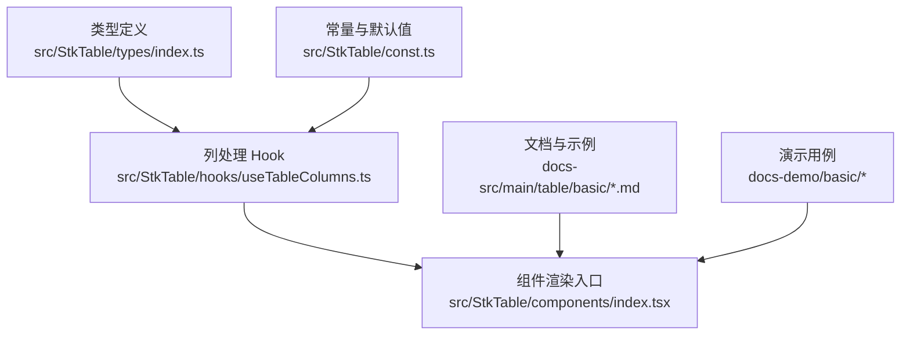
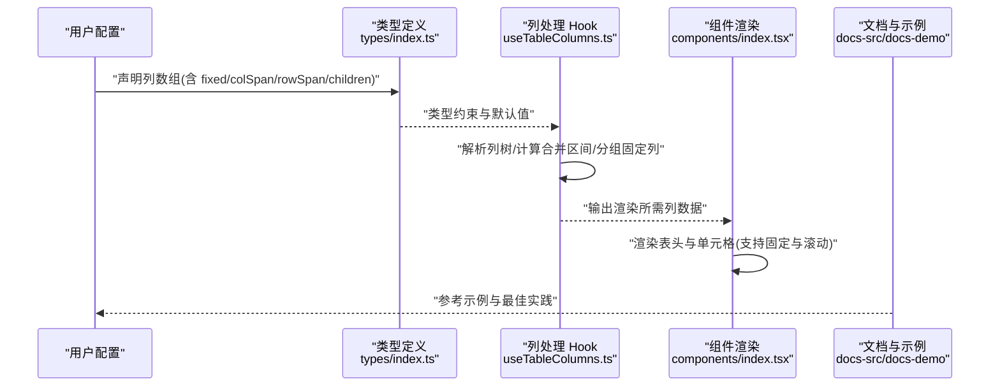
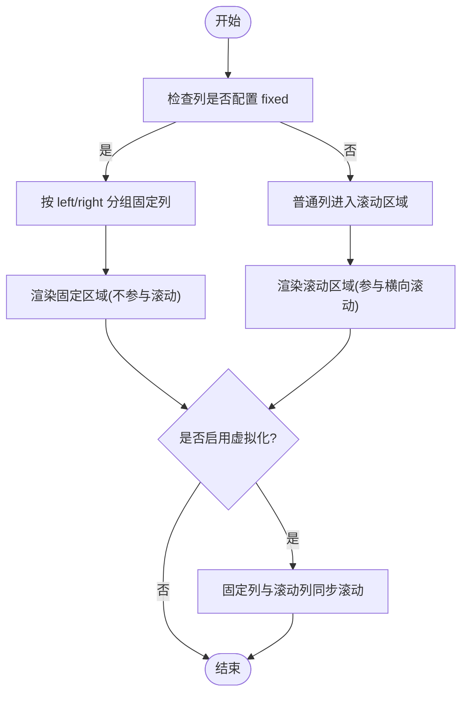
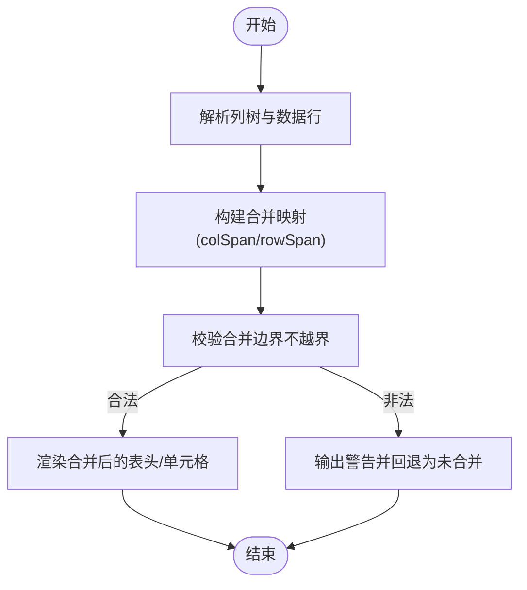
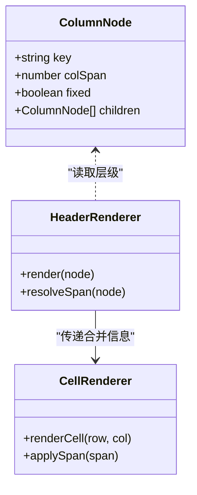
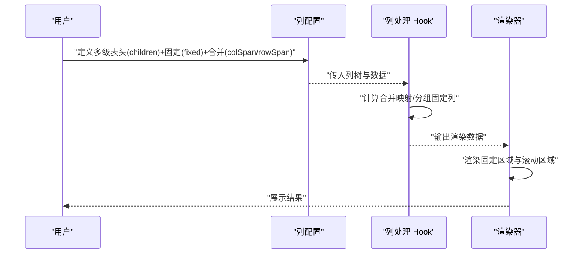
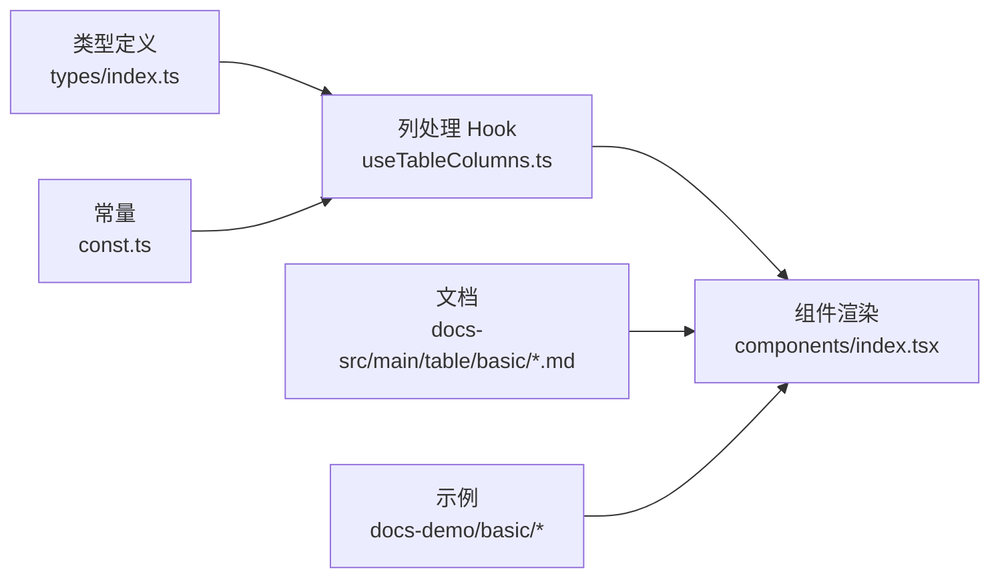

# 列高级配置

<cite>
**本文引用的文件**   
- [src/StkTable/types/index.ts](file://src/StkTable/types/index.ts)
- [src/StkTable/hooks/useTableColumns.ts](file://src/StkTable/hooks/useTableColumns.ts)
- [src/StkTable/components/index.tsx](file://src/StkTable/components/index.tsx)
- [src/StkTable/const.ts](file://src/StkTable/const.ts)
- [docs-src/main/table/basic/fixed.md](file://docs-src/main/table/basic/fixed.md)
- [docs-src/main/table/basic/merge-cells.md](file://docs-src/main/table/basic/merge-cells.md)
- [docs-src/main/table/basic/multi-header.md](file://docs-src/main/table/basic/multi-header.md)
- [docs-demo/basic/fixed/Fixed.tsx](file://docs-demo/basic/fixed/Fixed.tsx)
- [docs-demo/basic/fixed/FixedVirtual.tsx](file://docs-demo/basic/fixed/FixedVirtual.tsx)
- [docs-demo/basic/merge-cells/MergeCellsRow.tsx](file://docs-demo/basic/merge-cells/MergeCellsRow.tsx)
- [docs-demo/basic/merge-cells/MergeCellsCol.tsx](file://docs-demo/basic/merge-cells/MergeCellsCol.tsx)
- [docs-demo/basic/multi-header/MultiHeader.tsx](file://docs-demo/basic/multi-header/MultiHeader.tsx)
- [docs-demo/basic/multi-header/MultiHeaderFixed.tsx](file://docs-demo/basic/multi-header/MultiHeaderFixed.tsx)
- [docs-demo/basic/multi-header/MultiHeaderAnyFixed.tsx](file://docs-demo/basic/multi-header/MultiHeaderAnyFixed.tsx)
- [docs-demo/basic/multi-header/MultiHeaderLeavesFixed.tsx](file://docs-demo/basic/multi-header/MultiHeaderLeavesFixed.tsx)
</cite>

## 目录
1. [简介](#简介)
2. [项目结构](#项目结构)
3. [核心组件](#核心组件)
4. [架构总览](#架构总览)
5. [详细组件分析](#详细组件分析)
6. [依赖分析](#依赖分析)
7. [性能考虑](#性能考虑)
8. [故障排查指南](#故障排查指南)
9. [结论](#结论)
10. [附录](#附录)

## 简介
本章节聚焦 StkTable 的“列高级配置”，围绕以下能力展开：
- 固定列（fixed）：左侧固定、右侧固定、滚动行为与虚拟化的协同。
- 合并单元格（colSpan/rowSpan）：行合并与列合并的实现原理与配置方式。
- 嵌套列（children）：多级表头层级结构与配置技巧。
- 组合示例：将上述特性组合使用，覆盖复杂业务场景。

## 项目结构
与“列高级配置”直接相关的代码与文档分布如下：
- 类型定义与常量：位于 src/StkTable/types/index.ts 与 src/StkTable/const.ts，提供 fixed、colSpan、rowSpan、children 等字段类型与默认值。
- 列处理 Hook：src/StkTable/hooks/useTableColumns.ts 负责解析列树、计算合并区间、生成渲染所需的数据结构。
- 组件入口：src/StkTable/components/index.tsx 消费列数据并渲染表头与单元格。
- 文档与示例：docs-src 下的 API 文档与 docs-demo 下的演示用例，涵盖 fixed、merge-cells、multi-header 等主题。

图表来源
- [src/StkTable/types/index.ts](file://src/StkTable/types/index.ts)
- [src/StkTable/hooks/useTableColumns.ts](file://src/StkTable/hooks/useTableColumns.ts)
- [src/StkTable/components/index.tsx](file://src/StkTable/components/index.tsx)
- [src/StkTable/const.ts](file://src/StkTable/const.ts)
- [docs-src/main/table/basic/fixed.md](file://docs-src/main/table/basic/fixed.md)
- [docs-src/main/table/basic/merge-cells.md](file://docs-src/main/table/basic/merge-cells.md)
- [docs-src/main/table/basic/multi-header.md](file://docs-src/main/table/basic/multi-header.md)

章节来源
- [src/StkTable/types/index.ts](file://src/StkTable/types/index.ts)
- [src/StkTable/hooks/useTableColumns.ts](file://src/StkTable/hooks/useTableColumns.ts)
- [src/StkTable/components/index.tsx](file://src/StkTable/components/index.tsx)
- [src/StkTable/const.ts](file://src/StkTable/const.ts)
- [docs-src/main/table/basic/fixed.md](file://docs-src/main/table/basic/fixed.md)
- [docs-src/main/table/basic/merge-cells.md](file://docs-src/main/table/basic/merge-cells.md)
- [docs-src/main/table/basic/multi-header.md](file://docs-src/main/table/basic/multi-header.md)

## 核心组件
- 列类型体系：在类型文件中定义了列节点的关键字段，包括 fixed、colSpan、rowSpan、children 等，用于描述列的固定位置、合并范围与层级关系。
- 列处理逻辑：Hook 中实现列树的扁平化、合并区间的计算、固定列分组与排序，以及为渲染层准备的数据结构。
- 渲染层：组件根据 Hook 产出的数据结构进行表头与单元格的绘制，支持固定列区域与滚动区域的分离渲染。

章节来源
- [src/StkTable/types/index.ts](file://src/StkTable/types/index.ts)
- [src/StkTable/hooks/useTableColumns.ts](file://src/StkTable/hooks/useTableColumns.ts)
- [src/StkTable/components/index.tsx](file://src/StkTable/components/index.tsx)

## 架构总览
下图展示了从列配置到最终渲染的整体流程，突出固定列、合并单元格与嵌套列的处理链路。

图表来源
- [src/StkTable/types/index.ts](file://src/StkTable/types/index.ts)
- [src/StkTable/hooks/useTableColumns.ts](file://src/StkTable/hooks/useTableColumns.ts)
- [src/StkTable/components/index.tsx](file://src/StkTable/components/index.tsx)
- [docs-src/main/table/basic/fixed.md](file://docs-src/main/table/basic/fixed.md)
- [docs-src/main/table/basic/merge-cells.md](file://docs-src/main/table/basic/merge-cells.md)
- [docs-src/main/table/basic/multi-header.md](file://docs-src/main/table/basic/multi-header.md)

## 详细组件分析

### 固定列（fixed）
- 配置要点
  - 固定方向：支持左侧固定与右侧固定两种模式。
  - 固定列数量：可配置多列同时固定，分别置于左右两侧。
  - 滚动行为：固定列不参与横向滚动；当启用虚拟化时，固定列需与普通列保持同步滚动。
- 典型用法
  - 基础固定：在列配置中设置 fixed 属性以固定某列。
  - 左右双固定：在同一表格中同时配置左侧与右侧固定列。
  - 与虚拟化结合：在大数据量场景下，固定列与虚拟列表协同工作，避免重复渲染。
- 参考示例
  - 基础固定与虚拟化固定示例见：[docs-demo/basic/fixed/Fixed.tsx](file://docs-demo/basic/fixed/Fixed.tsx)、[docs-demo/basic/fixed/FixedVirtual.tsx](file://docs-demo/basic/fixed/FixedVirtual.tsx)。
  - 文档说明见：[docs-src/main/table/basic/fixed.md](file://docs-src/main/table/basic/fixed.md)。

图表来源
- [src/StkTable/hooks/useTableColumns.ts](file://src/StkTable/hooks/useTableColumns.ts)
- [src/StkTable/components/index.tsx](file://src/StkTable/components/index.tsx)
- [docs-demo/basic/fixed/Fixed.tsx](file://docs-demo/basic/fixed/Fixed.tsx)
- [docs-demo/basic/fixed/FixedVirtual.tsx](file://docs-demo/basic/fixed/FixedVirtual.tsx)

章节来源
- [docs-src/main/table/basic/fixed.md](file://docs-src/main/table/basic/fixed.md)
- [docs-demo/basic/fixed/Fixed.tsx](file://docs-demo/basic/fixed/Fixed.tsx)
- [docs-demo/basic/fixed/FixedVirtual.tsx](file://docs-demo/basic/fixed/FixedVirtual.tsx)
- [src/StkTable/hooks/useTableColumns.ts](file://src/StkTable/hooks/useTableColumns.ts)
- [src/StkTable/components/index.tsx](file://src/StkTable/components/index.tsx)

### 合并单元格（colSpan/rowSpan）
- 实现原理
  - 列合并（colSpan）：在表头或单元格层面指定跨列数，渲染时跳过被合并的后续列。
  - 行合并（rowSpan）：在单元格层面指定跨行数，渲染时跳过被合并的后续行对应单元格。
  - 计算过程：Hook 遍历列树与数据行，构建合并映射表，记录每个起始单元格的 colSpan/rowSpan 值。
- 配置方式
  - 表头合并：通过列节点的 colSpan 与 children 组合实现多级表头与跨列。
  - 数据行合并：在数据行对象上标注 rowSpan，或在列级别统一指定合并策略。
- 参考示例
  - 行合并示例：[docs-demo/basic/merge-cells/MergeCellsRow.tsx](file://docs-demo/basic/merge-cells/MergeCellsRow.tsx)
  - 列合并示例：[docs-demo/basic/merge-cells/MergeCellsCol.tsx](file://docs-demo/basic/merge-cells/MergeCellsCol.tsx)
  - 文档说明见：[docs-src/main/table/basic/merge-cells.md](file://docs-src/main/table/basic/merge-cells.md)

图表来源
- [src/StkTable/hooks/useTableColumns.ts](file://src/StkTable/hooks/useTableColumns.ts)
- [src/StkTable/components/index.tsx](file://src/StkTable/components/index.tsx)
- [docs-demo/basic/merge-cells/MergeCellsRow.tsx](file://docs-demo/basic/merge-cells/MergeCellsRow.tsx)
- [docs-demo/basic/merge-cells/MergeCellsCol.tsx](file://docs-demo/basic/merge-cells/MergeCellsCol.tsx)

章节来源
- [docs-src/main/table/basic/merge-cells.md](file://docs-src/main/table/basic/merge-cells.md)
- [docs-demo/basic/merge-cells/MergeCellsRow.tsx](file://docs-demo/basic/merge-cells/MergeCellsRow.tsx)
- [docs-demo/basic/merge-cells/MergeCellsCol.tsx](file://docs-demo/basic/merge-cells/MergeCellsCol.tsx)
- [src/StkTable/hooks/useTableColumns.ts](file://src/StkTable/hooks/useTableColumns.ts)
- [src/StkTable/components/index.tsx](file://src/StkTable/components/index.tsx)

### 嵌套列（children）
- 层级结构
  - 列节点可包含 children 子节点，形成多级表头。
  - 叶子节点通常对应具体数据列，非叶子节点仅作为分组标题。
- 配置技巧
  - 合理组织层级：避免过深层级导致可读性下降。
  - 与合并配合：父级节点可通过 colSpan 控制跨列宽度。
  - 与固定列配合：固定列可出现在任意层级，但需保证叶子列的固定方向一致以避免布局错乱。
- 参考示例
  - 基础多级表头：[docs-demo/basic/multi-header/MultiHeader.tsx](file://docs-demo/basic/multi-header/MultiHeader.tsx)
  - 与固定列组合：
    - 所有列固定：[docs-demo/basic/multi-header/MultiHeaderFixed.tsx](file://docs-demo/basic/multi-header/MultiHeaderFixed.tsx)
    - 任意列固定：[docs-demo/basic/multi-header/MultiHeaderAnyFixed.tsx](file://docs-demo/basic/multi-header/MultiHeaderAnyFixed.tsx)
    - 仅叶子列固定：[docs-demo/basic/multi-header/MultiHeaderLeavesFixed.tsx](file://docs-demo/basic/multi-header/MultiHeaderLeavesFixed.tsx)
  - 文档说明见：[docs-src/main/table/basic/multi-header.md](file://docs-src/main/table/basic/multi-header.md)

图表来源
- [src/StkTable/types/index.ts](file://src/StkTable/types/index.ts)
- [src/StkTable/hooks/useTableColumns.ts](file://src/StkTable/hooks/useTableColumns.ts)
- [src/StkTable/components/index.tsx](file://src/StkTable/components/index.tsx)
- [docs-demo/basic/multi-header/MultiHeader.tsx](file://docs-demo/basic/multi-header/MultiHeader.tsx)
- [docs-demo/basic/multi-header/MultiHeaderFixed.tsx](file://docs-demo/basic/multi-header/MultiHeaderFixed.tsx)
- [docs-demo/basic/multi-header/MultiHeaderAnyFixed.tsx](file://docs-demo/basic/multi-header/MultiHeaderAnyFixed.tsx)
- [docs-demo/basic/multi-header/MultiHeaderLeavesFixed.tsx](file://docs-demo/basic/multi-header/MultiHeaderLeavesFixed.tsx)

章节来源
- [docs-src/main/table/basic/multi-header.md](file://docs-src/main/table/basic/multi-header.md)
- [docs-demo/basic/multi-header/MultiHeader.tsx](file://docs-demo/basic/multi-header/MultiHeader.tsx)
- [docs-demo/basic/multi-header/MultiHeaderFixed.tsx](file://docs-demo/basic/multi-header/MultiHeaderFixed.tsx)
- [docs-demo/basic/multi-header/MultiHeaderAnyFixed.tsx](file://docs-demo/basic/multi-header/MultiHeaderAnyFixed.tsx)
- [docs-demo/basic/multi-header/MultiHeaderLeavesFixed.tsx](file://docs-demo/basic/multi-header/MultiHeaderLeavesFixed.tsx)
- [src/StkTable/types/index.ts](file://src/StkTable/types/index.ts)
- [src/StkTable/hooks/useTableColumns.ts](file://src/StkTable/hooks/useTableColumns.ts)
- [src/StkTable/components/index.tsx](file://src/StkTable/components/index.tsx)

### 组合示例：固定列 + 合并单元格 + 嵌套列
- 场景目标
  - 在多级表头下，对部分列进行左右固定，并对特定数据行或表头进行行列合并。
- 关键步骤
  - 定义列树：在父级节点使用 children 组织层级，必要时在父级设置 colSpan。
  - 固定列：在需要固定的叶子列上设置 fixed，确保固定方向一致。
  - 合并单元格：在表头或数据行上设置 colSpan/rowSpan，并在 Hook 中完成合并映射计算。
  - 验证与调试：检查合并边界是否越界、固定列是否与滚动区域对齐。
- 参考示例
  - 固定列示例：[docs-demo/basic/fixed/Fixed.tsx](file://docs-demo/basic/fixed/Fixed.tsx)、[docs-demo/basic/fixed/FixedVirtual.tsx](file://docs-demo/basic/fixed/FixedVirtual.tsx)
  - 合并单元格示例：[docs-demo/basic/merge-cells/MergeCellsRow.tsx](file://docs-demo/basic/merge-cells/MergeCellsRow.tsx)、[docs-demo/basic/merge-cells/MergeCellsCol.tsx](file://docs-demo/basic/merge-cells/MergeCellsCol.tsx)
  - 嵌套列示例：[docs-demo/basic/multi-header/MultiHeader.tsx](file://docs-demo/basic/multi-header/MultiHeader.tsx)
  - 文档说明：
    - [docs-src/main/table/basic/fixed.md](file://docs-src/main/table/basic/fixed.md)
    - [docs-src/main/table/basic/merge-cells.md](file://docs-src/main/table/basic/merge-cells.md)
    - [docs-src/main/table/basic/multi-header.md](file://docs-src/main/table/basic/multi-header.md)

图表来源
- [src/StkTable/hooks/useTableColumns.ts](file://src/StkTable/hooks/useTableColumns.ts)
- [src/StkTable/components/index.tsx](file://src/StkTable/components/index.tsx)
- [docs-demo/basic/fixed/Fixed.tsx](file://docs-demo/basic/fixed/Fixed.tsx)
- [docs-demo/basic/merge-cells/MergeCellsRow.tsx](file://docs-demo/basic/merge-cells/MergeCellsRow.tsx)
- [docs-demo/basic/multi-header/MultiHeader.tsx](file://docs-demo/basic/multi-header/MultiHeader.tsx)

章节来源
- [docs-src/main/table/basic/fixed.md](file://docs-src/main/table/basic/fixed.md)
- [docs-src/main/table/basic/merge-cells.md](file://docs-src/main/table/basic/merge-cells.md)
- [docs-src/main/table/basic/multi-header.md](file://docs-src/main/table/basic/multi-header.md)
- [docs-demo/basic/fixed/Fixed.tsx](file://docs-demo/basic/fixed/Fixed.tsx)
- [docs-demo/basic/merge-cells/MergeCellsRow.tsx](file://docs-demo/basic/merge-cells/MergeCellsRow.tsx)
- [docs-demo/basic/multi-header/MultiHeader.tsx](file://docs-demo/basic/multi-header/MultiHeader.tsx)
- [src/StkTable/hooks/useTableColumns.ts](file://src/StkTable/hooks/useTableColumns.ts)
- [src/StkTable/components/index.tsx](file://src/StkTable/components/index.tsx)

## 依赖分析
- 类型与常量
  - types/index.ts 提供列节点字段类型与默认值，供 Hook 与组件共同遵循。
  - const.ts 提供固定列方向、默认合并策略等常量。
- Hook 与组件
  - useTableColumns.ts 依赖类型与常量，产出渲染所需数据结构。
  - components/index.tsx 消费 Hook 输出，负责实际渲染。
- 文档与示例
  - docs-src 与 docs-demo 提供使用说明与参考实现，帮助开发者快速上手。

图表来源
- [src/StkTable/types/index.ts](file://src/StkTable/types/index.ts)
- [src/StkTable/const.ts](file://src/StkTable/const.ts)
- [src/StkTable/hooks/useTableColumns.ts](file://src/StkTable/hooks/useTableColumns.ts)
- [src/StkTable/components/index.tsx](file://src/StkTable/components/index.tsx)
- [docs-src/main/table/basic/fixed.md](file://docs-src/main/table/basic/fixed.md)
- [docs-src/main/table/basic/merge-cells.md](file://docs-src/main/table/basic/merge-cells.md)
- [docs-src/main/table/basic/multi-header.md](file://docs-src/main/table/basic/multi-header.md)

章节来源
- [src/StkTable/types/index.ts](file://src/StkTable/types/index.ts)
- [src/StkTable/const.ts](file://src/StkTable/const.ts)
- [src/StkTable/hooks/useTableColumns.ts](file://src/StkTable/hooks/useTableColumns.ts)
- [src/StkTable/components/index.tsx](file://src/StkTable/components/index.tsx)
- [docs-src/main/table/basic/fixed.md](file://docs-src/main/table/basic/fixed.md)
- [docs-src/main/table/basic/merge-cells.md](file://docs-src/main/table/basic/merge-cells.md)
- [docs-src/main/table/basic/multi-header.md](file://docs-src/main/table/basic/multi-header.md)

## 性能考虑
- 固定列与虚拟化
  - 固定列不参与滚动，应尽量减少固定列数量与内容复杂度。
  - 与虚拟列表协同工作时，确保固定列与普通列的滚动同步，避免重复计算。
- 合并单元格
  - 合并映射的计算复杂度与列数、行数相关，建议避免过大范围的合并。
  - 在大数据场景下，优先采用局部合并而非全局合并。
- 嵌套列
  - 层级过深会增加表头渲染开销，建议控制在合理深度。
  - 父级节点仅用于分组，避免在父级节点承载过多交互逻辑。

## 故障排查指南
- 固定列错位
  - 检查固定列方向是否一致（left/right），避免混用导致布局异常。
  - 确认固定列数量与列宽配置是否正确。
- 合并越界
  - 校验 colSpan/rowSpan 是否超出列数或行数边界。
  - 检查合并映射是否与其他合并冲突。
- 嵌套列显示异常
  - 确认父级 colSpan 与子列总数匹配。
  - 检查 children 层级是否闭合，避免遗漏叶子节点。
- 参考定位
  - 固定列问题参考：[docs-src/main/table/basic/fixed.md](file://docs-src/main/table/basic/fixed.md)
  - 合并单元格问题参考：[docs-src/main/table/basic/merge-cells.md](file://docs-src/main/table/basic/merge-cells.md)
  - 嵌套列问题参考：[docs-src/main/table/basic/multi-header.md](file://docs-src/main/table/basic/multi-header.md)

章节来源
- [docs-src/main/table/basic/fixed.md](file://docs-src/main/table/basic/fixed.md)
- [docs-src/main/table/basic/merge-cells.md](file://docs-src/main/table/basic/merge-cells.md)
- [docs-src/main/table/basic/multi-header.md](file://docs-src/main/table/basic/multi-header.md)

## 结论
StkTable 的列高级配置通过类型约束、Hook 处理与组件渲染三层协作，实现了固定列、合并单元格与嵌套列的强大能力。在实际项目中，建议：
- 明确列层级与固定策略，避免过度复杂。
- 谨慎使用大范围合并，关注性能与可维护性。
- 借助文档与示例快速验证配置效果，逐步迭代优化。

## 附录
- 常用配置键名
  - fixed：固定列方向（左/右）。
  - colSpan：列合并跨度。
  - rowSpan：行合并跨度。
  - children：嵌套列子节点数组。
- 参考路径
  - 类型定义：[src/StkTable/types/index.ts](file://src/StkTable/types/index.ts)
  - 列处理 Hook：[src/StkTable/hooks/useTableColumns.ts](file://src/StkTable/hooks/useTableColumns.ts)
  - 组件渲染：[src/StkTable/components/index.tsx](file://src/StkTable/components/index.tsx)
  - 常量与默认值：[src/StkTable/const.ts](file://src/StkTable/const.ts)
  - 文档与示例：
    - [docs-src/main/table/basic/fixed.md](file://docs-src/main/table/basic/fixed.md)
    - [docs-src/main/table/basic/merge-cells.md](file://docs-src/main/table/basic/merge-cells.md)
    - [docs-src/main/table/basic/multi-header.md](file://docs-src/main/table/basic/multi-header.md)
    - [docs-demo/basic/fixed/Fixed.tsx](file://docs-demo/basic/fixed/Fixed.tsx)
    - [docs-demo/basic/fixed/FixedVirtual.tsx](file://docs-demo/basic/fixed/FixedVirtual.tsx)
    - [docs-demo/basic/merge-cells/MergeCellsRow.tsx](file://docs-demo/basic/merge-cells/MergeCellsRow.tsx)
    - [docs-demo/basic/merge-cells/MergeCellsCol.tsx](file://docs-demo/basic/merge-cells/MergeCellsCol.tsx)
    - [docs-demo/basic/multi-header/MultiHeader.tsx](file://docs-demo/basic/multi-header/MultiHeader.tsx)
    - [docs-demo/basic/multi-header/MultiHeaderFixed.tsx](file://docs-demo/basic/multi-header/MultiHeaderFixed.tsx)
    - [docs-demo/basic/multi-header/MultiHeaderAnyFixed.tsx](file://docs-demo/basic/multi-header/MultiHeaderAnyFixed.tsx)
    - [docs-demo/basic/multi-header/MultiHeaderLeavesFixed.tsx](file://docs-demo/basic/multi-header/MultiHeaderLeavesFixed.tsx)