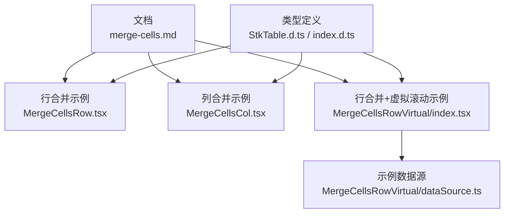
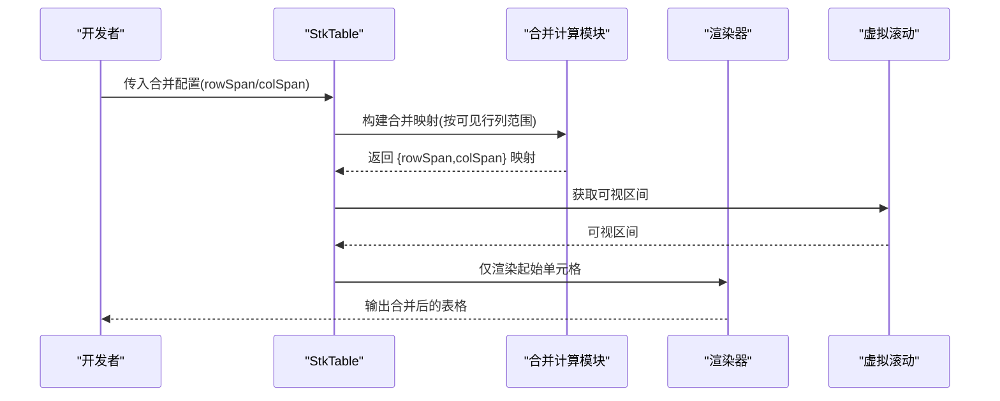
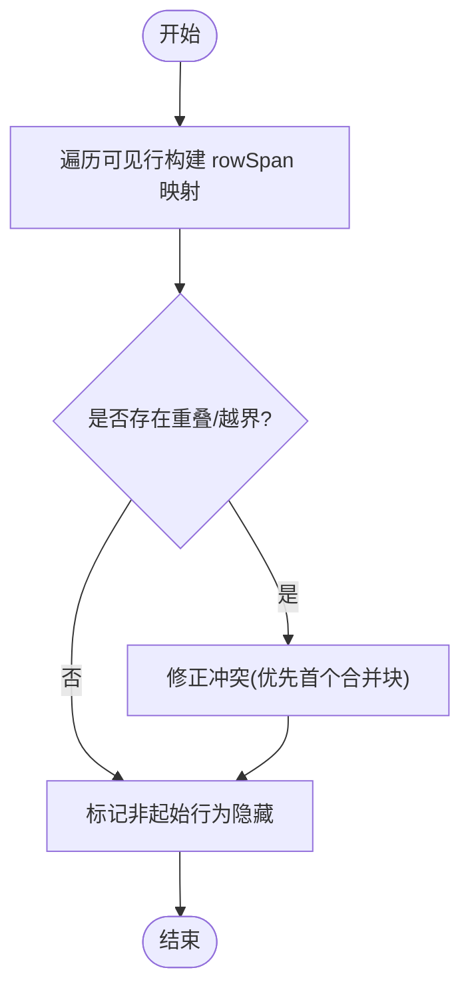
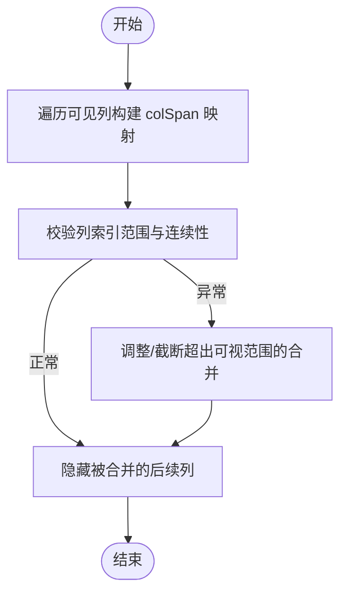
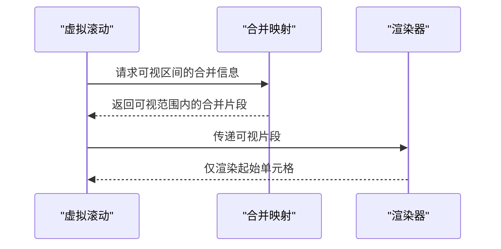
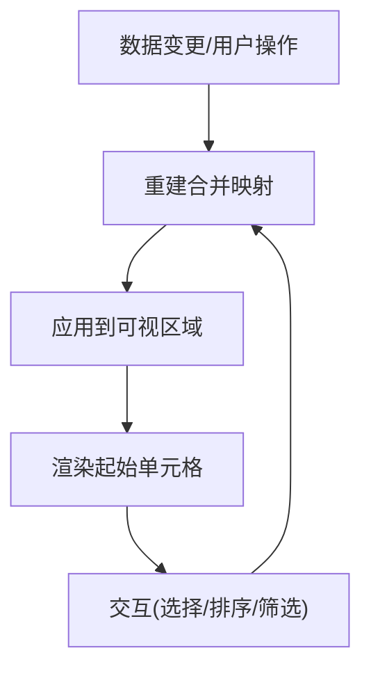
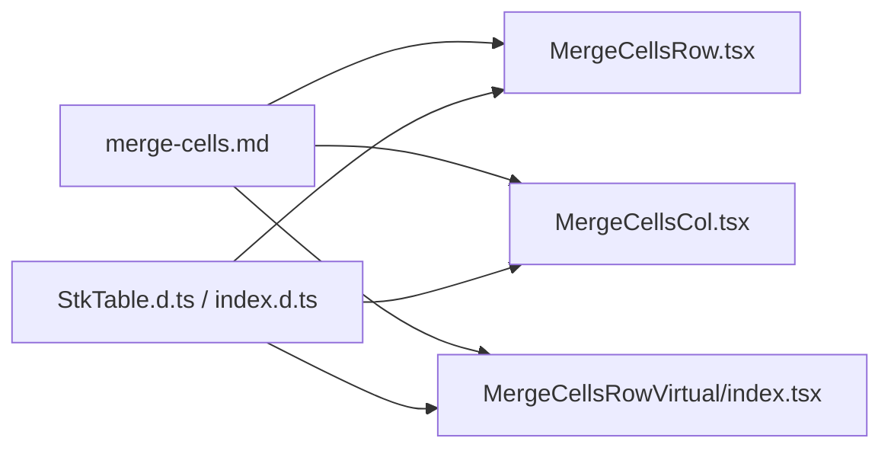

# 合并单元格

<cite>
**本文引用的文件**   
- [merge-cells.md](file://docs-src/main/table/basic/merge-cells.md)
- [MergeCellsRow.tsx](file://docs-demo/basic/merge-cells/MergeCellsRow.tsx)
- [MergeCellsCol.tsx](file://docs-demo/basic/merge-cells/MergeCellsCol.tsx)
- [MergeCellsRow/index.tsx](file://docs-demo/basic/merge-cells/MergeCellsRowVirtual/index.tsx)
- [MergeCellsRow/dataSource.ts](file://docs-demo/basic/merge-cells/MergeCellsRowVirtual/dataSource.ts)
- [StkTable.d.ts](file://lib/StkTable.d.ts)
- [index.d.ts](file://lib/index.d.ts)
</cite>

## 目录
1. [简介](#简介)
2. [项目结构](#项目结构)
3. [核心组件](#核心组件)
4. [架构总览](#架构总览)
5. [详细组件分析](#详细组件分析)
6. [依赖分析](#依赖分析)
7. [性能考虑](#性能考虑)
8. [故障排查指南](#故障排查指南)
9. [结论](#结论)
10. [附录](#附录)

## 简介
本章节聚焦 StkTable 的“合并单元格”能力，系统讲解行合并（rowSpan）与列合并（colSpan）的实现原理、配置方式、计算逻辑与边界处理，并给出与虚拟滚动的兼容方案。同时提供复杂表格布局下的设计模式（动态合并、条件合并等），并通过数据报表、统计表格等实际场景展示落地方案。

## 项目结构
围绕“合并单元格”，仓库提供了文档说明与示例实现：
- 文档说明：docs-src/main/table/basic/merge-cells.md
- 基础示例：docs-demo/basic/merge-cells/MergeCellsRow.tsx、MergeCellsCol.tsx
- 虚拟滚动示例：docs-demo/basic/merge-cells/MergeCellsRowVirtual/index.tsx、dataSource.ts
- 类型定义：lib/StkTable.d.ts、lib/index.d.ts

图表来源
- [merge-cells.md:1-200](file://docs-src/main/table/basic/merge-cells.md#L1-L200)
- [MergeCellsRow.tsx:1-200](file://docs-demo/basic/merge-cells/MergeCellsRow.tsx#L1-L200)
- [MergeCellsCol.tsx:1-200](file://docs-demo/basic/merge-cells/MergeCellsCol.tsx#L1-L200)
- [MergeCellsRowVirtual/index.tsx:1-200](file://docs-demo/basic/merge-cells/MergeCellsRowVirtual/index.tsx#L1-L200)
- [MergeCellsRowVirtual/dataSource.ts:1-200](file://docs-demo/basic/merge-cells/MergeCellsRowVirtual/dataSource.ts#L1-L200)
- [StkTable.d.ts:1-200](file://lib/StkTable.d.ts#L1-L200)
- [index.d.ts:1-200](file://lib/index.d.ts#L1-L200)

章节来源
- [merge-cells.md:1-200](file://docs-src/main/table/basic/merge-cells.md#L1-L200)
- [MergeCellsRow.tsx:1-200](file://docs-demo/basic/merge-cells/MergeCellsRow.tsx#L1-L200)
- [MergeCellsCol.tsx:1-200](file://docs-demo/basic/merge-cells/MergeCellsCol.tsx#L1-L200)
- [MergeCellsRowVirtual/index.tsx:1-200](file://docs-demo/basic/merge-cells/MergeCellsRowVirtual/index.tsx#L1-L200)
- [MergeCellsRowVirtual/dataSource.ts:1-200](file://docs-demo/basic/merge-cells/MergeCellsRowVirtual/dataSource.ts#L1-L200)
- [StkTable.d.ts:1-200](file://lib/StkTable.d.ts#L1-L200)
- [index.d.ts:1-200](file://lib/index.d.ts#L1-L200)

## 核心组件
- 文档入口：merge-cells.md 提供 API 说明、属性约定与使用建议。
- 行合并示例：MergeCellsRow.tsx 演示 rowSpan 的基本用法与常见布局。
- 列合并示例：MergeCellsCol.tsx 演示 colSpan 的基本用法与多级表头组合。
- 虚拟滚动示例：MergeCellsRowVirtual/index.tsx 演示在开启虚拟滚动时的行合并注意事项与数据组织方式。
- 类型定义：StkTable.d.ts 与 index.d.ts 暴露了合并相关的类型约束与接口契约。

章节来源
- [merge-cells.md:1-200](file://docs-src/main/table/basic/merge-cells.md#L1-L200)
- [MergeCellsRow.tsx:1-200](file://docs-demo/basic/merge-cells/MergeCellsRow.tsx#L1-L200)
- [MergeCellsCol.tsx:1-200](file://docs-demo/basic/merge-cells/MergeCellsCol.tsx#L1-L200)
- [MergeCellsRowVirtual/index.tsx:1-200](file://docs-demo/basic/merge-cells/MergeCellsRowVirtual/index.tsx#L1-L200)
- [StkTable.d.ts:1-200](file://lib/StkTable.d.ts#L1-L200)
- [index.d.ts:1-200](file://lib/index.d.ts#L1-L200)

## 架构总览
从“配置到渲染”的整体流程如下：
- 开发者通过 props 或列配置声明合并规则（如 rowSpan、colSpan）。
- 表格内部根据当前可见区域（含虚拟滚动裁剪）计算每个单元格的最终跨度。
- 渲染阶段仅对“起始单元格”进行绘制，其余被覆盖的单元格跳过，避免重复绘制。
- 交互层（选择、排序、筛选、固定列等）基于同一份合并映射进行命中检测与状态同步。

图表来源
- [merge-cells.md:1-200](file://docs-src/main/table/basic/merge-cells.md#L1-L200)
- [MergeCellsRowVirtual/index.tsx:1-200](file://docs-demo/basic/merge-cells/MergeCellsRowVirtual/index.tsx#L1-L200)
- [StkTable.d.ts:1-200](file://lib/StkTable.d.ts#L1-L200)

## 详细组件分析

### 行合并（rowSpan）
- 适用场景：分组标题、跨行统计、层级汇总等。
- 关键要点：
  - 仅在“起始行”设置 rowSpan，后续行对应位置不应再渲染内容。
  - 与虚拟滚动配合时，需确保合并区间内的所有行索引在数据源中连续且稳定。
  - 若存在排序/过滤，应在排序/过滤后重新计算合并映射，保证视觉正确性。
- 参考示例：
  - 基础行合并：[MergeCellsRow.tsx:1-200](file://docs-demo/basic/merge-cells/MergeCellsRow.tsx#L1-L200)
  - 行合并 + 虚拟滚动：[MergeCellsRowVirtual/index.tsx:1-200](file://docs-demo/basic/merge-cells/MergeCellsRowVirtual/index.tsx#L1-L200)、[MergeCellsRowVirtual/dataSource.ts:1-200](file://docs-demo/basic/merge-cells/MergeCellsRowVirtual/dataSource.ts#L1-L200)

图表来源
- [MergeCellsRow.tsx:1-200](file://docs-demo/basic/merge-cells/MergeCellsRow.tsx#L1-L200)
- [MergeCellsRowVirtual/index.tsx:1-200](file://docs-demo/basic/merge-cells/MergeCellsRowVirtual/index.tsx#L1-L200)

章节来源
- [MergeCellsRow.tsx:1-200](file://docs-demo/basic/merge-cells/MergeCellsRow.tsx#L1-L200)
- [MergeCellsRowVirtual/index.tsx:1-200](file://docs-demo/basic/merge-cells/MergeCellsRowVirtual/index.tsx#L1-L200)
- [MergeCellsRowVirtual/dataSource.ts:1-200](file://docs-demo/basic/merge-cells/MergeCellsRowVirtual/dataSource.ts#L1-L200)

### 列合并（colSpan）
- 适用场景：多级表头、横向分组、指标聚合等。
- 关键要点：
  - 仅在“起始列”设置 colSpan，后续列对应位置不渲染内容。
  - 与固定列、列宽自适应、拖拽调整列宽等功能联用时，需保证列顺序与宽度计算一致。
  - 与虚拟滚动（横向）配合时，应确保合并区间内的列索引在可视范围内完整呈现。
- 参考示例：
  - 基础列合并：[MergeCellsCol.tsx:1-200](file://docs-demo/basic/merge-cells/MergeCellsCol.tsx#L1-L200)

图表来源
- [MergeCellsCol.tsx:1-200](file://docs-demo/basic/merge-cells/MergeCellsCol.tsx#L1-L200)

章节来源
- [MergeCellsCol.tsx:1-200](file://docs-demo/basic/merge-cells/MergeCellsCol.tsx#L1-L200)

### 与虚拟滚动的兼容性
- 行虚拟滚动：
  - 合并区间必须完全落在数据源的真实行索引上；排序/分页/过滤后需重建映射。
  - 对于不可见区域的合并，只需维护映射，无需渲染。
- 列虚拟滚动：
  - 当合并跨越可视边界时，需将超出部分截断或延后渲染，避免错位。
- 参考示例：
  - 行合并 + 虚拟滚动：[MergeCellsRowVirtual/index.tsx:1-200](file://docs-demo/basic/merge-cells/MergeCellsRowVirtual/index.tsx#L1-L200)、[MergeCellsRowVirtual/dataSource.ts:1-200](file://docs-demo/basic/merge-cells/MergeCellsRowVirtual/dataSource.ts#L1-L200)

图表来源
- [MergeCellsRowVirtual/index.tsx:1-200](file://docs-demo/basic/merge-cells/MergeCellsRowVirtual/index.tsx#L1-L200)
- [MergeCellsRowVirtual/dataSource.ts:1-200](file://docs-demo/basic/merge-cells/MergeCellsRowVirtual/dataSource.ts#L1-L200)

章节来源
- [MergeCellsRowVirtual/index.tsx:1-200](file://docs-demo/basic/merge-cells/MergeCellsRowVirtual/index.tsx#L1-L200)
- [MergeCellsRowVirtual/dataSource.ts:1-200](file://docs-demo/basic/merge-cells/MergeCellsRowVirtual/dataSource.ts#L1-L200)

### 复杂布局与高级用法
- 动态合并：
  - 根据数据变化（如新增/删除行、展开/折叠树节点）实时重建合并映射。
  - 建议在数据变更回调中触发一次映射重建，避免频繁重排。
- 条件合并：
  - 依据业务规则（如字段值相等、阈值判断）生成合并区间。
  - 可结合多级表头形成“行×列”二维合并。
- 与排序/筛选/固定列联动：
  - 排序/筛选后务必重建映射；固定列模式下注意列索引偏移。
- 参考示例：
  - 行合并示例：[MergeCellsRow.tsx:1-200](file://docs-demo/basic/merge-cells/MergeCellsRow.tsx#L1-L200)
  - 列合并示例：[MergeCellsCol.tsx:1-200](file://docs-demo/basic/merge-cells/MergeCellsCol.tsx#L1-L200)
  - 虚拟滚动示例：[MergeCellsRowVirtual/index.tsx:1-200](file://docs-demo/basic/merge-cells/MergeCellsRowVirtual/index.tsx#L1-L200)

图表来源
- [MergeCellsRow.tsx:1-200](file://docs-demo/basic/merge-cells/MergeCellsRow.tsx#L1-L200)
- [MergeCellsCol.tsx:1-200](file://docs-demo/basic/merge-cells/MergeCellsCol.tsx#L1-L200)
- [MergeCellsRowVirtual/index.tsx:1-200](file://docs-demo/basic/merge-cells/MergeCellsRowVirtual/index.tsx#L1-L200)

章节来源
- [MergeCellsRow.tsx:1-200](file://docs-demo/basic/merge-cells/MergeCellsRow.tsx#L1-L200)
- [MergeCellsCol.tsx:1-200](file://docs-demo/basic/merge-cells/MergeCellsCol.tsx#L1-L200)
- [MergeCellsRowVirtual/index.tsx:1-200](file://docs-demo/basic/merge-cells/MergeCellsRowVirtual/index.tsx#L1-L200)

### 实际应用场景
- 数据报表：
  - 使用行合并表示分组维度（如地区→城市→门店），列合并表示时间周期或指标类别。
- 统计表格：
  - 行合并用于汇总行，列合并用于指标聚合（如同比/环比/合计）。
- 参考示例：
  - 行合并示例：[MergeCellsRow.tsx:1-200](file://docs-demo/basic/merge-cells/MergeCellsRow.tsx#L1-L200)
  - 列合并示例：[MergeCellsCol.tsx:1-200](file://docs-demo/basic/merge-cells/MergeCellsCol.tsx#L1-L200)
  - 虚拟滚动示例：[MergeCellsRowVirtual/index.tsx:1-200](file://docs-demo/basic/merge-cells/MergeCellsRowVirtual/index.tsx#L1-L200)

章节来源
- [MergeCellsRow.tsx:1-200](file://docs-demo/basic/merge-cells/MergeCellsRow.tsx#L1-L200)
- [MergeCellsCol.tsx:1-200](file://docs-demo/basic/merge-cells/MergeCellsCol.tsx#L1-L200)
- [MergeCellsRowVirtual/index.tsx:1-200](file://docs-demo/basic/merge-cells/MergeCellsRowVirtual/index.tsx#L1-L200)

## 依赖分析
- 文档与示例之间的耦合关系：
  - merge-cells.md 作为统一入口，指导示例的使用方式。
  - 示例之间相互独立，便于按需引入。
- 类型定义对示例的约束：
  - StkTable.d.ts 与 index.d.ts 定义了合并相关属性的类型契约，确保示例编译期安全。

图表来源
- [merge-cells.md:1-200](file://docs-src/main/table/basic/merge-cells.md#L1-L200)
- [MergeCellsRow.tsx:1-200](file://docs-demo/basic/merge-cells/MergeCellsRow.tsx#L1-L200)
- [MergeCellsCol.tsx:1-200](file://docs-demo/basic/merge-cells/MergeCellsCol.tsx#L1-L200)
- [MergeCellsRowVirtual/index.tsx:1-200](file://docs-demo/basic/merge-cells/MergeCellsRowVirtual/index.tsx#L1-L200)
- [StkTable.d.ts:1-200](file://lib/StkTable.d.ts#L1-L200)
- [index.d.ts:1-200](file://lib/index.d.ts#L1-L200)

章节来源
- [merge-cells.md:1-200](file://docs-src/main/table/basic/merge-cells.md#L1-L200)
- [StkTable.d.ts:1-200](file://lib/StkTable.d.ts#L1-L200)
- [index.d.ts:1-200](file://lib/index.d.ts#L1-L200)

## 性能考虑
- 合并映射缓存：
  - 对稳定的数据段（未排序/未过滤）缓存合并映射，减少重复计算。
- 可视区域裁剪：
  - 仅计算可视区间的合并片段，避免全量遍历。
- 批量更新：
  - 合并映射重建与渲染更新尽量批量化，降低重排次数。
- 虚拟滚动优化：
  - 行/列虚拟滚动下，只维护可视区间的映射，并在滚动窗口切换时增量更新。

## 故障排查指南
- 现象：合并错位或重叠
  - 检查是否对“起始单元格”之外的位置也设置了合并属性。
  - 确认排序/过滤后是否重建了合并映射。
- 现象：虚拟滚动下显示异常
  - 核对合并区间是否跨越可视边界，必要时进行截断或延迟渲染。
  - 验证数据源行/列索引的稳定性与连续性。
- 现象：固定列与合并冲突
  - 固定列会改变列索引偏移，需在构建映射前应用固定列的偏移量。
- 定位方法：
  - 打印可视区间的合并映射，对比期望结果。
  - 逐步关闭功能（排序/筛选/固定列/虚拟滚动）以隔离问题。

章节来源
- [merge-cells.md:1-200](file://docs-src/main/table/basic/merge-cells.md#L1-L200)
- [MergeCellsRowVirtual/index.tsx:1-200](file://docs-demo/basic/merge-cells/MergeCellsRowVirtual/index.tsx#L1-L200)

## 结论
StkTable 的合并单元格能力通过清晰的配置约定与高效的可视区映射计算，能够支撑复杂报表与统计表格的多样化需求。配合虚拟滚动、排序、筛选、固定列等特性时，关键在于“在正确的时机重建映射”和“仅渲染起始单元格”。遵循本文的设计模式与最佳实践，可在保证性能的同时获得一致的视觉效果与交互体验。

## 附录
- 快速上手路径：
  - 阅读文档：[merge-cells.md:1-200](file://docs-src/main/table/basic/merge-cells.md#L1-L200)
  - 行合并示例：[MergeCellsRow.tsx:1-200](file://docs-demo/basic/merge-cells/MergeCellsRow.tsx#L1-L200)
  - 列合并示例：[MergeCellsCol.tsx:1-200](file://docs-demo/basic/merge-cells/MergeCellsCol.tsx#L1-L200)
  - 虚拟滚动示例：[MergeCellsRowVirtual/index.tsx:1-200](file://docs-demo/basic/merge-cells/MergeCellsRowVirtual/index.tsx#L1-L200)
  - 类型定义：[StkTable.d.ts:1-200](file://lib/StkTable.d.ts#L1-L200)、[index.d.ts:1-200](file://lib/index.d.ts#L1-L200)