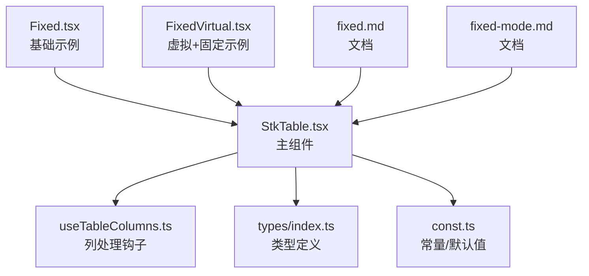
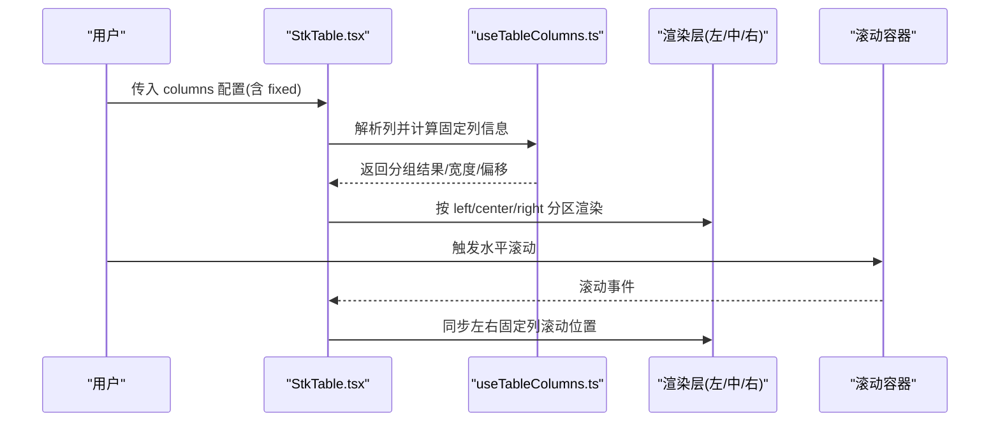
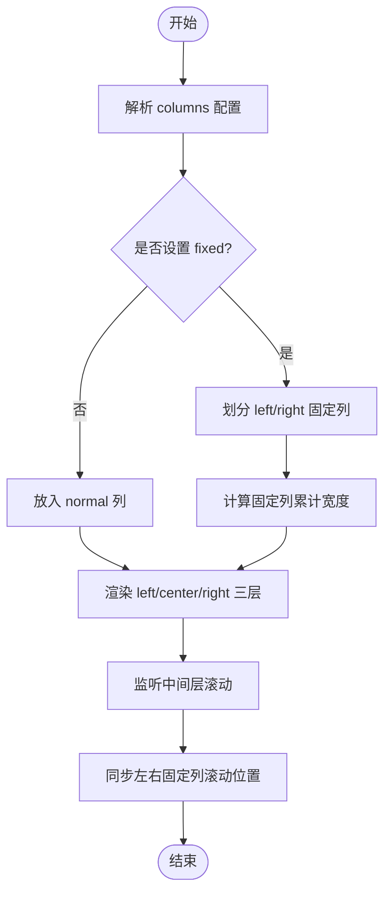
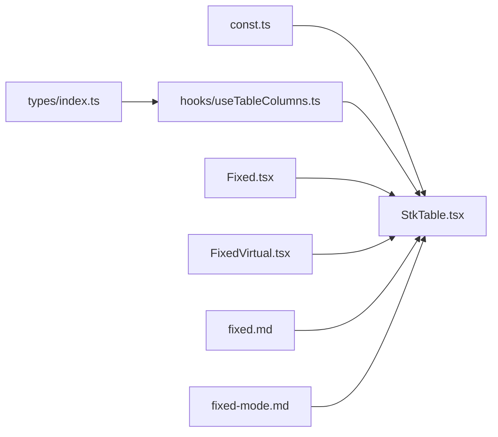

# 固定列配置

<cite>
**本文引用的文件**   
- [src/StkTable/StkTable.tsx](file://src/StkTable/StkTable.tsx)
- [src/StkTable/types/index.ts](file://src/StkTable/types/index.ts)
- [src/StkTable/hooks/useTableColumns.ts](file://src/StkTable/hooks/useTableColumns.ts)
- [src/StkTable/const.ts](file://src/StkTable/const.ts)
- [docs-demo/basic/fixed/Fixed.tsx](file://docs-demo/basic/fixed/Fixed.tsx)
- [docs-demo/basic/fixed/FixedVirtual.tsx](file://docs-demo/basic/fixed/FixedVirtual.tsx)
- [docs-src/main/table/basic/fixed.md](file://docs-src/main/table/basic/fixed.md)
- [docs-src/main/table/basic/fixed-mode.md](file://docs-src/main/table/basic/fixed-mode.md)
</cite>

## 目录
1. [简介](#简介)
2. [项目结构](#项目结构)
3. [核心组件](#核心组件)
4. [架构总览](#架构总览)
5. [详细组件分析](#详细组件分析)
6. [依赖分析](#依赖分析)
7. [性能考虑](#性能考虑)
8. [故障排查指南](#故障排查指南)
9. [结论](#结论)
10. [附录](#附录)

## 简介
本章节聚焦 StkTable 的“固定列”能力，系统阐述以下要点：
- 固定列的实现原理与渲染机制
- 左侧固定（fixed='left'）与右侧固定（fixed='right'）的配置方式
- 固定列在水平滚动时的行为表现
- 与虚拟滚动的兼容性与注意事项
- 与排序、筛选、拖拽等功能的组合使用最佳实践
- 复杂布局下的固定列配置方案与示例路径

## 项目结构
围绕固定列功能，仓库中涉及的关键位置如下：
- 文档与演示
  - docs-src/main/table/basic/fixed.md：固定列使用说明
  - docs-src/main/table/basic/fixed-mode.md：固定模式说明
  - docs-demo/basic/fixed/Fixed.tsx：基础固定列示例
  - docs-demo/basic/fixed/FixedVirtual.tsx：固定列与虚拟滚动示例
- 源码实现
  - src/StkTable/StkTable.tsx：表格主组件，包含固定列布局与滚动同步逻辑
  - src/StkTable/types/index.ts：类型定义，含 fixed 字段及固定相关类型
  - src/StkTable/hooks/useTableColumns.ts：列处理钩子，负责列分组、固定列计算与索引映射
  - src/StkTable/const.ts：常量与默认值，可能包含固定列相关的样式或尺寸常量

图表来源
- [src/StkTable/StkTable.tsx](file://src/StkTable/StkTable.tsx)
- [src/StkTable/hooks/useTableColumns.ts](file://src/StkTable/hooks/useTableColumns.ts)
- [src/StkTable/types/index.ts](file://src/StkTable/types/index.ts)
- [src/StkTable/const.ts](file://src/StkTable/const.ts)
- [docs-demo/basic/fixed/Fixed.tsx](file://docs-demo/basic/fixed/Fixed.tsx)
- [docs-demo/basic/fixed/FixedVirtual.tsx](file://docs-demo/basic/fixed/FixedVirtual.tsx)
- [docs-src/main/table/basic/fixed.md](file://docs-src/main/table/basic/fixed.md)
- [docs-src/main/table/basic/fixed-mode.md](file://docs-src/main/table/basic/fixed-mode.md)

章节来源
- [docs-src/main/table/basic/fixed.md](file://docs-src/main/table/basic/fixed.md)
- [docs-src/main/table/basic/fixed-mode.md](file://docs-src/main/table/basic/fixed-mode.md)
- [docs-demo/basic/fixed/Fixed.tsx](file://docs-demo/basic/fixed/Fixed.tsx)
- [docs-demo/basic/fixed/FixedVirtual.tsx](file://docs-demo/basic/fixed/FixedVirtual.tsx)
- [src/StkTable/StkTable.tsx](file://src/StkTable/StkTable.tsx)
- [src/StkTable/hooks/useTableColumns.ts](file://src/StkTable/hooks/useTableColumns.ts)
- [src/StkTable/types/index.ts](file://src/StkTable/types/index.ts)
- [src/StkTable/const.ts](file://src/StkTable/const.ts)

## 核心组件
- StkTable 主组件
  - 负责整体布局、滚动容器、固定列层叠与滚动同步
  - 将列数据交由 useTableColumns 进行分组与固定列计算
  - 根据 fixed 属性将列划分为 left/right/normal 三类区域并分别渲染
- useTableColumns 钩子
  - 输入：原始 columns 配置
  - 输出：分组后的列集合、固定列宽度、偏移量、索引映射等
  - 关键职责：识别 fixed='left' 与 fixed='right' 的列，计算其累计宽度与 z-index 层级
- types/index.ts
  - 定义列项中的 fixed 字段取值（如 'left' | 'right'），以及固定列相关的类型约束
- const.ts
  - 提供固定列相关的默认值或样式常量（如阴影、边框、z-index 层级等）

章节来源
- [src/StkTable/StkTable.tsx](file://src/StkTable/StkTable.tsx)
- [src/StkTable/hooks/useTableColumns.ts](file://src/StkTable/hooks/useTableColumns.ts)
- [src/StkTable/types/index.ts](file://src/StkTable/types/index.ts)
- [src/StkTable/const.ts](file://src/StkTable/const.ts)

## 架构总览
固定列的整体流程可概括为：列配置解析 → 固定列分组与尺寸计算 → 分层渲染（左/中/右）→ 滚动事件监听与同步。

图表来源
- [src/StkTable/StkTable.tsx](file://src/StkTable/StkTable.tsx)
- [src/StkTable/hooks/useTableColumns.ts](file://src/StkTable/hooks/useTableColumns.ts)

## 详细组件分析

### 固定列配置与渲染流程
- 配置入口
  - 在列项中使用 fixed 属性指定固定方向：'left' 表示左侧固定，'right' 表示右侧固定
  - 多列可同时设置 fixed，分别归入左侧或右侧固定区
- 解析与分组
  - useTableColumns 遍历 columns，依据 fixed 值将列分为 left、right、normal 三组
  - 计算每组列的累计宽度，用于定位与滚动偏移
- 渲染策略
  - 采用三层布局：左侧固定层、中间滚动层、右侧固定层
  - 通过 z-index 控制层级关系，确保固定列始终覆盖于中间内容之上
- 滚动同步
  - 监听中间层的水平滚动事件，将滚动位移同步到左右固定层，保持视觉一致

图表来源
- [src/StkTable/StkTable.tsx](file://src/StkTable/StkTable.tsx)
- [src/StkTable/hooks/useTableColumns.ts](file://src/StkTable/hooks/useTableColumns.ts)

章节来源
- [src/StkTable/StkTable.tsx](file://src/StkTable/StkTable.tsx)
- [src/StkTable/hooks/useTableColumns.ts](file://src/StkTable/hooks/useTableColumns.ts)

### 固定列与虚拟滚动的兼容性
- 兼容性原则
  - 固定列不参与虚拟列表的可视范围裁剪，需独立渲染并保持完整高度
  - 中间滚动层启用虚拟滚动时，固定列应跟随中间层滚动位置同步
- 典型场景
  - 仅开启纵向虚拟滚动：固定列随行高变化自动对齐
  - 横向虚拟滚动：固定列不受横向虚拟影响，仍按实际宽度渲染
- 注意事项
  - 避免对固定列单元格启用昂贵的重排操作
  - 合理设置固定列最小宽度，防止内容溢出导致错位

章节来源
- [docs-demo/basic/fixed/FixedVirtual.tsx](file://docs-demo/basic/fixed/FixedVirtual.tsx)
- [src/StkTable/StkTable.tsx](file://src/StkTable/StkTable.tsx)

### 与排序、筛选、拖拽的组合使用
- 排序
  - 固定列支持排序图标与状态显示；注意排序后列宽变化时需重新计算固定列宽度
- 筛选
  - 固定列内的筛选控件需与中间层筛选联动，保证筛选条件一致性
- 拖拽
  - 列头拖拽调整顺序时，固定列应保持固定方向不变；若跨区拖拽需限制规则
  - 行拖拽时，固定列单元格需正确响应鼠标事件，避免穿透

章节来源
- [docs-src/main/table/basic/fixed.md](file://docs-src/main/table/basic/fixed.md)
- [src/StkTable/StkTable.tsx](file://src/StkTable/StkTable.tsx)

### 复杂布局下的固定列配置方案
- 多层表头 + 固定列
  - 顶层表头与叶子节点均可设置 fixed，需保证父子列宽度对齐
- 合并单元格 + 固定列
  - 合并区域的固定列需参与合并计算，避免错位
- 树形表格 + 固定列
  - 展开/折叠时，固定列需与缩进保持一致的对齐与层级

章节来源
- [docs-src/main/table/basic/fixed.md](file://docs-src/main/table/basic/fixed.md)
- [docs-src/main/table/basic/fixed-mode.md](file://docs-src/main/table/basic/fixed-mode.md)

## 依赖分析
固定列相关模块之间的依赖关系如下：

图表来源
- [src/StkTable/types/index.ts](file://src/StkTable/types/index.ts)
- [src/StkTable/hooks/useTableColumns.ts](file://src/StkTable/hooks/useTableColumns.ts)
- [src/StkTable/const.ts](file://src/StkTable/const.ts)
- [src/StkTable/StkTable.tsx](file://src/StkTable/StkTable.tsx)
- [docs-demo/basic/fixed/Fixed.tsx](file://docs-demo/basic/fixed/Fixed.tsx)
- [docs-demo/basic/fixed/FixedVirtual.tsx](file://docs-demo/basic/fixed/FixedVirtual.tsx)
- [docs-src/main/table/basic/fixed.md](file://docs-src/main/table/basic/fixed.md)
- [docs-src/main/table/basic/fixed-mode.md](file://docs-src/main/table/basic/fixed-mode.md)

章节来源
- [src/StkTable/types/index.ts](file://src/StkTable/types/index.ts)
- [src/StkTable/hooks/useTableColumns.ts](file://src/StkTable/hooks/useTableColumns.ts)
- [src/StkTable/const.ts](file://src/StkTable/const.ts)
- [src/StkTable/StkTable.tsx](file://src/StkTable/StkTable.tsx)

## 性能考虑
- 减少不必要的重绘
  - 固定列单元格应避免频繁创建/销毁对象，尽量复用 DOM 节点
- 控制列宽计算开销
  - 仅在列配置变更或列宽变化时重新计算固定列宽度
- 虚拟滚动优化
  - 固定列不参与虚拟裁剪，但需尽量减少其内部复杂渲染
- 事件节流
  - 滚动事件建议做节流或 requestAnimationFrame 批处理，降低主线程压力

[本节为通用性能建议，不直接分析具体文件]

## 故障排查指南
- 固定列错位
  - 检查列宽是否动态变化且未触发重新计算
  - 确认多层表头下父子列宽度对齐是否正确
- 滚动不同步
  - 验证中间层滚动事件是否被正确捕获与转发
  - 检查固定层 z-index 层级是否被外部样式覆盖
- 与虚拟滚动冲突
  - 确认固定列未启用虚拟裁剪
  - 核对行高变化时固定列是否同步更新
- 交互异常（排序/筛选/拖拽）
  - 检查事件冒泡与穿透问题
  - 确认固定列内控件的事件绑定未被外层遮挡

章节来源
- [src/StkTable/StkTable.tsx](file://src/StkTable/StkTable.tsx)
- [docs-src/main/table/basic/fixed.md](file://docs-src/main/table/basic/fixed.md)

## 结论
固定列通过“分层渲染 + 滚动同步”的方式，有效解决了大数据表格中关键列的可见性问题。结合 useTableColumns 的列分组与宽度计算，StkTable 实现了灵活的 left/right 固定配置，并与虚拟滚动、排序、筛选、拖拽等功能良好兼容。在实际项目中，建议遵循上述最佳实践与性能优化策略，以获得稳定高效的表格体验。

[本节为总结性内容，不直接分析具体文件]

## 附录
- 示例路径
  - 基础固定列示例：[docs-demo/basic/fixed/Fixed.tsx](file://docs-demo/basic/fixed/Fixed.tsx)
  - 固定列与虚拟滚动示例：[docs-demo/basic/fixed/FixedVirtual.tsx](file://docs-demo/basic/fixed/FixedVirtual.tsx)
- 文档参考
  - 固定列使用说明：[docs-src/main/table/basic/fixed.md](file://docs-src/main/table/basic/fixed.md)
  - 固定模式说明：[docs-src/main/table/basic/fixed-mode.md](file://docs-src/main/table/basic/fixed-mode.md)