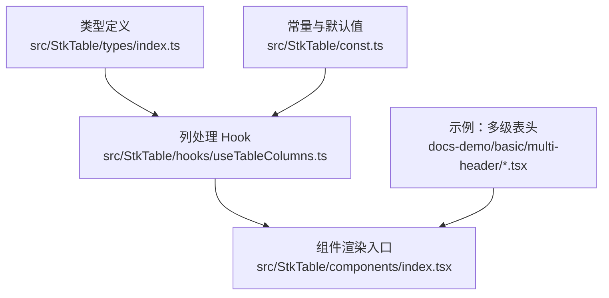
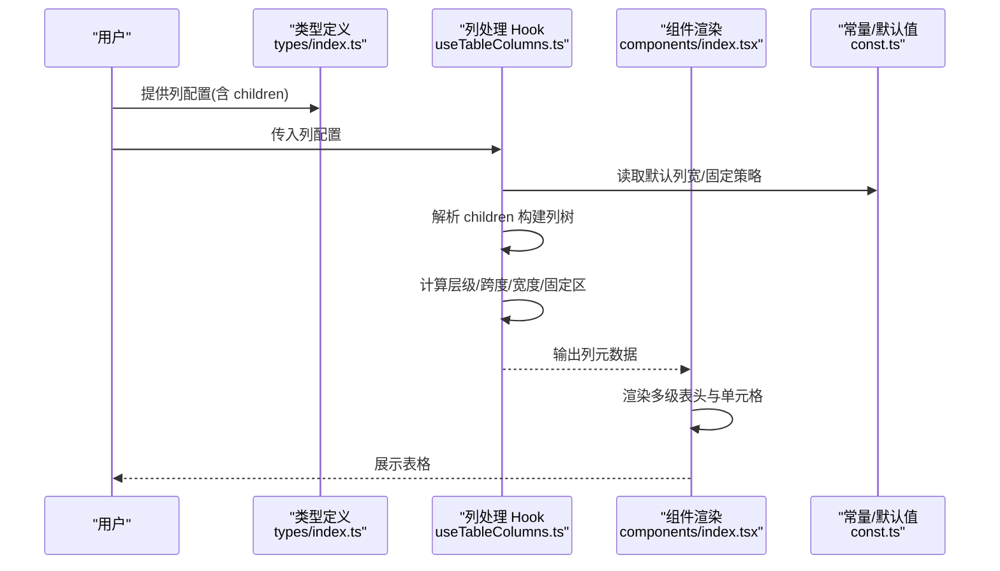
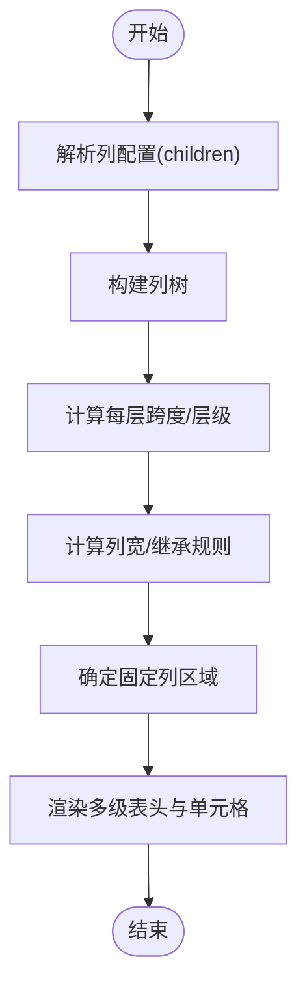
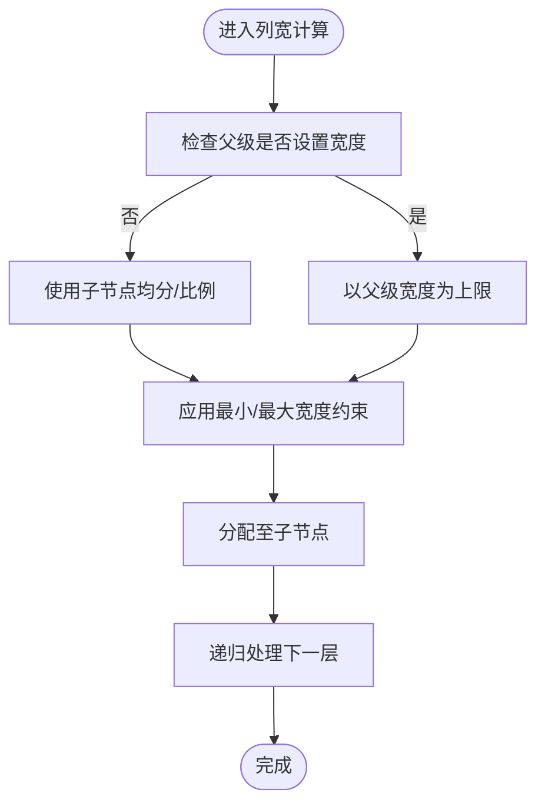
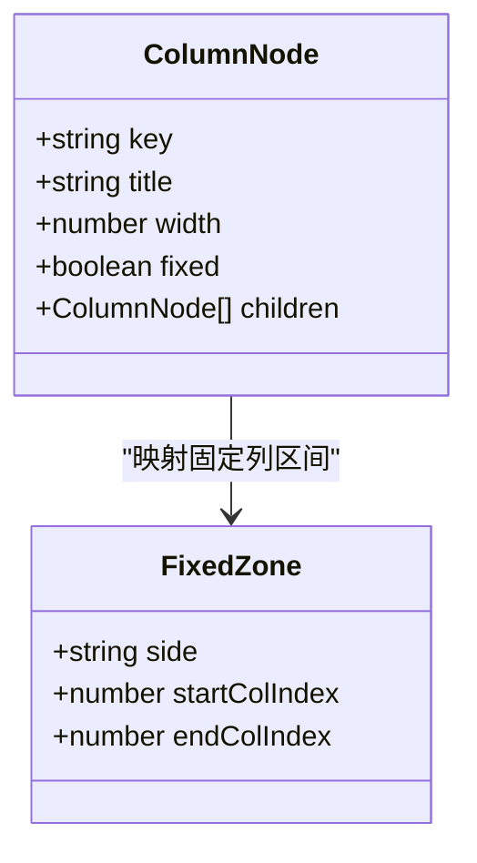
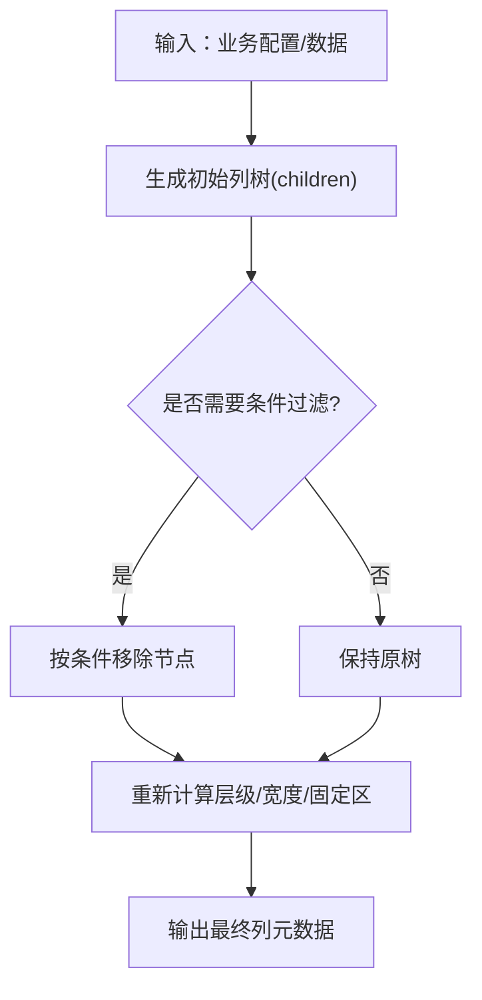
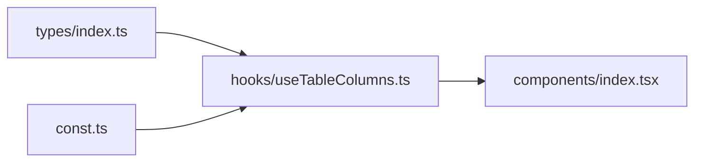

# 嵌套列配置

<cite>
**本文引用的文件**
- [src/StkTable/types/index.ts](file://src/StkTable/types/index.ts)
- [src/StkTable/hooks/useTableColumns.ts](file://src/StkTable/hooks/useTableColumns.ts)
- [src/StkTable/components/index.tsx](file://src/StkTable/components/index.tsx)
- [src/StkTable/const.ts](file://src/StkTable/const.ts)
- [docs-demo/basic/multi-header/MultiHeader.tsx](file://docs-demo/basic/multi-header/MultiHeader.tsx)
- [docs-demo/basic/multi-header/MultiHeaderFixed.tsx](file://docs-demo/basic/multi-header/MultiHeaderFixed.tsx)
- [docs-demo/basic/multi-header/MultiHeaderAnyFixed.tsx](file://docs-demo/basic/multi-header/MultiHeaderAnyFixed.tsx)
- [docs-demo/basic/multi-header/MultiHeaderLeavesFixed.tsx](file://docs-demo/basic/multi-header/MultiHeaderLeavesFixed.tsx)
- [docs-demo/basic/multi-header/MultiHeaderVirtualX.tsx](file://docs-demo/basic/multi-header/MultiHeaderVirtualX.tsx)
</cite>

## 目录
1. [简介](#简介)
2. [项目结构](#项目结构)
3. [核心组件](#核心组件)
4. [架构总览](#架构总览)
5. [详细组件分析](#详细组件分析)
6. [依赖关系分析](#依赖关系分析)
7. [性能考量](#性能考量)
8. [故障排查指南](#故障排查指南)
9. [结论](#结论)
10. [附录](#附录)

## 简介
本章节聚焦 StkTable 的“嵌套列”能力，围绕多级表头、children 属性、层级结构定义、列宽继承机制、固定列在嵌套结构中的处理方式展开，并提供复杂业务场景下的设计模式与实战案例（如财务报表、数据分析）。文档同时给出代码级架构图与流程图，帮助读者从原理到实践全面掌握。

## 项目结构
与嵌套列相关的实现主要分布在类型定义、列处理 Hook、组件渲染入口以及示例中：
- 类型定义：描述列树节点、children 结构与固定列等关键属性的类型约束
- 列处理 Hook：负责将用户传入的列配置转换为内部可渲染的扁平化或树形结构，并计算列宽、合并区间、固定区域等
- 组件渲染：基于处理后的列结构进行表头与单元格渲染
- 示例：覆盖基础多级表头、固定列组合、虚拟滚动等多维场景

图示来源
- [src/StkTable/types/index.ts](file://src/StkTable/types/index.ts)
- [src/StkTable/hooks/useTableColumns.ts](file://src/StkTable/hooks/useTableColumns.ts)
- [src/StkTable/components/index.tsx](file://src/StkTable/components/index.tsx)
- [src/StkTable/const.ts](file://src/StkTable/const.ts)
- [docs-demo/basic/multi-header/MultiHeader.tsx](file://docs-demo/basic/multi-header/MultiHeader.tsx)

章节来源
- [src/StkTable/types/index.ts](file://src/StkTable/types/index.ts)
- [src/StkTable/hooks/useTableColumns.ts](file://src/StkTable/hooks/useTableColumns.ts)
- [src/StkTable/components/index.tsx](file://src/StkTable/components/index.tsx)
- [src/StkTable/const.ts](file://src/StkTable/const.ts)
- [docs-demo/basic/multi-header/MultiHeader.tsx](file://docs-demo/basic/multi-header/MultiHeader.tsx)

## 核心组件
- 列类型与 children 结构：通过类型定义明确列节点的层级关系，支持任意深度的 children 嵌套，用于构建多级表头
- 列处理 Hook：解析 children，生成可用于渲染的列元数据，包括层级、跨度、宽度、固定位置等
- 组件渲染：根据列元数据渲染多级表头行、合并单元格、固定列区域等

章节来源
- [src/StkTable/types/index.ts](file://src/StkTable/types/index.ts)
- [src/StkTable/hooks/useTableColumns.ts](file://src/StkTable/hooks/useTableColumns.ts)
- [src/StkTable/components/index.tsx](file://src/StkTable/components/index.tsx)

## 架构总览
下图展示了从列配置到最终渲染的关键路径，以及固定列与列宽计算的参与点。

图示来源
- [src/StkTable/types/index.ts](file://src/StkTable/types/index.ts)
- [src/StkTable/hooks/useTableColumns.ts](file://src/StkTable/hooks/useTableColumns.ts)
- [src/StkTable/components/index.tsx](file://src/StkTable/components/index.tsx)
- [src/StkTable/const.ts](file://src/StkTable/const.ts)

## 详细组件分析

### 多级表头与 children 属性
- 层级结构定义
  - 列节点支持 children 字段，形成树形结构；叶子节点为实际数据列，非叶子节点为分组标题
  - 建议为每个节点提供稳定 key，便于排序、筛选与状态管理
- 多级表头渲染
  - 组件根据列树的深度渲染多行表头，父节点跨越多列子节点
  - 合并逻辑由列处理阶段计算得到，渲染阶段直接消费

图示来源
- [src/StkTable/hooks/useTableColumns.ts](file://src/StkTable/hooks/useTableColumns.ts)
- [src/StkTable/components/index.tsx](file://src/StkTable/components/index.tsx)

章节来源
- [src/StkTable/types/index.ts](file://src/StkTable/types/index.ts)
- [src/StkTable/hooks/useTableColumns.ts](file://src/StkTable/hooks/useTableColumns.ts)
- [src/StkTable/components/index.tsx](file://src/StkTable/components/index.tsx)

### 列宽继承机制
- 继承原则
  - 父节点未显式设置宽度时，通常按子节点均分或按比例分配
  - 若父节点设置了宽度，则作为该分组的上限，子节点在其范围内继续分配
- 计算流程
  - 自顶向下遍历列树，累计父级剩余可用宽度
  - 对叶子节点应用最小/最大宽度约束，必要时触发回退策略（如压缩相邻列）

图示来源
- [src/StkTable/hooks/useTableColumns.ts](file://src/StkTable/hooks/useTableColumns.ts)

章节来源
- [src/StkTable/hooks/useTableColumns.ts](file://src/StkTable/hooks/useTableColumns.ts)

### 固定列在嵌套结构中的处理
- 固定策略
  - 可在父节点或叶子节点上声明固定方向（左/右），系统会将其映射到最终的固定区域
  - 当存在多级表头时，固定列需保证各层表头的对齐与合并正确性
- 交互影响
  - 固定列与横向虚拟滚动共存时，需确保固定区域不参与虚拟窗口计算
  - 列宽变化时，固定区域的边界需同步更新

图示来源
- [src/StkTable/types/index.ts](file://src/StkTable/types/index.ts)
- [src/StkTable/hooks/useTableColumns.ts](file://src/StkTable/hooks/useTableColumns.ts)

章节来源
- [src/StkTable/types/index.ts](file://src/StkTable/types/index.ts)
- [src/StkTable/hooks/useTableColumns.ts](file://src/StkTable/hooks/useTableColumns.ts)

### 动态列生成与条件显示
- 动态生成
  - 根据运行时数据或配置，动态构造 children 树，例如按维度聚合生成分组列
- 条件显示
  - 在列树构建阶段过滤不需要的节点，或在渲染阶段通过插槽控制可见性
- 推荐模式
  - 将“列配置工厂函数”与“列树转换 Hook”解耦，便于单元测试与复用

图示来源
- [src/StkTable/hooks/useTableColumns.ts](file://src/StkTable/hooks/useTableColumns.ts)

章节来源
- [src/StkTable/hooks/useTableColumns.ts](file://src/StkTable/hooks/useTableColumns.ts)

### 实战案例：财务报表与数据分析
- 财务报表
  - 典型结构：一级分组（资产/负债/权益）、二级分组（流动资产/非流动资产…）、三级明细科目
  - 固定列：左侧序号与科目名称固定，右侧金额列可横向滚动
  - 列宽：金额列采用固定宽度，科目列自适应
- 数据分析
  - 典型结构：时间轴分组（年/季/月）、指标分组（收入/成本/利润）、具体指标列
  - 动态列：根据选择的指标集合动态生成 children
  - 固定列：维度列固定，指标列可滚动

章节来源
- [docs-demo/basic/multi-header/MultiHeader.tsx](file://docs-demo/basic/multi-header/MultiHeader.tsx)
- [docs-demo/basic/multi-header/MultiHeaderFixed.tsx](file://docs-demo/basic/multi-header/MultiHeaderFixed.tsx)
- [docs-demo/basic/multi-header/MultiHeaderAnyFixed.tsx](file://docs-demo/basic/multi-header/MultiHeaderAnyFixed.tsx)
- [docs-demo/basic/multi-header/MultiHeaderLeavesFixed.tsx](file://docs-demo/basic/multi-header/MultiHeaderLeavesFixed.tsx)
- [docs-demo/basic/multi-header/MultiHeaderVirtualX.tsx](file://docs-demo/basic/multi-header/MultiHeaderVirtualX.tsx)

## 依赖关系分析
- 类型定义被 Hook 与组件共同消费，保证列树结构一致
- Hook 依赖常量与默认值，决定列宽与固定策略的初始行为
- 组件仅消费 Hook 输出的列元数据，降低耦合度

图示来源
- [src/StkTable/types/index.ts](file://src/StkTable/types/index.ts)
- [src/StkTable/hooks/useTableColumns.ts](file://src/StkTable/hooks/useTableColumns.ts)
- [src/StkTable/components/index.tsx](file://src/StkTable/components/index.tsx)
- [src/StkTable/const.ts](file://src/StkTable/const.ts)

章节来源
- [src/StkTable/types/index.ts](file://src/StkTable/types/index.ts)
- [src/StkTable/hooks/useTableColumns.ts](file://src/StkTable/hooks/useTableColumns.ts)
- [src/StkTable/components/index.tsx](file://src/StkTable/components/index.tsx)
- [src/StkTable/const.ts](file://src/StkTable/const.ts)

## 性能考量
- 列树规模控制：避免过深的 children 层级导致计算与渲染开销增大
- 列宽计算缓存：对静态列配置结果做缓存，减少重复计算
- 固定列与虚拟滚动：合理划分固定区域，避免全量重排
- 动态列生成：仅在必要变更时重建列树，结合 key 稳定化提升 Diff 效率

[本节为通用指导，无需列出具体文件来源]

## 故障排查指南
- 多级表头错位
  - 检查 children 的 key 是否唯一且稳定
  - 确认父节点 span 计算是否正确
- 固定列重叠或空白
  - 核对固定方向与列顺序，确保左右固定区间无冲突
  - 验证列宽变更后固定区域是否同步更新
- 列宽异常
  - 检查是否存在未设置的宽度导致均分失败
  - 确认最小/最大宽度约束是否合理

章节来源
- [src/StkTable/hooks/useTableColumns.ts](file://src/StkTable/hooks/useTableColumns.ts)
- [src/StkTable/components/index.tsx](file://src/StkTable/components/index.tsx)

## 结论
StkTable 的嵌套列通过清晰的类型定义与列处理 Hook，实现了灵活的多级表头、稳定的列宽继承与可靠的固定列方案。配合示例与最佳实践，可在财务报表、数据分析等复杂场景中高效落地。

[本节为总结性内容，无需列出具体文件来源]

## 附录
- 相关示例文件
  - 基础多级表头：[MultiHeader.tsx](file://docs-demo/basic/multi-header/MultiHeader.tsx)
  - 多级表头+固定列：[MultiHeaderFixed.tsx](file://docs-demo/basic/multi-header/MultiHeaderFixed.tsx)
  - 任意位置固定列：[MultiHeaderAnyFixed.tsx](file://docs-demo/basic/multi-header/MultiHeaderAnyFixed.tsx)
  - 仅叶子节点固定：[MultiHeaderLeavesFixed.tsx](file://docs-demo/basic/multi-header/MultiHeaderLeavesFixed.tsx)
  - 多级表头+横向虚拟滚动：[MultiHeaderVirtualX.tsx](file://docs-demo/basic/multi-header/MultiHeaderVirtualX.tsx)

章节来源
- [docs-demo/basic/multi-header/MultiHeader.tsx](file://docs-demo/basic/multi-header/MultiHeader.tsx)
- [docs-demo/basic/multi-header/MultiHeaderFixed.tsx](file://docs-demo/basic/multi-header/MultiHeaderFixed.tsx)
- [docs-demo/basic/multi-header/MultiHeaderAnyFixed.tsx](file://docs-demo/basic/multi-header/MultiHeaderAnyFixed.tsx)
- [docs-demo/basic/multi-header/MultiHeaderLeavesFixed.tsx](file://docs-demo/basic/multi-header/MultiHeaderLeavesFixed.tsx)
- [docs-demo/basic/multi-header/MultiHeaderVirtualX.tsx](file://docs-demo/basic/multi-header/MultiHeaderVirtualX.tsx)