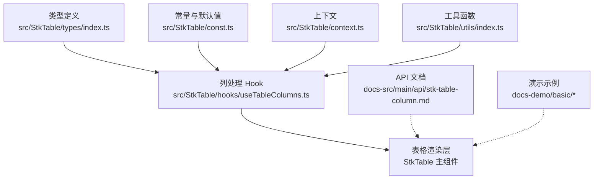
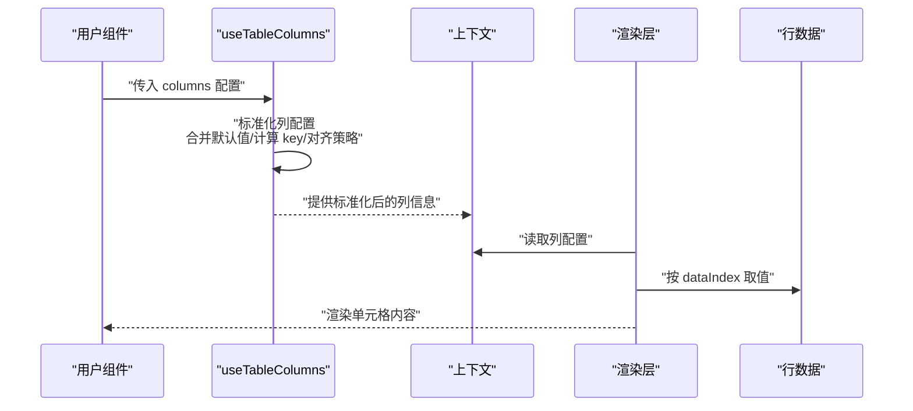
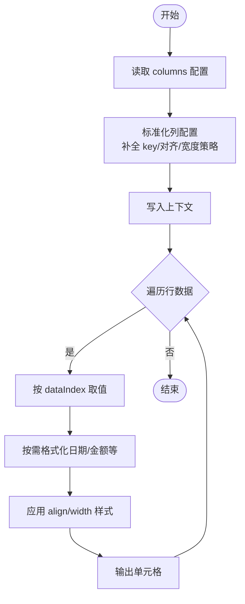
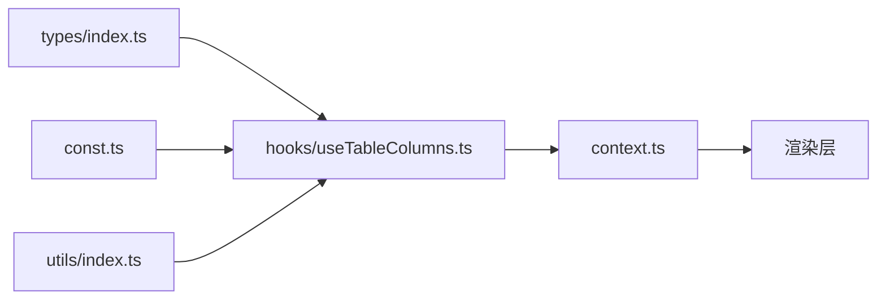

# 基础列配置

<cite>
**本文引用的文件**
- [src/StkTable/types/index.ts](file://src/StkTable/types/index.ts)
- [src/StkTable/hooks/useTableColumns.ts](file://src/StkTable/hooks/useTableColumns.ts)
- [src/StkTable/const.ts](file://src/StkTable/const.ts)
- [src/StkTable/context.ts](file://src/StkTable/context.ts)
- [src/StkTable/utils/index.ts](file://src/StkTable/utils/index.ts)
- [docs-src/main/api/stk-table-column.md](file://docs-src/main/api/stk-table-column.md)
- [docs-src/main/table/basic/column-width.md](file://docs-src/main/table/basic/column-width.md)
- [docs-src/main/table/basic/align.md](file://docs-src/main/table/basic/align.md)
- [docs-src/main/table/basic/key.md](file://docs-src/main/table/basic/key.md)
- [docs-demo/basic/column-width/ColumnWidth.tsx](file://docs-demo/basic/column-width/ColumnWidth.tsx)
- [docs-demo/basic/align/Align.tsx](file://docs-demo/basic/align/Align.tsx)
</cite>

## 目录
1. [简介](#简介)
2. [项目结构](#项目结构)
3. [核心组件](#核心组件)
4. [架构总览](#架构总览)
5. [详细组件分析](#详细组件分析)
6. [依赖分析](#依赖分析)
7. [性能考虑](#性能考虑)
8. [故障排查指南](#故障排查指南)
9. [结论](#结论)
10. [附录](#附录)

## 简介
本章节聚焦 StkTable 的“基础列配置”，围绕列的基本属性定义与使用展开，包括 title、dataIndex、width、align、key 等核心属性的含义、默认值、约束与最佳实践。同时提供 TypeScript 类型说明、渲染机制与数据绑定原理的解释，并通过示例路径展示文本列、数字列、日期列的配置方式。

## 项目结构
StkTable 的基础列配置相关代码主要分布在以下位置：
- 类型定义：src/StkTable/types/index.ts
- 列处理 Hook：src/StkTable/hooks/useTableColumns.ts
- 常量与默认值：src/StkTable/const.ts
- 上下文（用于在组件树中传递列配置）：src/StkTable/context.ts
- 工具函数（如 key 生成、对齐策略等）：src/StkTable/utils/index.ts
- 文档与演示：docs-src/main/api/stk-table-column.md、docs-demo/basic/*

图表来源
- [src/StkTable/types/index.ts](file://src/StkTable/types/index.ts)
- [src/StkTable/hooks/useTableColumns.ts](file://src/StkTable/hooks/useTableColumns.ts)
- [src/StkTable/const.ts](file://src/StkTable/const.ts)
- [src/StkTable/context.ts](file://src/StkTable/context.ts)
- [src/StkTable/utils/index.ts](file://src/StkTable/utils/index.ts)
- [docs-src/main/api/stk-table-column.md](file://docs-src/main/api/stk-table-column.md)
- [docs-demo/basic/column-width/ColumnWidth.tsx](file://docs-demo/basic/column-width/ColumnWidth.tsx)
- [docs-demo/basic/align/Align.tsx](file://docs-demo/basic/align/Align.tsx)

章节来源
- [src/StkTable/types/index.ts](file://src/StkTable/types/index.ts)
- [src/StkTable/hooks/useTableColumns.ts](file://src/StkTable/hooks/useTableColumns.ts)
- [src/StkTable/const.ts](file://src/StkTable/const.ts)
- [src/StkTable/context.ts](file://src/StkTable/context.ts)
- [src/StkTable/utils/index.ts](file://src/StkTable/utils/index.ts)
- [docs-src/main/api/stk-table-column.md](file://docs-src/main/api/stk-table-column.md)
- [docs-demo/basic/column-width/ColumnWidth.tsx](file://docs-demo/basic/column-width/ColumnWidth.tsx)
- [docs-demo/basic/align/Align.tsx](file://docs-demo/basic/align/Align.tsx)

## 核心组件
本节从“列配置”的角度梳理关键概念与职责：
- 列配置对象：描述一列的标题、数据来源、宽度、对齐、唯一标识等
- 列处理 Hook：负责将用户传入的列配置标准化、合并默认值、计算衍生字段（如 key、对齐策略等）
- 常量与默认值：提供列级别的默认行为（例如默认对齐、默认宽度策略等）
- 上下文：在表格内部共享列配置与状态，供单元格渲染与交互逻辑读取
- 工具函数：辅助生成稳定的 key、解析 width 单位、对齐映射等

章节来源
- [src/StkTable/hooks/useTableColumns.ts](file://src/StkTable/hooks/useTableColumns.ts)
- [src/StkTable/const.ts](file://src/StkTable/const.ts)
- [src/StkTable/context.ts](file://src/StkTable/context.ts)
- [src/StkTable/utils/index.ts](file://src/StkTable/utils/index.ts)

## 架构总览
下图展示了“列配置”从声明到渲染的关键流程：用户在父组件声明 columns，Hook 对列进行标准化与增强，随后通过上下文传递给渲染层，最终根据 dataIndex 从行数据中提取值并渲染。

图表来源
- [src/StkTable/hooks/useTableColumns.ts](file://src/StkTable/hooks/useTableColumns.ts)
- [src/StkTable/context.ts](file://src/StkTable/context.ts)
- [src/StkTable/utils/index.ts](file://src/StkTable/utils/index.ts)

## 详细组件分析

### 列配置类型与属性说明
以下为列配置的核心属性说明（基于类型定义与文档整理）。每个属性包含数据类型、默认值与使用约束。

- title
  - 类型：字符串或 ReactNode
  - 默认值：无（必须显式设置）
  - 约束：作为列头显示文案；支持国际化插槽时可为函数或节点
  - 参考：[docs-src/main/api/stk-table-column.md](file://docs-src/main/api/stk-table-column.md)

- dataIndex
  - 类型：string | string[]
  - 默认值：无（必须显式设置）
  - 约束：指向行数据的键路径；支持嵌套路径数组；需保证对应数据存在
  - 参考：[src/StkTable/types/index.ts](file://src/StkTable/types/index.ts)

- width
  - 类型：number | string
  - 默认值：未固定，受全局列宽策略影响
  - 约束：支持 px、% 等单位；当为 number 时视为 px；可配合自适应策略
  - 参考：[docs-src/main/table/basic/column-width.md](file://docs-src/main/table/basic/column-width.md)

- align
  - 类型："left" | "center" | "right"
  - 默认值：由列类型或全局策略决定（通常文本左对齐、数字右对齐）
  - 约束：仅上述三种值有效；可通过工具函数映射为 CSS 样式
  - 参考：[docs-src/main/table/basic/align.md](file://docs-src/main/table/basic/align.md)

- key
  - 类型：string | number
  - 默认值：若未提供，系统会基于 dataIndex 或其他稳定标识生成
  - 约束：建议显式设置以保证列表更新时的稳定性；避免重复
  - 参考：[docs-src/main/table/basic/key.md](file://docs-src/main/table/basic/key.md)

- 其他常见扩展属性（可选）
  - fixed：是否固定列（left/right），类型为 boolean | "left" | "right"
  - sortable：是否启用排序，类型为 boolean
  - resizable：是否允许调整列宽，类型为 boolean
  - render：自定义渲染函数，接收单元格参数返回 ReactNode
  - 参考：[src/StkTable/types/index.ts](file://src/StkTable/types/index.ts)

章节来源
- [src/StkTable/types/index.ts](file://src/StkTable/types/index.ts)
- [docs-src/main/api/stk-table-column.md](file://docs-src/main/api/stk-table-column.md)
- [docs-src/main/table/basic/column-width.md](file://docs-src/main/table/basic/column-width.md)
- [docs-src/main/table/basic/align.md](file://docs-src/main/table/basic/align.md)
- [docs-src/main/table/basic/key.md](file://docs-src/main/table/basic/key.md)

### 列配置的数据流与渲染机制
- 列标准化
  - useTableColumns 负责将原始列配置转换为内部标准结构，补充缺失的 key、对齐策略、宽度策略等
- 上下文共享
  - 标准化后的列信息通过 context 注入，供渲染层与交互逻辑读取
- 数据绑定
  - 渲染层依据 dataIndex 从当前行数据中取值；对于复杂类型（如日期、金额）可在 render 中格式化
- 对齐与宽度
  - align 映射为 CSS 样式；width 解析单位后应用到列容器

图表来源
- [src/StkTable/hooks/useTableColumns.ts](file://src/StkTable/hooks/useTableColumns.ts)
- [src/StkTable/context.ts](file://src/StkTable/context.ts)
- [src/StkTable/utils/index.ts](file://src/StkTable/utils/index.ts)

### 实际示例（以路径引用代替代码片段）
- 文本列
  - 示例路径：[docs-demo/basic/align/Align.tsx](file://docs-demo/basic/align/Align.tsx)
  - 要点：设置 title、dataIndex、align="left"，必要时指定 width
- 数字列
  - 示例路径：[docs-demo/basic/column-width/ColumnWidth.tsx](file://docs-demo/basic/column-width/ColumnWidth.tsx)
  - 要点：设置 align="right"，width 使用 px 或 %；如需千分位或小数位，可在 render 中格式化
- 日期列
  - 示例路径：同上（在 render 中调用日期格式化函数）
  - 要点：dataIndex 指向日期字段；render 中统一格式化为期望字符串

章节来源
- [docs-demo/basic/align/Align.tsx](file://docs-demo/basic/align/Align.tsx)
- [docs-demo/basic/column-width/ColumnWidth.tsx](file://docs-demo/basic/column-width/ColumnWidth.tsx)

## 依赖分析
- 类型定义与 Hook 的耦合
  - types/index.ts 提供列配置的 TS 类型，useTableColumns.ts 消费这些类型进行标准化
- 常量与默认值
  - const.ts 提供列级别默认值（如默认对齐、默认宽度策略等），被 Hook 和渲染层共同使用
- 工具函数
  - utils/index.ts 提供 key 生成、单位解析、对齐映射等能力，降低重复逻辑
- 上下文
  - context.ts 承载列配置与状态，贯穿渲染链路

图表来源
- [src/StkTable/types/index.ts](file://src/StkTable/types/index.ts)
- [src/StkTable/hooks/useTableColumns.ts](file://src/StkTable/hooks/useTableColumns.ts)
- [src/StkTable/const.ts](file://src/StkTable/const.ts)
- [src/StkTable/context.ts](file://src/StkTable/context.ts)
- [src/StkTable/utils/index.ts](file://src/StkTable/utils/index.ts)

章节来源
- [src/StkTable/types/index.ts](file://src/StkTable/types/index.ts)
- [src/StkTable/hooks/useTableColumns.ts](file://src/StkTable/hooks/useTableColumns.ts)
- [src/StkTable/const.ts](file://src/StkTable/const.ts)
- [src/StkTable/context.ts](file://src/StkTable/context.ts)
- [src/StkTable/utils/index.ts](file://src/StkTable/utils/index.ts)

## 性能考虑
- 列配置稳定性
  - 建议在父组件外缓存 columns 或使用 useMemo，避免频繁重建导致重渲染
- 列宽计算
  - 合理设置 width，避免过多动态计算；优先使用固定宽度或百分比
- 对齐与样式
  - align 尽量保持静态，减少运行时样式切换
- 自定义渲染
  - render 函数应轻量，避免昂贵计算；复杂逻辑下沉至工具函数或预计算

## 故障排查指南
- dataIndex 为空或路径错误
  - 现象：单元格空白或报错
  - 排查：确认 dataIndex 与行数据结构一致；嵌套路径使用数组形式
- key 不稳定或重复
  - 现象：列表更新错乱或闪烁
  - 排查：为每列设置稳定且唯一的 key；避免使用索引作为 key
- width 不生效
  - 现象：列宽异常或被覆盖
  - 排查：检查单位是否正确；确认未被全局样式覆盖；查看列宽策略
- align 无效
  - 现象：对齐未按预期
  - 排查：确认值为 left/center/right；检查是否有外层样式覆盖

章节来源
- [src/StkTable/hooks/useTableColumns.ts](file://src/StkTable/hooks/useTableColumns.ts)
- [src/StkTable/utils/index.ts](file://src/StkTable/utils/index.ts)
- [docs-src/main/table/basic/key.md](file://docs-src/main/table/basic/key.md)
- [docs-src/main/table/basic/column-width.md](file://docs-src/main/table/basic/column-width.md)
- [docs-src/main/table/basic/align.md](file://docs-src/main/table/basic/align.md)

## 结论
StkTable 的基础列配置通过清晰的类型定义与标准化的处理流程，提供了稳定、可扩展的列声明方式。合理使用 title、dataIndex、width、align、key 等核心属性，并结合 render 实现复杂展示，即可满足大多数业务场景。遵循本文的最佳实践与注意事项，可获得更优的可维护性与性能表现。

## 附录
- API 文档入口
  - [stk-table-column.md](file://docs-src/main/api/stk-table-column.md)
- 基础用法示例
  - [column-width.md](file://docs-src/main/table/basic/column-width.md)
  - [align.md](file://docs-src/main/table/basic/align.md)
  - [key.md](file://docs-src/main/table/basic/key.md)
- 演示源码
  - [Align.tsx](file://docs-demo/basic/align/Align.tsx)
  - [ColumnWidth.tsx](file://docs-demo/basic/column-width/ColumnWidth.tsx)