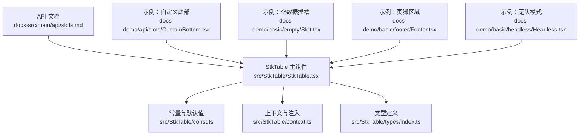
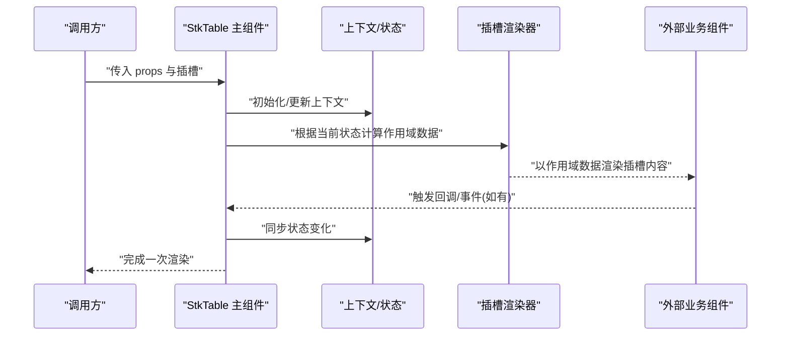
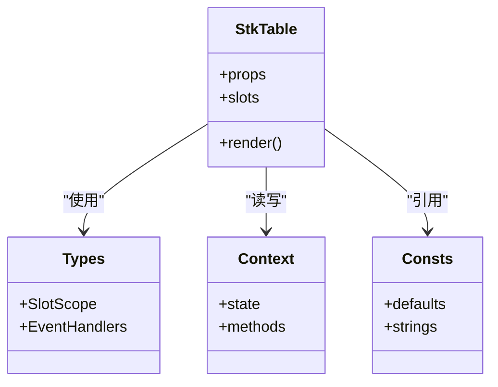

# 内置插槽

<cite>
**本文引用的文件**   
- [StkTable.tsx](file://src/StkTable/StkTable.tsx)
- [index.ts](file://src/StkTable/index.ts)
- [const.ts](file://src/StkTable/const.ts)
- [context.ts](file://src/StkTable/context.ts)
- [types/index.ts](file://src/StkTable/types/index.ts)
- [api/slots.md](file://docs-src/main/api/slots.md)
- [CustomBottom.tsx](file://docs-demo/api/slots/CustomBottom.tsx)
- [NoData.tsx](file://docs-demo/assets/svg-components/NoData.tsx)
- [EmptySlot.tsx](file://docs-demo/basic/empty/Slot.tsx)
- [Footer.tsx](file://docs-demo/basic/footer/Footer.tsx)
- [Headless.tsx](file://docs-demo/basic/headless/Headless.tsx)
</cite>

## 目录
1. [简介](#简介)
2. [项目结构](#项目结构)
3. [核心组件与插槽总览](#核心组件与插槽总览)
4. [架构概览](#架构概览)
5. [详细插槽说明](#详细插槽说明)
6. [依赖关系分析](#依赖关系分析)
7. [性能与最佳实践](#性能与最佳实践)
8. [故障排查指南](#故障排查指南)
9. [结论](#结论)
10. [附录：示例与参考路径](#附录示例与参考路径)

## 简介
本章节系统化梳理 StkTable 的内置插槽能力，覆盖头部、尾部、空数据等关键插槽的作用域数据、命名规范、参数传递与事件处理机制，并给出与组件其他功能（如分页、排序、筛选、展开行、虚拟滚动等）的集成方式与最佳实践。文档同时提供可复用的示例路径，便于快速上手与扩展。

## 项目结构
围绕插槽的实现与使用，主要涉及以下位置：
- 组件实现与类型定义：src/StkTable 下
- 文档 API 说明：docs-src/main/api/slots.md
- 演示用例：docs-demo 下的多个示例

图表来源
- [StkTable.tsx](file://src/StkTable/StkTable.tsx)
- [const.ts](file://src/StkTable/const.ts)
- [context.ts](file://src/StkTable/context.ts)
- [types/index.ts](file://src/StkTable/types/index.ts)
- [api/slots.md](file://docs-src/main/api/slots.md)
- [CustomBottom.tsx](file://docs-demo/api/slots/CustomBottom.tsx)
- [EmptySlot.tsx](file://docs-demo/basic/empty/Slot.tsx)
- [Footer.tsx](file://docs-demo/basic/footer/Footer.tsx)
- [Headless.tsx](file://docs-demo/basic/headless/Headless.tsx)

章节来源
- [StkTable.tsx](file://src/StkTable/StkTable.tsx)
- [index.ts](file://src/StkTable/index.ts)
- [const.ts](file://src/StkTable/const.ts)
- [context.ts](file://src/StkTable/context.ts)
- [types/index.ts](file://src/StkTable/types/index.ts)
- [api/slots.md](file://docs-src/main/api/slots.md)

## 核心组件与插槽总览
StkTable 通过统一的插槽机制暴露多个“钩子点”，允许在表格渲染的关键位置插入自定义内容。常见插槽类别包括：
- 头部相关：表头区域、列头操作区等
- 主体相关：单元格、行、选择区等
- 尾部相关：底部工具栏、分页、统计信息等
- 状态相关：空数据、加载中、错误提示等

为便于查阅，建议遵循如下命名约定：
- 以功能域前缀区分：例如 head-、body-、footer-、empty-、loading-、error- 等
- 语义清晰且稳定：避免频繁变更名称，确保向后兼容
- 与 props/events 保持一致风格：小驼峰或中划线按团队规范统一

章节来源
- [StkTable.tsx](file://src/StkTable/StkTable.tsx)
- [api/slots.md](file://docs-src/main/api/slots.md)

## 架构概览
下图展示了 StkTable 内部与插槽相关的核心交互：组件读取配置与上下文，计算作用域数据，并在相应渲染阶段将插槽内容挂载到目标位置。

图表来源
- [StkTable.tsx](file://src/StkTable/StkTable.tsx)
- [context.ts](file://src/StkTable/context.ts)

## 详细插槽说明

### 头部插槽（表头区域）
- 作用
  - 在表头区域插入全局控制项（如搜索框、批量操作按钮、导出入口等）。
- 作用域数据
  - 通常包含列元信息、排序状态、筛选状态、选中行集合等，具体字段以类型定义为准。
- 编写规范
  - 保持轻量与响应式，避免在头部执行重计算。
  - 如需修改表格状态，优先通过回调或事件机制。
- 事件处理
  - 通过回调函数与父级通信，避免直接操作内部状态。
- 集成要点
  - 与排序、筛选联动时，注意防抖与去重。
  - 与固定列、多表头共存时，需考虑布局对齐。
- 示例参考
  - 参见演示中的“自定义底部”示例，其思路可迁移至头部场景。

章节来源
- [StkTable.tsx](file://src/StkTable/StkTable.tsx)
- [types/index.ts](file://src/StkTable/types/index.ts)
- [CustomBottom.tsx](file://docs-demo/api/slots/CustomBottom.tsx)

### 主体插槽（行/单元格级别）
- 作用
  - 在行或单元格维度进行高度定制，如嵌入编辑控件、富文本、操作菜单等。
- 作用域数据
  - 行数据、列配置、索引、选中状态、展开状态等。
- 编写规范
  - 保证单元格尺寸稳定，避免抖动；复杂内容建议使用懒加载或虚拟化配合。
- 事件处理
  - 通过回调上报变更，必要时结合撤销/重做策略。
- 集成要点
  - 与虚拟滚动、合并单元格、树形结构共存时，需关注 key 与稳定性。
- 示例参考
  - 可参考高级用法中的“自定义单元格”系列示例。

章节来源
- [StkTable.tsx](file://src/StkTable/StkTable.tsx)
- [types/index.ts](file://src/StkTable/types/index.ts)

### 尾部插槽（底部区域）
- 作用
  - 放置分页、统计、批量操作、导出等全局性控件。
- 作用域数据
  - 分页信息、选中行、排序/筛选结果、合计等。
- 编写规范
  - 与分页逻辑解耦，通过回调驱动数据刷新。
- 事件处理
  - 分页切换、批量操作后应触发相应的数据重载或局部更新。
- 集成要点
  - 与固定列、横向滚动、自适应宽度共存时，注意容器边界与对齐。
- 示例参考
  - 参见“自定义底部”示例，可直接复用其结构与交互模式。

章节来源
- [StkTable.tsx](file://src/StkTable/StkTable.tsx)
- [CustomBottom.tsx](file://docs-demo/api/slots/CustomBottom.tsx)

### 空数据插槽（无数据占位）
- 作用
  - 当数据为空时展示友好提示或引导操作。
- 作用域数据
  - 通常为静态描述信息，也可携带重试、清空筛选等操作回调。
- 编写规范
  - 简洁明了，支持国际化与主题化。
- 事件处理
  - 提供“重置筛选”“重新加载”等常用动作。
- 集成要点
  - 与加载中、错误态互斥，避免同时出现。
- 示例参考
  - 参见“空数据插槽”示例与 SVG 图标组件。

章节来源
- [StkTable.tsx](file://src/StkTable/StkTable.tsx)
- [EmptySlot.tsx](file://docs-demo/basic/empty/Slot.tsx)
- [NoData.tsx](file://docs-demo/assets/svg-components/NoData.tsx)

### 加载中/错误态插槽
- 作用
  - 在数据请求中或异常时提供反馈。
- 作用域数据
  - 加载进度、错误信息、重试回调等。
- 编写规范
  - 明确区分加载与错误，避免误导用户。
- 事件处理
  - 提供重试、取消、跳转等动作。
- 集成要点
  - 与网络层、错误边界协同，保证一致体验。

章节来源
- [StkTable.tsx](file://src/StkTable/StkTable.tsx)

### 无头模式插槽（完全自定义渲染）
- 作用
  - 在不使用默认表头/主体的情况下，完全接管渲染逻辑。
- 作用域数据
  - 列配置、行数据、状态与方法集合。
- 编写规范
  - 自行维护布局与交互一致性，尽量复用内部工具方法。
- 事件处理
  - 通过回调与外部状态同步。
- 集成要点
  - 适合复杂报表或特殊 UI 需求，但需承担更多维护成本。
- 示例参考
  - 参见“无头模式”示例。

章节来源
- [StkTable.tsx](file://src/StkTable/StkTable.tsx)
- [Headless.tsx](file://docs-demo/basic/headless/Headless.tsx)

### 页脚插槽（独立于底部的额外区域）
- 作用
  - 在表格最下方追加汇总、备注、协议条款等内容。
- 作用域数据
  - 汇总数据、选中状态、分页信息等。
- 编写规范
  - 与底部插槽职责分离，避免重复。
- 事件处理
  - 一般只读，必要时提供导出或打印回调。
- 集成要点
  - 与固定列、横向滚动共存时，注意对齐与溢出处理。
- 示例参考
  - 参见“页脚”示例。

章节来源
- [StkTable.tsx](file://src/StkTable/StkTable.tsx)
- [Footer.tsx](file://docs-demo/basic/footer/Footer.tsx)

## 依赖关系分析
- 组件与类型
  - 插槽的作用域数据结构由类型定义集中管理，确保 TS 提示与校验。
- 组件与上下文
  - 上下文用于跨层级共享表格状态与方法，减少 prop 透传复杂度。
- 组件与常量
  - 默认文案、样式类名、行为开关等集中在常量模块，便于统一维护。

图表来源
- [StkTable.tsx](file://src/StkTable/StkTable.tsx)
- [types/index.ts](file://src/StkTable/types/index.ts)
- [context.ts](file://src/StkTable/context.ts)
- [const.ts](file://src/StkTable/const.ts)

章节来源
- [StkTable.tsx](file://src/StkTable/StkTable.tsx)
- [types/index.ts](file://src/StkTable/types/index.ts)
- [context.ts](file://src/StkTable/context.ts)
- [const.ts](file://src/StkTable/const.ts)

## 性能与最佳实践
- 作用域数据最小化：仅暴露必要字段，避免大对象频繁重建。
- 防抖与节流：对输入型插槽（搜索、筛选）增加防抖，降低重渲染频率。
- 列表渲染优化：为行/单元格提供稳定的 key，避免不必要的 diff。
- 虚拟化配合：大数据量场景开启虚拟滚动，减少 DOM 节点数量。
- 异步加载：复杂插槽内容按需加载，首屏更快。
- 主题与样式：通过 CSS 变量或主题系统统一管理，避免内联样式开销。

[本节为通用指导，不直接分析具体文件]

## 故障排查指南
- 插槽未生效
  - 检查插槽名称是否与 API 文档一致。
  - 确认是否被其他插槽覆盖（如无头模式会接管默认渲染）。
- 作用域数据缺失
  - 核对类型定义，确认字段是否存在或已废弃。
  - 检查是否在正确的渲染阶段访问。
- 事件未触发
  - 确认回调是否正确绑定，避免闭包陷阱。
  - 检查是否有阻止冒泡或默认行为。
- 布局错乱
  - 检查固定列、多表头、横向滚动与插槽内容的兼容性。
  - 验证容器宽度与溢出设置。

章节来源
- [api/slots.md](file://docs-src/main/api/slots.md)
- [StkTable.tsx](file://src/StkTable/StkTable.tsx)

## 结论
StkTable 的插槽体系提供了从头部到尾部、从行到单元格的全面扩展能力。通过规范化的命名与作用域数据设计，开发者可以高效地构建复杂的表格界面。建议在项目中建立统一的插槽规范与示例库，提升可维护性与协作效率。

[本节为总结性内容，不直接分析具体文件]

## 附录：示例与参考路径
- 自定义底部插槽示例：[CustomBottom.tsx](file://docs-demo/api/slots/CustomBottom.tsx)
- 空数据插槽示例：[EmptySlot.tsx](file://docs-demo/basic/empty/Slot.tsx)
- 空数据图标组件：[NoData.tsx](file://docs-demo/assets/svg-components/NoData.tsx)
- 页脚区域示例：[Footer.tsx](file://docs-demo/basic/footer/Footer.tsx)
- 无头模式示例：[Headless.tsx](file://docs-demo/basic/headless/Headless.tsx)
- 插槽 API 文档：[api/slots.md](file://docs-src/main/api/slots.md)