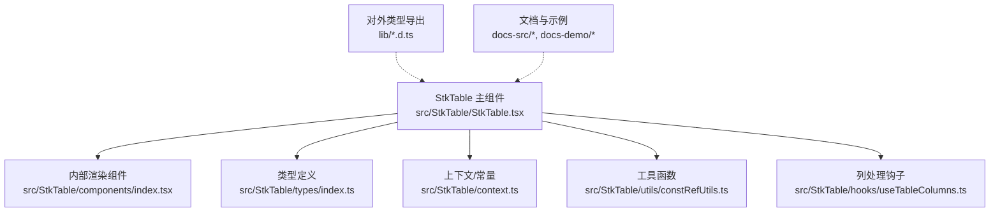
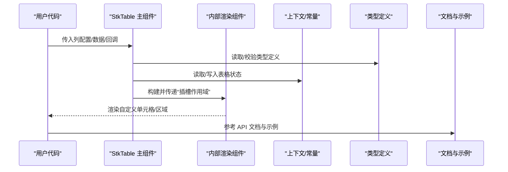
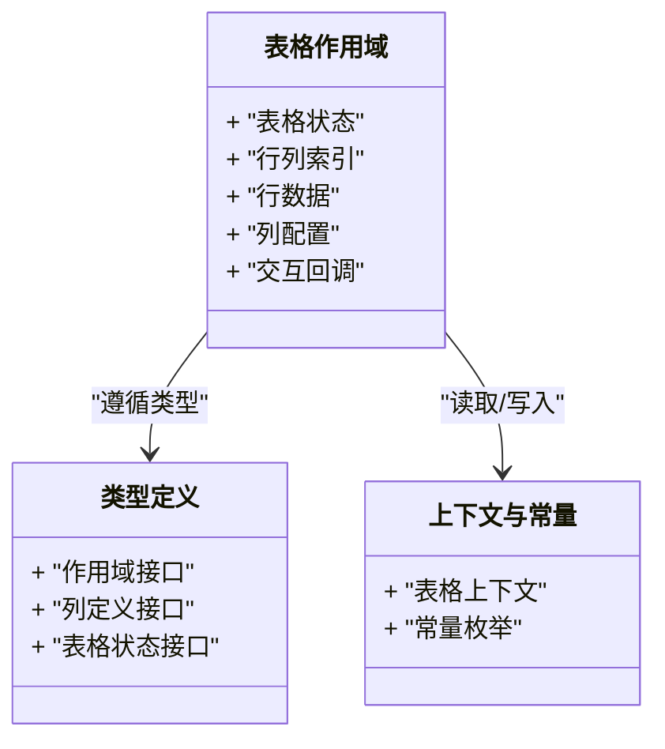
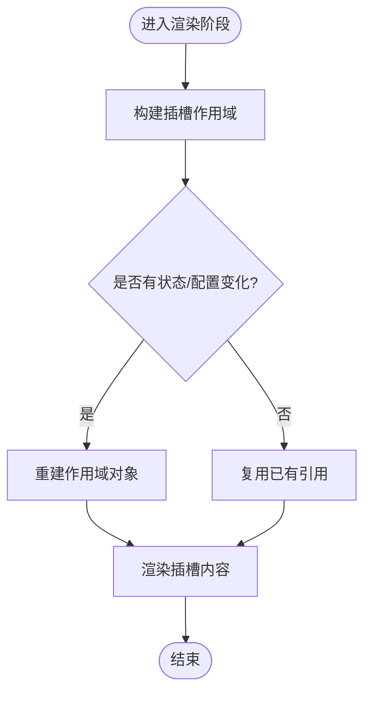
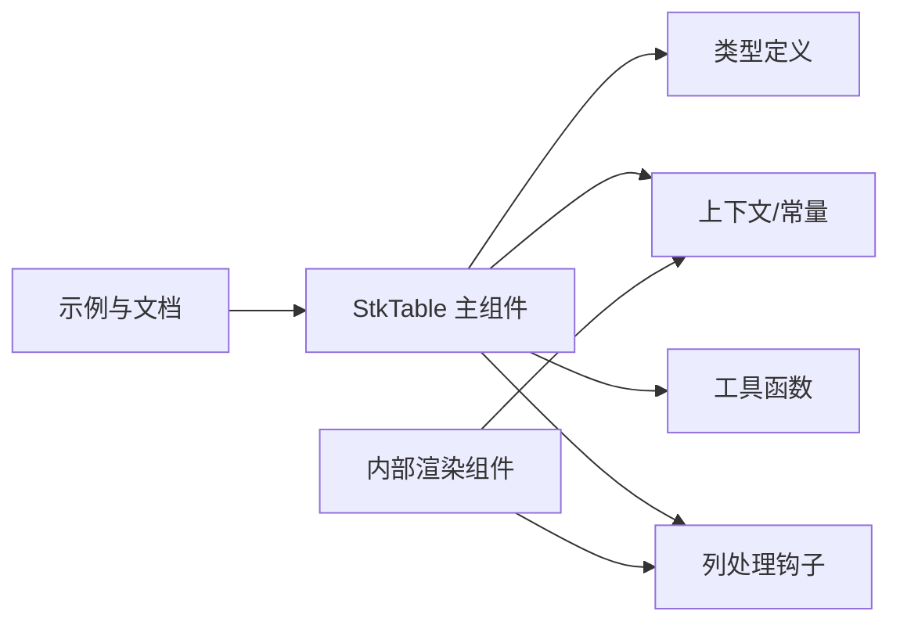

# 插槽作用域

<cite>
**本文引用的文件**   
- [src/StkTable/StkTable.tsx](file://src/StkTable/StkTable.tsx)
- [src/StkTable/components/index.tsx](file://src/StkTable/components/index.tsx)
- [src/StkTable/types/index.ts](file://src/StkTable/types/index.ts)
- [src/StkTable/context.ts](file://src/StkTable/context.ts)
- [src/StkTable/utils/constRefUtils.ts](file://src/StkTable/utils/constRefUtils.ts)
- [src/StkTable/hooks/useTableColumns.ts](file://src/StkTable/hooks/useTableColumns.ts)
- [lib/index.d.ts](file://lib/index.d.ts)
- [lib/const.d.ts](file://lib/const.d.ts)
- [lib/context.d.ts](file://lib/context.d.ts)
- [docs-src/main/api/slots.md](file://docs-src/main/api/slots.md)
- [docs-src/en/main/api/slots.md](file://docs-src/en/main/api/slots.md)
- [docs-src/ja/main/api/slots.md](file://docs-src/ja/main/api/slots.md)
- [docs-src/ko/main/api/slots.md](file://docs-src/ko/main/api/slots.md)
- [docs-demo/basic/empty/Slot.tsx](file://docs-demo/basic/empty/Slot.tsx)
- [docs-demo/advanced/custom-cell/CustomCell/YieldCell.tsx](file://docs-demo/advanced/custom-cell/CustomCell/YieldCell.tsx)
- [docs-demo/advanced/custom-cells/CheckboxCell/CheckboxComponentCell.tsx](file://docs-demo/advanced/custom-cells/CheckboxCell/CheckboxComponentCell.tsx)
- [docs-demo/advanced/custom-cells/EditableCell/index.tsx](file://docs-demo/advanced/custom-cells/EditableCell/index.tsx)
- [docs-demo/advanced/custom-cells/FilterCell/index.tsx](file://docs-demo/advanced/custom-cells/FilterCell/index.tsx)
- [docs-demo/advanced/custom-sort/CustomSort/index.tsx](file://docs-demo/advanced/custom-sort/CustomSort/index.tsx)
- [docs-demo/advanced/highlight/HighlightBase.tsx](file://docs-demo/advanced/highlight/HighlightBase.tsx)
- [docs-demo/advanced/row-drag/RowDrag.tsx](file://docs-demo/advanced/row-drag/RowDrag.tsx)
- [docs-demo/advanced/area-selection/AreaSelection.tsx](file://docs-demo/advanced/area-selection/AreaSelection.tsx)
</cite>

## 目录
1. [简介](#简介)
2. [项目结构](#项目结构)
3. [核心组件](#核心组件)
4. [架构总览](#架构总览)
5. [详细组件分析](#详细组件分析)
6. [依赖分析](#依赖分析)
7. [性能考虑](#性能考虑)
8. [故障排查指南](#故障排查指南)
9. [结论](#结论)
10. [附录](#附录)

## 简介
本文件系统化阐述“插槽作用域”在表格组件中的概念、数据结构与生命周期，覆盖以下要点：
- 插槽作用域是什么：在渲染单元格或特定区域时，由表格注入的上下文数据对象，包含行数据、列配置、表格状态等。
- 作用域数据的结构与类型：包括表格全局状态、当前行列索引、选中/展开/排序/过滤等状态，以及列定义与计算后的元信息。
- 生命周期与更新时机：何时创建、何时更新、如何避免不必要的重渲染。
- 使用模式与最佳实践：如何在自定义单元格、工具栏、底部区域等位置消费作用域数据。
- TypeScript 支持：类型声明、泛型约束与类型推断路径。
- 性能考量：作用域对象的稳定性、引用相等性、虚拟滚动下的注意事项。

## 项目结构
围绕插槽作用域的实现与文档，仓库中关键位置如下：
- 源码实现
  - 主表组件与内部渲染逻辑：[src/StkTable/StkTable.tsx](file://src/StkTable/StkTable.tsx)、[src/StkTable/components/index.tsx](file://src/StkTable/components/index.tsx)
  - 类型定义与上下文：[src/StkTable/types/index.ts](file://src/StkTable/types/index.ts)、[src/StkTable/context.ts](file://src/StkTable/context.ts)
  - 工具与钩子：[src/StkTable/utils/constRefUtils.ts](file://src/StkTable/utils/constRefUtils.ts)、[src/StkTable/hooks/useTableColumns.ts](file://src/StkTable/hooks/useTableColumns.ts)
- 对外类型导出（供消费者 TS 使用）
  - [lib/index.d.ts](file://lib/index.d.ts)、[lib/const.d.ts](file://lib/const.d.ts)、[lib/context.d.ts](file://lib/context.d.ts)
- 文档与示例
  - API 文档（多语言）：[docs-src/main/api/slots.md](file://docs-src/main/api/slots.md) 及对应英文/日文/韩文版本
  - 示例演示：基础空态插槽、高级自定义单元格、排序、高亮、拖拽、区域选择等

图表来源
- [src/StkTable/StkTable.tsx](file://src/StkTable/StkTable.tsx)
- [src/StkTable/components/index.tsx](file://src/StkTable/components/index.tsx)
- [src/StkTable/types/index.ts](file://src/StkTable/types/index.ts)
- [src/StkTable/context.ts](file://src/StkTable/context.ts)
- [src/StkTable/utils/constRefUtils.ts](file://src/StkTable/utils/constRefUtils.ts)
- [src/StkTable/hooks/useTableColumns.ts](file://src/StkTable/hooks/useTableColumns.ts)
- [lib/index.d.ts](file://lib/index.d.ts)
- [lib/const.d.ts](file://lib/const.d.ts)
- [lib/context.d.ts](file://lib/context.d.ts)

章节来源
- [src/StkTable/StkTable.tsx](file://src/StkTable/StkTable.tsx)
- [src/StkTable/components/index.tsx](file://src/StkTable/components/index.tsx)
- [src/StkTable/types/index.ts](file://src/StkTable/types/index.ts)
- [src/StkTable/context.ts](file://src/StkTable/context.ts)
- [src/StkTable/utils/constRefUtils.ts](file://src/StkTable/utils/constRefUtils.ts)
- [src/StkTable/hooks/useTableColumns.ts](file://src/StkTable/hooks/useTableColumns.ts)
- [lib/index.d.ts](file://lib/index.d.ts)
- [lib/const.d.ts](file://lib/const.d.ts)
- [lib/context.d.ts](file://lib/context.d.ts)
- [docs-src/main/api/slots.md](file://docs-src/main/api/slots.md)

## 核心组件
- StkTable 主组件负责：
  - 解析 props 与内部状态（如分页、排序、筛选、选中、展开、树形层级等）
  - 构建并维护“插槽作用域”数据对象
  - 将作用域数据传递给各插槽（如单元格、头部、底部、工具栏等）
- 内部渲染组件负责：
  - 根据列配置与行数据生成具体 UI
  - 消费插槽作用域以完成交互（编辑、排序、拖拽、高亮等）

章节来源
- [src/StkTable/StkTable.tsx](file://src/StkTable/StkTable.tsx)
- [src/StkTable/components/index.tsx](file://src/StkTable/components/index.tsx)

## 架构总览
下图展示了“插槽作用域”从构建到消费的整体流程，涵盖主组件、内部渲染、类型与上下文、以及外部文档与示例的关系。

图表来源
- [src/StkTable/StkTable.tsx](file://src/StkTable/StkTable.tsx)
- [src/StkTable/components/index.tsx](file://src/StkTable/components/index.tsx)
- [src/StkTable/types/index.ts](file://src/StkTable/types/index.ts)
- [src/StkTable/context.ts](file://src/StkTable/context.ts)
- [docs-src/main/api/slots.md](file://docs-src/main/api/slots.md)

## 详细组件分析

### 插槽作用域的数据模型
- 作用域对象通常包含但不限于：
  - 表格全局状态：分页、排序、筛选、选中、展开、树节点状态等
  - 当前行列信息：行索引、列键、是否叶子节点、层级深度等
  - 行数据与列配置：原始行记录、列定义、计算后的列元信息（宽度、对齐、可见性等）
  - 交互能力：触发排序、切换选中、展开/收起、编辑、拖拽等回调
- 类型定义与导出：
  - 源码类型位于 [src/StkTable/types/index.ts](file://src/StkTable/types/index.ts)
  - 对外导出位于 [lib/index.d.ts](file://lib/index.d.ts)、[lib/context.d.ts](file://lib/context.d.ts)、[lib/const.d.ts](file://lib/const.d.ts)
- 上下文与常量：
  - 表格上下文与常量定义位于 [src/StkTable/context.ts](file://src/StkTable/context.ts)

图表来源
- [src/StkTable/types/index.ts](file://src/StkTable/types/index.ts)
- [src/StkTable/context.ts](file://src/StkTable/context.ts)
- [lib/index.d.ts](file://lib/index.d.ts)
- [lib/context.d.ts](file://lib/context.d.ts)
- [lib/const.d.ts](file://lib/const.d.ts)

章节来源
- [src/StkTable/types/index.ts](file://src/StkTable/types/index.ts)
- [src/StkTable/context.ts](file://src/StkTable/context.ts)
- [lib/index.d.ts](file://lib/index.d.ts)
- [lib/context.d.ts](file://lib/context.d.ts)
- [lib/const.d.ts](file://lib/const.d.ts)

### 插槽作用域的生命周期
- 创建时机：当表格初始化或数据/配置变化导致需要重新渲染时，主组件会基于当前状态与列配置构建新的作用域对象。
- 更新时机：
  - 数据变更、分页、排序、筛选、选中、展开、树节点变化等都会触发作用域重建或局部更新。
  - 列配置变化（如列宽、可见性、排序器、过滤器）会影响作用域中的列元信息。
- 销毁时机：组件卸载时释放相关引用与事件监听。
- 稳定性策略：
  - 对频繁变化的字段保持最小化引用，避免不必要的重渲染。
  - 对稳定字段进行缓存或引用稳定化处理（参见工具函数）。

图表来源
- [src/StkTable/StkTable.tsx](file://src/StkTable/StkTable.tsx)
- [src/StkTable/utils/constRefUtils.ts](file://src/StkTable/utils/constRefUtils.ts)

章节来源
- [src/StkTable/StkTable.tsx](file://src/StkTable/StkTable.tsx)
- [src/StkTable/utils/constRefUtils.ts](file://src/StkTable/utils/constRefUtils.ts)

### 插槽作用域的访问方式与使用模式
- 访问方式：
  - 通过插槽参数获取作用域对象，再按需解构所需字段。
  - 在自定义单元格、头部、底部、工具栏等位置消费作用域。
- 常见使用模式：
  - 自定义单元格：根据行数据与列配置渲染复杂 UI，并调用作用域提供的交互回调。
  - 排序与筛选：使用作用域中的排序/筛选状态与回调，实现本地或远程排序/筛选。
  - 高亮与动画：结合行索引与选中状态，实现行级高亮或过渡动画。
  - 拖拽与区域选择：利用行列信息与表格状态，实现行拖拽与单元格区域选择。
- 示例参考：
  - 空态插槽示例：[docs-demo/basic/empty/Slot.tsx](file://docs-demo/basic/empty/Slot.tsx)
  - 自定义单元格（含可编辑、复选框、过滤）：
    - [docs-demo/advanced/custom-cell/CustomCell/YieldCell.tsx](file://docs-demo/advanced/custom-cell/CustomCell/YieldCell.tsx)
    - [docs-demo/advanced/custom-cells/CheckboxCell/CheckboxComponentCell.tsx](file://docs-demo/advanced/custom-cells/CheckboxCell/CheckboxComponentCell.tsx)
    - [docs-demo/advanced/custom-cells/EditableCell/index.tsx](file://docs-demo/advanced/custom-cells/EditableCell/index.tsx)
    - [docs-demo/advanced/custom-cells/FilterCell/index.tsx](file://docs-demo/advanced/custom-cells/FilterCell/index.tsx)
  - 排序与高亮：
    - [docs-demo/advanced/custom-sort/CustomSort/index.tsx](file://docs-demo/advanced/custom-sort/CustomSort/index.tsx)
    - [docs-demo/advanced/highlight/HighlightBase.tsx](file://docs-demo/advanced/highlight/HighlightBase.tsx)
  - 拖拽与区域选择：
    - [docs-demo/advanced/row-drag/RowDrag.tsx](file://docs-demo/advanced/row-drag/RowDrag.tsx)
    - [docs-demo/advanced/area-selection/AreaSelection.tsx](file://docs-demo/advanced/area-selection/AreaSelection.tsx)

章节来源
- [docs-demo/basic/empty/Slot.tsx](file://docs-demo/basic/empty/Slot.tsx)
- [docs-demo/advanced/custom-cell/CustomCell/YieldCell.tsx](file://docs-demo/advanced/custom-cell/CustomCell/YieldCell.tsx)
- [docs-demo/advanced/custom-cells/CheckboxCell/CheckboxComponentCell.tsx](file://docs-demo/advanced/custom-cells/CheckboxCell/CheckboxComponentCell.tsx)
- [docs-demo/advanced/custom-cells/EditableCell/index.tsx](file://docs-demo/advanced/custom-cells/EditableCell/index.tsx)
- [docs-demo/advanced/custom-cells/FilterCell/index.tsx](file://docs-demo/advanced/custom-cells/FilterCell/index.tsx)
- [docs-demo/advanced/custom-sort/CustomSort/index.tsx](file://docs-demo/advanced/custom-sort/CustomSort/index.tsx)
- [docs-demo/advanced/highlight/HighlightBase.tsx](file://docs-demo/advanced/highlight/HighlightBase.tsx)
- [docs-demo/advanced/row-drag/RowDrag.tsx](file://docs-demo/advanced/row-drag/RowDrag.tsx)
- [docs-demo/advanced/area-selection/AreaSelection.tsx](file://docs-demo/advanced/area-selection/AreaSelection.tsx)

### 插槽作用域的类型定义与 TypeScript 支持
- 类型来源：
  - 源码类型定义：[src/StkTable/types/index.ts](file://src/StkTable/types/index.ts)
  - 对外导出：[lib/index.d.ts](file://lib/index.d.ts)、[lib/context.d.ts](file://lib/context.d.ts)、[lib/const.d.ts](file://lib/const.d.ts)
- 使用建议：
  - 在自定义单元格中显式标注作用域类型，以获得完整的智能提示与编译期检查。
  - 对于行数据与列配置，建议使用泛型约束，确保类型安全。
  - 借助常量与上下文类型，减少魔法字符串与硬编码。

章节来源
- [src/StkTable/types/index.ts](file://src/StkTable/types/index.ts)
- [lib/index.d.ts](file://lib/index.d.ts)
- [lib/context.d.ts](file://lib/context.d.ts)
- [lib/const.d.ts](file://lib/const.d.ts)

### 列处理与列元信息
- 列处理钩子用于规范化列配置、计算列元信息（如宽度、对齐、可见性、排序/过滤能力等），并在作用域中暴露给插槽消费。
- 典型职责：
  - 合并多级表头
  - 计算固定列与自适应列
  - 为每列附加排序/过滤/编辑等能力标记
- 参考实现：[src/StkTable/hooks/useTableColumns.ts](file://src/StkTable/hooks/useTableColumns.ts)

章节来源
- [src/StkTable/hooks/useTableColumns.ts](file://src/StkTable/hooks/useTableColumns.ts)

## 依赖分析
- 组件内依赖关系：
  - 主组件依赖类型定义、上下文与工具函数，以构建稳定的作用域对象。
  - 内部渲染组件依赖列处理钩子与上下文，以正确消费作用域数据。
- 外部依赖：
  - 文档与示例作为“契约”的可视化说明，帮助开发者理解作用域字段与用法。

图表来源
- [src/StkTable/StkTable.tsx](file://src/StkTable/StkTable.tsx)
- [src/StkTable/components/index.tsx](file://src/StkTable/components/index.tsx)
- [src/StkTable/types/index.ts](file://src/StkTable/types/index.ts)
- [src/StkTable/context.ts](file://src/StkTable/context.ts)
- [src/StkTable/utils/constRefUtils.ts](file://src/StkTable/utils/constRefUtils.ts)
- [src/StkTable/hooks/useTableColumns.ts](file://src/StkTable/hooks/useTableColumns.ts)

章节来源
- [src/StkTable/StkTable.tsx](file://src/StkTable/StkTable.tsx)
- [src/StkTable/components/index.tsx](file://src/StkTable/components/index.tsx)
- [src/StkTable/types/index.ts](file://src/StkTable/types/index.ts)
- [src/StkTable/context.ts](file://src/StkTable/context.ts)
- [src/StkTable/utils/constRefUtils.ts](file://src/StkTable/utils/constRefUtils.ts)
- [src/StkTable/hooks/useTableColumns.ts](file://src/StkTable/hooks/useTableColumns.ts)

## 性能考虑
- 引用稳定性：
  - 对频繁变化的作用域字段尽量保持最小粒度，避免整块对象重建导致下游重渲染。
  - 对稳定字段使用工具函数进行引用稳定化处理（例如常量引用、memo 化）。
- 虚拟滚动：
  - 在虚拟列表场景下，仅渲染可视区域内的行，注意作用域对象不应持有大量 DOM 引用。
- 事件与回调：
  - 避免在每次渲染时创建新回调；必要时进行 memo 化或稳定化。
- 列元信息计算：
  - 列处理钩子应缓存计算结果，仅在列配置变化时重新计算。

章节来源
- [src/StkTable/utils/constRefUtils.ts](file://src/StkTable/utils/constRefUtils.ts)
- [src/StkTable/hooks/useTableColumns.ts](file://src/StkTable/hooks/useTableColumns.ts)

## 故障排查指南
- 常见问题定位：
  - 插槽未渲染或内容为空：检查列配置是否正确、数据是否为空、空态插槽是否启用。
  - 作用域字段缺失或类型错误：确认使用的字段是否在类型定义中导出，核对泛型约束。
  - 交互无效（排序/筛选/选中）：检查回调是否被正确绑定与作用域是否更新。
- 调试建议：
  - 打印作用域关键字段，观察其变化时机。
  - 对比文档与示例，确认字段名与用法一致。
- 参考文档：
  - 插槽 API 文档（中文/英文/日文/韩文）：
    - [docs-src/main/api/slots.md](file://docs-src/main/api/slots.md)
    - [docs-src/en/main/api/slots.md](file://docs-src/en/main/api/slots.md)
    - [docs-src/ja/main/api/slots.md](file://docs-src/ja/main/api/slots.md)
    - [docs-src/ko/main/api/slots.md](file://docs-src/ko/main/api/slots.md)

章节来源
- [docs-src/main/api/slots.md](file://docs-src/main/api/slots.md)
- [docs-src/en/main/api/slots.md](file://docs-src/en/main/api/slots.md)
- [docs-src/ja/main/api/slots.md](file://docs-src/ja/main/api/slots.md)
- [docs-src/ko/main/api/slots.md](file://docs-src/ko/main/api/slots.md)

## 结论
插槽作用域是表格组件扩展能力的核心机制。通过明确的作用域数据结构、稳定的生命周期与完善的类型支持，开发者可以在不侵入表格内部实现的前提下，灵活定制单元格、头部、底部与工具栏等区域的展示与交互。配合文档与示例，能够快速上手并实现高性能的表格应用。

## 附录
- 快速参考
  - 作用域对象字段清单与含义：参考插槽 API 文档
  - 类型定义与导出：查看 lib/*.d.ts 与 src/StkTable/types/index.ts
  - 示例对照：参考 docs-demo 中各功能对应的示例文件