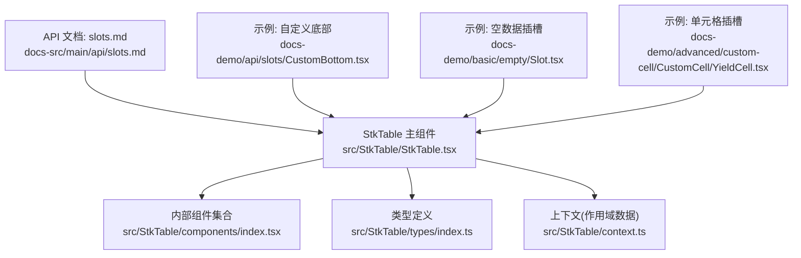
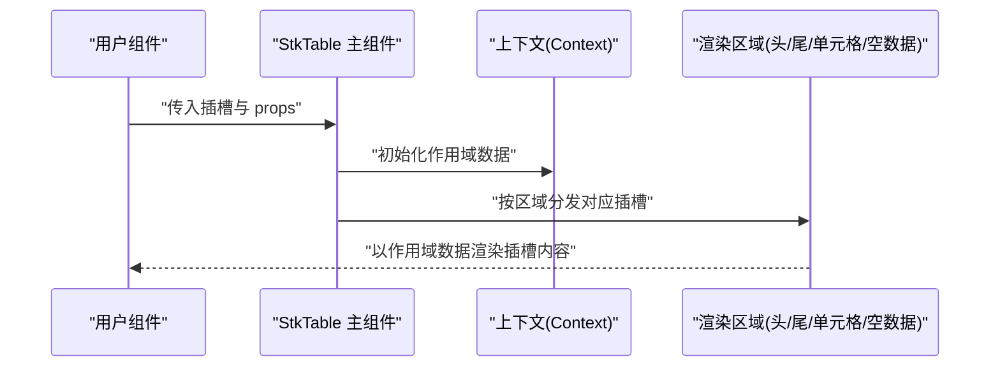
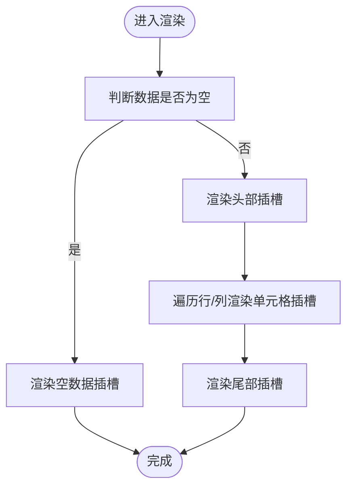
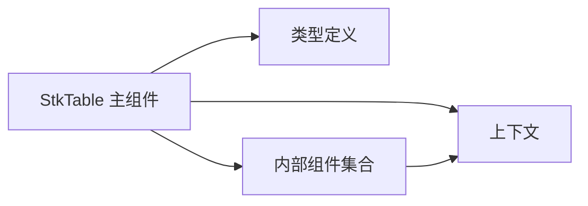

# 插槽系统 (Slots)

<cite>
**本文引用的文件**   
- [src/StkTable/StkTable.tsx](file://src/StkTable/StkTable.tsx)
- [src/StkTable/components/index.tsx](file://src/StkTable/components/index.tsx)
- [src/StkTable/types/index.ts](file://src/StkTable/types/index.ts)
- [src/StkTable/context.ts](file://src/StkTable/context.ts)
- [docs-src/main/api/slots.md](file://docs-src/main/api/slots.md)
- [docs-demo/advanced/custom-cell/CustomCell/YieldCell.tsx](file://docs-demo/advanced/custom-cell/CustomCell/YieldCell.tsx)
- [docs-demo/basic/empty/Slot.tsx](file://docs-demo/basic/empty/Slot.tsx)
- [docs-demo/api/slots/CustomBottom.tsx](file://docs-demo/api/slots/CustomBottom.tsx)
</cite>

## 目录
1. [简介](#简介)
2. [项目结构](#项目结构)
3. [核心组件](#核心组件)
4. [架构总览](#架构总览)
5. [详细组件分析](#详细组件分析)
6. [依赖分析](#依赖分析)
7. [性能考虑](#性能考虑)
8. [故障排查指南](#故障排查指南)
9. [结论](#结论)
10. [附录](#附录)

## 简介
本章节面向 StkTable 的插槽（Slots）系统，提供完整的 API 说明与使用指南。内容覆盖：
- 内置插槽清单与用途：头部、尾部、单元格、空数据等
- 每个插槽的作用域数据（参数）说明
- 插槽内容的编写规范与最佳实践
- 组合使用、条件渲染、动态内容等高级用法
- 性能优化技巧与常见问题解决方案

## 项目结构
StkTable 的插槽能力由主组件统一分发，并通过上下文向子组件传递作用域数据；文档与示例位于 docs-src 与 docs-demo 中。

图表来源
- [src/StkTable/StkTable.tsx](file://src/StkTable/StkTable.tsx)
- [src/StkTable/components/index.tsx](file://src/StkTable/components/index.tsx)
- [src/StkTable/types/index.ts](file://src/StkTable/types/index.ts)
- [src/StkTable/context.ts](file://src/StkTable/context.ts)
- [docs-src/main/api/slots.md](file://docs-src/main/api/slots.md)
- [docs-demo/api/slots/CustomBottom.tsx](file://docs-demo/api/slots/CustomBottom.tsx)
- [docs-demo/basic/empty/Slot.tsx](file://docs-demo/basic/empty/Slot.tsx)
- [docs-demo/advanced/custom-cell/CustomCell/YieldCell.tsx](file://docs-demo/advanced/custom-cell/CustomCell/YieldCell.tsx)

章节来源
- [src/StkTable/StkTable.tsx](file://src/StkTable/StkTable.tsx)
- [src/StkTable/components/index.tsx](file://src/StkTable/components/index.tsx)
- [src/StkTable/types/index.ts](file://src/StkTable/types/index.ts)
- [src/StkTable/context.ts](file://src/StkTable/context.ts)
- [docs-src/main/api/slots.md](file://docs-src/main/api/slots.md)

## 核心组件
- StkTable 主组件负责：
  - 解析并分发所有插槽
  - 通过上下文将表格状态、列信息、行数据等作为作用域数据传递给插槽
  - 在合适时机渲染默认内容与用户提供的插槽内容
- components 子模块包含表格内部各区域组件，它们消费来自上下文的插槽与作用域数据
- types 定义插槽作用域数据的类型契约
- context 提供作用域数据的共享通道

章节来源
- [src/StkTable/StkTable.tsx](file://src/StkTable/StkTable.tsx)
- [src/StkTable/components/index.tsx](file://src/StkTable/components/index.tsx)
- [src/StkTable/types/index.ts](file://src/StkTable/types/index.ts)
- [src/StkTable/context.ts](file://src/StkTable/context.ts)

## 架构总览
下图展示插槽在主组件中的分发路径与作用域数据来源。

图表来源
- [src/StkTable/StkTable.tsx](file://src/StkTable/StkTable.tsx)
- [src/StkTable/context.ts](file://src/StkTable/context.ts)

## 详细组件分析

### 插槽清单与 API
本节汇总 StkTable 支持的插槽名称、作用域数据字段、典型用途与注意事项。为避免冗长代码，具体实现请参考“章节来源”中的文件路径。

- 头部插槽
  - 作用：在表头区域插入自定义内容（如工具栏、筛选器、统计信息等）
  - 作用域数据：包含当前列配置、排序状态、筛选状态、分页信息、表格尺寸等
  - 建议：避免在头部插槽内执行重计算或频繁更新的状态逻辑
  - 参考示例：[docs-demo/api/slots/CustomBottom.tsx](file://docs-demo/api/slots/CustomBottom.tsx)

- 尾部插槽
  - 作用：在表格底部追加内容（如分页控件、导出按钮、合计行等）
  - 作用域数据：包含分页、排序、筛选、选中行、列宽等信息
  - 建议：结合分页与滚动场景，注意高度自适应与虚拟列表兼容性
  - 参考示例：[docs-demo/api/slots/CustomBottom.tsx](file://docs-demo/api/slots/CustomBottom.tsx)

- 单元格插槽
  - 作用：针对特定列或行渲染自定义单元格内容（如按钮、进度条、富文本等）
  - 作用域数据：包含当前行数据、列配置、索引、是否选中、编辑态等
  - 建议：对大数据量场景进行虚拟化适配与懒加载处理
  - 参考示例：[docs-demo/advanced/custom-cell/CustomCell/YieldCell.tsx](file://docs-demo/advanced/custom-cell/CustomCell/YieldCell.tsx)

- 空数据插槽
  - 作用：当数据为空时显示占位内容（如图标、提示文案、操作引导）
  - 作用域数据：包含表格基础信息与可触发的回调（如刷新、清空筛选等）
  - 建议：保持简洁，必要时提供快捷操作入口
  - 参考示例：[docs-demo/basic/empty/Slot.tsx](file://docs-demo/basic/empty/Slot.tsx)

- 其他扩展插槽
  - 若存在更多插槽（如展开行、固定列区域等），其作用域数据与使用方式遵循上述约定，并在类型定义中声明

章节来源
- [src/StkTable/StkTable.tsx](file://src/StkTable/StkTable.tsx)
- [src/StkTable/types/index.ts](file://src/StkTable/types/index.ts)
- [docs-src/main/api/slots.md](file://docs-src/main/api/slots.md)
- [docs-demo/api/slots/CustomBottom.tsx](file://docs-demo/api/slots/CustomBottom.tsx)
- [docs-demo/basic/empty/Slot.tsx](file://docs-demo/basic/empty/Slot.tsx)
- [docs-demo/advanced/custom-cell/CustomCell/YieldCell.tsx](file://docs-demo/advanced/custom-cell/CustomCell/YieldCell.tsx)

### 作用域数据模型
- 设计原则
  - 以只读为主，变更通过回调触发
  - 字段命名清晰，区分列级与行级数据
  - 对复杂对象采用稳定引用，减少不必要的重渲染
- 关键类别
  - 表格全局：分页、排序、筛选、选中、尺寸、主题等
  - 列级：列配置、对齐、宽度、排序/筛选开关、格式化器等
  - 行级：行数据、索引、父子关系、展开态、编辑态等
- 类型契约
  - 所有作用域数据字段均在类型文件中定义，确保 TS 智能提示与编译期校验

章节来源
- [src/StkTable/types/index.ts](file://src/StkTable/types/index.ts)
- [src/StkTable/context.ts](file://src/StkTable/context.ts)

### 插槽分发流程
- 主组件根据当前渲染阶段选择对应的插槽
- 通过上下文注入作用域数据
- 子组件按需消费插槽与作用域数据
- 事件回调向上冒泡至主组件，驱动状态更新

图表来源
- [src/StkTable/StkTable.tsx](file://src/StkTable/StkTable.tsx)

章节来源
- [src/StkTable/StkTable.tsx](file://src/StkTable/StkTable.tsx)

### 高级用法

- 组合使用
  - 同时启用头部与尾部插槽，构建完整的数据看板界面
  - 在单元格插槽中嵌入交互控件，并与全局状态联动
  - 参考示例：
    - [docs-demo/api/slots/CustomBottom.tsx](file://docs-demo/api/slots/CustomBottom.tsx)
    - [docs-demo/advanced/custom-cell/CustomCell/YieldCell.tsx](file://docs-demo/advanced/custom-cell/CustomCell/YieldCell.tsx)

- 条件渲染
  - 基于作用域数据中的列配置或行状态决定插槽内容
  - 根据权限或环境切换不同 UI 片段
  - 参考示例：
    - [docs-demo/basic/empty/Slot.tsx](file://docs-demo/basic/empty/Slot.tsx)

- 动态内容
  - 监听外部状态变化，动态调整插槽内容
  - 结合异步数据源，延迟渲染复杂内容
  - 参考示例：
    - [docs-demo/advanced/custom-cell/CustomCell/YieldCell.tsx](file://docs-demo/advanced/custom-cell/CustomCell/YieldCell.tsx)

章节来源
- [docs-demo/api/slots/CustomBottom.tsx](file://docs-demo/api/slots/CustomBottom.tsx)
- [docs-demo/basic/empty/Slot.tsx](file://docs-demo/basic/empty/Slot.tsx)
- [docs-demo/advanced/custom-cell/CustomCell/YieldCell.tsx](file://docs-demo/advanced/custom-cell/CustomCell/YieldCell.tsx)

## 依赖分析
- 组件耦合
  - StkTable 主组件集中管理插槽分发与上下文，降低子组件耦合度
  - components 子模块仅消费上下文，职责单一
- 外部依赖
  - 类型定义与上下文为内部模块，无强外部耦合
- 潜在风险
  - 避免在插槽内创建不稳定引用导致大面积重渲染
  - 谨慎在插槽内发起高频网络请求

图表来源
- [src/StkTable/StkTable.tsx](file://src/StkTable/StkTable.tsx)
- [src/StkTable/context.ts](file://src/StkTable/context.ts)
- [src/StkTable/types/index.ts](file://src/StkTable/types/index.ts)
- [src/StkTable/components/index.tsx](file://src/StkTable/components/index.tsx)

章节来源
- [src/StkTable/StkTable.tsx](file://src/StkTable/StkTable.tsx)
- [src/StkTable/context.ts](file://src/StkTable/context.ts)
- [src/StkTable/types/index.ts](file://src/StkTable/types/index.ts)
- [src/StkTable/components/index.tsx](file://src/StkTable/components/index.tsx)

## 性能考虑
- 避免在插槽内执行昂贵计算，必要时使用缓存或惰性求值
- 对大数据量场景，优先使用虚拟滚动与按需渲染
- 控制插槽内状态粒度，减少不必要的全局状态更新
- 合理使用受控与非受控模式，平衡交互与性能
- 对复杂单元格内容采用懒加载与图片优化

## 故障排查指南
- 插槽未生效
  - 检查插槽名称与作用域数据字段是否与类型定义一致
  - 确认主组件是否正确分发对应插槽
- 作用域数据缺失或类型错误
  - 核对类型定义文件中的字段名与可选性
  - 在开发模式下开启严格类型检查
- 性能问题
  - 定位插槽内的重渲染热点，拆分组件或使用 memo 化
  - 避免在插槽内直接修改父级状态，改用回调
- 常见错误
  - 空数据插槽与正常数据插槽混用导致布局异常
  - 单元格插槽与列配置冲突引发样式错乱

章节来源
- [src/StkTable/types/index.ts](file://src/StkTable/types/index.ts)
- [src/StkTable/StkTable.tsx](file://src/StkTable/StkTable.tsx)

## 结论
StkTable 的插槽系统通过统一的分发机制与明确的作用域数据契约，提供了灵活且高性能的扩展能力。遵循本文档的编写规范与性能建议，可在保证用户体验的同时，快速构建丰富的表格交互与展示方案。

## 附录
- 相关文档
  - API 文档：[docs-src/main/api/slots.md](file://docs-src/main/api/slots.md)
- 示例工程
  - 自定义底部：[docs-demo/api/slots/CustomBottom.tsx](file://docs-demo/api/slots/CustomBottom.tsx)
  - 空数据插槽：[docs-demo/basic/empty/Slot.tsx](file://docs-demo/basic/empty/Slot.tsx)
  - 单元格插槽：[docs-demo/advanced/custom-cell/CustomCell/YieldCell.tsx](file://docs-demo/advanced/custom-cell/CustomCell/YieldCell.tsx)