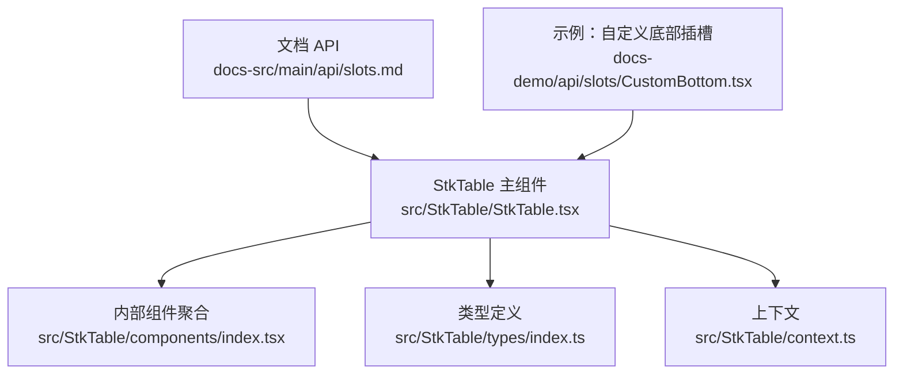
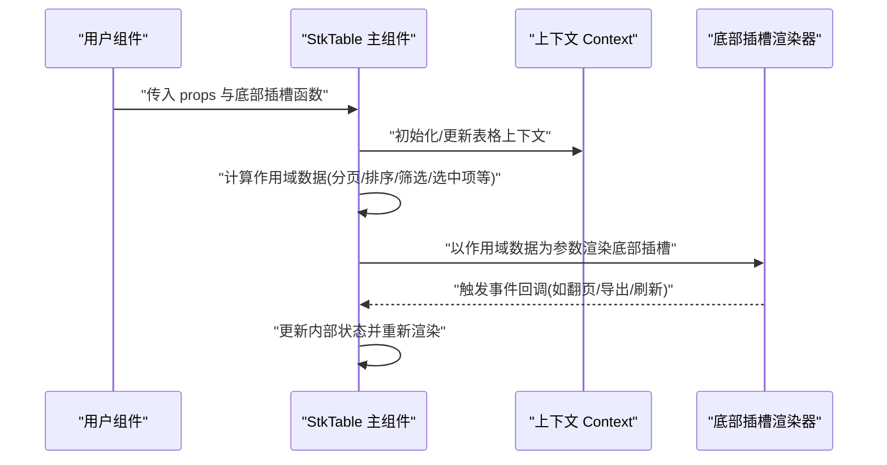
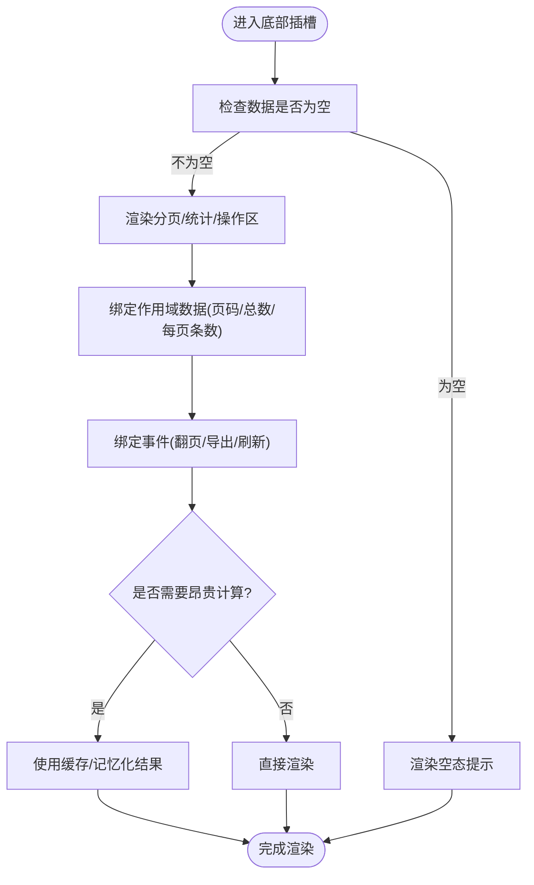
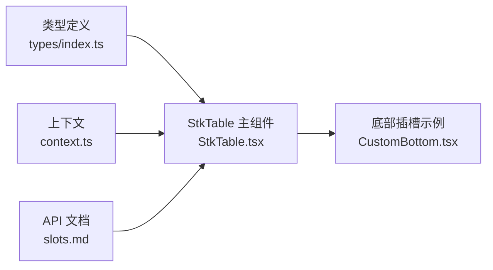

# 自定义插槽

<cite>
**本文引用的文件**   
- [src/StkTable/StkTable.tsx](file://src/StkTable/StkTable.tsx)
- [src/StkTable/components/index.tsx](file://src/StkTable/components/index.tsx)
- [src/StkTable/types/index.ts](file://src/StkTable/types/index.ts)
- [src/StkTable/context.ts](file://src/StkTable/context.ts)
- [docs-demo/api/slots/CustomBottom.tsx](file://docs-demo/api/slots/CustomBottom.tsx)
- [docs-src/main/api/slots.md](file://docs-src/main/api/slots.md)
</cite>

## 目录
1. [简介](#简介)
2. [项目结构](#项目结构)
3. [核心组件](#核心组件)
4. [架构总览](#架构总览)
5. [详细组件分析](#详细组件分析)
6. [依赖分析](#依赖分析)
7. [性能考虑](#性能考虑)
8. [故障排查指南](#故障排查指南)
9. [结论](#结论)
10. [附录](#附录)

## 简介
本指南面向希望在表格组件中扩展与定制渲染的用户，聚焦“自定义插槽”的完整开发流程。内容涵盖：
- 插槽定义与作用域数据绑定
- 事件处理与样式定制
- 完整的底部插槽示例（含条件渲染、动态内容与性能优化）
- 调试技巧与常见问题解决方案

通过阅读本指南，你将掌握在表格组件中安全、高效地使用和扩展插槽的最佳实践。

## 项目结构
本项目采用按功能分层组织的方式，核心实现位于 src/StkTable 下，文档与演示位于 docs-src 与 docs-demo 下。与插槽相关的重点位置如下：
- 核心组件与类型定义：src/StkTable/StkTable.tsx、src/StkTable/types/index.ts、src/StkTable/context.ts
- 内部子组件聚合：src/StkTable/components/index.tsx
- 文档与示例：docs-src/main/api/slots.md、docs-demo/api/slots/CustomBottom.tsx

图表来源
- [src/StkTable/StkTable.tsx](file://src/StkTable/StkTable.tsx)
- [src/StkTable/components/index.tsx](file://src/StkTable/components/index.tsx)
- [src/StkTable/types/index.ts](file://src/StkTable/types/index.ts)
- [src/StkTable/context.ts](file://src/StkTable/context.ts)
- [docs-src/main/api/slots.md](file://docs-src/main/api/slots.md)
- [docs-demo/api/slots/CustomBottom.tsx](file://docs-demo/api/slots/CustomBottom.tsx)

章节来源
- [src/StkTable/StkTable.tsx](file://src/StkTable/StkTable.tsx)
- [src/StkTable/components/index.tsx](file://src/StkTable/components/index.tsx)
- [src/StkTable/types/index.ts](file://src/StkTable/types/index.ts)
- [src/StkTable/context.ts](file://src/StkTable/context.ts)
- [docs-src/main/api/slots.md](file://docs-src/main/api/slots.md)
- [docs-demo/api/slots/CustomBottom.tsx](file://docs-demo/api/slots/CustomBottom.tsx)

## 核心组件
- StkTable 主组件负责渲染表格主体、管理状态、分发插槽作用域数据，并统一处理事件回调。
- components/index.tsx 聚合内部子组件，便于按需渲染与组合。
- types/index.ts 提供插槽相关类型约束，确保作用域数据的类型安全。
- context.ts 提供跨层级共享的上下文，用于传递表格实例、主题或全局配置等。

章节来源
- [src/StkTable/StkTable.tsx](file://src/StkTable/StkTable.tsx)
- [src/StkTable/components/index.tsx](file://src/StkTable/components/index.tsx)
- [src/StkTable/types/index.ts](file://src/StkTable/types/index.ts)
- [src/StkTable/context.ts](file://src/StkTable/context.ts)

## 架构总览
下图展示了“自定义底部插槽”从调用方到渲染层的数据流与控制流。

图表来源
- [src/StkTable/StkTable.tsx](file://src/StkTable/StkTable.tsx)
- [src/StkTable/context.ts](file://src/StkTable/context.ts)
- [docs-demo/api/slots/CustomBottom.tsx](file://docs-demo/api/slots/CustomBottom.tsx)

## 详细组件分析

### 插槽定义与作用域数据
- 插槽命名约定：使用具名插槽区分不同区域，例如底部插槽通常命名为 bottom。
- 作用域数据：由表格组件计算并提供，常见字段包括分页信息、排序状态、筛选条件、选中行键值集合、当前页数据等。具体字段以类型定义为准。
- 类型安全：通过类型定义约束作用域数据结构，避免运行时错误。

章节来源
- [src/StkTable/types/index.ts](file://src/StkTable/types/index.ts)
- [docs-src/main/api/slots.md](file://docs-src/main/api/slots.md)

### 事件处理
- 事件来源：底部插槽内触发的交互（如点击翻页、导出、刷新）应调用表格提供的回调函数。
- 事件传播：优先使用表格暴露的事件接口，避免直接操作 DOM 或绕过受控状态。
- 副作用控制：对异步操作进行防抖/节流，避免频繁重渲染。

章节来源
- [src/StkTable/StkTable.tsx](file://src/StkTable/StkTable.tsx)
- [docs-src/main/api/slots.md](file://docs-src/main/api/slots.md)

### 样式定制
- 推荐方式：通过 CSS 变量或主题系统覆盖默认样式，保持与表格整体风格一致。
- 局部样式：为插槽容器添加稳定类名，结合父级选择器限定作用域，避免污染全局。
- 响应式适配：根据表格尺寸与滚动行为调整布局，保证在不同视口下的可用性。

章节来源
- [src/StkTable/style.less](file://src/StkTable/style.less)
- [docs-src/main/api/slots.md](file://docs-src/main/api/slots.md)

### 完整示例：自定义底部插槽
以下示例展示如何创建并使用一个具备高级特性的底部插槽：
- 条件渲染：根据是否有数据或是否启用分页显示不同内容
- 动态内容：根据当前页码、每页条数、总记录数动态生成提示文本
- 性能优化：对昂贵计算进行缓存，减少不必要的重渲染

图表来源
- [docs-demo/api/slots/CustomBottom.tsx](file://docs-demo/api/slots/CustomBottom.tsx)
- [src/StkTable/StkTable.tsx](file://src/StkTable/StkTable.tsx)

章节来源
- [docs-demo/api/slots/CustomBottom.tsx](file://docs-demo/api/slots/CustomBottom.tsx)
- [src/StkTable/StkTable.tsx](file://src/StkTable/StkTable.tsx)

### 高级用法：条件渲染与动态内容
- 条件渲染策略：基于作用域中的布尔标志（如 hasData、isPaginated）决定渲染分支，避免无意义的节点挂载。
- 动态内容生成：将易变数据（如当前页码、每页条数）作为依赖，仅在这些值变化时更新相应片段。
- 可访问性：为交互元素提供语义化标签与键盘支持，提升无障碍体验。

章节来源
- [docs-src/main/api/slots.md](file://docs-src/main/api/slots.md)
- [docs-demo/api/slots/CustomBottom.tsx](file://docs-demo/api/slots/CustomBottom.tsx)

### 性能优化要点
- 最小化重渲染：仅在必要的作用域字段变化时更新插槽内容，避免整块重建。
- 计算缓存：对复杂计算（如汇总、格式化）使用记忆化策略，降低 CPU 开销。
- 事件节流：对高频事件（如滚动、输入）进行节流/防抖，减少回调频率。
- 懒加载：对非首屏内容延迟渲染，缩短首次绘制时间。

章节来源
- [src/StkTable/StkTable.tsx](file://src/StkTable/StkTable.tsx)
- [docs-src/main/api/slots.md](file://docs-src/main/api/slots.md)

## 依赖分析
- 组件耦合：StkTable 主组件与内部子组件通过 props 与 context 解耦，插槽作为扩展点进一步降低耦合度。
- 外部依赖：插槽的实现完全由调用方提供，表格组件仅负责提供作用域数据与事件回调，符合开闭原则。
- 循环依赖：通过类型定义与上下文隔离，避免模块间循环引用。

图表来源
- [src/StkTable/types/index.ts](file://src/StkTable/types/index.ts)
- [src/StkTable/StkTable.tsx](file://src/StkTable/StkTable.tsx)
- [src/StkTable/context.ts](file://src/StkTable/context.ts)
- [docs-demo/api/slots/CustomBottom.tsx](file://docs-demo/api/slots/CustomBottom.tsx)
- [docs-src/main/api/slots.md](file://docs-src/main/api/slots.md)

章节来源
- [src/StkTable/types/index.ts](file://src/StkTable/types/index.ts)
- [src/StkTable/StkTable.tsx](file://src/StkTable/StkTable.tsx)
- [src/StkTable/context.ts](file://src/StkTable/context.ts)
- [docs-demo/api/slots/CustomBottom.tsx](file://docs-demo/api/slots/CustomBottom.tsx)
- [docs-src/main/api/slots.md](file://docs-src/main/api/slots.md)

## 性能考虑
- 渲染路径优化：将插槽内容拆分为更细粒度的子组件，配合 React.memo 减少重复渲染。
- 数据切片：仅向插槽传递必要的字段，避免传递大对象导致不必要的重渲染。
- 虚拟列表：当底部插槽包含大量条目时，考虑引入虚拟滚动以提升性能。
- 资源占用监控：在生产环境开启性能指标采集，定位热点与瓶颈。

[本节为通用指导，不直接分析具体文件]

## 故障排查指南
- 插槽未渲染
  - 检查插槽名称是否正确，确认是否在正确的区域注入。
  - 验证作用域数据是否存在，必要时增加空值保护。
- 事件无效
  - 确认回调函数是否被正确绑定，避免在每次渲染时创建新函数实例。
  - 检查事件冒泡是否被阻止，必要时调整事件监听策略。
- 样式冲突
  - 使用稳定的类名与作用域选择器，避免覆盖全局样式。
  - 借助浏览器开发者工具检查最终样式来源与优先级。
- 性能问题
  - 使用性能面板分析重渲染原因，定位昂贵的计算与不必要的状态更新。
  - 对高频事件进行节流/防抖，拆分大组件为小单元。

章节来源
- [docs-src/main/api/slots.md](file://docs-src/main/api/slots.md)
- [docs-demo/api/slots/CustomBottom.tsx](file://docs-demo/api/slots/CustomBottom.tsx)

## 结论
通过合理设计插槽的作用域数据与事件接口，可以在不侵入核心逻辑的前提下实现高度灵活的扩展。遵循类型约束、性能优化与可访问性最佳实践，能够显著提升用户体验与维护效率。建议在实际项目中结合业务场景逐步演进插槽能力，并保持文档与示例同步更新。

[本节为总结性内容，不直接分析具体文件]

## 附录
- 快速上手清单
  - 明确插槽名称与作用域字段
  - 在调用处传入底部插槽函数
  - 在插槽内绑定事件回调与样式类名
  - 使用条件渲染与记忆化优化性能
  - 通过文档与示例对照验证行为

章节来源
- [docs-src/main/api/slots.md](file://docs-src/main/api/slots.md)
- [docs-demo/api/slots/CustomBottom.tsx](file://docs-demo/api/slots/CustomBottom.tsx)