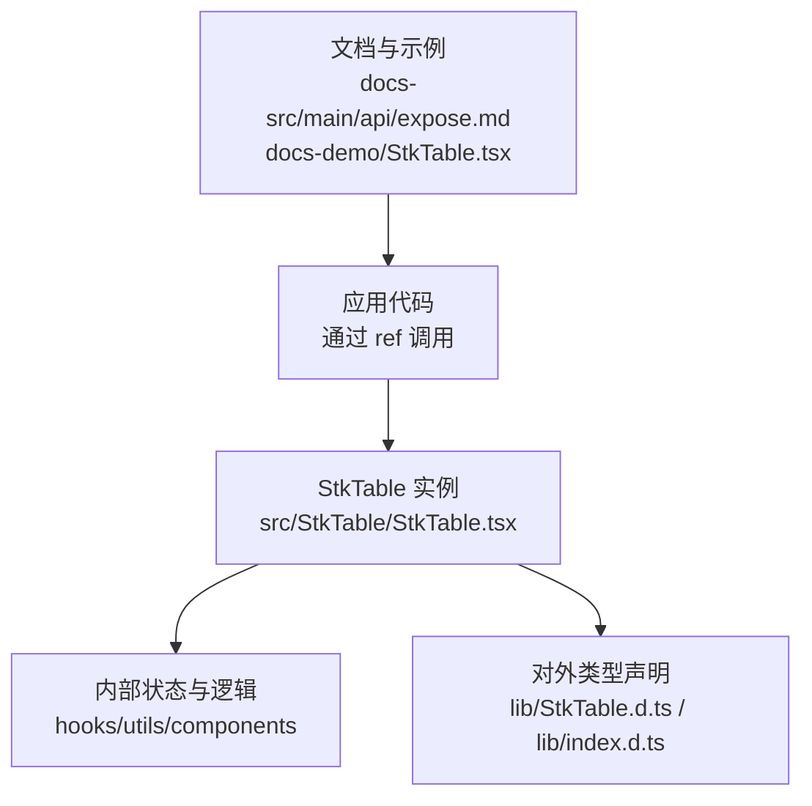
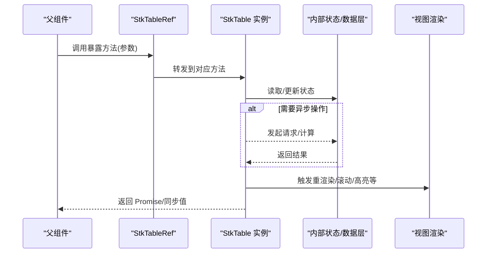
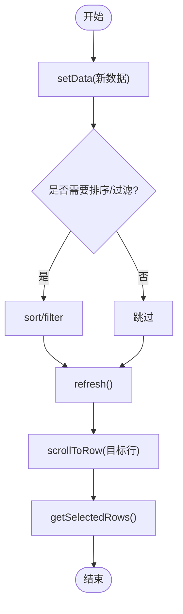
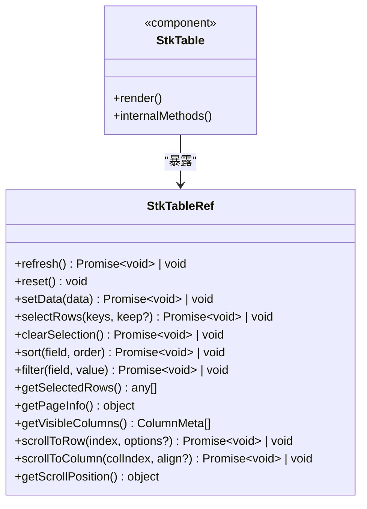

# 暴露方法 (Expose)

<cite>
**本文引用的文件**   
- [src/StkTable/StkTable.tsx](file://src/StkTable/StkTable.tsx)
- [src/StkTable/index.ts](file://src/StkTable/index.ts)
- [lib/index.d.ts](file://lib/index.d.ts)
- [lib/StkTable.d.ts](file://lib/StkTable.d.ts)
- [docs-src/main/api/expose.md](file://docs-src/main/api/expose.md)
- [docs-demo/StkTable.tsx](file://docs-demo/StkTable.tsx)
</cite>

## 目录
1. [简介](#简介)
2. [项目结构](#项目结构)
3. [核心组件](#核心组件)
4. [架构总览](#架构总览)
5. [详细组件分析](#详细组件分析)
6. [依赖分析](#依赖分析)
7. [性能注意事项](#性能注意事项)
8. [故障排查指南](#故障排查指南)
9. [结论](#结论)
10. [附录](#附录)

## 简介
本文件为 StkTable 的“暴露方法（Expose）”完整 API 文档，聚焦通过 ref 访问的所有方法接口。内容涵盖：
- 表格控制方法（如刷新、重置、滚动等）
- 数据操作方法（如更新数据、选择行、排序/筛选触发等）
- 状态查询方法（如获取选中项、当前页、可见列等）
- 滚动控制方法（如滚动到指定行/列、获取滚动位置等）

每个方法均提供函数签名、参数说明、返回值类型与使用示例，并补充调用时机、异步处理、错误处理等注意事项，以及常见组合场景与最佳实践。

## 项目结构
StkTable 的核心实现位于 src/StkTable 目录，对外暴露的类型与方法定义在 lib 下的 .d.ts 文件中；文档与示例分别位于 docs-src 与 docs-demo。

图表来源 
- [src/StkTable/StkTable.tsx](file://src/StkTable/StkTable.tsx)
- [lib/StkTable.d.ts](file://lib/StkTable.d.ts)
- [lib/index.d.ts](file://lib/index.d.ts)
- [docs-src/main/api/expose.md](file://docs-src/main/api/expose.md)
- [docs-demo/StkTable.tsx](file://docs-demo/StkTable.tsx)

章节来源
- [src/StkTable/StkTable.tsx](file://src/StkTable/StkTable.tsx)
- [src/StkTable/index.ts](file://src/StkTable/index.ts)
- [lib/StkTable.d.ts](file://lib/StkTable.d.ts)
- [lib/index.d.ts](file://lib/index.d.ts)
- [docs-src/main/api/expose.md](file://docs-src/main/api/expose.md)
- [docs-demo/StkTable.tsx](file://docs-demo/StkTable.tsx)

## 核心组件
- StkTable 组件：作为表格主体，负责渲染、事件处理、状态管理与对外暴露方法。
- 类型声明：lib/*.d.ts 中定义了 StkTableRef 接口及所有暴露方法的签名，供外部消费。
- 文档与示例：docs-src 中的 expose.md 描述 API 用法；docs-demo 提供实际调用示例。

章节来源
- [src/StkTable/StkTable.tsx](file://src/StkTable/StkTable.tsx)
- [lib/StkTable.d.ts](file://lib/StkTable.d.ts)
- [lib/index.d.ts](file://lib/index.d.ts)
- [docs-src/main/api/expose.md](file://docs-src/main/api/expose.md)
- [docs-demo/StkTable.tsx](file://docs-demo/StkTable.tsx)

## 架构总览
下图展示了通过 ref 调用 StkTable 暴露方法的典型流程：父组件持有 ref，调用方法后进入 StkTable 内部，执行相应逻辑（可能涉及异步数据加载或 UI 更新），最终返回结果或触发副作用。

图表来源 
- [src/StkTable/StkTable.tsx](file://src/StkTable/StkTable.tsx)
- [lib/StkTable.d.ts](file://lib/StkTable.d.ts)

## 详细组件分析
本节对 StkTable 暴露的方法进行系统化梳理。由于具体方法名与签名以类型声明为准，以下按类别给出通用签名模板与使用说明，并在“章节来源”中指向真实定义文件。

### 表格控制方法
- 刷新/重载
  - 签名模板: refresh(): Promise<void> | void
  - 参数: 无
  - 返回: 成功时 resolve，失败抛出错误
  - 说明: 重新拉取数据或重建内部缓存；建议在数据源变更后调用
  - 调用时机: 用户操作、外部数据变化、路由切换后
  - 异步处理: 若内部有网络请求，将返回 Promise
  - 错误处理: 捕获异常并提示用户或回滚状态
- 重置
  - 签名模板: reset(): void
  - 参数: 无
  - 返回: 无
  - 说明: 恢复初始状态（分页、排序、筛选、选择等）
  - 调用时机: 页面初始化、表单重置、搜索条件清空
  - 注意: 不会触发数据拉取，仅重置本地状态

章节来源
- [lib/StkTable.d.ts](file://lib/StkTable.d.ts)
- [docs-src/main/api/expose.md](file://docs-src/main/api/expose.md)

### 数据操作方法
- 设置/更新数据
  - 签名模板: setData(data: any[]): Promise<void> | void
  - 参数: data 为新数据数组
  - 返回: 成功时 resolve
  - 说明: 替换内部数据并触发渲染；大数据量建议配合虚拟滚动
  - 调用时机: 接口返回数据、批量导入后
  - 错误处理: 校验数据类型与长度，避免空指针
- 选择行
  - 签名模板: selectRows(keys: string[] | number[], keep?: boolean): Promise<void> | void
  - 参数: keys 为行键集合；keep 表示是否保留已有选择
  - 返回: 成功时 resolve
  - 说明: 用于多选交互；保持选择时需合并而非覆盖
  - 调用时机: 全选/反选、批量操作前
- 取消选择
  - 签名模板: clearSelection(): Promise<void> | void
  - 参数: 无
  - 返回: 成功时 resolve
  - 说明: 清空所有选择状态
- 排序/筛选触发
  - 签名模板: sort(field: string, order: 'asc' | 'desc'): Promise<void> | void
  - 签名模板: filter(field: string, value: any): Promise<void> | void
  - 参数: field 为字段名；order/value 为排序方向或过滤值
  - 返回: 成功时 resolve
  - 说明: 触发服务端或本地排序/过滤；需确保字段存在
  - 错误处理: 字段不存在时忽略或提示

章节来源
- [lib/StkTable.d.ts](file://lib/StkTable.d.ts)
- [docs-src/main/api/expose.md](file://docs-src/main/api/expose.md)

### 状态查询方法
- 获取选中项
  - 签名模板: getSelectedRows(): any[]
  - 参数: 无
  - 返回: 当前选中行数据数组
  - 说明: 常用于批量删除、导出等操作
- 获取当前页/页大小
  - 签名模板: getPageInfo(): { page: number; pageSize: number }
  - 参数: 无
  - 返回: 分页信息对象
  - 说明: 用于自定义分页控件或日志记录
- 获取可见列
  - 签名模板: getVisibleColumns(): ColumnMeta[]
  - 参数: 无
  - 返回: 可见列元数据
  - 说明: 用于打印、导出或动态配置

章节来源
- [lib/StkTable.d.ts](file://lib/StkTable.d.ts)
- [docs-src/main/api/expose.md](file://docs-src/main/api/expose.md)

### 滚动控制方法
- 滚动到指定行
  - 签名模板: scrollToRow(index: number, options?: ScrollOptions): Promise<void> | void
  - 参数: index 为目标行索引；options 可包含对齐方式、动画时长等
  - 返回: 成功时 resolve
  - 说明: 适用于跳转、定位、高亮展示
  - 错误处理: 索引越界时忽略或提示
- 滚动到指定列
  - 签名模板: scrollToColumn(colIndex: number, align?: 'start' | 'center' | 'end'): Promise<void> | void
  - 参数: colIndex 目标列索引；align 对齐策略
  - 返回: 成功时 resolve
- 获取滚动位置
  - 签名模板: getScrollPosition(): { scrollTop: number; scrollLeft: number }
  - 参数: 无
  - 返回: 当前滚动偏移
  - 说明: 用于持久化滚动位置或自定义滚动条

章节来源
- [lib/StkTable.d.ts](file://lib/StkTable.d.ts)
- [docs-src/main/api/expose.md](file://docs-src/main/api/expose.md)

### 方法调用时序与组合示例
- 典型流程：先 setData，再 scrollToRow，最后 getSelectedRows
- 批量操作：selectRows(keep=true) -> getSelectedRows() -> 提交后端 -> clearSelection()
- 搜索联动：filter(field, value) -> refresh() -> scrollToRow(0)

图表来源 
- [src/StkTable/StkTable.tsx](file://src/StkTable/StkTable.tsx)
- [lib/StkTable.d.ts](file://lib/StkTable.d.ts)

章节来源
- [docs-src/main/api/expose.md](file://docs-src/main/api/expose.md)
- [docs-demo/StkTable.tsx](file://docs-demo/StkTable.tsx)

## 依赖分析
StkTable 的暴露方法由组件内部实现并通过 ref 暴露，类型声明统一在 lib/*.d.ts 中。父组件通过 import 并使用 ref 调用。

图表来源 
- [lib/StkTable.d.ts](file://lib/StkTable.d.ts)
- [src/StkTable/StkTable.tsx](file://src/StkTable/StkTable.tsx)

章节来源
- [lib/StkTable.d.ts](file://lib/StkTable.d.ts)
- [lib/index.d.ts](file://lib/index.d.ts)
- [src/StkTable/StkTable.tsx](file://src/StkTable/StkTable.tsx)

## 性能注意事项
- 大数据集：优先使用虚拟滚动与分页，避免一次性渲染过多节点
- 频繁更新：合并多次 setData 调用或使用增量更新，减少重渲染
- 滚动定位：scrollToRow/scrollToColumn 在大量数据下可能触发布局计算，建议节流或延迟调用
- 选择与排序：大规模数据的 selectRows/sort 应结合去重与缓存策略
- 异步操作：合理处理 Promise，避免阻塞主线程；必要时使用 requestIdleCallback 或 Web Worker

[本节为通用指导，不直接分析具体文件]

## 故障排查指南
- 方法未定义
  - 检查是否正确引入 StkTable 与类型声明
  - 确认 ref 绑定的是组件实例而非 DOM 元素
- 异步未等待
  - 对返回 Promise 的方法使用 await 或 .then/.catch
- 参数错误
  - 校验字段名、索引范围、数据类型
- 滚动无效
  - 确认容器高度与滚动区域已正确渲染
  - 检查是否有固定列/头部遮挡
- 选择状态异常
  - 确保 key 唯一且稳定；避免重复选择导致状态不一致

章节来源
- [docs-src/main/api/expose.md](file://docs-src/main/api/expose.md)
- [docs-demo/StkTable.tsx](file://docs-demo/StkTable.tsx)

## 结论
StkTable 通过 ref 暴露了完善的表格控制、数据操作、状态查询与滚动控制方法，满足复杂业务场景下的程序化控制需求。遵循本文档的方法签名、调用时机与错误处理建议，可实现稳定、高性能的表格交互体验。

[本节为总结性内容，不直接分析具体文件]

## 附录
- 参考文档
  - 暴露方法 API 说明：docs-src/main/api/expose.md
  - 示例代码：docs-demo/StkTable.tsx
- 类型定义
  - StkTableRef 接口：lib/StkTable.d.ts
  - 公共导出：lib/index.d.ts

章节来源
- [docs-src/main/api/expose.md](file://docs-src/main/api/expose.md)
- [docs-demo/StkTable.tsx](file://docs-demo/StkTable.tsx)
- [lib/StkTable.d.ts](file://lib/StkTable.d.ts)
- [lib/index.d.ts](file://lib/index.d.ts)