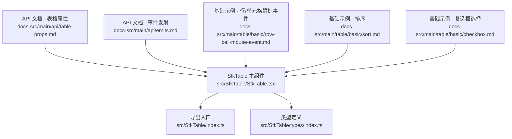
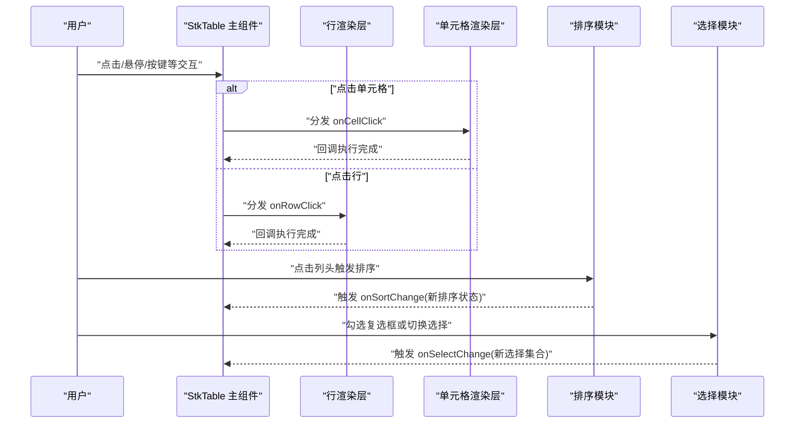
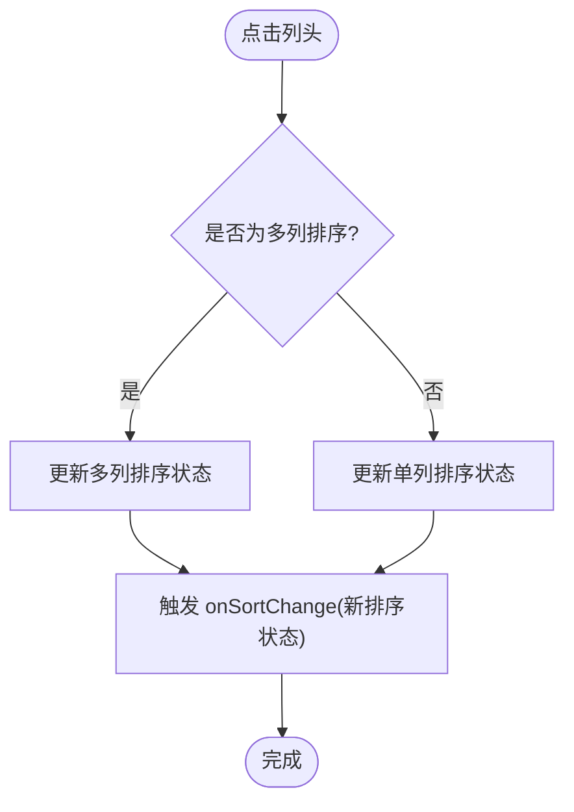
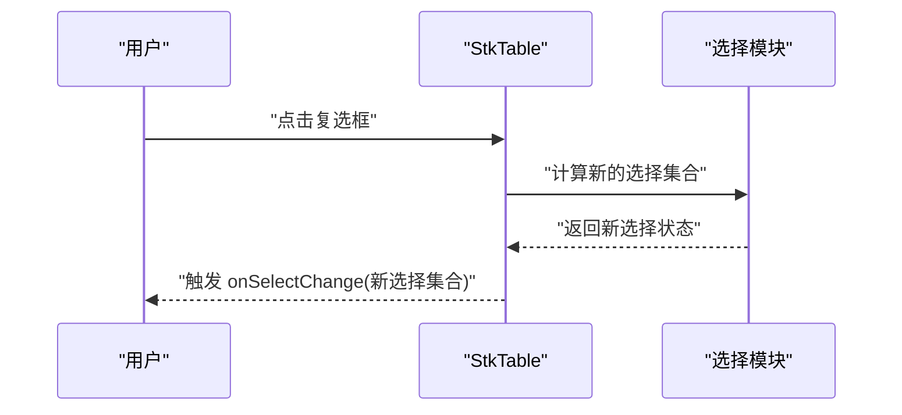
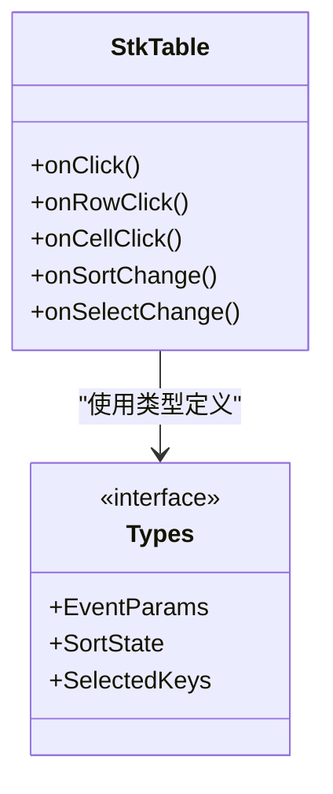

# 事件属性

<cite>
**本文引用的文件**   
- [StkTable.tsx](file://src/StkTable/StkTable.tsx)
- [index.ts](file://src/StkTable/index.ts)
- [types/index.ts](file://src/StkTable/types/index.ts)
- [table-props.md](file://docs-src/main/api/table-props.md)
- [emits.md](file://docs-src/main/api/emits.md)
- [row-cell-mouse-event.md](file://docs-src/main/table/basic/row-cell-mouse-event.md)
- [sort.md](file://docs-src/main/table/basic/sort.md)
- [checkbox.md](file://docs-src/main/table/basic/checkbox.md)
- [AreaSelection.tsx](file://docs-demo/advanced/area-selection/AreaSelection.tsx)
- [RowDrag.tsx](file://docs-demo/advanced/row-drag/RowDrag.tsx)
- [CustomSort.tsx](file://docs-demo/advanced/custom-sort/CustomSort/index.tsx)
- [DefaultSort.tsx](file://docs-demo/basic/sort/DefaultSort.tsx)
- [MultiSort.tsx](file://docs-demo/basic/sort/MultiSort.tsx)
- [Checkbox.tsx](file://docs-demo/basic/checkbox/Checkbox.tsx)
</cite>

## 目录
1. [简介](#简介)
2. [项目结构](#项目结构)
3. [核心组件与事件入口](#核心组件与事件入口)
4. [架构总览](#架构总览)
5. [详细组件分析](#详细组件分析)
6. [依赖关系分析](#依赖关系分析)
7. [性能考虑](#性能考虑)
8. [故障排查指南](#故障排查指南)
9. [结论](#结论)
10. [附录：事件参考表](#附录事件参考表)

## 简介
本章节聚焦 StkTable 的事件处理属性，系统梳理用户交互相关回调（如点击、行点击、单元格点击、排序变化、选择变化等）的触发时机、参数结构与返回值约定。同时提供事件冒泡机制说明、阻止默认行为的方法、完整示例路径与最佳实践建议，帮助开发者在复杂场景下稳定地实现交互逻辑。

## 项目结构
围绕事件属性的关键代码与文档分布如下：
- 源码入口与类型定义位于 src/StkTable 目录
- 官方 API 文档位于 docs-src/main/api 与 docs-src/main/table 目录
- 演示用例位于 docs-demo 目录，覆盖基础与高级场景

图表来源
- [StkTable.tsx](file://src/StkTable/StkTable.tsx)
- [index.ts](file://src/StkTable/index.ts)
- [types/index.ts](file://src/StkTable/types/index.ts)
- [table-props.md](file://docs-src/main/api/table-props.md)
- [emits.md](file://docs-src/main/api/emits.md)
- [row-cell-mouse-event.md](file://docs-src/main/table/basic/row-cell-mouse-event.md)
- [sort.md](file://docs-src/main/table/basic/sort.md)
- [checkbox.md](file://docs-src/main/table/basic/checkbox.md)

章节来源
- [StkTable.tsx](file://src/StkTable/StkTable.tsx)
- [index.ts](file://src/StkTable/index.ts)
- [types/index.ts](file://src/StkTable/types/index.ts)
- [table-props.md](file://docs-src/main/api/table-props.md)
- [emits.md](file://docs-src/main/api/emits.md)
- [row-cell-mouse-event.md](file://docs-src/main/table/basic/row-cell-mouse-event.md)
- [sort.md](file://docs-src/main/table/basic/sort.md)
- [checkbox.md](file://docs-src/main/table/basic/checkbox.md)

## 核心组件与事件入口
- StkTable 作为统一入口，负责接收外部传入的事件属性（如 onClick、onRowClick、onCellClick、onSortChange、onSelectChange 等），并在内部渲染各区域（表头、行、单元格等）时绑定对应处理器。
- 类型定义集中管理事件回调的参数与返回类型，确保调用方获得一致的契约。
- 文档侧通过 table-props.md 与 emits.md 明确事件语义、参数与返回值约定；基础与高级示例则展示具体用法。

章节来源
- [StkTable.tsx](file://src/StkTable/StkTable.tsx)
- [types/index.ts](file://src/StkTable/types/index.ts)
- [table-props.md](file://docs-src/main/api/table-props.md)
- [emits.md](file://docs-src/main/api/emits.md)

## 架构总览
下图展示了从用户交互到事件回调的整体流程，包括点击、行点击、单元格点击、排序与选择变化的典型路径。

图表来源
- [StkTable.tsx](file://src/StkTable/StkTable.tsx)
- [emits.md](file://docs-src/main/api/emits.md)
- [sort.md](file://docs-src/main/table/basic/sort.md)
- [checkbox.md](file://docs-src/main/table/basic/checkbox.md)

## 详细组件分析

### 点击与行/单元格点击事件
- 触发时机
  - onClick：通常由表格容器或特定区域触发，用于捕获通用点击行为。
  - onRowClick：当用户点击某一行时触发，常用于行级操作（如展开详情、跳转）。
  - onCellClick：当用户点击某个单元格时触发，常用于单元格级编辑或预览。
- 参数结构
  - 一般包含目标元素信息、行列索引、当前数据项、事件对象等，具体以类型定义为准。
- 返回值
  - 通常为 void；若需阻止后续默认行为，可在上层根据条件控制是否继续处理。
- 冒泡与阻止默认行为
  - 事件遵循 DOM 冒泡规则；如需阻止默认行为，应在对应回调中调用事件对象的相应方法（如 preventDefault），或在更高层拦截。
- 示例与参考
  - 行/单元格鼠标事件示例：[row-cell-mouse-event.md](file://docs-src/main/table/basic/row-cell-mouse-event.md)
  - 高级区域选择示例（涉及多单元格交互）：[AreaSelection.tsx](file://docs-demo/advanced/area-selection/AreaSelection.tsx)

章节来源
- [row-cell-mouse-event.md](file://docs-src/main/table/basic/row-cell-mouse-event.md)
- [AreaSelection.tsx](file://docs-demo/advanced/area-selection/AreaSelection.tsx)
- [types/index.ts](file://src/StkTable/types/index.ts)

### 排序变化事件 onSortChange
- 触发时机
  - 点击列头进行升序/降序/取消排序，或多列组合排序发生变化时触发。
- 参数结构
  - 包含当前排序字段、排序方向、多列排序数组等，具体以类型定义为准。
- 返回值
  - 通常为 void；支持本地排序或远程排序两种模式。
- 示例与参考
  - 基础排序示例：[DefaultSort.tsx](file://docs-demo/basic/sort/DefaultSort.tsx)
  - 多列排序示例：[MultiSort.tsx](file://docs-demo/basic/sort/MultiSort.tsx)
  - 自定义排序示例：[CustomSort.tsx](file://docs-demo/advanced/custom-sort/CustomSort/index.tsx)
  - 文档说明：[sort.md](file://docs-src/main/table/basic/sort.md)

图表来源
- [sort.md](file://docs-src/main/table/basic/sort.md)
- [DefaultSort.tsx](file://docs-demo/basic/sort/DefaultSort.tsx)
- [MultiSort.tsx](file://docs-demo/basic/sort/MultiSort.tsx)
- [CustomSort.tsx](file://docs-demo/advanced/custom-sort/CustomSort/index.tsx)

章节来源
- [sort.md](file://docs-src/main/table/basic/sort.md)
- [DefaultSort.tsx](file://docs-demo/basic/sort/DefaultSort.tsx)
- [MultiSort.tsx](file://docs-demo/basic/sort/MultiSort.tsx)
- [CustomSort.tsx](file://docs-demo/advanced/custom-sort/CustomSort/index.tsx)

### 选择变化事件 onSelectChange
- 触发时机
  - 勾选/取消勾选复选框、全选/反选、或通过 API 修改选择状态时触发。
- 参数结构
  - 包含当前选中行的键集合、新增/移除的行信息等，具体以类型定义为准。
- 返回值
  - 通常为 void；可结合受控与非受控模式使用。
- 示例与参考
  - 复选框选择示例：[Checkbox.tsx](file://docs-demo/basic/checkbox/Checkbox.tsx)
  - 文档说明：[checkbox.md](file://docs-src/main/table/basic/checkbox.md)

图表来源
- [checkbox.md](file://docs-src/main/table/basic/checkbox.md)
- [Checkbox.tsx](file://docs-demo/basic/checkbox/Checkbox.tsx)

章节来源
- [checkbox.md](file://docs-src/main/table/basic/checkbox.md)
- [Checkbox.tsx](file://docs-demo/basic/checkbox/Checkbox.tsx)

### 拖拽与上下文菜单等扩展事件
- 行拖拽
  - 拖拽开始、结束、放置等阶段会触发相应回调，便于实现行重排或跨列表同步。
  - 示例：[RowDrag.tsx](file://docs-demo/advanced/row-drag/RowDrag.tsx)
- 右键上下文菜单
  - 可通过事件监听与插槽配合实现自定义菜单。
  - 文档：[contextmenu.md](file://docs-src/main/other/contextmenu.md)

章节来源
- [RowDrag.tsx](file://docs-demo/advanced/row-drag/RowDrag.tsx)
- [contextmenu.md](file://docs-src/main/other/contextmenu.md)

## 依赖关系分析
- 事件属性由 StkTable 主组件接收并向下分发至行/单元格渲染层。
- 类型定义集中约束事件回调签名，保证一致性与可维护性。
- 文档与示例为使用者提供语义化说明与落地参考。

图表来源
- [StkTable.tsx](file://src/StkTable/StkTable.tsx)
- [types/index.ts](file://src/StkTable/types/index.ts)

章节来源
- [StkTable.tsx](file://src/StkTable/StkTable.tsx)
- [types/index.ts](file://src/StkTable/types/index.ts)

## 性能考虑
- 事件回调应尽量轻量，避免在高频事件（如滚动、拖拽）中执行昂贵计算。
- 对排序与选择等状态变更，建议使用不可变更新策略，减少不必要的重渲染。
- 大数据量场景下，优先使用虚拟滚动与按需渲染，降低事件处理的开销。

## 故障排查指南
- 事件未触发
  - 检查是否正确传递事件属性名称与大小写。
  - 确认被点击元素未被其他层遮挡或 pointer-events 被禁用。
- 参数不符合预期
  - 对照类型定义核对参数结构，必要时打印日志定位问题。
- 阻止默认行为无效
  - 确认在正确的回调层级调用阻止方法，避免被外层再次消费。
- 排序/选择状态不同步
  - 检查受控与非受控模式混用情况，确保状态来源唯一且更新链路清晰。

章节来源
- [emits.md](file://docs-src/main/api/emits.md)
- [types/index.ts](file://src/StkTable/types/index.ts)

## 结论
StkTable 提供了完善的事件属性体系，覆盖点击、行/单元格交互、排序与选择等常见场景。通过统一的类型定义与清晰的文档说明，开发者可以高效构建复杂的表格交互。建议在实现时遵循轻量回调、不可变更新与受控状态管理等最佳实践，以获得更好的性能与可维护性。

## 附录：事件参考表
- onClick
  - 触发时机：表格容器或指定区域点击
  - 参数：目标元素、行列信息、事件对象等（以类型定义为准）
  - 返回值：void
  - 参考：[row-cell-mouse-event.md](file://docs-src/main/table/basic/row-cell-mouse-event.md)
- onRowClick
  - 触发时机：点击行
  - 参数：行索引、行数据、事件对象等（以类型定义为准）
  - 返回值：void
  - 参考：[row-cell-mouse-event.md](file://docs-src/main/table/basic/row-cell-mouse-event.md)
- onCellClick
  - 触发时机：点击单元格
  - 参数：列索引、单元格数据、事件对象等（以类型定义为准）
  - 返回值：void
  - 参考：[row-cell-mouse-event.md](file://docs-src/main/table/basic/row-cell-mouse-event.md)
- onSortChange
  - 触发时机：排序状态变化（单列/多列）
  - 参数：排序字段、方向、多列排序数组等（以类型定义为准）
  - 返回值：void
  - 参考：[sort.md](file://docs-src/main/table/basic/sort.md)
- onSelectChange
  - 触发时机：选择状态变化（单选/多选/全选）
  - 参数：选中键集合、变更明细等（以类型定义为准）
  - 返回值：void
  - 参考：[checkbox.md](file://docs-src/main/table/basic/checkbox.md)

章节来源
- [row-cell-mouse-event.md](file://docs-src/main/table/basic/row-cell-mouse-event.md)
- [sort.md](file://docs-src/main/table/basic/sort.md)
- [checkbox.md](file://docs-src/main/table/basic/checkbox.md)
- [types/index.ts](file://src/StkTable/types/index.ts)