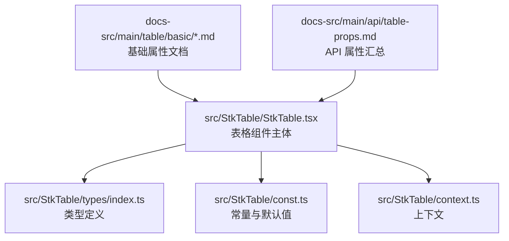
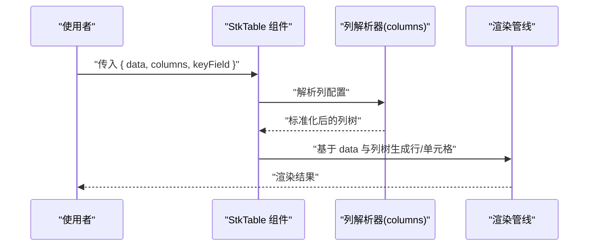
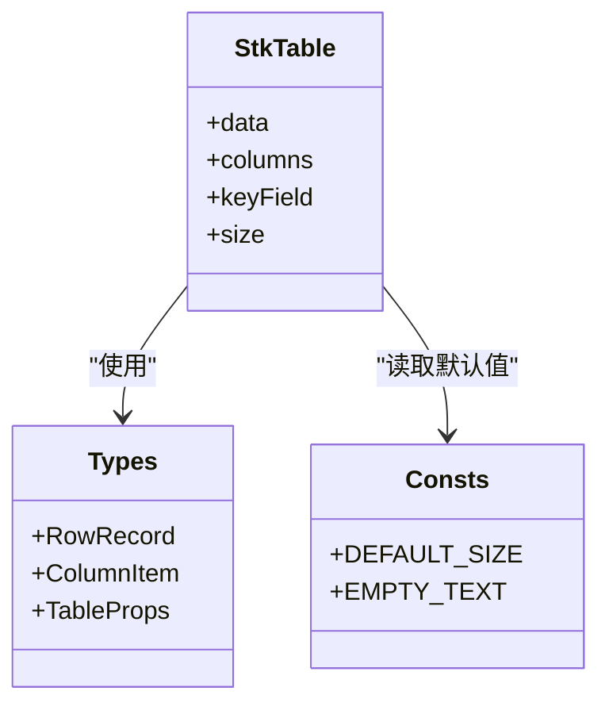

# 基础属性

<cite>
**本文引用的文件**   
- [StkTable.tsx](file://src/StkTable/StkTable.tsx)
- [index.ts](file://src/StkTable/index.ts)
- [types/index.ts](file://src/StkTable/types/index.ts)
- [const.ts](file://src/StkTable/const.ts)
- [basic.md](file://docs-src/main/table/basic/basic.md)
- [key.md](file://docs-src/main/table/basic/key.md)
- [size.md](file://docs-src/main/table/basic/size.md)
- [column-width.md](file://docs-src/main/table/basic/column-width.md)
- [empty.md](file://docs-src/main/table/basic/empty.md)
- [table-props.md](file://docs-src/main/api/table-props.md)
</cite>

## 目录
1. [简介](#简介)
2. [项目结构](#项目结构)
3. [核心组件与入口](#核心组件与入口)
4. [架构总览](#架构总览)
5. [详细组件分析](#详细组件分析)
6. [依赖关系分析](#依赖关系分析)
7. [性能考量](#性能考量)
8. [故障排查指南](#故障排查指南)
9. [结论](#结论)
10. [附录：TypeScript 类型与属性说明](#附录typescript-类型与属性说明)

## 简介
本章节聚焦 StkTable 的基础属性，围绕数据源 data、列配置 columns、主键字段 keyField 等核心必需属性展开，系统阐述其类型定义、默认值、使用方式与最佳实践。同时解释数据绑定机制与列配置的基本概念，帮助读者快速上手并稳定构建表格应用。

## 项目结构
StkTable 的核心实现位于 src/StkTable 目录，包含组件主体、类型定义、常量与上下文等；文档与示例位于 docs-src 与 docs-demo。基础属性的官方说明与示例可参考 docs-src/main/table/basic 下的对应文档。

图表来源
- [StkTable.tsx](file://src/StkTable/StkTable.tsx)
- [types/index.ts](file://src/StkTable/types/index.ts)
- [const.ts](file://src/StkTable/const.ts)
- [basic.md](file://docs-src/main/table/basic/basic.md)
- [table-props.md](file://docs-src/main/api/table-props.md)

章节来源
- [StkTable.tsx](file://src/StkTable/StkTable.tsx)
- [index.ts](file://src/StkTable/index.ts)
- [basic.md](file://docs-src/main/table/basic/basic.md)
- [table-props.md](file://docs-src/main/api/table-props.md)

## 核心组件与入口
- 组件入口：StkTable 组件在 src/StkTable/StkTable.tsx 中定义，并通过 src/StkTable/index.ts 统一导出。
- 类型定义：所有公共类型（包括 props、列配置、行记录等）集中在 src/StkTable/types/index.ts。
- 常量与默认值：部分默认行为与常量在 src/StkTable/const.ts 中维护。
- 文档与示例：基础属性使用说明与示例位于 docs-src/main/table/basic 下，API 汇总见 docs-src/main/api/table-props.md。

章节来源
- [index.ts](file://src/StkTable/index.ts)
- [StkTable.tsx](file://src/StkTable/StkTable.tsx)
- [types/index.ts](file://src/StkTable/types/index.ts)
- [const.ts](file://src/StkTable/const.ts)
- [table-props.md](file://docs-src/main/api/table-props.md)

## 架构总览
StkTable 的基础属性驱动渲染流程：data 提供行数据，columns 描述列结构与展示逻辑，keyField 标识行唯一性。三者共同决定数据绑定、排序、选择、分页、虚拟滚动等能力。

图表来源
- [StkTable.tsx](file://src/StkTable/StkTable.tsx)
- [types/index.ts](file://src/StkTable/types/index.ts)

## 详细组件分析

### 数据源 data
- 作用：提供表格的行数据集，是表格渲染的根基。
- 类型：数组类型，元素为行记录对象。具体行记录的字段由 columns 中的 dataIndex 或 field 指定。
- 默认值：未设置时为空数组，表格显示空状态。
- 使用方法：
  - 直接传入静态数组。
  - 通过响应式变量更新以触发重渲染。
  - 结合分页/筛选/排序时，确保 data 与后端返回一致。
- 注意事项：
  - 行记录需具备稳定的唯一标识（配合 keyField）。
  - 大数据量建议开启虚拟滚动以提升性能。
- 相关文档与示例：
  - 基础用法与空态处理参见 basic.md 与 empty.md。
  - API 属性汇总参见 table-props.md。

章节来源
- [basic.md](file://docs-src/main/table/basic/basic.md)
- [empty.md](file://docs-src/main/table/basic/empty.md)
- [table-props.md](file://docs-src/main/api/table-props.md)

### 列配置 columns
- 作用：声明表格的列结构、标题、对齐、宽度、排序、过滤、自定义渲染等。
- 类型：列配置数组，支持多级表头与叶子节点列。每个列项包含标题、数据字段映射、展示控制等属性。
- 默认值：未设置时不渲染任何列。
- 使用方法：
  - 通过 dataIndex/field 将列与数据字段绑定。
  - 使用 width/fixed 控制列宽与固定列。
  - 使用 sort/filter/customCell 扩展交互与展示。
- 注意事项：
  - 列顺序与层级会影响渲染与交互体验。
  - 复杂列结构建议拆分到独立文件管理。
- 相关文档与示例：
  - 列宽与自适应参见 column-width.md。
  - 多表头与合并单元格参见 multi-header.md 与 merge-cells.md。
  - API 属性汇总参见 table-props.md。

章节来源
- [column-width.md](file://docs-src/main/table/basic/column-width.md)
- [table-props.md](file://docs-src/main/api/table-props.md)

### 主键字段 keyField
- 作用：指定行数据的唯一标识字段，用于高效定位、更新与复用行实例。
- 类型：字符串，表示 data 中某行的字段名。
- 默认值：若未设置，组件可能退化为基于索引的唯一性策略（不推荐）。
- 使用方法：
  - 设置为业务主键（如 id、code）。
  - 保证该字段在所有行中唯一且稳定。
- 注意事项：
  - 缺失或不稳定的 keyField 会导致性能下降与状态错乱。
  - 与 tree 模式、选择、展开等功能紧密相关。
- 相关文档与示例：
  - 主键与唯一性说明参见 key.md。
  - API 属性汇总参见 table-props.md。

章节来源
- [key.md](file://docs-src/main/table/basic/key.md)
- [table-props.md](file://docs-src/main/api/table-props.md)

### 尺寸与布局 size
- 作用：控制表格整体尺寸与密度，影响行高、字体与间距。
- 类型：枚举或字符串，常见取值包括默认、紧凑、宽松等。
- 默认值：通常为默认尺寸。
- 使用方法：根据界面风格与数据密度选择合适的 size。
- 相关文档与示例：参见 size.md。

章节来源
- [size.md](file://docs-src/main/table/basic/size.md)

## 依赖关系分析
StkTable 的基础属性与其内部模块的依赖关系如下：

图表来源
- [StkTable.tsx](file://src/StkTable/StkTable.tsx)
- [types/index.ts](file://src/StkTable/types/index.ts)
- [const.ts](file://src/StkTable/const.ts)

章节来源
- [StkTable.tsx](file://src/StkTable/StkTable.tsx)
- [types/index.ts](file://src/StkTable/types/index.ts)
- [const.ts](file://src/StkTable/const.ts)

## 性能考量
- 大数据集：启用虚拟滚动与合理设置 rowHeight，避免一次性渲染过多 DOM。
- 列计算：减少复杂的列计算函数，必要时缓存结果。
- 唯一键：务必设置稳定的 keyField，降低 Diff 成本。
- 内存占用：及时释放不再使用的数据引用，避免闭包持有大对象。

[本节为通用指导，无需源码引用]

## 故障排查指南
- 无数据或空白表格：检查 data 是否为空数组或未正确传入；确认 columns 是否定义了可见列。
- 行无法选中/展开：确认 keyField 是否存在且唯一。
- 列错位或宽度异常：检查列宽配置与容器尺寸，必要时使用自适应或固定宽度。
- 空态文案不生效：确认空态文案配置与插槽覆盖情况。

章节来源
- [empty.md](file://docs-src/main/table/basic/empty.md)
- [key.md](file://docs-src/main/table/basic/key.md)
- [column-width.md](file://docs-src/main/table/basic/column-width.md)

## 结论
掌握 data、columns、keyField 三大基础属性是正确使用 StkTable 的关键。遵循类型约束、保持数据稳定、合理配置列与尺寸，可在大多数场景下获得良好的表现与可维护性。

[本节为总结，无需源码引用]

## 附录：TypeScript 类型与属性说明
以下为 StkTable 基础属性的 TypeScript 类型与说明摘要（以实际类型定义为准）：

- TableProps
  - data: RowRecord[]
    - 说明：表格数据源，行记录数组。
    - 默认值：[]
  - columns: ColumnItem[]
    - 说明：列配置数组，支持多级表头与叶子列。
    - 默认值：[]
  - keyField: string
    - 说明：行唯一标识字段名。
    - 默认值：未设置时回退策略（不推荐）
  - size: string
    - 说明：表格尺寸与密度。
    - 默认值：默认尺寸

- RowRecord
  - 说明：行记录对象，字段由 columns 的 dataIndex/field 指定。

- ColumnItem
  - 说明：列配置项，包含标题、数据字段映射、宽度、对齐、排序、过滤、自定义渲染等属性。

章节来源
- [types/index.ts](file://src/StkTable/types/index.ts)
- [table-props.md](file://docs-src/main/api/table-props.md)