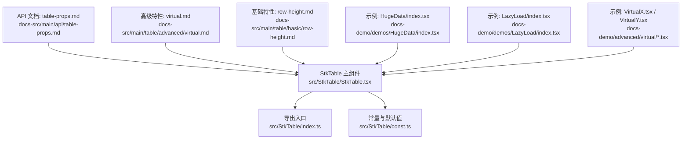
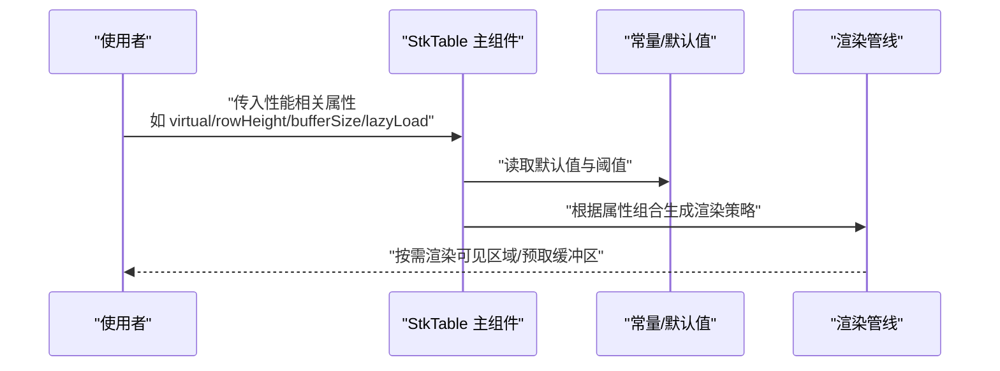
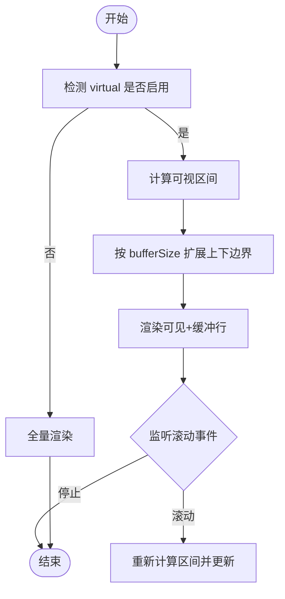
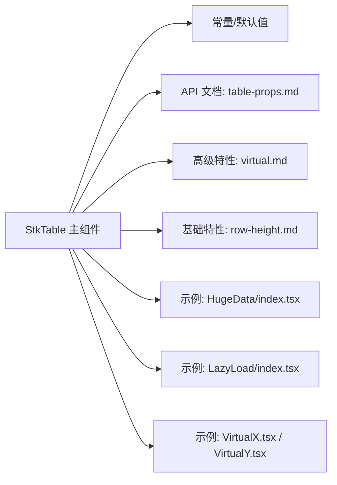

# 性能属性

<cite>
**本文引用的文件**   
- [StkTable.tsx](file://src/StkTable/StkTable.tsx)
- [index.ts](file://src/StkTable/index.ts)
- [const.ts](file://src/StkTable/const.ts)
- [table-props.md](file://docs-src/main/api/table-props.md)
- [virtual.md](file://docs-src/main/table/advanced/virtual.md)
- [row-height.md](file://docs-src/main/table/basic/row-height.md)
- [auto-height-virtual.md](file://docs-src/main/table/advanced/auto-height-virtual.md)
- [HugeData/index.tsx](file://docs-demo/demos/HugeData/index.tsx)
- [LazyLoad/index.tsx](file://docs-demo/demos/LazyLoad/index.tsx)
- [VirtualX.tsx](file://docs-demo/advanced/virtual/VirtualX.tsx)
- [VirtualY.tsx](file://docs-demo/advanced/virtual/VirtualY.tsx)
</cite>

## 目录
1. [简介](#简介)
2. [项目结构](#项目结构)
3. [核心组件](#核心组件)
4. [架构总览](#架构总览)
5. [详细组件分析](#详细组件分析)
6. [依赖分析](#依赖分析)
7. [性能考虑](#性能考虑)
8. [故障排查指南](#故障排查指南)
9. [结论](#结论)
10. [附录](#附录)

## 简介
本章节聚焦 StkTable 的性能优化相关属性与最佳实践，围绕虚拟滚动、行高策略、缓冲区大小、懒加载等关键能力展开。文档旨在帮助开发者在大数据量场景下获得流畅的渲染体验，并提供可操作的监控与调优建议。

## 项目结构
与性能属性相关的源码与示例分布如下：
- 核心实现位于 src/StkTable 目录，包含主组件、常量、类型与上下文等。
- 文档说明位于 docs-src/main 下的 API 与高级特性页面。
- 演示样例位于 docs-demo，涵盖虚拟滚动、大数据集与懒加载等典型用法。

图表来源
- [StkTable.tsx](file://src/StkTable/StkTable.tsx)
- [index.ts](file://src/StkTable/index.ts)
- [const.ts](file://src/StkTable/const.ts)
- [table-props.md](file://docs-src/main/api/table-props.md)
- [virtual.md](file://docs-src/main/table/advanced/virtual.md)
- [row-height.md](file://docs-src/main/table/basic/row-height.md)
- [HugeData/index.tsx](file://docs-demo/demos/HugeData/index.tsx)
- [LazyLoad/index.tsx](file://docs-demo/demos/LazyLoad/index.tsx)
- [VirtualX.tsx](file://docs-demo/advanced/virtual/VirtualX.tsx)
- [VirtualY.tsx](file://docs-demo/advanced/virtual/VirtualY.tsx)

章节来源
- [StkTable.tsx](file://src/StkTable/StkTable.tsx)
- [index.ts](file://src/StkTable/index.ts)
- [const.ts](file://src/StkTable/const.ts)
- [table-props.md](file://docs-src/main/api/table-props.md)
- [virtual.md](file://docs-src/main/table/advanced/virtual.md)
- [row-height.md](file://docs-src/main/table/basic/row-height.md)
- [HugeData/index.tsx](file://docs-demo/demos/HugeData/index.tsx)
- [LazyLoad/index.tsx](file://docs-demo/demos/LazyLoad/index.tsx)
- [VirtualX.tsx](file://docs-demo/advanced/virtual/VirtualX.tsx)
- [VirtualY.tsx](file://docs-demo/advanced/virtual/VirtualY.tsx)

## 核心组件
- StkTable 主组件负责接收并处理表格配置项，包括与性能相关的属性（如虚拟滚动开关、行高策略、缓冲区大小、懒加载等），并在内部协调渲染管线。
- 常量模块提供默认值与阈值，影响性能行为（例如是否启用虚拟滚动、默认行高、缓冲行数等）。
- 文档与示例展示了不同数据规模与交互模式下的推荐配置。

章节来源
- [StkTable.tsx](file://src/StkTable/StkTable.tsx)
- [const.ts](file://src/StkTable/const.ts)
- [table-props.md](file://docs-src/main/api/table-props.md)

## 架构总览
下图展示性能相关属性在主组件中的流转关系：外部传入的属性进入主组件后，由常量与内部逻辑共同决定渲染策略（虚拟滚动、行高计算、缓冲区范围、懒加载触发点等）。

图表来源
- [StkTable.tsx](file://src/StkTable/StkTable.tsx)
- [const.ts](file://src/StkTable/const.ts)

## 详细组件分析

### 虚拟滚动（virtual）
- 原理概述
  - 仅渲染可视区域内的行，结合滚动事件动态更新可见区间。
  - 通过“缓冲区”在可视区前后额外渲染若干行，减少滚动时的闪烁与重排。
  - 行高固定或自适应会影响计算复杂度；固定行高更高效。
- 关键属性
  - virtual：开启/关闭虚拟滚动。
  - bufferSize：可视区外预渲染的行数，平衡内存与流畅度。
  - rowHeight：行高策略（固定数值或函数），对虚拟滚动的命中率与布局稳定性至关重要。
- 适用场景
  - 大数据量纵向滚动（万级及以上）。
  - 复杂单元格内容较多时，配合懒加载进一步降低首屏压力。
- 参考示例
  - 横向与纵向虚拟滚动示例见 docs-demo/advanced/virtual。

图表来源
- [virtual.md](file://docs-src/main/table/advanced/virtual.md)
- [VirtualX.tsx](file://docs-demo/advanced/virtual/VirtualX.tsx)
- [VirtualY.tsx](file://docs-demo/advanced/virtual/VirtualY.tsx)

章节来源
- [virtual.md](file://docs-src/main/table/advanced/virtual.md)
- [VirtualX.tsx](file://docs-demo/advanced/virtual/VirtualX.tsx)
- [VirtualY.tsx](file://docs-demo/advanced/virtual/VirtualY.tsx)

### 行高（rowHeight）
- 作用
  - 固定行高能显著提升虚拟滚动性能与布局稳定性。
  - 自适应行高需配合缓存或预估高度，避免频繁测量导致的抖动。
- 配置要点
  - 优先使用固定数值；若必须自适应，建议使用稳定估算策略。
  - 与 auto-height-virtual 特性协同使用时，注意高度变化带来的重排成本。
- 参考文档
  - 基础行高说明见 docs-src/main/table/basic/row-height.md。
  - 自动高度与虚拟滚动协同见 docs-src/main/table/advanced/auto-height-virtual.md。

章节来源
- [row-height.md](file://docs-src/main/table/basic/row-height.md)
- [auto-height-virtual.md](file://docs-src/main/table/advanced/auto-height-virtual.md)

### 缓冲区大小（bufferSize）
- 作用
  - 控制可视区外预渲染的行数，提升滚动顺滑度，同时增加内存占用。
- 调优建议
  - 小屏幕或低端设备：适当减小 buffer，降低内存峰值。
  - 大屏幕或高性能设备：适度增大 buffer，减少滚动卡顿。
- 与 rowHeight 的关系
  - 固定行高下，buffer 的计算更精确；自适应行高可能引入误差，需要更大 buffer 补偿。

章节来源
- [StkTable.tsx](file://src/StkTable/StkTable.tsx)
- [const.ts](file://src/StkTable/const.ts)

### 懒加载（lazyLoad）
- 作用
  - 延迟加载复杂单元格或远程数据，降低首屏渲染时间。
- 适用场景
  - 单元格内包含图片、富文本、重型组件或需要网络请求的数据。
- 与虚拟滚动协同
  - 先通过虚拟滚动减少 DOM 节点数量，再对每个可见单元格按需加载，最大化首屏性能。
- 参考示例
  - 懒加载示例见 docs-demo/demos/LazyLoad/index.tsx。

章节来源
- [LazyLoad/index.tsx](file://docs-demo/demos/LazyLoad/index.tsx)

### 大数据场景综合方案（HugeData）
- 目标
  - 在万级甚至十万级数据下保持流畅交互。
- 策略
  - 启用虚拟滚动 + 固定行高 + 合理 bufferSize。
  - 对复杂单元格启用懒加载。
  - 分页/增量加载远端数据，避免一次性注入全部数据。
- 参考示例
  - 大数据示例见 docs-demo/demos/HugeData/index.tsx。

章节来源
- [HugeData/index.tsx](file://docs-demo/demos/HugeData/index.tsx)

## 依赖分析
- 主组件依赖常量模块获取默认值与阈值，从而决定性能路径。
- 文档与示例作为外部输入，指导用户正确配置性能属性。
- 各示例之间相互独立，分别验证不同性能特性的组合效果。

图表来源
- [StkTable.tsx](file://src/StkTable/StkTable.tsx)
- [const.ts](file://src/StkTable/const.ts)
- [table-props.md](file://docs-src/main/api/table-props.md)
- [virtual.md](file://docs-src/main/table/advanced/virtual.md)
- [row-height.md](file://docs-src/main/table/basic/row-height.md)
- [HugeData/index.tsx](file://docs-demo/demos/HugeData/index.tsx)
- [LazyLoad/index.tsx](file://docs-demo/demos/LazyLoad/index.tsx)
- [VirtualX.tsx](file://docs-demo/advanced/virtual/VirtualX.tsx)
- [VirtualY.tsx](file://docs-demo/advanced/virtual/VirtualY.tsx)

章节来源
- [StkTable.tsx](file://src/StkTable/StkTable.tsx)
- [const.ts](file://src/StkTable/const.ts)
- [table-props.md](file://docs-src/main/api/table-props.md)
- [virtual.md](file://docs-src/main/table/advanced/virtual.md)
- [row-height.md](file://docs-src/main/table/basic/row-height.md)
- [HugeData/index.tsx](file://docs-demo/demos/HugeData/index.tsx)
- [LazyLoad/index.tsx](file://docs-demo/demos/LazyLoad/index.tsx)
- [VirtualX.tsx](file://docs-demo/advanced/virtual/VirtualX.tsx)
- [VirtualY.tsx](file://docs-demo/advanced/virtual/VirtualY.tsx)

## 性能考虑
- 数据规模与推荐配置
  - 小规模（数百行以内）：可关闭虚拟滚动，简化实现。
  - 中等规模（数千行）：启用虚拟滚动，固定行高，bufferSize 适中。
  - 大规模（万级以上）：虚拟滚动 + 固定行高 + 较大 bufferSize + 懒加载 + 远端分页。
- 行高策略
  - 优先固定行高；若必须自适应，尽量使用稳定估算，避免频繁测量。
- 缓冲区大小
  - 根据设备性能与屏幕尺寸调整，兼顾内存与流畅度。
- 懒加载
  - 针对复杂单元格或远程数据启用，显著降低首屏耗时。
- 监控指标
  - 首屏渲染时间、滚动帧率、内存占用、DOM 节点数量。
- 调优步骤
  - 基线测量 → 启用虚拟滚动 → 固定行高 → 调整 bufferSize → 启用懒加载 → 远端分页 → 复测对比。

[本节为通用指导，不直接分析具体文件]

## 故障排查指南
- 现象：滚动卡顿或闪烁
  - 检查是否启用了虚拟滚动且行高固定。
  - 适当增大 bufferSize，观察改善情况。
- 现象：首屏慢
  - 确认是否对复杂单元格启用了懒加载。
  - 评估是否一次性注入了过多数据，考虑分页或增量加载。
- 现象：内存占用过高
  - 减小 bufferSize，限制一次性渲染的行数。
  - 确保未持有不必要的引用导致无法回收。
- 现象：自动高度导致抖动
  - 优先固定行高；若必须自适应，采用稳定的高度估算策略。

章节来源
- [StkTable.tsx](file://src/StkTable/StkTable.tsx)
- [const.ts](file://src/StkTable/const.ts)
- [virtual.md](file://docs-src/main/table/advanced/virtual.md)
- [row-height.md](file://docs-src/main/table/basic/row-height.md)
- [LazyLoad/index.tsx](file://docs-demo/demos/LazyLoad/index.tsx)
- [HugeData/index.tsx](file://docs-demo/demos/HugeData/index.tsx)

## 结论
通过合理配置虚拟滚动、行高策略、缓冲区大小与懒加载，并结合远端分页与性能监控，可在不同数据规模下获得稳定流畅的表格体验。建议在上线前进行多设备与多数据量的回归测试，持续优化用户体验。

[本节为总结性内容，不直接分析具体文件]

## 附录
- 快速定位
  - 主组件与常量：src/StkTable/StkTable.tsx、src/StkTable/const.ts
  - 文档说明：docs-src/main/api/table-props.md、docs-src/main/table/advanced/virtual.md、docs-src/main/table/basic/row-height.md
  - 示例代码：docs-demo/demos/HugeData/index.tsx、docs-demo/demos/LazyLoad/index.tsx、docs-demo/advanced/virtual/VirtualX.tsx、docs-demo/advanced/virtual/VirtualY.tsx

章节来源
- [StkTable.tsx](file://src/StkTable/StkTable.tsx)
- [const.ts](file://src/StkTable/const.ts)
- [table-props.md](file://docs-src/main/api/table-props.md)
- [virtual.md](file://docs-src/main/table/advanced/virtual.md)
- [row-height.md](file://docs-src/main/table/basic/row-height.md)
- [HugeData/index.tsx](file://docs-demo/demos/HugeData/index.tsx)
- [LazyLoad/index.tsx](file://docs-demo/demos/LazyLoad/index.tsx)
- [VirtualX.tsx](file://docs-demo/advanced/virtual/VirtualX.tsx)
- [VirtualY.tsx](file://docs-demo/advanced/virtual/VirtualY.tsx)