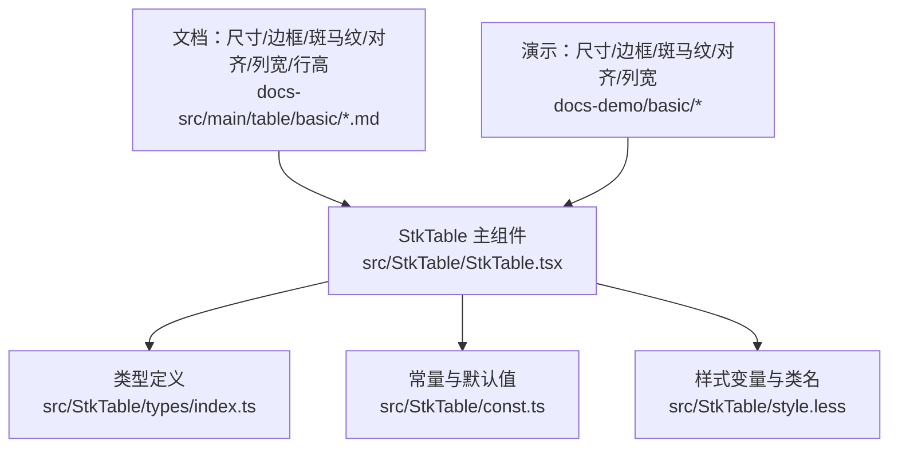
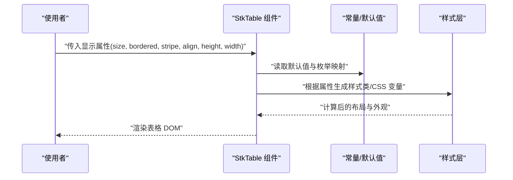
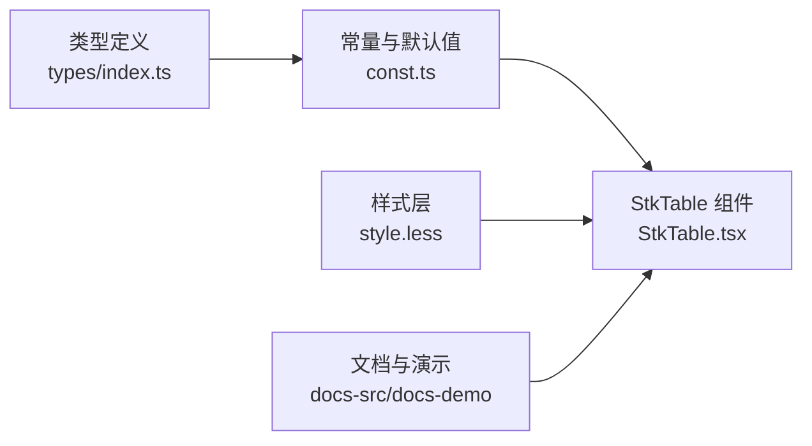

# 显示属性

<cite>
**本文引用的文件**   
- [src/StkTable/StkTable.tsx](file://src/StkTable/StkTable.tsx)
- [src/StkTable/types/index.ts](file://src/StkTable/types/index.ts)
- [src/StkTable/const.ts](file://src/StkTable/const.ts)
- [src/StkTable/style.less](file://src/StkTable/style.less)
- [docs-src/main/table/basic/size.md](file://docs-src/main/table/basic/size.md)
- [docs-src/main/table/basic/bordered.md](file://docs-src/main/table/basic/bordered.md)
- [docs-src/main/table/basic/stripe.md](file://docs-src/main/table/basic/stripe.md)
- [docs-src/main/table/basic/align.md](file://docs-src/main/table/basic/align.md)
- [docs-src/main/table/basic/column-width.md](file://docs-src/main/table/basic/column-width.md)
- [docs-src/main/table/basic/row-height.md](file://docs-src/main/table/basic/row-height.md)
- [docs-demo/basic/size/Default.tsx](file://docs-demo/basic/size/Default.tsx)
- [docs-demo/basic/size/Flex.tsx](file://docs-demo/basic/size/Flex.tsx)
- [docs-demo/basic/border/Default.tsx](file://docs-demo/basic/border/Default.tsx)
- [docs-demo/basic/stripe/Stripe.tsx](file://docs-demo/basic/stripe/Stripe.tsx)
- [docs-demo/basic/align/Align.tsx](file://docs-demo/basic/align/Align.tsx)
- [docs-demo/basic/column-width/ColumnWidth.tsx](file://docs-demo/basic/column-width/ColumnWidth.tsx)
</cite>

## 目录
1. [简介](#简介)
2. [项目结构](#项目结构)
3. [核心组件](#核心组件)
4. [架构总览](#架构总览)
5. [详细组件分析](#详细组件分析)
6. [依赖分析](#依赖分析)
7. [性能考虑](#性能考虑)
8. [故障排查指南](#故障排查指南)
9. [结论](#结论)
10. [附录](#附录)

## 简介
本章节聚焦 StkTable 的“显示相关属性”，系统梳理控制表格外观与布局的属性，包括 size（尺寸）、bordered（边框）、stripe（斑马纹）、align（对齐方式）、height（高度）、width（宽度）等。文档将提供每个属性的类型说明、可选值、使用示例路径、不同显示模式的效果与适用场景，并补充响应式设计与样式定制的最佳实践，帮助读者快速掌握如何以声明式配置实现一致的表格视觉体验。

## 项目结构
围绕“显示属性”的相关代码与文档主要分布在以下位置：
- 源码实现与类型定义：src/StkTable 下的主组件、类型、常量与样式
- 文档与演示：docs-src 中的 API 文档与 docs-demo 中的基础示例

图表来源
- [src/StkTable/StkTable.tsx](file://src/StkTable/StkTable.tsx)
- [src/StkTable/types/index.ts](file://src/StkTable/types/index.ts)
- [src/StkTable/const.ts](file://src/StkTable/const.ts)
- [src/StkTable/style.less](file://src/StkTable/style.less)
- [docs-src/main/table/basic/size.md](file://docs-src/main/table/basic/size.md)
- [docs-src/main/table/basic/bordered.md](file://docs-src/main/table/basic/bordered.md)
- [docs-src/main/table/basic/stripe.md](file://docs-src/main/table/basic/stripe.md)
- [docs-src/main/table/basic/align.md](file://docs-src/main/table/basic/align.md)
- [docs-src/main/table/basic/column-width.md](file://docs-src/main/table/basic/column-width.md)
- [docs-src/main/table/basic/row-height.md](file://docs-src/main/table/basic/row-height.md)
- [docs-demo/basic/size/Default.tsx](file://docs-demo/basic/size/Default.tsx)
- [docs-demo/basic/size/Flex.tsx](file://docs-demo/basic/size/Flex.tsx)
- [docs-demo/basic/border/Default.tsx](file://docs-demo/basic/border/Default.tsx)
- [docs-demo/basic/stripe/Stripe.tsx](file://docs-demo/basic/stripe/Stripe.tsx)
- [docs-demo/basic/align/Align.tsx](file://docs-demo/basic/align/Align.tsx)
- [docs-demo/basic/column-width/ColumnWidth.tsx](file://docs-demo/basic/column-width/ColumnWidth.tsx)

章节来源
- [src/StkTable/StkTable.tsx](file://src/StkTable/StkTable.tsx)
- [src/StkTable/types/index.ts](file://src/StkTable/types/index.ts)
- [src/StkTable/const.ts](file://src/StkTable/const.ts)
- [src/StkTable/style.less](file://src/StkTable/style.less)
- [docs-src/main/table/basic/size.md](file://docs-src/main/table/basic/size.md)
- [docs-src/main/table/basic/bordered.md](file://docs-src/main/table/basic/bordered.md)
- [docs-src/main/table/basic/stripe.md](file://docs-src/main/table/basic/stripe.md)
- [docs-src/main/table/basic/align.md](file://docs-src/main/table/basic/align.md)
- [docs-src/main/table/basic/column-width.md](file://docs-src/main/table/basic/column-width.md)
- [docs-src/main/table/basic/row-height.md](file://docs-src/main/table/basic/row-height.md)

## 核心组件
StkTable 通过一组显式的显示属性控制表格的外观与布局。这些属性在类型定义中集中声明，并在组件内部根据传入值渲染不同的样式与行为。与显示相关的常用属性包括：
- size：控制整体字号与间距档位
- bordered：是否显示外边框
- stripe：是否启用斑马纹
- align：单元格内容对齐方式
- height：表格容器高度
- width：表格容器宽度
- rowHeight：单行高度（与 height 配合影响布局）
- columnWidth：列宽策略（与 width 共同决定列分布）

上述属性在文档与演示中均有对应页面与示例，便于快速上手与对照验证。

章节来源
- [src/StkTable/types/index.ts](file://src/StkTable/types/index.ts)
- [src/StkTable/const.ts](file://src/StkTable/const.ts)
- [docs-src/main/table/basic/size.md](file://docs-src/main/table/basic/size.md)
- [docs-src/main/table/basic/bordered.md](file://docs-src/main/table/basic/bordered.md)
- [docs-src/main/table/basic/stripe.md](file://docs-src/main/table/basic/stripe.md)
- [docs-src/main/table/basic/align.md](file://docs-src/main/table/basic/align.md)
- [docs-src/main/table/basic/column-width.md](file://docs-src/main/table/basic/column-width.md)
- [docs-src/main/table/basic/row-height.md](file://docs-src/main/table/basic/row-height.md)

## 架构总览
下图展示了“显示属性”从声明到渲染的关键链路：组件接收 props → 解析类型与默认值 → 应用样式类与 CSS 变量 → 输出最终 DOM 结构与样式。

图表来源
- [src/StkTable/StkTable.tsx](file://src/StkTable/StkTable.tsx)
- [src/StkTable/const.ts](file://src/StkTable/const.ts)
- [src/StkTable/style.less](file://src/StkTable/style.less)

## 详细组件分析

### size（尺寸）
- 作用：统一控制表格字号、行高与内边距的视觉档位，常用于适配不同信息密度与阅读场景。
- 类型与可选值：参考类型定义与文档；常见档位包含默认档与紧凑档（具体取值以类型与文档为准）。
- 使用示例：
  - 基础用法：[docs-demo/basic/size/Default.tsx](file://docs-demo/basic/size/Default.tsx)
  - 弹性布局结合：[docs-demo/basic/size/Flex.tsx](file://docs-demo/basic/size/Flex.tsx)
- 效果与适用场景：
  - 默认档：适合常规数据浏览，可读性佳
  - 紧凑档：适合高密度数据展示或空间受限的侧栏/面板
- 响应式建议：在小屏设备上优先使用紧凑档，提升信息密度与滚动效率。

章节来源
- [src/StkTable/types/index.ts](file://src/StkTable/types/index.ts)
- [src/StkTable/const.ts](file://src/StkTable/const.ts)
- [docs-src/main/table/basic/size.md](file://docs-src/main/table/basic/size.md)
- [docs-demo/basic/size/Default.tsx](file://docs-demo/basic/size/Default.tsx)
- [docs-demo/basic/size/Flex.tsx](file://docs-demo/basic/size/Flex.tsx)

### bordered（边框）
- 作用：控制表格是否显示外边框，影响整体视觉边界感。
- 类型与可选值：布尔类型；true 显示边框，false 隐藏边框。
- 使用示例：
  - 基础用法：[docs-demo/basic/border/Default.tsx](file://docs-demo/basic/border/Default.tsx)
- 效果与适用场景：
  - 开启边框：强调表格区域边界，适合卡片式布局或需要明确分割的场景
  - 关闭边框：更轻量、现代风格，适合嵌入复杂页面或与其他 UI 元素融合
- 样式定制：可通过主题变量覆盖边框颜色与粗细，保持与设计系统一致。

章节来源
- [src/StkTable/types/index.ts](file://src/StkTable/types/index.ts)
- [src/StkTable/const.ts](file://src/StkTable/const.ts)
- [docs-src/main/table/basic/bordered.md](file://docs-src/main/table/basic/bordered.md)
- [docs-demo/basic/border/Default.tsx](file://docs-demo/basic/border/Default.tsx)

### stripe（斑马纹）
- 作用：为奇偶行交替着色，提高长列表的可读性与定位能力。
- 类型与可选值：布尔类型；true 启用，false 禁用。
- 使用示例：
  - 基础用法：[docs-demo/basic/stripe/Stripe.tsx](file://docs-demo/basic/stripe/Stripe.tsx)
- 效果与适用场景：
  - 推荐用于行数较多、无固定行高的数据表，有助于视线追踪
  - 若每行内容差异较大或存在合并单元格，可酌情关闭以避免视觉干扰
- 样式定制：可通过主题变量调整斑马纹背景色，确保对比度符合无障碍要求。

章节来源
- [src/StkTable/types/index.ts](file://src/StkTable/types/index.ts)
- [src/StkTable/const.ts](file://src/StkTable/const.ts)
- [docs-src/main/table/basic/stripe.md](file://docs-src/main/table/basic/stripe.md)
- [docs-demo/basic/stripe/Stripe.tsx](file://docs-demo/basic/stripe/Stripe.tsx)

### align（对齐方式）
- 作用：控制单元格内容的水平对齐，提升数据的可读性与一致性。
- 类型与可选值：字符串枚举；常见值包含左对齐、居中、右对齐（具体取值以类型与文档为准）。
- 使用示例：
  - 基础用法：[docs-demo/basic/align/Align.tsx](file://docs-demo/basic/align/Align.tsx)
- 效果与适用场景：
  - 文本型字段：默认左对齐
  - 数值型字段：推荐右对齐，便于纵向比较
  - 操作按钮/图标：居中对齐更美观
- 注意事项：当列内容长度变化大时，避免频繁切换对齐导致抖动。

章节来源
- [src/StkTable/types/index.ts](file://src/StkTable/types/index.ts)
- [src/StkTable/const.ts](file://src/StkTable/const.ts)
- [docs-src/main/table/basic/align.md](file://docs-src/main/table/basic/align.md)
- [docs-demo/basic/align/Align.tsx](file://docs-demo/basic/align/Align.tsx)

### height（高度）与 rowHeight（行高）
- height（表格高度）
  - 作用：设置表格可视区域高度，常用于固定高度容器内的分页或虚拟滚动场景。
  - 类型与可选值：数字或带单位的字符串；支持 px、vh、% 等（以实际实现为准）。
  - 使用示例：见行高与列宽相关文档与演示。
  - 效果与适用场景：
    - 固定高度：利于与页面其他区域协同布局
    - 自适应高度：适合内容量不确定的场景
- rowHeight（行高）
  - 作用：控制单行高度，影响整体高度与滚动性能。
  - 类型与可选值：数字或带单位的字符串；可与 size 联动。
  - 使用示例：参考行高文档与演示。
  - 效果与适用场景：
    - 固定行高：有利于虚拟滚动与性能优化
    - 动态行高：适合富文本或多行内容，但需关注性能
- 组合建议：
  - 大数据量场景优先固定 rowHeight 并结合虚拟滚动
  - 小数据量且内容多变时可放宽行高限制

章节来源
- [src/StkTable/types/index.ts](file://src/StkTable/types/index.ts)
- [src/StkTable/const.ts](file://src/StkTable/const.ts)
- [docs-src/main/table/basic/row-height.md](file://docs-src/main/table/basic/row-height.md)

### width（宽度）与 columnWidth（列宽）
- width（表格宽度）
  - 作用：设置表格整体宽度，常用于占满父容器或固定宽度布局。
  - 类型与可选值：数字或带单位的字符串；支持 px、vw、% 等（以实际实现为准）。
  - 使用示例：参考列宽文档与演示。
- columnWidth（列宽策略）
  - 作用：控制各列宽度分配，支持固定列宽、自适应、按比例等多种策略。
  - 类型与可选值：对象或数组形式，具体键名与规则以类型与文档为准。
  - 使用示例：
    - 列宽配置：[docs-demo/basic/column-width/ColumnWidth.tsx](file://docs-demo/basic/column-width/ColumnWidth.tsx)
- 效果与适用场景：
  - 固定列宽：适合关键指标列，保证稳定布局
  - 自适应列宽：适合内容长度波动较大的文本列
  - 按比例分配：适合多列并列且希望均衡展示的场景
- 响应式建议：
  - 在小屏设备下优先隐藏次要列或使用横向滚动
  - 对关键列设置最小宽度，避免文字折行过多

章节来源
- [src/StkTable/types/index.ts](file://src/StkTable/types/index.ts)
- [src/StkTable/const.ts](file://src/StkTable/const.ts)
- [docs-src/main/table/basic/column-width.md](file://docs-src/main/table/basic/column-width.md)
- [docs-demo/basic/column-width/ColumnWidth.tsx](file://docs-demo/basic/column-width/ColumnWidth.tsx)

### 显示模式与最佳实践
- 显示模式选择
  - 紧凑模式（size=compact）+ 关闭边框 + 适度斑马纹：适合后台管理系统的密集数据区
  - 默认模式（size=default）+ 开启边框 + 斑马纹：适合对外展示的数据看板
  - 自定义模式：通过主题变量与列级配置精细调优
- 响应式设计要点
  - 使用 vw/% 作为 width 单位，使表格随视口缩放
  - 在移动端优先展示关键列，其余列通过横向滚动查看
  - 固定行高以提升滚动性能，必要时结合虚拟滚动
- 样式定制建议
  - 优先通过主题变量覆盖颜色、边框、斑马纹等全局样式
  - 谨慎使用全局 CSS 覆盖，避免破坏组件内部结构
  - 利用列级 align 与 columnWidth 进行局部微调，减少全局样式污染

章节来源
- [src/StkTable/style.less](file://src/StkTable/style.less)
- [docs-src/main/table/basic/size.md](file://docs-src/main/table/basic/size.md)
- [docs-src/main/table/basic/bordered.md](file://docs-src/main/table/basic/bordered.md)
- [docs-src/main/table/basic/stripe.md](file://docs-src/main/table/basic/stripe.md)
- [docs-src/main/table/basic/align.md](file://docs-src/main/table/basic/align.md)
- [docs-src/main/table/basic/column-width.md](file://docs-src/main/table/basic/column-width.md)
- [docs-src/main/table/basic/row-height.md](file://docs-src/main/table/basic/row-height.md)

## 依赖分析
显示属性的生效依赖于类型定义、常量映射与样式层的协同。下图展示了它们之间的依赖关系。

图表来源
- [src/StkTable/types/index.ts](file://src/StkTable/types/index.ts)
- [src/StkTable/const.ts](file://src/StkTable/const.ts)
- [src/StkTable/StkTable.tsx](file://src/StkTable/StkTable.tsx)
- [src/StkTable/style.less](file://src/StkTable/style.less)
- [docs-src/main/table/basic/size.md](file://docs-src/main/table/basic/size.md)
- [docs-src/main/table/basic/bordered.md](file://docs-src/main/table/basic/bordered.md)
- [docs-src/main/table/basic/stripe.md](file://docs-src/main/table/basic/stripe.md)
- [docs-src/main/table/basic/align.md](file://docs-src/main/table/basic/align.md)
- [docs-src/main/table/basic/column-width.md](file://docs-src/main/table/basic/column-width.md)
- [docs-src/main/table/basic/row-height.md](file://docs-src/main/table/basic/row-height.md)

## 性能考虑
- 固定行高与固定高度：在大数据量场景下显著提升滚动性能
- 合理列宽策略：避免频繁重排与重绘，减少布局抖动
- 斑马纹与边框：在超大数据集上可能带来额外绘制开销，可酌情关闭
- 虚拟滚动：结合固定行高与固定高度，获得更佳的用户体验

## 故障排查指南
- 表格高度异常
  - 检查是否设置了固定 height 与 rowHeight，是否与父容器冲突
  - 确认是否存在未闭合的 flex 布局导致高度塌陷
- 列宽错乱
  - 核对 columnWidth 配置是否正确，是否存在缺失列宽导致的溢出
  - 在小屏设备上检查是否启用了横向滚动或隐藏了次要列
- 对齐不一致
  - 检查列级 align 与全局 align 的优先级
  - 确认单元格内容是否为纯文本或包含特殊字符导致对齐异常
- 斑马纹/边框不生效
  - 确认属性值类型正确（布尔/枚举）
  - 检查是否有全局样式覆盖了组件样式

## 结论
通过对 size、bordered、stripe、align、height、width 等显示属性的系统化梳理，读者可以基于统一的类型与文档快速构建出符合业务需求的表格外观与布局。在实际项目中，建议结合响应式策略与主题变量，兼顾可读性、性能与可维护性。

## 附录
- 相关文档入口
  - 尺寸：[docs-src/main/table/basic/size.md](file://docs-src/main/table/basic/size.md)
  - 边框：[docs-src/main/table/basic/bordered.md](file://docs-src/main/table/basic/bordered.md)
  - 斑马纹：[docs-src/main/table/basic/stripe.md](file://docs-src/main/table/basic/stripe.md)
  - 对齐：[docs-src/main/table/basic/align.md](file://docs-src/main/table/basic/align.md)
  - 列宽：[docs-src/main/table/basic/column-width.md](file://docs-src/main/table/basic/column-width.md)
  - 行高：[docs-src/main/table/basic/row-height.md](file://docs-src/main/table/basic/row-height.md)
- 演示入口
  - 尺寸：[docs-demo/basic/size/Default.tsx](file://docs-demo/basic/size/Default.tsx)、[docs-demo/basic/size/Flex.tsx](file://docs-demo/basic/size/Flex.tsx)
  - 边框：[docs-demo/basic/border/Default.tsx](file://docs-demo/basic/border/Default.tsx)
  - 斑马纹：[docs-demo/basic/stripe/Stripe.tsx](file://docs-demo/basic/stripe/Stripe.tsx)
  - 对齐：[docs-demo/basic/align/Align.tsx](file://docs-demo/basic/align/Align.tsx)
  - 列宽：[docs-demo/basic/column-width/ColumnWidth.tsx](file://docs-demo/basic/column-width/ColumnWidth.tsx)