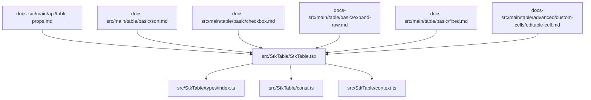
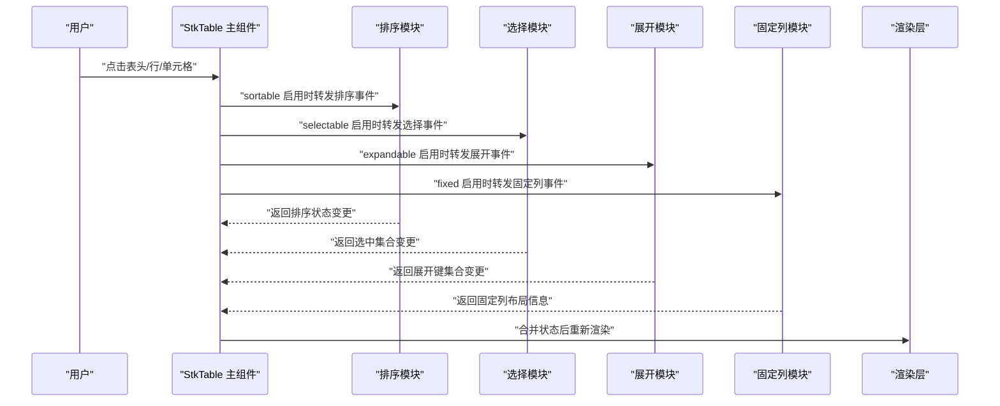
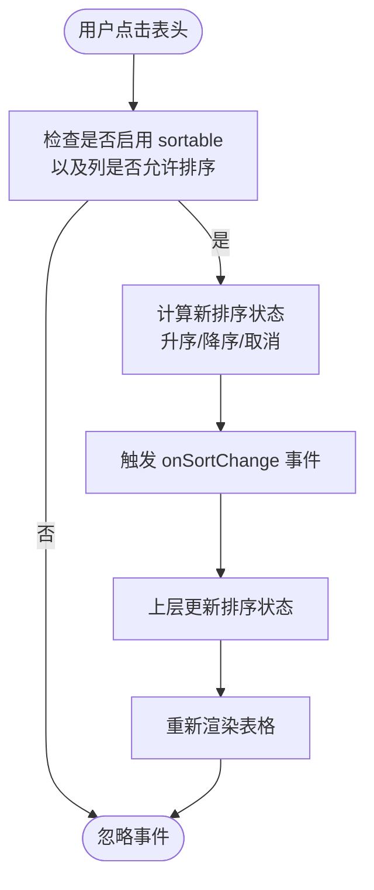
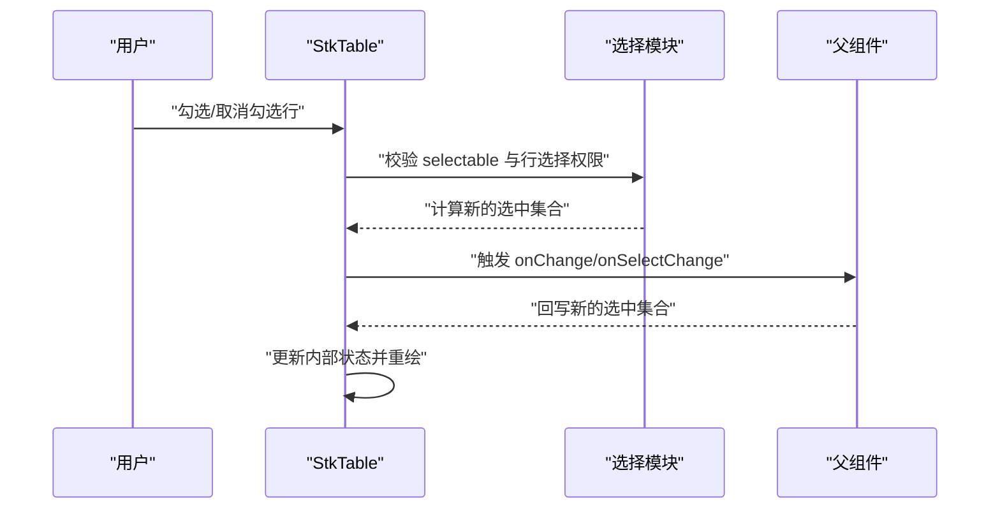
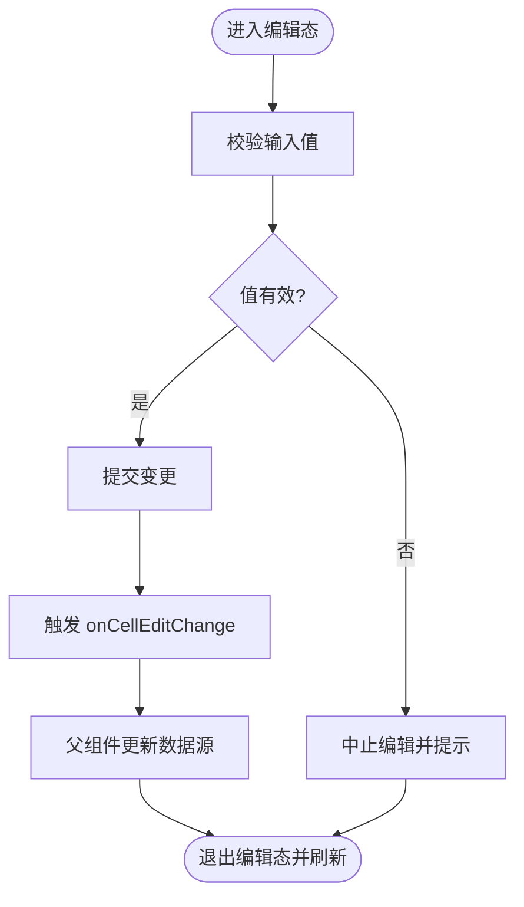
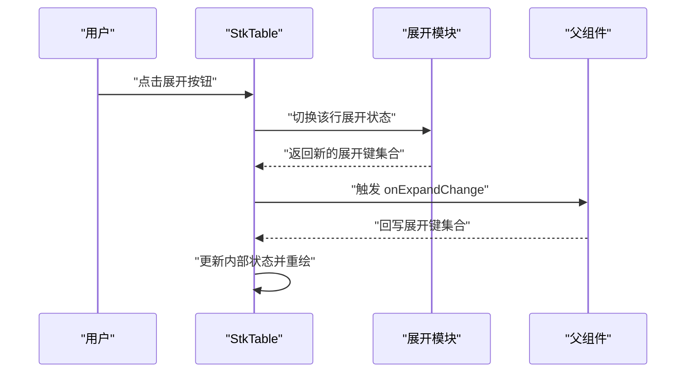
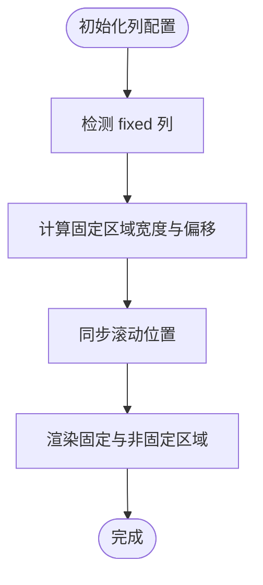
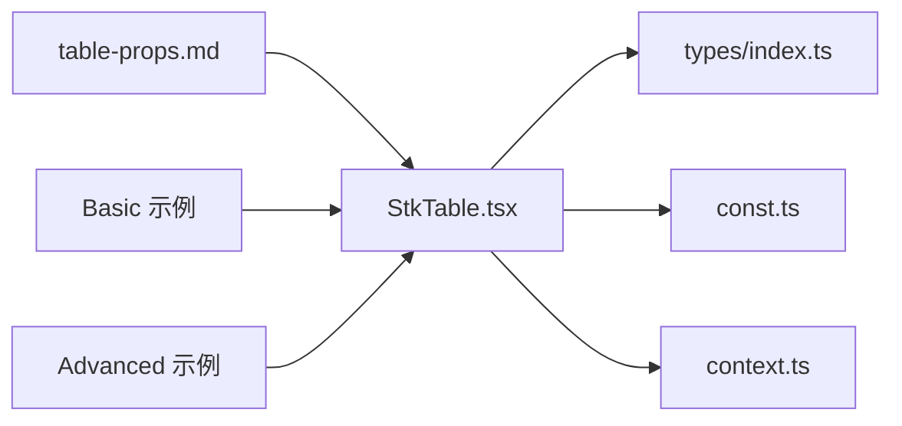

# 行为属性

<cite>
**本文引用的文件**   
- [StkTable.tsx](file://src/StkTable/StkTable.tsx)
- [index.ts](file://src/StkTable/index.ts)
- [types/index.ts](file://src/StkTable/types/index.ts)
- [const.ts](file://src/StkTable/const.ts)
- [context.ts](file://src/StkTable/context.ts)
- [table-props.md](file://docs-src/main/api/table-props.md)
- [sort.md](file://docs-src/main/table/basic/sort.md)
- [checkbox.md](file://docs-src/main/table/basic/checkbox.md)
- [expand-row.md](file://docs-src/main/table/basic/expand-row.md)
- [fixed.md](file://docs-src/main/table/basic/fixed.md)
- [editable-cell.md](file://docs-src/main/table/advanced/custom-cells/editable-cell.md)
- [area-selection.md](file://docs-src/main/table/advanced/area-selection.md)
- [row-drag.md](file://docs-src/main/table/advanced/row-drag.md)
- [custom-sort.md](file://docs-src/main/table/advanced/custom-sort.md)
- [CustomSort/index.tsx](file://docs-demo/advanced/custom-sort/CustomSort/index.tsx)
- [InsertSort.tsx](file://docs-demo/advanced/custom-sort/InsertSort.tsx)
- [AreaSelection.tsx](file://docs-demo/advanced/area-selection/AreaSelection.tsx)
- [RowDrag.tsx](file://docs-demo/advanced/row-drag/RowDrag.tsx)
- [RowDragCustom.tsx](file://docs-demo/advanced/row-drag/RowDragCustom.tsx)
- [ExpandRow.tsx](file://docs-demo/basic/expand-row/ExpandRow.tsx)
- [Fixed.tsx](file://docs-demo/basic/fixed/Fixed.tsx)
- [Checkbox.tsx](file://docs-demo/basic/checkbox/Checkbox.tsx)
</cite>

## 目录
1. [简介](#简介)
2. [项目结构](#项目结构)
3. [核心组件与入口](#核心组件与入口)
4. [架构总览](#架构总览)
5. [详细组件分析](#详细组件分析)
6. [依赖关系分析](#依赖关系分析)
7. [性能考量](#性能考量)
8. [故障排查指南](#故障排查指南)
9. [结论](#结论)
10. [附录：API 速查](#附录api-速查)

## 简介
本章节聚焦 StkTable 的行为交互属性，围绕 sortable（排序）、selectable（选择）、editable（编辑）、expandable（展开）、fixed（固定列）等能力，系统说明其配置方法、事件处理与状态管理，并给出复杂交互场景的实现示例与最佳实践。同时解释多行为组合使用时的协同方式与冲突处理策略，帮助读者在真实业务中高效构建可交互的表格。

## 项目结构
仓库采用“源码 + 文档 + 演示”三层组织：
- src/StkTable：核心实现，包含主组件、类型定义、常量、上下文与工具函数
- docs-src：官方文档源（含 API 说明与各特性页面）
- docs-demo：面向文档的交互式示例代码

图表来源
- [StkTable.tsx](file://src/StkTable/StkTable.tsx)
- [types/index.ts](file://src/StkTable/types/index.ts)
- [const.ts](file://src/StkTable/const.ts)
- [context.ts](file://src/StkTable/context.ts)
- [table-props.md](file://docs-src/main/api/table-props.md)
- [sort.md](file://docs-src/main/table/basic/sort.md)
- [checkbox.md](file://docs-src/main/table/basic/checkbox.md)
- [expand-row.md](file://docs-src/main/table/basic/expand-row.md)
- [fixed.md](file://docs-src/main/table/basic/fixed.md)
- [editable-cell.md](file://docs-src/main/table/advanced/custom-cells/editable-cell.md)

章节来源
- [StkTable.tsx](file://src/StkTable/StkTable.tsx)
- [index.ts](file://src/StkTable/index.ts)
- [table-props.md](file://docs-src/main/api/table-props.md)

## 核心组件与入口
- 主组件入口：StkTable 组件负责接收 props、维护内部状态、协调各行为模块（排序、选择、展开、固定列等），并通过 context 向子组件传递共享状态与回调。
- 类型与常量：types/index.ts 定义行为相关接口；const.ts 提供默认值与枚举。
- 文档 API：table-props.md 汇总所有表格属性，包括行为开关与事件回调。

章节来源
- [StkTable.tsx](file://src/StkTable/StkTable.tsx)
- [index.ts](file://src/StkTable/index.ts)
- [types/index.ts](file://src/StkTable/types/index.ts)
- [const.ts](file://src/StkTable/const.ts)
- [table-props.md](file://docs-src/main/api/table-props.md)

## 架构总览
下图展示行为属性在主组件中的装配与数据流：用户交互触发事件，进入 StkTable 统一处理，再分发到对应行为模块更新状态，最终驱动渲染。

图表来源
- [StkTable.tsx](file://src/StkTable/StkTable.tsx)
- [context.ts](file://src/StkTable/context.ts)

## 详细组件分析

### 排序（sortable）
- 配置要点
  - 通过 table 级属性开启排序能力，并在列定义中指定排序字段与方向。
  - 支持单列排序与多列排序，可通过事件回调获取当前排序状态。
- 事件与状态
  - 典型事件：onSortChange（或类似命名），参数包含排序字段与方向数组。
  - 状态管理：将排序状态提升至上层组件，结合 dataSource 进行本地或远程排序。
- 自定义排序
  - 可在列级别覆盖默认排序逻辑，或在 table 级别注入全局比较器。
- 示例参考
  - 基础排序、多列排序、自定义排序、远程排序等示例见下方文档与演示文件。

图表来源
- [StkTable.tsx](file://src/StkTable/StkTable.tsx)
- [sort.md](file://docs-src/main/table/basic/sort.md)
- [custom-sort.md](file://docs-src/main/table/advanced/custom-sort.md)
- [CustomSort/index.tsx](file://docs-demo/advanced/custom-sort/CustomSort/index.tsx)
- [InsertSort.tsx](file://docs-demo/advanced/custom-sort/InsertSort.tsx)

章节来源
- [sort.md](file://docs-src/main/table/basic/sort.md)
- [custom-sort.md](file://docs-src/main/table/advanced/custom-sort.md)
- [CustomSort/index.tsx](file://docs-demo/advanced/custom-sort/CustomSort/index.tsx)
- [InsertSort.tsx](file://docs-demo/advanced/custom-sort/InsertSort.tsx)

### 选择（selectable）
- 配置要点
  - 通过 table 级属性开启选择能力，通常配合复选框列使用。
  - 支持单选/多选、全选/反选、按条件禁用某行选择。
- 事件与状态
  - 典型事件：onChange（或 onSelectChange），参数为选中行键集合。
  - 状态管理：将选中集合提升至父组件，用于批量操作或联动。
- 示例参考
  - 基础选择、带禁用项的选择等示例见下方文档与演示文件。

图表来源
- [StkTable.tsx](file://src/StkTable/StkTable.tsx)
- [checkbox.md](file://docs-src/main/table/basic/checkbox.md)
- [Checkbox.tsx](file://docs-demo/basic/checkbox/Checkbox.tsx)

章节来源
- [checkbox.md](file://docs-src/main/table/basic/checkbox.md)
- [Checkbox.tsx](file://docs-demo/basic/checkbox/Checkbox.tsx)

### 编辑（editable）
- 配置要点
  - 通过列级别的 editable 配置开启单元格编辑，支持多种编辑器类型。
  - 可结合自定义单元格实现更复杂的编辑体验。
- 事件与状态
  - 典型事件：onCellEditChange（或类似命名），参数包含行键、列键与新值。
  - 状态管理：在父组件中维护数据源，确保受控编辑。
- 示例参考
  - 内置可编辑单元格与自定义编辑单元格示例见下方文档与演示文件。

图表来源
- [StkTable.tsx](file://src/StkTable/StkTable.tsx)
- [editable-cell.md](file://docs-src/main/table/advanced/custom-cells/editable-cell.md)

章节来源
- [editable-cell.md](file://docs-src/main/table/advanced/custom-cells/editable-cell.md)

### 展开（expandable）
- 配置要点
  - 通过 table 级 expandable 配置开启行展开，支持自定义展开内容。
  - 可控制默认展开行、最大展开层级等。
- 事件与状态
  - 典型事件：onExpandChange，参数为展开键集合。
  - 状态管理：将展开键集合提升至父组件，用于持久化或联动。
- 示例参考
  - 基础展开与自定义展开内容示例见下方文档与演示文件。

图表来源
- [StkTable.tsx](file://src/StkTable/StkTable.tsx)
- [expand-row.md](file://docs-src/main/table/basic/expand-row.md)
- [ExpandRow.tsx](file://docs-demo/basic/expand-row/ExpandRow.tsx)

章节来源
- [expand-row.md](file://docs-src/main/table/basic/expand-row.md)
- [ExpandRow.tsx](file://docs-demo/basic/expand-row/ExpandRow.tsx)

### 固定列（fixed）
- 配置要点
  - 在列定义中设置 fixed 属性，支持左固定与右固定。
  - 可与虚拟滚动、多级表头、合并单元格等高级特性组合使用。
- 事件与状态
  - 固定列主要影响布局与滚动同步，一般无需额外事件。
  - 注意与横向虚拟滚动的兼容性配置。
- 示例参考
  - 基础固定列与虚拟滚动下的固定列示例见下方文档与演示文件。

图表来源
- [StkTable.tsx](file://src/StkTable/StkTable.tsx)
- [fixed.md](file://docs-src/main/table/basic/fixed.md)
- [Fixed.tsx](file://docs-demo/basic/fixed/Fixed.tsx)

章节来源
- [fixed.md](file://docs-src/main/table/basic/fixed.md)
- [Fixed.tsx](file://docs-demo/basic/fixed/Fixed.tsx)

### 组合与冲突处理
- 常见组合
  - 排序 + 选择：先排序再选择，选中集合需基于稳定 key 维护。
  - 展开 + 固定列：展开内容与固定列布局需分别计算，避免错位。
  - 编辑 + 选择：编辑态下应阻止行选择或延迟选择直到编辑完成。
- 冲突与优先级
  - 当多个行为同时监听同一交互（如点击表头）时，以 StkTable 的统一调度为准，优先处理显式启用的行为。
  - 对不可用状态（如 disabled 行）应跳过相应行为逻辑。
- 建议
  - 将状态提升到父组件，保持单一数据源与受控模式。
  - 使用稳定的行 key，避免重排导致的状态错乱。
  - 对大数据量场景，优先使用虚拟滚动并结合懒加载。

[本节为概念性说明，不直接分析具体文件]

## 依赖关系分析
- 组件内依赖
  - StkTable 依赖 types 定义与 const 常量，通过 context 向下传递状态与回调。
- 文档与示例依赖
  - 文档页面对应示例位于 docs-demo，便于对照理解行为属性的实际用法。

图表来源
- [StkTable.tsx](file://src/StkTable/StkTable.tsx)
- [types/index.ts](file://src/StkTable/types/index.ts)
- [const.ts](file://src/StkTable/const.ts)
- [context.ts](file://src/StkTable/context.ts)
- [table-props.md](file://docs-src/main/api/table-props.md)

章节来源
- [StkTable.tsx](file://src/StkTable/StkTable.tsx)
- [types/index.ts](file://src/StkTable/types/index.ts)
- [const.ts](file://src/StkTable/const.ts)
- [context.ts](file://src/StkTable/context.ts)
- [table-props.md](file://docs-src/main/api/table-props.md)

## 性能考量
- 大数据量
  - 优先启用虚拟滚动，减少 DOM 节点数量。
  - 对排序、筛选等昂贵操作进行防抖或分页/远端处理。
- 固定列
  - 固定列会引入额外的布局计算，尽量控制固定列数量与宽度。
- 展开与编辑
  - 展开内容应避免重型渲染；编辑态尽量局部更新，减少整表重绘。
- 选择
  - 使用稳定 key 与不可变数据结构，降低 diff 成本。

[本节提供通用指导，不直接分析具体文件]

## 故障排查指南
- 排序无效
  - 确认列已配置排序字段且未禁用；检查 onSortChange 是否正确回写状态。
- 选择异常
  - 检查行 key 的唯一性与稳定性；确认 selectable 与列复选框配置一致。
- 编辑失败
  - 校验 onCellEditChange 返回值与数据类型；确保父组件受控更新数据源。
- 固定列错位
  - 核对横向滚动容器与固定列宽度计算；检查是否与虚拟滚动存在兼容问题。
- 展开内容重叠
  - 确认展开区域高度计算正确；避免与固定列或合并单元格布局冲突。

[本节为通用排查建议，不直接分析具体文件]

## 结论
通过对 sortable、selectable、editable、expandable、fixed 等行为属性的系统化梳理，可以构建出高可用、高性能且易扩展的表格交互方案。建议在项目中遵循受控模式、稳定 key、按需启用行为的原则，并结合文档与示例快速落地复杂场景。

[本节为总结性内容，不直接分析具体文件]

## 附录：API 速查
- 排序
  - 参考：[sort.md](file://docs-src/main/table/basic/sort.md)、[custom-sort.md](file://docs-src/main/table/advanced/custom-sort.md)
  - 示例：[CustomSort/index.tsx](file://docs-demo/advanced/custom-sort/CustomSort/index.tsx)、[InsertSort.tsx](file://docs-demo/advanced/custom-sort/InsertSort.tsx)
- 选择
  - 参考：[checkbox.md](file://docs-src/main/table/basic/checkbox.md)
  - 示例：[Checkbox.tsx](file://docs-demo/basic/checkbox/Checkbox.tsx)
- 编辑
  - 参考：[editable-cell.md](file://docs-src/main/table/advanced/custom-cells/editable-cell.md)
- 展开
  - 参考：[expand-row.md](file://docs-src/main/table/basic/expand-row.md)
  - 示例：[ExpandRow.tsx](file://docs-demo/basic/expand-row/ExpandRow.tsx)
- 固定列
  - 参考：[fixed.md](file://docs-src/main/table/basic/fixed.md)
  - 示例：[Fixed.tsx](file://docs-demo/basic/fixed/Fixed.tsx)
- 其他高级交互
  - 区域选择：[area-selection.md](file://docs-src/main/table/advanced/area-selection.md)、[AreaSelection.tsx](file://docs-demo/advanced/area-selection/AreaSelection.tsx)
  - 行拖拽：[row-drag.md](file://docs-src/main/table/advanced/row-drag.md)、[RowDrag.tsx](file://docs-demo/advanced/row-drag/RowDrag.tsx)、[RowDragCustom.tsx](file://docs-demo/advanced/row-drag/RowDragCustom.tsx)

章节来源
- [sort.md](file://docs-src/main/table/basic/sort.md)
- [custom-sort.md](file://docs-src/main/table/advanced/custom-sort.md)
- [checkbox.md](file://docs-src/main/table/basic/checkbox.md)
- [editable-cell.md](file://docs-src/main/table/advanced/custom-cells/editable-cell.md)
- [expand-row.md](file://docs-src/main/table/basic/expand-row.md)
- [fixed.md](file://docs-src/main/table/basic/fixed.md)
- [area-selection.md](file://docs-src/main/table/advanced/area-selection.md)
- [row-drag.md](file://docs-src/main/table/advanced/row-drag.md)
- [CustomSort/index.tsx](file://docs-demo/advanced/custom-sort/CustomSort/index.tsx)
- [InsertSort.tsx](file://docs-demo/advanced/custom-sort/InsertSort.tsx)
- [Checkbox.tsx](file://docs-demo/basic/checkbox/Checkbox.tsx)
- [ExpandRow.tsx](file://docs-demo/basic/expand-row/ExpandRow.tsx)
- [Fixed.tsx](file://docs-demo/basic/fixed/Fixed.tsx)
- [AreaSelection.tsx](file://docs-demo/advanced/area-selection/AreaSelection.tsx)
- [RowDrag.tsx](file://docs-demo/advanced/row-drag/RowDrag.tsx)
- [RowDragCustom.tsx](file://docs-demo/advanced/row-drag/RowDragCustom.tsx)