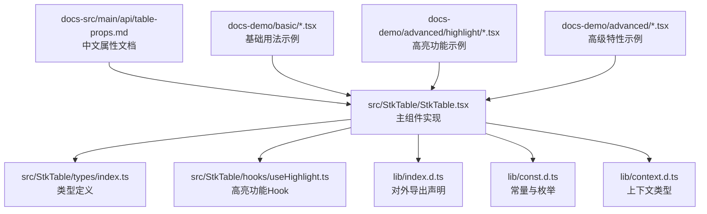
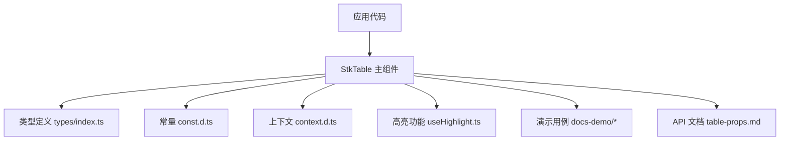
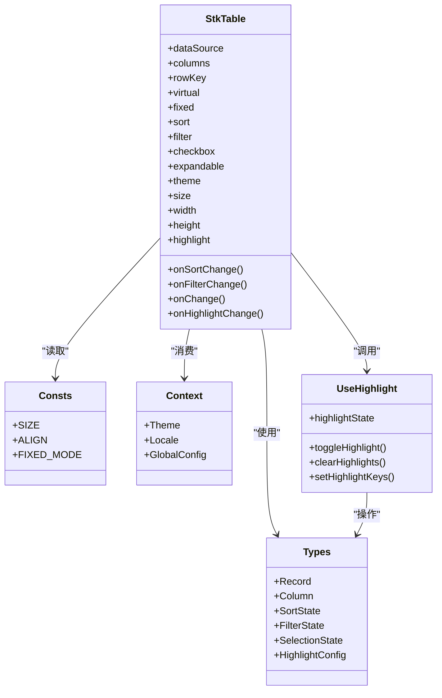

# 表格属性 (Props)

<cite>
**本文引用的文件**   
- [src/StkTable/StkTable.tsx](file://src/StkTable/StkTable.tsx)
- [src/StkTable/types/index.ts](file://src/StkTable/types/index.ts)
- [src/StkTable/hooks/useHighlight.ts](file://src/StkTable/hooks/useHighlight.ts)
- [lib/const.d.ts](file://lib/const.d.ts)
- [lib/context.d.ts](file://lib/context.d.ts)
- [lib/index.d.ts](file://lib/index.d.ts)
- [docs-src/main/api/table-props.md](file://docs-src/main/api/table-props.md)
- [docs-src/en/main/api/table-props.md](file://docs-src/en/main/api/table-props.md)
- [docs-src/ja/main/api/table-props.md](file://docs-src/ja/main/api/table-props.md)
- [docs-src/ko/main/api/table-props.md](file://docs-src/ko/main/api/table-props.md)
- [docs-demo/basic/Basic.tsx](file://docs-demo/basic/Basic.tsx)
- [docs-demo/basic/size/Default.tsx](file://docs-demo/basic/size/Default.tsx)
- [docs-demo/basic/size/Flex.tsx](file://docs-demo/basic/size/Flex.tsx)
- [docs-demo/basic/align/Align.tsx](file://docs-demo/basic/align/Align.tsx)
- [docs-demo/basic/border/Default.tsx](file://docs-demo/basic/border/Default.tsx)
- [docs-demo/basic/checkbox/Checkbox.tsx](file://docs-demo/basic/checkbox/Checkbox.tsx)
- [docs-demo/basic/column-width/ColumnWidth.tsx](file://docs-demo/basic/column-width/ColumnWidth.tsx)
- [docs-demo/basic/empty/Default.tsx](file://docs-demo/basic/empty/Default.tsx)
- [docs-demo/basic/expand-row/ExpandRow.tsx](file://docs-demo/basic/expand-row/ExpandRow.tsx)
- [docs-demo/basic/fixed/Fixed.tsx](file://docs-demo/basic/fixed/Fixed.tsx)
- [docs-demo/basic/fixed-mode/FixedMode.tsx](file://docs-demo/basic/fixed-mode/FixedMode.tsx)
- [docs-demo/basic/footer/Footer.tsx](file://docs-demo/basic/footer/Footer.tsx)
- [docs-demo/basic/headless/Headless.tsx](file://docs-demo/basic/headless/Headless.tsx)
- [docs-demo/basic/merge-cells/MergeCellsCol.tsx](file://docs-demo/basic/merge-cells/MergeCellsCol.tsx)
- [docs-demo/basic/multi-header/MultiHeader.tsx](file://docs-demo/basic/multi-header/MultiHeader.tsx)
- [docs-demo/basic/overflow/Overflow.tsx](file://docs-demo/basic/overflow/Overflow.tsx)
- [docs-demo/basic/row-cell-mouse-event/RowCellHoverSelect.tsx](file://docs-demo/basic/row-cell-mouse-event/RowCellHoverSelect.tsx)
- [docs-demo/basic/scroll-row-by-row/ScrollRowByRow.tsx](file://docs-demo/basic/scroll-row-by-row/ScrollRowByRow.tsx)
- [docs-demo/basic/scrollbar-style/ScrollbarStyle.tsx](file://docs-demo/basic/scrollbar-style/ScrollbarStyle.tsx)
- [docs-demo/basic/seq/Seq.tsx](file://docs-demo/basic/seq/Seq.tsx)
- [docs-demo/basic/sort/DefaultSort.tsx](file://docs-demo/basic/sort/DefaultSort.tsx)
- [docs-demo/basic/stripe/Stripe.tsx](file://docs-demo/basic/stripe/Stripe.tsx)
- [docs-demo/basic/theme/CssVarsDemo.tsx](file://docs-demo/basic/theme/CssVarsDemo.tsx)
- [docs-demo/basic/tree/Tree.tsx](file://docs-demo/basic/tree/Tree.tsx)
- [docs-demo/advanced/virtual/VirtualX.tsx](file://docs-demo/advanced/virtual/VirtualX.tsx)
- [docs-demo/advanced/virtual/VirtualY.tsx](file://docs-demo/advanced/virtual/VirtualY.tsx)
- [docs-demo/advanced/auto-height-virtual/AutoHeightVirtual/index.tsx](file://docs-demo/advanced/auto-height-virtual/AutoHeightVirtual/index.tsx)
- [docs-demo/advanced/custom-cell/CustomCell/index.tsx](file://docs-demo/advanced/custom-cell/CustomCell/index.tsx)
- [docs-demo/advanced/custom-cells/EditableCell/index.tsx](file://docs-demo/advanced/custom-cells/EditableCell/index.tsx)
- [docs-demo/advanced/custom-cells/FilterCell/index.tsx](file://docs-demo/advanced/custom-cells/FilterCell/index.tsx)
- [docs-demo/advanced/custom-sort/CustomSort/index.tsx](file://docs-demo/advanced/custom-sort/CustomSort/index.tsx)
- [docs-demo/advanced/header-drag/HeaderDrag.tsx](file://docs-demo/advanced/header-drag/HeaderDrag.tsx)
- [docs-demo/advanced/highlight/Highlight.tsx](file://docs-demo/advanced/highlight/Highlight.tsx)
- [docs-demo/advanced/highlight/HighlightAnimation.tsx](file://docs-demo/advanced/highlight/HighlightAnimation.tsx)
- [docs-demo/advanced/highlight/HighlightBase.tsx](file://docs-demo/advanced/highlight/HighlightBase.tsx)
- [docs-demo/advanced/highlight/HighlightCss.tsx](file://docs-demo/advanced/highlight/HighlightCss.tsx)
- [docs-demo/advanced/highlight/const.ts](file://docs-demo/advanced/highlight/const.ts)
- [docs-demo/advanced/row-drag/RowDrag.tsx](file://docs-demo/advanced/row-drag/RowDrag.tsx)
- [docs-demo/advanced/column-resize/ColResizable.tsx](file://docs-demo/advanced/column-resize/ColResizable.tsx)
</cite>

## 更新摘要
**变更内容**   
- 新增高亮功能相关属性，支持行级和单元格级高亮显示
- 扩展了 highlight 属性的配置选项，包括动画效果和 CSS 样式定制
- 新增了 useHighlight Hook 用于管理高亮状态和逻辑
- 更新了交互行为章节，详细说明了高亮功能的多种使用方式

## 目录
1. [简介](#简介)
2. [项目结构](#项目结构)
3. [核心组件](#核心组件)
4. [架构总览](#架构总览)
5. [详细组件分析](#详细组件分析)
6. [依赖分析](#依赖分析)
7. [性能考虑](#性能考虑)
8. [故障排查指南](#故障排查指南)
9. [结论](#结论)
10. [附录](#附录)

## 简介
本章节面向使用 StkTable 的开发者，提供"表格属性（Props）"的完整 API 文档。内容覆盖数据绑定、显示配置、交互设置、性能优化等维度的所有关键属性，包含类型定义、默认值、是否必填说明与示例路径，并按功能分类组织，便于快速检索与组合使用。

**更新** 新增了高亮功能相关的属性配置，支持更丰富的视觉反馈效果。

## 项目结构
StkTable 的属性定义集中在源码的类型与主组件文件中，同时通过多语言文档与演示样例展示各属性的用法与效果。

**图表来源**
- [src/StkTable/StkTable.tsx](file://src/StkTable/StkTable.tsx)
- [src/StkTable/types/index.ts](file://src/StkTable/types/index.ts)
- [src/StkTable/hooks/useHighlight.ts](file://src/StkTable/hooks/useHighlight.ts)
- [lib/index.d.ts](file://lib/index.d.ts)
- [lib/const.d.ts](file://lib/const.d.ts)
- [lib/context.d.ts](file://lib/context.d.ts)
- [docs-src/main/api/table-props.md](file://docs-src/main/api/table-props.md)

## 核心组件
StkTable 的核心由主组件与类型系统组成：
- 主组件负责解析 props、渲染表头/行/单元格、处理交互与滚动、集成虚拟列表与固定列等能力。
- 类型系统集中定义了表格数据结构、列定义、排序/筛选/分页等状态接口，以及事件回调签名。
- **新增** 高亮功能通过独立的 Hook 管理，提供更灵活的高亮控制机制。

**章节来源**
- [src/StkTable/StkTable.tsx](file://src/StkTable/StkTable.tsx)
- [src/StkTable/types/index.ts](file://src/StkTable/types/index.ts)
- [src/StkTable/hooks/useHighlight.ts](file://src/StkTable/hooks/useHighlight.ts)

## 架构总览
下图展示了 StkTable 在应用中的位置与主要外部依赖关系，包括主题、国际化、虚拟列表、自定义单元格等扩展点。

**图表来源**
- [src/StkTable/StkTable.tsx](file://src/StkTable/StkTable.tsx)
- [src/StkTable/types/index.ts](file://src/StkTable/types/index.ts)
- [src/StkTable/hooks/useHighlight.ts](file://src/StkTable/hooks/useHighlight.ts)
- [lib/const.d.ts](file://lib/const.d.ts)
- [lib/context.d.ts](file://lib/context.d.ts)
- [docs-src/main/api/table-props.md](file://docs-src/main/api/table-props.md)

## 详细组件分析
以下按功能维度对 StkTable 的 Props 进行系统化梳理。每个属性均给出类型、默认值、是否必填、示例路径与最佳实践建议。为避免冗长代码，示例以路径引用形式呈现。

### 一、数据与列定义
- dataSource: 表格数据源
  - 类型: 数组
  - 默认值: []
  - 必填: 否
  - 说明: 支持对象数组；若启用树形或展开行，需包含 id/children 等字段约定
  - 示例: [docs-demo/basic/Basic.tsx](file://docs-demo/basic/Basic.tsx)
- columns: 列配置
  - 类型: 列定义数组
  - 默认值: []
  - 必填: 否
  - 说明: 支持多级表头、合并单元格、固定列、宽度、对齐、排序、筛选、插槽等
  - 示例: [docs-demo/basic/multi-header/MultiHeader.tsx](file://docs-demo/basic/multi-header/MultiHeader.tsx), [docs-demo/basic/merge-cells/MergeCellsCol.tsx](file://docs-demo/basic/merge-cells/MergeCellsCol.tsx)
- rowKey: 行唯一键
  - 类型: string | ((record) => string)
  - 默认值: "id"
  - 必填: 否
  - 说明: 用于稳定渲染与选中/展开状态保持
  - 示例: [docs-demo/basic/Basic.tsx](file://docs-demo/basic/Basic.tsx)
- treeData / isTree: 树形表格
  - 类型: boolean | object[]
  - 默认值: false
  - 必填: 否
  - 说明: 开启后支持层级展开与折叠
  - 示例: [docs-demo/basic/tree/Tree.tsx](file://docs-demo/basic/tree/Tree.tsx)
- expandable: 展开行配置
  - 类型: 展开行配置对象
  - 默认值: 关闭
  - 必填: 否
  - 说明: 可自定义展开图标、内容插槽、初始展开键集合等
  - 示例: [docs-demo/basic/expand-row/ExpandRow.tsx](file://docs-demo/basic/expand-row/ExpandRow.tsx)

**章节来源**
- [src/StkTable/types/index.ts](file://src/StkTable/types/index.ts)
- [docs-demo/basic/Basic.tsx](file://docs-demo/basic/Basic.tsx)
- [docs-demo/basic/multi-header/MultiHeader.tsx](file://docs-demo/basic/multi-header/MultiHeader.tsx)
- [docs-demo/basic/merge-cells/MergeCellsCol.tsx](file://docs-demo/basic/merge-cells/MergeCellsCol.tsx)
- [docs-demo/basic/tree/Tree.tsx](file://docs-demo/basic/tree/Tree.tsx)
- [docs-demo/basic/expand-row/ExpandRow.tsx](file://docs-demo/basic/expand-row/ExpandRow.tsx)

### 二、尺寸与布局
- size: 尺寸模式
  - 类型: enum
  - 默认值: "default"
  - 必填: 否
  - 说明: 影响行高、字号、间距等
  - 示例: [docs-demo/basic/size/Default.tsx](file://docs-demo/basic/size/Default.tsx)
- width / height: 容器宽高
  - 类型: number | string
  - 默认值: 自适应/未设置
  - 必填: 否
  - 说明: 支持像素、百分比；配合 flex 布局可实现弹性高度
  - 示例: [docs-demo/basic/size/Flex.tsx](file://docs-demo/basic/size/Flex.tsx)
- columnWidth: 列宽策略
  - 类型: number | "auto" | "fit-content"
  - 默认值: "auto"
  - 必填: 否
  - 说明: 控制列宽计算方式
  - 示例: [docs-demo/basic/column-width/ColumnWidth.tsx](file://docs-demo/basic/column-width/ColumnWidth.tsx)
- fixed: 固定列
  - 类型: "left" | "right" | boolean
  - 默认值: false
  - 必填: 否
  - 说明: 固定首尾列，支持横向滚动
  - 示例: [docs-demo/basic/fixed/Fixed.tsx](file://docs-demo/basic/fixed/Fixed.tsx)
- fixedMode: 固定模式
  - 类型: enum
  - 默认值: "standard"
  - 必填: 否
  - 说明: 不同固定模式影响渲染与性能
  - 示例: [docs-demo/basic/fixed-mode/FixedMode.tsx](file://docs-demo/basic/fixed-mode/FixedMode.tsx)
- overflow: 溢出处理
  - 类型: "ellipsis" | "tooltip" | "wrap"
  - 默认值: "ellipsis"
  - 必填: 否
  - 说明: 控制单元格内容溢出时的表现
  - 示例: [docs-demo/basic/overflow/Overflow.tsx](file://docs-demo/basic/overflow/Overflow.tsx)
- align: 对齐方式
  - 类型: "left" | "center" | "right"
  - 默认值: "left"
  - 必填: 否
  - 说明: 作用于整表或单列
  - 示例: [docs-demo/basic/align/Align.tsx](file://docs-demo/basic/align/Align.tsx)
- bordered: 边框
  - 类型: boolean
  - 默认值: true
  - 必填: 否
  - 说明: 显示表格内外边框
  - 示例: [docs-demo/basic/border/Default.tsx](file://docs-demo/basic/border/Default.tsx)
- stripe: 斑马纹
  - 类型: boolean
  - 默认值: false
  - 必填: 否
  - 说明: 交替行背景色
  - 示例: [docs-demo/basic/stripe/Stripe.tsx](file://docs-demo/basic/stripe/Stripe.tsx)
- headless: 无头模式
  - 类型: boolean
  - 默认值: false
  - 必填: 否
  - 说明: 隐藏表头，仅渲染数据区
  - 示例: [docs-demo/basic/headless/Headless.tsx](file://docs-demo/basic/headless/Headless.tsx)

**章节来源**
- [src/StkTable/types/index.ts](file://src/StkTable/types/index.ts)
- [docs-demo/basic/size/Default.tsx](file://docs-demo/basic/size/Default.tsx)
- [docs-demo/basic/size/Flex.tsx](file://docs-demo/basic/size/Flex.tsx)
- [docs-demo/basic/column-width/ColumnWidth.tsx](file://docs-demo/basic/column-width/ColumnWidth.tsx)
- [docs-demo/basic/fixed/Fixed.tsx](file://docs-demo/basic/fixed/Fixed.tsx)
- [docs-demo/basic/fixed-mode/FixedMode.tsx](file://docs-demo/basic/fixed-mode/FixedMode.tsx)
- [docs-demo/basic/overflow/Overflow.tsx](file://docs-demo/basic/overflow/Overflow.tsx)
- [docs-demo/basic/align/Align.tsx](file://docs-demo/basic/align/Align.tsx)
- [docs-demo/basic/border/Default.tsx](file://docs-demo/basic/border/Default.tsx)
- [docs-demo/basic/stripe/Stripe.tsx](file://docs-demo/basic/stripe/Stripe.tsx)
- [docs-demo/basic/headless/Headless.tsx](file://docs-demo/basic/headless/Headless.tsx)

### 三、交互行为
- checkbox: 复选框列
  - 类型: boolean | 复选框配置
  - 默认值: false
  - 必填: 否
  - 说明: 支持全选、单选、禁用行等
  - 示例: [docs-demo/basic/checkbox/Checkbox.tsx](file://docs-demo/basic/checkbox/Checkbox.tsx)
- sort: 排序
  - 类型: boolean | 排序配置
  - 默认值: false
  - 必填: 否
  - 说明: 支持单列/多列排序、自定义比较器、远程排序
  - 示例: [docs-demo/basic/sort/DefaultSort.tsx](file://docs-demo/basic/sort/DefaultSort.tsx), [docs-demo/advanced/custom-sort/CustomSort/index.tsx](file://docs-demo/advanced/custom-sort/CustomSort/index.tsx)
- filter: 筛选
  - 类型: boolean | 筛选配置
  - 默认值: false
  - 必填: 否
  - 说明: 内置筛选器或自定义筛选单元格
  - 示例: [docs-demo/advanced/custom-cells/FilterCell/index.tsx](file://docs-demo/advanced/custom-cells/FilterCell/index.tsx)
- headerDrag: 拖拽表头
  - 类型: boolean
  - 默认值: false
  - 必填: 否
  - 说明: 支持拖拽调整列顺序
  - 示例: [docs-demo/advanced/header-drag/HeaderDrag.tsx](file://docs-demo/advanced/header-drag/HeaderDrag.tsx)
- rowDrag: 拖拽行
  - 类型: boolean
  - 默认值: false
  - 必填: 否
  - 说明: 支持行拖拽重排
  - 示例: [docs-demo/advanced/row-drag/RowDrag.tsx](file://docs-demo/advanced/row-drag/RowDrag.tsx)
- columnResize: 列宽拖拽
  - 类型: boolean
  - 默认值: false
  - 必填: 否
  - 说明: 支持拖拽调整列宽
  - 示例: [docs-demo/advanced/column-resize/ColResizable.tsx](file://docs-demo/advanced/column-resize/ColResizable.tsx)
- rowCellMouseEvents: 行/单元格鼠标事件
  - 类型: 事件回调对象
  - 默认值: 空
  - 必填: 否
  - 说明: 如 hover 选择、点击等
  - 示例: [docs-demo/basic/row-cell-mouse-event/RowCellHoverSelect.tsx](file://docs-demo/basic/row-cell-mouse-event/RowCellHoverSelect.tsx)
- scrollRowByRow: 逐行滚动
  - 类型: boolean
  - 默认值: false
  - 必填: 否
  - 说明: 键盘或程序化逐行滚动
  - 示例: [docs-demo/basic/scroll-row-by-row/ScrollRowByRow.tsx](file://docs-demo/basic/scroll-row-by-row/ScrollRowByRow.tsx)
- highlight: 高亮
  - 类型: boolean | 高亮配置对象
  - 默认值: false
  - 必填: 否
  - 说明: **新增** 支持行级和单元格级高亮，包含动画效果、CSS 样式定制、高亮区域管理等高级功能
  - 配置项:
    - enabled: 是否启用高亮功能
    - type: 高亮类型 ('row' | 'cell')
    - animation: 动画配置
    - style: 自定义样式
    - highlightKeys: 需要高亮的行键集合
    - highlightCells: 需要高亮的单元格坐标集合
  - 示例: [docs-demo/advanced/highlight/Highlight.tsx](file://docs-demo/advanced/highlight/Highlight.tsx), [docs-demo/advanced/highlight/HighlightAnimation.tsx](file://docs-demo/advanced/highlight/HighlightAnimation.tsx), [docs-demo/advanced/highlight/HighlightCss.tsx](file://docs-demo/advanced/highlight/HighlightCss.tsx)

**章节来源**
- [src/StkTable/types/index.ts](file://src/StkTable/types/index.ts)
- [src/StkTable/hooks/useHighlight.ts](file://src/StkTable/hooks/useHighlight.ts)
- [docs-demo/basic/checkbox/Checkbox.tsx](file://docs-demo/basic/checkbox/Checkbox.tsx)
- [docs-demo/basic/sort/DefaultSort.tsx](file://docs-demo/basic/sort/DefaultSort.tsx)
- [docs-demo/advanced/custom-sort/CustomSort/index.tsx](file://docs-demo/advanced/custom-sort/CustomSort/index.tsx)
- [docs-demo/advanced/custom-cells/FilterCell/index.tsx](file://docs-demo/advanced/custom-cells/FilterCell/index.tsx)
- [docs-demo/advanced/header-drag/HeaderDrag.tsx](file://docs-demo/advanced/header-drag/HeaderDrag.tsx)
- [docs-demo/advanced/row-drag/RowDrag.tsx](file://docs-demo/advanced/row-drag/RowDrag.tsx)
- [docs-demo/advanced/column-resize/ColResizable.tsx](file://docs-demo/advanced/column-resize/ColResizable.tsx)
- [docs-demo/basic/row-cell-mouse-event/RowCellHoverSelect.tsx](file://docs-demo/basic/row-cell-mouse-event/RowCellHoverSelect.tsx)
- [docs-demo/basic/scroll-row-by-row/ScrollRowByRow.tsx](file://docs-demo/basic/scroll-row-by-row/ScrollRowByRow.tsx)
- [docs-demo/advanced/highlight/Highlight.tsx](file://docs-demo/advanced/highlight/Highlight.tsx)
- [docs-demo/advanced/highlight/HighlightAnimation.tsx](file://docs-demo/advanced/highlight/HighlightAnimation.tsx)
- [docs-demo/advanced/highlight/HighlightCss.tsx](file://docs-demo/advanced/highlight/HighlightCss.tsx)

### 四、显示与样式
- empty: 空数据
  - 类型: string | 插槽
  - 默认值: "暂无数据"
  - 必填: 否
  - 说明: 支持自定义文案或插槽
  - 示例: [docs-demo/basic/empty/Default.tsx](file://docs-demo/basic/empty/Default.tsx)
- footer: 页脚
  - 类型: string | 插槽
  - 默认值: 空
  - 必填: 否
  - 说明: 支持多行表头与复杂页脚
  - 示例: [docs-demo/basic/footer/Footer.tsx](file://docs-demo/basic/footer/Footer.tsx)
- seq: 序号列
  - 类型: boolean | 序号配置
  - 默认值: false
  - 必填: 否
  - 说明: 支持起始索引与分页联动
  - 示例: [docs-demo/basic/seq/Seq.tsx](file://docs-demo/basic/seq/Seq.tsx)
- theme: 主题
  - 类型: 主题变量或 CSS 变量
  - 默认值: 默认主题
  - 必填: 否
  - 说明: 支持 CSS 变量覆盖
  - 示例: [docs-demo/basic/theme/CssVarsDemo.tsx](file://docs-demo/basic/theme/CssVarsDemo.tsx)
- scrollbar: 滚动条样式
  - 类型: 滚动条配置
  - 默认值: 默认样式
  - 必填: 否
  - 说明: 支持自定义滚动条外观
  - 示例: [docs-demo/basic/scrollbar-style/ScrollbarStyle.tsx](file://docs-demo/basic/scrollbar-style/ScrollbarStyle.tsx)

**章节来源**
- [src/StkTable/types/index.ts](file://src/StkTable/types/index.ts)
- [docs-demo/basic/empty/Default.tsx](file://docs-demo/basic/empty/Default.tsx)
- [docs-demo/basic/footer/Footer.tsx](file://docs-demo/basic/footer/Footer.tsx)
- [docs-demo/basic/seq/Seq.tsx](file://docs-demo/basic/seq/Seq.tsx)
- [docs-demo/basic/theme/CssVarsDemo.tsx](file://docs-demo/basic/theme/CssVarsDemo.tsx)
- [docs-demo/basic/scrollbar-style/ScrollbarStyle.tsx](file://docs-demo/basic/scrollbar-style/ScrollbarStyle.tsx)

### 五、性能与虚拟化
- virtual: 虚拟化
  - 类型: "x" | "y" | "xy" | boolean
  - 默认值: false
  - 说明: 开启横向/纵向/双向虚拟滚动，提升大数据渲染性能
  - 示例: [docs-demo/advanced/virtual/VirtualX.tsx](file://docs-demo/advanced/virtual/VirtualX.tsx), [docs-demo/advanced/virtual/VirtualY.tsx](file://docs-demo/advanced/virtual/VirtualY.tsx)
- autoHeightVirtual: 自动高度+虚拟化
  - 类型: boolean
  - 默认值: false
  - 说明: 结合自动高度与虚拟化，适配动态内容
  - 示例: [docs-demo/advanced/auto-height-virtual/AutoHeightVirtual/index.tsx](file://docs-demo/advanced/auto-height-virtual/AutoHeightVirtual/index.tsx)
- customCell: 自定义单元格
  - 类型: 函数或组件
  - 默认值: 内置渲染
  - 说明: 用于高性能渲染复杂单元格
  - 示例: [docs-demo/advanced/custom-cell/CustomCell/index.tsx](file://docs-demo/advanced/custom-cell/CustomCell/index.tsx)
- editableCell: 可编辑单元格
  - 类型: 布尔或配置
  - 默认值: false
  - 说明: 支持就地编辑，适合大数据场景下的局部更新
  - 示例: [docs-demo/advanced/custom-cells/EditableCell/index.tsx](file://docs-demo/advanced/custom-cells/EditableCell/index.tsx)

**章节来源**
- [src/StkTable/types/index.ts](file://src/StkTable/types/index.ts)
- [docs-demo/advanced/virtual/VirtualX.tsx](file://docs-demo/advanced/virtual/VirtualX.tsx)
- [docs-demo/advanced/virtual/VirtualY.tsx](file://docs-demo/advanced/virtual/VirtualY.tsx)
- [docs-demo/advanced/auto-height-virtual/AutoHeightVirtual/index.tsx](file://docs-demo/advanced/auto-height-virtual/AutoHeightVirtual/index.tsx)
- [docs-demo/advanced/custom-cell/CustomCell/index.tsx](file://docs-demo/advanced/custom-cell/CustomCell/index.tsx)
- [docs-demo/advanced/custom-cells/EditableCell/index.tsx](file://docs-demo/advanced/custom-cells/EditableCell/index.tsx)

### 六、事件与回调
- onChange: 数据变化回调
  - 类型: 函数
  - 默认值: 无
  - 必填: 否
  - 说明: 监听数据源变更
- onSortChange: 排序变化回调
  - 类型: 函数
  - 默认值: 无
  - 必填: 否
  - 说明: 返回当前排序状态
- onFilterChange: 筛选变化回调
  - 类型: 函数
  - 默认值: 无
  - 必填: 否
  - 说明: 返回当前筛选条件
- onSelectChange: 选择变化回调
  - 类型: 函数
  - 默认值: 无
  - 必填: 否
  - 说明: 返回选中行信息
- onExpandChange: 展开变化回调
  - 类型: 函数
  - 默认值: 无
  - 必填: 否
  - 说明: 返回展开行键集合
- onScroll: 滚动回调
  - 类型: 函数
  - 默认值: 无
  - 必填: 否
  - 说明: 监听滚动位置，可用于懒加载或无限滚动
- onHighlightChange: 高亮变化回调
  - 类型: 函数
  - 默认值: 无
  - 必填: 否
  - 说明: **新增** 监听高亮状态变化，返回当前高亮的行键或单元格坐标
  - 参数: { type: 'row' | 'cell', keys: string[] | Array<{rowIndex: number, colIndex: number}> }

**章节来源**
- [src/StkTable/types/index.ts](file://src/StkTable/types/index.ts)
- [src/StkTable/hooks/useHighlight.ts](file://src/StkTable/hooks/useHighlight.ts)

### 七、其他配置
- key: React key
  - 类型: string | number
  - 默认值: 自动生成
  - 必填: 否
  - 说明: 用于列表项稳定渲染
- className / style: 类名与内联样式
  - 类型: string | object
  - 默认值: 空
  - 必填: 否
  - 说明: 用于外部样式覆盖
- data-* 透传: HTML 属性透传
  - 类型: 任意
  - 默认值: 无
  - 必填: 否
  - 说明: 将未知属性透传给根元素

**章节来源**
- [src/StkTable/StkTable.tsx](file://src/StkTable/StkTable.tsx)

## 依赖分析
StkTable 的属性系统与类型定义紧密耦合，并通过常量与上下文传递主题、国际化等全局配置。

**图表来源**
- [src/StkTable/StkTable.tsx](file://src/StkTable/StkTable.tsx)
- [src/StkTable/types/index.ts](file://src/StkTable/types/index.ts)
- [src/StkTable/hooks/useHighlight.ts](file://src/StkTable/hooks/useHighlight.ts)
- [lib/const.d.ts](file://lib/const.d.ts)
- [lib/context.d.ts](file://lib/context.d.ts)

**章节来源**
- [src/StkTable/StkTable.tsx](file://src/StkTable/StkTable.tsx)
- [src/StkTable/types/index.ts](file://src/StkTable/types/index.ts)
- [src/StkTable/hooks/useHighlight.ts](file://src/StkTable/hooks/useHighlight.ts)
- [lib/const.d.ts](file://lib/const.d.ts)
- [lib/context.d.ts](file://lib/context.d.ts)

## 性能考虑
- 大数据量优先启用虚拟化（virtual），并合理设置行高与预估高度，减少重排与回流。
- 使用自定义单元格（customCell）与可编辑单元格（editableCell）避免不必要的重渲染。
- 固定列与多级表头会引入额外开销，按需开启。
- 排序与筛选建议在服务端完成，前端仅维护状态与触发回调。
- 合理使用斑马纹与边框，避免在超大列表中开启过多视觉增强。
- **新增** 高亮功能在大数据场景下可能影响性能，建议：
  - 限制高亮数量，避免同时高亮过多行或单元格
  - 使用 CSS 动画而非 JavaScript 动画以获得更好的性能
  - 在高频率操作中考虑防抖或节流处理
  - 结合虚拟化使用时注意高亮状态的同步

## 故障排查指南
- 列宽异常：检查 columnWidth 与固定列配置，必要时启用 fit-content 或手动指定列宽。
- 虚拟滚动错位：确认行高一致或启用 autoHeightVirtual；确保数据不可变更新。
- 排序/筛选无效：检查回调是否正确更新状态；确认列字段与数据字段匹配。
- 主题不生效：确认 CSS 变量覆盖优先级与容器作用域。
- 滚动条样式异常：检查父容器 overflow 与滚动条配置冲突。
- **新增** 高亮功能问题：
  - 高亮不显示：检查 highlight.enabled 是否为 true，确认 highlightKeys 或 highlightCells 配置正确
  - 高亮闪烁：检查动画配置，尝试降低动画复杂度或使用 CSS 替代
  - 高亮状态丢失：确保在数据更新时正确维护高亮状态
  - 性能问题：减少同时高亮的元素数量，考虑使用请求动画帧优化

**章节来源**
- [docs-src/main/api/table-props.md](file://docs-src/main/api/table-props.md)
- [src/StkTable/hooks/useHighlight.ts](file://src/StkTable/hooks/useHighlight.ts)

## 结论
StkTable 提供了丰富的表格属性，覆盖从基础展示到高级交互与性能优化的全链路需求。**新增的高亮功能**进一步增强了用户体验，支持灵活的视觉反馈机制。通过合理的属性组合与最佳实践，可在保证用户体验的同时获得良好的性能表现。建议根据业务场景选择性启用特性，并结合演示样例与 API 文档快速上手。

## 附录
- 多语言参考
  - 中文: [docs-src/main/api/table-props.md](file://docs-src/main/api/table-props.md)
  - 英文: [docs-src/en/main/api/table-props.md](file://docs-src/en/main/api/table-props.md)
  - 日文: [docs-src/ja/main/api/table-props.md](file://docs-src/ja/main/api/table-props.md)
  - 韩文: [docs-src/ko/main/api/table-props.md](file://docs-src/ko/main/api/table-props.md)
- **新增** 高亮功能示例参考
  - 基础高亮: [docs-demo/advanced/highlight/Highlight.tsx](file://docs-demo/advanced/highlight/Highlight.tsx)
  - 动画高亮: [docs-demo/advanced/highlight/HighlightAnimation.tsx](file://docs-demo/advanced/highlight/HighlightAnimation.tsx)
  - CSS 样式高亮: [docs-demo/advanced/highlight/HighlightCss.tsx](file://docs-demo/advanced/highlight/HighlightCss.tsx)
  - 高亮常量配置: [docs-demo/advanced/highlight/const.ts](file://docs-demo/advanced/highlight/const.ts)

**章节来源**
- [docs-src/main/api/table-props.md](file://docs-src/main/api/table-props.md)
- [docs-src/en/main/api/table-props.md](file://docs-src/en/main/api/table-props.md)
- [docs-src/ja/main/api/table-props.md](file://docs-src/ja/main/api/table-props.md)
- [docs-src/ko/main/api/table-props.md](file://docs-src/ko/main/api/table-props.md)
- [docs-demo/advanced/highlight/Highlight.tsx](file://docs-demo/advanced/highlight/Highlight.tsx)
- [docs-demo/advanced/highlight/HighlightAnimation.tsx](file://docs-demo/advanced/highlight/HighlightAnimation.tsx)
- [docs-demo/advanced/highlight/HighlightCss.tsx](file://docs-demo/advanced/highlight/HighlightCss.tsx)
- [docs-demo/advanced/highlight/const.ts](file://docs-demo/advanced/highlight/const.ts)