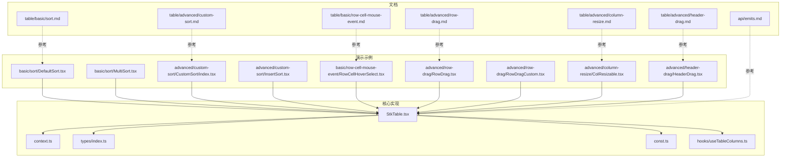
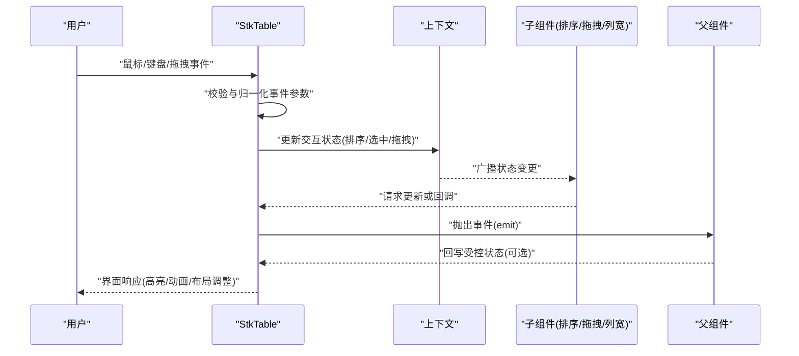
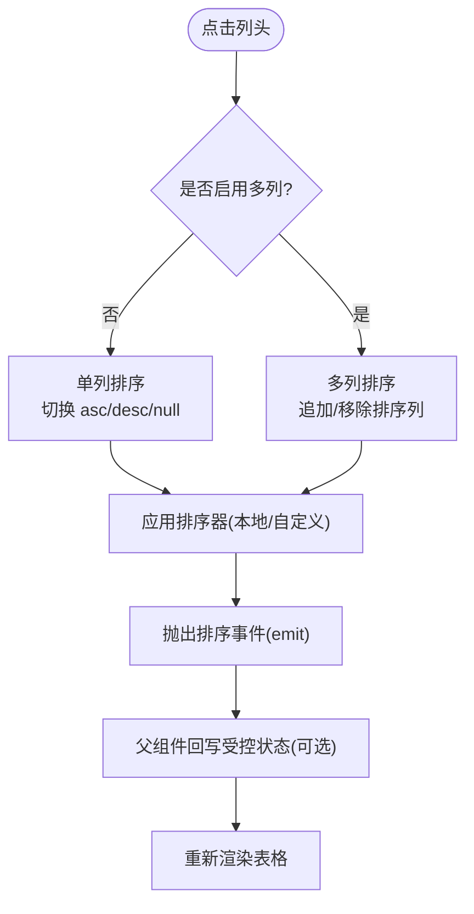
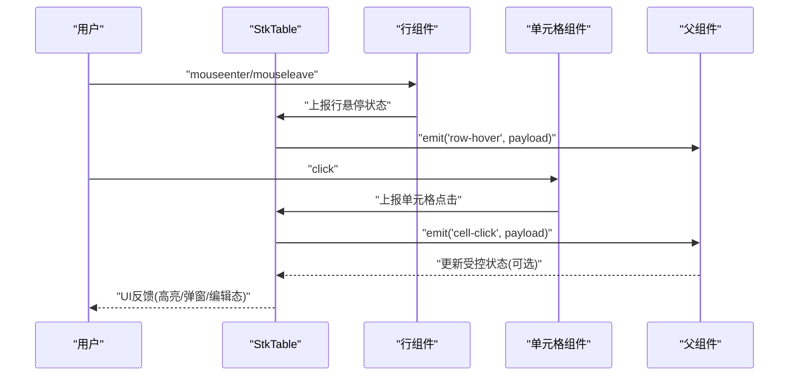
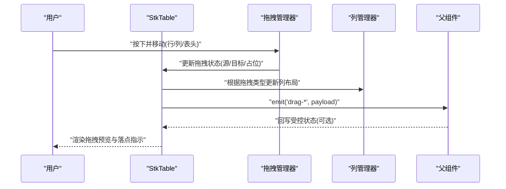
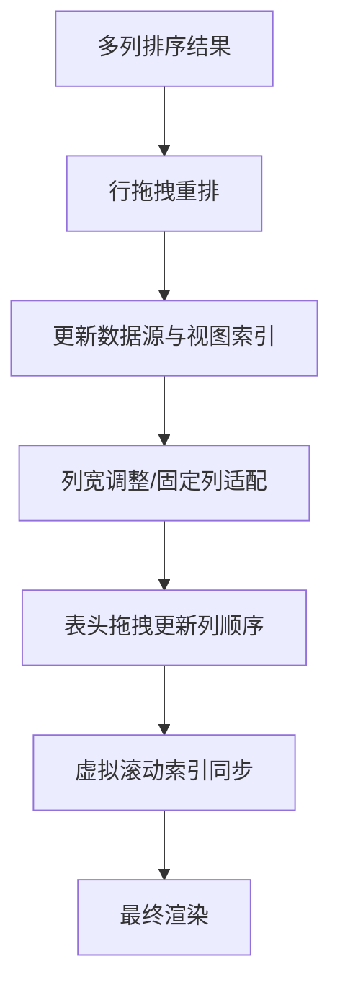
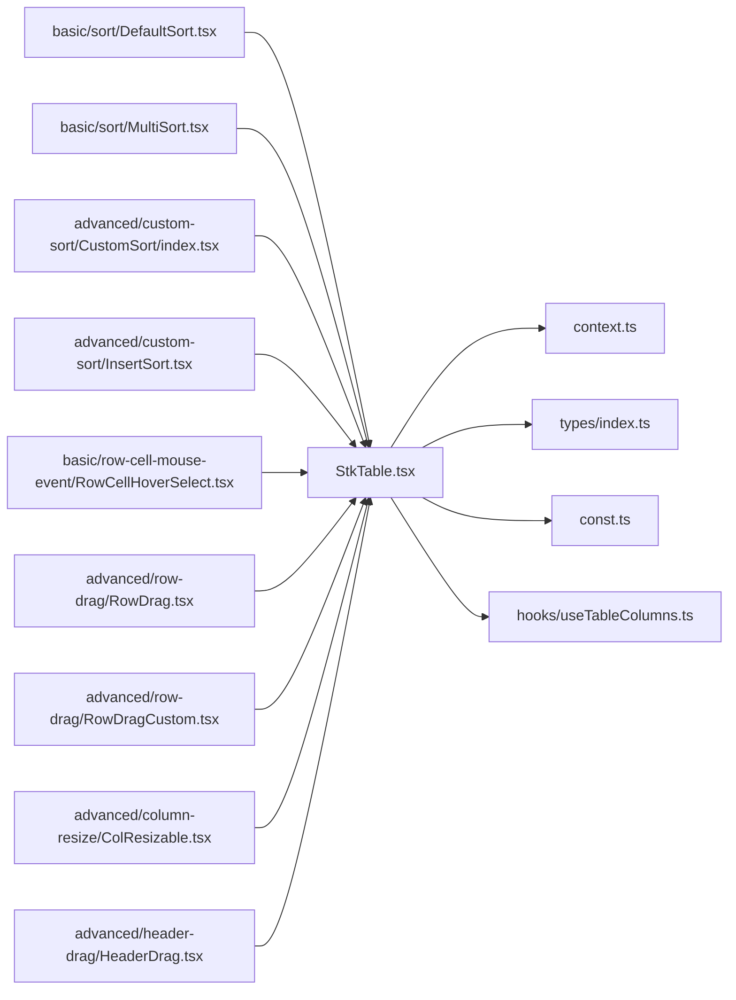

# 交互功能

<cite>
**本文引用的文件**   
- [StkTable.tsx](file://src/StkTable/StkTable.tsx)
- [index.ts](file://src/StkTable/index.ts)
- [context.ts](file://src/StkTable/context.ts)
- [useTableColumns.ts](file://src/StkTable/hooks/useTableColumns.ts)
- [const.ts](file://src/StkTable/const.ts)
- [types/index.ts](file://src/StkTable/types/index.ts)
- [basic/sort/DefaultSort.tsx](file://docs-demo/basic/sort/DefaultSort.tsx)
- [basic/sort/MultiSort.tsx](file://docs-demo/basic/sort/MultiSort.tsx)
- [advanced/custom-sort/CustomSort/index.tsx](file://docs-demo/advanced/custom-sort/CustomSort/index.tsx)
- [advanced/custom-sort/InsertSort.tsx](file://docs-demo/advanced/custom-sort/InsertSort.tsx)
- [basic/row-cell-mouse-event/RowCellHoverSelect.tsx](file://docs-demo/basic/row-cell-mouse-event/RowCellHoverSelect.tsx)
- [advanced/row-drag/RowDrag.tsx](file://docs-demo/advanced/row-drag/RowDrag.tsx)
- [advanced/row-drag/RowDragCustom.tsx](file://docs-demo/advanced/row-drag/RowDragCustom.tsx)
- [advanced/column-resize/ColResizable.tsx](file://docs-demo/advanced/column-resize/ColResizable.tsx)
- [advanced/header-drag/HeaderDrag.tsx](file://docs-demo/advanced/header-drag/HeaderDrag.tsx)
- [api/emits.md](file://docs-src/main/api/emits.md)
- [table/advanced/custom-sort.md](file://docs-src/main/table/advanced/custom-sort.md)
- [table/advanced/row-drag.md](file://docs-src/main/table/advanced/row-drag.md)
- [table/advanced/column-resize.md](file://docs-src/main/table/advanced/column-resize.md)
- [table/advanced/header-drag.md](file://docs-src/main/table/advanced/header-drag.md)
- [table/basic/sort.md](file://docs-src/main/table/basic/sort.md)
- [table/basic/row-cell-mouse-event.md](file://docs-src/main/table/basic/row-cell-mouse-event.md)
</cite>

## 目录
1. [简介](#简介)
2. [项目结构](#项目结构)
3. [核心组件](#核心组件)
4. [架构总览](#架构总览)
5. [详细组件分析](#详细组件分析)
6. [依赖关系分析](#依赖关系分析)
7. [性能考量](#性能考量)
8. [故障排查指南](#故障排查指南)
9. [结论](#结论)
10. [附录](#附录)

## 简介
本章节聚焦 StkTable 的丰富交互能力，包括排序（单列、多列、自定义）、鼠标事件处理（行悬停、单元格点击）、拖拽操作（行拖拽、列宽调整、表头拖拽）等高级特性。文档将提供完整的事件处理示例与回调用法说明，解释交互状态的管理与同步机制，并给出动画效果、键盘导航和无障碍支持的最佳实践，帮助开发者快速构建专业级的表格交互体验。

## 项目结构
围绕交互功能的代码主要分布在以下位置：
- 核心实现：src/StkTable 下的主组件、上下文、类型与常量定义
- 演示示例：docs-demo 下按功能分类的示例页面
- 文档说明：docs-src 下对应功能的 API 与使用指南

图表来源
- [StkTable.tsx](file://src/StkTable/StkTable.tsx)
- [context.ts](file://src/StkTable/context.ts)
- [types/index.ts](file://src/StkTable/types/index.ts)
- [const.ts](file://src/StkTable/const.ts)
- [useTableColumns.ts](file://src/StkTable/hooks/useTableColumns.ts)
- [basic/sort/DefaultSort.tsx](file://docs-demo/basic/sort/DefaultSort.tsx)
- [basic/sort/MultiSort.tsx](file://docs-demo/basic/sort/MultiSort.tsx)
- [advanced/custom-sort/CustomSort/index.tsx](file://docs-demo/advanced/custom-sort/CustomSort/index.tsx)
- [advanced/custom-sort/InsertSort.tsx](file://docs-demo/advanced/custom-sort/InsertSort.tsx)
- [basic/row-cell-mouse-event/RowCellHoverSelect.tsx](file://docs-demo/basic/row-cell-mouse-event/RowCellHoverSelect.tsx)
- [advanced/row-drag/RowDrag.tsx](file://docs-demo/advanced/row-drag/RowDrag.tsx)
- [advanced/row-drag/RowDragCustom.tsx](file://docs-demo/advanced/row-drag/RowDragCustom.tsx)
- [advanced/column-resize/ColResizable.tsx](file://docs-demo/advanced/column-resize/ColResizable.tsx)
- [advanced/header-drag/HeaderDrag.tsx](file://docs-demo/advanced/header-drag/HeaderDrag.tsx)

章节来源
- [StkTable.tsx](file://src/StkTable/StkTable.tsx)
- [index.ts](file://src/StkTable/index.ts)
- [context.ts](file://src/StkTable/context.ts)
- [useTableColumns.ts](file://src/StkTable/hooks/useTableColumns.ts)
- [const.ts](file://src/StkTable/const.ts)
- [types/index.ts](file://src/StkTable/types/index.ts)

## 核心组件
- StkTable 主组件负责渲染表格、聚合各交互模块（排序、拖拽、列宽调整、鼠标事件等），并通过上下文向子组件分发状态与回调。
- 上下文 context 用于跨层级共享交互状态（如当前排序键、选中行、拖拽源/目标等）。
- 类型定义 types 统一了事件参数、回调签名与配置项，确保交互行为在类型层面可追踪。
- 常量 const 定义了交互相关的默认值与枚举。
- useTableColumns 钩子封装列解析与计算逻辑，为排序、拖拽、列宽调整等提供数据基础。

章节来源
- [StkTable.tsx](file://src/StkTable/StkTable.tsx)
- [context.ts](file://src/StkTable/context.ts)
- [types/index.ts](file://src/StkTable/types/index.ts)
- [const.ts](file://src/StkTable/const.ts)
- [useTableColumns.ts](file://src/StkTable/hooks/useTableColumns.ts)

## 架构总览
下图展示了交互相关的主要流程：用户输入触发事件，StkTable 接收并更新内部状态，通过上下文通知相关子组件重渲染；同时向上抛出事件供父组件监听，完成双向同步。

图表来源
- [StkTable.tsx](file://src/StkTable/StkTable.tsx)
- [context.ts](file://src/StkTable/context.ts)
- [api/emits.md](file://docs-src/main/api/emits.md)

## 详细组件分析

### 排序功能（单列、多列、自定义）
- 单列排序：点击列头切换升序/降序/无排序，适合简单列表。
- 多列排序：按住修饰键依次点击多个列头，形成多级排序优先级。
- 自定义排序：通过比较函数或远程排序接口，实现复杂业务规则（如插入式排序、区域化排序等）。

图表来源
- [basic/sort/DefaultSort.tsx](file://docs-demo/basic/sort/DefaultSort.tsx)
- [basic/sort/MultiSort.tsx](file://docs-demo/basic/sort/MultiSort.tsx)
- [advanced/custom-sort/CustomSort/index.tsx](file://docs-demo/advanced/custom-sort/CustomSort/index.tsx)
- [advanced/custom-sort/InsertSort.tsx](file://docs-demo/advanced/custom-sort/InsertSort.tsx)
- [table/basic/sort.md](file://docs-src/main/table/basic/sort.md)
- [table/advanced/custom-sort.md](file://docs-src/main/table/advanced/custom-sort.md)

章节来源
- [basic/sort/DefaultSort.tsx](file://docs-demo/basic/sort/DefaultSort.tsx)
- [basic/sort/MultiSort.tsx](file://docs-demo/basic/sort/MultiSort.tsx)
- [advanced/custom-sort/CustomSort/index.tsx](file://docs-demo/advanced/custom-sort/CustomSort/index.tsx)
- [advanced/custom-sort/InsertSort.tsx](file://docs-demo/advanced/custom-sort/InsertSort.tsx)
- [table/basic/sort.md](file://docs-src/main/table/basic/sort.md)
- [table/advanced/custom-sort.md](file://docs-src/main/table/advanced/custom-sort.md)

### 鼠标事件处理（行悬停、单元格点击）
- 行悬停：在行上移动鼠标时触发高亮或预览信息，提升定位效率。
- 单元格点击：捕获单元格点击事件，结合编辑、选择、展开等场景进行联动。
- 事件冒泡控制：避免与拖拽、多选等交互冲突。

图表来源
- [basic/row-cell-mouse-event/RowCellHoverSelect.tsx](file://docs-demo/basic/row-cell-mouse-event/RowCellHoverSelect.tsx)
- [table/basic/row-cell-mouse-event.md](file://docs-src/main/table/basic/row-cell-mouse-event.md)
- [api/emits.md](file://docs-src/main/api/emits.md)

章节来源
- [basic/row-cell-mouse-event/RowCellHoverSelect.tsx](file://docs-demo/basic/row-cell-mouse-event/RowCellHoverSelect.tsx)
- [table/basic/row-cell-mouse-event.md](file://docs-src/main/table/basic/row-cell-mouse-event.md)
- [api/emits.md](file://docs-src/main/api/emits.md)

### 拖拽操作（行拖拽、列宽调整、表头拖拽）
- 行拖拽：支持行间重排、跨表拖入、拖拽占位提示与动画过渡。
- 列宽调整：拖动列边界实时调整宽度，支持最小/最大宽度限制与吸附对齐。
- 表头拖拽：支持列顺序调整、分组与固定列联动。

图表来源
- [advanced/row-drag/RowDrag.tsx](file://docs-demo/advanced/row-drag/RowDrag.tsx)
- [advanced/row-drag/RowDragCustom.tsx](file://docs-demo/advanced/row-drag/RowDragCustom.tsx)
- [advanced/column-resize/ColResizable.tsx](file://docs-demo/advanced/column-resize/ColResizable.tsx)
- [advanced/header-drag/HeaderDrag.tsx](file://docs-demo/advanced/header-drag/HeaderDrag.tsx)
- [table/advanced/row-drag.md](file://docs-src/main/table/advanced/row-drag.md)
- [table/advanced/column-resize.md](file://docs-src/main/table/advanced/column-resize.md)
- [table/advanced/header-drag.md](file://docs-src/main/table/advanced/header-drag.md)

章节来源
- [advanced/row-drag/RowDrag.tsx](file://docs-demo/advanced/row-drag/RowDrag.tsx)
- [advanced/row-drag/RowDragCustom.tsx](file://docs-demo/advanced/row-drag/RowDragCustom.tsx)
- [advanced/column-resize/ColResizable.tsx](file://docs-demo/advanced/column-resize/ColResizable.tsx)
- [advanced/header-drag/HeaderDrag.tsx](file://docs-demo/advanced/header-drag/HeaderDrag.tsx)
- [table/advanced/row-drag.md](file://docs-src/main/table/advanced/row-drag.md)
- [table/advanced/column-resize.md](file://docs-src/main/table/advanced/column-resize.md)
- [table/advanced/header-drag.md](file://docs-src/main/table/advanced/header-drag.md)

### 复杂交互场景案例
- 组合排序+行拖拽：先通过多列排序确定优先级，再对结果集进行行级重排，保持排序与拖拽的一致性。
- 列宽调整+固定列：在固定模式下动态调整列宽，确保固定列与滚动区域协调。
- 表头拖拽+虚拟滚动：在大数据量场景下，拖拽列顺序需与虚拟滚动索引映射保持一致。

[此图为概念性流程图，不直接映射具体源码文件]

## 依赖关系分析
- 组件耦合：StkTable 作为中心节点，依赖上下文与类型定义；各交互示例通过 props/events 与其通信。
- 外部依赖：事件系统通过 emit 暴露给父组件，便于上层状态管理库集成。
- 潜在循环：示例之间相互独立，避免直接互相引用，降低耦合风险。

图表来源
- [StkTable.tsx](file://src/StkTable/StkTable.tsx)
- [context.ts](file://src/StkTable/context.ts)
- [types/index.ts](file://src/StkTable/types/index.ts)
- [const.ts](file://src/StkTable/const.ts)
- [useTableColumns.ts](file://src/StkTable/hooks/useTableColumns.ts)
- [basic/sort/DefaultSort.tsx](file://docs-demo/basic/sort/DefaultSort.tsx)
- [basic/sort/MultiSort.tsx](file://docs-demo/basic/sort/MultiSort.tsx)
- [advanced/custom-sort/CustomSort/index.tsx](file://docs-demo/advanced/custom-sort/CustomSort/index.tsx)
- [advanced/custom-sort/InsertSort.tsx](file://docs-demo/advanced/custom-sort/InsertSort.tsx)
- [basic/row-cell-mouse-event/RowCellHoverSelect.tsx](file://docs-demo/basic/row-cell-mouse-event/RowCellHoverSelect.tsx)
- [advanced/row-drag/RowDrag.tsx](file://docs-demo/advanced/row-drag/RowDrag.tsx)
- [advanced/row-drag/RowDragCustom.tsx](file://docs-demo/advanced/row-drag/RowDragCustom.tsx)
- [advanced/column-resize/ColResizable.tsx](file://docs-demo/advanced/column-resize/ColResizable.tsx)
- [advanced/header-drag/HeaderDrag.tsx](file://docs-demo/advanced/header-drag/HeaderDrag.tsx)

章节来源
- [StkTable.tsx](file://src/StkTable/StkTable.tsx)
- [index.ts](file://src/StkTable/index.ts)

## 性能考量
- 大列表优化：优先使用虚拟滚动与按需渲染，减少 DOM 节点数量。
- 事件节流：对高频事件（mousemove、scroll）进行节流或防抖，避免频繁重渲染。
- 状态合并：将多次交互产生的状态变更合并提交，减少中间渲染次数。
- 计算缓存：对排序、列宽、索引映射等计算结果进行缓存，必要时使用稳定 key 避免不必要的重建。

[本节为通用指导，不直接分析具体文件]

## 故障排查指南
- 事件未触发：检查事件冒泡是否被阻止，确认绑定元素是否正确且未被覆盖。
- 状态不同步：确认父组件是否以受控模式回写状态，以及 emit 回调是否被正确监听。
- 拖拽异常：验证拖拽源/目标的数据标识是否唯一，确保索引映射与虚拟滚动一致。
- 列宽异常：检查最小/最大宽度约束与固定列布局是否冲突。

章节来源
- [api/emits.md](file://docs-src/main/api/emits.md)

## 结论
StkTable 提供了完善的交互能力与清晰的扩展点。通过合理的事件处理、状态管理与性能优化策略，开发者可以快速构建具备专业用户体验的表格应用。建议在实际项目中结合业务需求选择合适的交互组合，并遵循无障碍与可访问性最佳实践。

[本节为总结性内容，不直接分析具体文件]

## 附录
- 事件与回调参考：参见 emits 文档，了解各交互事件的参数结构与调用时机。
- 功能文档：参考 sort、row-drag、column-resize、header-drag、row-cell-mouse-event 等文档获取更详细的配置与示例。

章节来源
- [api/emits.md](file://docs-src/main/api/emits.md)
- [table/basic/sort.md](file://docs-src/main/table/basic/sort.md)
- [table/advanced/custom-sort.md](file://docs-src/main/table/advanced/custom-sort.md)
- [table/advanced/row-drag.md](file://docs-src/main/table/advanced/row-drag.md)
- [table/advanced/column-resize.md](file://docs-src/main/table/advanced/column-resize.md)
- [table/advanced/header-drag.md](file://docs-src/main/table/advanced/header-drag.md)
- [table/basic/row-cell-mouse-event.md](file://docs-src/main/table/basic/row-cell-mouse-event.md)