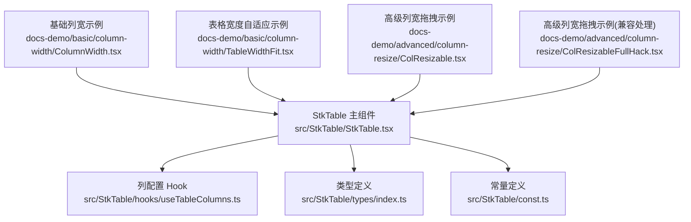
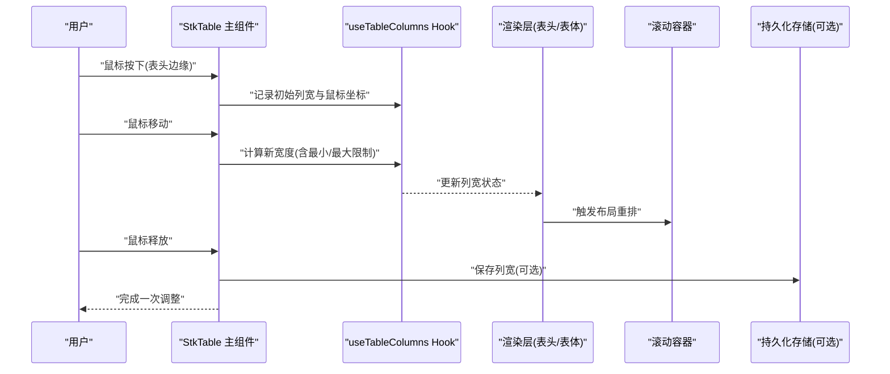
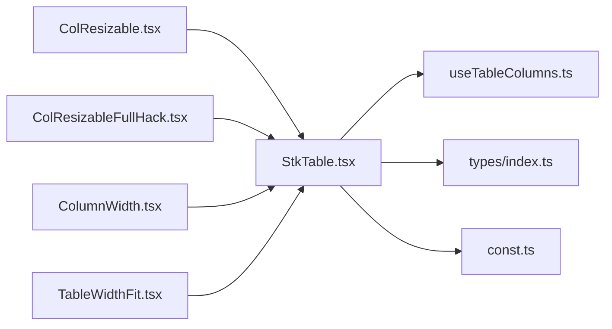

# 列宽调整

<cite>
**本文引用的文件**   
- [src/StkTable/StkTable.tsx](file://src/StkTable/StkTable.tsx)
- [src/StkTable/hooks/useTableColumns.ts](file://src/StkTable/hooks/useTableColumns.ts)
- [src/StkTable/types/index.ts](file://src/StkTable/types/index.ts)
- [src/StkTable/const.ts](file://src/StkTable/const.ts)
- [docs-demo/advanced/column-resize/ColResizable.tsx](file://docs-demo/advanced/column-resize/ColResizable.tsx)
- [docs-demo/advanced/column-resize/ColResizableFullHack.tsx](file://docs-demo/advanced/column-resize/ColResizableFullHack.tsx)
- [docs-demo/basic/column-width/ColumnWidth.tsx](file://docs-demo/basic/column-width/ColumnWidth.tsx)
- [docs-demo/basic/column-width/TableWidthFit.tsx](file://docs-demo/basic/column-width/TableWidthFit.tsx)
- [docs-src/main/table/advanced/column-resize.md](file://docs-src/main/table/advanced/column-resize.md)
- [docs-src/main/table/basic/column-width.md](file://docs-src/main/table/basic/column-width.md)
</cite>

## 目录
1. [简介](#简介)
2. [项目结构](#项目结构)
3. [核心组件](#核心组件)
4. [架构总览](#架构总览)
5. [详细组件分析](#详细组件分析)
6. [依赖分析](#依赖分析)
7. [性能考虑](#性能考虑)
8. [故障排查指南](#故障排查指南)
9. [结论](#结论)
10. [附录](#附录)

## 简介
本章节聚焦 StkTable 的“列宽调整”能力，围绕以下目标展开：
- 实现列宽的拖拽调整：包括调整手柄的定位与交互逻辑
- 边界限制与最小/最大宽度控制
- 响应式布局下的适配策略（固定列与滚动容器协调）
- 列宽状态管理与持久化存储方案
- 大量列场景的性能优化与内存管理
- 高级场景案例：百分比宽度、自适应宽度、动态列

## 项目结构
与列宽调整相关的代码主要分布在以下位置：
- 核心实现：StkTable 主组件、列配置 Hook、类型定义与常量
- 文档示例：基础列宽设置、表格宽度自适应、高级列宽拖拽示例
- 文档说明：API 与使用指南

图表来源
- [src/StkTable/StkTable.tsx](file://src/StkTable/StkTable.tsx)
- [src/StkTable/hooks/useTableColumns.ts](file://src/StkTable/hooks/useTableColumns.ts)
- [src/StkTable/types/index.ts](file://src/StkTable/types/index.ts)
- [src/StkTable/const.ts](file://src/StkTable/const.ts)
- [docs-demo/basic/column-width/ColumnWidth.tsx](file://docs-demo/basic/column-width/ColumnWidth.tsx)
- [docs-demo/basic/column-width/TableWidthFit.tsx](file://docs-demo/basic/column-width/TableWidthFit.tsx)
- [docs-demo/advanced/column-resize/ColResizable.tsx](file://docs-demo/advanced/column-resize/ColResizable.tsx)
- [docs-demo/advanced/column-resize/ColResizableFullHack.tsx](file://docs-demo/advanced/column-resize/ColResizableFullHack.tsx)

章节来源
- [src/StkTable/StkTable.tsx](file://src/StkTable/StkTable.tsx)
- [src/StkTable/hooks/useTableColumns.ts](file://src/StkTable/hooks/useTableColumns.ts)
- [src/StkTable/types/index.ts](file://src/StkTable/types/index.ts)
- [src/StkTable/const.ts](file://src/StkTable/const.ts)
- [docs-demo/basic/column-width/ColumnWidth.tsx](file://docs-demo/basic/column-width/ColumnWidth.tsx)
- [docs-demo/basic/column-width/TableWidthFit.tsx](file://docs-demo/basic/column-width/TableWidthFit.tsx)
- [docs-demo/advanced/column-resize/ColResizable.tsx](file://docs-demo/advanced/column-resize/ColResizable.tsx)
- [docs-demo/advanced/column-resize/ColResizableFullHack.tsx](file://docs-demo/advanced/column-resize/ColResizableFullHack.tsx)

## 核心组件
- StkTable 主组件：负责渲染表头、表体、滚动容器、固定列等；集成列宽调整相关事件与样式。
- useTableColumns Hook：集中管理列配置与列宽状态，提供计算与更新接口。
- 类型与常量：定义列宽属性、最小/最大宽度、默认值等约束。

章节来源
- [src/StkTable/StkTable.tsx](file://src/StkTable/StkTable.tsx)
- [src/StkTable/hooks/useTableColumns.ts](file://src/StkTable/hooks/useTableColumns.ts)
- [src/StkTable/types/index.ts](file://src/StkTable/types/index.ts)
- [src/StkTable/const.ts](file://src/StkTable/const.ts)

## 架构总览
列宽调整的整体流程如下：
- 用户在表头右侧边缘触发拖拽
- 系统记录初始鼠标位置与列宽
- 在拖拽过程中实时计算新宽度并应用
- 释放时落盘或回调通知上层
- 结合固定列与滚动容器进行布局重排

图表来源
- [src/StkTable/StkTable.tsx](file://src/StkTable/StkTable.tsx)
- [src/StkTable/hooks/useTableColumns.ts](file://src/StkTable/hooks/useTableColumns.ts)

## 详细组件分析

### 拖拽手柄定位与交互逻辑
- 手柄定位：在表头单元格右侧绘制可拖拽区域，通常通过绝对定位或伪元素实现，确保与列内容对齐。
- 交互流程：
  - mousedown：记录当前列的 key、初始宽度、起始鼠标 X 坐标，进入拖拽态
  - mousemove：计算 delta = 当前X - 起始X，新宽度 = 初始宽度 + delta，应用最小/最大限制
  - mouseup：结束拖拽，触发回调或持久化
- 注意事项：
  - 防止文本选中与默认拖拽行为
  - 在虚拟滚动或横向滚动容器中，需将鼠标坐标转换为相对滚动容器的偏移
  - 多列同时调整时需避免冲突（一般仅支持单列调整）

章节来源
- [src/StkTable/StkTable.tsx](file://src/StkTable/StkTable.tsx)
- [docs-demo/advanced/column-resize/ColResizable.tsx](file://docs-demo/advanced/column-resize/ColResizable.tsx)
- [docs-demo/advanced/column-resize/ColResizableFullHack.tsx](file://docs-demo/advanced/column-resize/ColResizableFullHack.tsx)

### 边界限制与最小/最大宽度控制
- 最小宽度：保证列内容可读性，避免过窄导致信息丢失
- 最大宽度：防止某列过度扩张挤压其他列
- 计算策略：
  - 新宽度 = clamp(初始宽度 + delta, min, max)
  - 当所有列达到上限且继续拉伸时，可选择拒绝调整或按比例分配剩余空间（视业务需求）
- 配置来源：
  - 列级最小/最大宽度
  - 全局默认值（常量）

章节来源
- [src/StkTable/types/index.ts](file://src/StkTable/types/index.ts)
- [src/StkTable/const.ts](file://src/StkTable/const.ts)
- [src/StkTable/hooks/useTableColumns.ts](file://src/StkTable/hooks/useTableColumns.ts)

### 响应式布局与固定列协调
- 响应式适配：
  - 监听容器尺寸变化，必要时重新计算列宽或启用自适应模式
  - 在小屏下优先保证关键列可见，隐藏次要列或启用横向滚动
- 固定列协调：
  - 固定列不参与拖拽，但需随非固定列的总宽度同步滚动
  - 拖拽后需同步更新固定列区域的偏移量，保持视觉一致
- 滚动容器：
  - 横向滚动容器宽度应等于所有列宽之和
  - 拖拽过程中实时更新滚动容器宽度，避免错位

章节来源
- [src/StkTable/StkTable.tsx](file://src/StkTable/StkTable.tsx)
- [docs-demo/basic/column-width/TableWidthFit.tsx](file://docs-demo/basic/column-width/TableWidthFit.tsx)

### 列宽状态管理与持久化
- 状态管理：
  - 使用 Hook 维护列宽映射 { columnKey: width }
  - 提供 setColumnWidth(key, width) 更新接口
- 持久化方案：
  - 本地存储：localStorage/sessionStorage
  - 服务端存储：用户维度配置接口
  - 变更时机：拖拽结束时写入，或在节流间隔内批量写入
- 初始化策略：
  - 优先读取持久化配置
  - 若不存在则回退到默认列宽或根据内容自适应

章节来源
- [src/StkTable/hooks/useTableColumns.ts](file://src/StkTable/hooks/useTableColumns.ts)
- [docs-src/main/table/advanced/column-resize.md](file://docs-src/main/table/advanced/column-resize.md)

### 性能优化与内存管理
- 大量列优化：
  - 使用 requestAnimationFrame 合并多次宽度更新
  - 对高频事件进行节流/防抖
  - 避免在拖拽中触发完整重绘，尽量只更新必要 DOM
- 虚拟滚动配合：
  - 仅渲染可视区域内的行与列
  - 列宽变更后仅更新受影响区域的布局
- 内存管理：
  - 及时移除全局 mousemove/mouseup 监听器
  - 避免闭包持有大对象引用

章节来源
- [src/StkTable/StkTable.tsx](file://src/StkTable/StkTable.tsx)
- [src/StkTable/hooks/useTableColumns.ts](file://src/StkTable/hooks/useTableColumns.ts)

### 高级场景案例
- 百分比宽度：
  - 列宽以百分比表示时，需在容器宽度变化时重新计算像素宽度
  - 拖拽时可将百分比转为像素，结束后再转回百分比
- 自适应宽度：
  - 基于内容测量（如临时节点或浏览器 API）估算最小宽度
  - 在首次渲染或数据变化后自动调整
- 动态列：
  - 新增/删除列时，保留已有列的宽度配置
  - 为新列提供默认宽度或自适应策略

章节来源
- [docs-demo/basic/column-width/ColumnWidth.tsx](file://docs-demo/basic/column-width/ColumnWidth.tsx)
- [docs-demo/basic/column-width/TableWidthFit.tsx](file://docs-demo/basic/column-width/TableWidthFit.tsx)
- [docs-src/main/table/basic/column-width.md](file://docs-src/main/table/basic/column-width.md)

## 依赖分析
- StkTable 主组件依赖：
  - useTableColumns Hook：列宽状态与更新逻辑
  - types/index.ts：列宽相关类型定义
  - const.ts：默认值与常量
- 示例组件依赖：
  - ColResizable 系列：演示高级拖拽用法
  - ColumnWidth / TableWidthFit：演示基础列宽与自适应

图表来源
- [src/StkTable/StkTable.tsx](file://src/StkTable/StkTable.tsx)
- [src/StkTable/hooks/useTableColumns.ts](file://src/StkTable/hooks/useTableColumns.ts)
- [src/StkTable/types/index.ts](file://src/StkTable/types/index.ts)
- [src/StkTable/const.ts](file://src/StkTable/const.ts)
- [docs-demo/advanced/column-resize/ColResizable.tsx](file://docs-demo/advanced/column-resize/ColResizable.tsx)
- [docs-demo/advanced/column-resize/ColResizableFullHack.tsx](file://docs-demo/advanced/column-resize/ColResizableFullHack.tsx)
- [docs-demo/basic/column-width/ColumnWidth.tsx](file://docs-demo/basic/column-width/ColumnWidth.tsx)
- [docs-demo/basic/column-width/TableWidthFit.tsx](file://docs-demo/basic/column-width/TableWidthFit.tsx)

章节来源
- [src/StkTable/StkTable.tsx](file://src/StkTable/StkTable.tsx)
- [src/StkTable/hooks/useTableColumns.ts](file://src/StkTable/hooks/useTableColumns.ts)
- [src/StkTable/types/index.ts](file://src/StkTable/types/index.ts)
- [src/StkTable/const.ts](file://src/StkTable/const.ts)
- [docs-demo/advanced/column-resize/ColResizable.tsx](file://docs-demo/advanced/column-resize/ColResizable.tsx)
- [docs-demo/advanced/column-resize/ColResizableFullHack.tsx](file://docs-demo/advanced/column-resize/ColResizableFullHack.tsx)
- [docs-demo/basic/column-width/ColumnWidth.tsx](file://docs-demo/basic/column-width/ColumnWidth.tsx)
- [docs-demo/basic/column-width/TableWidthFit.tsx](file://docs-demo/basic/column-width/TableWidthFit.tsx)

## 性能考虑
- 事件合并：使用 requestAnimationFrame 或节流函数减少频繁更新
- 局部更新：仅更新受影响的列与行，避免全表重绘
- 虚拟列表：结合横向/纵向虚拟化，降低 DOM 节点数量
- 资源清理：拖拽结束后立即移除全局事件监听，避免内存泄漏
- 测量优化：避免在拖拽路径中进行昂贵的布局测量，必要时缓存结果

[本节为通用指导，不直接分析具体文件]

## 故障排查指南
- 问题：拖拽无效或抖动
  - 检查是否阻止了默认拖拽与文本选择
  - 确认事件绑定在正确的表头元素上
- 问题：固定列错位
  - 核对滚动容器宽度与列宽总和的一致性
  - 检查固定列偏移量是否正确更新
- 问题：小屏显示异常
  - 验证响应式断点与列隐藏策略
  - 确认百分比/自适应宽度在不同容器宽度下的表现
- 问题：性能卡顿
  - 增加节流/防抖频率阈值
  - 减少拖拽过程中的 DOM 操作次数

章节来源
- [src/StkTable/StkTable.tsx](file://src/StkTable/StkTable.tsx)
- [docs-demo/advanced/column-resize/ColResizable.tsx](file://docs-demo/advanced/column-resize/ColResizable.tsx)

## 结论
StkTable 的列宽调整功能通过清晰的职责划分与可扩展的 Hook 设计，实现了从基础拖拽到高级场景的全面覆盖。结合响应式布局、固定列协调、状态持久化与性能优化，能够在复杂业务环境中稳定运行。建议在实际项目中根据数据规模与交互需求选择合适的优化策略，并通过示例组件快速验证效果。

[本节为总结性内容，不直接分析具体文件]

## 附录
- 参考文档
  - 高级列宽调整说明：[docs-src/main/table/advanced/column-resize.md](file://docs-src/main/table/advanced/column-resize.md)
  - 基础列宽与自适应说明：[docs-src/main/table/basic/column-width.md](file://docs-src/main/table/basic/column-width.md)
- 示例组件
  - 基础列宽：[docs-demo/basic/column-width/ColumnWidth.tsx](file://docs-demo/basic/column-width/ColumnWidth.tsx)
  - 表格宽度自适应：[docs-demo/basic/column-width/TableWidthFit.tsx](file://docs-demo/basic/column-width/TableWidthFit.tsx)
  - 高级列宽拖拽：[docs-demo/advanced/column-resize/ColResizable.tsx](file://docs-demo/advanced/column-resize/ColResizable.tsx)
  - 高级列宽拖拽(兼容处理)：[docs-demo/advanced/column-resize/ColResizableFullHack.tsx](file://docs-demo/advanced/column-resize/ColResizableFullHack.tsx)