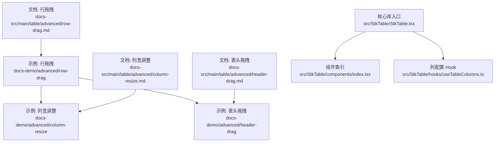
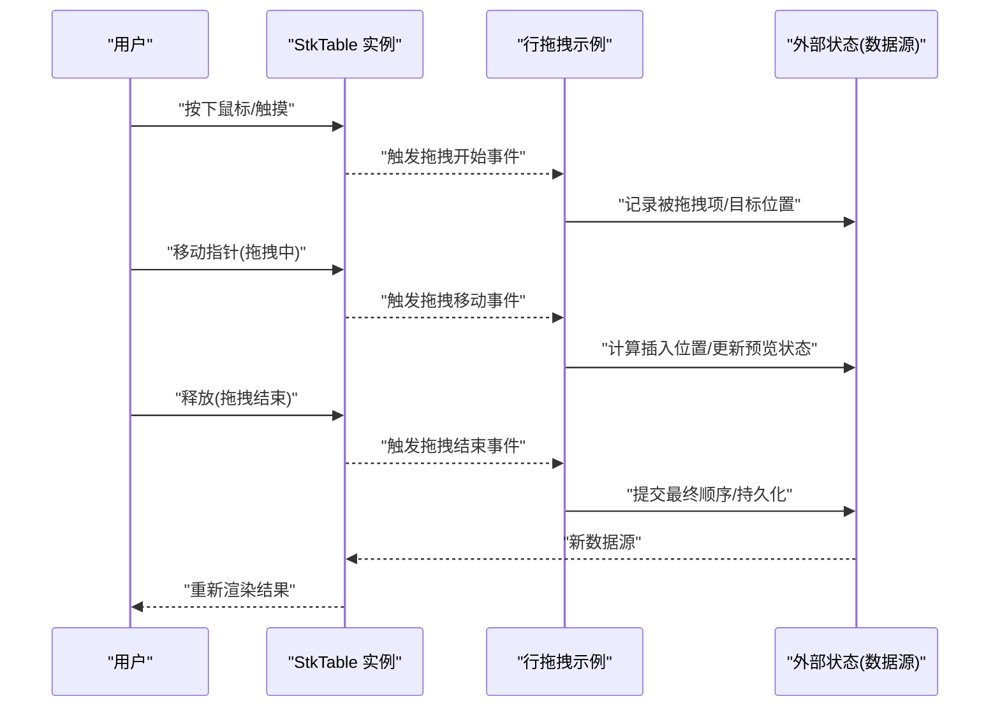
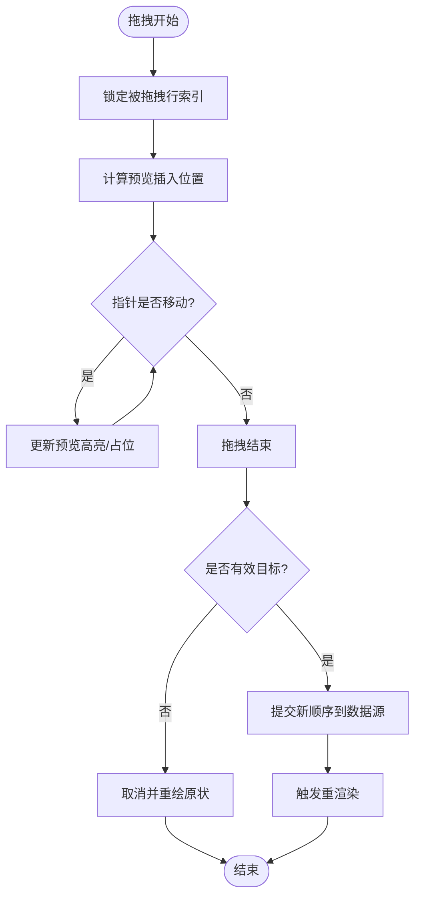
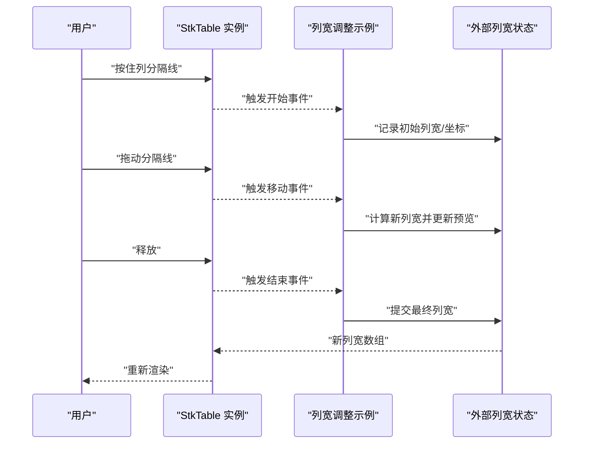
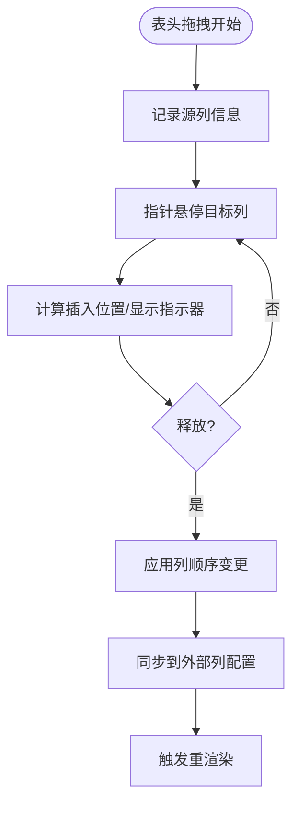
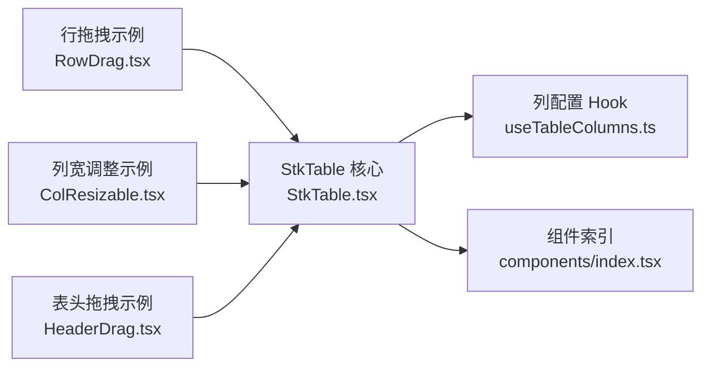

# 拖拽操作

<cite>
**本文引用的文件**   
- [RowDrag.tsx](file://docs-demo/advanced/row-drag/RowDrag.tsx)
- [RowDragCustom.tsx](file://docs-demo/advanced/row-drag/RowDragCustom.tsx)
- [ColResizable.tsx](file://docs-demo/advanced/column-resize/ColResizable.tsx)
- [ColResizableFullHack.tsx](file://docs-demo/advanced/column-resize/ColResizableFullHack.tsx)
- [HeaderDrag.tsx](file://docs-demo/advanced/header-drag/HeaderDrag.tsx)
- [StkTable.tsx](file://src/StkTable/StkTable.tsx)
- [index.tsx](file://src/StkTable/components/index.tsx)
- [useTableColumns.ts](file://src/StkTable/hooks/useTableColumns.ts)
- [table-props.md](file://docs-src/main/api/table-props.md)
- [row-drag.md](file://docs-src/main/table/advanced/row-drag.md)
- [column-resize.md](file://docs-src/main/table/advanced/column-resize.md)
- [header-drag.md](file://docs-src/main/table/advanced/header-drag.md)
</cite>

## 目录
1. [简介](#简介)
2. [项目结构](#项目结构)
3. [核心组件](#核心组件)
4. [架构总览](#架构总览)
5. [详细组件分析](#详细组件分析)
6. [依赖关系分析](#依赖关系分析)
7. [性能考量](#性能考量)
8. [故障排查指南](#故障排查指南)
9. [结论](#结论)
10. [附录](#附录)

## 简介
本章节聚焦 StkTable 的拖拽能力，覆盖行拖拽（重排序）、列宽调整、表头拖拽等高级交互。文档将阐述拖拽事件的生命周期（开始、进行中、结束），说明如何自定义样式与动画、同步状态与数据更新、处理冲突与边界情况，并通过实际案例演示多级拖拽与条件限制的实现思路。

## 项目结构
围绕拖拽相关功能，仓库包含示例与文档：
- 示例实现位于 docs-demo/advanced 下的 row-drag、column-resize、header-drag 目录
- 文档说明位于 docs-src/main/table/advanced 下对应页面
- 核心库入口与类型定义位于 src/StkTable 目录

图表来源
- [RowDrag.tsx](file://docs-demo/advanced/row-drag/RowDrag.tsx)
- [ColResizable.tsx](file://docs-demo/advanced/column-resize/ColResizable.tsx)
- [HeaderDrag.tsx](file://docs-demo/advanced/header-drag/HeaderDrag.tsx)
- [StkTable.tsx](file://src/StkTable/StkTable.tsx)
- [index.tsx](file://src/StkTable/components/index.tsx)
- [useTableColumns.ts](file://src/StkTable/hooks/useTableColumns.ts)

章节来源
- [row-drag.md](file://docs-src/main/table/advanced/row-drag.md)
- [column-resize.md](file://docs-src/main/table/advanced/column-resize.md)
- [header-drag.md](file://docs-src/main/table/advanced/header-drag.md)

## 核心组件
- 行拖拽（重排序）
  - 通过示例展示如何启用行拖拽、监听拖拽事件、在回调中更新数据源并触发渲染
  - 支持自定义拖拽手柄、占位符样式与过渡动画
- 列宽调整
  - 通过示例展示如何开启列宽拖拽、设置最小/最大宽度、同步列宽到外部状态
- 表头拖拽
  - 通过示例展示如何在表头区域启用拖拽以改变列顺序或执行其他业务逻辑

章节来源
- [RowDrag.tsx](file://docs-demo/advanced/row-drag/RowDrag.tsx)
- [RowDragCustom.tsx](file://docs-demo/advanced/row-drag/RowDragCustom.tsx)
- [ColResizable.tsx](file://docs-demo/advanced/column-resize/ColResizable.tsx)
- [ColResizableFullHack.tsx](file://docs-demo/advanced/column-resize/ColResizableFullHack.tsx)
- [HeaderDrag.tsx](file://docs-demo/advanced/header-drag/HeaderDrag.tsx)

## 架构总览
StkTable 提供统一的表格渲染与交互能力，拖拽相关特性由“示例层 + 文档说明 + 核心库”协同完成：
- 示例层：通过 props 和回调组合出具体行为（如行重排、列宽变更、表头拖拽）
- 文档层：解释 API 使用方式与最佳实践
- 核心库：提供基础渲染、列配置管理、事件分发与上下文共享

图表来源
- [RowDrag.tsx](file://docs-demo/advanced/row-drag/RowDrag.tsx)
- [StkTable.tsx](file://src/StkTable/StkTable.tsx)

## 详细组件分析

### 行拖拽（行重排序）
- 交互流程
  - 拖拽开始：识别被拖拽行、生成占位元素、禁用默认文本选择
  - 拖拽中：根据指针位置计算插入索引，更新预览高亮/占位
  - 拖拽结束：基于目标索引对数据源进行重排，触发渲染
- 关键要点
  - 使用稳定 key 标识行，避免重排时节点错乱
  - 在拖拽过程中仅更新预览状态，落盘在结束时统一提交
  - 结合虚拟滚动时需考虑可视区映射与偏移补偿
- 自定义样式与动画
  - 通过示例提供的插槽/属性定制拖拽手柄、占位条、高亮背景
  - 使用 CSS transition 或动画库实现平滑位移效果
- 状态同步与数据更新
  - 外部状态驱动：将数据源置于外部 state，回调中返回新数组引用
  - 内部状态驱动：若使用受控模式，确保每次更新都产生新的引用以触发重渲染
- 冲突与边界
  - 固定列/冻结列：拖拽范围需排除不可动列
  - 树形/分组：仅在叶子节点或允许层级内移动
  - 空数据/单行：提前判断并禁用拖拽
  - 跨容器：如需跨表拖拽，需在结束事件中合并两个数据源

图表来源
- [RowDrag.tsx](file://docs-demo/advanced/row-drag/RowDrag.tsx)
- [RowDragCustom.tsx](file://docs-demo/advanced/row-drag/RowDragCustom.tsx)

章节来源
- [RowDrag.tsx](file://docs-demo/advanced/row-drag/RowDrag.tsx)
- [RowDragCustom.tsx](file://docs-demo/advanced/row-drag/RowDragCustom.tsx)
- [row-drag.md](file://docs-src/main/table/advanced/row-drag.md)

### 列宽调整
- 交互流程
  - 拖拽开始：定位列分隔线，记录初始列宽与起始坐标
  - 拖拽中：根据水平位移计算新列宽，应用最小/最大限制
  - 拖拽结束：将最终列宽写入外部状态，必要时触发布局重算
- 关键要点
  - 多列联动：当某列达到上限/下限，可将多余宽度分配给相邻列
  - 固定列：右侧固定列的宽度变化不应影响左侧内容区溢出
  - 虚拟滚动：列宽变更后需刷新列缓存与滚动条尺寸
- 自定义样式与动画
  - 为分隔线添加 hover/active 态样式，提升可发现性
  - 使用过渡动画使宽度变化更顺滑
- 状态同步与数据更新
  - 将列宽数组作为外部状态，回调中返回新数组引用
  - 若存在响应式布局，可在窗口 resize 时回退到自适应策略
- 冲突与边界
  - 最小/最大宽度约束
  - 最后一列特殊处理（例如撑满剩余空间）
  - 与列隐藏/显示切换时的宽度一致性

图表来源
- [ColResizable.tsx](file://docs-demo/advanced/column-resize/ColResizable.tsx)
- [ColResizableFullHack.tsx](file://docs-demo/advanced/column-resize/ColResizableFullHack.tsx)

章节来源
- [ColResizable.tsx](file://docs-demo/advanced/column-resize/ColResizable.tsx)
- [ColResizableFullHack.tsx](file://docs-demo/advanced/column-resize/ColResizableFullHack.tsx)
- [column-resize.md](file://docs-src/main/table/advanced/column-resize.md)

### 表头拖拽
- 交互流程
  - 拖拽开始：识别表头单元格，记录源列信息
  - 拖拽中：根据指针所在列计算目标列索引，显示插入指示器
  - 拖拽结束：交换或插入列配置，更新列顺序
- 关键要点
  - 多表头：需区分层级，仅允许同层级内交换
  - 固定列：禁止跨越固定/非固定区域
  - 列可见性：隐藏列不参与拖拽或单独处理
- 自定义样式与动画
  - 为插入指示器提供高亮边框/阴影
  - 使用过渡动画让列位置变化更自然
- 状态同步与数据更新
  - 将 columns 作为外部状态，回调中返回新列配置数组
  - 若列配置含复杂 children，需保证 key 稳定且层级一致
- 冲突与边界
  - 首尾列限制：某些场景不允许移动到首/尾
  - 重复列名/唯一键校验
  - 与排序/筛选共存时的优先级与冲突解决

图表来源
- [HeaderDrag.tsx](file://docs-demo/advanced/header-drag/HeaderDrag.tsx)

章节来源
- [HeaderDrag.tsx](file://docs-demo/advanced/header-drag/HeaderDrag.tsx)
- [header-drag.md](file://docs-src/main/table/advanced/header-drag.md)

### 复杂拖拽场景与最佳实践
- 多级拖拽
  - 行级与列级同时可用：在开始事件中明确当前作用域（行/列），避免互相干扰
  - 嵌套列表：仅允许同级内拖拽，跨级需显式转换规则
- 条件拖拽限制
  - 基于行状态（如只读/已锁定）禁用拖拽
  - 基于列属性（如固定列/隐藏列）限制拖拽范围
- 跨容器拖拽
  - 在结束事件中合并两个数据源，注意去重与稳定性
- 与虚拟滚动协作
  - 拖拽预览需映射到可视区索引
  - 结束提交后刷新虚拟列表缓存
- 动画与性能
  - 使用 GPU 加速的 transform 做占位位移
  - 批量更新状态，减少中间渲染次数

[本节为概念性总结，不直接分析具体文件]

## 依赖关系分析
- 示例与文档
  - 示例代码通过 props 与回调接入 StkTable，文档页面对应说明其用法
- 核心库
  - StkTable 负责渲染与事件分发；useTableColumns 管理列配置；components 聚合子组件

图表来源
- [RowDrag.tsx](file://docs-demo/advanced/row-drag/RowDrag.tsx)
- [ColResizable.tsx](file://docs-demo/advanced/column-resize/ColResizable.tsx)
- [HeaderDrag.tsx](file://docs-demo/advanced/header-drag/HeaderDrag.tsx)
- [StkTable.tsx](file://src/StkTable/StkTable.tsx)
- [useTableColumns.ts](file://src/StkTable/hooks/useTableColumns.ts)
- [index.tsx](file://src/StkTable/components/index.tsx)

章节来源
- [StkTable.tsx](file://src/StkTable/StkTable.tsx)
- [index.tsx](file://src/StkTable/components/index.tsx)
- [useTableColumns.ts](file://src/StkTable/hooks/useTableColumns.ts)

## 性能考量
- 拖拽预览尽量轻量：仅更新必要的高亮/占位状态，避免全量重排
- 大数据集：结合虚拟滚动，延迟真实数据更新至拖拽结束
- 列宽变更：批量计算并一次性提交，避免多次重排
- 动画优化：优先使用 transform/opacity，减少布局抖动
- 事件节流：在高频移动事件中节流计算，降低主线程压力

[本节为通用建议，不直接分析具体文件]

## 故障排查指南
- 行重排后顺序错乱
  - 检查每行的 key 是否稳定且唯一
  - 确认回调返回的新数组引用是否正确
- 列宽异常或溢出
  - 检查最小/最大宽度约束是否合理
  - 固定列与内容列的宽度计算是否相互影响
- 表头拖拽无效
  - 确认表头区域是否拦截了原生拖拽事件
  - 多表头层级是否正确识别
- 与虚拟滚动冲突
  - 拖拽结束后是否刷新了虚拟列表缓存
  - 可视区索引映射是否正确
- 与其他交互冲突（排序/筛选/多选）
  - 明确交互优先级，必要时在开始阶段禁用其他交互

章节来源
- [row-drag.md](file://docs-src/main/table/advanced/row-drag.md)
- [column-resize.md](file://docs-src/main/table/advanced/column-resize.md)
- [header-drag.md](file://docs-src/main/table/advanced/header-drag.md)

## 结论
StkTable 的拖拽能力通过“示例 + 文档 + 核心库”的组合，提供了行重排序、列宽调整、表头拖拽等常用交互。借助稳定的 key、外部状态驱动与合理的生命周期处理，可以在复杂场景下实现流畅、可控的拖拽体验。配合动画与性能优化策略，可获得更好的用户体验。

[本节为总结性内容，不直接分析具体文件]

## 附录
- 参考文档
  - [表格属性](file://docs-src/main/api/table-props.md)
  - [行拖拽文档](file://docs-src/main/table/advanced/row-drag.md)
  - [列宽调整文档](file://docs-src/main/table/advanced/column-resize.md)
  - [表头拖拽文档](file://docs-src/main/table/advanced/header-drag.md)