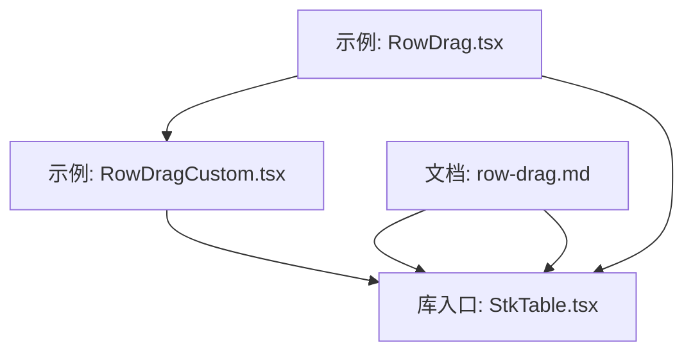
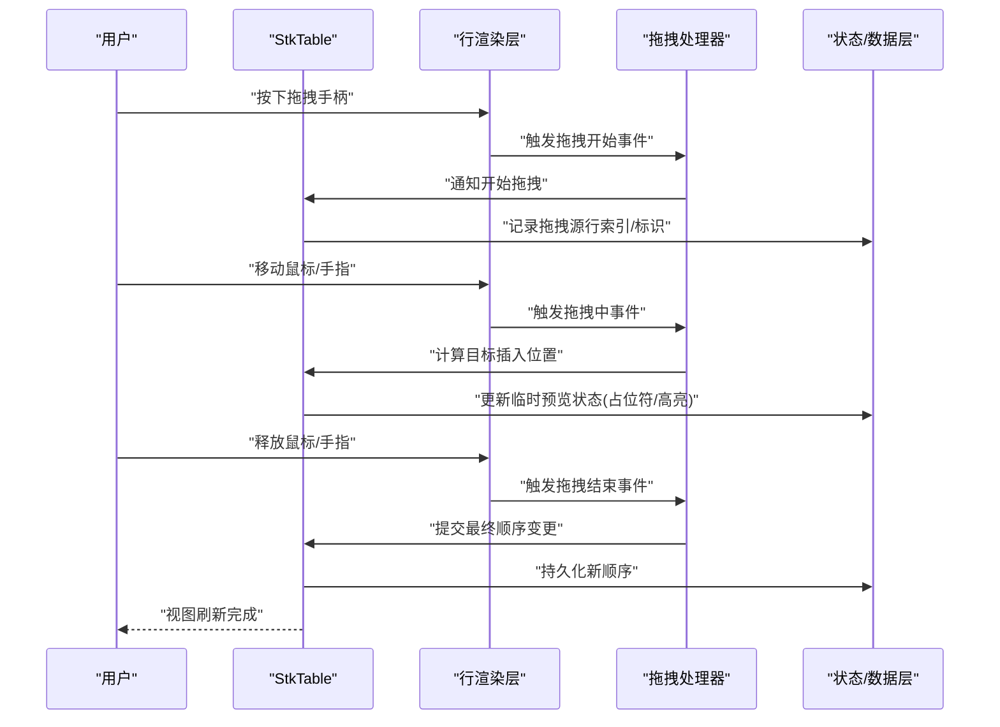
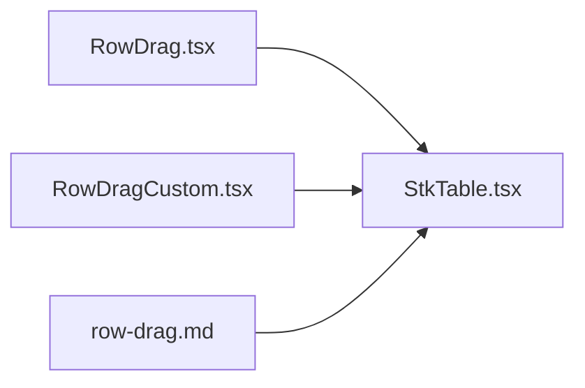
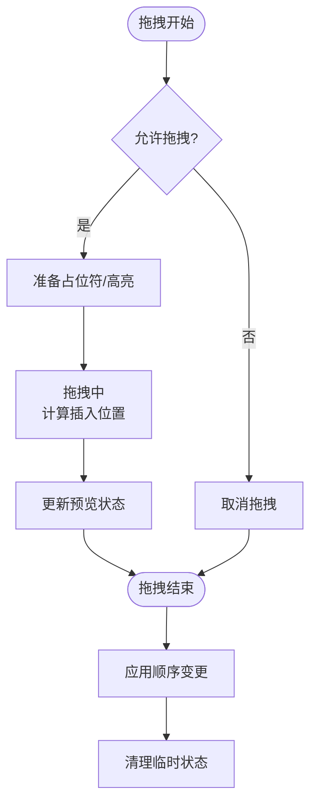

# 行拖拽

<cite>
**本文引用的文件**   
- [RowDrag.tsx](file://docs-demo/advanced/row-drag/RowDrag.tsx)
- [RowDragCustom.tsx](file://docs-demo/advanced/row-drag/RowDragCustom.tsx)
- [table-props.md](file://docs-src/main/table/advanced/row-drag.md)
- [StkTable.tsx](file://src/StkTable/StkTable.tsx)
</cite>

## 目录
1. [简介](#简介)
2. [项目结构](#项目结构)
3. [核心组件](#核心组件)
4. [架构总览](#架构总览)
5. [详细组件分析](#详细组件分析)
6. [依赖分析](#依赖分析)
7. [性能考虑](#性能考虑)
8. [故障排查指南](#故障排查指南)
9. [结论](#结论)
10. [附录](#附录)

## 简介
本章节聚焦 StkTable 的“行拖拽”能力，围绕以下目标展开：
- 如何实现行的拖拽重排序（包括拖拽手柄配置、事件捕获与处理）
- 拖拽生命周期（开始、进行中、结束）的事件处理
- 自定义拖拽样式与动画效果（视觉反馈、占位符显示）
- 拖拽状态同步与数据更新策略，保证数据源与视图一致
- 冲突解决与边界情况（禁止某些行拖拽、多级表格限制、跨表格拖拽）
- 通过实际案例展示复杂场景的实现方案

## 项目结构
与“行拖拽”相关的示例与文档主要位于 docs-demo 与 docs-src 下，核心实现入口在 src/StkTable。

图表来源
- [RowDrag.tsx](file://docs-demo/advanced/row-drag/RowDrag.tsx)
- [RowDragCustom.tsx](file://docs-demo/advanced/row-drag/RowDragCustom.tsx)
- [table-props.md](file://docs-src/main/table/advanced/row-drag.md)
- [StkTable.tsx](file://src/StkTable/StkTable.tsx)

章节来源
- [RowDrag.tsx](file://docs-demo/advanced/row-drag/RowDrag.tsx)
- [RowDragCustom.tsx](file://docs-demo/advanced/row-drag/RowDragCustom.tsx)
- [table-props.md](file://docs-src/main/table/advanced/row-drag.md)
- [StkTable.tsx](file://src/StkTable/StkTable.tsx)

## 核心组件
- 示例组件
  - 基础行拖拽示例：用于演示启用行拖拽、基本回调与简单样式
  - 自定义行拖拽示例：用于演示更丰富的交互（如禁用特定行、自定义占位符与动画）
- 文档说明
  - 高级特性文档中的“行拖拽”页面，提供 API 说明与使用要点
- 库实现
  - StkTable 主组件负责集成行拖拽能力，监听鼠标/触摸事件，维护拖拽状态，并驱动数据更新与渲染

章节来源
- [RowDrag.tsx](file://docs-demo/advanced/row-drag/RowDrag.tsx)
- [RowDragCustom.tsx](file://docs-demo/advanced/row-drag/RowDragCustom.tsx)
- [table-props.md](file://docs-src/main/table/advanced/row-drag.md)
- [StkTable.tsx](file://src/StkTable/StkTable.tsx)

## 架构总览
从用户交互到数据更新的整体流程如下：

图表来源
- [StkTable.tsx](file://src/StkTable/StkTable.tsx)
- [RowDrag.tsx](file://docs-demo/advanced/row-drag/RowDrag.tsx)
- [RowDragCustom.tsx](file://docs-demo/advanced/row-drag/RowDragCustom.tsx)

## 详细组件分析

### 基础行拖拽示例（RowDrag.tsx）
- 功能要点
  - 启用行拖拽开关或属性
  - 配置拖拽手柄（例如某列作为可拖拽区域）
  - 监听拖拽回调（开始、移动、结束），并在回调中更新数据顺序
- 典型用法
  - 在表格列定义中指定可拖拽列
  - 在拖拽回调中根据旧索引与新索引对数据数组进行重排
  - 将更新后的数据回写至受控数据源，确保视图与数据一致

章节来源
- [RowDrag.tsx](file://docs-demo/advanced/row-drag/RowDrag.tsx)

### 自定义行拖拽示例（RowDragCustom.tsx）
- 功能要点
  - 条件禁用：根据业务规则禁止某些行参与拖拽
  - 自定义占位符：在拖拽过程中显示插入位置的占位条或高亮
  - 自定义样式与动画：为被拖拽行添加半透明、阴影等视觉反馈
- 典型用法
  - 在拖拽开始前校验是否允许拖拽，不满足条件则取消
  - 在拖拽过程中动态计算插入位置，渲染占位元素
  - 在拖拽结束后合并变更，保持数据一致性

章节来源
- [RowDragCustom.tsx](file://docs-demo/advanced/row-drag/RowDragCustom.tsx)

### 文档说明（row-drag.md）
- 内容范围
  - 行拖拽相关属性、事件与插槽说明
  - 常见配置项与最佳实践
  - 与其他高级特性的组合建议（如虚拟滚动、固定列等）
- 参考建议
  - 结合示例代码理解各属性的作用域与优先级
  - 关注与虚拟滚动、固定列等特性共存时的行为差异

章节来源
- [table-props.md](file://docs-src/main/table/advanced/row-drag.md)

### 库实现（StkTable.tsx）
- 职责概述
  - 统一接入行拖拽能力，管理拖拽状态机（空闲、拖拽中、结束）
  - 处理鼠标/触摸事件，计算拖拽方向与目标位置
  - 与上层数据层协作，执行不可变更新，触发最小化重渲染
- 关键流程
  - 拖拽开始：锁定源行、准备占位符、禁用其他交互
  - 拖拽中：实时计算插入位置、更新预览状态
  - 拖拽结束：应用顺序变更、清理临时状态、派发结果回调

章节来源
- [StkTable.tsx](file://src/StkTable/StkTable.tsx)

## 依赖分析
- 示例与文档均依赖 StkTable 提供的行拖拽能力
- 示例组件通过 props 与回调与 StkTable 交互
- 文档说明为使用者提供 API 契约与约束

图表来源
- [RowDrag.tsx](file://docs-demo/advanced/row-drag/RowDrag.tsx)
- [RowDragCustom.tsx](file://docs-demo/advanced/row-drag/RowDragCustom.tsx)
- [table-props.md](file://docs-src/main/table/advanced/row-drag.md)
- [StkTable.tsx](file://src/StkTable/StkTable.tsx)

章节来源
- [RowDrag.tsx](file://docs-demo/advanced/row-drag/RowDrag.tsx)
- [RowDragCustom.tsx](file://docs-demo/advanced/row-drag/RowDragCustom.tsx)
- [table-props.md](file://docs-src/main/table/advanced/row-drag.md)
- [StkTable.tsx](file://src/StkTable/StkTable.tsx)

## 性能考虑
- 大数据量与虚拟滚动
  - 避免在拖拽中频繁全量重排；优先基于索引的局部更新
  - 占位符与高亮尽量使用轻量 DOM/CSS 变换，减少布局抖动
- 事件节流与防抖
  - 拖拽中事件高频触发，建议在计算插入位置前做节流
- 不可变更新
  - 使用浅比较或稳定 key，降低不必要的子树重渲染
- 占位符与动画
  - 使用 transform/opacity 等合成属性，避免触发回流

[本节为通用指导，无需源码引用]

## 故障排查指南
- 无法开始拖拽
  - 检查是否启用了行拖拽能力
  - 确认拖拽手柄所在列已正确配置
  - 校验是否存在阻止拖拽的条件判断
- 拖拽后顺序未生效
  - 确认是否在拖拽结束回调中更新了数据源
  - 检查数据 key 是否稳定，避免 React 复用节点导致错位
- 占位符/高亮异常
  - 检查占位符渲染时机与容器高度计算
  - 确认 CSS 层级与 pointer-events 设置
- 与虚拟滚动/固定列冲突
  - 核对文档中对这些特性的兼容说明
  - 必要时调整占位符定位策略或禁用部分特性组合

章节来源
- [table-props.md](file://docs-src/main/table/advanced/row-drag.md)
- [RowDrag.tsx](file://docs-demo/advanced/row-drag/RowDrag.tsx)
- [RowDragCustom.tsx](file://docs-demo/advanced/row-drag/RowDragCustom.tsx)

## 结论
StkTable 的行拖拽能力通过统一的拖拽处理器与清晰的生命周期事件，提供了从基础到高级的完整解决方案。配合示例与文档，开发者可以快速实现稳定的行重排序，并在需要时扩展自定义样式、占位符与动画，同时兼顾大数据量下的性能表现。

[本节为总结性内容，无需源码引用]

## 附录

### 拖拽生命周期流程图

图表来源
- [StkTable.tsx](file://src/StkTable/StkTable.tsx)
- [RowDragCustom.tsx](file://docs-demo/advanced/row-drag/RowDragCustom.tsx)

### 复杂场景实践清单
- 多级表格的拖拽限制
  - 仅允许叶子节点拖拽
  - 限制拖拽目标层级，防止破坏树结构
- 跨表格拖拽
  - 明确数据模型与唯一键
  - 在拖拽结束时合并不同表的数据源
- 禁止某些行拖拽
  - 在拖拽开始前进行条件判断
  - 提供明确的视觉提示（如置灰手柄）

[本节为概念性内容，无需源码引用]