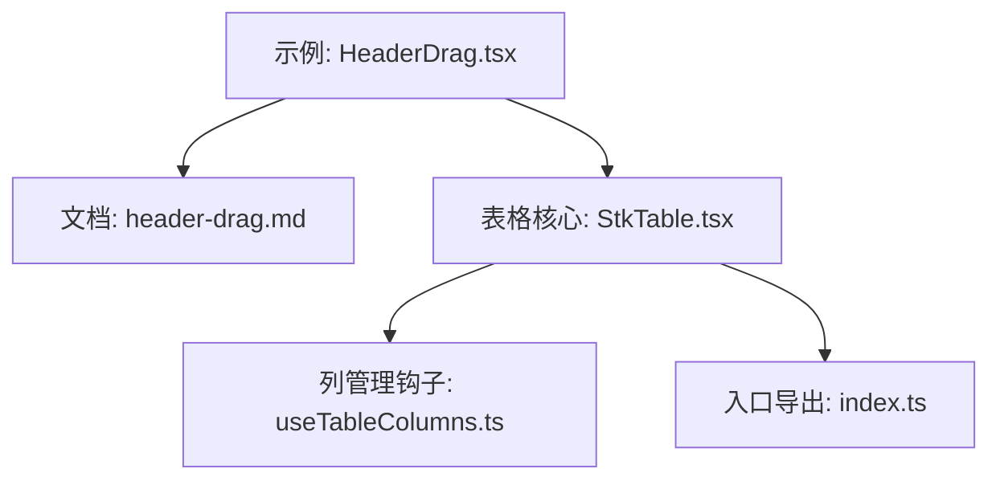
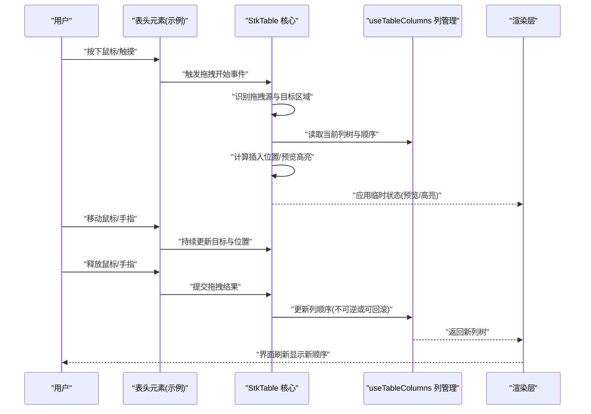
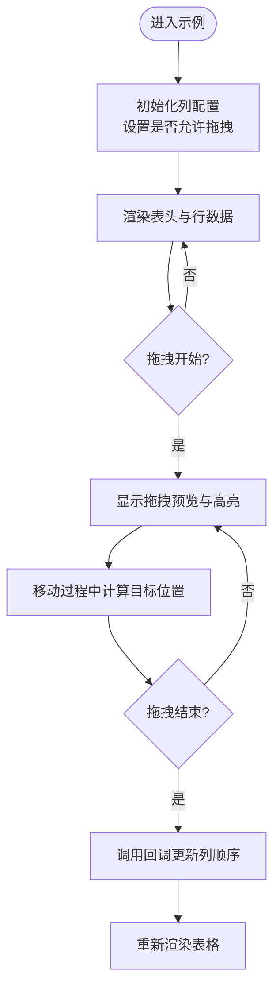
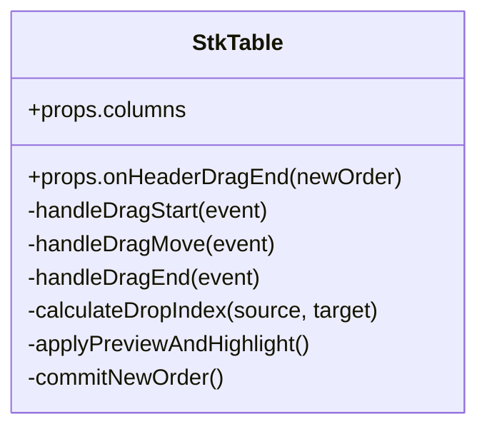
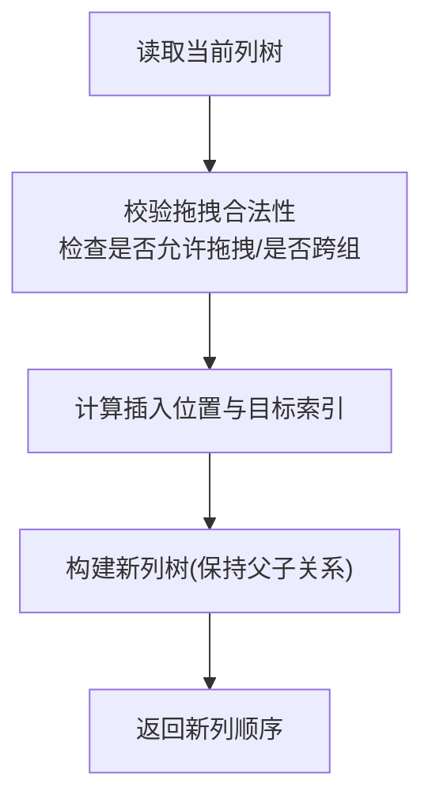
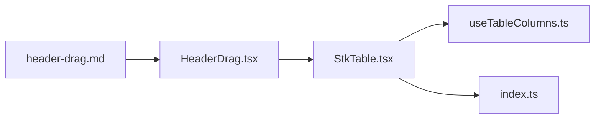

# 表头拖拽

<cite>
**本文引用的文件**   
- [HeaderDrag.tsx](file://docs-demo/advanced/header-drag/HeaderDrag.tsx)
- [header-drag.md](file://docs-src/main/table/advanced/header-drag.md)
- [StkTable.tsx](file://src/StkTable/StkTable.tsx)
- [useTableColumns.ts](file://src/StkTable/hooks/useTableColumns.ts)
- [index.ts](file://src/StkTable/index.ts)
</cite>

## 目录
1. [简介](#简介)
2. [项目结构](#项目结构)
3. [核心组件](#核心组件)
4. [架构总览](#架构总览)
5. [详细组件分析](#详细组件分析)
6. [依赖关系分析](#依赖关系分析)
7. [性能考量](#性能考量)
8. [故障排查指南](#故障排查指南)
9. [结论](#结论)
10. [附录](#附录)

## 简介
本章节聚焦 StkTable 的“表头拖拽”能力，围绕以下目标展开：
- 如何实现表头的拖拽重排序（包括拖拽区域定义与目标识别）
- 事件处理机制（预览、高亮、位置计算）
- 与列配置的联动更新（数据结构与界面同步）
- 多级表头场景下的父子关系维护策略
- 拖拽约束与验证规则（如禁止特定列拖拽）
- 复杂场景案例（分组表头拖拽、条件限制等）

## 项目结构
与表头拖拽相关的代码主要分布在示例与文档说明中，同时涉及表格核心模块以理解数据流与渲染链路。

图表来源
- [HeaderDrag.tsx:1-200](file://docs-demo/advanced/header-drag/HeaderDrag.tsx#L1-L200)
- [header-drag.md:1-200](file://docs-src/main/table/advanced/header-drag.md#L1-L200)
- [StkTable.tsx:1-200](file://src/StkTable/StkTable.tsx#L1-L200)
- [useTableColumns.ts:1-200](file://src/StkTable/hooks/useTableColumns.ts#L1-L200)
- [index.ts:1-200](file://src/StkTable/index.ts#L1-L200)

章节来源
- [HeaderDrag.tsx:1-200](file://docs-demo/advanced/header-drag/HeaderDrag.tsx#L1-L200)
- [header-drag.md:1-200](file://docs-src/main/table/advanced/header-drag.md#L1-L200)
- [StkTable.tsx:1-200](file://src/StkTable/StkTable.tsx#L1-L200)
- [useTableColumns.ts:1-200](file://src/StkTable/hooks/useTableColumns.ts#L1-L200)
- [index.ts:1-200](file://src/StkTable/index.ts#L1-L200)

## 核心组件
- 示例组件 HeaderDrag.tsx：演示如何启用并配置表头拖拽，展示与列配置的联动更新。
- 文档页面 header-drag.md：提供功能说明、API 使用方式与注意事项。
- 表格核心 StkTable.tsx：承载表头渲染与交互逻辑，负责将拖拽结果应用到列顺序。
- 列管理钩子 useTableColumns.ts：维护列树结构与顺序，供拖拽时读取与更新。
- 入口 index.ts：对外暴露表格组件与类型定义，便于在业务中使用。

章节来源
- [HeaderDrag.tsx:1-200](file://docs-demo/advanced/header-drag/HeaderDrag.tsx#L1-L200)
- [header-drag.md:1-200](file://docs-src/main/table/advanced/header-drag.md#L1-L200)
- [StkTable.tsx:1-200](file://src/StkTable/StkTable.tsx#L1-L200)
- [useTableColumns.ts:1-200](file://src/StkTable/hooks/useTableColumns.ts#L1-L200)
- [index.ts:1-200](file://src/StkTable/index.ts#L1-L200)

## 架构总览
表头拖拽的整体流程从用户交互开始，经由表格核心进行事件捕获、目标识别与位置计算，最终通过列管理钩子更新列顺序，并触发界面重渲染。

图表来源
- [StkTable.tsx:1-200](file://src/StkTable/StkTable.tsx#L1-L200)
- [useTableColumns.ts:1-200](file://src/StkTable/hooks/useTableColumns.ts#L1-L200)
- [HeaderDrag.tsx:1-200](file://docs-demo/advanced/header-drag/HeaderDrag.tsx#L1-L200)

## 详细组件分析

### 示例组件 HeaderDrag.tsx
该示例展示了表头拖拽的典型用法：
- 启用表头拖拽开关
- 监听拖拽完成回调，将新的列顺序写回列配置
- 在多级表头场景下，确保父级与子级的相对顺序一致

图表来源
- [HeaderDrag.tsx:1-200](file://docs-demo/advanced/header-drag/HeaderDrag.tsx#L1-L200)

章节来源
- [HeaderDrag.tsx:1-200](file://docs-demo/advanced/header-drag/HeaderDrag.tsx#L1-L200)

### 文档说明 header-drag.md
文档页提供了：
- 功能概述与适用场景
- 关键属性与回调的使用方式
- 与列配置的联动建议
- 常见问题与注意事项

章节来源
- [header-drag.md:1-200](file://docs-src/main/table/advanced/header-drag.md#L1-L200)

### 表格核心 StkTable.tsx
作为承载表头渲染与交互的核心，StkTable 负责：
- 接收来自示例的列配置与拖拽回调
- 在表头区域注册拖拽事件处理器
- 根据鼠标/触摸坐标计算目标列索引与插入位置
- 将预览与高亮状态传递给渲染层
- 在拖拽结束时调用上层回调以持久化新顺序

图表来源
- [StkTable.tsx:1-200](file://src/StkTable/StkTable.tsx#L1-L200)

章节来源
- [StkTable.tsx:1-200](file://src/StkTable/StkTable.tsx#L1-L200)

### 列管理钩子 useTableColumns.ts
该钩子维护列树结构及顺序，为拖拽提供：
- 读取当前列顺序与层级信息
- 生成新的列顺序（支持多级表头）
- 保证父级与子级的相对顺序一致性

图表来源
- [useTableColumns.ts:1-200](file://src/StkTable/hooks/useTableColumns.ts#L1-L200)

章节来源
- [useTableColumns.ts:1-200](file://src/StkTable/hooks/useTableColumns.ts#L1-L200)

### 入口导出 index.ts
对外暴露表格组件与类型定义，使业务侧能便捷引入并使用表头拖拽功能。

章节来源
- [index.ts:1-200](file://src/StkTable/index.ts#L1-L200)

## 依赖关系分析
表头拖拽涉及的模块耦合关系如下：

图表来源
- [HeaderDrag.tsx:1-200](file://docs-demo/advanced/header-drag/HeaderDrag.tsx#L1-L200)
- [StkTable.tsx:1-200](file://src/StkTable/StkTable.tsx#L1-L200)
- [useTableColumns.ts:1-200](file://src/StkTable/hooks/useTableColumns.ts#L1-L200)
- [index.ts:1-200](file://src/StkTable/index.ts#L1-L200)
- [header-drag.md:1-200](file://docs-src/main/table/advanced/header-drag.md#L1-L200)

章节来源
- [HeaderDrag.tsx:1-200](file://docs-demo/advanced/header-drag/HeaderDrag.tsx#L1-L200)
- [StkTable.tsx:1-200](file://src/StkTable/StkTable.tsx#L1-L200)
- [useTableColumns.ts:1-200](file://src/StkTable/hooks/useTableColumns.ts#L1-L200)
- [index.ts:1-200](file://src/StkTable/index.ts#L1-L200)
- [header-drag.md:1-200](file://docs-src/main/table/advanced/header-drag.md#L1-L200)

## 性能考量
- 拖拽过程中的预览与高亮应尽量减少 DOM 操作，优先使用 CSS 类切换与局部重绘。
- 列顺序更新应在拖拽结束时一次性提交，避免频繁触发重渲染。
- 对于大数据量场景，结合虚拟滚动与懒加载，降低拖拽时的布局计算开销。
- 对多级表头，尽量复用已计算的层级信息，避免重复遍历列树。

[本节为通用指导，不直接分析具体文件]

## 故障排查指南
- 拖拽无效
  - 确认示例中已启用拖拽开关，且未禁用相关列。
  - 检查列配置是否正确传入，以及回调是否被正确调用。
- 预览/高亮异常
  - 检查样式类名是否与渲染层匹配。
  - 确认拖拽事件是否在正确的表头元素上注册。
- 多级表头顺序错乱
  - 核对列管理钩子中的父子关系维护逻辑。
  - 确保拖拽范围限制在同一分组内或按业务规则允许跨组。
- 回调未触发或数据不同步
  - 确认拖拽结束事件是否被捕获。
  - 检查列顺序更新后是否触发了必要的状态更新与重渲染。

章节来源
- [HeaderDrag.tsx:1-200](file://docs-demo/advanced/header-drag/HeaderDrag.tsx#L1-L200)
- [StkTable.tsx:1-200](file://src/StkTable/StkTable.tsx#L1-L200)
- [useTableColumns.ts:1-200](file://src/StkTable/hooks/useTableColumns.ts#L1-L200)

## 结论
StkTable 的表头拖拽通过示例驱动与核心模块协作，实现了从事件捕获到数据更新的完整闭环。借助列管理钩子，系统能够在多级表头场景下维护父子关系，并通过预览与高亮提升用户体验。合理的约束与验证规则确保了拖拽操作的稳定性与可控性。

[本节为总结性内容，不直接分析具体文件]

## 附录
- 典型使用路径参考
  - 示例组件：[HeaderDrag.tsx](file://docs-demo/advanced/header-drag/HeaderDrag.tsx)
  - 文档说明：[header-drag.md](file://docs-src/main/table/advanced/header-drag.md)
  - 表格核心：[StkTable.tsx](file://src/StkTable/StkTable.tsx)
  - 列管理钩子：[useTableColumns.ts](file://src/StkTable/hooks/useTableColumns.ts)
  - 入口导出：[index.ts](file://src/StkTable/index.ts)