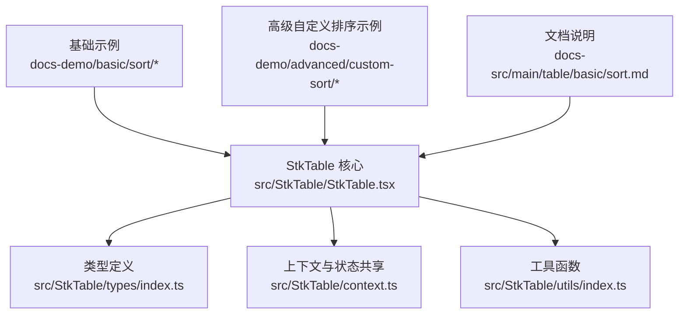
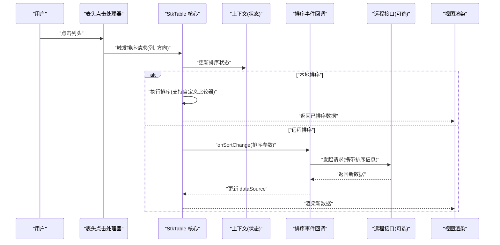
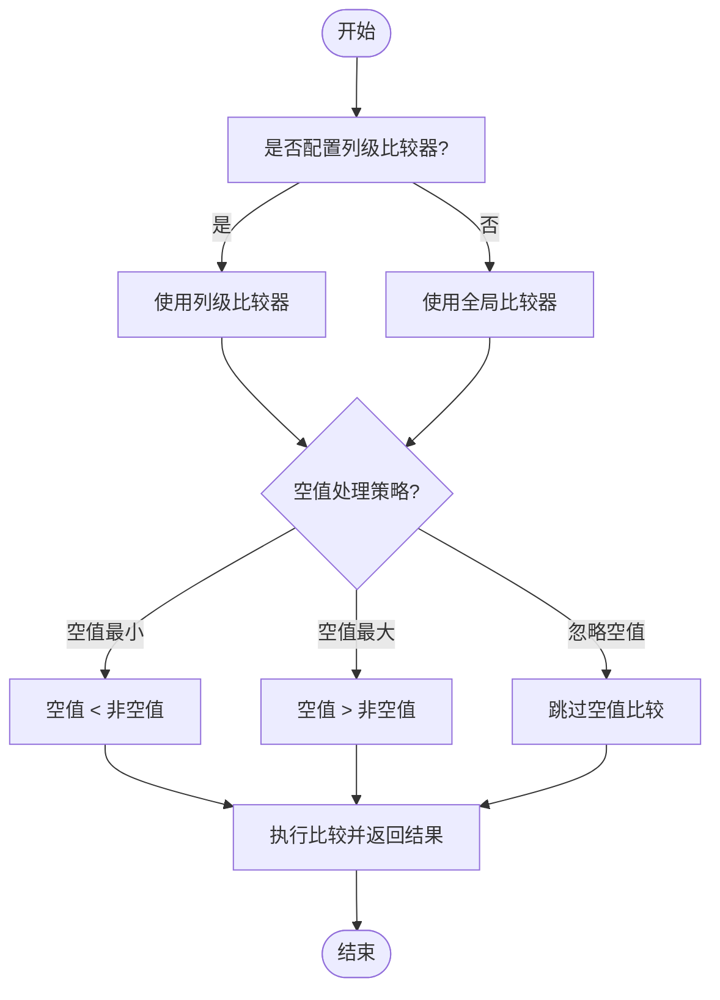
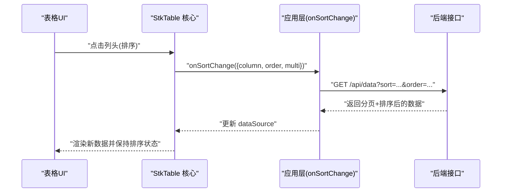
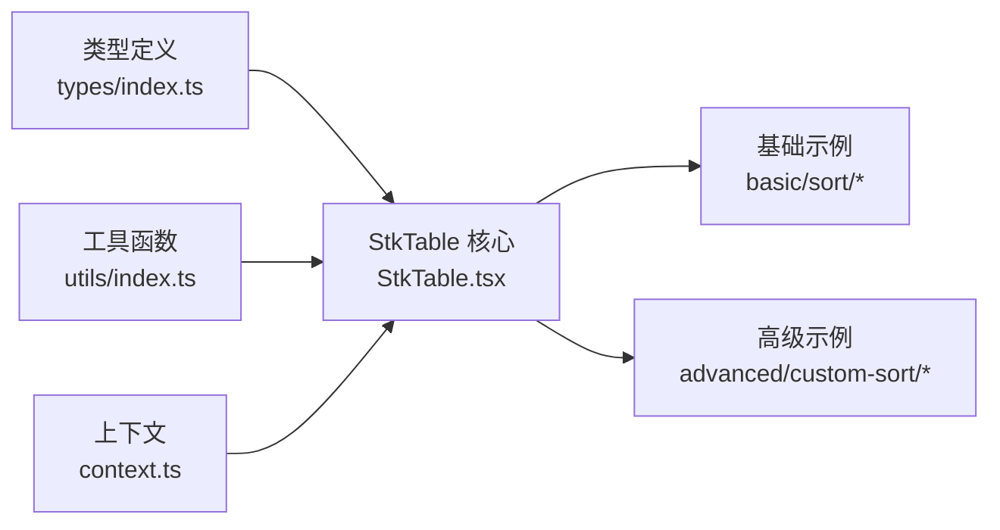

# 排序功能

<cite>
**本文引用的文件**   
- [src/StkTable/StkTable.tsx](file://src/StkTable/StkTable.tsx)
- [src/StkTable/types/index.ts](file://src/StkTable/types/index.ts)
- [src/StkTable/context.ts](file://src/StkTable/context.ts)
- [src/StkTable/utils/index.ts](file://src/StkTable/utils/index.ts)
- [docs-demo/basic/sort/DefaultSort.tsx](file://docs-demo/basic/sort/DefaultSort.tsx)
- [docs-demo/basic/sort/MultiSort.tsx](file://docs-demo/basic/sort/MultiSort.tsx)
- [docs-demo/basic/sort/SortField.tsx](file://docs-demo/basic/sort/SortField.tsx)
- [docs-demo/basic/sort/SortEmptyValue.tsx](file://docs-demo/basic/sort/SortEmptyValue.tsx)
- [docs-demo/basic/sort/SortRemote.tsx](file://docs-demo/basic/sort/SortRemote.tsx)
- [docs-demo/advanced/custom-sort/CustomSort/index.tsx](file://docs-demo/advanced/custom-sort/CustomSort/index.tsx)
- [docs-src/main/table/basic/sort.md](file://docs-src/main/table/basic/sort.md)
</cite>

## 目录
1. [简介](#简介)
2. [项目结构](#项目结构)
3. [核心组件](#核心组件)
4. [架构总览](#架构总览)
5. [详细组件分析](#详细组件分析)
6. [依赖分析](#依赖分析)
7. [性能考虑](#性能考虑)
8. [故障排查指南](#故障排查指南)
9. [结论](#结论)
10. [附录](#附录)

## 简介
本章节聚焦 StkTable 的排序能力，覆盖单列与多列排序、自定义排序逻辑（字段级、空值处理）、远程数据排序、排序事件与状态管理、图标显示与状态同步、以及性能优化技巧。文档通过源码与示例联动的方式，帮助开发者快速实现专业、稳定且高性能的数据排序体验。

## 项目结构
围绕排序功能，仓库中涉及的核心位置包括：
- 表格核心实现与类型定义：位于 src/StkTable 下
- 基础与高级示例：位于 docs-demo/basic/sort 与 docs-demo/advanced/custom-sort
- 官方文档说明：位于 docs-src/main/table/basic/sort.md

图表来源
- [src/StkTable/StkTable.tsx](file://src/StkTable/StkTable.tsx)
- [src/StkTable/types/index.ts](file://src/StkTable/types/index.ts)
- [src/StkTable/context.ts](file://src/StkTable/context.ts)
- [src/StkTable/utils/index.ts](file://src/StkTable/utils/index.ts)
- [docs-demo/basic/sort/DefaultSort.tsx](file://docs-demo/basic/sort/DefaultSort.tsx)
- [docs-demo/basic/sort/MultiSort.tsx](file://docs-demo/basic/sort/MultiSort.tsx)
- [docs-demo/basic/sort/SortField.tsx](file://docs-demo/basic/sort/SortField.tsx)
- [docs-demo/basic/sort/SortEmptyValue.tsx](file://docs-demo/basic/sort/SortEmptyValue.tsx)
- [docs-demo/basic/sort/SortRemote.tsx](file://docs-demo/basic/sort/SortRemote.tsx)
- [docs-demo/advanced/custom-sort/CustomSort/index.tsx](file://docs-demo/advanced/custom-sort/CustomSort/index.tsx)
- [docs-src/main/table/basic/sort.md](file://docs-src/main/table/basic/sort.md)

章节来源
- [src/StkTable/StkTable.tsx](file://src/StkTable/StkTable.tsx)
- [src/StkTable/types/index.ts](file://src/StkTable/types/index.ts)
- [src/StkTable/context.ts](file://src/StkTable/context.ts)
- [src/StkTable/utils/index.ts](file://src/StkTable/utils/index.ts)
- [docs-src/main/table/basic/sort.md](file://docs-src/main/table/basic/sort.md)

## 核心组件
- 表格主体与排序入口：StkTable 负责接收排序相关配置、维护排序状态、触发排序事件并渲染排序图标。
- 类型系统：集中定义排序相关的属性、回调与数据结构，确保 API 一致性与可维护性。
- 上下文：在组件树内共享排序状态与变更事件，避免重复计算与状态不一致。
- 工具函数：封装通用比较、空值处理、排序键生成等辅助逻辑。

章节来源
- [src/StkTable/StkTable.tsx](file://src/StkTable/StkTable.tsx)
- [src/StkTable/types/index.ts](file://src/StkTable/types/index.ts)
- [src/StkTable/context.ts](file://src/StkTable/context.ts)
- [src/StkTable/utils/index.ts](file://src/StkTable/utils/index.ts)

## 架构总览
下图展示了排序从用户交互到数据渲染的整体流程，涵盖本地与远程两种模式。

图表来源
- [src/StkTable/StkTable.tsx](file://src/StkTable/StkTable.tsx)
- [src/StkTable/context.ts](file://src/StkTable/context.ts)
- [docs-demo/basic/sort/SortRemote.tsx](file://docs-demo/basic/sort/SortRemote.tsx)

## 详细组件分析

### 单列排序
- 使用方式：在列配置中启用排序开关，或通过表格属性指定默认排序列与方向。
- 行为特征：点击同一列时，方向在升序/降序/无排序之间循环切换；未启用排序的列点击无效。
- 典型示例：
  - 基础单列排序演示：[docs-demo/basic/sort/DefaultSort.tsx](file://docs-demo/basic/sort/DefaultSort.tsx)
  - 指定排序字段与方向：[docs-demo/basic/sort/SortField.tsx](file://docs-demo/basic/sort/SortField.tsx)

章节来源
- [docs-demo/basic/sort/DefaultSort.tsx](file://docs-demo/basic/sort/DefaultSort.tsx)
- [docs-demo/basic/sort/SortField.tsx](file://docs-demo/basic/sort/SortField.tsx)

### 多列排序
- 使用方式：开启多列排序后，依次点击不同列以叠加排序条件；再次点击已有排序列可调整其方向或移除该条件。
- 优先级：先添加的列优先级更高，后续列作为次级排序键。
- 典型示例：
  - 多列排序演示：[docs-demo/basic/sort/MultiSort.tsx](file://docs-demo/basic/sort/MultiSort.tsx)

章节来源
- [docs-demo/basic/sort/MultiSort.tsx](file://docs-demo/basic/sort/MultiSort.tsx)

### 自定义排序逻辑
- 字段级自定义：为特定列提供比较函数，用于复杂数据类型（如日期、金额、自定义对象）的比较。
- 全局自定义：在表格层提供统一比较器，对未单独配置的列生效。
- 空值处理：支持将空值视为最小或最大，或在比较前进行归一化。
- 典型示例：
  - 高级自定义排序（含空值策略与复杂比较）：[docs-demo/advanced/custom-sort/CustomSort/index.tsx](file://docs-demo/advanced/custom-sort/CustomSort/index.tsx)
  - 空值排序演示：[docs-demo/basic/sort/SortEmptyValue.tsx](file://docs-demo/basic/sort/SortEmptyValue.tsx)

图表来源
- [docs-demo/advanced/custom-sort/CustomSort/index.tsx](file://docs-demo/advanced/custom-sort/CustomSort/index.tsx)
- [docs-demo/basic/sort/SortEmptyValue.tsx](file://docs-demo/basic/sort/SortEmptyValue.tsx)

章节来源
- [docs-demo/advanced/custom-sort/CustomSort/index.tsx](file://docs-demo/advanced/custom-sort/CustomSort/index.tsx)
- [docs-demo/basic/sort/SortEmptyValue.tsx](file://docs-demo/basic/sort/SortEmptyValue.tsx)

### 远程数据排序
- 触发时机：当启用远程排序时，表格不直接对本地数据进行排序，而是通过事件回调通知上层应用发起请求。
- 参数传递：事件回调会包含当前排序列、方向、多列排序键等信息，便于后端按相同规则排序。
- 状态同步：收到服务端返回的新数据后，更新 dataSource，表格自动重新渲染并保持排序状态。
- 典型示例：
  - 远程排序演示：[docs-demo/basic/sort/SortRemote.tsx](file://docs-demo/basic/sort/SortRemote.tsx)

图表来源
- [docs-demo/basic/sort/SortRemote.tsx](file://docs-demo/basic/sort/SortRemote.tsx)

章节来源
- [docs-demo/basic/sort/SortRemote.tsx](file://docs-demo/basic/sort/SortRemote.tsx)

### 排序事件与状态管理
- 事件：提供统一的排序变更事件，包含排序键集合、各列方向、是否为多列等元信息。
- 状态：通过上下文在组件树内共享排序状态，避免父组件与子组件之间的状态漂移。
- 最佳实践：
  - 在 onSortChange 中仅做必要的数据拉取与状态更新，避免在渲染路径中进行重计算。
  - 对大型数据集优先采用远程排序，减少前端计算压力。
  - 使用稳定的 key 与不可变更新，提升 React 渲染性能。

章节来源
- [src/StkTable/context.ts](file://src/StkTable/context.ts)
- [src/StkTable/StkTable.tsx](file://src/StkTable/StkTable.tsx)

### 排序图标显示与状态同步
- 图标语义：升序/降序/未排序三种状态对应不同的视觉提示。
- 同步机制：排序状态变更后，表头根据当前列的排序方向渲染相应图标；多列排序时，可通过序号或样式区分优先级。
- 注意事项：
  - 确保排序状态与数据源保持一致，避免“状态领先于数据”导致的闪烁。
  - 在远程模式下，可在请求期间禁用表头点击或展示加载态，防止重复触发。

章节来源
- [src/StkTable/StkTable.tsx](file://src/StkTable/StkTable.tsx)
- [src/StkTable/context.ts](file://src/StkTable/context.ts)

### 复杂排序需求实战
- 场景一：按业务权重排序（例如：状态优先级 + 时间倒序）。可通过列级比较器实现主键，再结合全局比较器或二次排序键实现复合排序。
- 场景二：国际化与区域设置下的数值/日期排序。建议统一转换为可比较的中间格式（如时间戳、标准化字符串）后再比较。
- 场景三：树形数据的层级排序。需考虑父子关系约束，必要时在后端完成排序，前端仅负责展示。
- 参考示例：
  - 高级自定义排序综合案例：[docs-demo/advanced/custom-sort/CustomSort/index.tsx](file://docs-demo/advanced/custom-sort/CustomSort/index.tsx)

章节来源
- [docs-demo/advanced/custom-sort/CustomSort/index.tsx](file://docs-demo/advanced/custom-sort/CustomSort/index.tsx)

## 依赖分析
- 模块耦合：
  - StkTable 核心依赖类型定义与工具函数，保证 API 契约与通用逻辑复用。
  - 上下文贯穿组件树，降低排序状态在各层间的传递成本。
- 外部集成点：
  - 远程排序通过事件回调与上层应用集成，保持表格与业务解耦。
- 潜在风险：
  - 若比较器不稳定或存在副作用，可能导致排序抖动或无限循环。
  - 多列排序键过多会增加比较开销，应评估数据规模与复杂度。

图表来源
- [src/StkTable/types/index.ts](file://src/StkTable/types/index.ts)
- [src/StkTable/StkTable.tsx](file://src/StkTable/StkTable.tsx)
- [src/StkTable/utils/index.ts](file://src/StkTable/utils/index.ts)
- [src/StkTable/context.ts](file://src/StkTable/context.ts)
- [docs-demo/basic/sort/DefaultSort.tsx](file://docs-demo/basic/sort/DefaultSort.tsx)
- [docs-demo/basic/sort/MultiSort.tsx](file://docs-demo/basic/sort/MultiSort.tsx)
- [docs-demo/advanced/custom-sort/CustomSort/index.tsx](file://docs-demo/advanced/custom-sort/CustomSort/index.tsx)

章节来源
- [src/StkTable/types/index.ts](file://src/StkTable/types/index.ts)
- [src/StkTable/StkTable.tsx](file://src/StkTable/StkTable.tsx)
- [src/StkTable/utils/index.ts](file://src/StkTable/utils/index.ts)
- [src/StkTable/context.ts](file://src/StkTable/context.ts)

## 性能考虑
- 优先远程排序：大数据集建议在服务端完成排序与分页，前端仅负责展示。
- 比较器优化：
  - 避免在比较器中进行昂贵操作（如正则、网络请求）。
  - 对频繁比较的字段预计算缓存值（如时间戳、标准化字符串）。
- 渲染优化：
  - 使用稳定的 key，避免不必要的重渲染。
  - 在远程模式下，利用请求去抖或节流，减少重复请求。
- 多列排序控制：限制最大排序列数，避免组合爆炸导致比较耗时。

## 故障排查指南
- 现象：点击列头无响应
  - 检查列是否启用了排序开关，或是否在表格层禁用了排序。
  - 确认列的 dataIndex 与数据字段一致。
- 现象：排序方向异常或图标不更新
  - 核对排序状态是否与数据源同步，避免状态与数据不一致。
  - 远程模式下，确认 onSortChange 返回值是否正确更新 dataSource。
- 现象：自定义排序结果不符合预期
  - 检查比较器是否满足自反性、对称性与传递性。
  - 验证空值处理策略是否符合业务期望。
- 现象：多列排序优先级混乱
  - 明确多列添加顺序即优先级顺序，必要时在事件回调中显式记录排序键序列。

章节来源
- [src/StkTable/StkTable.tsx](file://src/StkTable/StkTable.tsx)
- [src/StkTable/context.ts](file://src/StkTable/context.ts)
- [docs-demo/basic/sort/SortRemote.tsx](file://docs-demo/basic/sort/SortRemote.tsx)

## 结论
StkTable 的排序功能提供了从简单到复杂的完整能力矩阵：单列与多列排序开箱即用，字段级与全局自定义比较器满足多样化业务需求，空值处理策略灵活可控，远程排序与事件驱动设计使前后端协作顺畅。通过合理的状态管理与性能优化，开发者可以构建出高效、稳定且用户体验优秀的排序方案。

## 附录
- 官方文档：
  - 排序基础与进阶说明：[docs-src/main/table/basic/sort.md](file://docs-src/main/table/basic/sort.md)
- 示例索引：
  - 基础排序示例：
    - [docs-demo/basic/sort/DefaultSort.tsx](file://docs-demo/basic/sort/DefaultSort.tsx)
    - [docs-demo/basic/sort/MultiSort.tsx](file://docs-demo/basic/sort/MultiSort.tsx)
    - [docs-demo/basic/sort/SortField.tsx](file://docs-demo/basic/sort/SortField.tsx)
    - [docs-demo/basic/sort/SortEmptyValue.tsx](file://docs-demo/basic/sort/SortEmptyValue.tsx)
    - [docs-demo/basic/sort/SortRemote.tsx](file://docs-demo/basic/sort/SortRemote.tsx)
  - 高级自定义排序：
    - [docs-demo/advanced/custom-sort/CustomSort/index.tsx](file://docs-demo/advanced/custom-sort/CustomSort/index.tsx)