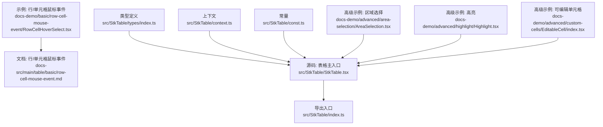
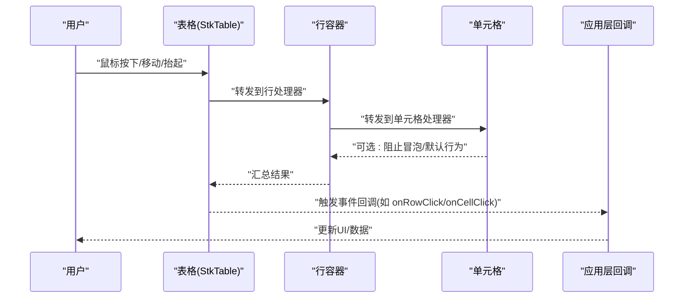
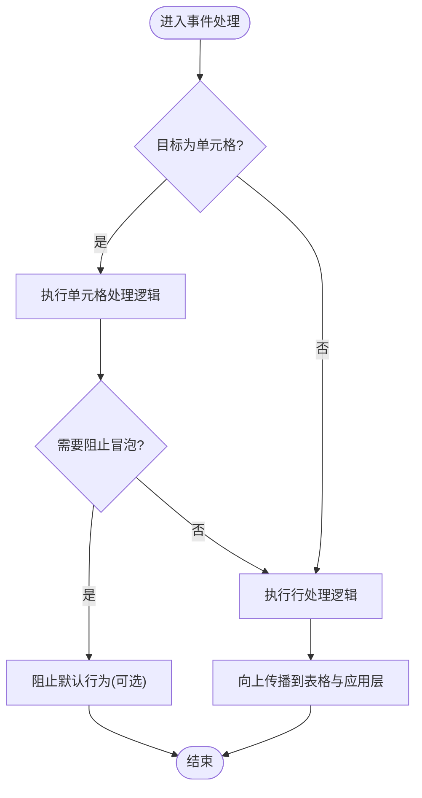
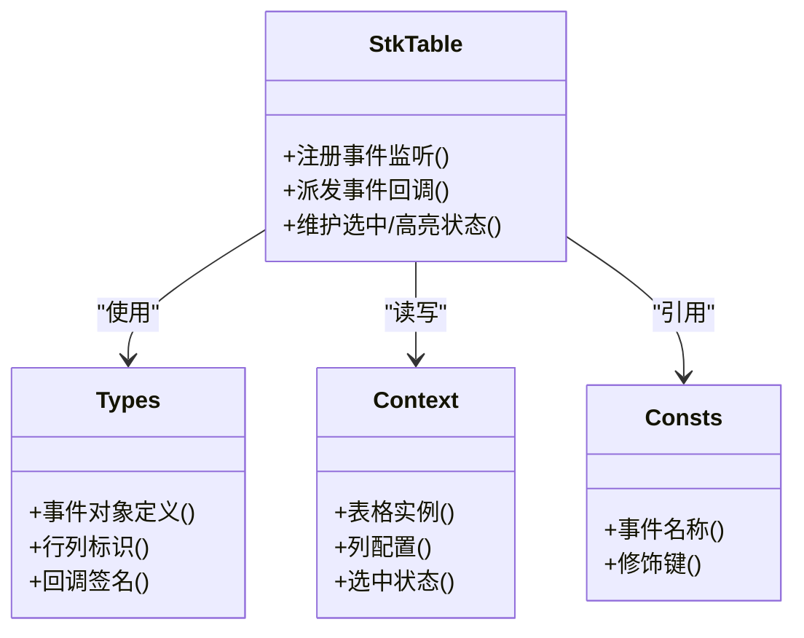

# 鼠标事件

<cite>
**本文引用的文件**   
- [RowCellHoverSelect.tsx](file://docs-demo/basic/row-cell-mouse-event/RowCellHoverSelect.tsx)
- [row-cell-mouse-event.md](file://docs-src/main/table/basic/row-cell-mouse-event.md)
- [StkTable.tsx](file://src/StkTable/StkTable.tsx)
- [index.ts](file://src/StkTable/index.ts)
- [types/index.ts](file://src/StkTable/types/index.ts)
- [context.ts](file://src/StkTable/context.ts)
- [const.ts](file://src/StkTable/const.ts)
- [AreaSelection.tsx](file://docs-demo/advanced/area-selection/AreaSelection.tsx)
- [Highlight.tsx](file://docs-demo/advanced/highlight/Highlight.tsx)
- [EditableCell/index.tsx](file://docs-demo/advanced/custom-cells/EditableCell/index.tsx)
</cite>

## 目录
1. [简介](#简介)
2. [项目结构](#项目结构)
3. [核心组件](#核心组件)
4. [架构总览](#架构总览)
5. [详细组件分析](#详细组件分析)
6. [依赖分析](#依赖分析)
7. [性能考虑](#性能考虑)
8. [故障排查指南](#故障排查指南)
9. [结论](#结论)
10. [附录](#附录)

## 简介
本章节聚焦 StkTable 的鼠标事件处理机制，覆盖行级与单元格级的悬停、点击、双击等交互；说明事件对象结构与行列信息获取方式；提供行悬停高亮、单元格点击选择等常见场景的实现思路；解释事件冒泡与阻止默认行为的方法；并给出用户体验优化与复杂交互案例。

## 项目结构
围绕鼠标事件的文档与示例主要分布在以下位置：
- 基础示例：行/单元格鼠标事件演示
- 高级示例：区域选择、高亮、可编辑单元格等
- 源码：表格主入口、类型定义、上下文与常量

图表来源
- [RowCellHoverSelect.tsx](file://docs-demo/basic/row-cell-mouse-event/RowCellHoverSelect.tsx)
- [row-cell-mouse-event.md](file://docs-src/main/table/basic/row-cell-mouse-event.md)
- [StkTable.tsx](file://src/StkTable/StkTable.tsx)
- [index.ts](file://src/StkTable/index.ts)
- [types/index.ts](file://src/StkTable/types/index.ts)
- [context.ts](file://src/StkTable/context.ts)
- [const.ts](file://src/StkTable/const.ts)
- [AreaSelection.tsx](file://docs-demo/advanced/area-selection/AreaSelection.tsx)
- [Highlight.tsx](file://docs-demo/advanced/highlight/Highlight.tsx)
- [EditableCell/index.tsx](file://docs-demo/advanced/custom-cells/EditableCell/index.tsx)

章节来源
- [RowCellHoverSelect.tsx](file://docs-demo/basic/row-cell-mouse-event/RowCellHoverSelect.tsx)
- [row-cell-mouse-event.md](file://docs-src/main/table/basic/row-cell-mouse-event.md)
- [StkTable.tsx](file://src/StkTable/StkTable.tsx)
- [index.ts](file://src/StkTable/index.ts)
- [types/index.ts](file://src/StkTable/types/index.ts)
- [context.ts](file://src/StkTable/context.ts)
- [const.ts](file://src/StkTable/const.ts)
- [AreaSelection.tsx](file://docs-demo/advanced/area-selection/AreaSelection.tsx)
- [Highlight.tsx](file://docs-demo/advanced/highlight/Highlight.tsx)
- [EditableCell/index.tsx](file://docs-demo/advanced/custom-cells/EditableCell/index.tsx)

## 核心组件
- 表格主入口负责挂载事件监听、派发事件回调、维护选中/高亮状态，并与自定义单元格协作完成交互。
- 类型定义集中描述事件对象、行列标识、回调签名等契约。
- 上下文用于在组件树中共享表格实例、列配置、选中状态等。
- 常量定义事件名称、修饰键等。

章节来源
- [StkTable.tsx](file://src/StkTable/StkTable.tsx)
- [types/index.ts](file://src/StkTable/types/index.ts)
- [context.ts](file://src/StkTable/context.ts)
- [const.ts](file://src/StkTable/const.ts)

## 架构总览
下图展示了从用户鼠标操作到表格内部处理的典型路径，以及事件如何向上冒泡或向下传递至自定义单元格。

图表来源
- [StkTable.tsx](file://src/StkTable/StkTable.tsx)
- [types/index.ts](file://src/StkTable/types/index.ts)

## 详细组件分析

### 行级与单元格级鼠标事件
- 支持的事件类型包括：悬停（mouseenter/mouseover）、离开（mouseleave/mouseout）、点击（click）、双击（dblclick）、右键（contextmenu）等。
- 事件对象通常包含：
  - 原生事件对象（例如 MouseEvent），可用于获取坐标、按键修饰键（Ctrl/Shift/Alt/Meta）。
  - 目标定位信息：行索引、列索引、行唯一键、列字段名等。
  - 辅助方法：阻止冒泡、阻止默认行为、停止传播等。
- 行列信息获取：
  - 通过事件对象中的行列标识属性直接读取。
  - 若需更丰富的上下文（如当前选中态、排序状态），可从表格上下文中获取。

章节来源
- [types/index.ts](file://src/StkTable/types/index.ts)
- [StkTable.tsx](file://src/StkTable/StkTable.tsx)

### 事件冒泡与阻止默认行为
- 冒泡方向：单元格 → 行容器 → 表格根节点 → 应用层回调。
- 阻止冒泡：在单元格内调用事件对象的相应方法，避免上层行/表格逻辑被触发。
- 阻止默认行为：例如阻止浏览器右键菜单或文本选中等，使用事件对象的对应 API。

图表来源
- [StkTable.tsx](file://src/StkTable/StkTable.tsx)
- [types/index.ts](file://src/StkTable/types/index.ts)

### 常见交互场景实现要点
- 行悬停高亮
  - 在行容器上监听悬停事件，记录当前悬停行标识，渲染时根据该标识添加高亮样式。
  - 注意与虚拟滚动结合时的性能优化：仅对可视行计算样式。
- 单元格点击选择
  - 在单元格上监听点击事件，根据修饰键（Ctrl/Shift）决定单选、多选或范围选择。
  - 更新选中集合后，通过表格上下文或受控属性同步 UI。
- 双击编辑
  - 在单元格上监听双击事件，切换至编辑态，绑定输入框的失焦/回车确认逻辑。
  - 编辑完成后将变更回写数据源，并退出编辑态。

章节来源
- [RowCellHoverSelect.tsx](file://docs-demo/basic/row-cell-mouse-event/RowCellHoverSelect.tsx)
- [EditableCell/index.tsx](file://docs-demo/advanced/custom-cells/EditableCell/index.tsx)

### 复杂交互案例
- 区域选择
  - 基于鼠标按下、移动、抬起事件，计算起始与结束行列，生成矩形选择区域。
  - 支持 Shift 扩展选择、Ctrl 累加选择、拖拽绘制选择框。
- 条件高亮
  - 根据业务规则动态标记行/单元格高亮，结合动画提升反馈。
- 右键菜单
  - 捕获 contextmenu 事件，阻止默认菜单，展示自定义菜单项。

章节来源
- [AreaSelection.tsx](file://docs-demo/advanced/area-selection/AreaSelection.tsx)
- [Highlight.tsx](file://docs-demo/advanced/highlight/Highlight.tsx)

## 依赖分析
- 表格主入口依赖类型定义与上下文，以统一事件契约与状态共享。
- 示例组件依赖表格提供的回调与上下文，组合出具体交互。
- 常量模块提供事件名称与修饰键枚举，降低耦合。

图表来源
- [StkTable.tsx](file://src/StkTable/StkTable.tsx)
- [types/index.ts](file://src/StkTable/types/index.ts)
- [context.ts](file://src/StkTable/context.ts)
- [const.ts](file://src/StkTable/const.ts)

章节来源
- [StkTable.tsx](file://src/StkTable/StkTable.tsx)
- [index.ts](file://src/StkTable/index.ts)
- [types/index.ts](file://src/StkTable/types/index.ts)
- [context.ts](file://src/StkTable/context.ts)
- [const.ts](file://src/StkTable/const.ts)

## 性能考虑
- 事件节流与防抖：对频繁触发的悬停/移动事件进行节流，减少重排。
- 只更新必要节点：基于行/列唯一键精准更新高亮或选中态，避免全量刷新。
- 虚拟列表配合：仅在可视区域内计算样式与状态，降低大数据量下的开销。
- 合并状态更新：批量更新选中集合，减少多次渲染。

[本节为通用指导，不直接分析具体文件]

## 故障排查指南
- 事件未触发
  - 检查是否被子元素拦截或阻止冒泡。
  - 确认事件名称与监听器是否正确绑定。
- 默认行为异常
  - 右键菜单未被阻止：确认是否在 contextmenu 事件中调用了阻止默认行为。
  - 文本选中被意外触发：在拖拽或区域选择时阻止默认选择。
- 行列信息不正确
  - 核对事件对象中的行列标识是否与数据源一致。
  - 在虚拟滚动下，确保索引映射正确。

章节来源
- [types/index.ts](file://src/StkTable/types/index.ts)
- [StkTable.tsx](file://src/StkTable/StkTable.tsx)

## 结论
StkTable 的鼠标事件体系以清晰的事件对象与上下文为基础，提供了灵活的行级与单元格级交互能力。通过合理的事件冒泡控制、阻止默认行为与性能优化策略，可实现从简单的高亮与选择，到复杂的区域选择与条件高亮等多种交互场景。建议在实际项目中遵循受控模式、最小化更新与键盘辅助原则，以获得一致且高效的体验。

[本节为总结性内容，不直接分析具体文件]

## 附录
- 参考文档与示例
  - 基础示例：行/单元格鼠标事件
  - 高级示例：区域选择、高亮、可编辑单元格
- 最佳实践清单
  - 响应式反馈：即时视觉变化、加载态提示
  - 键盘辅助：Tab 导航、Enter/Space 确认、Esc 取消
  - 无障碍：ARIA 标签、焦点管理、屏幕阅读器友好

章节来源
- [row-cell-mouse-event.md](file://docs-src/main/table/basic/row-cell-mouse-event.md)
- [AreaSelection.tsx](file://docs-demo/advanced/area-selection/AreaSelection.tsx)
- [Highlight.tsx](file://docs-demo/advanced/highlight/Highlight.tsx)
- [EditableCell/index.tsx](file://docs-demo/advanced/custom-cells/EditableCell/index.tsx)