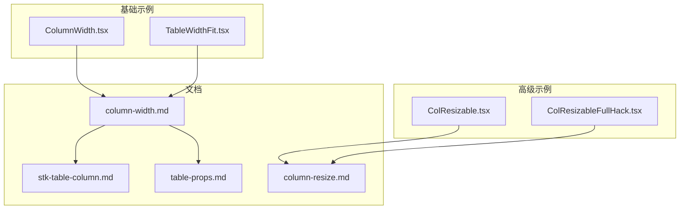
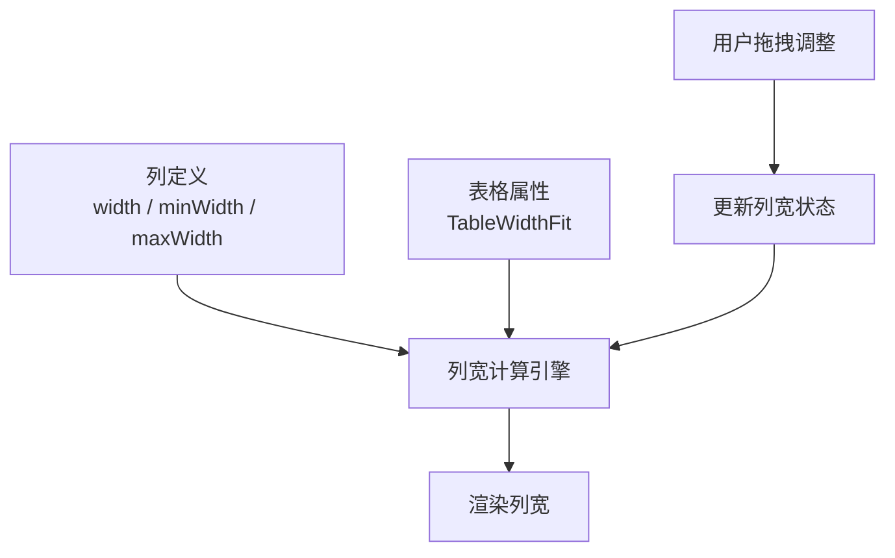
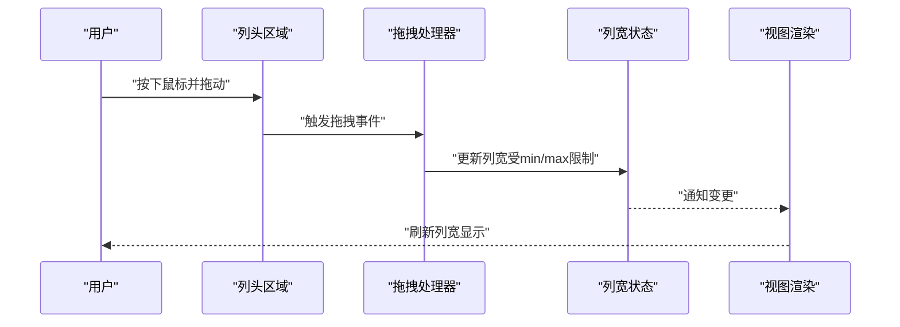
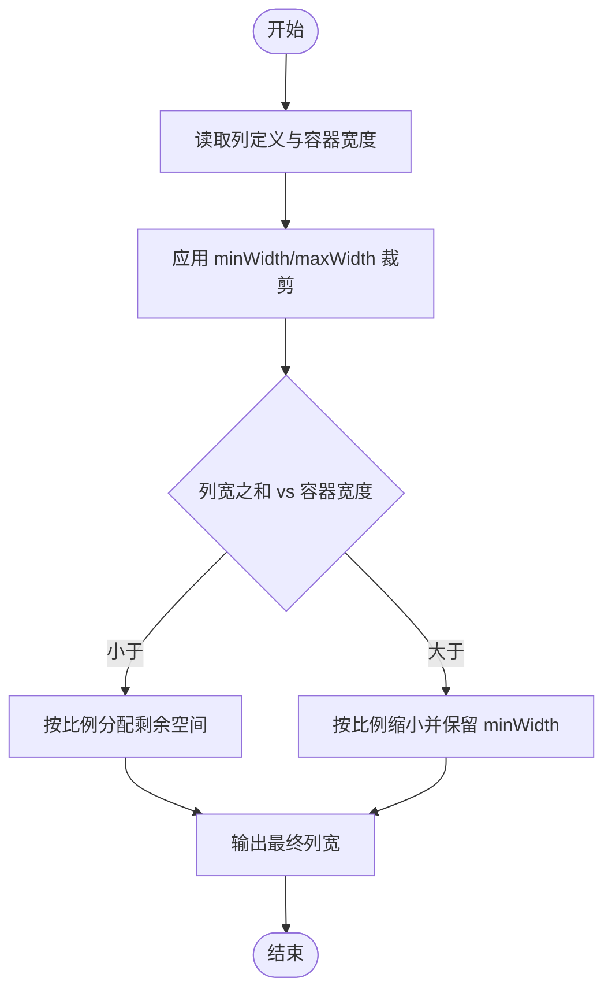
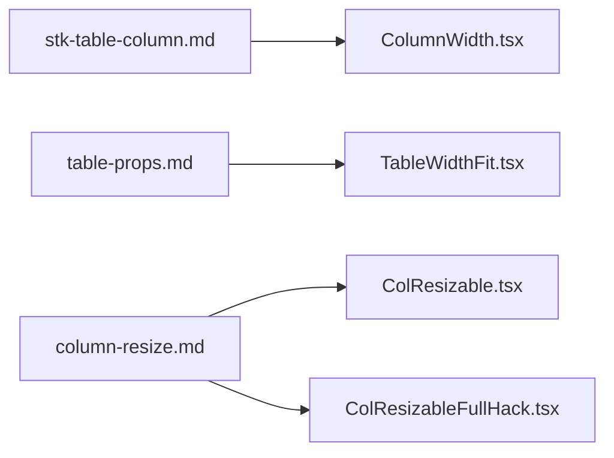

# 列宽设置

<cite>
**本文引用的文件**   
- [ColumnWidth.tsx](file://docs-demo/basic/column-width/ColumnWidth.tsx)
- [TableWidthFit.tsx](file://docs-demo/basic/column-width/TableWidthFit.tsx)
- [column-width.md](file://docs-src/main/table/basic/column-width.md)
- [stk-table-column.md](file://docs-src/main/api/stk-table-column.md)
- [table-props.md](file://docs-src/main/api/table-props.md)
- [column-resize.md](file://docs-src/main/table/advanced/column-resize.md)
- [ColResizable.tsx](file://docs-demo/advanced/column-resize/ColResizable.tsx)
- [ColResizableFullHack.tsx](file://docs-demo/advanced/column-resize/ColResizableFullHack.tsx)
</cite>

## 目录
1. [简介](#简介)
2. [项目结构](#项目结构)
3. [核心组件](#核心组件)
4. [架构总览](#架构总览)
5. [详细组件分析](#详细组件分析)
6. [依赖分析](#依赖分析)
7. [性能考虑](#性能考虑)
8. [故障排查指南](#故障排查指南)
9. [结论](#结论)
10. [附录](#附录)

## 简介
本章节聚焦于表格列宽的完整配置与使用，涵盖固定宽度、自适应宽度、百分比宽度等常见场景；详细说明 width、minWidth、maxWidth 等属性的语义与优先级；提供列宽自适应与表格宽度适配（含 TableWidthFit）的实践路径；解释列宽计算算法要点与性能优化策略；给出响应式设计与移动端优化的建议；并总结常见问题（如列宽冲突、内容溢出）的解决方案以及列宽拖拽调整的高级用法与自定义实现思路。

## 项目结构
围绕“列宽”主题，仓库中与列宽相关的示例与文档主要分布在以下位置：
- 基础示例：docs-demo/basic/column-width
- 高级示例：docs-demo/advanced/column-resize
- 文档说明：docs-src/main/table/basic/column-width.md、docs-src/main/api/stk-table-column.md、docs-src/main/api/table-props.md、docs-src/main/table/advanced/column-resize.md

图表来源
- [ColumnWidth.tsx:1-200](file://docs-demo/basic/column-width/ColumnWidth.tsx#L1-L200)
- [TableWidthFit.tsx:1-200](file://docs-demo/basic/column-width/TableWidthFit.tsx#L1-L200)
- [ColResizable.tsx:1-200](file://docs-demo/advanced/column-resize/ColResizable.tsx#L1-L200)
- [ColResizableFullHack.tsx:1-200](file://docs-demo/advanced/column-resize/ColResizableFullHack.tsx#L1-L200)
- [column-width.md:1-200](file://docs-src/main/table/basic/column-width.md#L1-L200)
- [stk-table-column.md:1-200](file://docs-src/main/api/stk-table-column.md#L1-L200)
- [table-props.md:1-200](file://docs-src/main/api/table-props.md#L1-L200)
- [column-resize.md:1-200](file://docs-src/main/table/advanced/column-resize.md#L1-L200)

章节来源
- [column-width.md:1-200](file://docs-src/main/table/basic/column-width.md#L1-L200)
- [stk-table-column.md:1-200](file://docs-src/main/api/stk-table-column.md#L1-L200)
- [table-props.md:1-200](file://docs-src/main/api/table-props.md#L1-L200)
- [column-resize.md:1-200](file://docs-src/main/table/advanced/column-resize.md#L1-L200)

## 核心组件
- 列定义属性（列级）
  - width：指定列宽，支持像素值或百分比。用于固定宽度或按比例分配。
  - minWidth：列的最小宽度，防止列被压缩到不可读。
  - maxWidth：列的最大宽度，避免列过宽影响整体布局。
  - 典型组合：width + minWidth/maxWidth 形成“有界宽度”，在固定与自适应之间取得平衡。
- 表格级宽度适配（表格级）
  - TableWidthFit：控制表格整体宽度如何与列宽集合匹配，常用于“表格宽度自适应列宽总和”的场景。
- 列宽交互（高级）
  - 列宽拖拽调整：通过高级示例展示如何启用列宽拖拽，包括全宽模式下的处理技巧。

章节来源
- [stk-table-column.md:1-200](file://docs-src/main/api/stk-table-column.md#L1-L200)
- [table-props.md:1-200](file://docs-src/main/api/table-props.md#L1-L200)
- [column-width.md:1-200](file://docs-src/main/table/basic/column-width.md#L1-L200)
- [column-resize.md:1-200](file://docs-src/main/table/advanced/column-resize.md#L1-L200)

## 架构总览
列宽相关能力由“列定义属性 + 表格级适配 + 交互扩展”三层组成：
- 列定义层：width/minWidth/maxWidth 决定单列的初始与边界宽度。
- 表格适配层：TableWidthFit 协调所有列宽与表格容器宽度之间的关系。
- 交互扩展层：列宽拖拽调整允许用户动态修改列宽，并在必要时触发重算与渲染。

图表来源
- [stk-table-column.md:1-200](file://docs-src/main/api/stk-table-column.md#L1-L200)
- [table-props.md:1-200](file://docs-src/main/api/table-props.md#L1-L200)
- [column-resize.md:1-200](file://docs-src/main/table/advanced/column-resize.md#L1-L200)

## 详细组件分析

### 列宽属性与优先级规则
- 属性语义
  - width：优先生效的基础宽度。若为数值则为像素，若为字符串且包含百分号则为百分比。
  - minWidth：约束下限，当其他因素导致列宽小于该值时，按该值显示。
  - maxWidth：约束上限，当其他因素导致列宽大于该值时，按该值显示。
- 优先级与合并策略（概念性说明）
  - 通常顺序：先应用 width 作为基准，再根据容器与相邻列情况做弹性伸缩，最后用 minWidth/maxWidth 进行裁剪。
  - 百分比与像素混合时，需保证总和不超过表格可用宽度；超出时按权重或比例重新分配。
  - 当存在 TableWidthFit 时，表格会尝试让列宽之和等于表格宽度，或在不足时按比例填充剩余空间。
- 适用场景
  - 固定宽度：适合关键信息列（如序号、操作按钮）。
  - 自适应宽度：适合文本描述类列，结合 minWidth/maxWidth 控制可读性与美观度。
  - 百分比宽度：适合多列均分或按比例分配的场景。

章节来源
- [stk-table-column.md:1-200](file://docs-src/main/api/stk-table-column.md#L1-L200)
- [table-props.md:1-200](file://docs-src/main/api/table-props.md#L1-L200)
- [column-width.md:1-200](file://docs-src/main/table/basic/column-width.md#L1-L200)

### 表格宽度适配与 TableWidthFit
- 作用
  - 控制表格整体宽度与列宽集合的关系，使表格在不同容器尺寸下保持良好布局。
- 常见模式
  - 表格宽度等于列宽之和：适合数据密集、无横向滚动的需求。
  - 表格宽度自适应容器：配合百分比列宽，使表格填满父容器。
  - 列宽自适应表格宽度：在列数较多时，自动缩放列宽以适配容器。
- 与列属性的协作
  - 当设置了 minWidth/maxWidth，TableWidthFit 会在满足边界的前提下尽量贴合目标宽度。
  - 当存在固定列或冻结列时，需确保固定列不参与弹性分配或单独计算。

章节来源
- [table-props.md:1-200](file://docs-src/main/api/table-props.md#L1-L200)
- [column-width.md:1-200](file://docs-src/main/table/basic/column-width.md#L1-L200)

### 列宽自适应与表格宽度适配示例
- 列宽自适应
  - 参考示例：ColumnWidth.tsx
  - 要点：为不同列设置合适的 width/minWidth/maxWidth，观察在不同数据长度下的表现。
- 表格宽度适配（TableWidthFit）
  - 参考示例：TableWidthFit.tsx
  - 要点：切换不同的 TableWidthFit 行为，验证表格与列宽之间的联动效果。

章节来源
- [ColumnWidth.tsx:1-200](file://docs-demo/basic/column-width/ColumnWidth.tsx#L1-L200)
- [TableWidthFit.tsx:1-200](file://docs-demo/basic/column-width/TableWidthFit.tsx#L1-L200)
- [column-width.md:1-200](file://docs-src/main/table/basic/column-width.md#L1-L200)

### 列宽拖拽调整与高级用法
- 功能概述
  - 允许用户通过拖拽列头右侧边缘调整列宽，提升可操作性和体验。
- 示例参考
  - ColResizable.tsx：基础拖拽调整示例。
  - ColResizableFullHack.tsx：在全宽模式下对拖拽行为的增强处理。
- 交互流程（概念序列图）

图表来源
- [ColResizable.tsx:1-200](file://docs-demo/advanced/column-resize/ColResizable.tsx#L1-L200)
- [ColResizableFullHack.tsx:1-200](file://docs-demo/advanced/column-resize/ColResizableFullHack.tsx#L1-L200)
- [column-resize.md:1-200](file://docs-src/main/table/advanced/column-resize.md#L1-L200)

章节来源
- [column-resize.md:1-200](file://docs-src/main/table/advanced/column-resize.md#L1-L200)
- [ColResizable.tsx:1-200](file://docs-demo/advanced/column-resize/ColResizable.tsx#L1-L200)
- [ColResizableFullHack.tsx:1-200](file://docs-demo/advanced/column-resize/ColResizableFullHack.tsx#L1-L200)

### 列宽计算算法与流程图
- 输入
  - 列定义：每个列的 width/minWidth/maxWidth。
  - 表格容器宽度：由父容器或显式设置决定。
  - 表格级适配策略：TableWidthFit 的行为。
- 步骤
  - 初始化：收集各列初始宽度（优先使用 width），记录最小/最大边界。
  - 校验与裁剪：将每列宽度限制在 [minWidth, maxWidth] 区间内。
  - 汇总与分配：
    - 若列宽之和小于容器宽度：按比例或按需分配剩余空间。
    - 若列宽之和大于容器宽度：按比例缩小，同时尊重 minWidth。
  - 输出：最终列宽数组与表格宽度。
- 流程图（概念）

[本节为概念性算法说明，不直接映射具体源码文件]

## 依赖分析
- 列定义与表格属性
  - stk-table-column.md 定义了列级属性（width/minWidth/maxWidth 等）。
  - table-props.md 定义了表格级属性（如 TableWidthFit）。
- 示例与文档
  - ColumnWidth.tsx 与 TableWidthFit.tsx 演示了列宽与表格宽度适配的实际用法。
  - column-resize.md 与对应示例展示了列宽拖拽调整的集成方式。

图表来源
- [stk-table-column.md:1-200](file://docs-src/main/api/stk-table-column.md#L1-L200)
- [table-props.md:1-200](file://docs-src/main/api/table-props.md#L1-L200)
- [column-width.md:1-200](file://docs-src/main/table/basic/column-width.md#L1-L200)
- [column-resize.md:1-200](file://docs-src/main/table/advanced/column-resize.md#L1-L200)
- [ColumnWidth.tsx:1-200](file://docs-demo/basic/column-width/ColumnWidth.tsx#L1-L200)
- [TableWidthFit.tsx:1-200](file://docs-demo/basic/column-width/TableWidthFit.tsx#L1-L200)
- [ColResizable.tsx:1-200](file://docs-demo/advanced/column-resize/ColResizable.tsx#L1-L200)
- [ColResizableFullHack.tsx:1-200](file://docs-demo/advanced/column-resize/ColResizableFullHack.tsx#L1-L200)

章节来源
- [stk-table-column.md:1-200](file://docs-src/main/api/stk-table-column.md#L1-L200)
- [table-props.md:1-200](file://docs-src/main/api/table-props.md#L1-L200)
- [column-width.md:1-200](file://docs-src/main/table/basic/column-width.md#L1-L200)
- [column-resize.md:1-200](file://docs-src/main/table/advanced/column-resize.md#L1-L200)

## 性能考虑
- 减少不必要的重排与重绘
  - 批量更新列宽：在拖拽结束时统一计算与渲染，而非每次移动都触发。
  - 使用稳定的 key 与 memoization：避免无关列的重复渲染。
- 合理设置边界
  - 为长文本列设置合理的 minWidth/maxWidth，避免极端宽度导致的布局抖动。
- 大数据量场景
  - 结合虚拟滚动与列宽缓存，降低频繁计算的开销。
- 百分比与像素混合
  - 谨慎使用大量百分比列，避免浏览器反复计算布局；优先使用固定宽度+少量弹性列。

[本节提供通用优化建议，不直接分析具体源码文件]

## 故障排查指南
- 列宽冲突
  - 现象：列宽之和超过容器宽度，出现横向滚动或挤压。
  - 排查：检查是否存在未设置的 width 或过大的固定宽度；确认 minWidth 是否过大。
  - 解决：适当减小固定宽度或放宽 minWidth；启用 TableWidthFit 进行自适应。
- 内容溢出
  - 现象：单元格内容被截断或换行异常。
  - 排查：确认列的 minWidth 是否过小；检查单元格样式是否强制不换行。
  - 解决：增大 minWidth 或允许换行；为超长文本提供省略或提示。
- 拖拽后布局错乱
  - 现象：拖拽结束后列宽不一致或错位。
  - 排查：检查拖拽逻辑是否正确应用 minWidth/maxWidth；确认是否在拖拽过程中触发了多次重算。
  - 解决：在拖拽结束时统一计算；确保状态更新与渲染同步。

章节来源
- [column-resize.md:1-200](file://docs-src/main/table/advanced/column-resize.md#L1-L200)
- [column-width.md:1-200](file://docs-src/main/table/basic/column-width.md#L1-L200)

## 结论
列宽设置是表格体验的核心之一。通过合理配置 width/minWidth/maxWidth，并结合 TableWidthFit 的表格级适配策略，可以在多种屏幕尺寸与数据形态下获得稳定、可读的布局。对于复杂场景，引入列宽拖拽调整能显著提升可用性。遵循本文提供的优先级规则、计算流程与性能优化建议，可有效避免常见布局问题并提升整体性能。

## 附录
- 快速参考
  - 列级属性：width、minWidth、maxWidth
  - 表格级属性：TableWidthFit
  - 交互扩展：列宽拖拽调整（参考高级示例）
- 示例路径
  - 列宽示例：docs-demo/basic/column-width/ColumnWidth.tsx
  - 表格宽度适配示例：docs-demo/basic/column-width/TableWidthFit.tsx
  - 列宽拖拽示例：docs-demo/advanced/column-resize/ColResizable.tsx、ColResizableFullHack.tsx
- 文档路径
  - 列宽基础：docs-src/main/table/basic/column-width.md
  - 列定义 API：docs-src/main/api/stk-table-column.md
  - 表格属性 API：docs-src/main/api/table-props.md
  - 列宽拖拽：docs-src/main/table/advanced/column-resize.md