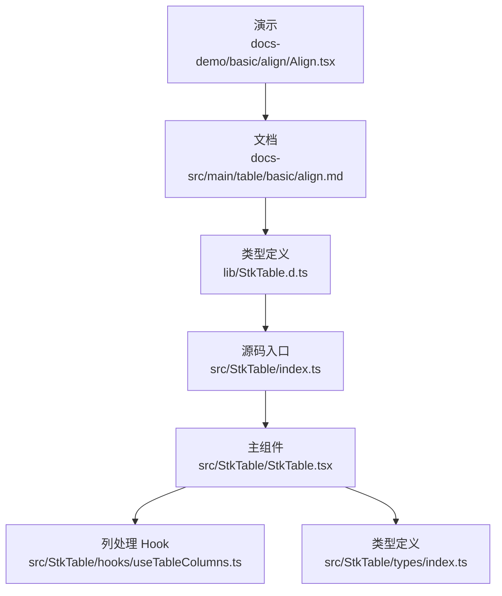
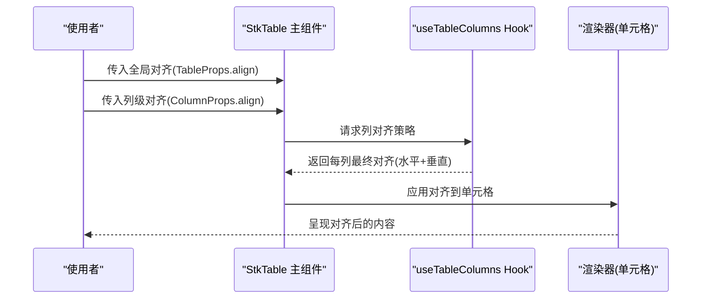
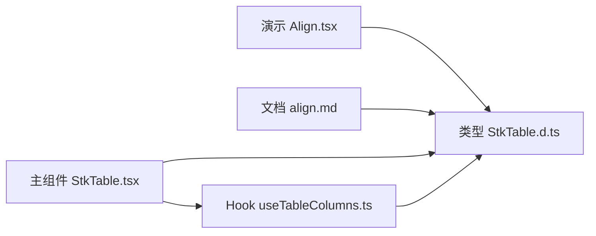

# 列对齐

<cite>
**本文引用的文件**   
- [Align.tsx](file://docs-demo/basic/align/Align.tsx)
- [align.md](file://docs-src/main/table/basic/align.md)
- [StkTable.d.ts](file://lib/StkTable.d.ts)
- [stk-table-column.md](file://docs-src/main/api/stk-table-column.md)
- [table-props.md](file://docs-src/main/api/table-props.md)
- [index.ts](file://src/StkTable/index.ts)
- [StkTable.tsx](file://src/StkTable/StkTable.tsx)
- [useTableColumns.ts](file://src/StkTable/hooks/useTableColumns.ts)
- [types/index.ts](file://src/StkTable/types/index.ts)
</cite>

## 目录
1. [简介](#简介)
2. [项目结构](#项目结构)
3. [核心组件](#核心组件)
4. [架构总览](#架构总览)
5. [详细组件分析](#详细组件分析)
6. [依赖关系分析](#依赖关系分析)
7. [性能考虑](#性能考虑)
8. [故障排查指南](#故障排查指南)
9. [结论](#结论)
10. [附录](#附录)

## 简介
本章节聚焦于“列对齐”能力，系统说明文本与内容的水平对齐（左、中、右）与垂直对齐设置，覆盖全局对齐配置与单列覆盖策略，并给出丰富的示例路径与最佳实践。同时解释对齐属性与其他样式属性的交互关系，提供响应式适配方案、常见问题定位方法与性能优化建议。

## 项目结构
围绕“对齐”功能，仓库包含演示、文档与源码三部分内容：
- 演示入口：基础示例位于 docs-demo/basic/align/Align.tsx
- 文档说明：对齐 API 与用法在 docs-src/main/table/basic/align.md
- 类型定义：列与表格的 props 类型集中在 lib/StkTable.d.ts
- 源码实现：对齐逻辑贯穿 StkTable 主组件、列处理 Hook 与类型定义

图示来源
- [Align.tsx:1-200](file://docs-demo/basic/align/Align.tsx#L1-L200)
- [align.md:1-200](file://docs-src/main/table/basic/align.md#L1-L200)
- [StkTable.d.ts:1-200](file://lib/StkTable.d.ts#L1-L200)
- [index.ts:1-200](file://src/StkTable/index.ts#L1-L200)
- [StkTable.tsx:1-200](file://src/StkTable/StkTable.tsx#L1-L200)
- [useTableColumns.ts:1-200](file://src/StkTable/hooks/useTableColumns.ts#L1-L200)
- [types/index.ts:1-200](file://src/StkTable/types/index.ts#L1-L200)

章节来源
- [Align.tsx:1-200](file://docs-demo/basic/align/Align.tsx#L1-L200)
- [align.md:1-200](file://docs-src/main/table/basic/align.md#L1-L200)
- [StkTable.d.ts:1-200](file://lib/StkTable.d.ts#L1-L200)
- [index.ts:1-200](file://src/StkTable/index.ts#L1-L200)
- [StkTable.tsx:1-200](file://src/StkTable/StkTable.tsx#L1-L200)
- [useTableColumns.ts:1-200](file://src/StkTable/hooks/useTableColumns.ts#L1-L200)
- [types/index.ts:1-200](file://src/StkTable/types/index.ts#L1-L200)

## 核心组件
- 演示组件 Align.tsx：展示不同对齐场景的组合用法，包括全局与单列覆盖、多列组合等。
- 文档 align.md：对齐能力的官方说明，涵盖属性含义、优先级与示例链接。
- 类型定义 StkTable.d.ts：暴露 TableProps 与 ColumnProps 的对齐相关字段，明确取值范围与作用域。
- 源码 StkTable.tsx：解析全局与列级对齐，计算最终样式并应用到单元格渲染。
- Hook useTableColumns.ts：合并全局与列级对齐，生成每列的最终对齐策略。
- 类型 types/index.ts：内部对齐枚举与工具类型定义。

章节来源
- [Align.tsx:1-200](file://docs-demo/basic/align/Align.tsx#L1-L200)
- [align.md:1-200](file://docs-src/main/table/basic/align.md#L1-L200)
- [StkTable.d.ts:1-200](file://lib/StkTable.d.ts#L1-L200)
- [StkTable.tsx:1-200](file://src/StkTable/StkTable.tsx#L1-L200)
- [useTableColumns.ts:1-200](file://src/StkTable/hooks/useTableColumns.ts#L1-L200)
- [types/index.ts:1-200](file://src/StkTable/types/index.ts#L1-L200)

## 架构总览
对齐功能的整体流程如下：
- 用户通过 TableProps 设置全局对齐，或通过 ColumnProps 为单列指定对齐。
- 主组件读取全局与列级配置，交由列处理 Hook 进行合并与归一化。
- 最终对齐结果应用于单元格 DOM 节点，驱动 CSS 布局生效。

图示来源
- [StkTable.tsx:1-200](file://src/StkTable/StkTable.tsx#L1-L200)
- [useTableColumns.ts:1-200](file://src/StkTable/hooks/useTableColumns.ts#L1-L200)

## 详细组件分析

### 对齐属性与取值
- 水平对齐：支持左对齐、居中对齐、右对齐。
- 垂直对齐：支持顶部、居中、底部对齐。
- 作用域：
  - 全局：通过表格级别属性统一设置默认对齐。
  - 单列：通过列级别属性覆盖全局默认值。
- 优先级：列级 > 全局。

章节来源
- [align.md:1-200](file://docs-src/main/table/basic/align.md#L1-L200)
- [StkTable.d.ts:1-200](file://lib/StkTable.d.ts#L1-L200)

### 全局对齐配置
- 在表格根属性中设置默认对齐，适用于所有未显式声明列对齐的列。
- 适合统一风格或主题化的场景，减少重复配置。

章节来源
- [table-props.md:1-200](file://docs-src/main/api/table-props.md#L1-L200)
- [StkTable.d.ts:1-200](file://lib/StkTable.d.ts#L1-L200)

### 单列对齐覆盖
- 在列定义中单独设置对齐，可覆盖全局默认。
- 常用于数值列右对齐、标题列左对齐、图标列居中等差异化需求。

章节来源
- [stk-table-column.md:1-200](file://docs-src/main/api/stk-table-column.md#L1-L200)
- [StkTable.d.ts:1-200](file://lib/StkTable.d.ts#L1-L200)

### 对齐与样式的交互
- 与宽度控制：当列宽固定时，水平对齐效果更稳定；自适应宽度下，注意内容换行对视觉的影响。
- 与溢出处理：超长文本需结合省略或换行策略，避免破坏对齐预期。
- 与行高：垂直对齐在多行文本或复杂单元格中尤为重要，确保视觉重心一致。
- 与主题变量：若使用 CSS 变量控制间距与字号，应保证对齐不受字体度量差异影响。

章节来源
- [align.md:1-200](file://docs-src/main/table/basic/align.md#L1-L200)
- [StkTable.d.ts:1-200](file://lib/StkTable.d.ts#L1-L200)

### 响应式设计与屏幕适配
- 小屏优先：在窄屏下，建议将关键信息列设置为左对齐以提升可读性；数值列保持右对齐便于比较。
- 横屏与桌面：可使用居中对齐提升对称感，但避免过度居中导致阅读动线变长。
- 动态列数：列数量变化时，尽量以全局默认对齐为主，仅在必要列上覆盖。

章节来源
- [align.md:1-200](file://docs-src/main/table/basic/align.md#L1-L200)

### 常见对齐问题与解决方案
- 问题：数字与中文混排时视觉不整齐
  - 解决：数值列统一右对齐，文本列左对齐；必要时使用等宽字体或格式化显示。
- 问题：多行文本垂直错位
  - 解决：设置合适的行高与垂直对齐，避免行内元素高度不一致。
- 问题：固定列与滚动容器边界导致的偏移
  - 解决：检查容器 padding/margin 与对齐方向是否冲突，必要时调整盒模型。
- 问题：虚拟滚动下的抖动
  - 解决：固定行高或使用稳定的估算策略，避免频繁重排。

章节来源
- [align.md:1-200](file://docs-src/main/table/basic/align.md#L1-L200)

### 代码示例路径
- 基础对齐示例：[Align.tsx](file://docs-demo/basic/align/Align.tsx)
- 文档示例集合：[align.md](file://docs-src/main/table/basic/align.md)

章节来源
- [Align.tsx:1-200](file://docs-demo/basic/align/Align.tsx#L1-L200)
- [align.md:1-200](file://docs-src/main/table/basic/align.md#L1-L200)

## 依赖关系分析
对齐相关的模块耦合关系如下：
- 演示与文档依赖类型定义，用于正确配置与理解行为。
- 主组件依赖列处理 Hook 完成对齐合并。
- 类型定义贯穿演示、文档与源码，保障一致性。

图示来源
- [Align.tsx:1-200](file://docs-demo/basic/align/Align.tsx#L1-L200)
- [align.md:1-200](file://docs-src/main/table/basic/align.md#L1-L200)
- [StkTable.d.ts:1-200](file://lib/StkTable.d.ts#L1-L200)
- [StkTable.tsx:1-200](file://src/StkTable/StkTable.tsx#L1-L200)
- [useTableColumns.ts:1-200](file://src/StkTable/hooks/useTableColumns.ts#L1-L200)

章节来源
- [StkTable.d.ts:1-200](file://lib/StkTable.d.ts#L1-L200)
- [StkTable.tsx:1-200](file://src/StkTable/StkTable.tsx#L1-L200)
- [useTableColumns.ts:1-200](file://src/StkTable/hooks/useTableColumns.ts#L1-L200)

## 性能考虑
- 避免频繁变更对齐：对齐属于布局属性，频繁切换可能触发重排，建议在数据层预计算并批量更新。
- 合理设置行高：固定行高可减少测量开销，提升虚拟滚动稳定性。
- 最小化列级覆盖：仅在必要列上覆盖对齐，降低合并计算复杂度。
- 谨慎使用自定义单元格：复杂渲染会放大布局抖动，尽量复用内置单元格或简化样式。

## 故障排查指南
- 确认属性作用域：检查是全局还是列级设置，以及是否存在覆盖冲突。
- 验证类型取值：对照类型定义中的合法取值，避免非法值导致回退默认。
- 检查容器样式：确认父容器的 box-sizing、padding、margin 是否影响对齐。
- 观察渲染时机：在异步数据加载后再次校验对齐是否正确应用。

章节来源
- [StkTable.d.ts:1-200](file://lib/StkTable.d.ts#L1-L200)
- [align.md:1-200](file://docs-src/main/table/basic/align.md#L1-L200)

## 结论
通过对齐的全局与列级配置，可以灵活控制表格内容的水平与垂直布局。遵循优先级规则与样式交互原则，结合响应式策略与性能优化，可获得稳定且易维护的对齐体验。

## 附录
- 快速上手：参考演示与文档中的示例路径，逐步尝试不同对齐组合。
- 进阶定制：结合自定义单元格与主题变量，实现更精细的对齐表现。