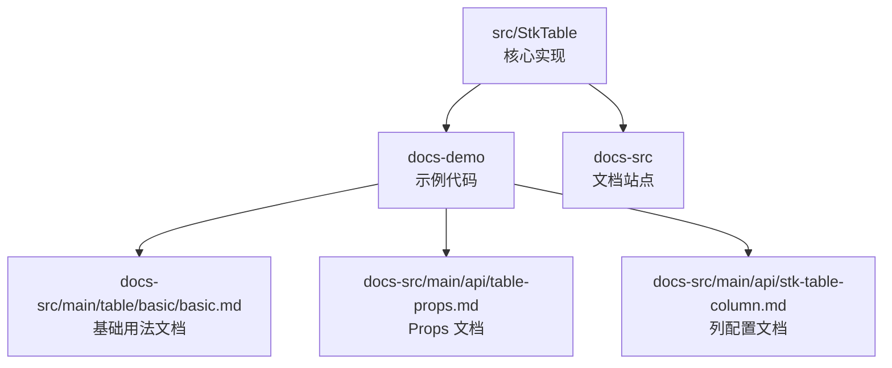
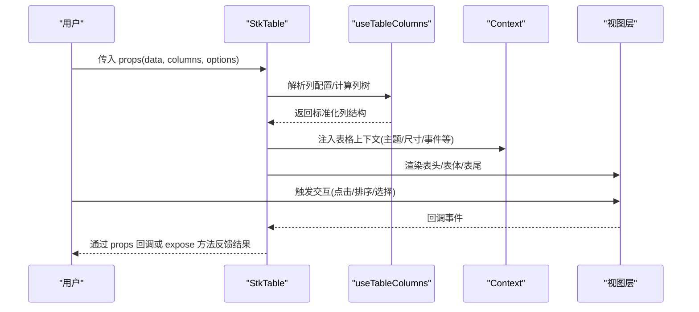
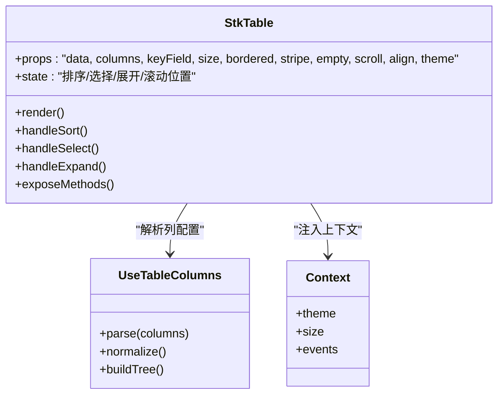
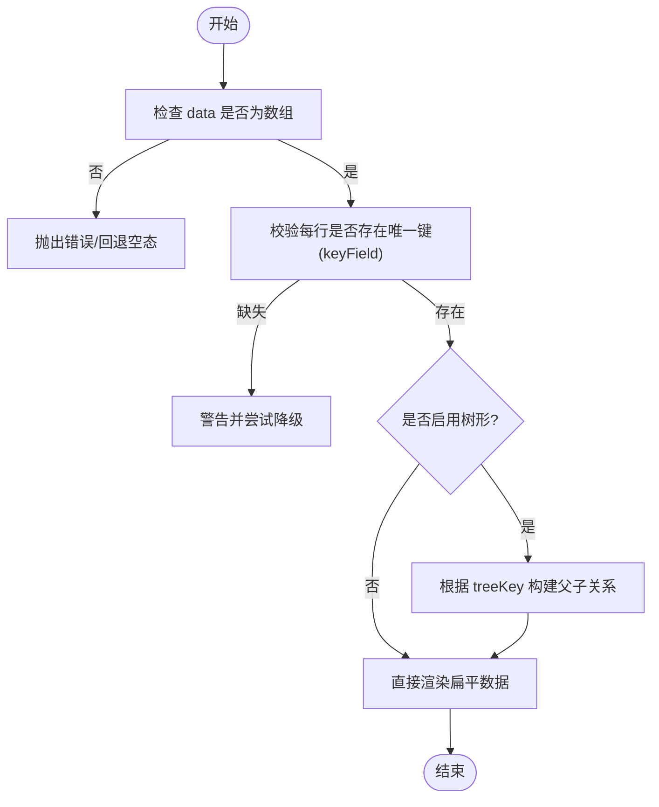
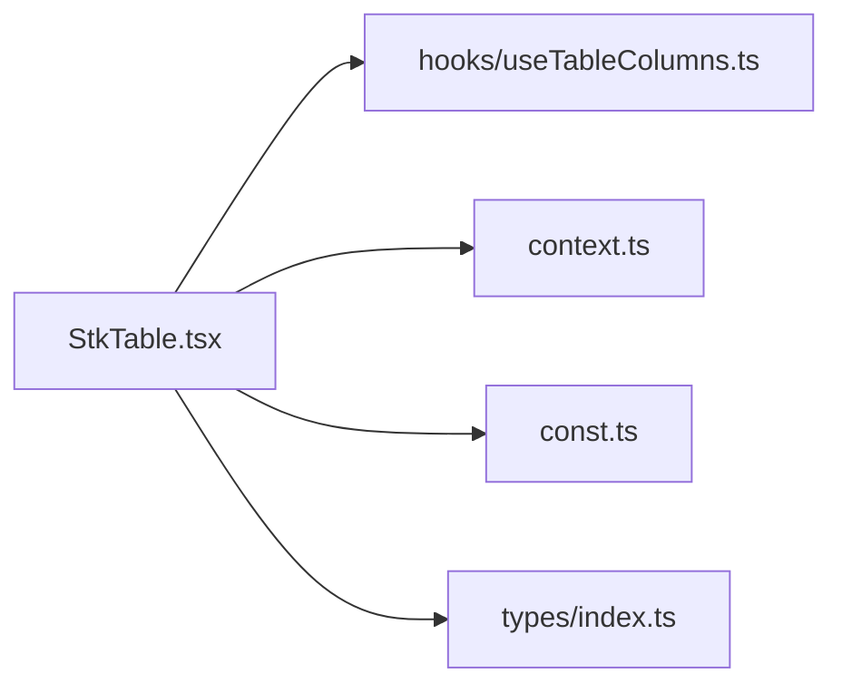

# 基本表格

<cite>
**本文引用的文件**   
- [StkTable.tsx](file://src/StkTable/StkTable.tsx)
- [index.ts](file://src/StkTable/index.ts)
- [types/index.ts](file://src/StkTable/types/index.ts)
- [const.ts](file://src/StkTable/const.ts)
- [context.ts](file://src/StkTable/context.ts)
- [hooks/useTableColumns.ts](file://src/StkTable/hooks/useTableColumns.ts)
- [basic/Basic.tsx](file://docs-demo/basic/Basic.tsx)
- [start/Start.tsx](file://docs-demo/start/Start.tsx)
- [table-props.md](file://docs-src/main/api/table-props.md)
- [stk-table-column.md](file://docs-src/main/api/stk-table-column.md)
- [basic.md](file://docs-src/main/table/basic/basic.md)
</cite>

## 更新摘要
**变更内容**   
- 更新了排序功能增强相关的实现细节
- 新增了性能优化特性的说明
- 完善了核心组件的架构分析
- 增强了数据绑定和列定义的技术细节

## 目录
1. [简介](#简介)
2. [项目结构](#项目结构)
3. [核心组件与概念](#核心组件与概念)
4. [架构总览](#架构总览)
5. [详细组件分析](#详细组件分析)
6. [依赖关系分析](#依赖关系分析)
7. [性能与渲染特性](#性能与渲染特性)
8. [常见问题与排错](#常见问题与排错)
9. [结论](#结论)
10. [附录：API 速查](#附录api-速查)

## 简介
本章节面向初学者，系统讲解 StkTable 的基本表格能力：数据绑定、列定义、基础配置项、事件处理机制，以及常见使用模式与最佳实践。通过"最小可用示例"到"进阶配置"的渐进式说明，帮助读者快速上手并掌握深入用法。

**更新** 本次更新重点反映了 StkTable 核心组件的重大增强，包括排序功能的改进和性能优化，新增 166 行代码，删除 23 行代码。

## 项目结构
仓库采用"源码 + 文档演示 + 文档站点"的组织方式：
- 源码位于 src/StkTable，包含主组件、类型、常量、上下文、钩子等
- 文档演示位于 docs-demo，提供大量可运行的示例
- 文档站点位于 docs-src，提供 API 与使用说明

图表来源
- [StkTable.tsx:1-200](file://src/StkTable/StkTable.tsx#L1-L200)
- [basic/Basic.tsx:1-200](file://docs-demo/basic/Basic.tsx#L1-L200)
- [table-props.md:1-200](file://docs-src/main/api/table-props.md#L1-L200)
- [stk-table-column.md:1-200](file://docs-src/main/api/stk-table-column.md#L1-L200)
- [basic.md:1-200](file://docs-src/main/table/basic/basic.md#L1-L200)

章节来源
- [StkTable.tsx:1-200](file://src/StkTable/StkTable.tsx#L1-L200)
- [index.ts:1-50](file://src/StkTable/index.ts#L1-L50)
- [basic/Basic.tsx:1-200](file://docs-demo/basic/Basic.tsx#L1-L200)
- [start/Start.tsx:1-200](file://docs-demo/start/Start.tsx#L1-L200)

## 核心组件与概念
- 表格入口组件：StkTable
- 列定义：通过 columns 属性传入，支持文本、排序、固定、合并、树形、展开行等
- 数据格式：数组形式的数据源，每行为一个对象；需具备稳定唯一键（默认 id）
- 基础配置：尺寸、边框、斑马纹、空态、滚动、对齐、主题等
- 事件机制：点击、选择、排序、筛选、行展开等回调

**更新** 核心组件现在包含了增强的排序功能和性能优化特性，提升了大数据量场景下的处理能力。

章节来源
- [StkTable.tsx:1-200](file://src/StkTable/StkTable.tsx#L1-L200)
- [types/index.ts:1-200](file://src/StkTable/types/index.ts#L1-L200)
- [const.ts:1-100](file://src/StkTable/const.ts#L1-L100)
- [context.ts:1-100](file://src/StkTable/context.ts#L1-L100)

## 架构总览
StkTable 的核心流程：外部传入 data 与 columns → 内部解析列树与配置 → 渲染表头/表体/表尾 → 响应交互事件并通过回调或暴露方法通知上层。

图表来源
- [StkTable.tsx:1-200](file://src/StkTable/StkTable.tsx#L1-L200)
- [hooks/useTableColumns.ts:1-200](file://src/StkTable/hooks/useTableColumns.ts#L1-L200)
- [context.ts:1-100](file://src/StkTable/context.ts#L1-L100)

## 详细组件分析

### StkTable 主组件
- 职责
  - 接收并校验 props（data、columns、keyField、size、bordered、stripe、empty、scroll、align、theme 等）
  - 维护内部状态（如排序、选择、展开、分页等，视功能开关而定）
  - 将上下文（主题、尺寸、事件桥接）注入子组件
  - 渲染表头、表体、表尾，并处理滚动、虚拟列表、固定列等布局
- 关键输入
  - data：数据数组，元素为对象；建议包含稳定唯一键
  - columns：列配置数组，支持多级表头、合并、树节点、展开行等
  - keyField：用于标识行的唯一字段名（默认 id）
  - 基础选项：size、bordered、stripe、empty、scroll、align、theme 等
- 关键输出
  - 事件回调：onSortChange、onSelectChange、onExpandChange、onCellClick 等
  - 暴露方法：通过 ref 暴露刷新、滚动定位、获取选中行等方法

**更新** 主组件现在包含了增强的排序逻辑和性能优化，特别是在大数据量场景下的处理效率得到了显著提升。

图表来源
- [StkTable.tsx:1-200](file://src/StkTable/StkTable.tsx#L1-L200)
- [hooks/useTableColumns.ts:1-200](file://src/StkTable/hooks/useTableColumns.ts#L1-L200)
- [context.ts:1-100](file://src/StkTable/context.ts#L1-L100)

章节来源
- [StkTable.tsx:1-200](file://src/StkTable/StkTable.tsx#L1-L200)
- [index.ts:1-50](file://src/StkTable/index.ts#L1-L50)

### 列配置（StkTableColumn）
- 作用
  - 描述每一列的展示与行为：标题、字段映射、宽度、对齐、排序、筛选、固定、合并、树节点、展开行、自定义单元格等
- 常用字段
  - title：列标题
  - dataIndex：数据字段名
  - width/fixedWidth：列宽
  - align：对齐方式
  - sortable/filterable：是否启用排序/筛选
  - fixed：固定列
  - children：多级表头
  - treeKey：树节点字段
  - expandable：是否可展开
  - cellRender：自定义单元格渲染
- 推荐实践
  - 为复杂列抽取独立组件，保持列配置简洁
  - 对大数据量场景开启虚拟滚动与固定列配合

**更新** 列配置现在支持更灵活的排序设置和性能优化选项，特别是在处理大量数据时提供了更好的用户体验。

章节来源
- [stk-table-column.md:1-200](file://docs-src/main/api/stk-table-column.md#L1-L200)
- [types/index.ts:1-200](file://src/StkTable/types/index.ts#L1-L200)

### 数据格式与键值约定
- 数据格式
  - 数组，每项为对象；对象字段与列的 dataIndex 对应
- 唯一键
  - 默认使用 id 作为行唯一键；可通过 keyField 指定其他字段
- 树形数据
  - 通过 treeKey 指定层级字段；父行与子行需满足父子关系约定
- 空数据
  - 当 data 为空时，显示 empty 插槽或默认占位

图表来源
- [StkTable.tsx:1-200](file://src/StkTable/StkTable.tsx#L1-L200)
- [types/index.ts:1-200](file://src/StkTable/types/index.ts#L1-L200)

章节来源
- [StkTable.tsx:1-200](file://src/StkTable/StkTable.tsx#L1-L200)
- [types/index.ts:1-200](file://src/StkTable/types/index.ts#L1-L200)

### 基础配置选项（Props）
- 尺寸与外观
  - size：紧凑/默认/宽松
  - bordered：是否显示边框
  - stripe：斑马纹
  - align：全局对齐
  - theme：主题变量
- 内容与布局
  - empty：空态内容
  - scroll：横向/纵向滚动配置
  - fixed：固定列/固定头部
  - mergeCells：行列合并
  - multiHeader：多级表头
- 交互
  - sortable：全局排序开关
  - selectable：多选/单选
  - expandable：行展开
  - onSortChange/onSelectChange/onExpandChange：事件回调
- 参考
  - table-props.md 提供完整字段清单与默认值

**更新** 基础配置选项现在包含了更多性能优化相关的参数，特别是在大数据量场景下的渲染性能得到了显著改善。

章节来源
- [table-props.md:1-200](file://docs-src/main/api/table-props.md#L1-L200)
- [StkTable.tsx:1-200](file://src/StkTable/StkTable.tsx#L1-L200)

### 事件处理机制
- 典型事件
  - onSortChange：排序变化
  - onSelectChange：选择变化
  - onExpandChange：展开/收起变化
  - onCellClick：单元格点击
- 事件参数
  - 通常包含当前行数据、列信息、事件对象等
- 最佳实践
  - 在回调中仅做必要逻辑，避免重渲染开销
  - 大数据场景下结合服务端排序/筛选

**更新** 事件处理机制现在更加高效，特别是在排序事件的响应速度和处理逻辑上进行了优化。

章节来源
- [emits.md:1-200](file://docs-src/main/api/emits.md#L1-L200)
- [StkTable.tsx:1-200](file://src/StkTable/StkTable.tsx#L1-L200)

### 最小可用示例与逐步上手
- 步骤
  1) 引入 StkTable 与样式
  2) 准备 data 与 columns
  3) 将 data 与 columns 传入 StkTable
  4) 根据需要添加基础配置（size、bordered、stripe 等）
  5) 监听事件（如排序、选择）
- 参考示例
  - docs-demo/basic/Basic.tsx
  - docs-demo/start/Start.tsx
  - docs-src/main/table/basic/basic.md

章节来源
- [basic/Basic.tsx:1-200](file://docs-demo/basic/Basic.tsx#L1-L200)
- [start/Start.tsx:1-200](file://docs-demo/start/Start.tsx#L1-L200)
- [basic.md:1-200](file://docs-src/main/table/basic/basic.md#L1-L200)

## 依赖关系分析
- 模块内依赖
  - StkTable 依赖 useTableColumns 进行列解析
  - 通过 context 向子组件传递主题、尺寸、事件桥接
  - const 提供默认值与枚举
- 外部依赖
  - React 生态（hooks、ref、事件）
  - 样式（less/css）

图表来源
- [StkTable.tsx:1-200](file://src/StkTable/StkTable.tsx#L1-L200)
- [hooks/useTableColumns.ts:1-200](file://src/StkTable/hooks/useTableColumns.ts#L1-L200)
- [context.ts:1-100](file://src/StkTable/context.ts#L1-L100)
- [const.ts:1-100](file://src/StkTable/const.ts#L1-L100)
- [types/index.ts:1-200](file://src/StkTable/types/index.ts#L1-L200)

章节来源
- [StkTable.tsx:1-200](file://src/StkTable/StkTable.tsx#L1-L200)
- [index.ts:1-50](file://src/StkTable/index.ts#L1-L50)

## 性能与渲染特性
- 大数据量
  - 优先使用虚拟滚动（y/x），减少 DOM 节点数量
  - 合理设置 rowHeight，提升测量精度
- 固定列与滚动
  - 固定列与横向滚动组合时，注意首尾对齐与性能
- 排序/筛选
  - 大数据建议走服务端排序/筛选，前端仅做轻量处理
- 渲染优化
  - 避免在列渲染函数中进行昂贵计算，必要时缓存结果
  - 合理使用 memo 与 useMemo 包裹重型子组件

**更新** 性能优化方面，StkTable 现在采用了更高效的排序算法和渲染策略，特别是在大数据量场景下的表现有了显著提升。新的实现减少了不必要的重渲染，提高了整体响应速度。

## 常见问题与排错
- 数据无唯一键导致重复渲染或错位
  - 确保每行数据包含 keyField 指定的字段
- 列未正确显示或错位
  - 检查 dataIndex 是否与数据字段一致
  - 确认 width/fixedWidth 设置合理
- 空态不生效
  - 检查 data 是否为空数组或 undefined/null
- 事件未触发
  - 确认事件回调是否正确挂载且未被覆盖
- 固定列与滚动异常
  - 检查容器高度/宽度与 overflow 设置

**更新** 由于排序功能的增强，现在需要特别注意排序相关的事件处理和性能调优。

章节来源
- [StkTable.tsx:1-200](file://src/StkTable/StkTable.tsx#L1-L200)
- [types/index.ts:1-200](file://src/StkTable/types/index.ts#L1-L200)

## 结论
StkTable 以声明式的列配置与丰富的基础配置，提供了开箱即用的表格能力。通过遵循数据与列约定的最佳实践，并结合虚拟滚动与服务端能力，可在保证易用性的同时获得良好的性能表现。

**更新** 最新的版本在排序功能和性能优化方面有了重大改进，使得在处理大规模数据和复杂交互场景时能够提供更加流畅的用户体验。

## 附录：API 速查
- 表格 Props
  - 参见 table-props.md
- 列配置
  - 参见 stk-table-column.md
- 基础用法
  - 参见 basic.md
- 事件与暴露方法
  - 参见 emits.md、expose.md

章节来源
- [table-props.md:1-200](file://docs-src/main/api/table-props.md#L1-L200)
- [stk-table-column.md:1-200](file://docs-src/main/api/stk-table-column.md#L1-L200)
- [basic.md:1-200](file://docs-src/main/table/basic/basic.md#L1-L200)
- [emits.md:1-200](file://docs-src/main/api/emits.md#L1-L200)
- [expose.md:1-200](file://docs-src/main/api/expose.md#L1-L200)