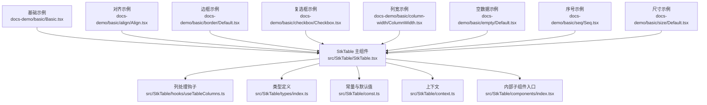
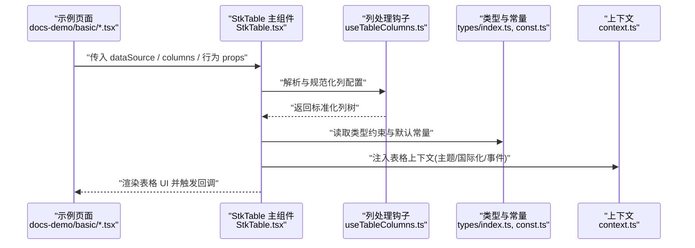
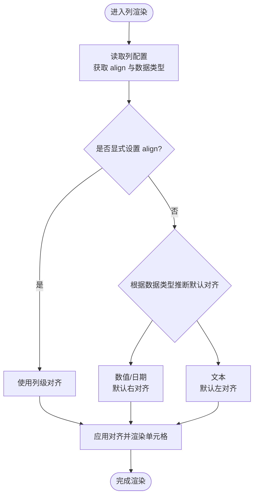
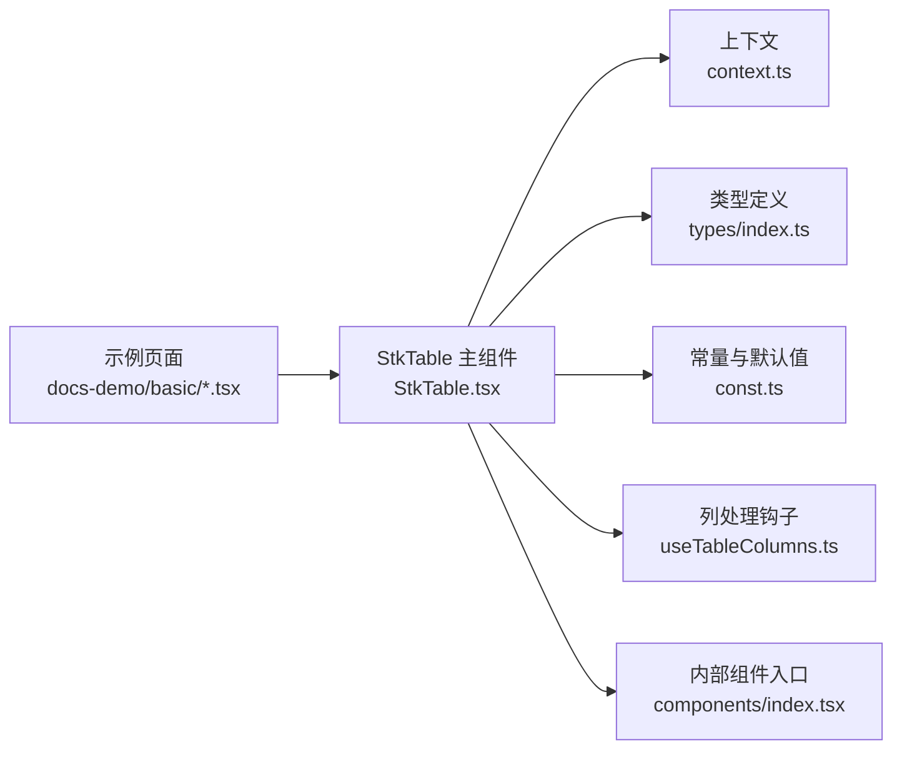

# 基础功能

<cite>
**本文引用的文件**   
- [src/StkTable/StkTable.tsx](file://src/StkTable/StkTable.tsx)
- [src/StkTable/components/index.tsx](file://src/StkTable/components/index.tsx)
- [src/StkTable/types/index.ts](file://src/StkTable/types/index.ts)
- [src/StkTable/const.ts](file://src/StkTable/const.ts)
- [src/StkTable/context.ts](file://src/StkTable/context.ts)
- [src/StkTable/hooks/useTableColumns.ts](file://src/StkTable/hooks/useTableColumns.ts)
- [docs-demo/basic/Basic.tsx](file://docs-demo/basic/Basic.tsx)
- [docs-demo/basic/align/Align.tsx](file://docs-demo/basic/align/Align.tsx)
- [docs-demo/basic/border/Default.tsx](file://docs-demo/basic/border/Default.tsx)
- [docs-demo/basic/checkbox/Checkbox.tsx](file://docs-demo/basic/checkbox/Checkbox.tsx)
- [docs-demo/basic/column-width/ColumnWidth.tsx](file://docs-demo/basic/column-width/ColumnWidth.tsx)
- [docs-demo/basic/empty/Default.tsx](file://docs-demo/basic/empty/Default.tsx)
- [docs-demo/basic/seq/Seq.tsx](file://docs-demo/basic/seq/Seq.tsx)
- [docs-demo/basic/size/Default.tsx](file://docs-demo/basic/size/Default.tsx)
- [docs-src/main/table/basic/align.md](file://docs-src/main/table/basic/align.md)
- [docs-src/main/table/basic/bordered.md](file://docs-src/main/table/basic/bordered.md)
- [docs-src/main/table/basic/checkbox.md](file://docs-src/main/table/basic/checkbox.md)
- [docs-src/main/table/basic/column-width.md](file://docs-src/main/table/basic/column-width.md)
- [docs-src/main/table/basic/empty.md](file://docs-src/main/table/basic/empty.md)
- [docs-src/main/table/basic/seq.md](file://docs-src/main/table/basic/seq.md)
- [docs-src/main/table/basic/size.md](file://docs-src/main/table/basic/size.md)
</cite>

## 目录
1. [简介](#简介)
2. [项目结构](#项目结构)
3. [核心组件](#核心组件)
4. [架构总览](#架构总览)
5. [详细组件分析](#详细组件分析)
6. [依赖关系分析](#依赖关系分析)
7. [性能与响应式建议](#性能与响应式建议)
8. [常见问题排查](#常见问题排查)
9. [结论](#结论)
10. [附录：属性速查](#附录属性速查)

## 简介
本章节聚焦 StkTable 的基础能力，围绕“数据绑定、列定义、对齐方式、边框样式、复选框、列宽设置、空数据处理、序列号显示、尺寸控制”等常用特性进行系统化说明。文档以源码为依据，结合官方示例与文档页面，提供可落地的使用指南与最佳实践，帮助初学者快速上手，也为有经验的开发者提供参考。

## 项目结构
StkTable 的核心实现位于 src/StkTable 目录，包含主组件、类型定义、常量、上下文、钩子与内置自定义单元格等；演示与文档位于 docs-demo 与 docs-src。

图表来源
- [src/StkTable/StkTable.tsx](file://src/StkTable/StkTable.tsx)
- [src/StkTable/hooks/useTableColumns.ts](file://src/StkTable/hooks/useTableColumns.ts)
- [src/StkTable/types/index.ts](file://src/StkTable/types/index.ts)
- [src/StkTable/const.ts](file://src/StkTable/const.ts)
- [src/StkTable/context.ts](file://src/StkTable/context.ts)
- [src/StkTable/components/index.tsx](file://src/StkTable/components/index.tsx)
- [docs-demo/basic/Basic.tsx](file://docs-demo/basic/Basic.tsx)
- [docs-demo/basic/align/Align.tsx](file://docs-demo/basic/align/Align.tsx)
- [docs-demo/basic/border/Default.tsx](file://docs-demo/basic/border/Default.tsx)
- [docs-demo/basic/checkbox/Checkbox.tsx](file://docs-demo/basic/checkbox/Checkbox.tsx)
- [docs-demo/basic/column-width/ColumnWidth.tsx](file://docs-demo/basic/column-width/ColumnWidth.tsx)
- [docs-demo/basic/empty/Default.tsx](file://docs-demo/basic/empty/Default.tsx)
- [docs-demo/basic/seq/Seq.tsx](file://docs-demo/basic/seq/Seq.tsx)
- [docs-demo/basic/size/Default.tsx](file://docs-demo/basic/size/Default.tsx)

章节来源
- [src/StkTable/StkTable.tsx](file://src/StkTable/StkTable.tsx)
- [src/StkTable/components/index.tsx](file://src/StkTable/components/index.tsx)
- [src/StkTable/types/index.ts](file://src/StkTable/types/index.ts)
- [src/StkTable/const.ts](file://src/StkTable/const.ts)
- [src/StkTable/context.ts](file://src/StkTable/context.ts)
- [src/StkTable/hooks/useTableColumns.ts](file://src/StkTable/hooks/useTableColumns.ts)
- [docs-demo/basic/Basic.tsx](file://docs-demo/basic/Basic.tsx)

## 核心组件
- StkTable 主组件负责接收 props（数据源、列配置、表格行为开关）、解析列结构、渲染表头/表体/分页或底部区域，并管理内部状态（如选中项、排序、展开等）。
- useTableColumns 钩子用于规范化列配置、计算可见列、合并多级表头等。
- types 与 const 提供列与表格的 TS 类型与默认常量。
- context 提供跨层级共享的表格上下文（如主题、国际化、事件总线等）。
- components 聚合内部子组件入口，便于按需引入与扩展。

章节来源
- [src/StkTable/StkTable.tsx](file://src/StkTable/StkTable.tsx)
- [src/StkTable/hooks/useTableColumns.ts](file://src/StkTable/hooks/useTableColumns.ts)
- [src/StkTable/types/index.ts](file://src/StkTable/types/index.ts)
- [src/StkTable/const.ts](file://src/StkTable/const.ts)
- [src/StkTable/context.ts](file://src/StkTable/context.ts)
- [src/StkTable/components/index.tsx](file://src/StkTable/components/index.tsx)

## 架构总览
下图展示了从外部示例到核心组件的数据与控制流，以及列处理与上下文的协作关系。

图表来源
- [src/StkTable/StkTable.tsx](file://src/StkTable/StkTable.tsx)
- [src/StkTable/hooks/useTableColumns.ts](file://src/StkTable/hooks/useTableColumns.ts)
- [src/StkTable/types/index.ts](file://src/StkTable/types/index.ts)
- [src/StkTable/const.ts](file://src/StkTable/const.ts)
- [src/StkTable/context.ts](file://src/StkTable/context.ts)
- [docs-demo/basic/Basic.tsx](file://docs-demo/basic/Basic.tsx)

## 详细组件分析

### 数据绑定与列定义
- 数据绑定：通过 dataSource 将数组数据传入表格，支持对象数组与简单数组两种形式。
- 列定义：columns 为列配置数组，支持字段映射、标题、排序、过滤、固定、宽度、对齐等。
- 列处理：useTableColumns 负责列的规范化、可见性计算与多级表头合并。

参考示例
- [docs-demo/basic/Basic.tsx](file://docs-demo/basic/Basic.tsx)

章节来源
- [src/StkTable/StkTable.tsx](file://src/StkTable/StkTable.tsx)
- [src/StkTable/hooks/useTableColumns.ts](file://src/StkTable/hooks/useTableColumns.ts)
- [docs-demo/basic/Basic.tsx](file://docs-demo/basic/Basic.tsx)

### 对齐方式
- 列级对齐：在列配置中设置 align 属性，支持左/中/右对齐。
- 全局默认：可通过主题或上下文覆盖默认对齐策略。

参考示例
- [docs-demo/basic/align/Align.tsx](file://docs-demo/basic/align/Align.tsx)
- [docs-src/main/table/basic/align.md](file://docs-src/main/table/basic/align.md)

章节来源
- [docs-demo/basic/align/Align.tsx](file://docs-demo/basic/align/Align.tsx)
- [docs-src/main/table/basic/align.md](file://docs-src/main/table/basic/align.md)

### 边框样式
- 开启边框：通过 bordered 属性启用表格边框。
- 样式定制：可通过主题变量或 CSS 覆盖边框颜色与粗细。

参考示例
- [docs-demo/basic/border/Default.tsx](file://docs-demo/basic/border/Default.tsx)
- [docs-src/main/table/basic/bordered.md](file://docs-src/main/table/basic/bordered.md)

章节来源
- [docs-demo/basic/border/Default.tsx](file://docs-demo/basic/border/Default.tsx)
- [docs-src/main/table/basic/bordered.md](file://docs-src/main/table/basic/bordered.md)

### 复选框
- 行选择：在列配置中启用 checkbox 模式，支持单选/多选。
- 全选联动：表头复选框与行复选框联动，支持受控与非受控模式。
- 自定义复选框：可使用内置 CheckboxCell 或自定义单元格实现更复杂的交互。

参考示例
- [docs-demo/basic/checkbox/Checkbox.tsx](file://docs-demo/basic/checkbox/Checkbox.tsx)
- [docs-src/main/table/basic/checkbox.md](file://docs-src/main/table/basic/checkbox.md)

章节来源
- [docs-demo/basic/checkbox/Checkbox.tsx](file://docs-demo/basic/checkbox/Checkbox.tsx)
- [docs-src/main/table/basic/checkbox.md](file://docs-src/main/table/basic/checkbox.md)

### 列宽设置
- 固定宽度：在列配置中设置 width 指定像素宽度。
- 自适应宽度：不设置 width 时按内容自适应；也可配合 overflow 与文本截断策略。
- 最小/最大宽度：可设置 minWidth/maxWidth 限制范围。

参考示例
- [docs-demo/basic/column-width/ColumnWidth.tsx](file://docs-demo/basic/column-width/ColumnWidth.tsx)
- [docs-src/main/table/basic/column-width.md](file://docs-src/main/table/basic/column-width.md)

章节来源
- [docs-demo/basic/column-width/ColumnWidth.tsx](file://docs-demo/basic/column-width/ColumnWidth.tsx)
- [docs-src/main/table/basic/column-width.md](file://docs-src/main/table/basic/column-width.md)

### 空数据处理
- 空态展示：当 dataSource 为空时，自动显示空态占位。
- 自定义空态：通过插槽或配置替换默认空态文案与图标。
- 全屏空态：可选择是否让空态占满整个表格区域。

参考示例
- [docs-demo/basic/empty/Default.tsx](file://docs-demo/basic/empty/Default.tsx)
- [docs-src/main/table/basic/empty.md](file://docs-src/main/table/basic/empty.md)

章节来源
- [docs-demo/basic/empty/Default.tsx](file://docs-demo/basic/empty/Default.tsx)
- [docs-src/main/table/basic/empty.md](file://docs-src/main/table/basic/empty.md)

### 序列号显示
- 启用序号：在列配置中添加 type="seq" 的列即可显示序号。
- 起始索引：支持设置起始索引，便于分页场景下连续编号。
- 序号列固定：可将序号列固定在左侧，提升可读性。

参考示例
- [docs-demo/basic/seq/Seq.tsx](file://docs-demo/basic/seq/Seq.tsx)
- [docs-src/main/table/basic/seq.md](file://docs-src/main/table/basic/seq.md)

章节来源
- [docs-demo/basic/seq/Seq.tsx](file://docs-demo/basic/seq/Seq.tsx)
- [docs-src/main/table/basic/seq.md](file://docs-src/main/table/basic/seq.md)

### 尺寸控制
- 预设尺寸：通过 size 属性切换紧凑/常规/宽松三种尺寸。
- 高度控制：可设置表格高度或使其自适应容器高度。
- 响应式适配：结合外层容器与 CSS 媒体查询，实现不同屏幕下的布局调整。

参考示例
- [docs-demo/basic/size/Default.tsx](file://docs-demo/basic/size/Default.tsx)
- [docs-src/main/table/basic/size.md](file://docs-src/main/table/basic/size.md)

章节来源
- [docs-demo/basic/size/Default.tsx](file://docs-demo/basic/size/Default.tsx)
- [docs-src/main/table/basic/size.md](file://docs-src/main/table/basic/size.md)

### 概念性流程：列渲染与对齐决策
以下流程图描述了列渲染过程中对齐策略的选择逻辑（概念示意，非具体代码）：

[此图为概念流程，无需图表来源]

## 依赖关系分析
StkTable 主组件对类型、常量、上下文与列处理钩子存在强依赖，示例页面则通过 props 驱动主组件渲染。

图表来源
- [src/StkTable/StkTable.tsx](file://src/StkTable/StkTable.tsx)
- [src/StkTable/context.ts](file://src/StkTable/context.ts)
- [src/StkTable/types/index.ts](file://src/StkTable/types/index.ts)
- [src/StkTable/const.ts](file://src/StkTable/const.ts)
- [src/StkTable/hooks/useTableColumns.ts](file://src/StkTable/hooks/useTableColumns.ts)
- [src/StkTable/components/index.tsx](file://src/StkTable/components/index.tsx)
- [docs-demo/basic/Basic.tsx](file://docs-demo/basic/Basic.tsx)

章节来源
- [src/StkTable/StkTable.tsx](file://src/StkTable/StkTable.tsx)
- [src/StkTable/context.ts](file://src/StkTable/context.ts)
- [src/StkTable/types/index.ts](file://src/StkTable/types/index.ts)
- [src/StkTable/const.ts](file://src/StkTable/const.ts)
- [src/StkTable/hooks/useTableColumns.ts](file://src/StkTable/hooks/useTableColumns.ts)
- [src/StkTable/components/index.tsx](file://src/StkTable/components/index.tsx)
- [docs-demo/basic/Basic.tsx](file://docs-demo/basic/Basic.tsx)

## 性能与响应式建议
- 大数据量：优先使用虚拟滚动与分页，避免一次性渲染过多 DOM。
- 列宽优化：合理设置列宽与最小/最大宽度，减少重排与回流。
- 对齐与文本：长文本采用截断或换行策略，必要时启用省略号提示。
- 复选框性能：大量数据下避免频繁的全选/反选操作，尽量批量更新状态。
- 响应式布局：使用弹性容器与媒体查询，在小屏设备上隐藏次要列或改为横向滚动。
- 主题与样式：通过 CSS 变量统一控制尺寸与间距，降低维护成本。

[本节为通用指导，不涉及具体文件分析]

## 常见问题排查
- 列未生效：检查列配置是否正确传入，是否存在重复 key 或无效字段名。
- 对齐异常：确认列级 align 是否被主题或全局样式覆盖。
- 复选框无响应：检查受控模式下 selectedKeys 是否正确更新，或事件回调是否被阻止。
- 空态不显示：确认 dataSource 是否为空数组或 undefined，必要时提供自定义空态插槽。
- 序号错乱：分页场景需正确设置起始索引，并确保每页数据唯一标识稳定。
- 列宽溢出：为长文本列设置 minWidth 与 overflow 策略，必要时启用横向滚动。

[本节为通用指导，不涉及具体文件分析]

## 结论
StkTable 提供了完善的基础表格能力，涵盖数据绑定、列定义、对齐、边框、复选框、列宽、空态、序号与尺寸控制等关键特性。通过合理的列配置与响应式布局，可在多种业务场景中快速构建高质量的数据表格。建议在实际项目中结合主题与自定义单元格，进一步扩展交互与视觉表现。

[本节为总结性内容，不涉及具体文件分析]

## 附录：属性速查
- 数据与列
  - dataSource：表格数据源
  - columns：列配置数组（含字段、标题、对齐、宽度、复选框、序号等）
- 外观与布局
  - bordered：是否显示边框
  - size：预设尺寸（紧凑/常规/宽松）
  - height：表格高度或自适应策略
- 交互与行为
  - checkbox：是否启用复选框
  - seq：是否显示序号列及起始索引
  - align：列级对齐方式
- 空态与扩展
  - empty：空态文案与插槽
  - overflow：文本溢出处理策略

[本节为概览性内容，不涉及具体文件分析]