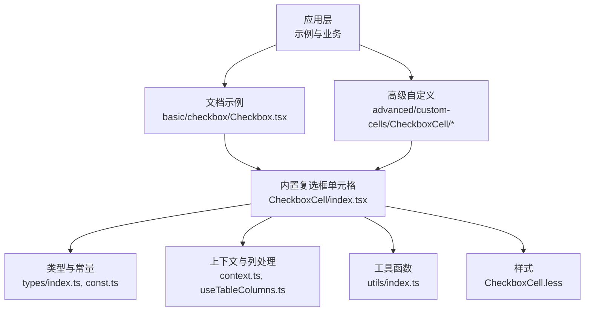
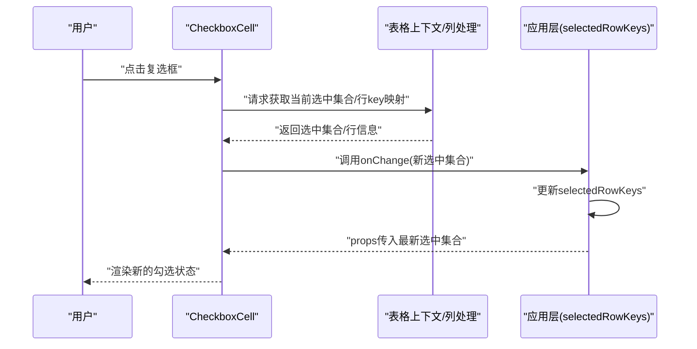
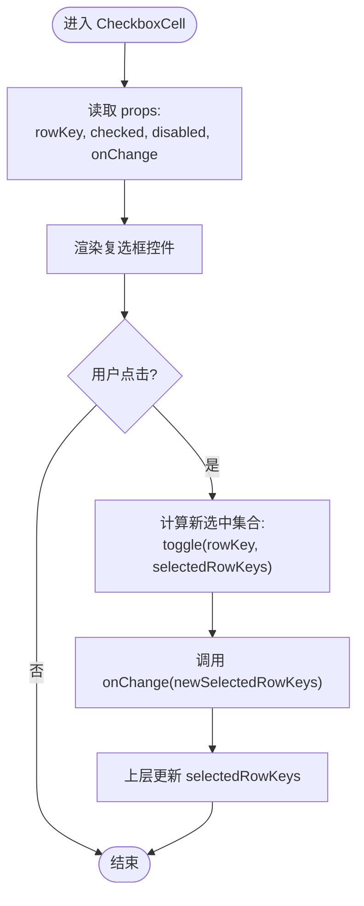
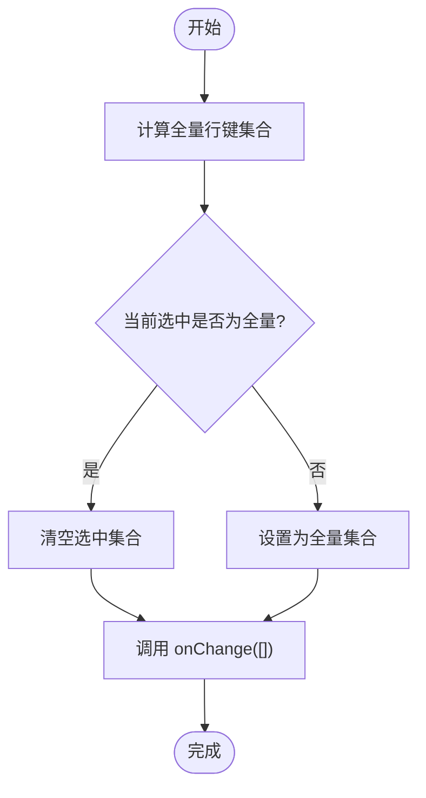
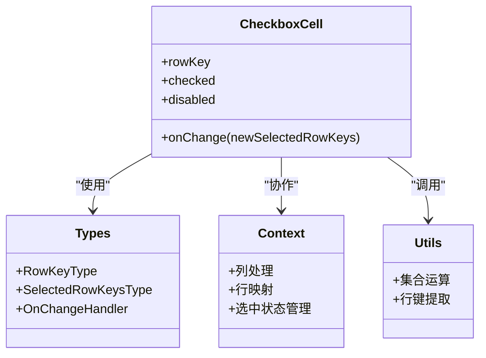

# 复选框选择

<cite>
**本文引用的文件**   
- [src/StkTable/custom-cells/CheckboxCell/index.tsx](file://src/StkTable/custom-cells/CheckboxCell/index.tsx)
- [src/StkTable/custom-cells/CheckboxCell/CheckboxCell.less](file://src/StkTable/custom-cells/CheckboxCell/CheckboxCell.less)
- [docs-demo/basic/checkbox/Checkbox.tsx](file://docs-demo/basic/checkbox/Checkbox.tsx)
- [docs-demo/advanced/custom-cells/CheckboxCell/index.tsx](file://docs-demo/advanced/custom-cells/CheckboxCell/index.tsx)
- [docs-demo/advanced/custom-cells/CheckboxCell/CheckboxComponentCell.tsx](file://docs-demo/advanced/custom-cells/CheckboxCell/CheckboxComponentCell.tsx)
- [docs-src/main/table/basic/checkbox.md](file://docs-src/main/table/basic/checkbox.md)
- [docs-src/en/main/table/basic/checkbox.md](file://docs-src/en/main/table/basic/checkbox.md)
- [docs-src/ja/main/table/basic/checkbox.md](file://docs-src/ja/main/table/basic/checkbox.md)
- [docs-src/ko/main/table/basic/checkbox.md](file://docs-src/ko/main/table/basic/checkbox.md)
- [src/StkTable/types/index.ts](file://src/StkTable/types/index.ts)
- [src/StkTable/context.ts](file://src/StkTable/context.ts)
- [src/StkTable/const.ts](file://src/StkTable/const.ts)
- [src/StkTable/utils/index.ts](file://src/StkTable/utils/index.ts)
- [src/StkTable/hooks/useTableColumns.ts](file://src/StkTable/hooks/useTableColumns.ts)
- [src/StkTable/components/index.tsx](file://src/StkTable/components/index.tsx)
</cite>

## 目录
1. [简介](#简介)
2. [项目结构](#项目结构)
3. [核心组件](#核心组件)
4. [架构总览](#架构总览)
5. [详细组件分析](#详细组件分析)
6. [依赖关系分析](#依赖关系分析)
7. [性能考虑](#性能考虑)
8. [故障排查指南](#故障排查指南)
9. [结论](#结论)
10. [附录](#附录)

## 简介
本文件围绕“复选框选择”能力，系统化说明行选择与多选的实现方式、配置项、状态管理、事件回调、全选/反选操作、与其他交互（排序、筛选）的协同，以及大数据量下的性能优化与无障碍访问方案。文档以仓库中的示例与源码为依据，提供可追溯的代码片段路径与可视化图示，帮助读者快速落地并扩展复选框功能。

## 项目结构
与复选框选择相关的代码主要分布在以下位置：
- 内置复选框单元格实现：src/StkTable/custom-cells/CheckboxCell
- 基础示例与高级自定义示例：docs-demo/basic/checkbox、docs-demo/advanced/custom-cells/CheckboxCell
- 文档说明：docs-src/main/table/basic/checkbox.md（多语言版本同构）
- 类型定义、上下文与常量：src/StkTable/types/index.ts、src/StkTable/context.ts、src/StkTable/const.ts
- 工具函数与列处理钩子：src/StkTable/utils/index.ts、src/StkTable/hooks/useTableColumns.ts
- 表格组件入口与组合：src/StkTable/components/index.tsx

图表来源
- [docs-demo/basic/checkbox/Checkbox.tsx](file://docs-demo/basic/checkbox/Checkbox.tsx)
- [docs-demo/advanced/custom-cells/CheckboxCell/index.tsx](file://docs-demo/advanced/custom-cells/CheckboxCell/index.tsx)
- [src/StkTable/custom-cells/CheckboxCell/index.tsx](file://src/StkTable/custom-cells/CheckboxCell/index.tsx)
- [src/StkTable/types/index.ts](file://src/StkTable/types/index.ts)
- [src/StkTable/context.ts](file://src/StkTable/context.ts)
- [src/StkTable/const.ts](file://src/StkTable/const.ts)
- [src/StkTable/utils/index.ts](file://src/StkTable/utils/index.ts)
- [src/StkTable/hooks/useTableColumns.ts](file://src/StkTable/hooks/useTableColumns.ts)
- [src/StkTable/components/index.tsx](file://src/StkTable/components/index.tsx)

章节来源
- [docs-demo/basic/checkbox/Checkbox.tsx](file://docs-demo/basic/checkbox/Checkbox.tsx)
- [docs-demo/advanced/custom-cells/CheckboxCell/index.tsx](file://docs-demo/advanced/custom-cells/CheckboxCell/index.tsx)
- [src/StkTable/custom-cells/CheckboxCell/index.tsx](file://src/StkTable/custom-cells/CheckboxCell/index.tsx)
- [docs-src/main/table/basic/checkbox.md](file://docs-src/main/table/basic/checkbox.md)

## 核心组件
- 内置复选框单元格 CheckboxCell：提供行级复选框渲染与选中状态切换逻辑，支持受控与非受控模式，并与表格上下文进行联动。
- 文档示例 Checkbox.tsx：演示如何启用 checkbox 列、绑定 selectedRowKeys、监听 onChange 等常用用法。
- 高级自定义 CheckboxCell 示例：展示如何通过自定义单元格替换默认复选框行为，实现条件选择、禁用态、批量操作等场景。

章节来源
- [src/StkTable/custom-cells/CheckboxCell/index.tsx](file://src/StkTable/custom-cells/CheckboxCell/index.tsx)
- [docs-demo/basic/checkbox/Checkbox.tsx](file://docs-demo/basic/checkbox/Checkbox.tsx)
- [docs-demo/advanced/custom-cells/CheckboxCell/index.tsx](file://docs-demo/advanced/custom-cells/CheckboxCell/index.tsx)
- [docs-demo/advanced/custom-cells/CheckboxCell/CheckboxComponentCell.tsx](file://docs-demo/advanced/custom-cells/CheckboxCell/CheckboxComponentCell.tsx)

## 架构总览
复选框选择的核心流程如下：
- 用户在表头或行内点击复选框，触发内部变更事件。
- CheckboxCell 根据当前行 key 与选中集合计算新集合，并通过上下文或回调通知上层。
- 上层组件更新 selectedRowKeys，驱动 UI 重新渲染。
- 若使用自定义复选框单元格，可在自定义组件中复用相同的数据流与事件契约。

图表来源
- [src/StkTable/custom-cells/CheckboxCell/index.tsx](file://src/StkTable/custom-cells/CheckboxCell/index.tsx)
- [src/StkTable/context.ts](file://src/StkTable/context.ts)
- [src/StkTable/hooks/useTableColumns.ts](file://src/StkTable/hooks/useTableColumns.ts)
- [docs-demo/basic/checkbox/Checkbox.tsx](file://docs-demo/basic/checkbox/Checkbox.tsx)

## 详细组件分析

### 内置复选框单元格 CheckboxCell
- 职责
  - 渲染行级复选框，显示当前行的选中状态。
  - 处理点击事件，基于当前行 key 与选中集合计算新集合。
  - 通过 onChange 回调将新集合上报给上层。
  - 支持在表头处控制全选/反选（当存在 checkbox 列时）。
- 关键数据与接口
  - 行标识：通常由 rowKey 决定，用于唯一标识一行。
  - 选中集合：selectedRowKeys，数组形式维护已选行键。
  - 事件：onChange(newSelectedRowKeys)，用于同步选中状态。
- 典型用法
  - 在列配置中启用 checkbox 列，绑定 selectedRowKeys 与 onChange。
  - 在表头区域添加全选/反选按钮，调用 onChange 设置全量或清空集合。
- 注意事项
  - 确保每行数据的 rowKey 稳定且唯一，避免重复键导致状态错乱。
  - 大数据量下建议结合虚拟滚动与惰性渲染，减少 DOM 节点数量。
  - 如需条件禁用某行复选框，可通过自定义单元格覆盖默认行为。

图表来源
- [src/StkTable/custom-cells/CheckboxCell/index.tsx](file://src/StkTable/custom-cells/CheckboxCell/index.tsx)
- [src/StkTable/types/index.ts](file://src/StkTable/types/index.ts)
- [src/StkTable/const.ts](file://src/StkTable/const.ts)

章节来源
- [src/StkTable/custom-cells/CheckboxCell/index.tsx](file://src/StkTable/custom-cells/CheckboxCell/index.tsx)
- [src/StkTable/custom-cells/CheckboxCell/CheckboxCell.less](file://src/StkTable/custom-cells/CheckboxCell/CheckboxCell.less)
- [src/StkTable/types/index.ts](file://src/StkTable/types/index.ts)
- [src/StkTable/const.ts](file://src/StkTable/const.ts)

### 文档示例：基础复选框列
- 目标
  - 展示如何在表格中启用 checkbox 列，绑定 selectedRowKeys 与 onChange。
  - 演示全选/反选的基本操作。
- 关键点
  - 列配置中添加 checkbox 列。
  - 使用 useState 或外部状态管理 selectedRowKeys。
  - 在 onChange 回调中更新 selectedRowKeys。
  - 表头按钮调用 onChange 设置全量或空集合以实现全选/反选。

章节来源
- [docs-demo/basic/checkbox/Checkbox.tsx](file://docs-demo/basic/checkbox/Checkbox.tsx)
- [docs-src/main/table/basic/checkbox.md](file://docs-src/main/table/basic/checkbox.md)

### 高级示例：自定义复选框单元格
- 目标
  - 通过自定义单元格替换默认复选框，实现条件选择、禁用态、批量操作等复杂需求。
- 关键点
  - 自定义组件接收与内置 CheckboxCell 一致的 props 契约（如 rowKey、checked、disabled、onChange）。
  - 在自定义组件中封装业务逻辑（例如根据行数据判断是否可选）。
  - 保持与表格上下文的兼容性，确保全选/反选仍可用。

章节来源
- [docs-demo/advanced/custom-cells/CheckboxCell/index.tsx](file://docs-demo/advanced/custom-cells/CheckboxCell/index.tsx)
- [docs-demo/advanced/custom-cells/CheckboxCell/CheckboxComponentCell.tsx](file://docs-demo/advanced/custom-cells/CheckboxCell/CheckboxComponentCell.tsx)

### 概念性概览：全选/反选流程

[此图为概念流程示意，不直接对应具体源码文件]

## 依赖关系分析
- CheckboxCell 依赖
  - 类型定义：行键类型、选中集合类型、事件签名等。
  - 常量：可能包含列类型、默认值等。
  - 上下文：与表格列处理、行映射、选中状态管理等协作。
  - 工具函数：集合运算、行键提取等。
- 示例与应用层
  - 文档示例通过列配置引入 CheckboxCell，并在应用层维护 selectedRowKeys。
  - 高级示例通过自定义单元格复用相同契约，增强业务逻辑。

图表来源
- [src/StkTable/custom-cells/CheckboxCell/index.tsx](file://src/StkTable/custom-cells/CheckboxCell/index.tsx)
- [src/StkTable/types/index.ts](file://src/StkTable/types/index.ts)
- [src/StkTable/context.ts](file://src/StkTable/context.ts)
- [src/StkTable/utils/index.ts](file://src/StkTable/utils/index.ts)

章节来源
- [src/StkTable/custom-cells/CheckboxCell/index.tsx](file://src/StkTable/custom-cells/CheckboxCell/index.tsx)
- [src/StkTable/types/index.ts](file://src/StkTable/types/index.ts)
- [src/StkTable/context.ts](file://src/StkTable/context.ts)
- [src/StkTable/utils/index.ts](file://src/StkTable/utils/index.ts)

## 性能考虑
- 大数据量优化
  - 使用虚拟滚动减少可见区域外的 DOM 节点数量。
  - 对选中集合采用高效数据结构（如 Map/Set），降低 toggle 操作的复杂度。
  - 避免在 onChange 中进行昂贵的计算，必要时使用防抖或增量更新。
- 内存管理
  - 及时清理不再使用的行键引用，防止内存泄漏。
  - 在组件卸载时取消未完成的异步操作（如远程加载选中状态）。
- 渲染优化
  - 为每行提供稳定的 key，避免不必要的重渲染。
  - 对复选框状态变化进行细粒度更新，避免整表重绘。

[本节为通用性能指导，不直接分析具体文件]

## 故障排查指南
- 常见问题
  - 行键不稳定：导致选中状态错乱或无法正确识别行。
  - 未绑定 onChange：selectedRowKeys 不会更新，UI 与状态不同步。
  - 自定义单元格不兼容：未遵循 CheckboxCell 的 props 契约，导致全选/反选失效。
- 定位方法
  - 检查列配置是否正确启用 checkbox 列。
  - 确认 onChange 回调是否被调用并更新了 selectedRowKeys。
  - 对比自定义单元格与内置 CheckboxCell 的接口一致性。
- 参考路径
  - 基础示例：docs-demo/basic/checkbox/Checkbox.tsx
  - 高级自定义：docs-demo/advanced/custom-cells/CheckboxCell/index.tsx

章节来源
- [docs-demo/basic/checkbox/Checkbox.tsx](file://docs-demo/basic/checkbox/Checkbox.tsx)
- [docs-demo/advanced/custom-cells/CheckboxCell/index.tsx](file://docs-demo/advanced/custom-cells/CheckboxCell/index.tsx)

## 结论
复选框选择功能通过内置 CheckboxCell 与示例代码提供了开箱即用的行选择与多选能力。开发者可通过标准 props 与事件轻松集成，并在需要时通过自定义单元格扩展业务逻辑。配合虚拟滚动与高效数据结构，可在大数据量场景下保持良好的性能与用户体验。

[本节为总结性内容，不直接分析具体文件]

## 附录

### API 与属性速览
- selectedRowKeys：受控选中集合，类型为行键数组。
- onChange：选中状态变更回调，参数为新选中集合。
- rowKey：行唯一标识，需保证稳定且唯一。
- 列配置：启用 checkbox 列后，自动支持行级复选框与表头全选/反选。

章节来源
- [docs-src/main/table/basic/checkbox.md](file://docs-src/main/table/basic/checkbox.md)
- [docs-src/en/main/table/basic/checkbox.md](file://docs-src/en/main/table/basic/checkbox.md)
- [docs-src/ja/main/table/basic/checkbox.md](file://docs-src/ja/main/table/basic/checkbox.md)
- [docs-src/ko/main/table/basic/checkbox.md](file://docs-src/ko/main/table/basic/checkbox.md)

### 无障碍访问与键盘导航
- 语义化标签：确保复选框具备正确的 role 与 aria-* 属性。
- 键盘操作：支持 Tab 聚焦、空格/回车切换选中、方向键在表头全选控件间移动。
- 焦点管理：在全选/反选操作后保持合理焦点位置，提升可访问性体验。

[本节为通用可访问性指导，不直接分析具体文件]