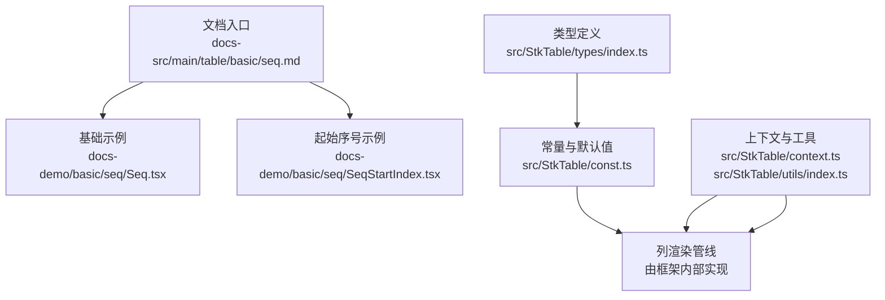
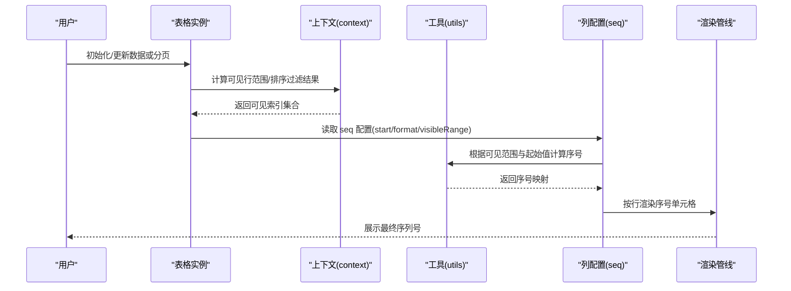
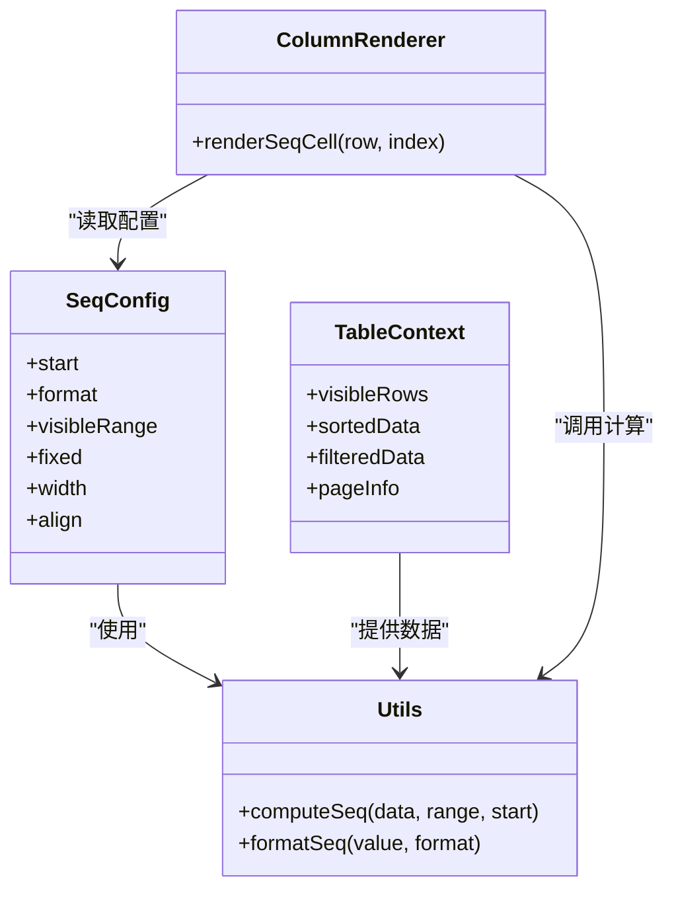

# 序列号显示

<cite>
**本文引用的文件**
- [src/StkTable/const.ts](file://src/StkTable/const.ts)
- [src/StkTable/context.ts](file://src/StkTable/context.ts)
- [src/StkTable/types/index.ts](file://src/StkTable/types/index.ts)
- [src/StkTable/utils/index.ts](file://src/StkTable/utils/index.ts)
- [docs-src/main/table/basic/seq.md](file://docs-src/main/table/basic/seq.md)
- [docs-demo/basic/seq/Seq.tsx](file://docs-demo/basic/seq/Seq.tsx)
- [docs-demo/basic/seq/SeqStartIndex.tsx](file://docs-demo/basic/seq/SeqStartIndex.tsx)
</cite>

## 目录
1. [简介](#简介)
2. [项目结构](#项目结构)
3. [核心组件](#核心组件)
4. [架构总览](#架构总览)
5. [详细组件分析](#详细组件分析)
6. [依赖关系分析](#依赖关系分析)
7. [性能考虑](#性能考虑)
8. [故障排查指南](#故障排查指南)
9. [结论](#结论)
10. [附录](#附录)

## 简介
本章节面向需要为表格提供“自动序列号”展示与配置的用户，系统性地说明 seq 属性的能力边界、配置项、使用场景以及与排序、过滤、分页等功能的交互方式。文档同时给出在普通列表、分页表格、虚拟滚动等场景下的实践要点，并提供高性能生成策略与自定义渲染器的扩展方法。

## 项目结构
围绕序列号功能，仓库中与 seq 相关的代码与文档主要分布在以下位置：
- 类型与常量定义：用于声明列属性、默认值与内部常量
- 上下文与工具：用于在表格上下文中传递状态、计算可见行索引等
- 示例与文档：演示基本用法、起始序号设置以及官方文档说明

图表来源
- [docs-src/main/table/basic/seq.md](file://docs-src/main/table/basic/seq.md)
- [docs-demo/basic/seq/Seq.tsx](file://docs-demo/basic/seq/Seq.tsx)
- [docs-demo/basic/seq/SeqStartIndex.tsx](file://docs-demo/basic/seq/SeqStartIndex.tsx)
- [src/StkTable/types/index.ts](file://src/StkTable/types/index.ts)
- [src/StkTable/const.ts](file://src/StkTable/const.ts)
- [src/StkTable/context.ts](file://src/StkTable/context.ts)
- [src/StkTable/utils/index.ts](file://src/StkTable/utils/index.ts)

章节来源
- [docs-src/main/table/basic/seq.md](file://docs-src/main/table/basic/seq.md)
- [docs-demo/basic/seq/Seq.tsx](file://docs-demo/basic/seq/Seq.tsx)
- [docs-demo/basic/seq/SeqStartIndex.tsx](file://docs-demo/basic/seq/SeqStartIndex.tsx)
- [src/StkTable/types/index.ts](file://src/StkTable/types/index.ts)
- [src/StkTable/const.ts](file://src/StkTable/const.ts)
- [src/StkTable/context.ts](file://src/StkTable/context.ts)
- [src/StkTable/utils/index.ts](file://src/StkTable/utils/index.ts)

## 核心组件
- 列属性 seq：启用自动序列号列的开关与配置入口
- 起始序号 start：控制序号从哪个数字开始
- 格式模板 format：支持对序号进行格式化输出（如补零、前缀后缀等）
- 可见性范围 visibleRange：决定序号基于当前页还是全局数据源计算
- 与其他列的协作：通常作为不可排序、不可筛选的第一列

章节来源
- [docs-src/main/table/basic/seq.md](file://docs-src/main/table/basic/seq.md)
- [src/StkTable/types/index.ts](file://src/StkTable/types/index.ts)
- [src/StkTable/const.ts](file://src/StkTable/const.ts)

## 架构总览
序列号的生成与渲染贯穿“列配置 → 上下文状态 → 工具函数 → 渲染管线”的流程。下图展示了典型的数据流与调用顺序。

图表来源
- [src/StkTable/context.ts](file://src/StkTable/context.ts)
- [src/StkTable/utils/index.ts](file://src/StkTable/utils/index.ts)
- [src/StkTable/types/index.ts](file://src/StkTable/types/index.ts)
- [src/StkTable/const.ts](file://src/StkTable/const.ts)

## 详细组件分析

### 序列号列配置项（seq）
- 作用：开启并配置自动序列号列
- 常见选项
  - start：序号起始值（默认通常为 1）
  - format：序号格式化规则（例如固定宽度补零、添加前缀/后缀）
  - visibleRange：序号计算范围（当前页/全局）
  - fixed：是否固定在首列
  - width：列宽
  - align：对齐方式
- 行为说明
  - 当 visibleRange 为“当前页”时，每页序号从 start 开始连续；若需跨页连续，应设置为“全局”
  - 排序/过滤会改变可见行顺序，序号随可见顺序重新分配
  - 分页切换时，序号是否连续取决于 visibleRange 的设置

章节来源
- [docs-src/main/table/basic/seq.md](file://docs-src/main/table/basic/seq.md)
- [src/StkTable/types/index.ts](file://src/StkTable/types/index.ts)
- [src/StkTable/const.ts](file://src/StkTable/const.ts)

### 基础用法与起始序号
- 基础用法：在列配置中启用 seq，即可自动生成序号列
- 起始序号：通过 start 指定起始值，适用于多表头、分组或业务编号场景

章节来源
- [docs-demo/basic/seq/Seq.tsx](file://docs-demo/basic/seq/Seq.tsx)
- [docs-demo/basic/seq/SeqStartIndex.tsx](file://docs-demo/basic/seq/SeqStartIndex.tsx)

### 分页时的序号连续性
- 需求：希望翻页后序号仍然连续（不重置）
- 方案：将 visibleRange 设置为“全局”，使序号基于完整数据集计算
- 注意：大数据量下建议结合虚拟滚动与按需渲染，避免全量计算带来的性能问题

章节来源
- [docs-src/main/table/basic/seq.md](file://docs-src/main/table/basic/seq.md)

### 与排序、过滤的交互
- 排序：序号跟随排序后的可见顺序变化
- 过滤：仅对过滤后的可见行生成序号
- 组合：先过滤再排序，序号以最终可见顺序为准

章节来源
- [docs-src/main/table/basic/seq.md](file://docs-src/main/table/basic/seq.md)

### 虚拟滚动场景
- 特点：仅渲染可视区域行，序号需基于可见索引计算
- 建议：确保序号计算与可视窗口同步更新，避免错位
- 优化：使用稳定的 key 与最小化重算，减少不必要的渲染

章节来源
- [docs-src/main/table/basic/seq.md](file://docs-src/main/table/basic/seq.md)

### 自定义序列号渲染器
- 适用场景：需要在序号单元格内嵌入图标、链接、操作按钮等
- 方法：通过列渲染插槽或自定义单元格组件覆盖默认渲染
- 注意事项：保持序号计算的稳定性，避免影响性能与一致性

章节来源
- [docs-src/main/table/basic/seq.md](file://docs-src/main/table/basic/seq.md)

## 依赖关系分析
- 类型层：定义 seq 相关字段与默认值
- 常量层：提供默认配置与枚举值
- 上下文层：维护表格状态（排序、过滤、分页、可见范围）
- 工具层：提供序号计算、格式化等辅助逻辑
- 示例层：演示不同场景下的用法

图表来源
- [src/StkTable/types/index.ts](file://src/StkTable/types/index.ts)
- [src/StkTable/const.ts](file://src/StkTable/const.ts)
- [src/StkTable/context.ts](file://src/StkTable/context.ts)
- [src/StkTable/utils/index.ts](file://src/StkTable/utils/index.ts)

章节来源
- [src/StkTable/types/index.ts](file://src/StkTable/types/index.ts)
- [src/StkTable/const.ts](file://src/StkTable/const.ts)
- [src/StkTable/context.ts](file://src/StkTable/context.ts)
- [src/StkTable/utils/index.ts](file://src/StkTable/utils/index.ts)

## 性能考虑
- 计算范围：优先基于可见行计算序号，避免全量遍历
- 缓存策略：对排序/过滤结果与序号映射做稳定缓存，减少重复计算
- 渲染优化：配合虚拟滚动与增量更新，降低 DOM 压力
- 格式化开销：复杂 format 应在必要时才执行，避免频繁字符串拼接
- 关键路径：将序号计算置于轻量工具函数，避免阻塞主线程

[本节为通用指导，不直接分析具体文件]

## 故障排查指南
- 序号错乱
  - 检查排序/过滤是否改变了可见顺序
  - 确认 visibleRange 是否符合预期（当前页/全局）
- 分页不连续
  - 若需跨页连续，请设置 visibleRange 为“全局”
- 虚拟滚动错位
  - 确保 key 稳定且与数据绑定一致
  - 检查可视窗口更新是否触发序号重算
- 自定义渲染异常
  - 确认覆盖渲染未破坏序号计算流程
  - 避免在渲染过程中产生副作用导致状态不一致

章节来源
- [docs-src/main/table/basic/seq.md](file://docs-src/main/table/basic/seq.md)

## 结论
seq 提供了开箱即用的自动序列号能力，并通过 start、format、visibleRange 等配置满足多样化场景。与排序、过滤、分页及虚拟滚动的良好协同，使其成为表格体验的重要组成部分。在高并发与大数据量场景下，遵循本文的性能建议与最佳实践，可获得更稳定、高效的序号展示效果。

[本节为总结性内容，不直接分析具体文件]

## 附录
- 快速上手
  - 参考基础示例与起始序号示例，快速集成 seq 列
- 进阶场景
  - 分页连续、虚拟滚动、自定义渲染等详见对应小节

章节来源
- [docs-demo/basic/seq/Seq.tsx](file://docs-demo/basic/seq/Seq.tsx)
- [docs-demo/basic/seq/SeqStartIndex.tsx](file://docs-demo/basic/seq/SeqStartIndex.tsx)