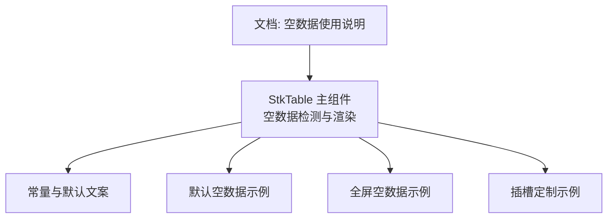
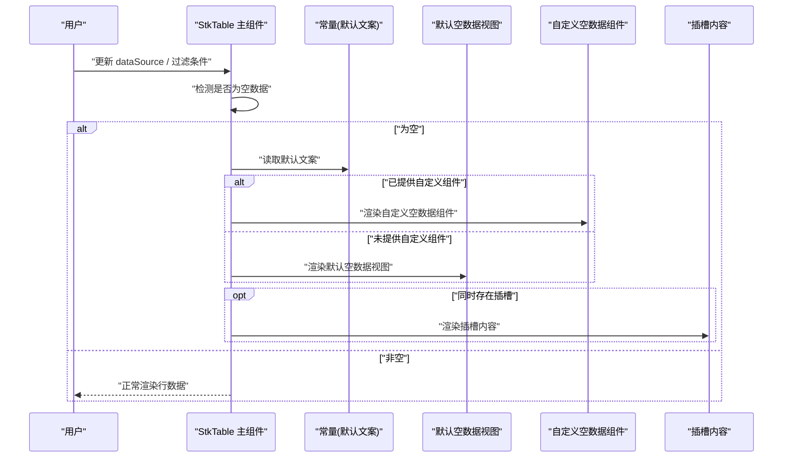
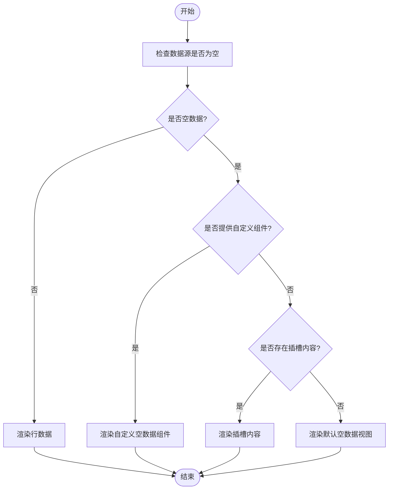
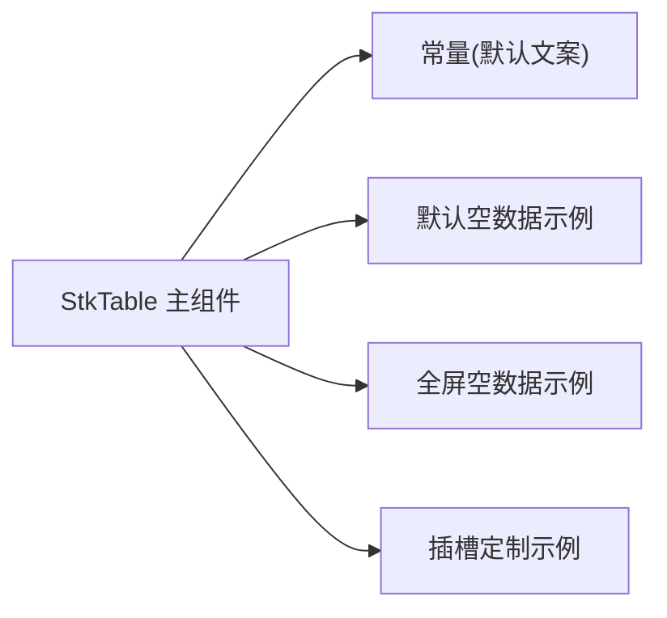

# 空数据处理

<cite>
**本文引用的文件**   
- [src/StkTable/StkTable.tsx](file://src/StkTable/StkTable.tsx)
- [src/StkTable/const.ts](file://src/StkTable/const.ts)
- [docs-demo/basic/empty/Default.tsx](file://docs-demo/basic/empty/Default.tsx)
- [docs-demo/basic/empty/NoDataFull.tsx](file://docs-demo/basic/empty/NoDataFull.tsx)
- [docs-demo/basic/empty/Slot.tsx](file://docs-demo/basic/empty/Slot.tsx)
- [docs-src/main/table/basic/empty.md](file://docs-src/main/table/basic/empty.md)
</cite>

## 目录
1. [简介](#简介)
2. [项目结构](#项目结构)
3. [核心组件与能力](#核心组件与能力)
4. [架构总览](#架构总览)
5. [详细组件分析](#详细组件分析)
6. [依赖关系分析](#依赖关系分析)
7. [性能考虑](#性能考虑)
8. [故障排查指南](#故障排查指南)
9. [结论](#结论)
10. [附录](#附录)

## 简介
本章节聚焦表格在“空数据”场景下的显示与定制能力，涵盖默认空数据提示、自定义空数据组件、插槽定制等。文档将说明 empty 属性的配置选项与自定义渲染方法，提供从简单提示到复杂交互式空状态页面的多种展示方式，并解释空数据状态与其他表格功能的集成方式，包括检测逻辑与性能优化建议，以及加载、错误状态的协同处理最佳实践。

## 项目结构
围绕空数据处理的相关代码与示例分布如下：
- 核心实现位于表格主组件中，负责空数据的检测与渲染决策。
- 常量定义包含默认文案与相关标识。
- 演示示例覆盖默认空数据、全屏占位与插槽定制三种典型用法。
- 文档页面提供属性说明与使用指引。

图表来源
- [src/StkTable/StkTable.tsx](file://src/StkTable/StkTable.tsx)
- [src/StkTable/const.ts](file://src/StkTable/const.ts)
- [docs-demo/basic/empty/Default.tsx](file://docs-demo/basic/empty/Default.tsx)
- [docs-demo/basic/empty/NoDataFull.tsx](file://docs-demo/basic/empty/NoDataFull.tsx)
- [docs-demo/basic/empty/Slot.tsx](file://docs-demo/basic/empty/Slot.tsx)
- [docs-src/main/table/basic/empty.md](file://docs-src/main/table/basic/empty.md)

章节来源
- [src/StkTable/StkTable.tsx](file://src/StkTable/StkTable.tsx)
- [src/StkTable/const.ts](file://src/StkTable/const.ts)
- [docs-demo/basic/empty/Default.tsx](file://docs-demo/basic/empty/Default.tsx)
- [docs-demo/basic/empty/NoDataFull.tsx](file://docs-demo/basic/empty/NoDataFull.tsx)
- [docs-demo/basic/empty/Slot.tsx](file://docs-demo/basic/empty/Slot.tsx)
- [docs-src/main/table/basic/empty.md](file://docs-src/main/table/basic/empty.md)

## 核心组件与能力
- 空数据检测与渲染入口
  - 由表格主组件统一判断数据是否为空，并在空状态下渲染对应内容。
  - 支持通过属性或插槽替换默认空数据视图。
- 默认空数据提示
  - 未配置自定义时，使用内置默认提示进行展示。
- 自定义空数据组件
  - 可通过属性传入自定义组件，以完全接管空数据区域的渲染。
- 插槽定制
  - 通过插槽机制注入任意内容，灵活扩展空数据区域（如按钮、引导文案、图标等）。
- 国际化与文案
  - 默认文案来自常量模块，便于统一管理与本地化。

章节来源
- [src/StkTable/StkTable.tsx](file://src/StkTable/StkTable.tsx)
- [src/StkTable/const.ts](file://src/StkTable/const.ts)

## 架构总览
下图展示了空数据渲染的关键流程：数据变化触发检测，根据检测结果选择默认或自定义渲染路径，最终输出到表格容器内。

图表来源
- [src/StkTable/StkTable.tsx](file://src/StkTable/StkTable.tsx)
- [src/StkTable/const.ts](file://src/StkTable/const.ts)

## 详细组件分析

### 空数据检测与渲染决策
- 检测时机
  - 当 dataSource 或影响可见行的过滤条件发生变化时，重新计算是否处于空数据状态。
- 判定规则
  - 若结果为空数组或未提供有效数据源，则进入空数据分支。
- 渲染优先级
  - 自定义组件 > 插槽内容 > 默认空数据视图。
- 交互与事件
  - 自定义组件可绑定业务事件（如刷新、跳转），与表格外部状态联动。

图表来源
- [src/StkTable/StkTable.tsx](file://src/StkTable/StkTable.tsx)

章节来源
- [src/StkTable/StkTable.tsx](file://src/StkTable/StkTable.tsx)

### 默认空数据提示
- 行为
  - 在未配置自定义组件且无插槽内容时，自动展示默认提示。
- 文案来源
  - 默认文案取自常量模块，便于统一修改与国际化。
- 适用场景
  - 快速接入、无需额外样式的轻量提示。

章节来源
- [src/StkTable/const.ts](file://src/StkTable/const.ts)
- [docs-demo/basic/empty/Default.tsx](file://docs-demo/basic/empty/Default.tsx)

### 自定义空数据组件
- 接入方式
  - 通过属性传入自定义组件，完全接管空数据区域渲染。
- 能力
  - 可包含图片、按钮、表单等任意 UI，并可触发外部业务逻辑。
- 示例参考
  - 全屏占位型空数据示例展示了如何填充更大面积的内容。

章节来源
- [docs-demo/basic/empty/NoDataFull.tsx](file://docs-demo/basic/empty/NoDataFull.tsx)

### 插槽定制
- 接入方式
  - 通过插槽向空数据区域注入任意 React 节点。
- 能力
  - 适合需要与主题样式保持一致的轻量定制，或仅需补充少量辅助信息。
- 示例参考
  - 插槽定制示例展示了如何在空数据区域插入自定义元素。

章节来源
- [docs-demo/basic/empty/Slot.tsx](file://docs-demo/basic/empty/Slot.tsx)

### 文档与 API 说明
- 文档位置
  - 空数据相关的使用说明与属性介绍位于文档站点。
- 内容要点
  - 包含 empty 属性的配置项、默认值、与插槽/自定义组件的组合用法。

章节来源
- [docs-src/main/table/basic/empty.md](file://docs-src/main/table/basic/empty.md)

## 依赖关系分析
- 内部依赖
  - StkTable 主组件依赖常量模块获取默认文案。
  - 示例组件依赖主组件提供的空数据能力。
- 外部依赖
  - 示例可能引入第三方图标或样式资源，用于丰富空数据展示效果。

图表来源
- [src/StkTable/StkTable.tsx](file://src/StkTable/StkTable.tsx)
- [src/StkTable/const.ts](file://src/StkTable/const.ts)
- [docs-demo/basic/empty/Default.tsx](file://docs-demo/basic/empty/Default.tsx)
- [docs-demo/basic/empty/NoDataFull.tsx](file://docs-demo/basic/empty/NoDataFull.tsx)
- [docs-demo/basic/empty/Slot.tsx](file://docs-demo/basic/empty/Slot.tsx)

章节来源
- [src/StkTable/StkTable.tsx](file://src/StkTable/StkTable.tsx)
- [src/StkTable/const.ts](file://src/StkTable/const.ts)

## 性能考虑
- 避免不必要的重渲染
  - 仅在数据源或过滤条件真正变化时触发空数据检测。
  - 对自定义空数据组件进行必要的 memo 包裹，减少重复渲染。
- 大列表与虚拟滚动
  - 空数据状态不参与行虚拟化计算，但需确保切换回有数据时能正确恢复虚拟化。
- 资源加载
  - 自定义空数据组件中的图片等资源应做懒加载与缓存，避免阻塞首屏。
- 事件与副作用
  - 自定义组件内的副作用（如订阅、定时器）需在卸载时清理，防止内存泄漏。

[本节为通用指导，不直接分析具体文件]

## 故障排查指南
- 问题：空数据未显示
  - 检查数据源是否为空数组或未定义。
  - 确认是否被其他列过滤或分页逻辑隐藏了所有行。
  - 验证是否覆盖了插槽或自定义组件导致默认视图被替代。
- 问题：自定义组件不生效
  - 确认属性传递是否正确，类型是否符合预期。
  - 检查控制台是否有渲染错误或样式冲突。
- 问题：文案不正确
  - 核对常量模块中的默认文案是否被覆盖或本地化配置是否正确。
- 问题：交互无效
  - 检查自定义组件的事件绑定与作用域，确保与外部状态同步。

章节来源
- [src/StkTable/StkTable.tsx](file://src/StkTable/StkTable.tsx)
- [src/StkTable/const.ts](file://src/StkTable/const.ts)

## 结论
空数据处理提供了开箱即用的默认提示，同时支持通过属性与插槽进行深度定制，满足从简单提示到复杂交互页面的多样化需求。结合合理的检测逻辑与性能优化策略，可以在保证用户体验的同时维持良好的性能表现。建议在项目中统一规范空数据文案与视觉风格，并与加载、错误状态形成一致的交互体验。

[本节为总结性内容，不直接分析具体文件]

## 附录
- 常见用法速查
  - 默认空数据：不传自定义组件与插槽，直接使用内置提示。
  - 自定义组件：传入自定义组件以完全接管空数据区域。
  - 插槽定制：通过插槽注入轻量内容，保持与主题一致。
- 与加载、错误状态的协作
  - 加载态优先于空数据态；加载完成后若无数据再展示空数据。
  - 错误态应优先展示错误信息与重试操作，避免误判为空数据。

[本节为概念性内容，不直接分析具体文件]