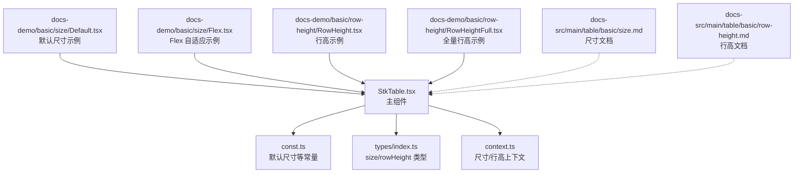
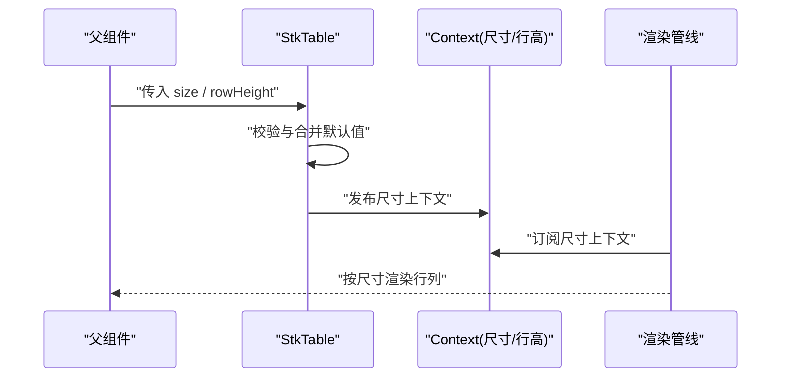
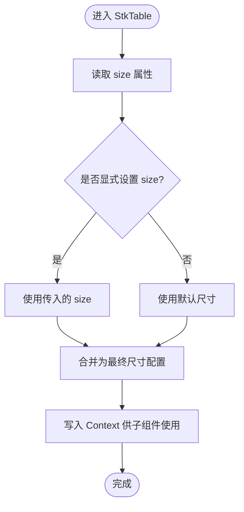
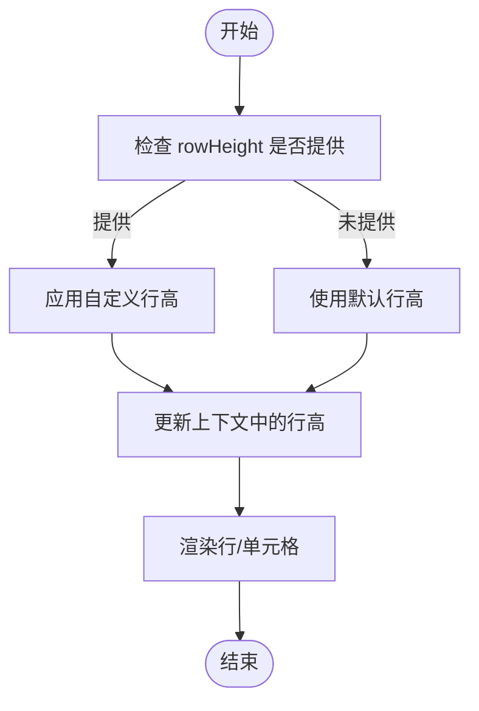
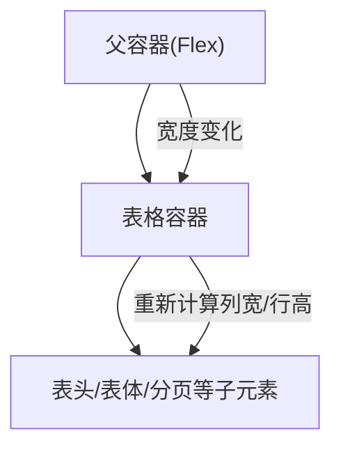
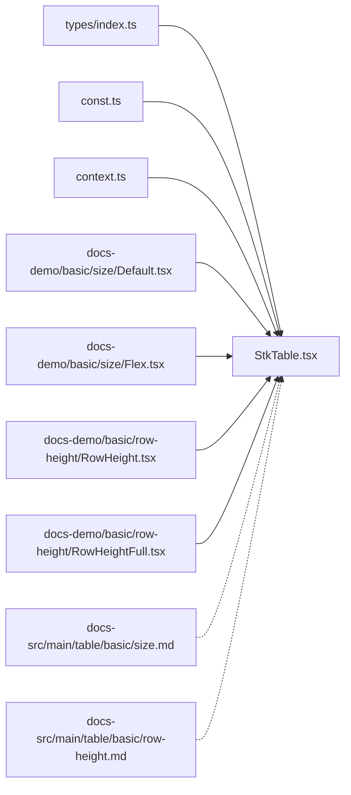

# 表格尺寸

<cite>
**本文引用的文件**   
- [src/StkTable/StkTable.tsx](file://src/StkTable/StkTable.tsx)
- [src/StkTable/const.ts](file://src/StkTable/const.ts)
- [src/StkTable/types/index.ts](file://src/StkTable/types/index.ts)
- [src/StkTable/context.ts](file://src/StkTable/context.ts)
- [docs-demo/basic/size/Default.tsx](file://docs-demo/basic/size/Default.tsx)
- [docs-demo/basic/size/Flex.tsx](file://docs-demo/basic/size/Flex.tsx)
- [docs-demo/basic/row-height/RowHeight.tsx](file://docs-demo/basic/row-height/RowHeight.tsx)
- [docs-demo/basic/row-height/RowHeightFull.tsx](file://docs-demo/basic/row-height/RowHeightFull.tsx)
- [docs-src/main/table/basic/size.md](file://docs-src/main/table/basic/size.md)
- [docs-src/main/table/basic/row-height.md](file://docs-src/main/table/basic/row-height.md)
</cite>

## 目录
1. [简介](#简介)
2. [项目结构](#项目结构)
3. [核心组件](#核心组件)
4. [架构总览](#架构总览)
5. [详细组件分析](#详细组件分析)
6. [依赖分析](#依赖分析)
7. [性能考虑](#性能考虑)
8. [故障排查指南](#故障排查指南)
9. [结论](#结论)
10. [附录](#附录)

## 简介
本章节聚焦于表格的尺寸控制能力，包括：
- 预设尺寸模式（小、中、大）与 size 属性配置
- 自定义行高 rowHeight 的设置方法
- 表格高度控制与容器尺寸计算逻辑
- 响应式布局中的自适应方案（含 Flex 集成）
- 不同尺寸下的性能影响与优化策略
- 移动端适配与触摸友好的交互建议
- 尺寸变化时的重渲染优化

## 项目结构
围绕“尺寸”相关的关键位置如下：
- 组件入口与核心实现：StkTable.tsx
- 常量定义（如默认尺寸等）：const.ts
- 类型定义（size、rowHeight 等）：types/index.ts
- 上下文传递（尺寸、行高等）：context.ts
- 演示示例（基础尺寸、Flex 自适应、行高设置）：docs-demo/basic/size/* 与 docs-demo/basic/row-height/*
- 文档说明（API 与用法）：docs-src/main/table/basic/size.md、docs-src/main/table/basic/row-height.md

图表来源
- [src/StkTable/StkTable.tsx](file://src/StkTable/StkTable.tsx)
- [src/StkTable/const.ts](file://src/StkTable/const.ts)
- [src/StkTable/types/index.ts](file://src/StkTable/types/index.ts)
- [src/StkTable/context.ts](file://src/StkTable/context.ts)
- [docs-demo/basic/size/Default.tsx](file://docs-demo/basic/size/Default.tsx)
- [docs-demo/basic/size/Flex.tsx](file://docs-demo/basic/size/Flex.tsx)
- [docs-demo/basic/row-height/RowHeight.tsx](file://docs-demo/basic/row-height/RowHeight.tsx)
- [docs-demo/basic/row-height/RowHeightFull.tsx](file://docs-demo/basic/row-height/RowHeightFull.tsx)
- [docs-src/main/table/basic/size.md](file://docs-src/main/table/basic/size.md)
- [docs-src/main/table/basic/row-height.md](file://docs-src/main/table/basic/row-height.md)

章节来源
- [src/StkTable/StkTable.tsx](file://src/StkTable/StkTable.tsx)
- [src/StkTable/const.ts](file://src/StkTable/const.ts)
- [src/StkTable/types/index.ts](file://src/StkTable/types/index.ts)
- [src/StkTable/context.ts](file://src/StkTable/context.ts)
- [docs-demo/basic/size/Default.tsx](file://docs-demo/basic/size/Default.tsx)
- [docs-demo/basic/size/Flex.tsx](file://docs-demo/basic/size/Flex.tsx)
- [docs-demo/basic/row-height/RowHeight.tsx](file://docs-demo/basic/row-height/RowHeight.tsx)
- [docs-demo/basic/row-height/RowHeightFull.tsx](file://docs-demo/basic/row-height/RowHeightFull.tsx)
- [docs-src/main/table/basic/size.md](file://docs-src/main/table/basic/size.md)
- [docs-src/main/table/basic/row-height.md](file://docs-src/main/table/basic/row-height.md)

## 核心组件
- StkTable 主组件负责接收 size 与 rowHeight 等尺寸相关 props，并通过 context 向子树传递。
- const.ts 提供默认尺寸值与行为常量。
- types/index.ts 定义 size 的可选值与 rowHeight 的类型约束。
- context.ts 暴露尺寸相关的上下文，供内部组件消费。

章节来源
- [src/StkTable/StkTable.tsx](file://src/StkTable/StkTable.tsx)
- [src/StkTable/const.ts](file://src/StkTable/const.ts)
- [src/StkTable/types/index.ts](file://src/StkTable/types/index.ts)
- [src/StkTable/context.ts](file://src/StkTable/context.ts)

## 架构总览
下图展示了尺寸相关的数据流与控制路径：从父组件传入 size/rowHeight，到 StkTable 解析并写入上下文，再由内部渲染管线读取以决定单元格与行的实际尺寸。

图表来源
- [src/StkTable/StkTable.tsx](file://src/StkTable/StkTable.tsx)
- [src/StkTable/context.ts](file://src/StkTable/context.ts)

## 详细组件分析

### size 属性与预设尺寸模式
- 支持预设尺寸模式：小、中、大。通过 size 属性选择。
- 默认尺寸由常量模块提供；未显式设置时回退到默认值。
- 典型用法参考演示：
  - 默认尺寸示例：[docs-demo/basic/size/Default.tsx](file://docs-demo/basic/size/Default.tsx)
  - 文档说明：[docs-src/main/table/basic/size.md](file://docs-src/main/table/basic/size.md)

图表来源
- [src/StkTable/StkTable.tsx](file://src/StkTable/StkTable.tsx)
- [src/StkTable/const.ts](file://src/StkTable/const.ts)
- [src/StkTable/context.ts](file://src/StkTable/context.ts)

章节来源
- [src/StkTable/StkTable.tsx](file://src/StkTable/StkTable.tsx)
- [src/StkTable/const.ts](file://src/StkTable/const.ts)
- [src/StkTable/context.ts](file://src/StkTable/context.ts)
- [docs-demo/basic/size/Default.tsx](file://docs-demo/basic/size/Default.tsx)
- [docs-src/main/table/basic/size.md](file://docs-src/main/table/basic/size.md)

### rowHeight 自定义行高
- 支持通过 rowHeight 指定行高，可覆盖默认行高。
- 常见场景：
  - 固定行高：统一所有行的高度
  - 动态行高：根据数据或内容计算每行高度
- 演示示例：
  - 基础行高设置：[docs-demo/basic/row-height/RowHeight.tsx](file://docs-demo/basic/row-height/RowHeight.tsx)
  - 全量行高示例：[docs-demo/basic/row-height/RowHeightFull.tsx](file://docs-demo/basic/row-height/RowHeightFull.tsx)
  - 文档说明：[docs-src/main/table/basic/row-height.md](file://docs-src/main/table/basic/row-height.md)

图表来源
- [src/StkTable/StkTable.tsx](file://src/StkTable/StkTable.tsx)
- [src/StkTable/context.ts](file://src/StkTable/context.ts)

章节来源
- [src/StkTable/StkTable.tsx](file://src/StkTable/StkTable.tsx)
- [src/StkTable/context.ts](file://src/StkTable/context.ts)
- [docs-demo/basic/row-height/RowHeight.tsx](file://docs-demo/basic/row-height/RowHeight.tsx)
- [docs-demo/basic/row-height/RowHeightFull.tsx](file://docs-demo/basic/row-height/RowHeightFull.tsx)
- [docs-src/main/table/basic/row-height.md](file://docs-src/main/table/basic/row-height.md)

### 表格高度控制与容器尺寸计算
- 表格高度通常受外层容器限制，可通过 CSS 或父级布局控制。
- 当启用虚拟滚动或自动高度时，容器高度与可视区域的关系会影响渲染范围与滚动体验。
- 建议在需要固定高度的场景中，为表格容器设置明确高度，避免频繁重排。

章节来源
- [docs-demo/basic/size/Flex.tsx](file://docs-demo/basic/size/Flex.tsx)
- [docs-src/main/table/basic/size.md](file://docs-src/main/table/basic/size.md)

### 响应式布局与 Flex 集成
- 在 Flex 容器中，表格可随容器宽度自适应列宽与行高。
- 推荐做法：
  - 将表格置于 flex 容器内，合理设置 flex 方向与对齐方式
  - 为表格容器设置 min/max 宽度，避免极端缩放导致不可用
- 演示示例：
  - Flex 自适应示例：[docs-demo/basic/size/Flex.tsx](file://docs-demo/basic/size/Flex.tsx)

图表来源
- [docs-demo/basic/size/Flex.tsx](file://docs-demo/basic/size/Flex.tsx)

章节来源
- [docs-demo/basic/size/Flex.tsx](file://docs-demo/basic/size/Flex.tsx)
- [docs-src/main/table/basic/size.md](file://docs-src/main/table/basic/size.md)

### 移动端适配与触摸友好交互
- 在小屏幕设备上，优先采用较小的预设尺寸以提升信息密度与可读性平衡。
- 适当增大点击区域与触控目标，确保操作便捷。
- 结合横向滚动与列宽自适应，提升移动端浏览体验。

章节来源
- [docs-demo/basic/size/Default.tsx](file://docs-demo/basic/size/Default.tsx)
- [docs-src/main/table/basic/size.md](file://docs-src/main/table/basic/size.md)

### 尺寸变化时的重渲染优化
- 避免在高频事件中直接修改 size/rowHeight，必要时进行防抖/节流。
- 使用稳定的引用与 memo 化子组件，减少不必要的重渲染。
- 对于大数据集，配合虚拟滚动降低 DOM 节点数量，提高尺寸变更后的响应速度。

章节来源
- [src/StkTable/StkTable.tsx](file://src/StkTable/StkTable.tsx)
- [src/StkTable/context.ts](file://src/StkTable/context.ts)

## 依赖分析
- StkTable 依赖 const.ts 提供的默认尺寸与行为常量。
- StkTable 通过 context.ts 将尺寸与行高信息注入子树。
- 类型系统由 types/index.ts 维护，保证 size 与 rowHeight 的类型安全。
- 演示与文档位于 docs-demo 与 docs-src，用于展示与说明用法。

图表来源
- [src/StkTable/StkTable.tsx](file://src/StkTable/StkTable.tsx)
- [src/StkTable/const.ts](file://src/StkTable/const.ts)
- [src/StkTable/types/index.ts](file://src/StkTable/types/index.ts)
- [src/StkTable/context.ts](file://src/StkTable/context.ts)
- [docs-demo/basic/size/Default.tsx](file://docs-demo/basic/size/Default.tsx)
- [docs-demo/basic/size/Flex.tsx](file://docs-demo/basic/size/Flex.tsx)
- [docs-demo/basic/row-height/RowHeight.tsx](file://docs-demo/basic/row-height/RowHeight.tsx)
- [docs-demo/basic/row-height/RowHeightFull.tsx](file://docs-demo/basic/row-height/RowHeightFull.tsx)
- [docs-src/main/table/basic/size.md](file://docs-src/main/table/basic/size.md)
- [docs-src/main/table/basic/row-height.md](file://docs-src/main/table/basic/row-height.md)

章节来源
- [src/StkTable/StkTable.tsx](file://src/StkTable/StkTable.tsx)
- [src/StkTable/const.ts](file://src/StkTable/const.ts)
- [src/StkTable/types/index.ts](file://src/StkTable/types/index.ts)
- [src/StkTable/context.ts](file://src/StkTable/context.ts)
- [docs-demo/basic/size/Default.tsx](file://docs-demo/basic/size/Default.tsx)
- [docs-demo/basic/size/Flex.tsx](file://docs-demo/basic/size/Flex.tsx)
- [docs-demo/basic/row-height/RowHeight.tsx](file://docs-demo/basic/row-height/RowHeight.tsx)
- [docs-demo/basic/row-height/RowHeightFull.tsx](file://docs-demo/basic/row-height/RowHeightFull.tsx)
- [docs-src/main/table/basic/size.md](file://docs-src/main/table/basic/size.md)
- [docs-src/main/table/basic/row-height.md](file://docs-src/main/table/basic/row-height.md)

## 性能考虑
- 预设尺寸对样式与间距的影响会改变布局计算成本，建议在大列表场景下优先使用中等或较小尺寸以减少重排。
- 自定义行高若为每行不同，会增加测量与布局开销，建议：
  - 尽量使用固定行高
  - 或使用缓存策略记录已计算的行高
- 容器高度稳定有助于减少滚动与重绘，避免在动画或高频交互中频繁变更。
- 结合虚拟滚动与懒加载，显著降低 DOM 节点数量，提升尺寸变更后的响应速度。

## 故障排查指南
- 症状：切换 size 后出现闪烁或抖动
  - 排查：确认容器高度是否稳定；避免在尺寸切换时同时变更其他布局属性
- 症状：自定义行高不生效
  - 排查：检查 rowHeight 类型与取值范围；确认未被其他样式覆盖
- 症状：Flex 布局下表格溢出
  - 排查：为表格容器设置合适的 max-width/min-width；检查父容器的 flex 属性是否允许收缩

章节来源
- [src/StkTable/StkTable.tsx](file://src/StkTable/StkTable.tsx)
- [src/StkTable/context.ts](file://src/StkTable/context.ts)
- [docs-demo/basic/size/Flex.tsx](file://docs-demo/basic/size/Flex.tsx)

## 结论
通过 size 与 rowHeight 的组合，可以灵活控制表格的整体尺寸与行高表现。在响应式与移动端场景中，结合 Flex 布局与合理的性能优化策略，可获得更流畅的用户体验。建议在复杂场景中优先使用固定行高与稳定容器高度，并在大数据集上启用虚拟滚动以获得最佳性能。

## 附录
- 常用演示入口：
  - 默认尺寸：[docs-demo/basic/size/Default.tsx](file://docs-demo/basic/size/Default.tsx)
  - Flex 自适应：[docs-demo/basic/size/Flex.tsx](file://docs-demo/basic/size/Flex.tsx)
  - 行高设置：[docs-demo/basic/row-height/RowHeight.tsx](file://docs-demo/basic/row-height/RowHeight.tsx)
  - 全量行高：[docs-demo/basic/row-height/RowHeightFull.tsx](file://docs-demo/basic/row-height/RowHeightFull.tsx)
- 文档参考：
  - 尺寸 API 与说明：[docs-src/main/table/basic/size.md](file://docs-src/main/table/basic/size.md)
  - 行高 API 与说明：[docs-src/main/table/basic/row-height.md](file://docs-src/main/table/basic/row-height.md)