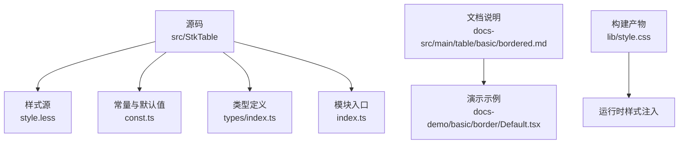
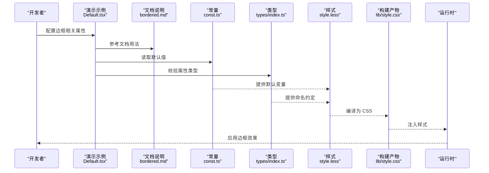
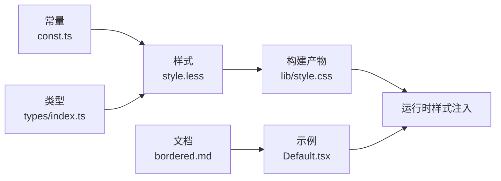

# 边框样式

<cite>
**本文引用的文件**   
- [src/StkTable/style.less](file://src/StkTable/style.less)
- [src/StkTable/const.ts](file://src/StkTable/const.ts)
- [src/StkTable/index.ts](file://src/StkTable/index.ts)
- [src/StkTable/types/index.ts](file://src/StkTable/types/index.ts)
- [docs-src/main/table/basic/bordered.md](file://docs-src/main/table/basic/bordered.md)
- [docs-demo/basic/border/Default.tsx](file://docs-demo/basic/border/Default.tsx)
- [lib/stk-table-react.js](file://lib/stk-table-react.js)
- [lib/style.css](file://lib/style.css)
</cite>

## 目录
1. [简介](#简介)
2. [项目结构](#项目结构)
3. [核心组件](#核心组件)
4. [架构总览](#架构总览)
5. [详细组件分析](#详细组件分析)
6. [依赖分析](#依赖分析)
7. [性能考虑](#性能考虑)
8. [故障排查指南](#故障排查指南)
9. [结论](#结论)
10. [附录](#附录)

## 简介
本章节聚焦表格“边框样式”能力，围绕以下目标展开：
- 内外边框的显示控制、颜色与宽度配置
- border 相关属性的使用方法（全局配置与自定义覆盖）
- 从基础到复杂的多种边框样式组合示例路径
- 与主题系统的集成方式
- 浏览器兼容性与移动端适配方案
- 性能优化建议与常见问题解决方案

## 项目结构
与边框样式直接相关的代码与文档主要分布在如下位置：
- 样式实现：src/StkTable/style.less
- 常量与默认值：src/StkTable/const.ts
- 类型定义：src/StkTable/types/index.ts
- 入口导出：src/StkTable/index.ts
- 官方文档页：docs-src/main/table/basic/bordered.md
- 演示示例：docs-demo/basic/border/Default.tsx
- 构建产物：lib/style.css（由 less 编译生成）

图表来源
- [src/StkTable/style.less](file://src/StkTable/style.less)
- [src/StkTable/const.ts](file://src/StkTable/const.ts)
- [src/StkTable/types/index.ts](file://src/StkTable/types/index.ts)
- [src/StkTable/index.ts](file://src/StkTable/index.ts)
- [docs-src/main/table/basic/bordered.md](file://docs-src/main/table/basic/bordered.md)
- [docs-demo/basic/border/Default.tsx](file://docs-demo/basic/border/Default.tsx)
- [lib/style.css](file://lib/style.css)

章节来源
- [src/StkTable/style.less](file://src/StkTable/style.less)
- [src/StkTable/const.ts](file://src/StkTable/const.ts)
- [src/StkTable/types/index.ts](file://src/StkTable/types/index.ts)
- [src/StkTable/index.ts](file://src/StkTable/index.ts)
- [docs-src/main/table/basic/bordered.md](file://docs-src/main/table/basic/bordered.md)
- [docs-demo/basic/border/Default.tsx](file://docs-demo/basic/border/Default.tsx)
- [lib/style.css](file://lib/style.css)

## 核心组件
- 样式层：通过 Less 变量与类名控制表格边框的内外边线、颜色与宽度。
- 常量层：提供默认边框开关、默认颜色与默认宽度的集中管理。
- 类型层：为边框相关属性提供类型约束，确保 API 使用正确。
- 文档与示例：提供可运行的示例与使用说明，便于快速上手。

章节来源
- [src/StkTable/style.less](file://src/StkTable/style.less)
- [src/StkTable/const.ts](file://src/StkTable/const.ts)
- [src/StkTable/types/index.ts](file://src/StkTable/types/index.ts)
- [docs-src/main/table/basic/bordered.md](file://docs-src/main/table/basic/bordered.md)
- [docs-demo/basic/border/Default.tsx](file://docs-demo/basic/border/Default.tsx)

## 架构总览
边框样式的渲染链路如下：
- 开发者在示例或业务中通过 props 或主题变量配置边框行为
- 组件根据常量与类型定义进行校验与合并
- Less 样式根据变量与类名生成最终 CSS
- 构建阶段将 Less 编译为 CSS 并打包到 lib/style.css
- 运行时由库入口引入样式，应用到 DOM

图表来源
- [docs-demo/basic/border/Default.tsx](file://docs-demo/basic/border/Default.tsx)
- [docs-src/main/table/basic/bordered.md](file://docs-src/main/table/basic/bordered.md)
- [src/StkTable/const.ts](file://src/StkTable/const.ts)
- [src/StkTable/types/index.ts](file://src/StkTable/types/index.ts)
- [src/StkTable/style.less](file://src/StkTable/style.less)
- [lib/style.css](file://lib/style.css)

## 详细组件分析

### 样式层（Less）
- 作用：定义表格边框的内外边线、颜色、宽度等视觉表现；提供可被主题覆盖的变量。
- 关键点：
  - 内外边框分离：内边框用于单元格之间，外边框用于表格容器边缘。
  - 颜色与宽度：通过变量集中管理，便于统一主题与按需覆盖。
  - 选择器策略：基于类名与层级选择器，避免污染全局样式。
- 覆盖方式：
  - 通过主题变量覆盖默认值
  - 通过更具体的选择器或 CSS 变量进行二次覆盖

章节来源
- [src/StkTable/style.less](file://src/StkTable/style.less)

### 常量层（默认值）
- 作用：集中维护边框开关、默认颜色与默认宽度等常量。
- 关键点：
  - 默认开启/关闭状态
  - 默认颜色与宽度取值
  - 与其他主题项的关联关系
- 影响范围：样式层与组件逻辑均依赖该层，保证一致性与可维护性。

章节来源
- [src/StkTable/const.ts](file://src/StkTable/const.ts)

### 类型层（API 约束）
- 作用：为边框相关属性提供类型定义，保障调用方正确使用。
- 关键点：
  - 属性名称与取值范围
  - 可选/必填约束
  - 与主题变量的映射关系

章节来源
- [src/StkTable/types/index.ts](file://src/StkTable/types/index.ts)

### 文档与示例
- 文档页：提供边框能力的说明、属性列表与最佳实践。
- 示例：展示基础边框、复杂组合、与主题联动的实际用法。

章节来源
- [docs-src/main/table/basic/bordered.md](file://docs-src/main/table/basic/bordered.md)
- [docs-demo/basic/border/Default.tsx](file://docs-demo/basic/border/Default.tsx)

## 依赖分析
- 样式依赖：Less 变量与类名
- 常量依赖：默认值与主题键
- 类型依赖：属性定义与约束
- 构建依赖：Less -> CSS 转换，输出至 lib/style.css
- 运行依赖：库入口引入样式，DOM 挂载后生效

图表来源
- [src/StkTable/const.ts](file://src/StkTable/const.ts)
- [src/StkTable/types/index.ts](file://src/StkTable/types/index.ts)
- [src/StkTable/style.less](file://src/StkTable/style.less)
- [lib/style.css](file://lib/style.css)
- [docs-src/main/table/basic/bordered.md](file://docs-src/main/table/basic/bordered.md)
- [docs-demo/basic/border/Default.tsx](file://docs-demo/basic/border/Default.tsx)

章节来源
- [src/StkTable/const.ts](file://src/StkTable/const.ts)
- [src/StkTable/types/index.ts](file://src/StkTable/types/index.ts)
- [src/StkTable/style.less](file://src/StkTable/style.less)
- [lib/style.css](file://lib/style.css)
- [docs-src/main/table/basic/bordered.md](file://docs-src/main/table/basic/bordered.md)
- [docs-demo/basic/border/Default.tsx](file://docs-demo/basic/border/Default.tsx)

## 性能考虑
- 减少不必要的重绘：避免频繁切换边框开关或动态修改边框宽度，尽量批量更新。
- 复用样式变量：通过主题变量统一管理，降低重复计算与样式冲突。
- 控制选择器复杂度：保持选择器简洁，避免深层嵌套导致匹配开销增加。
- 构建产物优化：确保仅引入必要的样式，避免冗余 CSS 体积。

[本节为通用指导，不直接分析具体文件]

## 故障排查指南
- 边框未显示
  - 检查是否启用了边框开关
  - 确认样式是否已正确引入（查看构建产物是否包含对应规则）
  - 验证是否存在更高优先级的样式覆盖
- 颜色或宽度不符合预期
  - 核对常量默认值与主题变量设置
  - 检查是否有局部覆盖覆盖了全局变量
- 移动端显示异常
  - 检查缩放与 DPR 导致的像素对齐问题
  - 确认容器尺寸与滚动区域对边框渲染的影响
- 多表格共存时的样式冲突
  - 使用更具体的选择器限定作用域
  - 避免全局类名污染

章节来源
- [lib/style.css](file://lib/style.css)
- [src/StkTable/style.less](file://src/StkTable/style.less)
- [src/StkTable/const.ts](file://src/StkTable/const.ts)

## 结论
通过“常量 + 类型 + 样式 + 文档/示例”的分层设计，边框样式具备高内聚、低耦合与易扩展的特点。借助主题系统与构建产物，可在不同环境与设备上保持一致的视觉效果，同时兼顾性能与维护性。

[本节为总结性内容，不直接分析具体文件]

## 附录

### 常用配置项速查
- 内外边框开关：控制整体边框可见性与内外边线的分别显示
- 边框颜色：支持全局与局部覆盖
- 边框宽度：支持细线、标准、粗线等多档
- 主题集成：通过主题变量统一管理与覆盖

章节来源
- [docs-src/main/table/basic/bordered.md](file://docs-src/main/table/basic/bordered.md)
- [src/StkTable/const.ts](file://src/StkTable/const.ts)
- [src/StkTable/types/index.ts](file://src/StkTable/types/index.ts)
- [src/StkTable/style.less](file://src/StkTable/style.less)

### 示例路径索引
- 基础边框示例：[docs-demo/basic/border/Default.tsx](file://docs-demo/basic/border/Default.tsx)
- 文档说明页：[docs-src/main/table/basic/bordered.md](file://docs-src/main/table/basic/bordered.md)

章节来源
- [docs-demo/basic/border/Default.tsx](file://docs-demo/basic/border/Default.tsx)
- [docs-src/main/table/basic/bordered.md](file://docs-src/main/table/basic/bordered.md)