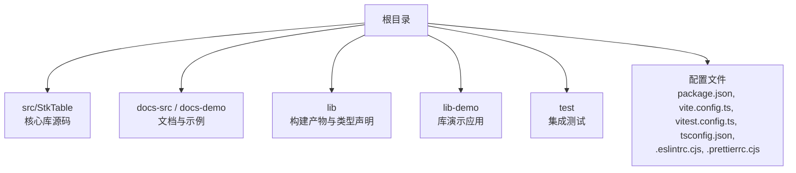
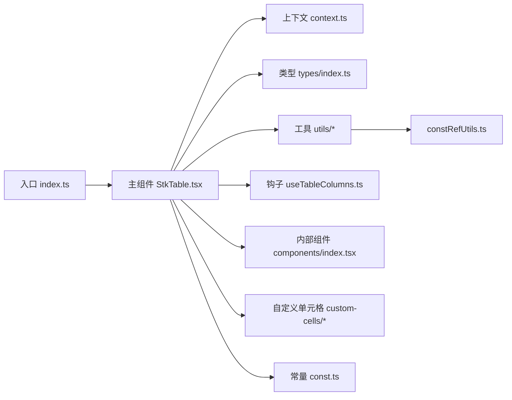
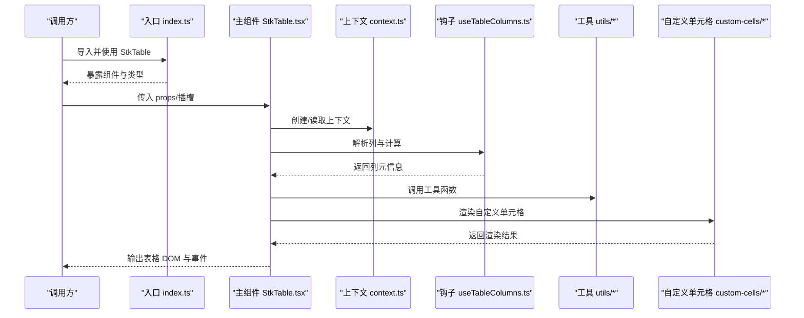
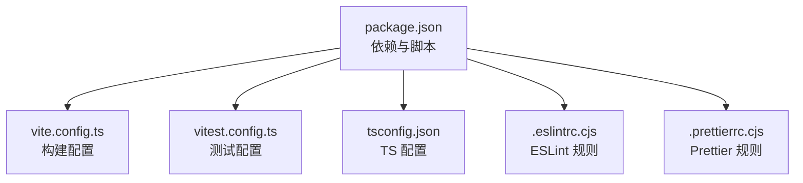

# 开发指南

<cite>
**本文引用的文件**   
- [package.json](file://package.json)
- [vite.config.ts](file://vite.config.ts)
- [vitest.config.ts](file://vitest.config.ts)
- [tsconfig.json](file://tsconfig.json)
- [.eslintrc.cjs](file://.eslintrc.cjs)
- [.prettierrc.cjs](file://.prettierrc.cjs)
- [README.md](file://README.md)
- [src/StkTable/index.ts](file://src/StkTable/index.ts)
- [src/StkTable/StkTable.tsx](file://src/StkTable/StkTable.tsx)
- [src/StkTable/context.ts](file://src/StkTable/context.ts)
- [src/StkTable/const.ts](file://src/StkTable/const.ts)
- [src/StkTable/types/index.ts](file://src/StkTable/types/index.ts)
- [src/StkTable/hooks/useTableColumns.ts](file://src/StkTable/hooks/useTableColumns.ts)
- [src/StkTable/utils/index.ts](file://src/StkTable/utils/index.ts)
- [src/StkTable/utils/constRefUtils.ts](file://src/StkTable/utils/constRefUtils.ts)
- [src/StkTable/components/index.tsx](file://src/StkTable/components/index.tsx)
- [src/StkTable/custom-cells/CheckboxCell/index.tsx](file://src/StkTable/custom-cells/CheckboxCell/index.tsx)
- [src/StkTable/custom-cells/EditableCell/index.tsx](file://src/StkTable/custom-cells/EditableCell/index.tsx)
- [src/StkTable/custom-cells/FilterCell/index.tsx](file://src/StkTable/custom-cells/FilterCell/index.tsx)
- [src/StkTable/test/StkTable.test.tsx](file://src/StkTable/test/StkTable.test.tsx)
- [src/StkTable/test/setup.ts](file://src/StkTable/test/setup.ts)
- [test/lib-build.test.tsx](file://test/lib-build.test.tsx)
- [lib-demo/main.tsx](file://lib-demo/main.tsx)
- [lib-demo/vite.config.ts](file://lib-demo/vite.config.ts)
</cite>

## 目录
1. [简介](#简介)
2. [项目结构](#项目结构)
3. [核心组件](#核心组件)
4. [架构总览](#架构总览)
5. [详细组件分析](#详细组件分析)
6. [依赖分析](#依赖分析)
7. [性能考虑](#性能考虑)
8. [故障排查指南](#故障排查指南)
9. [结论](#结论)
10. [附录](#附录)

## 简介
本指南面向贡献者与高级用户，提供 StkTable（React）从环境搭建、代码规范、测试、构建发布到调试与性能分析的完整开发流程说明。目标是帮助你在最短时间内上手并高效维护该项目。

## 项目结构
仓库采用“源码 + 文档示例 + 库产物 + 演示应用”的多模块组织方式：
- src/StkTable：核心库源码，包含主组件、上下文、类型、工具、自定义单元格、钩子与测试等。
- docs-src / docs-demo：VitePress 文档站点与示例代码。
- lib：打包产物与类型声明（由构建生成）。
- lib-demo：本地运行库的演示应用。
- test：针对库构建产物的集成测试。
- 根级配置：包管理、构建、测试、TS、ESLint、Prettier 等。

章节来源
- [README.md](file://README.md)
- [package.json](file://package.json)

## 核心组件
- 入口导出：通过统一入口对外暴露组件与类型，便于上层引用。
- 主组件：实现表格渲染、列定义解析、事件分发、上下文共享等核心逻辑。
- 上下文：在组件树中共享表格状态与能力（如主题、国际化、选择模式等）。
- 自定义单元格：提供复选框、可编辑、过滤等常用单元格实现，作为扩展参考。
- 钩子：封装列处理、计算等复用逻辑。
- 工具函数：常量、引用稳定化、通用方法等。

章节来源
- [src/StkTable/index.ts](file://src/StkTable/index.ts)
- [src/StkTable/StkTable.tsx](file://src/StkTable/StkTable.tsx)
- [src/StkTable/context.ts](file://src/StkTable/context.ts)
- [src/StkTable/const.ts](file://src/StkTable/const.ts)
- [src/StkTable/types/index.ts](file://src/StkTable/types/index.ts)
- [src/StkTable/hooks/useTableColumns.ts](file://src/StkTable/hooks/useTableColumns.ts)
- [src/StkTable/utils/index.ts](file://src/StkTable/utils/index.ts)
- [src/StkTable/utils/constRefUtils.ts](file://src/StkTable/utils/constRefUtils.ts)
- [src/StkTable/components/index.tsx](file://src/StkTable/components/index.tsx)
- [src/StkTable/custom-cells/CheckboxCell/index.tsx](file://src/StkTable/custom-cells/CheckboxCell/index.tsx)
- [src/StkTable/custom-cells/EditableCell/index.tsx](file://src/StkTable/custom-cells/EditableCell/index.tsx)
- [src/StkTable/custom-cells/FilterCell/index.tsx](file://src/StkTable/custom-cells/FilterCell/index.tsx)

## 架构总览
下图展示了核心库的模块关系与数据流向：入口聚合导出，主组件消费上下文与工具，自定义单元格通过上下文获取能力，钩子与工具被多处复用。

图表来源
- [src/StkTable/index.ts](file://src/StkTable/index.ts)
- [src/StkTable/StkTable.tsx](file://src/StkTable/StkTable.tsx)
- [src/StkTable/context.ts](file://src/StkTable/context.ts)
- [src/StkTable/types/index.ts](file://src/StkTable/types/index.ts)
- [src/StkTable/hooks/useTableColumns.ts](file://src/StkTable/hooks/useTableColumns.ts)
- [src/StkTable/utils/index.ts](file://src/StkTable/utils/index.ts)
- [src/StkTable/utils/constRefUtils.ts](file://src/StkTable/utils/constRefUtils.ts)
- [src/StkTable/components/index.tsx](file://src/StkTable/components/index.tsx)
- [src/StkTable/custom-cells/CheckboxCell/index.tsx](file://src/StkTable/custom-cells/CheckboxCell/index.tsx)
- [src/StkTable/custom-cells/EditableCell/index.tsx](file://src/StkTable/custom-cells/EditableCell/index.tsx)
- [src/StkTable/custom-cells/FilterCell/index.tsx](file://src/StkTable/custom-cells/FilterCell/index.tsx)
- [src/StkTable/const.ts](file://src/StkTable/const.ts)

## 详细组件分析

### 主组件 StkTable
职责
- 接收 props 与插槽，解析列定义，驱动表格渲染。
- 管理表格上下文，向子组件注入能力。
- 处理交互事件（排序、筛选、选择、拖拽等），向上层暴露回调。
- 与自定义单元格协作，完成单元格的渲染与编辑。

关键流程（序列图）

图表来源
- [src/StkTable/index.ts](file://src/StkTable/index.ts)
- [src/StkTable/StkTable.tsx](file://src/StkTable/StkTable.tsx)
- [src/StkTable/context.ts](file://src/StkTable/context.ts)
- [src/StkTable/hooks/useTableColumns.ts](file://src/StkTable/hooks/useTableColumns.ts)
- [src/StkTable/utils/index.ts](file://src/StkTable/utils/index.ts)
- [src/StkTable/custom-cells/CheckboxCell/index.tsx](file://src/StkTable/custom-cells/CheckboxCell/index.tsx)
- [src/StkTable/custom-cells/EditableCell/index.tsx](file://src/StkTable/custom-cells/EditableCell/index.tsx)
- [src/StkTable/custom-cells/FilterCell/index.tsx](file://src/StkTable/custom-cells/FilterCell/index.tsx)

章节来源
- [src/StkTable/StkTable.tsx](file://src/StkTable/StkTable.tsx)
- [src/StkTable/context.ts](file://src/StkTable/context.ts)
- [src/StkTable/hooks/useTableColumns.ts](file://src/StkTable/hooks/useTableColumns.ts)
- [src/StkTable/utils/index.ts](file://src/StkTable/utils/index.ts)
- [src/StkTable/custom-cells/CheckboxCell/index.tsx](file://src/StkTable/custom-cells/CheckboxCell/index.tsx)
- [src/StkTable/custom-cells/EditableCell/index.tsx](file://src/StkTable/custom-cells/EditableCell/index.tsx)
- [src/StkTable/custom-cells/FilterCell/index.tsx](file://src/StkTable/custom-cells/FilterCell/index.tsx)

### 自定义单元格
- CheckboxCell：复选框单元格，支持选中态与批量操作联动。
- EditableCell：可编辑单元格，支持输入、校验与值回写。
- FilterCell：过滤器单元格，提供下拉筛选与条件组合。

建议
- 遵循统一的 props 约定与事件回调，确保与主组件上下文兼容。
- 使用工具函数进行样式与行为扩展，避免重复造轮子。

章节来源
- [src/StkTable/custom-cells/CheckboxCell/index.tsx](file://src/StkTable/custom-cells/CheckboxCell/index.tsx)
- [src/StkTable/custom-cells/EditableCell/index.tsx](file://src/StkTable/custom-cells/EditableCell/index.tsx)
- [src/StkTable/custom-cells/FilterCell/index.tsx](file://src/StkTable/custom-cells/FilterCell/index.tsx)

### 类型与常量
- types/index.ts：集中定义表格、列、单元格、事件等类型，保证跨模块一致性。
- const.ts：集中管理常量，减少魔法值，提升可维护性。

章节来源
- [src/StkTable/types/index.ts](file://src/StkTable/types/index.ts)
- [src/StkTable/const.ts](file://src/StkTable/const.ts)

### 工具与钩子
- utils/index.ts：通用工具函数集合。
- utils/constRefUtils.ts：引用稳定化工具，降低不必要的重渲染。
- hooks/useTableColumns.ts：列解析与计算的复用逻辑。

章节来源
- [src/StkTable/utils/index.ts](file://src/StkTable/utils/index.ts)
- [src/StkTable/utils/constRefUtils.ts](file://src/StkTable/utils/constRefUtils.ts)
- [src/StkTable/hooks/useTableColumns.ts](file://src/StkTable/hooks/useTableColumns.ts)

## 依赖分析
- 包管理与脚本：通过 package.json 定义依赖、开发与构建脚本。
- 构建：基于 Vite 进行开发与打包，配置文件为 vite.config.ts。
- 测试：基于 Vitest，配置文件为 vitest.config.ts。
- TypeScript：tsconfig.json 控制编译选项与路径映射。
- 代码质量：ESLint 与 Prettier 分别负责规则与格式化。

图表来源
- [package.json](file://package.json)
- [vite.config.ts](file://vite.config.ts)
- [vitest.config.ts](file://vitest.config.ts)
- [tsconfig.json](file://tsconfig.json)
- [.eslintrc.cjs](file://.eslintrc.cjs)
- [.prettierrc.cjs](file://.prettierrc.cjs)

章节来源
- [package.json](file://package.json)
- [vite.config.ts](file://vite.config.ts)
- [vitest.config.ts](file://vitest.config.ts)
- [tsconfig.json](file://tsconfig.json)
- [.eslintrc.cjs](file://.eslintrc.cjs)
- [.prettierrc.cjs](file://.prettierrc.cjs)

## 性能考虑
- 列解析与计算：将复杂计算放入钩子或工具函数，避免每次渲染重复计算。
- 引用稳定化：对 props、回调与中间对象使用稳定引用策略，减少子组件重渲染。
- 虚拟滚动与按需渲染：大数据场景下优先启用虚拟滚动与懒加载。
- 样式与主题：尽量使用 CSS 变量与最小化样式覆盖，避免大规模重排。
- 事件节流与防抖：高频交互（滚动、输入、拖拽）需做节流/防抖处理。

[本节为通用指导，不直接分析具体文件]

## 故障排查指南
常见问题定位步骤
- 启动失败：检查 Node 版本与 pnpm 安装；确认依赖已安装；查看控制台错误堆栈。
- 构建失败：核对 TypeScript 配置与路径映射；检查别名与外部依赖；清理缓存后重试。
- 测试失败：确认测试环境初始化（setup）正确；检查断言与模拟数据；逐步缩小范围定位问题。
- 运行时异常：使用浏览器开发者工具与 React DevTools 定位组件状态与事件流。

章节来源
- [src/StkTable/test/setup.ts](file://src/StkTable/test/setup.ts)
- [src/StkTable/test/StkTable.test.tsx](file://src/StkTable/test/StkTable.test.tsx)
- [test/lib-build.test.tsx](file://test/lib-build.test.tsx)

## 结论
通过本指南，你可以快速完成环境搭建、理解代码结构与核心组件、遵循代码与提交规范、编写测试、执行构建与发布，并在需要时进行调试与性能优化。建议在新增功能或修复 Bug 时，结合单元测试与集成测试保障质量，并通过文档与示例完善使用说明。

## 附录

### 开发环境搭建
- 安装依赖
  - 使用包管理器安装所有依赖。
- 启动开发服务器
  - 运行开发命令以启动本地服务与热更新。
- 构建库与文档
  - 执行构建命令生成产物与文档站点。
- 运行演示应用
  - 进入 lib-demo 目录，安装依赖并启动演示应用。

章节来源
- [package.json](file://package.json)
- [lib-demo/main.tsx](file://lib-demo/main.tsx)
- [lib-demo/vite.config.ts](file://lib-demo/vite.config.ts)

### 代码规范
- 语言与工具链
  - TypeScript 严格模式与路径映射。
  - ESLint 规则与忽略列表。
  - Prettier 格式化规则与忽略列表。
- 命名与风格
  - 组件与文件命名采用 PascalCase。
  - 常量与枚举使用 UPPER_SNAKE_CASE。
  - 类型与接口使用描述性名称。
- 提交规范
  - 建议使用约定式提交（feat/fix/docs/chore 等）。
  - 提交信息应简洁明确，必要时附带影响范围与变更原因。

章节来源
- [tsconfig.json](file://tsconfig.json)
- [.eslintrc.cjs](file://.eslintrc.cjs)
- [.prettierrc.cjs](file://.prettierrc.cjs)

### 测试指南
- 单元测试
  - 使用 Vitest 编写组件与工具函数的单测。
  - 在 setup 文件中初始化测试环境与全局桩。
  - 针对主组件与自定义单元格编写用例，覆盖正常与边界场景。
- 集成测试
  - 对构建产物进行集成测试，验证 API 与行为稳定性。
- 运行测试
  - 执行测试命令，查看覆盖率与失败用例详情。

章节来源
- [vitest.config.ts](file://vitest.config.ts)
- [src/StkTable/test/StkTable.test.tsx](file://src/StkTable/test/StkTable.test.tsx)
- [src/StkTable/test/setup.ts](file://src/StkTable/test/setup.ts)
- [test/lib-build.test.tsx](file://test/lib-build.test.tsx)

### 构建与发布流程
- 构建库
  - 执行构建命令，生成 lib 目录下的 JS 与类型声明。
- 构建文档
  - 执行文档构建命令，生成静态站点资源。
- 发布准备
  - 版本号管理、变更日志整理、依赖升级与兼容性检查。
- 发布
  - 推送标签与发布到包仓库（按团队流程执行）。

章节来源
- [package.json](file://package.json)
- [vite.config.ts](file://vite.config.ts)

### 调试技巧
- 前端调试
  - 使用浏览器开发者工具与 React DevTools 观察组件状态与事件。
  - 在关键路径添加日志与断点，逐步定位问题。
- 性能分析
  - 使用 Performance 面板录制交互过程，识别瓶颈。
  - 使用 Memory 面板排查内存泄漏与过度渲染。
- 构建调试
  - 开启 Source Map 与详细日志，定位构建阶段问题。

[本节为通用指导，不直接分析具体文件]

### 新功能与 Bug 修复流程
- 分支策略
  - 从 main 拉取特性分支，完成后发起合并请求。
- 开发步骤
  - 实现功能或修复缺陷，补充相应测试用例。
  - 运行 lint、格式检查与测试，确保无报错。
- 提交与评审
  - 使用约定式提交信息，清晰描述变更内容。
  - 提交 MR/PR，等待评审通过后合并。
- 回归与发布
  - 合并后触发 CI，验证构建与测试。
  - 按发布流程打标签并发布。

[本节为通用指导，不直接分析具体文件]