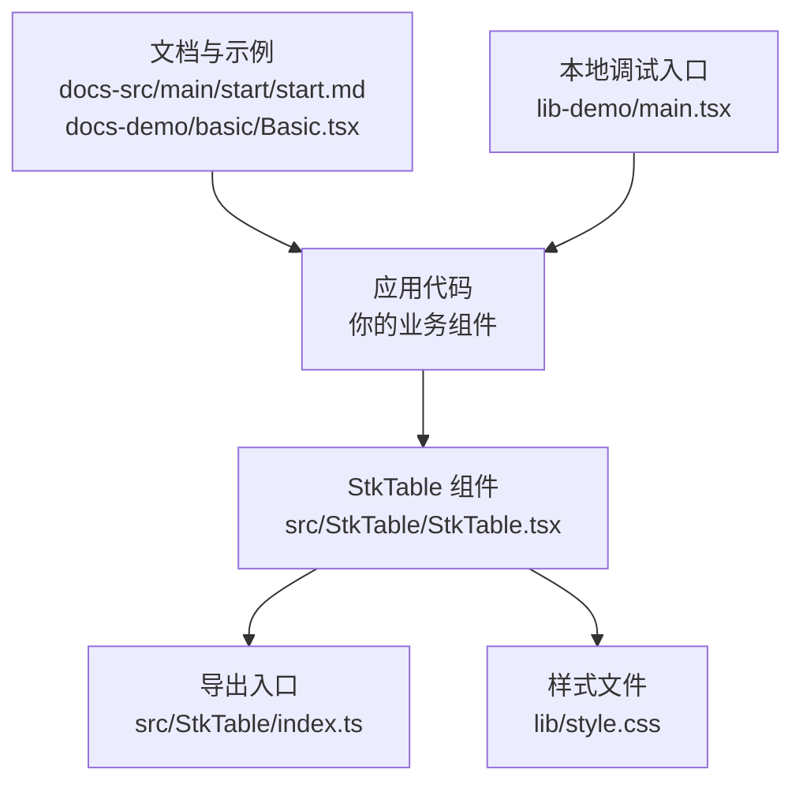
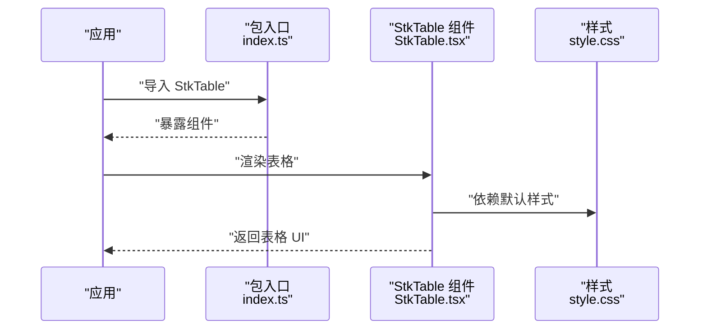
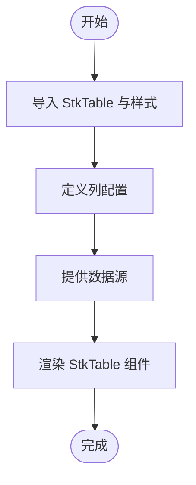
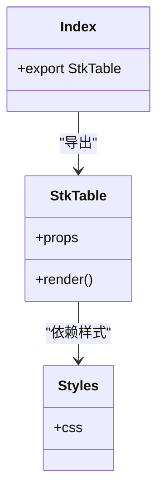
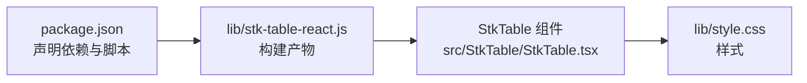

# 快速开始

<cite>
**本文引用的文件**   
- [package.json](file://package.json)
- [src/StkTable/index.ts](file://src/StkTable/index.ts)
- [src/StkTable/StkTable.tsx](file://src/StkTable/StkTable.tsx)
- [lib/stk-table-react.js](file://lib/stk-table-react.js)
- [lib/style.css](file://lib/style.css)
- [docs-src/main/start/start.md](file://docs-src/main/start/start.md)
- [docs-demo/basic/Basic.tsx](file://docs-demo/basic/Basic.tsx)
- [docs-demo/start/Start.tsx](file://docs-demo/start/Start.tsx)
- [lib-demo/main.tsx](file://lib-demo/main.tsx)
- [lib-demo/vite.config.ts](file://lib-demo/vite.config.ts)
</cite>

## 目录
1. [简介](#简介)
2. [项目结构](#项目结构)
3. [核心组件](#核心组件)
4. [架构总览](#架构总览)
5. [详细组件分析](#详细组件分析)
6. [依赖分析](#依赖分析)
7. [性能考虑](#性能考虑)
8. [故障排除指南](#故障排除指南)
9. [结论](#结论)
10. [附录](#附录) 

## 简介
本指南面向首次接触 StkTable React 的开发者，帮助你在最短时间内完成安装、初始化并运行一个基础表格实例。内容涵盖：
- 使用 npm、yarn、pnpm 的安装方式
- 最小化配置与初始化步骤
- 最简单的表格示例（导入、列配置、数据绑定）
- 开发环境要求与版本兼容性
- 常见问题与快速排障

## 项目结构
仓库包含源码、文档站点、演示与本地调试入口等关键目录。对于“快速开始”，你主要需要关注以下路径：
- 包入口与类型定义：src/StkTable/index.ts
- 组件实现：src/StkTable/StkTable.tsx
- 构建产物与样式：lib/stk-table-react.js、lib/style.css
- 官方文档与示例：docs-src/main/start/start.md、docs-demo/basic/Basic.tsx、docs-demo/start/Start.tsx
- 本地调试入口：lib-demo/main.tsx、lib-demo/vite.config.ts

图表来源
- [src/StkTable/index.ts](file://src/StkTable/index.ts)
- [src/StkTable/StkTable.tsx](file://src/StkTable/StkTable.tsx)
- [lib/style.css](file://lib/style.css)
- [docs-src/main/start/start.md](file://docs-src/main/start/start.md)
- [docs-demo/basic/Basic.tsx](file://docs-demo/basic/Basic.tsx)
- [lib-demo/main.tsx](file://lib-demo/main.tsx)

章节来源
- [src/StkTable/index.ts](file://src/StkTable/index.ts)
- [src/StkTable/StkTable.tsx](file://src/StkTable/StkTable.tsx)
- [lib/style.css](file://lib/style.css)
- [docs-src/main/start/start.md](file://docs-src/main/start/start.md)
- [docs-demo/basic/Basic.tsx](file://docs-demo/basic/Basic.tsx)
- [lib-demo/main.tsx](file://lib-demo/main.tsx)

## 核心组件
- 组件名称：StkTable
- 导出位置：通过包入口统一导出，便于在应用中直接引入
- 样式依赖：需引入库提供的样式文件以启用默认主题与布局

章节来源
- [src/StkTable/index.ts](file://src/StkTable/index.ts)
- [src/StkTable/StkTable.tsx](file://src/StkTable/StkTable.tsx)
- [lib/style.css](file://lib/style.css)

## 架构总览
下图展示了从应用到组件的最小调用链路与资源加载关系。

图表来源
- [src/StkTable/index.ts](file://src/StkTable/index.ts)
- [src/StkTable/StkTable.tsx](file://src/StkTable/StkTable.tsx)
- [lib/style.css](file://lib/style.css)

## 详细组件分析

### 安装与环境准备
- 包管理器支持：npm、yarn、pnpm
- 安装命令（任选其一）：
  - npm: 执行安装命令
  - yarn: 执行安装命令
  - pnpm: 执行安装命令
- 样式引入：在应用入口或组件中引入库提供的样式文件
- 开发环境建议：
  - Node.js 版本：参考 package.json 中的 engines 字段
  - 构建工具：Vite（推荐），也可用于其他现代前端工程化方案
  - TypeScript：可选，但推荐使用以获得更好的类型提示

章节来源
- [package.json](file://package.json)
- [lib/style.css](file://lib/style.css)

### 初始化与基本用法
- 导入组件与样式
- 定义列配置（至少包含标题与数据字段映射）
- 提供数据数组（每行数据为对象）
- 将列与数据传入组件进行渲染

[此图为概念流程图，不直接对应具体源码文件]

章节来源
- [docs-src/main/start/start.md](file://docs-src/main/start/start.md)
- [docs-demo/basic/Basic.tsx](file://docs-demo/basic/Basic.tsx)
- [docs-demo/start/Start.tsx](file://docs-demo/start/Start.tsx)

### 完整示例与运行预览
- 示例位置：
  - 文档站点示例：docs-demo/basic/Basic.tsx
  - 快速开始示例：docs-demo/start/Start.tsx
- 运行方式：
  - 本地调试入口：lib-demo/main.tsx
  - Vite 配置：lib-demo/vite.config.ts
- 运行结果预览：
  - 打开浏览器访问本地开发服务器后，即可看到基础表格渲染效果

章节来源
- [docs-demo/basic/Basic.tsx](file://docs-demo/basic/Basic.tsx)
- [docs-demo/start/Start.tsx](file://docs-demo/start/Start.tsx)
- [lib-demo/main.tsx](file://lib-demo/main.tsx)
- [lib-demo/vite.config.ts](file://lib-demo/vite.config.ts)

### 类图（组件与导出关系）

图表来源
- [src/StkTable/index.ts](file://src/StkTable/index.ts)
- [src/StkTable/StkTable.tsx](file://src/StkTable/StkTable.tsx)
- [lib/style.css](file://lib/style.css)

## 依赖分析
- 运行时依赖：React（由包入口与组件实现决定）
- 构建产物：lib/stk-table-react.js（供打包器引用）
- 样式文件：lib/style.css（需在应用侧引入）

图表来源
- [package.json](file://package.json)
- [lib/stk-table-react.js](file://lib/stk-table-react.js)
- [src/StkTable/StkTable.tsx](file://src/StkTable/StkTable.tsx)
- [lib/style.css](file://lib/style.css)

章节来源
- [package.json](file://package.json)
- [lib/stk-table-react.js](file://lib/stk-table-react.js)
- [src/StkTable/StkTable.tsx](file://src/StkTable/StkTable.tsx)
- [lib/style.css](file://lib/style.css)

## 性能考虑
- 大数据量场景：优先启用虚拟滚动（参考高级特性文档）
- 列宽自适应：合理设置列宽，避免频繁重排
- 自定义单元格：谨慎使用复杂渲染逻辑，必要时进行缓存或懒加载
- 固定列与冻结头：仅在必要时开启，减少布局计算开销

[本节为通用指导，不直接分析具体文件]

## 故障排除指南
- 样式未生效
  - 检查是否引入了 lib/style.css
  - 确认构建工具能正确解析 CSS 文件
- 组件无法渲染或白屏
  - 检查 React 版本是否与包声明兼容
  - 查看控制台是否有模块导入错误
- 列不显示或数据为空
  - 确认列配置的字段名与数据对象的键一致
  - 检查数据是否为空数组或未正确传递
- 本地调试无法启动
  - 检查 Node.js 版本是否符合 engines 要求
  - 确认 lib-demo 的 Vite 配置是否正确指向入口文件

章节来源
- [package.json](file://package.json)
- [lib/style.css](file://lib/style.css)
- [lib-demo/main.tsx](file://lib-demo/main.tsx)
- [lib-demo/vite.config.ts](file://lib-demo/vite.config.ts)

## 结论
通过以上步骤，你可以在几分钟内完成 StkTable React 的安装、初始化与第一个表格的渲染。后续可根据需求逐步启用排序、筛选、虚拟滚动、树形数据等高级特性。

[本节为总结性内容，不直接分析具体文件]

## 附录
- 官方入门文档：docs-src/main/start/start.md
- 基础示例：docs-demo/basic/Basic.tsx
- 快速开始示例：docs-demo/start/Start.tsx
- 本地调试入口：lib-demo/main.tsx
- Vite 配置：lib-demo/vite.config.ts

章节来源
- [docs-src/main/start/start.md](file://docs-src/main/start/start.md)
- [docs-demo/basic/Basic.tsx](file://docs-demo/basic/Basic.tsx)
- [docs-demo/start/Start.tsx](file://docs-demo/start/Start.tsx)
- [lib-demo/main.tsx](file://lib-demo/main.tsx)
- [lib-demo/vite.config.ts](file://lib-demo/vite.config.ts)