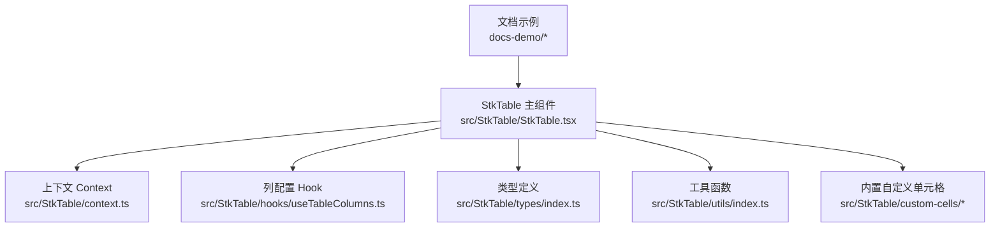
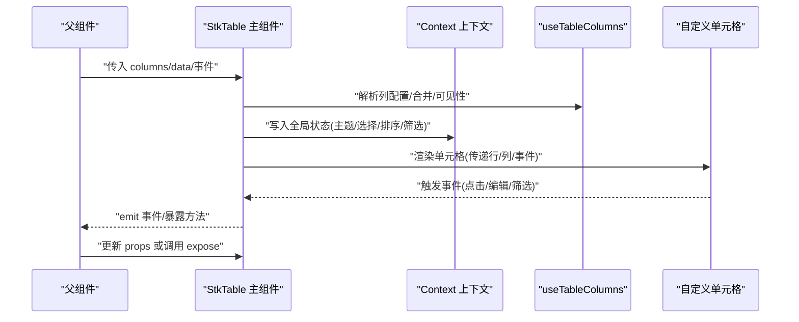
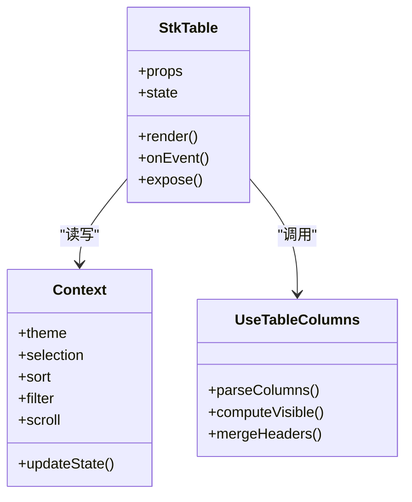
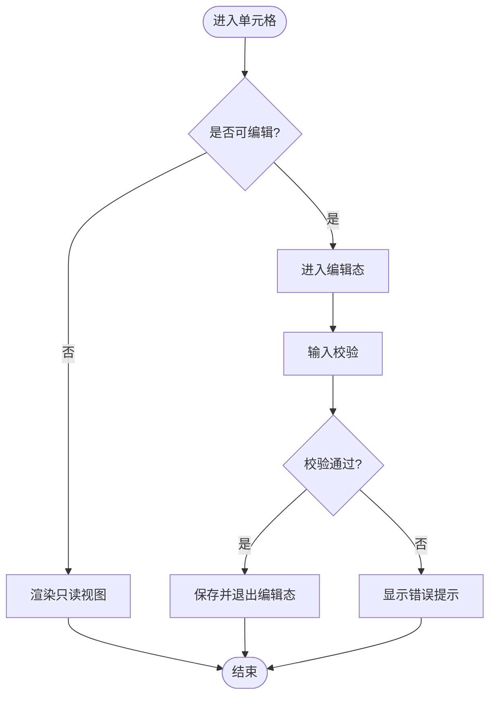
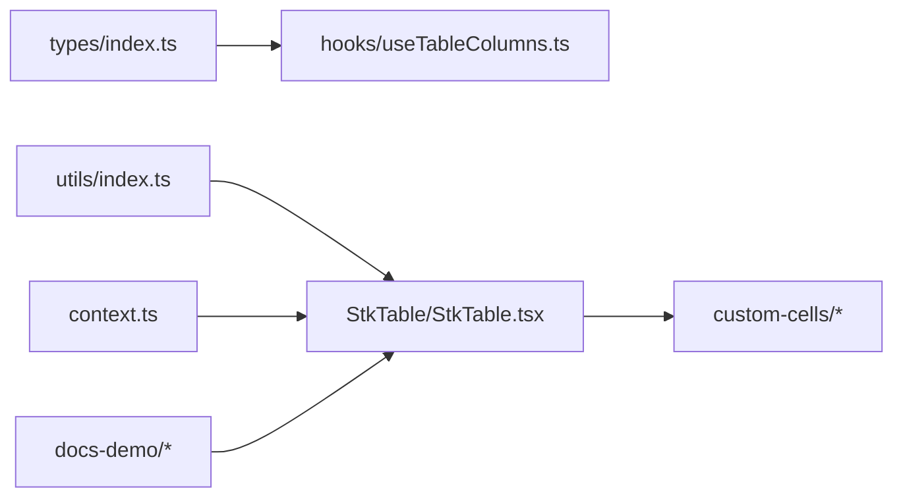

# 开发模式与架构

<cite>
**本文引用的文件**
- [src/StkTable/StkTable.tsx](file://src/StkTable/StkTable.tsx)
- [src/StkTable/index.ts](file://src/StkTable/index.ts)
- [src/StkTable/context.ts](file://src/StkTable/context.ts)
- [src/StkTable/types/index.ts](file://src/StkTable/types/index.ts)
- [src/StkTable/hooks/useTableColumns.ts](file://src/StkTable/hooks/useTableColumns.ts)
- [src/StkTable/utils/index.ts](file://src/StkTable/utils/index.ts)
- [src/StkTable/custom-cells/CheckboxCell/index.tsx](file://src/StkTable/custom-cells/CheckboxCell/index.tsx)
- [src/StkTable/custom-cells/EditableCell/index.tsx](file://src/StkTable/custom-cells/EditableCell/index.tsx)
- [src/StkTable/custom-cells/FilterCell/index.tsx](file://src/StkTable/custom-cells/FilterCell/index.tsx)
- [docs-demo/basic/Basic.tsx](file://docs-demo/basic/Basic.tsx)
- [docs-demo/demos/HugeData/index.tsx](file://docs-demo/demos/HugeData/index.tsx)
- [docs-demo/demos/VirtualList/index.tsx](file://docs-demo/demos/VirtualList/index.tsx)
- [docs-demo/advanced/custom-cell/YieldCell.tsx](file://docs-demo/advanced/custom-cell/YieldCell.tsx)
- [docs-demo/advanced/custom-cells/CheckboxCell/index.tsx](file://docs-demo/advanced/custom-cells/CheckboxCell/index.tsx)
- [docs-demo/advanced/custom-cells/EditableCell/index.tsx](file://docs-demo/advanced/custom-cells/EditableCell/index.tsx)
- [docs-demo/advanced/custom-cells/FilterCell/index.tsx](file://docs-demo/advanced/custom-cells/FilterCell/index.tsx)
- [docs-demo/api/slots/CustomBottom.tsx](file://docs-demo/api/slots/CustomBottom.tsx)
</cite>

## 目录
1. [简介](#简介)
2. [项目结构](#项目结构)
3. [核心组件](#核心组件)
4. [架构总览](#架构总览)
5. [详细组件分析](#详细组件分析)
6. [依赖关系分析](#依赖关系分析)
7. [性能考量](#性能考量)
8. [故障排查指南](#故障排查指南)
9. [结论](#结论)
10. [附录](#附录)

## 简介
本文件聚焦 StkTable 在实际项目中的开发模式与架构设计最佳实践，围绕以下目标展开：
- 总结常见组件组合模式：自定义单元格、插槽使用、事件处理等
- 提供大型表格应用的架构建议：状态管理、数据流设计、组件分层
- 分享可复用组件的设计模式与封装技巧
- 给出 TypeScript 类型定义的最佳实践与错误处理策略
- 通过实际案例展示如何构建可维护、可扩展的表格应用架构

## 项目结构
仓库采用“源码 + 文档示例 + 库产物”的分层组织方式：
- src/StkTable：核心库实现（主组件、上下文、类型、钩子、工具、内置自定义单元格）
- docs-demo：面向文档与演示的示例集（基础用法、高级特性、复杂场景）
- lib/lib-demo：打包产物与本地运行入口
- docs-src：VitePress 文档站点源码

图表来源
- [src/StkTable/StkTable.tsx](file://src/StkTable/StkTable.tsx)
- [src/StkTable/context.ts](file://src/StkTable/context.ts)
- [src/StkTable/hooks/useTableColumns.ts](file://src/StkTable/hooks/useTableColumns.ts)
- [src/StkTable/types/index.ts](file://src/StkTable/types/index.ts)
- [src/StkTable/utils/index.ts](file://src/StkTable/utils/index.ts)
- [src/StkTable/custom-cells/CheckboxCell/index.tsx](file://src/StkTable/custom-cells/CheckboxCell/index.tsx)
- [src/StkTable/custom-cells/EditableCell/index.tsx](file://src/StkTable/custom-cells/EditableCell/index.tsx)
- [src/StkTable/custom-cells/FilterCell/index.tsx](file://src/StkTable/custom-cells/FilterCell/index.tsx)

章节来源
- [src/StkTable/index.ts](file://src/StkTable/index.ts)
- [src/StkTable/StkTable.tsx](file://src/StkTable/StkTable.tsx)

## 核心组件
- StkTable 主组件
  - 职责：接收 props（列、数据、分页、排序、筛选、虚拟滚动、固定列等），协调内部状态与渲染管线，暴露方法/事件供外部调用。
  - 关键能力：列解析与合并、行/列虚拟化、选择与拖拽、扩展区、页脚与插槽、主题与样式变量。
  - 对外接口：props、事件回调、expose 方法、插槽。
- 上下文 Context
  - 职责：在表格树中共享全局配置与状态（如主题、国际化、选择态、排序/筛选状态、滚动位置等）。
  - 作用：避免逐层透传，提升组合性与一致性。
- 列配置 Hook useTableColumns
  - 职责：规范化列配置、计算可见列、处理多级表头与合并逻辑、生成渲染所需的列元信息。
- 类型定义 types/index.ts
  - 职责：集中声明列、行、事件、插槽、配置等类型，保证跨模块一致性与强类型约束。
- 工具 utils/index.ts
  - 职责：通用算法与辅助函数（如深比较、防抖节流、坐标计算、格式化等）。
- 内置自定义单元格
  - CheckboxCell：复选框单元格，支持全选联动与批量操作。
  - EditableCell：可编辑单元格，支持就地编辑与变更回写。
  - FilterCell：筛选器单元格，支持下拉筛选与条件组合。

章节来源
- [src/StkTable/StkTable.tsx](file://src/StkTable/StkTable.tsx)
- [src/StkTable/context.ts](file://src/StkTable/context.ts)
- [src/StkTable/hooks/useTableColumns.ts](file://src/StkTable/hooks/useTableColumns.ts)
- [src/StkTable/types/index.ts](file://src/StkTable/types/index.ts)
- [src/StkTable/utils/index.ts](file://src/StkTable/utils/index.ts)
- [src/StkTable/custom-cells/CheckboxCell/index.tsx](file://src/StkTable/custom-cells/CheckboxCell/index.tsx)
- [src/StkTable/custom-cells/EditableCell/index.tsx](file://src/StkTable/custom-cells/EditableCell/index.tsx)
- [src/StkTable/custom-cells/FilterCell/index.tsx](file://src/StkTable/custom-cells/FilterCell/index.tsx)

## 架构总览
下图展示了 StkTable 的核心交互与数据流向：父组件通过 props 注入列与数据；StkTable 基于 context 分发状态；列渲染由自定义单元格完成；用户交互通过事件回调或 expose 方法上抛至父级进行统一状态管理。

图表来源
- [src/StkTable/StkTable.tsx](file://src/StkTable/StkTable.tsx)
- [src/StkTable/context.ts](file://src/StkTable/context.ts)
- [src/StkTable/hooks/useTableColumns.ts](file://src/StkTable/hooks/useTableColumns.ts)
- [src/StkTable/custom-cells/EditableCell/index.tsx](file://src/StkTable/custom-cells/EditableCell/index.tsx)

## 详细组件分析

### 主组件 StkTable 与上下文 Context
- 设计要点
  - 将“列解析”“状态管理”“渲染管线”解耦：列解析由 Hook 负责，状态集中在 Context，渲染由具体单元格完成。
  - 通过 Context 提供“只读视图 + 变更回调”，避免直接修改 props，保持单向数据流。
  - 对高频状态（滚动、选择、排序、筛选）做稳定引用与惰性初始化，减少重渲染。
- 典型流程
  - 初始化：解析列配置 -> 建立默认状态 -> 挂载事件监听
  - 交互：单元格事件 -> 更新局部状态 -> 触发 emit -> 父组件同步数据源
  - 更新：父组件 props 变化 -> 增量对比 -> 最小化重渲染

图表来源
- [src/StkTable/StkTable.tsx](file://src/StkTable/StkTable.tsx)
- [src/StkTable/context.ts](file://src/StkTable/context.ts)
- [src/StkTable/hooks/useTableColumns.ts](file://src/StkTable/hooks/useTableColumns.ts)

章节来源
- [src/StkTable/StkTable.tsx](file://src/StkTable/StkTable.tsx)
- [src/StkTable/context.ts](file://src/StkTable/context.ts)
- [src/StkTable/hooks/useTableColumns.ts](file://src/StkTable/hooks/useTableColumns.ts)

### 列配置 Hook useTableColumns
- 职责
  - 标准化列定义，处理多级表头、列合并、隐藏/显示、宽度计算、排序/筛选标记等。
  - 输出稳定的列元信息数组，供渲染与事件路由使用。
- 复杂度
  - 时间复杂度 O(n) 遍历列树；空间复杂度取决于列深度与合并矩阵。
- 优化点
  - 缓存列解析结果，仅在列配置变化时重新计算。
  - 对深层嵌套列进行扁平化处理，降低渲染分支判断成本。

章节来源
- [src/StkTable/hooks/useTableColumns.ts](file://src/StkTable/hooks/useTableColumns.ts)

### 类型系统 types/index.ts
- 设计原则
  - 以“列-行-事件-插槽-配置”为维度拆分类型，确保各模块独立演进。
  - 使用泛型约束数据模型，使单元格与业务数据强关联。
  - 导出联合类型与字面量类型，限制非法值输入。
- 最佳实践
  - 将公共类型抽离到 types 目录，避免重复定义。
  - 对可选字段提供默认值与校验提示，增强健壮性。

章节来源
- [src/StkTable/types/index.ts](file://src/StkTable/types/index.ts)

### 工具函数 utils/index.ts
- 常见能力
  - 防抖/节流、深比较、坐标与尺寸计算、字符串/数字格式化、空值处理。
- 使用建议
  - 纯函数优先，避免副作用；对外暴露稳定 API。
  - 对性能敏感路径（滚动、拖拽）使用 requestAnimationFrame 或 Web Worker。

章节来源
- [src/StkTable/utils/index.ts](file://src/StkTable/utils/index.ts)

### 内置自定义单元格
- CheckboxCell
  - 用途：行选择、全选联动、批量操作。
  - 关键点：受控/非受控两种模式；与表格选择态双向同步；性能优化（仅渲染可视区域）。
- EditableCell
  - 用途：就地编辑、表单校验、撤销/提交。
  - 关键点：编辑态切换、失焦保存、键盘导航、与数据源同步。
- FilterCell
  - 用途：列级筛选、多条件组合、远程筛选。
  - 关键点：筛选器状态隔离、去抖查询、结果高亮。

图表来源
- [src/StkTable/custom-cells/EditableCell/index.tsx](file://src/StkTable/custom-cells/EditableCell/index.tsx)
- [src/StkTable/custom-cells/CheckboxCell/index.tsx](file://src/StkTable/custom-cells/CheckboxCell/index.tsx)
- [src/StkTable/custom-cells/FilterCell/index.tsx](file://src/StkTable/custom-cells/FilterCell/index.tsx)

章节来源
- [src/StkTable/custom-cells/CheckboxCell/index.tsx](file://src/StkTable/custom-cells/CheckboxCell/index.tsx)
- [src/StkTable/custom-cells/EditableCell/index.tsx](file://src/StkTable/custom-cells/EditableCell/index.tsx)
- [src/StkTable/custom-cells/FilterCell/index.tsx](file://src/StkTable/custom-cells/FilterCell/index.tsx)

### 文档示例中的组合模式
- 基础用法
  - 通过最简 props 快速搭建表格，验证列与数据绑定。
- 大数据与虚拟列表
  - 结合虚拟滚动与懒加载，支撑海量数据渲染。
- 高级自定义单元格
  - 通过 YieldCell 等模式，将渲染逻辑下沉到单元格，保持主组件简洁。
- 插槽与扩展
  - 使用底部插槽 CustomBottom 定制页脚、统计信息与操作按钮。

章节来源
- [docs-demo/basic/Basic.tsx](file://docs-demo/basic/Basic.tsx)
- [docs-demo/demos/HugeData/index.tsx](file://docs-demo/demos/HugeData/index.tsx)
- [docs-demo/demos/VirtualList/index.tsx](file://docs-demo/demos/VirtualList/index.tsx)
- [docs-demo/advanced/custom-cell/YieldCell.tsx](file://docs-demo/advanced/custom-cell/YieldCell.tsx)
- [docs-demo/advanced/custom-cells/CheckboxCell/index.tsx](file://docs-demo/advanced/custom-cells/CheckboxCell/index.tsx)
- [docs-demo/advanced/custom-cells/EditableCell/index.tsx](file://docs-demo/advanced/custom-cells/EditableCell/index.tsx)
- [docs-demo/advanced/custom-cells/FilterCell/index.tsx](file://docs-demo/advanced/custom-cells/FilterCell/index.tsx)
- [docs-demo/api/slots/CustomBottom.tsx](file://docs-demo/api/slots/CustomBottom.tsx)

## 依赖关系分析
- 内聚与耦合
  - StkTable 与 Context 低耦合：通过接口约定通信，便于替换实现。
  - 列解析 Hook 独立于渲染，利于测试与复用。
- 外部依赖
  - 第三方 UI 库（如选择器、弹窗）应通过插槽或高阶组件接入，避免侵入主组件。
- 潜在循环依赖
  - 避免在 Context 中引入主组件；将状态与行为拆分为独立模块。

图表来源
- [src/StkTable/types/index.ts](file://src/StkTable/types/index.ts)
- [src/StkTable/hooks/useTableColumns.ts](file://src/StkTable/hooks/useTableColumns.ts)
- [src/StkTable/utils/index.ts](file://src/StkTable/utils/index.ts)
- [src/StkTable/StkTable.tsx](file://src/StkTable/StkTable.tsx)
- [src/StkTable/context.ts](file://src/StkTable/context.ts)
- [src/StkTable/custom-cells/CheckboxCell/index.tsx](file://src/StkTable/custom-cells/CheckboxCell/index.tsx)
- [src/StkTable/custom-cells/EditableCell/index.tsx](file://src/StkTable/custom-cells/EditableCell/index.tsx)
- [src/StkTable/custom-cells/FilterCell/index.tsx](file://src/StkTable/custom-cells/FilterCell/index.tsx)
- [docs-demo/basic/Basic.tsx](file://docs-demo/basic/Basic.tsx)

章节来源
- [src/StkTable/StkTable.tsx](file://src/StkTable/StkTable.tsx)
- [src/StkTable/context.ts](file://src/StkTable/context.ts)
- [src/StkTable/hooks/useTableColumns.ts](file://src/StkTable/hooks/useTableColumns.ts)
- [src/StkTable/types/index.ts](file://src/StkTable/types/index.ts)
- [src/StkTable/utils/index.ts](file://src/StkTable/utils/index.ts)

## 性能考量
- 渲染优化
  - 使用虚拟滚动（行/列）与按需加载，减少 DOM 节点数量。
  - 对大对象进行浅比较或结构化克隆，避免不必要的重渲染。
- 状态管理
  - 将频繁变化的状态（滚动、选择、排序、筛选）放入 Context，并提供稳定引用。
  - 对昂贵计算（列合并、排序索引）增加缓存与失效策略。
- 事件与交互
  - 对高频事件（滚动、拖拽）使用节流/防抖与 rAF 调度。
  - 将复杂交互下沉到自定义单元格，避免在主组件中堆积逻辑。
- 内存管理
  - 及时清理事件监听与定时器，防止泄漏。
  - 大数据场景下分片渲染与懒加载结合。

[本节为通用指导，不直接分析具体文件]

## 故障排查指南
- 常见问题定位
  - 列未渲染：检查列配置是否被过滤或隐藏；确认 useTableColumns 的输出。
  - 事件不触发：核对事件命名与冒泡层级；确认单元格是否正确转发事件。
  - 编辑态异常：检查受控/非受控模式混用；确认数据源键值唯一且稳定。
  - 筛选无效：确认筛选条件与数据字段映射；检查远程筛选请求参数。
- 调试建议
  - 打印 Context 关键状态快照，观察状态变更链路。
  - 使用浏览器性能面板分析重渲染热点。
  - 为自定义单元格添加边界用例测试（空值、超长文本、特殊字符）。

章节来源
- [src/StkTable/StkTable.tsx](file://src/StkTable/StkTable.tsx)
- [src/StkTable/context.ts](file://src/StkTable/context.ts)
- [src/StkTable/hooks/useTableColumns.ts](file://src/StkTable/hooks/useTableColumns.ts)
- [src/StkTable/custom-cells/EditableCell/index.tsx](file://src/StkTable/custom-cells/EditableCell/index.tsx)
- [src/StkTable/custom-cells/FilterCell/index.tsx](file://src/StkTable/custom-cells/FilterCell/index.tsx)

## 结论
- 以“列解析 Hook + 全局 Context + 可插拔单元格”为核心，形成高内聚、低耦合的表格架构。
- 通过类型系统与工具函数保障一致性与可维护性。
- 在大型应用中，遵循单向数据流与分层设计，配合虚拟滚动与懒加载，实现高性能与可扩展的表格体验。

[本节为总结性内容，不直接分析具体文件]

## 附录
- 实战案例参考
  - 基础表格：快速上手与常用属性
  - 大数据表格：虚拟滚动与分页
  - 可编辑表格：就地编辑与校验
  - 筛选表格：多条件组合与远程查询
  - 自定义单元格：YieldCell 模式与插槽扩展

章节来源
- [docs-demo/basic/Basic.tsx](file://docs-demo/basic/Basic.tsx)
- [docs-demo/demos/HugeData/index.tsx](file://docs-demo/demos/HugeData/index.tsx)
- [docs-demo/demos/VirtualList/index.tsx](file://docs-demo/demos/VirtualList/index.tsx)
- [docs-demo/advanced/custom-cell/YieldCell.tsx](file://docs-demo/advanced/custom-cell/YieldCell.tsx)
- [docs-demo/advanced/custom-cells/EditableCell/index.tsx](file://docs-demo/advanced/custom-cells/EditableCell/index.tsx)
- [docs-demo/advanced/custom-cells/FilterCell/index.tsx](file://docs-demo/advanced/custom-cells/FilterCell/index.tsx)
- [docs-demo/api/slots/CustomBottom.tsx](file://docs-demo/api/slots/CustomBottom.tsx)