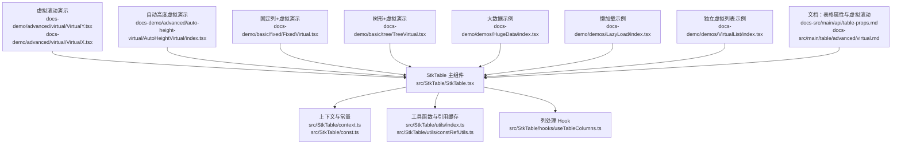
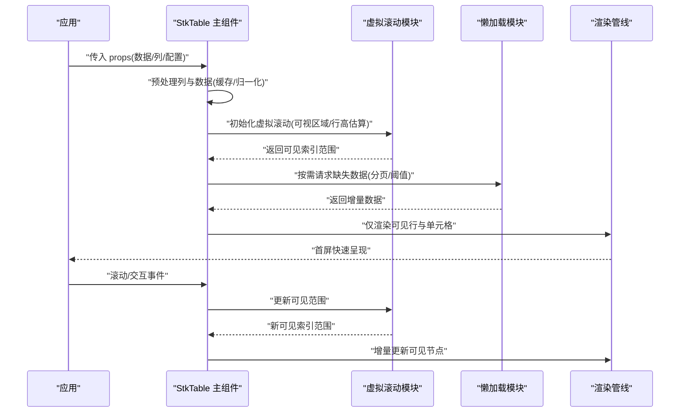
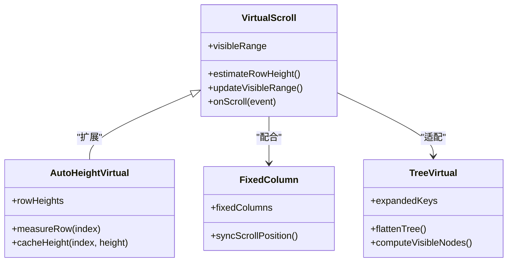
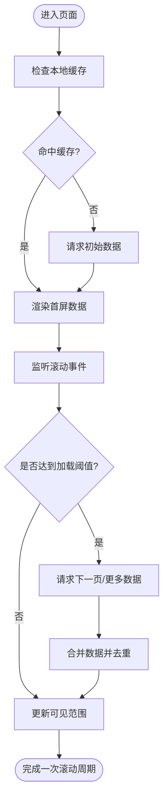
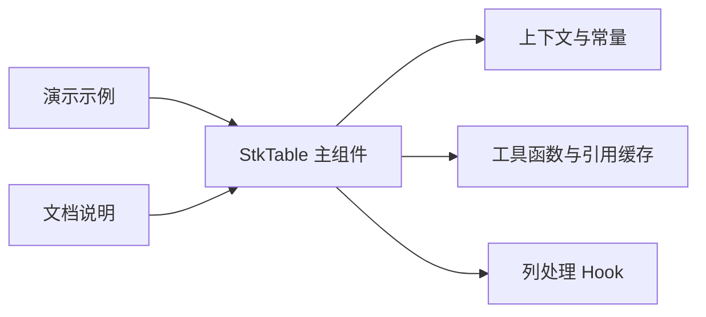

# 性能优化

<cite>
**本文引用的文件**   
- [StkTable.tsx](file://src/StkTable/StkTable.tsx)
- [index.ts](file://src/StkTable/index.ts)
- [const.ts](file://src/StkTable/const.ts)
- [context.ts](file://src/StkTable/context.ts)
- [useTableColumns.ts](file://src/StkTable/hooks/useTableColumns.ts)
- [index.ts](file://src/StkTable/utils/index.ts)
- [constRefUtils.ts](file://src/StkTable/utils/constRefUtils.ts)
- [VirtualY.tsx](file://docs-demo/advanced/virtual/VirtualY.tsx)
- [VirtualX.tsx](file://docs-demo/advanced/virtual/VirtualX.tsx)
- [AutoHeightVirtual/index.tsx](file://docs-demo/advanced/auto-height-virtual/AutoHeightVirtual/index.tsx)
- [PretextAutoHeight/index.tsx](file://docs-demo/advanced/auto-height-virtual/PretextAutoHeight/index.tsx)
- [FixedVirtual.tsx](file://docs-demo/basic/fixed/FixedVirtual.tsx)
- [TreeVirtual.tsx](file://docs-demo/basic/tree/TreeVirtual.tsx)
- [index.tsx](file://docs-demo/demos/HugeData/index.tsx)
- [columns.tsx](file://docs-demo/demos/HugeData/columns.tsx)
- [event.ts](file://docs-demo/demos/HugeData/event.ts)
- [mockData.ts](file://docs-demo/demos/HugeData/mockData.ts)
- [types.ts](file://docs-demo/demos/HugeData/types.ts)
- [index.tsx](file://docs-demo/demos/LazyLoad/index.tsx)
- [index.tsx](file://docs-demo/demos/VirtualList/index.tsx)
- [Panel.tsx](file://docs-demo/demos/VirtualList/Panel.tsx)
- [types.ts](file://docs-demo/demos/VirtualList/types.ts)
- [table-props.md](file://docs-src/main/api/table-props.md)
- [virtual.md](file://docs-src/main/table/advanced/virtual.md)
</cite>

## 目录
1. [简介](#简介)
2. [项目结构](#项目结构)
3. [核心组件](#核心组件)
4. [架构总览](#架构总览)
5. [详细组件分析](#详细组件分析)
6. [依赖分析](#依赖分析)
7. [性能考虑](#性能考虑)
8. [故障排查指南](#故障排查指南)
9. [结论](#结论)
10. [附录](#附录)

## 简介
本指南聚焦 StkTable 在大数据量场景下的性能优化，围绕虚拟滚动、内存管理、渲染性能调优展开，提供可落地的最佳实践与示例路径。内容覆盖：
- 初始加载时间优化（懒加载、增量更新）
- 滚动性能优化（虚拟滚动配置、行高估算、固定列配合）
- 交互响应速度优化（事件节流、计算缓存、稳定引用）
- 性能监控与调试方法（定位瓶颈、度量指标）

## 项目结构
仓库包含源码、演示与文档三部分，与性能优化相关的关键位置如下：
- 源码层：StkTable 主组件、上下文、工具函数、类型定义
- 演示层：高级特性（虚拟滚动、自动高度）、基础能力（固定列、树形表格）、大数据与懒加载示例
- 文档层：API 说明与高级特性文档

图表来源
- [StkTable.tsx](file://src/StkTable/StkTable.tsx)
- [context.ts](file://src/StkTable/context.ts)
- [const.ts](file://src/StkTable/const.ts)
- [index.ts](file://src/StkTable/utils/index.ts)
- [constRefUtils.ts](file://src/StkTable/utils/constRefUtils.ts)
- [useTableColumns.ts](file://src/StkTable/hooks/useTableColumns.ts)
- [VirtualY.tsx](file://docs-demo/advanced/virtual/VirtualY.tsx)
- [VirtualX.tsx](file://docs-demo/advanced/virtual/VirtualX.tsx)
- [AutoHeightVirtual/index.tsx](file://docs-demo/advanced/auto-height-virtual/AutoHeightVirtual/index.tsx)
- [FixedVirtual.tsx](file://docs-demo/basic/fixed/FixedVirtual.tsx)
- [TreeVirtual.tsx](file://docs-demo/basic/tree/TreeVirtual.tsx)
- [index.tsx](file://docs-demo/demos/HugeData/index.tsx)
- [index.tsx](file://docs-demo/demos/LazyLoad/index.tsx)
- [index.tsx](file://docs-demo/demos/VirtualList/index.tsx)
- [table-props.md](file://docs-src/main/api/table-props.md)
- [virtual.md](file://docs-src/main/table/advanced/virtual.md)

章节来源
- [StkTable.tsx](file://src/StkTable/StkTable.tsx)
- [index.ts](file://src/StkTable/index.ts)
- [table-props.md](file://docs-src/main/api/table-props.md)
- [virtual.md](file://docs-src/main/table/advanced/virtual.md)

## 核心组件
- StkTable 主组件：负责数据到视图的映射、滚动与虚拟渲染协调、列与单元格渲染策略选择、事件分发与状态同步。
- 上下文与常量：提供全局配置、主题、尺寸、默认值等共享信息，避免重复计算与传递开销。
- 工具函数与引用缓存：封装常用计算与稳定性保障，减少不必要的重渲染。
- 列处理 Hook：对列进行规范化、排序、过滤、合并等预处理，降低渲染阶段复杂度。

章节来源
- [StkTable.tsx](file://src/StkTable/StkTable.tsx)
- [context.ts](file://src/StkTable/context.ts)
- [const.ts](file://src/StkTable/const.ts)
- [index.ts](file://src/StkTable/utils/index.ts)
- [constRefUtils.ts](file://src/StkTable/utils/constRefUtils.ts)
- [useTableColumns.ts](file://src/StkTable/hooks/useTableColumns.ts)

## 架构总览
下图展示从数据到渲染的关键路径，以及虚拟滚动与懒加载的协作关系。

图表来源
- [StkTable.tsx](file://src/StkTable/StkTable.tsx)
- [VirtualY.tsx](file://docs-demo/advanced/virtual/VirtualY.tsx)
- [VirtualX.tsx](file://docs-demo/advanced/virtual/VirtualX.tsx)
- [index.tsx](file://docs-demo/demos/HugeData/index.tsx)
- [index.tsx](file://docs-demo/demos/LazyLoad/index.tsx)

## 详细组件分析

### 虚拟滚动配置与优化技巧
- 垂直与水平虚拟滚动：通过演示示例了解如何启用 Y/X 方向虚拟滚动，并观察其对大数据量的影响。
- 自动高度虚拟：当行高不固定时，使用自动高度虚拟方案，结合行高缓存与估算策略提升性能。
- 固定列与虚拟滚动组合：固定列需与虚拟滚动协同，确保滚动过程中 DOM 节点数量可控。
- 树形表格虚拟：树形结构下，合理设置展开层级与虚拟滚动，避免全量展开导致的性能问题。

章节来源
- [VirtualY.tsx](file://docs-demo/advanced/virtual/VirtualY.tsx)
- [VirtualX.tsx](file://docs-demo/advanced/virtual/VirtualX.tsx)
- [AutoHeightVirtual/index.tsx](file://docs-demo/advanced/auto-height-virtual/AutoHeightVirtual/index.tsx)
- [FixedVirtual.tsx](file://docs-demo/basic/fixed/FixedVirtual.tsx)
- [TreeVirtual.tsx](file://docs-demo/basic/tree/TreeVirtual.tsx)

#### 类图：虚拟滚动关键对象关系

图表来源
- [VirtualY.tsx](file://docs-demo/advanced/virtual/VirtualY.tsx)
- [AutoHeightVirtual/index.tsx](file://docs-demo/advanced/auto-height-virtual/AutoHeightVirtual/index.tsx)
- [FixedVirtual.tsx](file://docs-demo/basic/fixed/FixedVirtual.tsx)
- [TreeVirtual.tsx](file://docs-demo/basic/tree/TreeVirtual.tsx)

### 大数据量处理最佳实践
- 初始加载时间优化：
  - 首屏只加载必要列与少量数据，其余通过懒加载或分页逐步获取。
  - 使用稳定的 key 与 memo 化子组件，减少首次渲染后的重渲染。
- 滚动性能优化：
  - 启用虚拟滚动，限制同时存在的 DOM 节点数量。
  - 为行高提供估算值，避免频繁测量；必要时开启自动高度虚拟并缓存行高。
- 交互响应速度优化：
  - 对高频事件（滚动、输入）进行节流/防抖。
  - 将复杂计算移出渲染路径，采用缓存与增量更新。
- 内存管理策略：
  - 及时释放不可见数据的引用，避免大对象长期驻留。
  - 控制缓存大小上限，防止无限增长。

章节来源
- [index.tsx](file://docs-demo/demos/HugeData/index.tsx)
- [columns.tsx](file://docs-demo/demos/HugeData/columns.tsx)
- [event.ts](file://docs-demo/demos/HugeData/event.ts)
- [mockData.ts](file://docs-demo/demos/HugeData/mockData.ts)
- [types.ts](file://docs-demo/demos/HugeData/types.ts)
- [index.tsx](file://docs-demo/demos/LazyLoad/index.tsx)

#### 流程图：懒加载与增量更新

图表来源
- [index.tsx](file://docs-demo/demos/LazyLoad/index.tsx)
- [index.tsx](file://docs-demo/demos/HugeData/index.tsx)

### 独立虚拟列表参考
独立虚拟列表示例展示了更底层的虚拟实现思路，可作为理解 StkTable 内部行为的参考。

章节来源
- [index.tsx](file://docs-demo/demos/VirtualList/index.tsx)
- [Panel.tsx](file://docs-demo/demos/VirtualList/Panel.tsx)
- [types.ts](file://docs-demo/demos/VirtualList/types.ts)

## 依赖分析
StkTable 的性能优化依赖于多个模块的协作：
- 主组件与上下文/常量：提供统一配置与默认值，避免重复计算。
- 工具函数与引用缓存：保证 props 与回调的稳定性，减少 React 重渲染。
- 列处理 Hook：在渲染前完成列的规范化与计算，降低运行时成本。
- 演示与文档：提供实际案例与 API 说明，帮助开发者正确配置虚拟滚动与懒加载。

图表来源
- [StkTable.tsx](file://src/StkTable/StkTable.tsx)
- [context.ts](file://src/StkTable/context.ts)
- [const.ts](file://src/StkTable/const.ts)
- [index.ts](file://src/StkTable/utils/index.ts)
- [constRefUtils.ts](file://src/StkTable/utils/constRefUtils.ts)
- [useTableColumns.ts](file://src/StkTable/hooks/useTableColumns.ts)
- [table-props.md](file://docs-src/main/api/table-props.md)
- [virtual.md](file://docs-src/main/table/advanced/virtual.md)

章节来源
- [StkTable.tsx](file://src/StkTable/StkTable.tsx)
- [table-props.md](file://docs-src/main/api/table-props.md)
- [virtual.md](file://docs-src/main/table/advanced/virtual.md)

## 性能考虑
- 初始加载时间
  - 优先渲染最小必要集，后续通过懒加载补充。
  - 使用稳定的 key 与 memo 化子组件，避免首屏后的大规模重渲染。
- 滚动性能
  - 启用虚拟滚动，限制 DOM 节点数量。
  - 提供行高估算与缓存，减少测量开销。
  - 固定列与虚拟滚动协同，避免额外布局抖动。
- 交互响应
  - 对滚动、输入等高频事件进行节流/防抖。
  - 将复杂计算前置或缓存，渲染路径保持轻量。
- 内存管理
  - 控制缓存大小，及时释放不可见数据引用。
  - 避免在渲染中创建大对象或深拷贝。

[本节为通用指导，无需特定文件来源]

## 故障排查指南
- 识别瓶颈
  - 使用浏览器性能面板记录滚动与渲染过程，关注长任务与布局抖动。
  - 统计首屏渲染时间与后续滚动帧率，定位卡顿点。
- 常见问题
  - 行高不稳定导致频繁重排：提供估算值或开启自动高度虚拟并缓存行高。
  - 固定列与虚拟滚动不同步：检查滚动事件处理与位置同步逻辑。
  - 懒加载触发过频：调整阈值与节流策略，合并多次请求。
- 调试建议
  - 在关键路径添加日志与埋点，输出可见范围变化与数据合并结果。
  - 使用最小复现示例隔离问题，逐步验证配置项的影响。

[本节为通用指导，无需特定文件来源]

## 结论
通过合理的虚拟滚动配置、懒加载与增量更新策略、稳定的引用与缓存机制，以及完善的性能监控与调试流程，可以显著提升 StkTable 在大数据量场景下的初始加载、滚动与交互性能。建议在实际项目中结合演示与文档，持续度量与优化。

[本节为总结性内容，无需特定文件来源]

## 附录
- 参考示例路径
  - 虚拟滚动：[VirtualY.tsx](file://docs-demo/advanced/virtual/VirtualY.tsx)、[VirtualX.tsx](file://docs-demo/advanced/virtual/VirtualX.tsx)
  - 自动高度虚拟：[AutoHeightVirtual/index.tsx](file://docs-demo/advanced/auto-height-virtual/AutoHeightVirtual/index.tsx)
  - 固定列+虚拟：[FixedVirtual.tsx](file://docs-demo/basic/fixed/FixedVirtual.tsx)
  - 树形+虚拟：[TreeVirtual.tsx](file://docs-demo/basic/tree/TreeVirtual.tsx)
  - 大数据与懒加载：[HugeData/index.tsx](file://docs-demo/demos/HugeData/index.tsx)、[LazyLoad/index.tsx](file://docs-demo/demos/LazyLoad/index.tsx)
  - 独立虚拟列表：[VirtualList/index.tsx](file://docs-demo/demos/VirtualList/index.tsx)
- 文档参考
  - 表格属性：[table-props.md](file://docs-src/main/api/table-props.md)
  - 虚拟滚动：[virtual.md](file://docs-src/main/table/advanced/virtual.md)

[本节为附录，无需特定文件来源]