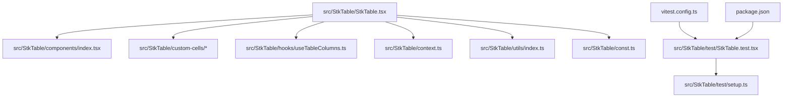
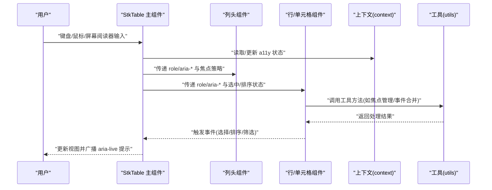
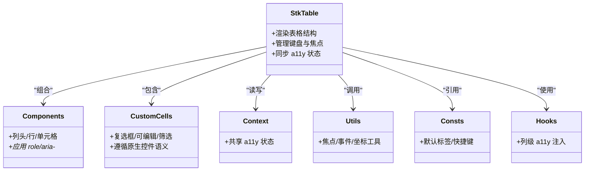

# 无障碍访问与测试

<cite>
**本文引用的文件**   
- [StkTable.tsx](file://src/StkTable/StkTable.tsx)
- [index.ts](file://src/StkTable/index.ts)
- [context.ts](file://src/StkTable/context.ts)
- [types/index.ts](file://src/StkTable/types/index.ts)
- [utils/index.ts](file://src/StkTable/utils/index.ts)
- [const.ts](file://src/StkTable/const.ts)
- [components/index.tsx](file://src/StkTable/components/index.tsx)
- [custom-cells/CheckboxCell/index.tsx](file://src/StkTable/custom-cells/CheckboxCell/index.tsx)
- [custom-cells/EditableCell/index.tsx](file://src/StkTable/custom-cells/EditableCell/index.tsx)
- [custom-cells/FilterCell/index.tsx](file://src/StkTable/custom-cells/FilterCell/index.tsx)
- [hooks/useTableColumns.ts](file://src/StkTable/hooks/useTableColumns.ts)
- [test/StkTable.test.tsx](file://src/StkTable/test/StkTable.test.tsx)
- [test/setup.ts](file://src/StkTable/test/setup.ts)
- [vitest.config.ts](file://vitest.config.ts)
- [package.json](file://package.json)
</cite>

## 目录
1. [简介](#简介)
2. [项目结构](#项目结构)
3. [核心组件](#核心组件)
4. [架构总览](#架构总览)
5. [详细组件分析](#详细组件分析)
6. [依赖关系分析](#依赖关系分析)
7. [性能考量](#性能考量)
8. [故障排查指南](#故障排查指南)
9. [结论](#结论)
10. [附录](#附录)

## 简介
本文件聚焦 StkTable 的无障碍访问（a11y）实现建议与测试策略，覆盖键盘导航、屏幕阅读器支持、焦点管理等关键能力，并提供完整的测试方案：单元测试、集成测试、视觉回归测试的实现方法与自动化配置；同时给出跨浏览器兼容性测试的方法与工具推荐。目标是帮助开发者在保持表格高性能的同时，提供稳定、可访问、可维护的用户体验。

## 项目结构
仓库采用“源码 + 文档示例 + 库产物”的分层组织方式。与 a11y 和测试相关的核心代码位于 src/StkTable 下，测试用例位于 src/StkTable/test 与根级 test 目录，测试框架与脚本由 vitest 与 package.json 管理。

图表来源
- [StkTable.tsx](file://src/StkTable/StkTable.tsx)
- [components/index.tsx](file://src/StkTable/components/index.tsx)
- [custom-cells/CheckboxCell/index.tsx](file://src/StkTable/custom-cells/CheckboxCell/index.tsx)
- [custom-cells/EditableCell/index.tsx](file://src/StkTable/custom-cells/EditableCell/index.tsx)
- [custom-cells/FilterCell/index.tsx](file://src/StkTable/custom-cells/FilterCell/index.tsx)
- [hooks/useTableColumns.ts](file://src/StkTable/hooks/useTableColumns.ts)
- [context.ts](file://src/StkTable/context.ts)
- [utils/index.ts](file://src/StkTable/utils/index.ts)
- [const.ts](file://src/StkTable/const.ts)
- [test/StkTable.test.tsx](file://src/StkTable/test/StkTable.test.tsx)
- [test/setup.ts](file://src/StkTable/test/setup.ts)
- [vitest.config.ts](file://vitest.config.ts)
- [package.json](file://package.json)

章节来源
- [StkTable.tsx](file://src/StkTable/StkTable.tsx)
- [index.ts](file://src/StkTable/index.ts)
- [test/StkTable.test.tsx](file://src/StkTable/test/StkTable.test.tsx)
- [vitest.config.ts](file://vitest.config.ts)
- [package.json](file://package.json)

## 核心组件
- 主表组件：负责渲染表格骨架、列头、行数据、滚动与虚拟化等，是 a11y 语义与交互的核心承载点。
- 自定义单元格：如复选框、可编辑、筛选等，需遵循原生控件的可访问性约定。
- 上下文与类型：用于共享状态与约束，确保 a11y 属性在各层级一致传递。
- 工具与常量：封装通用逻辑与默认值，便于统一维护 a11y 行为。

章节来源
- [StkTable.tsx](file://src/StkTable/StkTable.tsx)
- [context.ts](file://src/StkTable/context.ts)
- [types/index.ts](file://src/StkTable/types/index.ts)
- [utils/index.ts](file://src/StkTable/utils/index.ts)
- [const.ts](file://src/StkTable/const.ts)

## 架构总览
下图展示了 StkTable 在 a11y 方面的主要职责划分与数据流向：主组件协调列头、行、单元格与滚动区域，通过上下文向子组件传递可访问性相关状态，并在必要时暴露 API 供外部控制焦点与朗读内容。

图表来源
- [StkTable.tsx](file://src/StkTable/StkTable.tsx)
- [context.ts](file://src/StkTable/context.ts)
- [utils/index.ts](file://src/StkTable/utils/index.ts)

## 详细组件分析

### 主表组件（StkTable）
- 角色与语义
  - 为表格容器设置合适的 role 与 aria-label/aria-labelledby，使屏幕阅读器能正确识别表格结构与用途。
  - 对列头使用 th 或等效元素，并为复杂表头提供 scope 与标题关联。
- 键盘导航
  - 定义 Tab 进入表格后的初始焦点位置（例如首个可操作项或表格容器）。
  - 支持方向键在单元格间移动，Home/End 跳转首尾，PageUp/PageDown 翻页，Enter/Space 激活当前焦点项。
  - 对于固定列/虚拟滚动场景，需在滚动时保持焦点可见并避免焦点丢失。
- 屏幕阅读器支持
  - 使用 aria-sort 表达排序状态，配合 aria-selected 表达选中状态。
  - 利用 aria-live 区域播报重要变更（如排序、筛选、分页变化），避免打断式朗读。
- 焦点管理
  - 提供显式 focus() 与 blur() 能力，以便在外部触发后精准定位焦点。
  - 在动态渲染（如虚拟列表）中，确保焦点目标始终存在于 DOM。
- 错误与边界
  - 当数据为空或加载失败时，提供明确的空态描述与重试入口，并通过 aria-live 告知用户。

章节来源
- [StkTable.tsx](file://src/StkTable/StkTable.tsx)

### 自定义单元格（复选框/可编辑/筛选）
- 复选框单元格
  - 使用原生 checkbox 语义，绑定 aria-checked 与 onChange，确保键盘可用且被读屏正确播报。
- 可编辑单元格
  - 提供 Enter 确认、Esc 取消、Tab 切换编辑器的行为；编辑器获得焦点时，将父单元格设为不可操作以避免重复朗读。
- 筛选单元格
  - 打开筛选面板时使用 aria-expanded 与 aria-controls 建立关联；关闭时恢复焦点到触发按钮。

章节来源
- [custom-cells/CheckboxCell/index.tsx](file://src/StkTable/custom-cells/CheckboxCell/index.tsx)
- [custom-cells/EditableCell/index.tsx](file://src/StkTable/custom-cells/EditableCell/index.tsx)
- [custom-cells/FilterCell/index.tsx](file://src/StkTable/custom-cells/FilterCell/index.tsx)

### 上下文与类型（context / types）
- 通过 context 集中管理 a11y 相关状态（如当前焦点行列、排序状态、筛选条件），保证各子组件一致性。
- 在 types 中明确 a11y 属性的契约，避免遗漏 aria-* 或 role 的传递。

章节来源
- [context.ts](file://src/StkTable/context.ts)
- [types/index.ts](file://src/StkTable/types/index.ts)

### 工具与常量（utils / const）
- 工具函数
  - 封装焦点管理、事件合并、坐标计算等通用逻辑，减少重复代码并确保行为一致。
- 常量
  - 定义默认 a11y 标签、快捷键映射、ARIA 名称等，便于统一调整与国际化。

章节来源
- [utils/index.ts](file://src/StkTable/utils/index.ts)
- [const.ts](file://src/StkTable/const.ts)

### 列钩子（useTableColumns）
- 在列级别注入 a11y 信息（如列标题、排序、筛选开关），并与主组件状态联动。
- 为复杂列（多级表头、合并列）生成正确的标题树与 aria 关联。

章节来源
- [hooks/useTableColumns.ts](file://src/StkTable/hooks/useTableColumns.ts)

## 依赖关系分析
StkTable 与其子模块之间的依赖关系如下：

图表来源
- [StkTable.tsx](file://src/StkTable/StkTable.tsx)
- [components/index.tsx](file://src/StkTable/components/index.tsx)
- [custom-cells/CheckboxCell/index.tsx](file://src/StkTable/custom-cells/CheckboxCell/index.tsx)
- [custom-cells/EditableCell/index.tsx](file://src/StkTable/custom-cells/EditableCell/index.tsx)
- [custom-cells/FilterCell/index.tsx](file://src/StkTable/custom-cells/FilterCell/index.tsx)
- [context.ts](file://src/StkTable/context.ts)
- [utils/index.ts](file://src/StkTable/utils/index.ts)
- [const.ts](file://src/StkTable/const.ts)
- [hooks/useTableColumns.ts](file://src/StkTable/hooks/useTableColumns.ts)

章节来源
- [StkTable.tsx](file://src/StkTable/StkTable.tsx)
- [components/index.tsx](file://src/StkTable/components/index.tsx)
- [context.ts](file://src/StkTable/context.ts)
- [utils/index.ts](file://src/StkTable/utils/index.ts)
- [const.ts](file://src/StkTable/const.ts)
- [hooks/useTableColumns.ts](file://src/StkTable/hooks/useTableColumns.ts)

## 性能考量
- 虚拟滚动与焦点：在虚拟化场景中，焦点目标必须随可视区更新而重新挂载，避免焦点丢失或跳转到隐藏节点。
- 事件节流：对高频键盘事件进行节流/防抖，减少重排与重绘。
- 只读属性缓存：对不频繁变化的 a11y 属性（如表格标题）进行缓存，降低渲染开销。
- 批量更新：在排序/筛选变更后，合并多次状态更新，减少不必要的 re-render。

[本节为通用指导，无需具体文件来源]

## 故障排查指南
- 常见问题
  - 屏幕阅读器未播报：检查是否缺少 aria-label/aria-labelledby 或 aria-live 区域。
  - 键盘无法操作：确认元素具备可聚焦性（tabIndex 合理）、事件绑定完整、无阻止冒泡。
  - 焦点丢失：在异步更新或虚拟化渲染后，显式调用 focus() 并将焦点置于可见元素。
  - 多语言环境：确保所有 a11y 文本来自 i18n 源，避免硬编码。
- 调试技巧
  - 使用浏览器开发者工具的 Accessibility 面板验证语义与焦点顺序。
  - 借助屏幕阅读器（NVDA/JAWS/VoiceOver）进行真实场景验证。
  - 在测试中使用 axe-core 或 pa11y 进行自动化扫描。

章节来源
- [test/StkTable.test.tsx](file://src/StkTable/test/StkTable.test.tsx)
- [test/setup.ts](file://src/StkTable/test/setup.ts)

## 结论
通过在 StkTable 中系统性地落实角色语义、键盘导航、屏幕阅读器支持与焦点管理，并结合完善的测试体系（单元、集成、视觉回归与跨浏览器兼容），可以显著提升表格组件的可访问性与稳定性。建议在迭代过程中持续引入自动化扫描与人工复核，确保在不同环境与辅助技术下的表现一致。

[本节为总结，无需具体文件来源]

## 附录

### 无障碍实现清单（建议）
- 表格容器
  - 设置 role="table" 或使用原生 table 语义
  - 提供 aria-label 或 aria-labelledby
- 列头
  - 使用 th 或 role="columnheader"
  - 为复杂表头提供标题树与 scope
- 行与单元格
  - 使用 tr/td 或 role="row"/role="cell"
  - 为可操作单元格提供 aria-pressed/aria-checked/aria-expanded 等
- 键盘交互
  - 方向键导航、Home/End、PageUp/PageDown、Enter/Space 激活
- 屏幕阅读器
  - 使用 aria-sort、aria-selected、aria-live 播报变更
- 焦点管理
  - 提供 focus()/blur()，确保焦点可见且不丢失

[本节为概念性清单，无需具体文件来源]

### 测试策略与自动化配置

#### 单元测试
- 目标
  - 验证 a11y 属性是否正确渲染（role、aria-*、tabIndex）。
  - 验证键盘事件处理是否符合预期（导航、激活、取消）。
- 工具
  - Vitest + React Testing Library
  - axe-core 或 jest-axe 进行静态 a11y 规则扫描
- 要点
  - 针对每个交互路径编写最小化用例
  - 断言焦点位置与朗读内容（aria-live）
  - 模拟不同数据状态（空数据、加载中、错误）

章节来源
- [test/StkTable.test.tsx](file://src/StkTable/test/StkTable.test.tsx)
- [test/setup.ts](file://src/StkTable/test/setup.ts)
- [vitest.config.ts](file://vitest.config.ts)
- [package.json](file://package.json)

#### 集成测试
- 目标
  - 端到端验证键盘导航、屏幕阅读器播报、焦点流转与状态同步。
- 工具
  - Playwright 或 Cypress
- 要点
  - 模拟真实用户操作序列（Tab、方向键、Enter）
  - 断言 DOM 中的 a11y 属性与焦点位置
  - 验证复杂场景（固定列、虚拟滚动、多级表头）

章节来源
- [vitest.config.ts](file://vitest.config.ts)
- [package.json](file://package.json)

#### 视觉回归测试
- 目标
  - 检测样式与布局回归，确保 a11y 高亮（如焦点环）不被破坏。
- 工具
  - Playwright 截图对比或 Percy
- 要点
  - 捕获关键页面快照（默认态、悬停、聚焦、展开、筛选）
  - 在多主题/多分辨率下对比差异

章节来源
- [vitest.config.ts](file://vitest.config.ts)
- [package.json](file://package.json)

#### 自动化测试配置与使用
- 运行命令
  - 单元测试：执行测试套件
  - 集成测试：启动浏览器驱动并执行 E2E 用例
  - 视觉回归：生成基准图与对比报告
- 配置要点
  - 在 vitest.config.ts 中启用必要的 polyfills 与全局 setup
  - 在 package.json 中定义脚本别名，便于 CI 集成

章节来源
- [vitest.config.ts](file://vitest.config.ts)
- [package.json](file://package.json)

#### 跨浏览器兼容性测试
- 方法
  - 在 CI 中并行运行 Chrome/Firefox/Safari/Edge
  - 使用 BrowserStack 或 Sauce Labs 进行云端矩阵测试
- 工具
  - Playwright/Cypress 的多浏览器驱动
  - axe-core 的跨浏览器规则集
- 要点
  - 关注焦点行为与键盘事件在不同引擎的差异
  - 验证屏幕阅读器在不同平台上的播报一致性

章节来源
- [package.json](file://package.json)