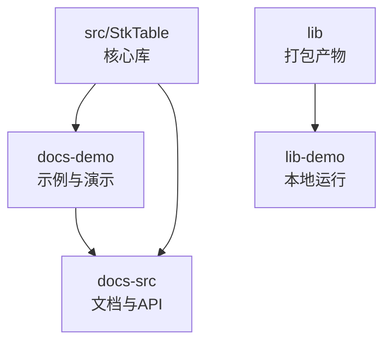
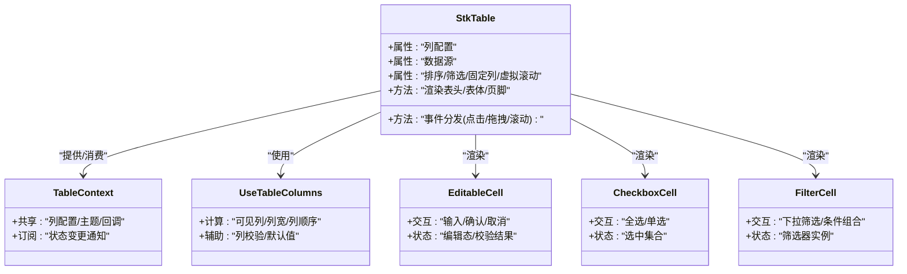
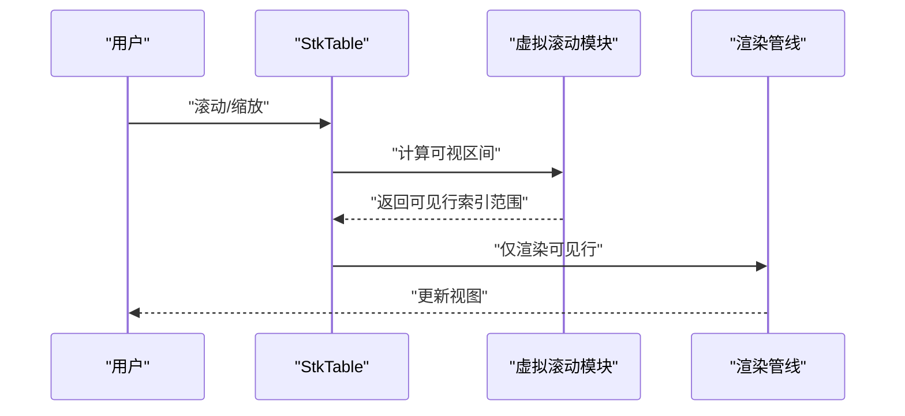
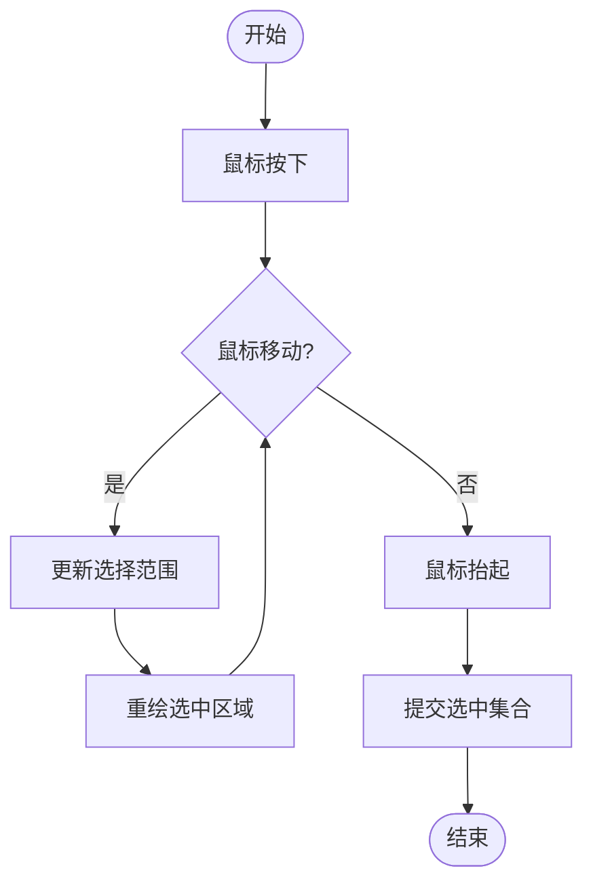
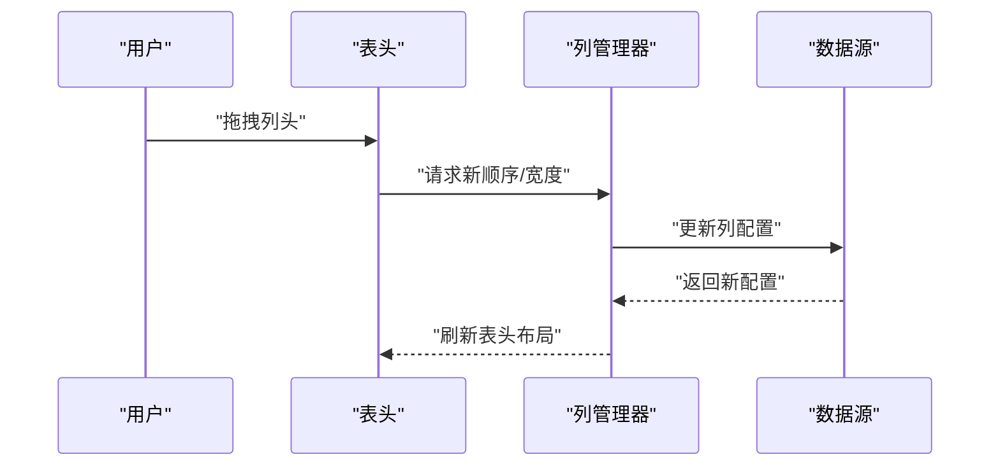
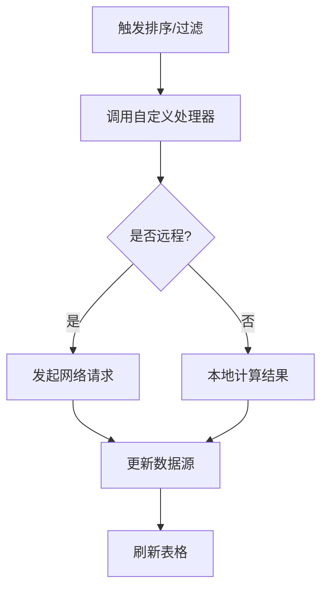
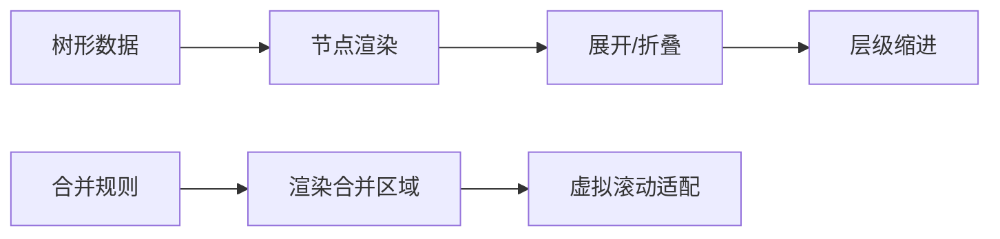
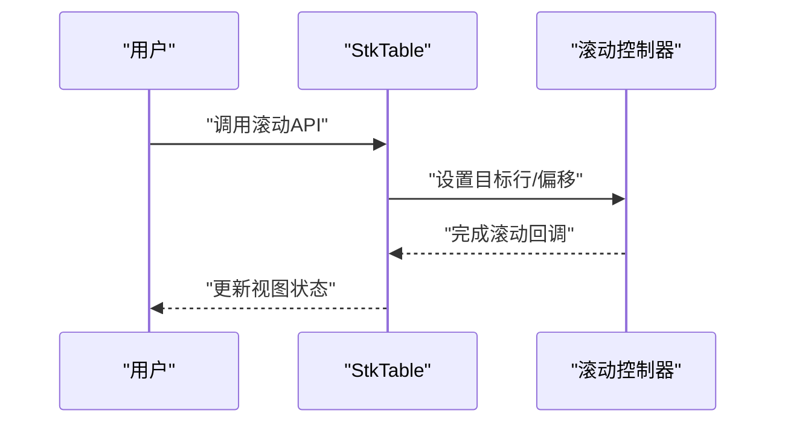
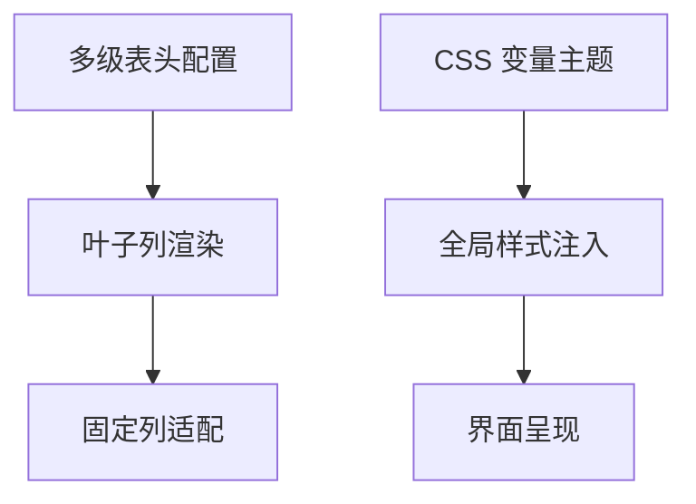
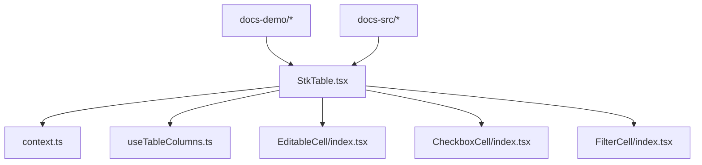

# 最佳实践

<cite>
**本文引用的文件**   
- [StkTable.tsx](file://src/StkTable/StkTable.tsx)
- [index.ts](file://src/StkTable/index.ts)
- [context.ts](file://src/StkTable/context.ts)
- [useTableColumns.ts](file://src/StkTable/hooks/useTableColumns.ts)
- [const.ts](file://src/StkTable/const.ts)
- [index.tsx](file://src/StkTable/components/index.tsx)
- [EditableCell/index.tsx](file://src/StkTable/custom-cells/EditableCell/index.tsx)
- [CheckboxCell/index.tsx](file://src/StkTable/custom-cells/CheckboxCell/index.tsx)
- [FilterCell/index.tsx](file://src/StkTable/custom-cells/FilterCell/index.tsx)
- [HugeData/index.tsx](file://docs-demo/demos/HugeData/index.tsx)
- [VirtualList/index.tsx](file://docs-demo/demos/VirtualList/index.tsx)
- [AutoHeightVirtual/index.tsx](file://docs-demo/advanced/auto-height-virtual/AutoHeightVirtual/index.tsx)
- [AreaSelection.tsx](file://docs-demo/advanced/area-selection/AreaSelection.tsx)
- [RowDrag.tsx](file://docs-demo/advanced/row-drag/RowDrag.tsx)
- [ColumnResizable.tsx](file://docs-demo/advanced/column-resize/ColResizable.tsx)
- [CustomSort/index.tsx](file://docs-demo/advanced/custom-sort/CustomSort/index.tsx)
- [Tree.tsx](file://docs-demo/basic/tree/Tree.tsx)
- [Fixed.tsx](file://docs-demo/basic/fixed/Fixed.tsx)
- [MultiHeader.tsx](file://docs-demo/basic/multi-header/MultiHeader.tsx)
- [MergeCellsRow.tsx](file://docs-demo/basic/merge-cells/MergeCellsRow.tsx)
- [ScrollRowByRow.tsx](file://docs-demo/basic/scroll-row-by-row/ScrollRowByRow.tsx)
- [theme/CssVarsDemo.tsx](file://docs-demo/basic/theme/CssVarsDemo.tsx)
- [api/table-props.md](file://docs-src/main/api/table-props.md)
- [api/stk-table-column.md](file://docs-src/main/api/stk-table-column.md)
- [other/tips.md](file://docs-src/main/other/tips.md)
- [other/qa.md](file://docs-src/main/other/qa.md)
- [other/experimental.md](file://docs-src/main/other/experimental.md)
- [demos/huge-data.md](file://docs-src/main/demos/huge-data.md)
- [demos/virtual-list.md](file://docs-src/main/demos/virtual-list.md)
- [StkTable.test.tsx](file://src/StkTable/test/StkTable.test.tsx)
</cite>

## 目录
1. [简介](#简介)
2. [项目结构](#项目结构)
3. [核心组件](#核心组件)
4. [架构总览](#架构总览)
5. [详细组件分析](#详细组件分析)
6. [依赖关系分析](#依赖关系分析)
7. [性能优化建议](#性能优化建议)
8. [问题排查指南](#问题排查指南)
9. [结论](#结论)
10. [附录](#附录)

## 简介
本章节聚焦于 StkTable 的最佳实践与经验分享，围绕大数据量处理、渲染优化、内存管理、可维护的表格应用架构设计、无障碍访问（a11y）实现与测试策略、跨浏览器兼容性与移动端适配等主题展开。文档以仓库中的示例与源码为依据，提供可落地的开发模式与排障方法，帮助构建高质量、高性能的表格应用。

## 项目结构
仓库采用“源码 + 演示 + 文档”的分层组织方式：
- src/StkTable：核心库源码，包含主组件、上下文、类型、工具、自定义单元格与基础样式。
- docs-demo：面向文档与演示的前端示例，覆盖高级特性（虚拟滚动、区域选择、拖拽、列宽调整、树形、合并单元格等）与基础用法。
- docs-src：VitePress 文档源，包含 API 说明、使用技巧、常见问题与多语言内容。
- lib/lib-demo：打包产物与本地运行入口。

图表来源
- [StkTable.tsx](file://src/StkTable/StkTable.tsx)
- [index.ts](file://src/StkTable/index.ts)
- [HugeData/index.tsx](file://docs-demo/demos/HugeData/index.tsx)
- [VirtualList/index.tsx](file://docs-demo/demos/VirtualList/index.tsx)

章节来源
- [StkTable.tsx](file://src/StkTable/StkTable.tsx)
- [index.ts](file://src/StkTable/index.ts)

## 核心组件
- 主组件 StkTable：对外暴露表格能力，包括列定义、数据绑定、排序、筛选、固定列、虚拟滚动、行展开、树形、合并单元格、分页/滚动控制等。
- 上下文 Context：在组件树中共享表格状态与行为（如列配置、事件回调、主题变量等）。
- 钩子 useTableColumns：用于规范化列配置、计算可见列、处理列顺序与宽度等。
- 自定义单元格：提供可编辑单元格、复选框单元格、筛选单元格等常用扩展点。

章节来源
- [StkTable.tsx](file://src/StkTable/StkTable.tsx)
- [context.ts](file://src/StkTable/context.ts)
- [useTableColumns.ts](file://src/StkTable/hooks/useTableColumns.ts)
- [EditableCell/index.tsx](file://src/StkTable/custom-cells/EditableCell/index.tsx)
- [CheckboxCell/index.tsx](file://src/StkTable/custom-cells/CheckboxCell/index.tsx)
- [FilterCell/index.tsx](file://src/StkTable/custom-cells/FilterCell/index.tsx)

## 架构总览
StkTable 采用“主组件 + 上下文 + 钩子 + 自定义单元格”的模块化架构。主组件负责编排与状态协调，上下文贯穿子树传递必要信息，钩子封装列相关逻辑，自定义单元格提供渲染扩展点。

图表来源
- [StkTable.tsx](file://src/StkTable/StkTable.tsx)
- [context.ts](file://src/StkTable/context.ts)
- [useTableColumns.ts](file://src/StkTable/hooks/useTableColumns.ts)
- [EditableCell/index.tsx](file://src/StkTable/custom-cells/EditableCell/index.tsx)
- [CheckboxCell/index.tsx](file://src/StkTable/custom-cells/CheckboxCell/index.tsx)
- [FilterCell/index.tsx](file://src/StkTable/custom-cells/FilterCell/index.tsx)

## 详细组件分析

### 大数据量与虚拟滚动
- 使用虚拟列表减少 DOM 节点数量，提升长列表渲染性能。
- 结合行高估算与自适应高度，避免频繁重排。
- 对固定列与横向虚拟滚动进行协同优化，确保滚动流畅。

图表来源
- [VirtualList/index.tsx](file://docs-demo/demos/VirtualList/index.tsx)
- [AutoHeightVirtual/index.tsx](file://docs-demo/advanced/auto-height-virtual/AutoHeightVirtual/index.tsx)
- [Fixed.tsx](file://docs-demo/basic/fixed/Fixed.tsx)

章节来源
- [HugeData/index.tsx](file://docs-demo/demos/HugeData/index.tsx)
- [VirtualList/index.tsx](file://docs-demo/demos/VirtualList/index.tsx)
- [AutoHeightVirtual/index.tsx](file://docs-demo/advanced/auto-height-virtual/AutoHeightVirtual/index.tsx)
- [Fixed.tsx](file://docs-demo/basic/fixed/Fixed.tsx)

### 区域选择与多选
- 支持鼠标拖拽区域选择，适合批量操作场景。
- 与复选框单元格联动，保持选中状态一致性。
- 注意边界情况（跨页、隐藏行、冻结列）下的选择范围计算。

图表来源
- [AreaSelection.tsx](file://docs-demo/advanced/area-selection/AreaSelection.tsx)
- [CheckboxCell/index.tsx](file://src/StkTable/custom-cells/CheckboxCell/index.tsx)

章节来源
- [AreaSelection.tsx](file://docs-demo/advanced/area-selection/AreaSelection.tsx)
- [CheckboxCell/index.tsx](file://src/StkTable/custom-cells/CheckboxCell/index.tsx)

### 行拖拽与列拖拽
- 行拖拽用于重排或分组，需处理插入位置与数据同步。
- 列拖拽用于调整列顺序与宽度，需考虑冻结列与多级表头的约束。

图表来源
- [RowDrag.tsx](file://docs-demo/advanced/row-drag/RowDrag.tsx)
- [ColumnResizable.tsx](file://docs-demo/advanced/column-resize/ColResizable.tsx)

章节来源
- [RowDrag.tsx](file://docs-demo/advanced/row-drag/RowDrag.tsx)
- [ColumnResizable.tsx](file://docs-demo/advanced/column-resize/ColResizable.tsx)

### 自定义排序与过滤
- 自定义排序：支持字段级比较函数、远程排序、空值处理。
- 自定义过滤：基于下拉面板与条件组合，支持多列联合筛选。

图表来源
- [CustomSort/index.tsx](file://docs-demo/advanced/custom-sort/CustomSort/index.tsx)
- [FilterCell/index.tsx](file://src/StkTable/custom-cells/FilterCell/index.tsx)

章节来源
- [CustomSort/index.tsx](file://docs-demo/advanced/custom-sort/CustomSort/index.tsx)
- [FilterCell/index.tsx](file://src/StkTable/custom-cells/FilterCell/index.tsx)

### 树形与合并单元格
- 树形表格：支持展开/折叠、层级缩进、虚拟滚动与固定列的组合。
- 合并单元格：按行或列维度合并，需注意虚拟滚动下的坐标计算与边界对齐。

图表来源
- [Tree.tsx](file://docs-demo/basic/tree/Tree.tsx)
- [MergeCellsRow.tsx](file://docs-demo/basic/merge-cells/MergeCellsRow.tsx)

章节来源
- [Tree.tsx](file://docs-demo/basic/tree/Tree.tsx)
- [MergeCellsRow.tsx](file://docs-demo/basic/merge-cells/MergeCellsRow.tsx)

### 固定列与滚动控制
- 固定列：左右冻结列，保证关键信息始终可见。
- 逐行滚动：通过 API 精确控制滚动位置，便于定位与动画过渡。

图表来源
- [Fixed.tsx](file://docs-demo/basic/fixed/Fixed.tsx)
- [ScrollRowByRow.tsx](file://docs-demo/basic/scroll-row-by-row/ScrollRowByRow.tsx)

章节来源
- [Fixed.tsx](file://docs-demo/basic/fixed/Fixed.tsx)
- [ScrollRowByRow.tsx](file://docs-demo/basic/scroll-row-by-row/ScrollRowByRow.tsx)

### 多级表头与主题
- 多级表头：支持复杂表头结构与叶子列固定。
- 主题：通过 CSS 变量统一风格，便于动态切换与深色模式。

图表来源
- [MultiHeader.tsx](file://docs-demo/basic/multi-header/MultiHeader.tsx)
- [CssVarsDemo.tsx](file://docs-demo/basic/theme/CssVarsDemo.tsx)

章节来源
- [MultiHeader.tsx](file://docs-demo/basic/multi-header/MultiHeader.tsx)
- [theme/CssVarsDemo.tsx](file://docs-demo/basic/theme/CssVarsDemo.tsx)

## 依赖关系分析
- 主组件依赖上下文与钩子，提供统一的渲染与事件分发。
- 自定义单元格作为扩展点，依赖上下文获取表格状态与回调。
- 示例与文档与源码解耦，便于独立演进与回归验证。

图表来源
- [StkTable.tsx](file://src/StkTable/StkTable.tsx)
- [context.ts](file://src/StkTable/context.ts)
- [useTableColumns.ts](file://src/StkTable/hooks/useTableColumns.ts)
- [EditableCell/index.tsx](file://src/StkTable/custom-cells/EditableCell/index.tsx)
- [CheckboxCell/index.tsx](file://src/StkTable/custom-cells/CheckboxCell/index.tsx)
- [FilterCell/index.tsx](file://src/StkTable/custom-cells/FilterCell/index.tsx)

章节来源
- [StkTable.tsx](file://src/StkTable/StkTable.tsx)
- [index.ts](file://src/StkTable/index.ts)

## 性能优化建议
- 大数据量处理
  - 启用虚拟滚动，限制同时渲染的行数，按需加载数据。
  - 对行高进行估算与缓存，减少测量开销；对自适应高度场景使用专用方案。
  - 对固定列与横向虚拟滚动进行协同优化，避免重复计算。
- 渲染优化
  - 使用稳定的 key，避免不必要的重渲染。
  - 将复杂单元格抽取为独立组件并做 memo 化，减少子树更新。
  - 对排序/筛选结果进行增量更新，避免全量重算。
- 内存管理
  - 及时释放拖拽/选择/滚动监听器，防止泄漏。
  - 大对象与中间结果使用弱引用或池化策略，降低峰值内存。
  - 在组件卸载时清理定时器与异步任务。
- 交互体验
  - 滚动与拖拽使用节流/防抖，降低高频事件压力。
  - 对远端排序/筛选进行去抖与并发控制，避免抖动与竞态。

章节来源
- [HugeData/index.tsx](file://docs-demo/demos/HugeData/index.tsx)
- [VirtualList/index.tsx](file://docs-demo/demos/VirtualList/index.tsx)
- [AutoHeightVirtual/index.tsx](file://docs-demo/advanced/auto-height-virtual/AutoHeightVirtual/index.tsx)
- [other/tips.md](file://docs-src/main/other/tips.md)

## 问题排查指南
- 常见错误与定位
  - 列宽异常：检查列配置与固定列冲突，确认多级表头与叶子列对齐。
  - 虚拟滚动错位：核对行高估算与自适应高度策略，关注合并单元格与展开行的影响。
  - 拖拽/选择失效：确认事件冒泡与捕获顺序，检查容器 overflow 与 z-index。
- 调试手段
  - 使用控制台日志与断点，观察列计算与渲染流程。
  - 借助开发者工具的性能面板，识别重排/重绘热点。
  - 针对特定场景编写最小复现用例，逐步隔离问题。
- 参考文档
  - 查阅 API 文档与常见问题解答，对照配置项差异。
  - 关注实验性特性说明，评估稳定性与兼容性风险。

章节来源
- [other/qa.md](file://docs-src/main/other/qa.md)
- [other/experimental.md](file://docs-src/main/other/experimental.md)
- [api/table-props.md](file://docs-src/main/api/table-props.md)
- [api/stk-table-column.md](file://docs-src/main/api/stk-table-column.md)

## 结论
通过合理的架构设计与性能优化策略，StkTable 能够支撑复杂业务场景下的高性能表格需求。建议在项目中优先采用虚拟滚动、稳定 key、组件拆分与 memo 化等手段，并结合上下文与钩子实现可扩展的表格能力。同时，重视无障碍访问与跨浏览器兼容性，完善测试策略，确保长期可维护性与用户体验。

## 附录
- 无障碍访问（a11y）建议
  - 为关键交互元素添加语义化标签与键盘导航支持。
  - 为屏幕阅读器提供必要的 aria 属性与提示文本。
  - 确保颜色对比度与焦点可见性符合标准。
- 测试策略
  - 单元测试：覆盖列计算、排序/筛选逻辑与自定义单元格交互。
  - 集成测试：模拟用户操作（滚动、拖拽、选择），验证状态与视图一致性。
  - 视觉回归：对复杂布局与主题切换进行截图比对。
- 跨浏览器与移动端适配
  - 针对滚动与触摸事件做兼容处理，必要时引入 polyfill。
  - 在小屏设备上优化列展示与交互密度，提供横向滚动与列隐藏策略。
  - 使用 CSS 变量与响应式布局，简化多端适配成本。

章节来源
- [StkTable.test.tsx](file://src/StkTable/test/StkTable.test.tsx)
- [demos/huge-data.md](file://docs-src/main/demos/huge-data.md)
- [demos/virtual-list.md](file://docs-src/main/demos/virtual-list.md)