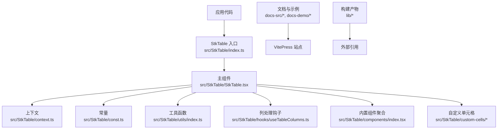
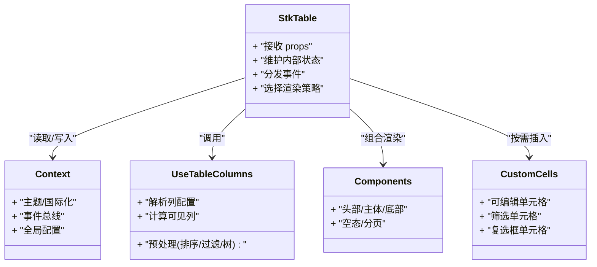
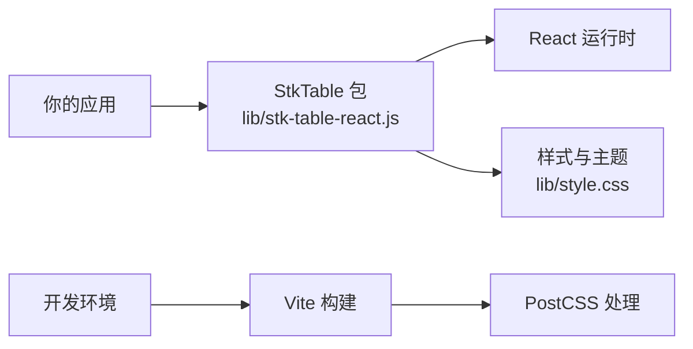

# 问题排查与故障排除

<cite>
**本文引用的文件**
- [README.md](file://README.md)
- [package.json](file://package.json)
- [vite.config.ts](file://vite.config.ts)
- [postcss.config.js](file://postcss.config.js)
- [src/StkTable/index.ts](file://src/StkTable/index.ts)
- [src/StkTable/StkTable.tsx](file://src/StkTable/StkTable.tsx)
- [src/StkTable/context.ts](file://src/StkTable/context.ts)
- [src/StkTable/const.ts](file://src/StkTable/const.ts)
- [src/StkTable/hooks/useTableColumns.ts](file://src/StkTable/hooks/useTableColumns.ts)
- [src/StkTable/utils/index.ts](file://src/StkTable/utils/index.ts)
- [src/StkTable/components/index.tsx](file://src/StkTable/components/index.tsx)
- [src/StkTable/custom-cells/EditableCell/index.tsx](file://src/StkTable/custom-cells/EditableCell/index.tsx)
- [src/StkTable/custom-cells/FilterCell/index.tsx](file://src/StkTable/custom-cells/FilterCell/index.tsx)
- [src/StkTable/custom-cells/FilterCell/Dropdown.tsx](file://src/StkTable/custom-cells/FilterCell/Dropdown.tsx)
- [lib/stk-table-react.js](file://lib/stk-table-react.js)
- [lib/style.css](file://lib/style.css)
- [docs-src/main/table/basic/fixed.md](file://docs-src/main/table/basic/fixed.md)
- [docs-src/main/table/basic/size.md](file://docs-src/main/table/basic/size.md)
- [docs-src/main/table/basic/scrollbar.md](file://docs-src/main/table/basic/scrollbar.md)
- [docs-src/main/table/advanced/virtual.md](file://docs-src/main/table/advanced/virtual.md)
- [docs-src/main/table/advanced/auto-height-virtual.md](file://docs-src/main/table/advanced/auto-height-virtual.md)
- [docs-src/main/table/advanced/column-resize.md](file://docs-src/main/table/advanced/column-resize.md)
- [docs-src/main/table/advanced/header-drag.md](file://docs-src/main/table/advanced/header-drag.md)
- [docs-src/main/table/advanced/row-drag.md](file://docs-src/main/table/advanced/row-drag.md)
- [docs-src/main/table/advanced/highlight.md](file://docs-src/main/table/advanced/highlight.md)
- [docs-src/main/table/advanced/custom-cell.md](file://docs-src/main/table/advanced/custom-cell.md)
- [docs-src/main/table/advanced/custom-cells/editable-cell.md](file://docs-src/main/table/advanced/custom-cells/editable-cell.md)
- [docs-src/main/table/advanced/custom-cells/filter-cell.md](file://docs-src/main/table/advanced/custom-cells/filter-cell.md)
- [docs-src/main/table/basic/empty.md](file://docs-src/main/table/basic/empty.md)
- [docs-src/main/table/basic/expand-row.md](file://docs-src/main/table/basic/expand-row.md)
- [docs-src/main/table/basic/footer.md](file://docs-src/main/table/basic/footer.md)
- [docs-src/main/table/basic/multi-header.md](file://docs-src/main/table/basic/multi-header.md)
- [docs-src/main/table/basic/merge-cells.md](file://docs-src/main/table/basic/merge-cells.md)
- [docs-src/main/table/basic/row-height.md](file://docs-src/main/table/basic/row-height.md)
- [docs-src/main/table/basic/seq.md](file://docs-src/main/table/basic/seq.md)
- [docs-src/main/table/basic/sort.md](file://docs-src/main/table/basic/sort.md)
- [docs-src/main/table/basic/tree.md](file://docs-src/main/table/basic/tree.md)
- [docs-src/main/api/table-props.md](file://docs-src/main/api/table-props.md)
- [docs-src/main/api/emits.md](file://docs-src/main/api/emits.md)
- [docs-src/main/api/expose.md](file://docs-src/main/api/expose.md)
- [docs-src/main/api/slots.md](file://docs-src/main/api/slots.md)
- [docs-src/main/other/tips.md](file://docs-src/main/other/tips.md)
- [docs-src/main/other/experimental.md](file://docs-src/main/other/experimental.md)
- [docs-src/main/other/change.md](file://docs-src/main/other/change.md)
</cite>

## 目录
1. [简介](#简介)
2. [项目结构](#项目结构)
3. [核心组件](#核心组件)
4. [架构总览](#架构总览)
5. [详细组件分析](#详细组件分析)
6. [依赖分析](#依赖分析)
7. [性能注意事项](#性能注意事项)
8. [故障排除指南](#故障排除指南)
9. [结论](#结论)
10. [附录](#附录)

## 简介
本指南面向使用 StkTable 的开发者，聚焦常见问题定位与解决。内容覆盖安装配置、API 使用、样式冲突、浏览器兼容、虚拟滚动、固定列/行、拖拽、筛选/编辑单元格等典型场景；并提供系统化的诊断方法、调试技巧、错误日志分析、性能瓶颈定位与内存泄漏检测建议，以及按主题分类的问题索引，帮助快速定位并解决问题。

## 项目结构
仓库采用“源码 + 文档 + 示例 + 构建产物”的组织方式：
- src/StkTable：StkTable 组件源码（入口、上下文、常量、工具、自定义单元格、钩子、组件聚合）
- docs-src：VitePress 文档站点（含 API、基础用法、高级特性、其他说明）
- docs-demo：文档站点的演示实现
- lib：打包产物（JS/CSS/类型声明）
- 根级配置文件：package.json、vite.config.ts、postcss.config.js 等

图表来源
- [src/StkTable/index.ts](file://src/StkTable/index.ts)
- [src/StkTable/StkTable.tsx](file://src/StkTable/StkTable.tsx)
- [src/StkTable/context.ts](file://src/StkTable/context.ts)
- [src/StkTable/const.ts](file://src/StkTable/const.ts)
- [src/StkTable/utils/index.ts](file://src/StkTable/utils/index.ts)
- [src/StkTable/hooks/useTableColumns.ts](file://src/StkTable/hooks/useTableColumns.ts)
- [src/StkTable/components/index.tsx](file://src/StkTable/components/index.tsx)
- [src/StkTable/custom-cells/EditableCell/index.tsx](file://src/StkTable/custom-cells/EditableCell/index.tsx)
- [src/StkTable/custom-cells/FilterCell/index.tsx](file://src/StkTable/custom-cells/FilterCell/index.tsx)

章节来源
- [README.md](file://README.md)
- [package.json](file://package.json)
- [vite.config.ts](file://vite.config.ts)
- [postcss.config.js](file://postcss.config.js)

## 核心组件
- 入口导出：统一对外暴露 StkTable 及其相关类型与常量，便于按需引入。
- 主组件：负责表格布局、事件分发、状态管理、渲染策略选择（如虚拟滚动、固定列/行）。
- 上下文：提供跨层级共享的状态与能力（如主题、国际化、事件总线等）。
- 常量：定义默认值、类名前缀、尺寸阈值等。
- 工具函数：通用计算、格式化、校验、兼容性判断等。
- 列处理钩子：解析列配置、生成可见列、计算宽度、排序/过滤/树形展开等预处理。
- 内置组件聚合：将头部、主体、底部、分页、空态等区域组合渲染。
- 自定义单元格：可插拔的单元格扩展点（如可编辑、筛选、复选框等）。

章节来源
- [src/StkTable/index.ts](file://src/StkTable/index.ts)
- [src/StkTable/StkTable.tsx](file://src/StkTable/StkTable.tsx)
- [src/StkTable/context.ts](file://src/StkTable/context.ts)
- [src/StkTable/const.ts](file://src/StkTable/const.ts)
- [src/StkTable/utils/index.ts](file://src/StkTable/utils/index.ts)
- [src/StkTable/hooks/useTableColumns.ts](file://src/StkTable/hooks/useTableColumns.ts)
- [src/StkTable/components/index.tsx](file://src/StkTable/components/index.tsx)

## 架构总览
StkTable 采用“主组件 + 上下文 + 钩子 + 插件化单元格”的架构。主组件协调各模块，通过上下文传递全局能力，利用钩子对列进行预处理，最终由内置或自定义单元格完成渲染。

图表来源
- [src/StkTable/StkTable.tsx](file://src/StkTable/StkTable.tsx)
- [src/StkTable/context.ts](file://src/StkTable/context.ts)
- [src/StkTable/hooks/useTableColumns.ts](file://src/StkTable/hooks/useTableColumns.ts)
- [src/StkTable/components/index.tsx](file://src/StkTable/components/index.tsx)
- [src/StkTable/custom-cells/EditableCell/index.tsx](file://src/StkTable/custom-cells/EditableCell/index.tsx)
- [src/StkTable/custom-cells/FilterCell/index.tsx](file://src/StkTable/custom-cells/FilterCell/index.tsx)

## 详细组件分析

### 主组件 StkTable
- 职责：整合列配置、数据源、交互行为（排序、筛选、多选、拖拽）、布局（固定列/行、虚拟滚动）、主题与国际化。
- 关键流程：
  - 初始化：合并默认配置、解析列、建立上下文。
  - 更新：响应 props 变化，重新计算可见列与布局。
  - 事件：向上抛出变更事件，向下注入能力到子组件。
  - 渲染：根据策略选择虚拟/非虚拟、是否固定、是否树形等。
- 常见问题：
  - 列宽异常：检查列配置、容器宽度、是否启用自适应。
  - 固定列错位：确认父容器 overflow、z-index、滚动容器层级。
  - 虚拟滚动抖动：核对行高稳定性、数据 key、窗口尺寸监听。
  - 事件冒泡冲突：在自定义单元格中阻止冒泡或调整捕获阶段。

章节来源
- [src/StkTable/StkTable.tsx](file://src/StkTable/StkTable.tsx)
- [src/StkTable/context.ts](file://src/StkTable/context.ts)
- [src/StkTable/hooks/useTableColumns.ts](file://src/StkTable/hooks/useTableColumns.ts)
- [src/StkTable/const.ts](file://src/StkTable/const.ts)

### 列处理钩子 useTableColumns
- 职责：解析 columns 配置，生成可见列、计算列宽、处理多级表头、树形节点、排序字段映射等。
- 关键点：
  - 列有效性校验与去重。
  - 多表头扁平化与叶子列识别。
  - 树形展开键集合与层级计算。
  - 排序/过滤字段映射与缓存。
- 常见问题：
  - 列不显示：检查 dataIndex/key 与数据字段一致性。
  - 排序无效：确认 sortField 与数据字段匹配、排序回调是否正确触发。
  - 树形错乱：确保唯一 key、父子关系正确、默认展开配置合理。

章节来源
- [src/StkTable/hooks/useTableColumns.ts](file://src/StkTable/hooks/useTableColumns.ts)

### 自定义单元格：可编辑单元格 EditableCell
- 职责：提供单元格内联编辑能力，支持输入、失焦保存、键盘导航等。
- 关键点：
  - 受控/非受控模式切换。
  - 输入校验与回滚机制。
  - 与表格事件系统的集成（如 onChange、onBlur）。
- 常见问题：
  - 编辑后未更新：检查数据不可变更新、key 稳定、事件回调是否被调用。
  - 焦点丢失：避免外层点击冒泡导致失焦。
  - 样式覆盖：注意单元格容器高度与行高一致。

章节来源
- [src/StkTable/custom-cells/EditableCell/index.tsx](file://src/StkTable/custom-cells/EditableCell/index.tsx)

### 自定义单元格：筛选单元格 FilterCell 与下拉 Dropdown
- 职责：提供列级筛选 UI 与逻辑，支持单选/多选、搜索、清空等。
- 关键点：
  - 筛选条件与数据源的联动。
  - 下拉面板定位与溢出处理。
  - 与表格过滤状态同步。
- 常见问题：
  - 筛选不生效：确认 filterFn 与数据字段匹配、筛选值类型一致。
  - 下拉遮挡：检查 z-index、滚动容器、定位策略。
  - 性能问题：大数据量时考虑延迟加载与防抖。

章节来源
- [src/StkTable/custom-cells/FilterCell/index.tsx](file://src/StkTable/custom-cells/FilterCell/index.tsx)
- [src/StkTable/custom-cells/FilterCell/Dropdown.tsx](file://src/StkTable/custom-cells/FilterCell/Dropdown.tsx)

### 组件聚合 Components
- 职责：组合头部、主体、底部、空态、分页等区域，统一处理滚动、对齐、占位等。
- 常见问题：
  - 滚动条样式不一致：参考滚动条文档与样式覆盖方案。
  - 空态展示异常：检查数据为空时的插槽与文案配置。
  - 页脚/多表头错位：确认层级与宽度计算。

章节来源
- [src/StkTable/components/index.tsx](file://src/StkTable/components/index.tsx)

## 依赖分析
- 运行时依赖：React 生态（hooks、事件、DOM），CSS 样式与主题变量。
- 构建依赖：Vite、PostCSS、TypeScript 等。
- 产物：lib 目录下的 JS/CSS/类型声明供外部引用。

图表来源
- [lib/stk-table-react.js](file://lib/stk-table-react.js)
- [lib/style.css](file://lib/style.css)
- [vite.config.ts](file://vite.config.ts)
- [postcss.config.js](file://postcss.config.js)

章节来源
- [package.json](file://package.json)
- [vite.config.ts](file://vite.config.ts)
- [postcss.config.js](file://postcss.config.js)
- [lib/stk-table-react.js](file://lib/stk-table-react.js)
- [lib/style.css](file://lib/style.css)

## 性能注意事项
- 大数据渲染：优先开启虚拟滚动，设置稳定的行高与 key，避免频繁重排。
- 列宽计算：尽量提供固定列宽或合理的 min/max，减少动态计算开销。
- 事件节流：筛选、搜索、拖拽等操作建议加入防抖/节流。
- 渲染优化：拆分大组件、使用 memo、避免不必要的 re-render。
- 内存管理：及时清理监听器、定时器、第三方库实例，避免闭包持有大对象。

[本节为通用指导，无需具体文件来源]

## 故障排除指南

### 一、安装与配置问题
- 症状：组件无法渲染、样式缺失、控制台报错。
- 排查步骤：
  - 确认已安装依赖与版本兼容。
  - 检查构建配置（Vite/PostCSS）是否正确处理 CSS 与资源。
  - 验证入口导入路径与命名导出。
  - 查看 lib 产物是否完整（JS/CSS/类型）。
- 常见原因：
  - 缺少样式引入或样式未被打包。
  - 构建工具未正确解析 CSS 变量或 Less。
  - 包版本不匹配（React 版本、TS 版本）。
- 参考文档：
  - [docs-src/main/other/tips.md](file://docs-src/main/other/tips.md)
  - [docs-src/main/other/experimental.md](file://docs-src/main/other/experimental.md)

章节来源
- [package.json](file://package.json)
- [vite.config.ts](file://vite.config.ts)
- [postcss.config.js](file://postcss.config.js)
- [lib/stk-table-react.js](file://lib/stk-table-react.js)
- [lib/style.css](file://lib/style.css)
- [docs-src/main/other/tips.md](file://docs-src/main/other/tips.md)
- [docs-src/main/other/experimental.md](file://docs-src/main/other/experimental.md)

### 二、API 使用错误
- 症状：列不显示、排序/筛选无效、事件未触发、属性报错。
- 排查步骤：
  - 对照 API 文档逐项核对 props、emits、slots、expose。
  - 检查列配置中的 key/dataIndex 是否与数据字段一致。
  - 确认事件回调签名与参数顺序。
  - 使用 expose 的方法时，确保 ref 指向正确且生命周期可用。
- 参考文档：
  - [docs-src/main/api/table-props.md](file://docs-src/main/api/table-props.md)
  - [docs-src/main/api/emits.md](file://docs-src/main/api/emits.md)
  - [docs-src/main/api/slots.md](file://docs-src/main/api/slots.md)
  - [docs-src/main/api/expose.md](file://docs-src/main/api/expose.md)

章节来源
- [docs-src/main/api/table-props.md](file://docs-src/main/api/table-props.md)
- [docs-src/main/api/emits.md](file://docs-src/main/api/emits.md)
- [docs-src/main/api/slots.md](file://docs-src/main/api/slots.md)
- [docs-src/main/api/expose.md](file://docs-src/main/api/expose.md)

### 三、样式冲突与主题问题
- 症状：边框/背景/字体/滚动条样式异常、主题变量不生效。
- 排查步骤：
  - 检查全局样式是否覆盖了表格类名前缀。
  - 确认样式引入顺序与优先级。
  - 使用浏览器开发者工具定位实际生效的样式规则。
  - 参考滚动条与主题文档进行覆盖。
- 参考文档：
  - [docs-src/main/table/basic/scrollbar.md](file://docs-src/main/table/basic/scrollbar.md)
  - [docs-src/main/table/basic/theme.md](file://docs-src/main/table/basic/theme.md)

章节来源
- [lib/style.css](file://lib/style.css)
- [docs-src/main/table/basic/scrollbar.md](file://docs-src/main/table/basic/scrollbar.md)
- [docs-src/main/table/basic/theme.md](file://docs-src/main/table/basic/theme.md)

### 四、布局与尺寸问题
- 症状：表格溢出、列宽错乱、行高不一致、固定列错位。
- 排查步骤：
  - 检查父容器尺寸与 overflow 设置。
  - 确认是否启用自适应宽度与最小/最大列宽。
  - 核对行高配置与内容高度是否匹配。
  - 固定列需确保滚动容器层级与 z-index 正确。
- 参考文档：
  - [docs-src/main/table/basic/size.md](file://docs-src/main/table/basic/size.md)
  - [docs-src/main/table/basic/fixed.md](file://docs-src/main/table/basic/fixed.md)
  - [docs-src/main/table/basic/row-height.md](file://docs-src/main/table/basic/row-height.md)

章节来源
- [docs-src/main/table/basic/size.md](file://docs-src/main/table/basic/size.md)
- [docs-src/main/table/basic/fixed.md](file://docs-src/main/table/basic/fixed.md)
- [docs-src/main/table/basic/row-height.md](file://docs-src/main/table/basic/row-height.md)

### 五、虚拟滚动与自动高度
- 症状：滚动卡顿、行高抖动、自动高度不准确。
- 排查步骤：
  - 确认行高稳定或提供预估行高。
  - 检查数据 key 的唯一性与稳定性。
  - 避免在虚拟区域内进行复杂 DOM 操作。
  - 自动高度模式下，关注内容变化与测量时机。
- 参考文档：
  - [docs-src/main/table/advanced/virtual.md](file://docs-src/main/table/advanced/virtual.md)
  - [docs-src/main/table/advanced/auto-height-virtual.md](file://docs-src/main/table/advanced/auto-height-virtual.md)

章节来源
- [docs-src/main/table/advanced/virtual.md](file://docs-src/main/table/advanced/virtual.md)
- [docs-src/main/table/advanced/auto-height-virtual.md](file://docs-src/main/table/advanced/auto-height-virtual.md)

### 六、列宽调整与拖拽
- 症状：列宽调整后错位、拖拽无响应、拖拽目标错误。
- 排查步骤：
  - 检查列宽约束（min/max）与初始宽度。
  - 确认拖拽事件未被外层元素拦截。
  - 核对拖拽容器的 overflow 与 pointer-events。
- 参考文档：
  - [docs-src/main/table/advanced/column-resize.md](file://docs-src/main/table/advanced/column-resize.md)
  - [docs-src/main/table/advanced/header-drag.md](file://docs-src/main/table/advanced/header-drag.md)
  - [docs-src/main/table/advanced/row-drag.md](file://docs-src/main/table/advanced/row-drag.md)

章节来源
- [docs-src/main/table/advanced/column-resize.md](file://docs-src/main/table/advanced/column-resize.md)
- [docs-src/main/table/advanced/header-drag.md](file://docs-src/main/table/advanced/header-drag.md)
- [docs-src/main/table/advanced/row-drag.md](file://docs-src/main/table/advanced/row-drag.md)

### 七、高亮与自定义单元格
- 症状：高亮位置偏移、自定义单元格渲染异常、交互失效。
- 排查步骤：
  - 检查高亮坐标计算与滚动偏移。
  - 自定义单元格需遵循表格事件约定与受控模式。
  - 避免在单元格内创建不稳定引用导致重复渲染。
- 参考文档：
  - [docs-src/main/table/advanced/highlight.md](file://docs-src/main/table/advanced/highlight.md)
  - [docs-src/main/table/advanced/custom-cell.md](file://docs-src/main/table/advanced/custom-cell.md)
  - [docs-src/main/table/advanced/custom-cells/editable-cell.md](file://docs-src/main/table/advanced/custom-cells/editable-cell.md)
  - [docs-src/main/table/advanced/custom-cells/filter-cell.md](file://docs-src/main/table/advanced/custom-cells/filter-cell.md)

章节来源
- [docs-src/main/table/advanced/highlight.md](file://docs-src/main/table/advanced/highlight.md)
- [docs-src/main/table/advanced/custom-cell.md](file://docs-src/main/table/advanced/custom-cell.md)
- [docs-src/main/table/advanced/custom-cells/editable-cell.md](file://docs-src/main/table/advanced/custom-cells/editable-cell.md)
- [docs-src/main/table/advanced/custom-cells/filter-cell.md](file://docs-src/main/table/advanced/custom-cells/filter-cell.md)

### 八、基础功能问题（空态、展开、页脚、多表头、合并、序列号、排序、树）
- 症状：空态不显示、展开行错位、页脚不渲染、多表头错位、合并单元格异常、序列号不正确、排序无效、树形错乱。
- 排查步骤：
  - 空态：确认数据为空时的插槽与文案配置。
  - 展开行：检查展开键与数据层级。
  - 页脚：确认 footer 数据与列映射。
  - 多表头：检查层级结构与叶子列。
  - 合并：核对合并范围与行列索引。
  - 序列号：确认起始索引与分页联动。
  - 排序：确认 sortField 与数据字段、排序回调。
  - 树：确保唯一 key、父子关系、默认展开配置。
- 参考文档：
  - [docs-src/main/table/basic/empty.md](file://docs-src/main/table/basic/empty.md)
  - [docs-src/main/table/basic/expand-row.md](file://docs-src/main/table/basic/expand-row.md)
  - [docs-src/main/table/basic/footer.md](file://docs-src/main/table/basic/footer.md)
  - [docs-src/main/table/basic/multi-header.md](file://docs-src/main/table/basic/multi-header.md)
  - [docs-src/main/table/basic/merge-cells.md](file://docs-src/main/table/basic/merge-cells.md)
  - [docs-src/main/table/basic/seq.md](file://docs-src/main/table/basic/seq.md)
  - [docs-src/main/table/basic/sort.md](file://docs-src/main/table/basic/sort.md)
  - [docs-src/main/table/basic/tree.md](file://docs-src/main/table/basic/tree.md)

章节来源
- [docs-src/main/table/basic/empty.md](file://docs-src/main/table/basic/empty.md)
- [docs-src/main/table/basic/expand-row.md](file://docs-src/main/table/basic/expand-row.md)
- [docs-src/main/table/basic/footer.md](file://docs-src/main/table/basic/footer.md)
- [docs-src/main/table/basic/multi-header.md](file://docs-src/main/table/basic/multi-header.md)
- [docs-src/main/table/basic/merge-cells.md](file://docs-src/main/table/basic/merge-cells.md)
- [docs-src/main/table/basic/seq.md](file://docs-src/main/table/basic/seq.md)
- [docs-src/main/table/basic/sort.md](file://docs-src/main/table/basic/sort.md)
- [docs-src/main/table/basic/tree.md](file://docs-src/main/table/basic/tree.md)

### 九、浏览器兼容性问题
- 症状：某些浏览器下样式异常、事件不触发、滚动行为不一致。
- 排查步骤：
  - 使用浏览器兼容性矩阵核对特性支持。
  - 针对特定浏览器添加 polyfill 或降级方案。
  - 检查 CSS 变量、Flex/Grid、Pointer Events 的支持情况。
- 参考文档：
  - [docs-src/main/other/tips.md](file://docs-src/main/other/tips.md)

章节来源
- [docs-src/main/other/tips.md](file://docs-src/main/other/tips.md)

### 十、错误日志分析与调试技巧
- 日志收集：
  - 在关键分支打印结构化日志（包含时间戳、用户动作、数据快照摘要）。
  - 区分 warn/error 级别，避免污染控制台。
- 断点调试：
  - 在列处理钩子、事件回调、渲染前后设置断点。
  - 观察 props/state 变化与 diff 结果。
- 性能分析：
  - 使用性能面板记录长任务、重排重绘热点。
  - 监控内存增长，定位潜在泄漏（监听器、定时器、闭包）。
- 回归测试：
  - 为关键交互编写用例，确保修复不引入新问题。

[本节为通用指导，无需具体文件来源]

### 十一、问题分类索引
- 安装与配置
  - 依赖版本、构建配置、样式引入
  - 参考：[docs-src/main/other/tips.md](file://docs-src/main/other/tips.md)、[docs-src/main/other/experimental.md](file://docs-src/main/other/experimental.md)
- API 使用
  - props/emits/slots/expose 核对
  - 参考：[docs-src/main/api/table-props.md](file://docs-src/main/api/table-props.md)、[docs-src/main/api/emits.md](file://docs-src/main/api/emits.md)、[docs-src/main/api/slots.md](file://docs-src/main/api/slots.md)、[docs-src/main/api/expose.md](file://docs-src/main/api/expose.md)
- 样式与主题
  - 覆盖策略、滚动条样式、主题变量
  - 参考：[docs-src/main/table/basic/scrollbar.md](file://docs-src/main/table/basic/scrollbar.md)、[docs-src/main/table/basic/theme.md](file://docs-src/main/table/basic/theme.md)
- 布局与尺寸
  - 容器尺寸、列宽、行高、固定列
  - 参考：[docs-src/main/table/basic/size.md](file://docs-src/main/table/basic/size.md)、[docs-src/main/table/basic/fixed.md](file://docs-src/main/table/basic/fixed.md)、[docs-src/main/table/basic/row-height.md](file://docs-src/main/table/basic/row-height.md)
- 虚拟滚动与自动高度
  - 行高稳定、key 唯一、测量时机
  - 参考：[docs-src/main/table/advanced/virtual.md](file://docs-src/main/table/advanced/virtual.md)、[docs-src/main/table/advanced/auto-height-virtual.md](file://docs-src/main/table/advanced/auto-height-virtual.md)
- 列宽调整与拖拽
  - 列宽约束、事件拦截、指针事件
  - 参考：[docs-src/main/table/advanced/column-resize.md](file://docs-src/main/table/advanced/column-resize.md)、[docs-src/main/table/advanced/header-drag.md](file://docs-src/main/table/advanced/header-drag.md)、[docs-src/main/table/advanced/row-drag.md](file://docs-src/main/table/advanced/row-drag.md)
- 高亮与自定义单元格
  - 高亮坐标、受控模式、事件约定
  - 参考：[docs-src/main/table/advanced/highlight.md](file://docs-src/main/table/advanced/highlight.md)、[docs-src/main/table/advanced/custom-cell.md](file://docs-src/main/table/advanced/custom-cell.md)、[docs-src/main/table/advanced/custom-cells/editable-cell.md](file://docs-src/main/table/advanced/custom-cells/editable-cell.md)、[docs-src/main/table/advanced/custom-cells/filter-cell.md](file://docs-src/main/table/advanced/custom-cells/filter-cell.md)
- 基础功能
  - 空态、展开、页脚、多表头、合并、序列号、排序、树
  - 参考：[docs-src/main/table/basic/empty.md](file://docs-src/main/table/basic/empty.md)、[docs-src/main/table/basic/expand-row.md](file://docs-src/main/table/basic/expand-row.md)、[docs-src/main/table/basic/footer.md](file://docs-src/main/table/basic/footer.md)、[docs-src/main/table/basic/multi-header.md](file://docs-src/main/table/basic/multi-header.md)、[docs-src/main/table/basic/merge-cells.md](file://docs-src/main/table/basic/merge-cells.md)、[docs-src/main/table/basic/seq.md](file://docs-src/main/table/basic/seq.md)、[docs-src/main/table/basic/sort.md](file://docs-src/main/table/basic/sort.md)、[docs-src/main/table/basic/tree.md](file://docs-src/main/table/basic/tree.md)
- 浏览器兼容
  - 特性支持、polyfill、降级方案
  - 参考：[docs-src/main/other/tips.md](file://docs-src/main/other/tips.md)
- 变更与迁移
  - 版本差异、破坏性变更、升级指引
  - 参考：[docs-src/main/other/change.md](file://docs-src/main/other/change.md)

## 结论
通过系统化地梳理安装配置、API 使用、样式与布局、虚拟滚动、拖拽、筛选/编辑、基础功能与兼容性等常见问题，并结合日志与性能分析手段，能够快速定位并解决 StkTable 在实际项目中的各类问题。建议在日常开发中遵循最佳实践，完善测试与监控，降低问题发生概率与影响面。

## 附录
- 常用调试清单：
  - 打开浏览器开发者工具，检查网络请求、控制台错误、样式计算。
  - 使用性能面板录制交互过程，定位长任务与内存峰值。
  - 在关键钩子与事件处增加日志输出，记录输入输出与中间状态。
- 参考文档索引：
  - 基础与高级特性文档位于 docs-src/main/table 目录下，API 文档位于 docs-src/main/api 目录下，其他说明位于 docs-src/main/other 目录下。