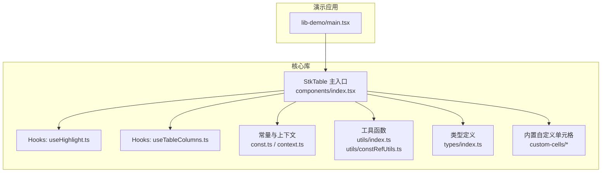
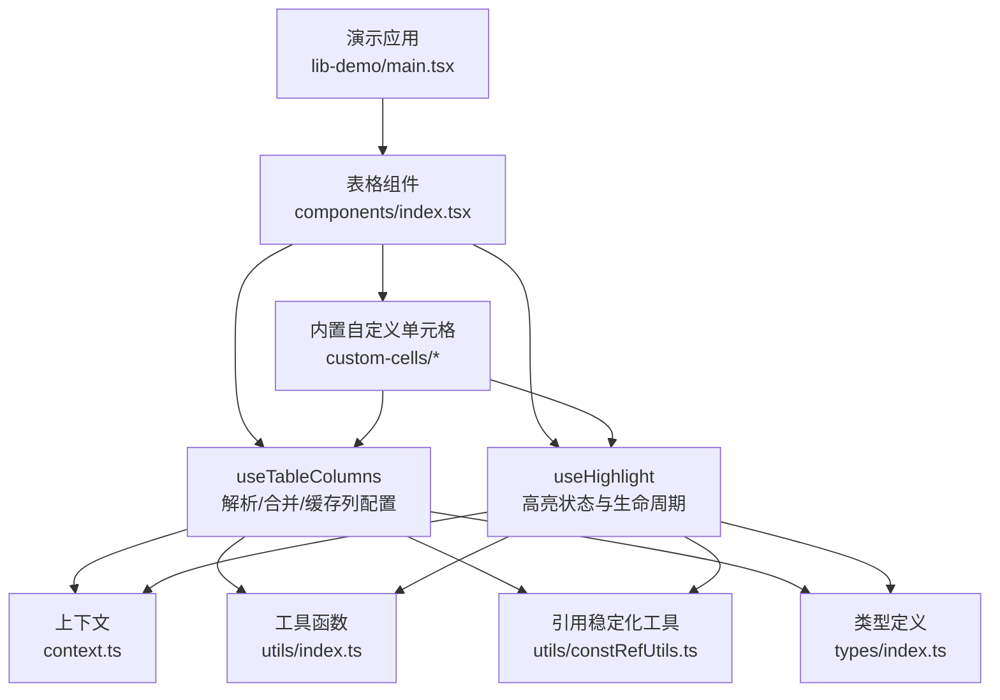
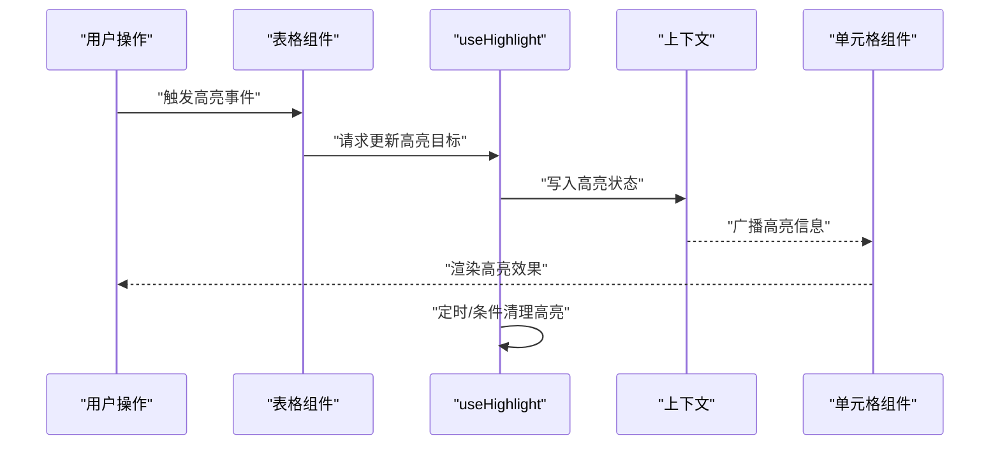
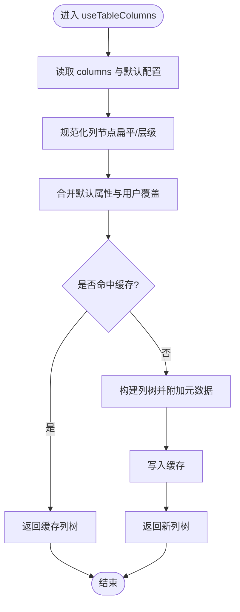
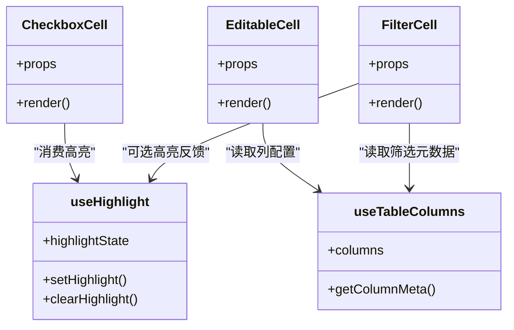
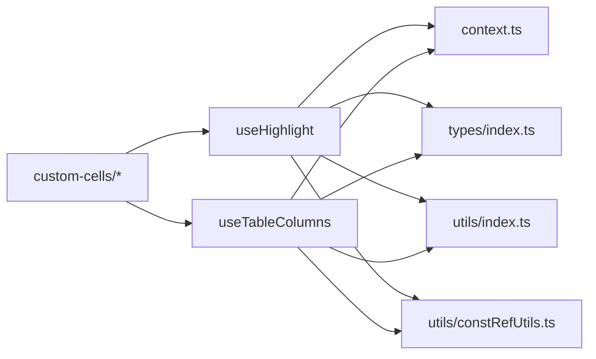

# Hooks架构

<cite>
**本文引用的文件**   
- [src/StkTable/hooks/useHighlight.ts](file://src/StkTable/hooks/useHighlight.ts)
- [src/StkTable/hooks/useTableColumns.ts](file://src/StkTable/hooks/useTableColumns.ts)
- [src/StkTable/const.ts](file://src/StkTable/const.ts)
- [src/StkTable/context.ts](file://src/StkTable/context.ts)
- [src/StkTable/utils/index.ts](file://src/StkTable/utils/index.ts)
- [src/StkTable/utils/constRefUtils.ts](file://src/StkTable/utils/constRefUtils.ts)
- [src/StkTable/types/index.ts](file://src/StkTable/types/index.ts)
- [src/StkTable/components/index.tsx](file://src/StkTable/components/index.tsx)
- [src/StkTable/custom-cells/CheckboxCell/index.tsx](file://src/StkTable/custom-cells/CheckboxCell/index.tsx)
- [src/StkTable/custom-cells/EditableCell/index.tsx](file://src/StkTable/custom-cells/EditableCell/index.tsx)
- [src/StkTable/custom-cells/FilterCell/index.tsx](file://src/StkTable/custom-cells/FilterCell/index.tsx)
- [src/StkTable/custom-cells/FilterCell/Dropdown.tsx](file://src/StkTable/custom-cells/FilterCell/Dropdown.tsx)
- [src/StkTable/custom-cells/FilterCell/types.ts](file://src/StkTable/custom-cells/FilterCell/types.ts)
- [lib-demo/main.tsx](file://lib-demo/main.tsx)
</cite>

## 目录
1. [简介](#简介)
2. [项目结构](#项目结构)
3. [核心组件](#核心组件)
4. [架构总览](#架构总览)
5. [详细组件分析](#详细组件分析)
6. [依赖分析](#依赖分析)
7. [性能考虑](#性能考虑)
8. [故障排查指南](#故障排查指南)
9. [结论](#结论)
10. [附录](#附录)

## 简介
本文件聚焦于 stk-table-react 的 Hooks 架构，围绕表格高亮、列配置与渲染等关键能力，梳理 hooks 的职责边界、数据流与控制流，并给出可视化图示与最佳实践建议。文档面向不同技术背景的读者，既提供高层概览，也深入到具体实现细节与优化点。

## 项目结构
本项目采用“功能域 + 分层”的组织方式：
- src/StkTable 为核心库源码，包含组件、hooks、类型、工具与样式
- lib-demo 为本地演示入口，用于联调与验证
- docs-src/docs-demo 为文档与示例代码（非本次重点）

图表来源
- [src/StkTable/components/index.tsx](file://src/StkTable/components/index.tsx)
- [src/StkTable/hooks/useHighlight.ts](file://src/StkTable/hooks/useHighlight.ts)
- [src/StkTable/hooks/useTableColumns.ts](file://src/StkTable/hooks/useTableColumns.ts)
- [src/StkTable/const.ts](file://src/StkTable/const.ts)
- [src/StkTable/context.ts](file://src/StkTable/context.ts)
- [src/StkTable/utils/index.ts](file://src/StkTable/utils/index.ts)
- [src/StkTable/utils/constRefUtils.ts](file://src/StkTable/utils/constRefUtils.ts)
- [src/StkTable/types/index.ts](file://src/StkTable/types/index.ts)
- [src/StkTable/custom-cells/CheckboxCell/index.tsx](file://src/StkTable/custom-cells/CheckboxCell/index.tsx)
- [src/StkTable/custom-cells/EditableCell/index.tsx](file://src/StkTable/custom-cells/EditableCell/index.tsx)
- [src/StkTable/custom-cells/FilterCell/index.tsx](file://src/StkTable/custom-cells/FilterCell/index.tsx)
- [src/StkTable/custom-cells/FilterCell/Dropdown.tsx](file://src/StkTable/custom-cells/FilterCell/Dropdown.tsx)
- [lib-demo/main.tsx](file://lib-demo/main.tsx)

章节来源
- [src/StkTable/components/index.tsx](file://src/StkTable/components/index.tsx)
- [lib-demo/main.tsx](file://lib-demo/main.tsx)

## 核心组件
本节从“职责划分”的角度，概述 Hooks 在表格系统中的定位与协作关系。

- useHighlight：负责行/单元格的视觉高亮状态管理，包括触发时机、状态持久化与清除策略。
- useTableColumns：负责列配置的解析、合并与缓存，确保列树稳定且可复用，减少不必要的重渲染。
- 上下文与常量：context.ts 暴露表格全局上下文；const.ts 提供默认值与枚举常量，供 hooks 与组件消费。
- 工具函数：utils/index.ts 提供通用算法与辅助方法；constRefUtils.ts 提供引用稳定性保障，降低子组件重渲染。
- 类型系统：types/index.ts 统一对外暴露的类型，约束 hooks 输入输出契约。
- 内置自定义单元格：CheckboxCell、EditableCell、FilterCell 等作为 hooks 的典型消费者，展示如何组合使用 hooks 完成复杂交互。

章节来源
- [src/StkTable/hooks/useHighlight.ts](file://src/StkTable/hooks/useHighlight.ts)
- [src/StkTable/hooks/useTableColumns.ts](file://src/StkTable/hooks/useTableColumns.ts)
- [src/StkTable/const.ts](file://src/StkTable/const.ts)
- [src/StkTable/context.ts](file://src/StkTable/context.ts)
- [src/StkTable/utils/index.ts](file://src/StkTable/utils/index.ts)
- [src/StkTable/utils/constRefUtils.ts](file://src/StkTable/utils/constRefUtils.ts)
- [src/StkTable/types/index.ts](file://src/StkTable/types/index.ts)
- [src/StkTable/custom-cells/CheckboxCell/index.tsx](file://src/StkTable/custom-cells/CheckboxCell/index.tsx)
- [src/StkTable/custom-cells/EditableCell/index.tsx](file://src/StkTable/custom-cells/EditableCell/index.tsx)
- [src/StkTable/custom-cells/FilterCell/index.tsx](file://src/StkTable/custom-cells/FilterCell/index.tsx)

## 架构总览
下图展示了 Hooks 与组件、上下文、工具之间的交互关系，以及典型的数据流向。

图表来源
- [lib-demo/main.tsx](file://lib-demo/main.tsx)
- [src/StkTable/components/index.tsx](file://src/StkTable/components/index.tsx)
- [src/StkTable/hooks/useTableColumns.ts](file://src/StkTable/hooks/useTableColumns.ts)
- [src/StkTable/hooks/useHighlight.ts](file://src/StkTable/hooks/useHighlight.ts)
- [src/StkTable/context.ts](file://src/StkTable/context.ts)
- [src/StkTable/utils/index.ts](file://src/StkTable/utils/index.ts)
- [src/StkTable/utils/constRefUtils.ts](file://src/StkTable/utils/constRefUtils.ts)
- [src/StkTable/types/index.ts](file://src/StkTable/types/index.ts)
- [src/StkTable/custom-cells/CheckboxCell/index.tsx](file://src/StkTable/custom-cells/CheckboxCell/index.tsx)
- [src/StkTable/custom-cells/EditableCell/index.tsx](file://src/StkTable/custom-cells/EditableCell/index.tsx)
- [src/StkTable/custom-cells/FilterCell/index.tsx](file://src/StkTable/custom-cells/FilterCell/index.tsx)

## 详细组件分析

### 高亮 Hook（useHighlight）
- 职责
  - 维护高亮目标集合（如行索引、单元格坐标）
  - 处理高亮触发事件（键盘导航、鼠标悬停、外部命令）
  - 控制高亮状态的显示与清除（超时、失焦、切换数据）
- 设计要点
  - 使用稳定的 key 标识高亮项，避免重复计算
  - 通过防抖/节流控制高频事件下的性能
  - 与上下文联动，支持跨组件共享高亮状态
- 典型流程

图表来源
- [src/StkTable/hooks/useHighlight.ts](file://src/StkTable/hooks/useHighlight.ts)
- [src/StkTable/context.ts](file://src/StkTable/context.ts)
- [src/StkTable/custom-cells/CheckboxCell/index.tsx](file://src/StkTable/custom-cells/CheckboxCell/index.tsx)
- [src/StkTable/custom-cells/EditableCell/index.tsx](file://src/StkTable/custom-cells/EditableCell/index.tsx)
- [src/StkTable/custom-cells/FilterCell/index.tsx](file://src/StkTable/custom-cells/FilterCell/index.tsx)

章节来源
- [src/StkTable/hooks/useHighlight.ts](file://src/StkTable/hooks/useHighlight.ts)
- [src/StkTable/context.ts](file://src/StkTable/context.ts)
- [src/StkTable/custom-cells/CheckboxCell/index.tsx](file://src/StkTable/custom-cells/CheckboxCell/index.tsx)
- [src/StkTable/custom-cells/EditableCell/index.tsx](file://src/StkTable/custom-cells/EditableCell/index.tsx)
- [src/StkTable/custom-cells/FilterCell/index.tsx](file://src/StkTable/custom-cells/FilterCell/index.tsx)

### 列配置 Hook（useTableColumns）
- 职责
  - 解析 props 中的 columns 配置，生成稳定的列树
  - 合并默认列属性与用户覆盖项
  - 提供列级元数据（如排序、筛选、展开）的统一访问入口
- 设计要点
  - 对列树进行深度比较与缓存，避免无谓重建
  - 将列计算结果以引用稳定的形式返回，配合 React.memo 提升性能
  - 与类型系统强绑定，保证扩展时的类型安全
- 流程图

图表来源
- [src/StkTable/hooks/useTableColumns.ts](file://src/StkTable/hooks/useTableColumns.ts)
- [src/StkTable/utils/index.ts](file://src/StkTable/utils/index.ts)
- [src/StkTable/utils/constRefUtils.ts](file://src/StkTable/utils/constRefUtils.ts)
- [src/StkTable/types/index.ts](file://src/StkTable/types/index.ts)

章节来源
- [src/StkTable/hooks/useTableColumns.ts](file://src/StkTable/hooks/useTableColumns.ts)
- [src/StkTable/utils/index.ts](file://src/StkTable/utils/index.ts)
- [src/StkTable/utils/constRefUtils.ts](file://src/StkTable/utils/constRefUtils.ts)
- [src/StkTable/types/index.ts](file://src/StkTable/types/index.ts)

### 内置自定义单元格与 Hooks 的组合
- CheckboxCell：结合 useHighlight 实现选中态与高亮态的叠加
- EditableCell：结合 useTableColumns 获取列编辑配置，结合上下文提交变更
- FilterCell：结合 Dropdown 与 useTableColumns 的筛选元数据，驱动过滤逻辑

图表来源
- [src/StkTable/custom-cells/CheckboxCell/index.tsx](file://src/StkTable/custom-cells/CheckboxCell/index.tsx)
- [src/StkTable/custom-cells/EditableCell/index.tsx](file://src/StkTable/custom-cells/EditableCell/index.tsx)
- [src/StkTable/custom-cells/FilterCell/index.tsx](file://src/StkTable/custom-cells/FilterCell/index.tsx)
- [src/StkTable/custom-cells/FilterCell/Dropdown.tsx](file://src/StkTable/custom-cells/FilterCell/Dropdown.tsx)
- [src/StkTable/hooks/useHighlight.ts](file://src/StkTable/hooks/useHighlight.ts)
- [src/StkTable/hooks/useTableColumns.ts](file://src/StkTable/hooks/useTableColumns.ts)

章节来源
- [src/StkTable/custom-cells/CheckboxCell/index.tsx](file://src/StkTable/custom-cells/CheckboxCell/index.tsx)
- [src/StkTable/custom-cells/EditableCell/index.tsx](file://src/StkTable/custom-cells/EditableCell/index.tsx)
- [src/StkTable/custom-cells/FilterCell/index.tsx](file://src/StkTable/custom-cells/FilterCell/index.tsx)
- [src/StkTable/custom-cells/FilterCell/Dropdown.tsx](file://src/StkTable/custom-cells/FilterCell/Dropdown.tsx)
- [src/StkTable/custom-cells/FilterCell/types.ts](file://src/StkTable/custom-cells/FilterCell/types.ts)

## 依赖分析
- 内聚性
  - useHighlight 与 useTableColumns 各自职责清晰，分别关注“状态/交互”和“配置/元数据”，内聚度高
- 耦合度
  - 两者均依赖 context 与 types，形成弱耦合的契约式集成
  - utils 与 constRefUtils 提供横向支撑，降低重复实现
- 外部依赖
  - 仅依赖 React 生态与内部模块，无重型第三方运行时依赖

图表来源
- [src/StkTable/hooks/useHighlight.ts](file://src/StkTable/hooks/useHighlight.ts)
- [src/StkTable/hooks/useTableColumns.ts](file://src/StkTable/hooks/useTableColumns.ts)
- [src/StkTable/context.ts](file://src/StkTable/context.ts)
- [src/StkTable/types/index.ts](file://src/StkTable/types/index.ts)
- [src/StkTable/utils/index.ts](file://src/StkTable/utils/index.ts)
- [src/StkTable/utils/constRefUtils.ts](file://src/StkTable/utils/constRefUtils.ts)
- [src/StkTable/custom-cells/CheckboxCell/index.tsx](file://src/StkTable/custom-cells/CheckboxCell/index.tsx)
- [src/StkTable/custom-cells/EditableCell/index.tsx](file://src/StkTable/custom-cells/EditableCell/index.tsx)
- [src/StkTable/custom-cells/FilterCell/index.tsx](file://src/StkTable/custom-cells/FilterCell/index.tsx)

章节来源
- [src/StkTable/hooks/useHighlight.ts](file://src/StkTable/hooks/useHighlight.ts)
- [src/StkTable/hooks/useTableColumns.ts](file://src/StkTable/hooks/useTableColumns.ts)
- [src/StkTable/context.ts](file://src/StkTable/context.ts)
- [src/StkTable/types/index.ts](file://src/StkTable/types/index.ts)
- [src/StkTable/utils/index.ts](file://src/StkTable/utils/index.ts)
- [src/StkTable/utils/constRefUtils.ts](file://src/StkTable/utils/constRefUtils.ts)
- [src/StkTable/custom-cells/CheckboxCell/index.tsx](file://src/StkTable/custom-cells/CheckboxCell/index.tsx)
- [src/StkTable/custom-cells/EditableCell/index.tsx](file://src/StkTable/custom-cells/EditableCell/index.tsx)
- [src/StkTable/custom-cells/FilterCell/index.tsx](file://src/StkTable/custom-cells/FilterCell/index.tsx)

## 性能考虑
- 列树缓存：useTableColumns 对列树进行缓存与稳定引用，显著减少重渲染
- 引用稳定：constRefUtils 提供的工具帮助维持 props 与回调的引用稳定
- 事件节流：useHighlight 对高频事件进行节流/防抖，避免频繁状态更新
- 局部更新：通过上下文细粒度广播高亮信息，避免整表重绘
- 按需加载：自定义单元格按需引入，减小首屏体积

[本节为通用指导，不直接分析具体文件]

## 故障排查指南
- 高亮不生效
  - 检查高亮 key 是否稳定，是否存在重复或空值
  - 确认上下文是否正确注入，组件是否订阅到高亮状态
  - 查看是否有定时器未清理导致状态被提前清除
- 列配置异常
  - 校验 columns 结构是否符合类型定义
  - 检查默认值与用户覆盖的合并顺序
  - 确认缓存键是否变化导致缓存失效
- 自定义单元格行为异常
  - 核对与 hooks 的交互契约（参数与返回值）
  - 检查事件冒泡与阻止默认行为是否正确
  - 确认 Dropdown 等浮层定位与遮罩是否冲突

章节来源
- [src/StkTable/hooks/useHighlight.ts](file://src/StkTable/hooks/useHighlight.ts)
- [src/StkTable/hooks/useTableColumns.ts](file://src/StkTable/hooks/useTableColumns.ts)
- [src/StkTable/context.ts](file://src/StkTable/context.ts)
- [src/StkTable/custom-cells/FilterCell/Dropdown.tsx](file://src/StkTable/custom-cells/FilterCell/Dropdown.tsx)

## 结论
本项目的 Hooks 架构以“职责单一、契约清晰、引用稳定”为核心原则，通过 useHighlight 与 useTableColumns 两大钩子，将高亮交互与列配置解耦，并以上下文与工具函数为纽带，形成可扩展、高性能的表格能力基座。建议在扩展新功能时遵循现有模式，优先保证类型安全与引用稳定，从而获得一致的开发体验与运行性能。

[本节为总结性内容，不直接分析具体文件]

## 附录
- 快速上手
  - 在演示应用中引入表格组件，并通过 props 传入 columns 与高亮相关配置
  - 在自定义单元格中按需消费 useHighlight 与 useTableColumns，实现更丰富的交互
- 参考路径
  - 演示入口：[lib-demo/main.tsx](file://lib-demo/main.tsx)
  - 表格组件：[src/StkTable/components/index.tsx](file://src/StkTable/components/index.tsx)
  - 高亮 Hook：[src/StkTable/hooks/useHighlight.ts](file://src/StkTable/hooks/useHighlight.ts)
  - 列配置 Hook：[src/StkTable/hooks/useTableColumns.ts](file://src/StkTable/hooks/useTableColumns.ts)
  - 上下文与常量：[src/StkTable/context.ts](file://src/StkTable/context.ts)、[src/StkTable/const.ts](file://src/StkTable/const.ts)
  - 工具函数：[src/StkTable/utils/index.ts](file://src/StkTable/utils/index.ts)、[src/StkTable/utils/constRefUtils.ts](file://src/StkTable/utils/constRefUtils.ts)
  - 类型定义：[src/StkTable/types/index.ts](file://src/StkTable/types/index.ts)
  - 内置单元格：[src/StkTable/custom-cells/CheckboxCell/index.tsx](file://src/StkTable/custom-cells/CheckboxCell/index.tsx)、[src/StkTable/custom-cells/EditableCell/index.tsx](file://src/StkTable/custom-cells/EditableCell/index.tsx)、[src/StkTable/custom-cells/FilterCell/index.tsx](file://src/StkTable/custom-cells/FilterCell/index.tsx)、[src/StkTable/custom-cells/FilterCell/Dropdown.tsx](file://src/StkTable/custom-cells/FilterCell/Dropdown.tsx)