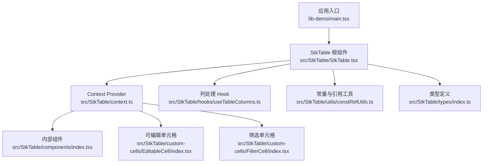
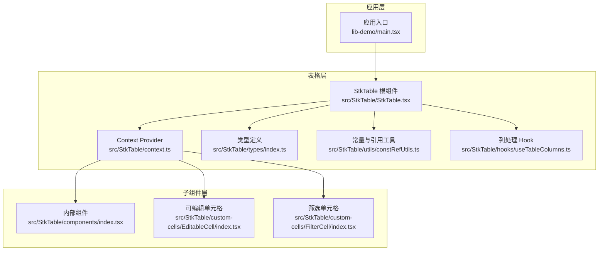
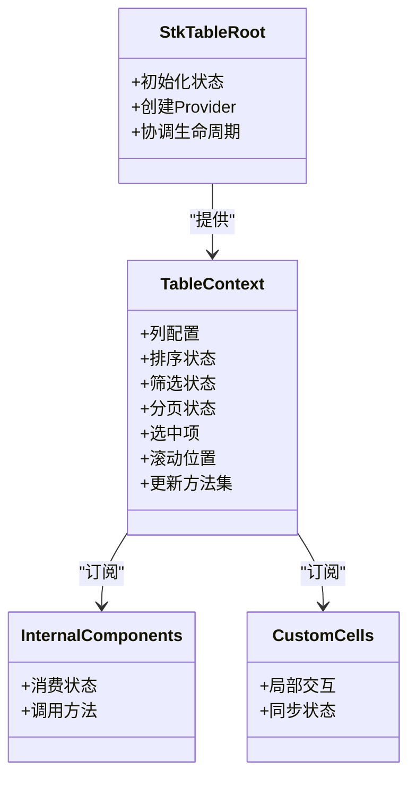
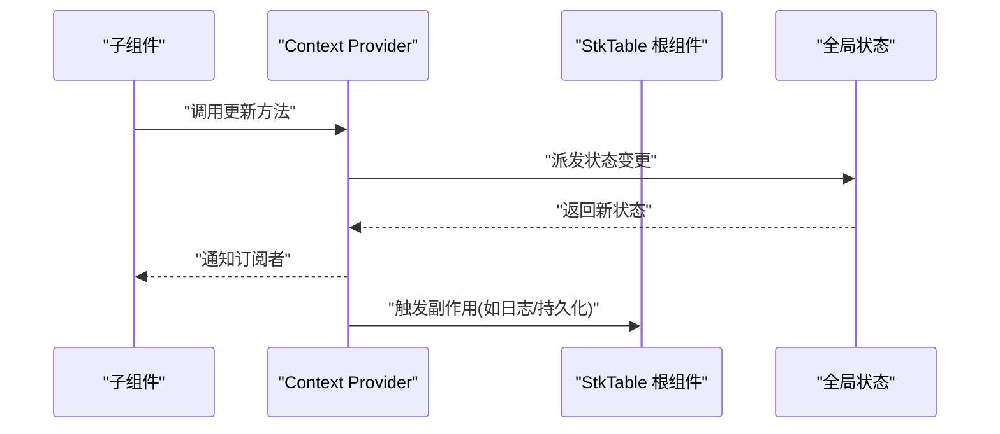
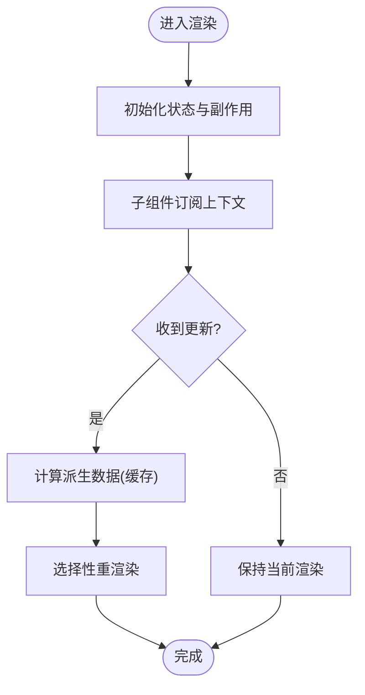
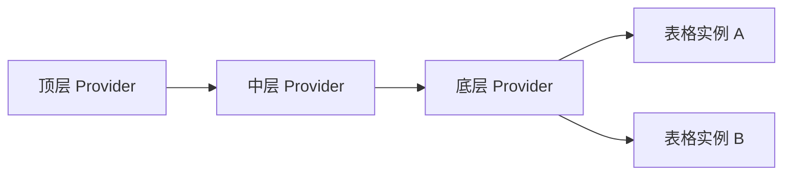
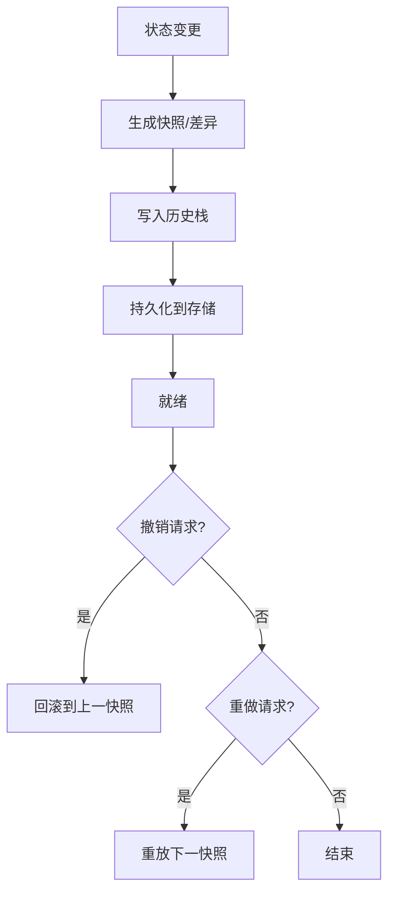
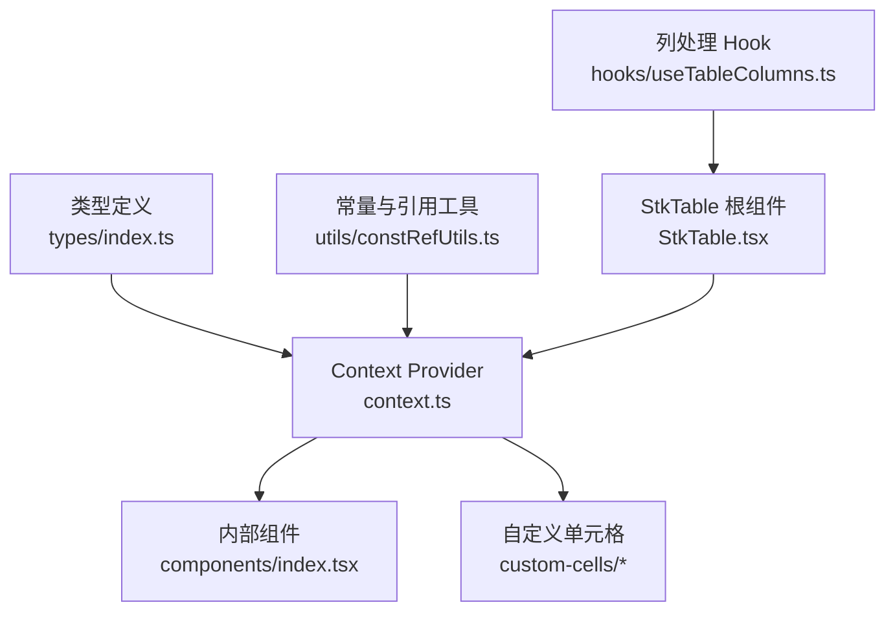

# 上下文架构

<cite>
**本文引用的文件**   
- [src/StkTable/context.ts](file://src/StkTable/context.ts)
- [src/StkTable/StkTable.tsx](file://src/StkTable/StkTable.tsx)
- [src/StkTable/components/index.tsx](file://src/StkTable/components/index.tsx)
- [src/StkTable/custom-cells/EditableCell/index.tsx](file://src/StkTable/custom-cells/EditableCell/index.tsx)
- [src/StkTable/custom-cells/FilterCell/index.tsx](file://src/StkTable/custom-cells/FilterCell/index.tsx)
- [src/StkTable/hooks/useTableColumns.ts](file://src/StkTable/hooks/useTableColumns.ts)
- [src/StkTable/utils/constRefUtils.ts](file://src/StkTable/utils/constRefUtils.ts)
- [src/StkTable/types/index.ts](file://src/StkTable/types/index.ts)
- [lib-demo/main.tsx](file://lib-demo/main.tsx)
</cite>

## 目录
1. [简介](#简介)
2. [项目结构](#项目结构)
3. [核心组件](#核心组件)
4. [架构总览](#架构总览)
5. [详细组件分析](#详细组件分析)
6. [依赖关系分析](#依赖关系分析)
7. [性能考虑](#性能考虑)
8. [故障排查指南](#故障排查指南)
9. [结论](#结论)
10. [附录](#附录)

## 简介
本文件聚焦于 StkTable 的上下文（Context）架构设计与状态管理模式，系统性阐述全局状态的组织与共享、组件间通信与依赖注入、状态更新生命周期与重渲染优化策略、Provider 层次与作用域管理、以及可扩展的状态持久化、撤销重做与版本管理方案。文档同时提供架构图与数据流图，帮助读者快速理解复杂交互关系，并给出性能调优、调试工具与测试策略建议，以及扩展指南与设计模式最佳实践。

## 项目结构
围绕上下文与状态管理的核心代码主要位于 src/StkTable 目录：
- context.ts：定义表格 Context 类型与 Provider 实现，集中暴露全局状态与操作方法
- StkTable.tsx：根组件，负责初始化状态、组装 Provider、挂载子树与事件协调
- components/index.tsx：内部子组件集合，通过 Context 消费状态与方法
- custom-cells/*：内置单元格组件，演示如何通过 Context 进行局部交互与状态同步
- hooks/useTableColumns.ts：列配置处理 Hook，辅助计算与缓存列元信息
- utils/constRefUtils.ts：常量与引用稳定化工具，降低不必要的重渲染
- types/index.ts：公共类型定义，约束 Context 数据结构与 API 契约
- lib-demo/main.tsx：示例入口，展示如何包裹 Provider 使用表格

图表来源
- [lib-demo/main.tsx](file://lib-demo/main.tsx)
- [src/StkTable/StkTable.tsx](file://src/StkTable/StkTable.tsx)
- [src/StkTable/context.ts](file://src/StkTable/context.ts)
- [src/StkTable/components/index.tsx](file://src/StkTable/components/index.tsx)
- [src/StkTable/custom-cells/EditableCell/index.tsx](file://src/StkTable/custom-cells/EditableCell/index.tsx)
- [src/StkTable/custom-cells/FilterCell/index.tsx](file://src/StkTable/custom-cells/FilterCell/index.tsx)
- [src/StkTable/hooks/useTableColumns.ts](file://src/StkTable/hooks/useTableColumns.ts)
- [src/StkTable/utils/constRefUtils.ts](file://src/StkTable/utils/constRefUtils.ts)
- [src/StkTable/types/index.ts](file://src/StkTable/types/index.ts)

章节来源
- [src/StkTable/context.ts](file://src/StkTable/context.ts)
- [src/StkTable/StkTable.tsx](file://src/StkTable/StkTable.tsx)
- [src/StkTable/components/index.tsx](file://src/StkTable/components/index.tsx)
- [src/StkTable/custom-cells/EditableCell/index.tsx](file://src/StkTable/custom-cells/EditableCell/index.tsx)
- [src/StkTable/custom-cells/FilterCell/index.tsx](file://src/StkTable/custom-cells/FilterCell/index.tsx)
- [src/StkTable/hooks/useTableColumns.ts](file://src/StkTable/hooks/useTableColumns.ts)
- [src/StkTable/utils/constRefUtils.ts](file://src/StkTable/utils/constRefUtils.ts)
- [src/StkTable/types/index.ts](file://src/StkTable/types/index.ts)
- [lib-demo/main.tsx](file://lib-demo/main.tsx)

## 核心组件
- Context Provider
  - 职责：集中维护表格全局状态（如列配置、排序、筛选、分页、选中项等），并提供统一的方法接口供子组件调用
  - 设计要点：将状态与操作函数打包为对象，通过 React Context 向下传递；对频繁变化的状态进行细粒度拆分，避免整棵子树重渲染
- StkTable 根组件
  - 职责：初始化状态、创建 Provider、组合内部组件、处理外部 props 与内部状态的双向绑定
  - 设计要点：在根层完成副作用与事件订阅，确保上下文一致性；对外暴露稳定的方法以支持命令式调用
- 内部组件与自定义单元格
  - 职责：消费 Context 中的状态与方法，执行局部交互（如编辑、筛选、排序）
  - 设计要点：通过最小依赖订阅减少重渲染范围；必要时使用 memo 或 useMemo/useCallback 稳定引用

章节来源
- [src/StkTable/context.ts](file://src/StkTable/context.ts)
- [src/StkTable/StkTable.tsx](file://src/StkTable/StkTable.tsx)
- [src/StkTable/components/index.tsx](file://src/StkTable/components/index.tsx)
- [src/StkTable/custom-cells/EditableCell/index.tsx](file://src/StkTable/custom-cells/EditableCell/index.tsx)
- [src/StkTable/custom-cells/FilterCell/index.tsx](file://src/StkTable/custom-cells/FilterCell/index.tsx)

## 架构总览
下图展示了基于 Context 的表格状态管理与组件交互的整体架构。Provider 作为单一事实源，向下分发状态与操作；子组件按需订阅，并通过方法触发状态变更；根组件协调生命周期与副作用。

图表来源
- [lib-demo/main.tsx](file://lib-demo/main.tsx)
- [src/StkTable/StkTable.tsx](file://src/StkTable/StkTable.tsx)
- [src/StkTable/context.ts](file://src/StkTable/context.ts)
- [src/StkTable/components/index.tsx](file://src/StkTable/components/index.tsx)
- [src/StkTable/custom-cells/EditableCell/index.tsx](file://src/StkTable/custom-cells/EditableCell/index.tsx)
- [src/StkTable/custom-cells/FilterCell/index.tsx](file://src/StkTable/custom-cells/FilterCell/index.tsx)
- [src/StkTable/types/index.ts](file://src/StkTable/types/index.ts)
- [src/StkTable/utils/constRefUtils.ts](file://src/StkTable/utils/constRefUtils.ts)
- [src/StkTable/hooks/useTableColumns.ts](file://src/StkTable/hooks/useTableColumns.ts)

## 详细组件分析

### Context Provider 与全局状态
- 状态组织
  - 将表格相关的全局状态按领域划分（如列、排序、筛选、分页、选中项、滚动位置等），每个领域独立切片，便于细粒度订阅与增量更新
  - 通过统一的 reducer 或状态更新函数聚合变更，保证状态转换的可预测性与可追踪性
- 依赖注入
  - 将方法集合作为依赖注入到 Context，子组件无需直接访问父级 props，降低耦合度
  - 对需要跨层级共享的配置（如主题、国际化、虚拟列表参数）也通过 Context 注入，形成清晰的依赖边界
- 作用域管理
  - 支持嵌套 Provider，内层 Provider 可覆盖外层配置，实现局部作用域的状态隔离与复用
  - 通过 key 或命名空间区分不同表格实例，避免多表场景下的状态污染

图表来源
- [src/StkTable/context.ts](file://src/StkTable/context.ts)
- [src/StkTable/StkTable.tsx](file://src/StkTable/StkTable.tsx)
- [src/StkTable/components/index.tsx](file://src/StkTable/components/index.tsx)
- [src/StkTable/custom-cells/EditableCell/index.tsx](file://src/StkTable/custom-cells/EditableCell/index.tsx)
- [src/StkTable/custom-cells/FilterCell/index.tsx](file://src/StkTable/custom-cells/FilterCell/index.tsx)

章节来源
- [src/StkTable/context.ts](file://src/StkTable/context.ts)
- [src/StkTable/StkTable.tsx](file://src/StkTable/StkTable.tsx)

### 组件间通信与依赖注入
- 通信模式
  - 命令式调用：子组件通过 Context 暴露的方法触发状态变更，适合表单提交、批量操作等场景
  - 响应式订阅：子组件仅订阅所需字段，自动响应上游变化，适合展示型组件
- 依赖注入
  - 将方法集与配置对象合并为稳定的上下文值，避免每次渲染产生新引用导致不必要重渲染
  - 对高频回调使用 useCallback 稳定化，结合 memo 与 useMemo 控制重渲染范围

图表来源
- [src/StkTable/context.ts](file://src/StkTable/context.ts)
- [src/StkTable/StkTable.tsx](file://src/StkTable/StkTable.tsx)

章节来源
- [src/StkTable/context.ts](file://src/StkTable/context.ts)
- [src/StkTable/components/index.tsx](file://src/StkTable/components/index.tsx)
- [src/StkTable/custom-cells/EditableCell/index.tsx](file://src/StkTable/custom-cells/EditableCell/index.tsx)
- [src/StkTable/custom-cells/FilterCell/index.tsx](file://src/StkTable/custom-cells/FilterCell/index.tsx)

### 状态更新生命周期与重渲染优化
- 生命周期
  - 初始化：根组件根据 props 与默认值构建初始状态，注册事件监听与副作用
  - 更新：子组件通过方法触发变更，Provider 聚合更新并广播给订阅者
  - 销毁：清理定时器、事件监听与中间态，防止内存泄漏
- 重渲染优化
  - 细粒度订阅：子组件仅订阅必要字段，避免整树重渲染
  - 引用稳定化：使用 constRefUtils 提供的工具稳定常量与引用，减少比较开销
  - 计算缓存：列配置与派生数据通过 useMemo 缓存，避免重复计算

图表来源
- [src/StkTable/StkTable.tsx](file://src/StkTable/StkTable.tsx)
- [src/StkTable/utils/constRefUtils.ts](file://src/StkTable/utils/constRefUtils.ts)
- [src/StkTable/hooks/useTableColumns.ts](file://src/StkTable/hooks/useTableColumns.ts)

章节来源
- [src/StkTable/StkTable.tsx](file://src/StkTable/StkTable.tsx)
- [src/StkTable/utils/constRefUtils.ts](file://src/StkTable/utils/constRefUtils.ts)
- [src/StkTable/hooks/useTableColumns.ts](file://src/StkTable/hooks/useTableColumns.ts)

### Provider 层次结构与作用域管理
- 层次结构
  - 顶层 Provider：提供全局默认配置与通用方法
  - 中层 Provider：针对特定功能域（如筛选、排序）提供局部覆盖
  - 底层 Provider：针对具体表格实例或区域提供最小作用域配置
- 作用域管理
  - 通过 key 或命名空间区分实例，避免多表冲突
  - 内层 Provider 可继承并覆盖外层配置，形成清晰的作用域链

[此图为概念示意，不直接映射具体源码文件]

### 状态持久化、撤销重做与版本管理
- 持久化
  - 在状态变更后，将关键状态序列化并写入本地存储或后端服务
  - 启动时从持久化源恢复状态，确保用户会话连续性
- 撤销重做
  - 维护操作历史栈，记录每次变更的快照或差异
  - 提供 undo/redo 方法，支持回滚与重放
- 版本管理
  - 为状态结构添加版本号，迁移脚本在升级时自动转换旧格式
  - 兼容多版本读取，保障向后兼容

[此图为概念示意，不直接映射具体源码文件]

## 依赖关系分析
- 组件耦合与内聚
  - Context Provider 高内聚地管理状态与方法，子组件低耦合地消费，提升可维护性
- 直接与间接依赖
  - 根组件依赖类型定义与工具函数；子组件依赖 Context 与工具函数
- 外部依赖与集成点
  - 本地存储、网络请求、第三方库可通过 Provider 注入，形成清晰的集成边界
- 接口契约与实现细节
  - 类型定义明确上下文结构与 API 契约，约束实现细节，便于替换与扩展

图表来源
- [src/StkTable/types/index.ts](file://src/StkTable/types/index.ts)
- [src/StkTable/context.ts](file://src/StkTable/context.ts)
- [src/StkTable/utils/constRefUtils.ts](file://src/StkTable/utils/constRefUtils.ts)
- [src/StkTable/hooks/useTableColumns.ts](file://src/StkTable/hooks/useTableColumns.ts)
- [src/StkTable/StkTable.tsx](file://src/StkTable/StkTable.tsx)
- [src/StkTable/components/index.tsx](file://src/StkTable/components/index.tsx)
- [src/StkTable/custom-cells/EditableCell/index.tsx](file://src/StkTable/custom-cells/EditableCell/index.tsx)
- [src/StkTable/custom-cells/FilterCell/index.tsx](file://src/StkTable/custom-cells/FilterCell/index.tsx)

章节来源
- [src/StkTable/types/index.ts](file://src/StkTable/types/index.ts)
- [src/StkTable/context.ts](file://src/StkTable/context.ts)
- [src/StkTable/utils/constRefUtils.ts](file://src/StkTable/utils/constRefUtils.ts)
- [src/StkTable/hooks/useTableColumns.ts](file://src/StkTable/hooks/useTableColumns.ts)
- [src/StkTable/StkTable.tsx](file://src/StkTable/StkTable.tsx)
- [src/StkTable/components/index.tsx](file://src/StkTable/components/index.tsx)
- [src/StkTable/custom-cells/EditableCell/index.tsx](file://src/StkTable/custom-cells/EditableCell/index.tsx)
- [src/StkTable/custom-cells/FilterCell/index.tsx](file://src/StkTable/custom-cells/FilterCell/index.tsx)

## 性能考虑
- 细粒度订阅与选择性重渲染
  - 子组件仅订阅必要字段，避免整树重渲染
- 引用稳定化与计算缓存
  - 使用工具函数稳定常量与回调，结合 useMemo/useCallback 减少比较开销
- 批处理与节流
  - 对高频输入（如滚动、搜索）采用批处理与节流策略，降低更新频率
- 虚拟化与懒加载
  - 大数据场景下启用行/列虚拟化，按需渲染可见区域
- 副作用隔离
  - 将副作用集中在根组件或专用 Hook，避免分散导致的重复执行

[本节为通用指导，不直接分析具体文件]

## 故障排查指南
- 常见问题定位
  - 检查 Context 是否被正确包裹，确认 Provider 层次与作用域
  - 验证订阅字段是否精确，避免过度订阅导致重渲染
  - 审查方法引用是否稳定，防止因引用变化触发不必要更新
- 调试工具
  - 使用浏览器开发者工具的 React DevTools 观察组件树与状态变化
  - 在 Provider 中插入日志钩子，记录关键状态变更与调用栈
- 测试策略
  - 单元测试：模拟 Context 提供者，断言子组件行为与状态更新
  - 集成测试：端到端验证 Provider 层次、撤销重做与持久化流程
  - 性能测试：基准测试大表格渲染与交互性能，识别瓶颈

章节来源
- [src/StkTable/context.ts](file://src/StkTable/context.ts)
- [src/StkTable/StkTable.tsx](file://src/StkTable/StkTable.tsx)

## 结论
StkTable 的上下文架构通过 Provider 集中管理全局状态与方法，配合细粒度订阅与引用稳定化策略，实现了高效、可维护的状态管理模式。通过层次化的 Provider 与作用域管理，系统具备良好的扩展性与隔离性。在此基础上，可进一步引入持久化、撤销重做与版本管理，以满足复杂业务需求。建议在开发中遵循最小订阅、稳定引用与副作用隔离的原则，并结合调试与测试手段保障质量与性能。

[本节为总结性内容，不直接分析具体文件]

## 附录
- 扩展指南
  - 新增状态字段：在类型定义中声明，并在 Provider 中初始化与更新
  - 新增方法：在 Provider 中实现并暴露，确保引用稳定
  - 新增 Provider 层次：在合适层级包裹，覆盖局部配置
- 设计模式最佳实践
  - 组合优于继承：通过 Provider 组合能力，避免深层继承链
  - 单一事实源：所有状态变更经由 Provider 统一管理，保证一致性
  - 关注点分离：将副作用与业务逻辑解耦，提升可测试性

[本节为通用指导，不直接分析具体文件]