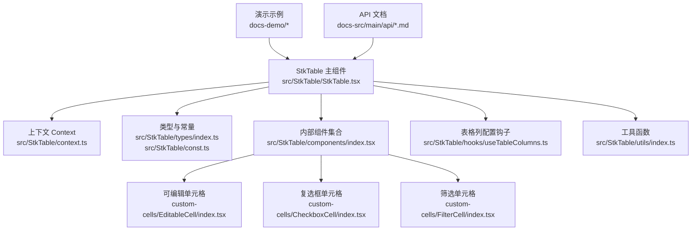
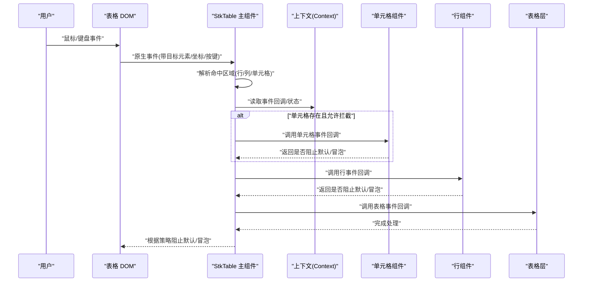
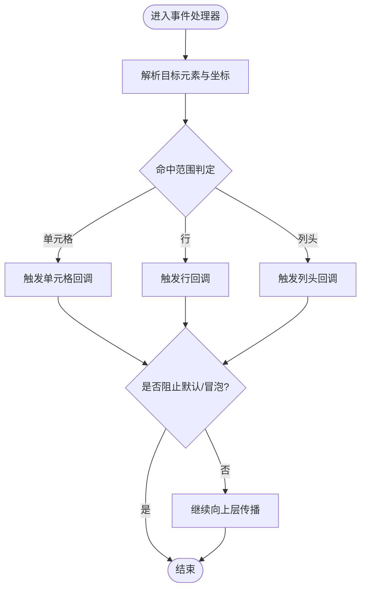
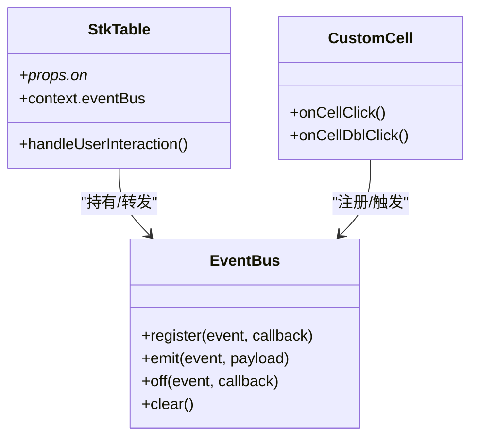
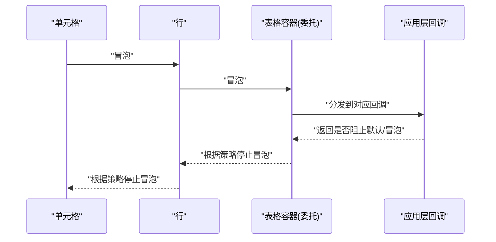
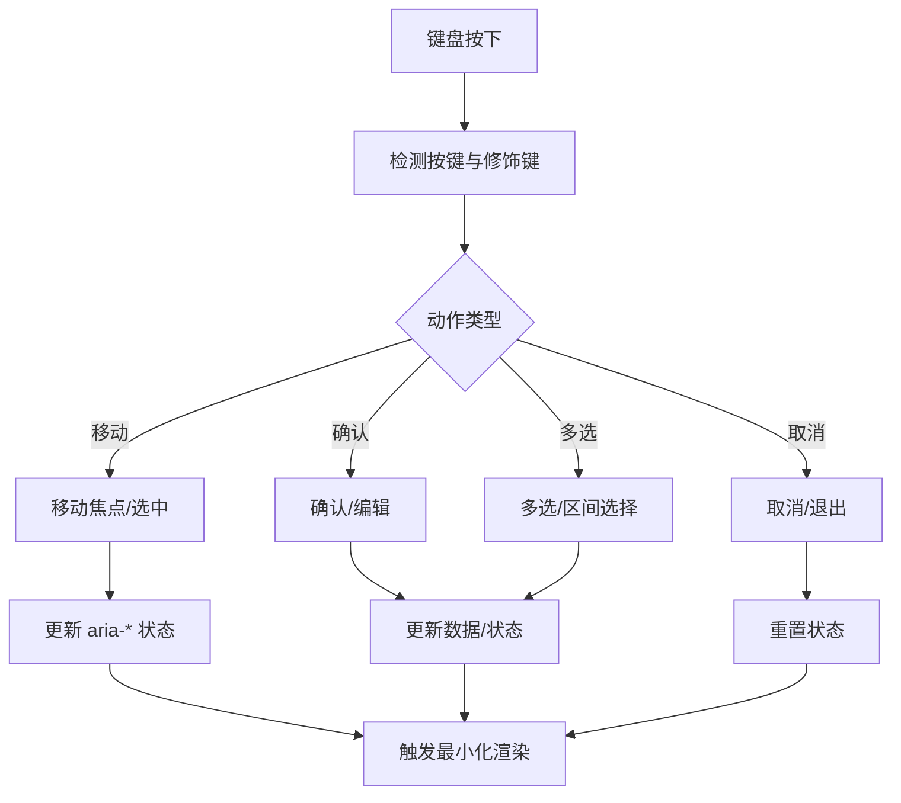
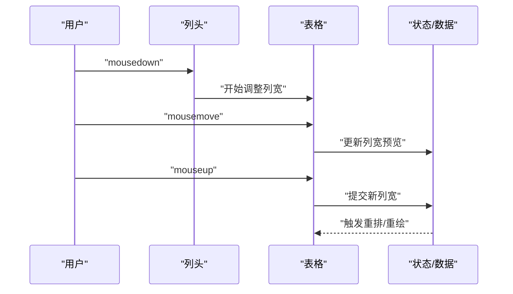
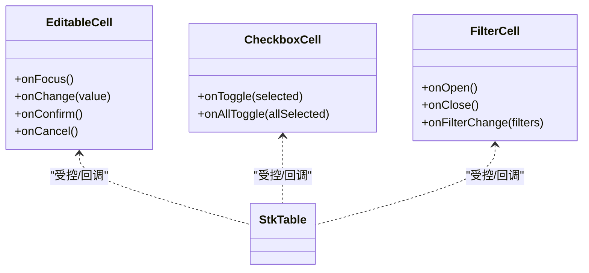
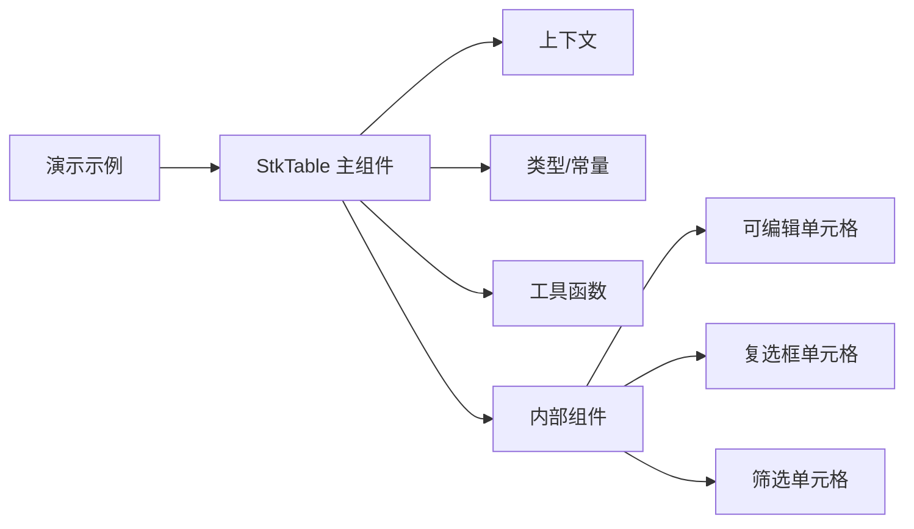

# 事件处理机制

<cite>
**本文引用的文件**   
- [StkTable.tsx](file://src/StkTable/StkTable.tsx)
- [index.ts](file://src/StkTable/index.ts)
- [context.ts](file://src/StkTable/context.ts)
- [types/index.ts](file://src/StkTable/types/index.ts)
- [components/index.tsx](file://src/StkTable/components/index.tsx)
- [custom-cells/EditableCell/index.tsx](file://src/StkTable/custom-cells/EditableCell/index.tsx)
- [custom-cells/CheckboxCell/index.tsx](file://src/StkTable/custom-cells/CheckboxCell/index.tsx)
- [custom-cells/FilterCell/index.tsx](file://src/StkTable/custom-cells/FilterCell/index.tsx)
- [hooks/useTableColumns.ts](file://src/StkTable/hooks/useTableColumns.ts)
- [utils/index.ts](file://src/StkTable/utils/index.ts)
- [const.ts](file://src/StkTable/const.ts)
- [RowCellHoverSelect.tsx](file://docs-demo/basic/row-cell-mouse-event/RowCellHoverSelect.tsx)
- [AreaSelection.tsx](file://docs-demo/advanced/area-selection/AreaSelection.tsx)
- [ColResizable.tsx](file://docs-demo/advanced/column-resize/ColResizable.tsx)
- [HeaderDrag.tsx](file://docs-demo/advanced/header-drag/HeaderDrag.tsx)
- [RowDrag.tsx](file://docs-demo/advanced/row-drag/RowDrag.tsx)
- [CustomSort/index.tsx](file://docs-demo/advanced/custom-sort/CustomSort/index.tsx)
- [HighlightBase.tsx](file://docs-demo/advanced/highlight/HighlightBase.tsx)
- [event.ts](file://docs-demo/demos/HugeData/event.ts)
- [api/emits.md](file://docs-src/main/api/emits.md)
- [table-props.md](file://docs-src/main/api/table-props.md)
</cite>

## 目录
1. [简介](#简介)
2. [项目结构](#项目结构)
3. [核心组件](#核心组件)
4. [架构总览](#架构总览)
5. [详细组件分析](#详细组件分析)
6. [依赖分析](#依赖分析)
7. [性能考虑](#性能考虑)
8. [故障排查指南](#故障排查指南)
9. [结论](#结论)
10. [附录](#附录)

## 简介
本文件系统性阐述 StkTable 的事件处理系统与交互机制，覆盖内置事件触发时机、参数传递与回调设计；用户交互（点击、双击、悬停等）的处理流程；自定义事件的注册与分发；事件冒泡、阻止默认行为与事件委托的实现思路；键盘导航与无障碍支持；复杂交互场景示例；以及性能优化、内存泄漏防护与调试技巧。文档同时提供扩展指南与最佳实践建议，帮助读者在大型表格中构建稳定、可维护的交互体验。

## 项目结构
围绕事件系统的关键代码主要分布在以下位置：
- 表格主入口与上下文：src/StkTable/StkTable.tsx、src/StkTable/context.ts
- 类型定义与常量：src/StkTable/types/index.ts、src/StkTable/const.ts
- 内部组件与钩子：src/StkTable/components/index.tsx、src/StkTable/hooks/useTableColumns.ts
- 工具函数：src/StkTable/utils/index.ts
- 内置单元格（含交互）：src/StkTable/custom-cells/EditableCell/index.tsx、CheckboxCell/index.tsx、FilterCell/index.tsx
- 演示与示例：docs-demo 下多个交互示例，如行/列拖拽、区域选择、排序、高亮等
- API 文档：docs-src/main/api/emits.md、docs-src/main/api/table-props.md

图表来源
- [StkTable.tsx:1-200](file://src/StkTable/StkTable.tsx#L1-L200)
- [context.ts:1-200](file://src/StkTable/context.ts#L1-L200)
- [types/index.ts:1-200](file://src/StkTable/types/index.ts#L1-L200)
- [const.ts:1-200](file://src/StkTable/const.ts#L1-L200)
- [components/index.tsx:1-200](file://src/StkTable/components/index.tsx#L1-L200)
- [useTableColumns.ts:1-200](file://src/StkTable/hooks/useTableColumns.ts#L1-L200)
- [utils/index.ts:1-200](file://src/StkTable/utils/index.ts#L1-L200)
- [EditableCell/index.tsx:1-200](file://src/StkTable/custom-cells/EditableCell/index.tsx#L1-L200)
- [CheckboxCell/index.tsx:1-200](file://src/StkTable/custom-cells/CheckboxCell/index.tsx#L1-L200)
- [FilterCell/index.tsx:1-200](file://src/StkTable/custom-cells/FilterCell/index.tsx#L1-L200)

章节来源
- [StkTable.tsx:1-200](file://src/StkTable/StkTable.tsx#L1-L200)
- [index.ts](file://src/StkTable/index.ts)

## 核心组件
- 表格主组件负责：
  - 接收并转发用户交互事件（行/列/单元格级别），统一派发至上层回调或状态管理。
  - 通过上下文向子组件注入事件总线、选中态、排序/筛选状态等。
  - 协调虚拟滚动、固定列、合并单元格等特性下的事件命中与坐标计算。
- 上下文对象集中暴露：
  - 事件回调集合（如行点击、行双击、单元格点击、悬停、键盘导航等）。
  - 当前选中项、展开项、排序/筛选状态及更新方法。
  - 渲染辅助能力（如获取行列索引、数据映射、样式类名等）。
- 类型与常量：
  - 定义事件名称、事件参数结构、回调签名、可选开关等。
  - 提供默认值与边界条件常量，确保事件处理一致性与健壮性。

章节来源
- [StkTable.tsx:1-200](file://src/StkTable/StkTable.tsx#L1-L200)
- [context.ts:1-200](file://src/StkTable/context.ts#L1-L200)
- [types/index.ts:1-200](file://src/StkTable/types/index.ts#L1-L200)
- [const.ts:1-200](file://src/StkTable/const.ts#L1-L200)

## 架构总览
下图展示事件从 DOM 到业务层的典型路径：DOM 事件被捕获后，由表格内部处理器进行归一化（解析行列信息、目标元素、修饰键等），随后按优先级触发对应回调（如先触发单元格级，再行级，最后表级），并在必要时阻止默认行为或中断冒泡。

图表来源
- [StkTable.tsx:1-200](file://src/StkTable/StkTable.tsx#L1-L200)
- [context.ts:1-200](file://src/StkTable/context.ts#L1-L200)

## 详细组件分析

### 用户交互事件处理流程（点击、双击、悬停）
- 点击/双击：
  - 通过 mousedown/click 与 dblclick 区分单击与双击。
  - 解析目标元素归属（单元格/行/列头/复选框等），确定事件作用域。
  - 依次触发单元格、行、表级别的回调；若单元格或行回调标记阻止默认行为，则终止后续传播。
- 悬停：
  - 使用 mouseenter/mouseleave 或 mouseover/mouseout 配合防抖/节流，避免频繁重渲染。
  - 将悬停的行/列/单元格标识写入上下文，供高亮、提示等消费。
- 参数传递：
  - 事件对象、行列索引、数据记录、目标元素、修饰键（Shift/Ctrl/Alt）等作为标准参数传入回调。
  - 对虚拟滚动场景，需将可视区坐标转换为逻辑行列索引。

图表来源
- [StkTable.tsx:1-200](file://src/StkTable/StkTable.tsx#L1-L200)
- [RowCellHoverSelect.tsx:1-200](file://docs-demo/basic/row-cell-mouse-event/RowCellHoverSelect.tsx#L1-L200)

章节来源
- [StkTable.tsx:1-200](file://src/StkTable/StkTable.tsx#L1-L200)
- [RowCellHoverSelect.tsx:1-200](file://docs-demo/basic/row-cell-mouse-event/RowCellHoverSelect.tsx#L1-L200)

### 自定义事件注册与分发
- 注册：
  - 通过 props 或上下文暴露的注册接口，为特定事件名绑定回调。
  - 支持一次性回调与持久监听两种模式。
- 分发：
  - 内部维护事件映射表，按事件名查找并顺序执行回调。
  - 支持同步与异步回调，提供错误隔离与日志上报。
- 取消订阅：
  - 提供注销接口，在组件卸载或功能切换时清理监听，防止内存泄漏。

图表来源
- [context.ts:1-200](file://src/StkTable/context.ts#L1-L200)
- [StkTable.tsx:1-200](file://src/StkTable/StkTable.tsx#L1-L200)
- [EditableCell/index.tsx:1-200](file://src/StkTable/custom-cells/EditableCell/index.tsx#L1-L200)

章节来源
- [context.ts:1-200](file://src/StkTable/context.ts#L1-L200)
- [StkTable.tsx:1-200](file://src/StkTable/StkTable.tsx#L1-L200)

### 事件冒泡、阻止默认行为与事件委托
- 冒泡控制：
  - 在单元格/行/表层级设置统一的传播策略，允许上层覆盖下层行为。
  - 提供“是否允许冒泡”的配置项，便于按需关闭。
- 阻止默认行为：
  - 针对右键菜单、文本选择、链接跳转等场景，可在回调中返回标志位以阻止浏览器默认动作。
- 事件委托：
  - 在表格容器上统一监听，依据 target 与 data-* 属性定位具体元素，减少监听器数量，提升性能。

图表来源
- [StkTable.tsx:1-200](file://src/StkTable/StkTable.tsx#L1-L200)
- [utils/index.ts:1-200](file://src/StkTable/utils/index.ts#L1-L200)

章节来源
- [StkTable.tsx:1-200](file://src/StkTable/StkTable.tsx#L1-L200)
- [utils/index.ts:1-200](file://src/StkTable/utils/index.ts#L1-L200)

### 键盘导航与无障碍支持
- 键盘导航：
  - 支持方向键移动焦点、Enter/Space 确认、Esc 取消、Tab 切换区域等。
  - 在虚拟滚动场景下，保持焦点可见与滚动同步。
- 无障碍：
  - 为关键元素提供 role、aria-* 属性（如 aria-selected、aria-expanded、aria-label）。
  - 保证屏幕阅读器可读性与操作可达性。
- 组合键：
  - 支持 Ctrl/Cmd 多选、Shift 区间选择、Alt 快速操作等。

图表来源
- [StkTable.tsx:1-200](file://src/StkTable/StkTable.tsx#L1-L200)
- [context.ts:1-200](file://src/StkTable/context.ts#L1-L200)

章节来源
- [StkTable.tsx:1-200](file://src/StkTable/StkTable.tsx#L1-L200)
- [context.ts:1-200](file://src/StkTable/context.ts#L1-L200)

### 复杂交互场景示例
- 行/列拖拽：
  - 使用 mousedown/mousemove/mouseup 序列，结合 dragstart/dragover/drop 实现拖放。
  - 在拖拽过程中更新预览与落点指示，提交时交换或插入数据。
- 区域选择：
  - 基于鼠标按下与移动计算矩形区域，批量更新选中态。
- 列宽调整：
  - 监听头部拖拽，实时计算新宽度并应用到列配置。
- 自定义排序：
  - 在列头点击事件中接入自定义比较器，支持多列排序与远程排序。
- 高亮动画：
  - 在行/单元格事件中标记高亮，配合 CSS 过渡实现视觉反馈。

图表来源
- [ColResizable.tsx:1-200](file://docs-demo/advanced/column-resize/ColResizable.tsx#L1-L200)
- [HeaderDrag.tsx:1-200](file://docs-demo/advanced/header-drag/HeaderDrag.tsx#L1-L200)
- [AreaSelection.tsx:1-200](file://docs-demo/advanced/area-selection/AreaSelection.tsx#L1-L200)
- [RowDrag.tsx:1-200](file://docs-demo/advanced/row-drag/RowDrag.tsx#L1-L200)
- [CustomSort/index.tsx:1-200](file://docs-demo/advanced/custom-sort/CustomSort/index.tsx#L1-L200)
- [HighlightBase.tsx:1-200](file://docs-demo/advanced/highlight/HighlightBase.tsx#L1-L200)

章节来源
- [ColResizable.tsx:1-200](file://docs-demo/advanced/column-resize/ColResizable.tsx#L1-L200)
- [HeaderDrag.tsx:1-200](file://docs-demo/advanced/header-drag/HeaderDrag.tsx#L1-L200)
- [AreaSelection.tsx:1-200](file://docs-demo/advanced/area-selection/AreaSelection.tsx#L1-L200)
- [RowDrag.tsx:1-200](file://docs-demo/advanced/row-drag/RowDrag.tsx#L1-L200)
- [CustomSort/index.tsx:1-200](file://docs-demo/advanced/custom-sort/CustomSort/index.tsx#L1-L200)
- [HighlightBase.tsx:1-200](file://docs-demo/advanced/highlight/HighlightBase.tsx#L1-L200)

### 内置单元格的事件处理
- 可编辑单元格：
  - 聚焦/失焦、输入变更、回车确认、Esc 取消等行为封装为统一回调。
  - 与表格的选中态、撤销/重做、校验规则集成。
- 复选框单元格：
  - 单选/多选、全选联动、禁用态处理。
- 筛选单元格：
  - 下拉面板打开/关闭、筛选条件变更、清空筛选等。

图表来源
- [EditableCell/index.tsx:1-200](file://src/StkTable/custom-cells/EditableCell/index.tsx#L1-L200)
- [CheckboxCell/index.tsx:1-200](file://src/StkTable/custom-cells/CheckboxCell/index.tsx#L1-L200)
- [FilterCell/index.tsx:1-200](file://src/StkTable/custom-cells/FilterCell/index.tsx#L1-L200)

章节来源
- [EditableCell/index.tsx:1-200](file://src/StkTable/custom-cells/EditableCell/index.tsx#L1-L200)
- [CheckboxCell/index.tsx:1-200](file://src/StkTable/custom-cells/CheckboxCell/index.tsx#L1-L200)
- [FilterCell/index.tsx:1-200](file://src/StkTable/custom-cells/FilterCell/index.tsx#L1-L200)

## 依赖分析
- 组件耦合：
  - 主组件与上下文强耦合，用于共享事件回调与状态。
  - 单元格组件通过上下文访问全局事件总线与状态，降低直接依赖。
- 外部依赖：
  - 演示示例依赖 React 事件模型与 DOM API。
  - 工具函数提供通用事件处理与坐标转换。
- 潜在循环依赖：
  - 通过上下文与工具函数解耦，避免组件间直接相互引用。

图表来源
- [StkTable.tsx:1-200](file://src/StkTable/StkTable.tsx#L1-L200)
- [context.ts:1-200](file://src/StkTable/context.ts#L1-L200)
- [types/index.ts:1-200](file://src/StkTable/types/index.ts#L1-L200)
- [utils/index.ts:1-200](file://src/StkTable/utils/index.ts#L1-L200)
- [components/index.tsx:1-200](file://src/StkTable/components/index.tsx#L1-L200)

章节来源
- [StkTable.tsx:1-200](file://src/StkTable/StkTable.tsx#L1-L200)
- [context.ts:1-200](file://src/StkTable/context.ts#L1-L200)
- [types/index.ts:1-200](file://src/StkTable/types/index.ts#L1-L200)
- [utils/index.ts:1-200](file://src/StkTable/utils/index.ts#L1-L200)
- [components/index.tsx:1-200](file://src/StkTable/components/index.tsx#L1-L200)

## 性能考虑
- 事件委托：
  - 在容器层统一监听，减少大量子节点监听器，降低内存占用与事件分发开销。
- 防抖/节流：
  - 对高频事件（mousemove、scroll、resize）采用节流或防抖，避免频繁重渲染。
- 最小化更新：
  - 仅更新受影响的状态片段，利用 React 的细粒度更新与 key 优化。
- 虚拟滚动协同：
  - 将事件坐标转换为逻辑索引，避免全量遍历；在滚动过程中暂停非关键事件处理。
- 内存泄漏防护：
  - 在组件卸载时移除所有事件监听与定时器；注销自定义事件订阅。
- 调试技巧：
  - 为事件处理器添加结构化日志（事件名、目标、时间戳、耗时）；
  - 使用浏览器性能面板录制事件流，定位瓶颈；
  - 在开发环境开启严格模式，检查重复订阅与副作用。

[本节为通用指导，不直接分析具体文件]

## 故障排查指南
- 常见问题：
  - 事件未触发：检查目标元素是否正确命中、是否被其他元素遮挡、是否被阻止冒泡。
  - 默认行为未阻止：确认回调返回值或调用相应 API 正确设置。
  - 虚拟滚动坐标异常：验证坐标转换逻辑与可视区边界。
  - 内存泄漏：确认组件卸载时清理事件监听与定时器。
- 定位步骤：
  - 在事件入口处打印事件对象与目标元素；
  - 逐步缩小范围，判断问题发生在单元格、行还是表层；
  - 使用断点与性能面板观察事件链路与渲染次数。

章节来源
- [StkTable.tsx:1-200](file://src/StkTable/StkTable.tsx#L1-L200)
- [utils/index.ts:1-200](file://src/StkTable/utils/index.ts#L1-L200)

## 结论
StkTable 的事件系统以上下文为核心，结合事件委托与分层回调，实现了高效、可扩展的用户交互处理。通过合理的冒泡控制、默认行为管理与键盘无障碍支持，能够在复杂场景中提供一致的交互体验。遵循本文的性能优化与调试建议，可有效提升稳定性与可维护性。

[本节为总结，不直接分析具体文件]

## 附录
- API 参考：
  - 事件回调列表与参数说明见 emits 文档。
  - 表格属性与开关见 table-props 文档。
- 示例参考：
  - 行/列拖拽、区域选择、排序、高亮等示例位于 docs-demo 目录。
  - 大数据场景事件处理示例见 HugeData/event.ts。

章节来源
- [api/emits.md](file://docs-src/main/api/emits.md)
- [table-props.md](file://docs-src/main/api/table-props.md)
- [event.ts](file://docs-demo/demos/HugeData/event.ts)